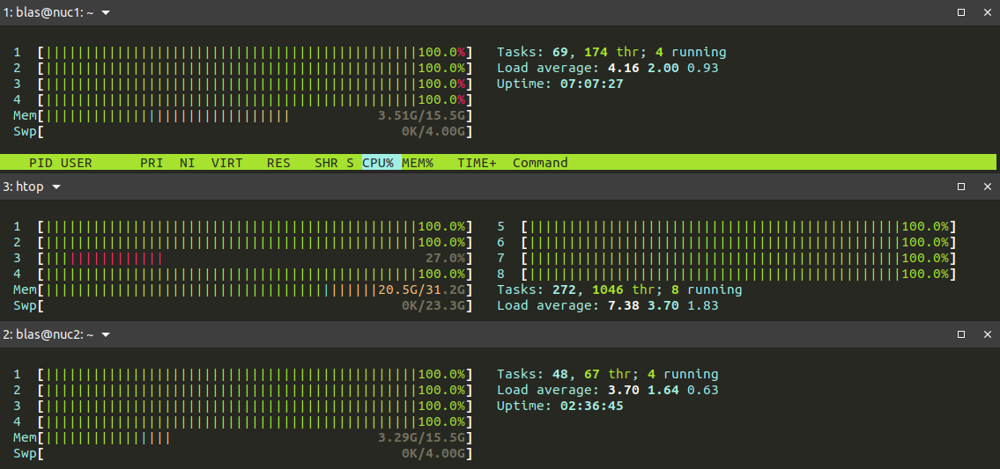
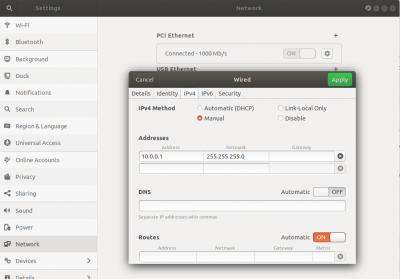
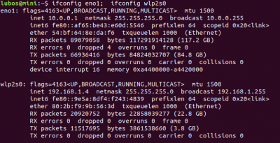

# [https://www-users.cs.york.ac.uk/mjf5/pi_cluster/src/Building_a_simple_Beowulf_cluster.html]{.underline}

#### Building a simple Beowulf cluster with Ubuntu

This document describes the basic steps to setting up a basic Beowulf
cluster using the Ubuntu operating system.

> A Beowulf cluster is a group of what are normally identical,
> commercially available computers, which are running a Free and Open
> Source Software (FOSS), Unix-like operating system, such as BSD,
> GNU/Linux, or Solaris. They are networked into a small TCP/IP LAN, and
> have libraries and programs installed which allow processing to be
> shared among them.
> \[[[1]{.underline}](https://www-users.cs.york.ac.uk/mjf5/pi_cluster/src/Building_a_simple_Beowulf_cluster.html#_footnote_1)\]

--- Wikipedia *Beowulf cluster*

This means a Beowulf cluster can be easily built with \"off the shelf\"
computers running GNU/Linux in a simple home network. So building a
Beowulf like cluster is within reach if you already have a small TCP/IP
LAN at home with desktop computers running [[Ubuntu
Linux]{.underline}](http://www.ubuntu.com/), or any other GNU/Linux
distribution.

There are many ways to install and configure a cluster. There is OSCAR
\[[[2]{.underline}](https://www-users.cs.york.ac.uk/mjf5/pi_cluster/src/Building_a_simple_Beowulf_cluster.html#_footnote_2)\],
which allows any user, regardless of experience, to easily install a
Beowulf type cluster on supported Linux distributions. It installs and
configures all required software according to user input.

There is also the NPACI Rocks toolkit
\[[[3]{.underline}](https://www-users.cs.york.ac.uk/mjf5/pi_cluster/src/Building_a_simple_Beowulf_cluster.html#_footnote_3)\]
which incorporates the latest Red Hat distribution and cluster-specific
software. Rocks addresses the difficulties of deploying manageable
clusters. Rocks makes clusters easy to deploy, manage, upgrade and
scale.

Both of the afore mentioned toolkits for deploying clusters were made to
be easy to use and require minimal expertise from the user. But the
purpose of this tutorial is to explain how to manually build a Beowulf
like cluster. Basically, the toolkits mentioned above do most of the
installing and configuring for you, rendering the learning experience
mute. So it would not make much sense to use any of these toolkits if
you want to learn the basics of how a cluster works. This tutorial
therefore explains how to manually build a cluster, by manually
installing and configuring the required tools. In this tutorial I assume
that you have some basic knowledge of the Linux-based operating system
and know your way around the command line. I tried however to make this
as easy as possible to follow. Keep in mind that this is new territory
for me as well and there's a good chance that this tutorial shows
methods that may not be the best.

The clustering tutorial from SCFBio
\[[[4]{.underline}](https://www-users.cs.york.ac.uk/mjf5/pi_cluster/src/Building_a_simple_Beowulf_cluster.html#_footnote_4)\]
gives a good introduction to Beowulf clusters. It describes the
prerequisites for building a Beowulf cluster and why these are needed.

Table of Contents

-   [[1. What's a Beowulf Cluster,
    exactly?]{.underline}](https://www-users.cs.york.ac.uk/mjf5/pi_cluster/src/Building_a_simple_Beowulf_cluster.html#_what_s_a_beowulf_cluster_exactly)

-   [[2. Building a virtual Beowulf
    Cluster]{.underline}](https://www-users.cs.york.ac.uk/mjf5/pi_cluster/src/Building_a_simple_Beowulf_cluster.html#_building_a_virtual_beowulf_cluster)

-   [[3. Building the actual
    cluster]{.underline}](https://www-users.cs.york.ac.uk/mjf5/pi_cluster/src/Building_a_simple_Beowulf_cluster.html#_building_the_actual_cluster)

-   [[4. Configuring the
    Nodes]{.underline}](https://www-users.cs.york.ac.uk/mjf5/pi_cluster/src/Building_a_simple_Beowulf_cluster.html#_configuring_the_nodes)

    -   [[4.1. Add the nodes to the hosts
        file]{.underline}](https://www-users.cs.york.ac.uk/mjf5/pi_cluster/src/Building_a_simple_Beowulf_cluster.html#_add_the_nodes_to_the_hosts_file)

    -   [[4.2. Defining a user for running MPI
        jobs]{.underline}](https://www-users.cs.york.ac.uk/mjf5/pi_cluster/src/Building_a_simple_Beowulf_cluster.html#_defining_a_user_for_running_mpi_jobs)

    -   [[4.3. Install and setup the Network File
        System]{.underline}](https://www-users.cs.york.ac.uk/mjf5/pi_cluster/src/Building_a_simple_Beowulf_cluster.html#_install_and_setup_the_network_file_system)

    -   [[4.4. Setup passwordless SSH for communication between
        nodes]{.underline}](https://www-users.cs.york.ac.uk/mjf5/pi_cluster/src/Building_a_simple_Beowulf_cluster.html#_setup_passwordless_ssh_for_communication_between_nodes)

    -   [[4.5. Setting up the process
        manager]{.underline}](https://www-users.cs.york.ac.uk/mjf5/pi_cluster/src/Building_a_simple_Beowulf_cluster.html#_setting_up_the_process_manager)

-   [[5. Running jobs on the
    cluster]{.underline}](https://www-users.cs.york.ac.uk/mjf5/pi_cluster/src/Building_a_simple_Beowulf_cluster.html#_running_jobs_on_the_cluster)

    -   [[5.1. Running MPICH2 example applications on the
        cluster]{.underline}](https://www-users.cs.york.ac.uk/mjf5/pi_cluster/src/Building_a_simple_Beowulf_cluster.html#_running_mpich2_example_applications_on_the_cluster)

    -   [[5.2. Running bioinformatics tools on the
        cluster]{.underline}](https://www-users.cs.york.ac.uk/mjf5/pi_cluster/src/Building_a_simple_Beowulf_cluster.html#_running_bioinformatics_tools_on_the_cluster)

-   [[6.
    Credits]{.underline}](https://www-users.cs.york.ac.uk/mjf5/pi_cluster/src/Building_a_simple_Beowulf_cluster.html#_credits)

-   [[7.
    References]{.underline}](https://www-users.cs.york.ac.uk/mjf5/pi_cluster/src/Building_a_simple_Beowulf_cluster.html#_references)

## 1. What's a Beowulf Cluster, exactly?

The book *Engineering a Beowulf-style Compute Cluster* by
[[\[brown2004\]]{.underline}](https://www-users.cs.york.ac.uk/mjf5/pi_cluster/src/Building_a_simple_Beowulf_cluster.html#brown2004)
gives a more detailed answer to this question. According to this book,
there is an accepted definition of a beowulf cluster. This book
describes the true beowulf as a cluster of computers interconnected with
a network with the following characteristics:

1.  The nodes are dedicated to the beowulf cluster.

2.  The network on which the nodes reside are dedicated to the beowulf
    cluster.

3.  The nodes are Mass Market Commercial-Off-The-Shelf (M2COTS)
    computers.

4.  The network is also a COTS entity.

5.  The nodes all run open source software.

6.  The resulting cluster is used for High Performance Computing (HPC).

{width="2.675230752405949in"
height="1.8961800087489065in"}

Figure 1. The typical setup of a beowulf cluster.

## 2. Building a virtual Beowulf Cluster

It is not a bad idea to start by building a virtual cluster using
virtualization software like
[[VirtualBox]{.underline}](http://en.wikipedia.org/wiki/VirtualBox). I
simply used my laptop running Ubuntu as the master node, and two virtual
computing nodes running Ubuntu Server Edition were created in
VirtualBox. The virtual cluster allows you to build and test the cluster
without the need for the extra hardware. However, this method is only
meant for testing and not suited if you want increased performance.

When it comes to configuring the nodes for the cluster, building a
virtual cluster is practically the same as building a cluster with
actual machines. The difference is that you don't have to worry about
the hardware as much. You do have to properly configure the virtual
network interfaces of the virtual nodes. They need to be configured in a
way that the master node (e.g. the computer on which the virtual nodes
are running) has network access to the virtual nodes, and vice versa.

## 3. Building the actual cluster

It is good practice to first build and test a virtual cluster as
described above. If you have some spare computers and network parts
lying around, you can use those to build the actual cluster. The nodes
(the computers that are part of the cluster) and the network hardware
are the usual kind available to the general public (beowulf requirement
3 and 4). In this tutorial we'll use the Ubuntu operating system to
power the machines and open source software to allow for distributed
parallel computing (beowulf requirement 5). We'll test the cluster with
cluster specific versions of
[[bioinformatics]{.underline}](http://en.wikipedia.org/wiki/Bioinformatics)
tools that perform some sort of heavy calculations (beowulf requirement
6).

The cluster consists of the following hardware parts:

-   Network

-   Server / Head / Master Node (common names for the same machine)

-   Compute Nodes

-   Gateway

All nodes (including the master node) run the following software:

-   [[GNU/Linux
    OS]{.underline}](http://en.wikipedia.org/wiki/Linux_distribution)

-   [[Ubuntu Server Edition]{.underline}](http://www.ubuntu.com/server).

-   [[Network File System
    (NFS)]{.underline}](http://en.wikipedia.org/wiki/Network_File_System_(protocol))

-   [[Secure Shell
    (SSH)]{.underline}](http://en.wikipedia.org/wiki/Secure_Shell)

-   [[Message Passing Interface
    (MPI)]{.underline}](http://en.wikipedia.org/wiki/Message_Passing_Interface)

-   [[MPICH]{.underline}](http://www.mpich.org/)

I will not focus on setting up the network (parts) in this tutorial. I
assume that all nodes are part of the same private network and that they
are properly connected.

## 4. Configuring the Nodes

Some configurations need to be made to the nodes. I'll walk you through
them one by one.

### 4.1. Add the nodes to the hosts file

It is easier if the nodes can be accessed with their host name rather
than their IP address. It will also make things a lot easier later on.
To do this, add the nodes to the hosts file of all nodes
([[\[ubuntuwiki\]]{.underline}](https://www-users.cs.york.ac.uk/mjf5/pi_cluster/src/Building_a_simple_Beowulf_cluster.html#ubuntuwiki),
[[\[linuxcom\]]{.underline}](https://www-users.cs.york.ac.uk/mjf5/pi_cluster/src/Building_a_simple_Beowulf_cluster.html#linuxcom)).
All nodes should have a static local IP address set. I won't go into
details here as this is outside the scope of this tutorial. For this
tutorial I assume that all nodes are already properly configured to have
a static local IP address.

Edit the hosts file (sudo vim /etc/hosts) like below and remember that
you need to do this for all nodes,

127.0.0.1 localhost

192.168.1.6 master

192.168.1.7 node1

192.168.1.8 node2

192.168.1.9 node3

Make sure it doesn't look like this:

127.0.0.1 localhost

127.0.1.1 master

192.168.1.7 node1

192.168.1.8 node2

192.168.1.9 node3

neither like this:

127.0.0.1 localhost

127.0.1.1 master

192.168.1.6 master

192.168.1.7 node1

192.168.1.8 node2

192.168.1.9 node3

Otherwise other nodes will try to connect to localhost when trying to
reach the master node.

Once saved, you can use the host names to connect to the other nodes,

\$ ping -c 3 master

PING master (192.168.1.6) 56(84) bytes of data.

64 bytes from master (192.168.1.6): icmp_req=1 ttl=64 time=0.606 ms

64 bytes from master (192.168.1.6): icmp_req=2 ttl=64 time=0.552 ms

64 bytes from master (192.168.1.6): icmp_req=3 ttl=64 time=0.549 ms

\-\-- master ping statistics \-\--

3 packets transmitted, 3 received, 0% packet loss, time 1999ms

rtt min/avg/max/mdev = 0.549/0.569/0.606/0.026 ms

Try this with different nodes on different nodes. You should get a
response similar to the above.

In this tutorial, master is used as the master node. Once the cluster
has been set up, the master node will be used to start jobs on the
cluster. The master node will be used to spawn jobs on the cluster. The
compute nodes are node1 to node3 and will thus execute the jobs.

### 4.2. Defining a user for running MPI jobs

Several tutorials explain that all nodes need a separate user for
running MPI jobs
([[\[ubuntuwiki\]]{.underline}](https://www-users.cs.york.ac.uk/mjf5/pi_cluster/src/Building_a_simple_Beowulf_cluster.html#ubuntuwiki),
[[\[linuxcom\]]{.underline}](https://www-users.cs.york.ac.uk/mjf5/pi_cluster/src/Building_a_simple_Beowulf_cluster.html#linuxcom),
[[\[wong2008\]]{.underline}](https://www-users.cs.york.ac.uk/mjf5/pi_cluster/src/Building_a_simple_Beowulf_cluster.html#wong2008)).
I haven't found a clear explanation to why this is necessary, but there
could be several reasons:

1.  There's no need to remember different user names and passwords if
    all nodes use the same username and password.

2.  MPICH2 can use SSH for communication between nodes. Passwordless
    login with the use of authorized keys only works if the username
    matches the one set for passwordless login. You don't have to worry
    about this if all nodes use the same username.

3.  The NFS directory can be made accessible for the MPI users only. The
    MPI users all need to have the same user ID for this to work.

4.  The separate user might require special permissions.

The command below creates a new user with username \"mpiuser\" and user
ID 999. Giving a user ID below 1000 prevents the user from showing up in
the login screen for desktop versions of Ubuntu. It is important that
all MPI users have the same username and user ID. The user IDs for the
MPI users need to be the same because we give access to the MPI user on
the NFS directory later. Permissions on NFS directories are checked with
user IDs. Create the user like this,

\$ sudo adduser mpiuser \--uid 999

You may use a different user ID (as long as it is the same for all MPI
users). Enter a password for the user when prompted. It's recommended to
give the same password on all nodes so you have to remember just one
password. The above command should also create a new directory
/home/mpiuser. This is the home directory for user mpiuser and we will
use it to execute jobs on the cluster.

### 4.3. Install and setup the Network File System

Files and programs used for
[[MPI]{.underline}](http://en.wikipedia.org/wiki/Message_Passing_Interface)
jobs (jobs that are run in parallel on the cluster) need to be available
to all nodes, so we give all nodes access to a part of the file system
on the master node. Network File System (NFS) enables you to mount part
of a remote file system so you can access it as if it is a local
directory. To install NFS, run the following command on the master node:

master:\~\$ sudo apt-get install nfs-kernel-server

And in order to make it possible to mount a Network File System on the
compute nodes, the nfs-common package needs to be installed on all
compute nodes:

\$ sudo apt-get install nfs-common

We will use NFS to share the MPI user's home directory (i.e.
/home/mpiuser) with the compute nodes. It is important that this
directory is owned by the MPI user so that all MPI users can access this
directory. But since we created this home directory with the adduser
command earlier, it is already owned by the MPI user,

master:\~\$ ls -l /home/ \| grep mpiuser

drwxr-xr-x 7 mpiuser mpiuser 4096 May 11 15:47 mpiuser

If you use a different directory that is not currently owned by the MPI
user, you must change it's ownership as follows,

master:\~\$ sudo chown mpiuser:mpiuser /path/to/shared/dir

Now we share the /home/mpiuser directory **of the master node** with all
other nodes. For this the file /etc/exports on the master node needs to
be edited. Add the following line to this file,

/home/mpiuser \*(rw,sync,no_subtree_check)

You can read the man page to learn more about the exports file (man
exports). After the first install you may need to restart the NFS
daemon:

master:\~\$ sudo service nfs-kernel-server restart

This also exports the directores listed in /etc/exports. In the future
when the /etc/exports file is modified, you need to run the following
command to export the directories listed in /etc/exports:

master:\~\$ sudo exportfs -a

The /home/mpiuser directory should now be shared through NFS. In order
to test this, you can run the following command from a compute node:

\$ showmount -e master

In this case this should print the path /home/mpiuser. All data files
and programs that will be used for running an MPI job must be placed in
this directory on the master node. The other nodes will then be able to
access these files through NFS.

The firewall is by default enabled on Ubuntu. The firewall will block
access when a client tries to access an NFS shared directory. So you
need to add a rule with
[[UFW]{.underline}](https://help.ubuntu.com/community/UFW) (a tool for
managing the firewall) to allow access from a specific subnet. If the IP
addresses in your network have the format 192.168.1.\*, then 192.168.1.0
is the subnet. Run the following command to allow incoming access from a
specific subnet,

master:\~\$ sudo ufw allow from 192.168.1.0/24

You need to run this on the master node and replace \"192.168.1.0\" by
the subnet for your network.

You should then be able to mount master:/home/mpiuser on the compute
nodes. Run the following commands to test this,

node1:\~\$ sudo mount master:/home/mpiuser /home/mpiuser

node2:\~\$ sudo mount master:/home/mpiuser /home/mpiuser

node3:\~\$ sudo mount master:/home/mpiuser /home/mpiuser

If this fails or hangs, restart the compute node and try again. If the
above command runs without a problem, you should test whether
/home/mpiuser on any compute node actually has the content from
/home/mpiuser of the master node. You can test this by creating a file
in master:/home/mpiuser and check if that same file appears in
node\*:/home/mpiuser (where node\* is any compute node).

If mounting the NFS shared directory works, we can make it so that the
master:/home/mpiuser directory is automatically mounted when the compute
nodes are booted. For this the file /etc/fstab needs to be edited. Add
the following line to the fstab file of all compute nodes,

master:/home/mpiuser /home/mpiuser nfs

Again, read the man page of fstab if you want to know the details (man
fstab). Reboot the compute nodes and list the contents of the
/home/mpiuser directory on each compute node to check if you have access
to the data on the master node,

\$ ls /home/mpiuser

This should lists the files from the /home/mpiuser directory of the
master node. If it doesn't immediately, wait a few seconds and try
again. It might take some time for the system to initialize the
connection with the master node.

### 4.4. Setup passwordless SSH for communication between nodes

For the cluster to work, the master node needs to be able to communicate
with the compute nodes, and vice versa
([[\[ubuntuwiki\]]{.underline}](https://www-users.cs.york.ac.uk/mjf5/pi_cluster/src/Building_a_simple_Beowulf_cluster.html#ubuntuwiki)).
Secure Shell (SSH) is usually used for secure remote access between
computers. By setting up passwordless SSH between the nodes, the master
node is able to run commands on the compute nodes. This is needed to run
the MPI daemons on the available compute nodes.

First install the SSH server on all nodes:

\$ sudo apt-get install ssh

Now we need to generate an SSH key for all MPI users on all nodes. The
SSH key is by default created in the user's home directory. Remember
that in our case the MPI user's home directory (i.e. /home/mpiuser) is
actually the same directory for all nodes: /home/mpiuser on the master
node. So if we generate an SSH key for the MPI user on one of the nodes,
all nodes will automatically have an SSH key. Let's generate an SSH key
for the MPI user on the master node (but any node should be fine),

\$ su mpiuser

\$ ssh-keygen

When asked for a passphrase, leave it empty (hence passwordless SSH).

When done, all nodes should have an SSH key (the same key actually). The
master node needs to be able to automatically login to the compute
nodes. To enable this, the public SSH key of the master node needs to be
added to the list of known hosts (this is usually a file
\~/.ssh/authorized_keys) of all compute nodes. But this is easy, since
all SSH key data is stored in one location: /home/mpiuser/.ssh/ on the
master node. So instead of having to copy master's public SSH key to all
compute nodes separately, we just have to copy it to master's own
authorized_keys file. There is a command to push the public SSH key of
the currently logged in user to another computer. Run the following
commands on the master node as user \"mpiuser\",

mpiuser@master:\~\$ ssh-copy-id localhost

Master's own public SSH key should now be copied to
/home/mpiuser/.ssh/authorized_keys. But since /home/mpiuser/ (and
everything under it) is shared with all nodes via NFS, all nodes should
now have master's public SSH key in the list of known hosts. This means
that we should now be able to login on the compute nodes from the master
node without having to enter a password,

mpiuser@master:\~\$ ssh node1

mpiuser@node1:\~\$ echo \$HOSTNAME

node1

You should now be logged in on node1 via SSH. Make sure you're able to
login to the other nodes as well.

### 4.5. Setting up the process manager

In this section I'll walk you through the installation of MPICH and
configuring the process manager. The process manager is needed to spawn
and manage parallel jobs on the cluster. The MPICH wiki explains this
nicely:

> Process managers are basically external (typically distributed) agents
> that spawn and manage parallel jobs. These process managers
> communicate with MPICH processes using a predefined interface called
> as PMI (process management interface). Since the interface is
> (informally) standardized within MPICH and its derivatives, you can
> use any process manager from MPICH or its derivatives with any MPI
> application built with MPICH or any of its derivatives, as long as
> they follow the same wire protocol.
> \[[[5]{.underline}](https://www-users.cs.york.ac.uk/mjf5/pi_cluster/src/Building_a_simple_Beowulf_cluster.html#_footnote_5)\]

--- Frequently Asked Questions - MPICH

The process manager is included with the MPICH package, so start by
installing MPICH on all nodes with,

\$ sudo apt-get install mpich2

MPD has been the traditional default process manager for MPICH till the
1.2.x release series. Starting the 1.3.x series,
[[Hydra]{.underline}](http://wiki.mpich.org/mpich/index.php/Hydra) is
the default process manager
([[\[mpichfaq\]]{.underline}](https://www-users.cs.york.ac.uk/mjf5/pi_cluster/src/Building_a_simple_Beowulf_cluster.html#mpichfaq)).
So depending on the version of MPICH you are using, you should either
use MPD or Hydra for process management. You can check the MPICH version
by running mpich2version in the terminal. Then follow either the steps
for MPD **or** Hydra in the following sub sections.

#### 4.5.1. Setting up Hydra

This section explains how to configure the Hydra process manager and is
for users of MPICH 1.3.x series and up. In order to setup Hydra, we need
to create one file on the master node. This file contains all the host
names of the compute nodes
([[\[hydra\]]{.underline}](https://www-users.cs.york.ac.uk/mjf5/pi_cluster/src/Building_a_simple_Beowulf_cluster.html#hydra)).
You can create this file anywhere you want, but for simplicity we create
it in the the MPI user's home directory,

mpiuser@master:\~\$ cd \~

mpiuser@master:\~\$ touch hosts

In order to be able to send out jobs to the other nodes in the network,
add the host names of all compute nodes to the hosts file,

node1

node2

node3

You may choose to include master in this file, which would mean that the
master node would also act as a compute node. The hosts file only needs
to be present on the node that will be used to start jobs on the
cluster, usually the master node. But because the home directory is
shared among all nodes, all nodes will have the hosts file.

  --------------------------------------------------------------------------------------------------
     For more details about setting up Hydra see this page: [[Using the Hydra Process
     Manager]{.underline}](http://wiki.mpich.org/mpich/index.php/Using_the_Hydra_Process_Manager).
  -- -----------------------------------------------------------------------------------------------

  --------------------------------------------------------------------------------------------------

#### 4.5.2. Setting up MPD

This section explains how to configure the MPD process manager and is
for users of MPICH 1.2.x series and down. Before we can start any
parallel jobs with MPD, we need to create two files in the home
directory of the MPI user. Make sure you're logged in as the MPI user
and create the following two files in the home directory,

mpiuser@master:\~\$ cd \~

mpiuser@master:\~\$ touch mpd.hosts

mpiuser@master:\~\$ touch .mpd.conf

In order to be able to send out jobs to the other nodes in the network,
add the host names of all compute nodes to the mpd.hosts file,

node1

node2

node3

You may choose to include master in this file, which would mean that the
master node would also act as a compute node. The mpd.hosts file only
needs to be present on the node that will be used to start jobs on the
cluster, usually the master node. But because the home directory is
shared among all nodes, all nodes will have the mpd.hosts file.

The configuration file .mpd.conf (mind the dot at the beginning of the
file name) must be accessible to the MPI user only (in fact, MPD refuses
to work if you don't do this),

mpiuser@master:\~\$ chmod 600 .mpd.conf

Then add a line with a secret passphrase to the configuration file,

secretword=random_text_here

The secretword can be set to any random passphrase. You may want to use
a random password generator the generate a passphrase.

All nodes need to have the .mpd.conf file in the home directory of
mpiuser with the same passphrase. But this is automatically the case
since /home/mpiuser is shared through NFS.

The nodes should now be configured correctly. Run the following command
on the master node to start the mpd deamon on all nodes,

mpiuser@master:\~\$ mpdboot -n 3

Replace \"3\" by the number of compute nodes in your cluster. If this
was successful, all nodes should now be running the mpd daemon. Run the
following command to check if all nodes entered the ring (and are thus
running the mpd daemon),

mpiuser@master:\~\$ mpdtrace -l

This command should display a list of all nodes that entered the ring.
Nodes listed here are running the mpd daemon and are ready to accept MPI
jobs. This means that your cluster is now set up and ready to rock!

## 5. Running jobs on the cluster

### 5.1. Running MPICH2 example applications on the cluster

The MPICH2 package comes with a few example applications that you can
run on your cluster. To obtain these examples, download the MPICH2
source package from the [[MPICH
website]{.underline}](http://www.mpich.org/) and extract the archive to
a directory. The directory to where you extracted the MPICH2 package
should contain an \"examples\" directory. This directory contains the
source codes of the example applications. You need to compile these
yourself.

\$ sudo apt-get build-dep mpich2

\$ wget http://www.mpich.org/static/downloads/1.4.1/mpich2-1.4.1.tar.gz

\$ tar -xvzf mpich2-1.4.1.tar.gz

\$ cd mpich2-1.4.1/

\$ ./configure

\$ make

\$ cd examples/

The example application cpi is compiled by default, so you can find the
executable in the \"examples\" directory. Optionally you can build the
other examples as well,

\$ make hellow

\$ make pmandel

\...

Once compiled, place the executables of the examples somewhere inside
the /home/mpiuser directory on the master node. It's common practice to
place executables in a \"bin\" directory, so create the directory
/home/mpiuser/bin and place the executables in this directory. The
executables should now be available on all nodes.

We're going to run an MPI job using the example application cpi. Make
sure you're logged in as the MPI user on the master node,

\$ su mpiuser

And run the job like this,

**When using MPD:**

mpiuser@master:\~\$ mpiexec -n 3 /home/mpiuser/bin/cpi

**When using Hydra:**

mpiuser@master:\~\$ mpiexec -f hosts -n 3 /home/mpiuser/bin/cpi

Replace \"3\" by the number of nodes on which you want to run the job.
When using Hydra, the -f switch should point to the file containing the
host names. When using MPD, it's important that you use the **absolute**
path to the executable in the above command, because only then MPD knows
where to look for the executable on the compute nodes. The absolute path
used should thus be correct for all nodes. But since /home/mpiuser is
the NFS shared directory, all nodes have access to this path and the
files within it.

The example application cpi is useful for testing because it shows on
which nodes each sub process is running and how long it took to run the
job. This application is however not useful to test performance because
this is a very small application which takes only a few milliseconds to
run. As a matter of fact, I don't think it actually computes
[[pi]{.underline}](http://en.wikipedia.org/wiki/Pi). If you look at the
source, you'll find that the value of pi is hard coded into the program.

### 5.2. Running bioinformatics tools on the cluster

By running actual
[[bioinformatics]{.underline}](http://en.wikipedia.org/wiki/Bioinformatics)
tools you can give your cluster a more realistic test run. There are
several parallel implementations of bioinformatics tools that are based
on MPI. There are two that I currently know of:

-   [[mpiBLAST]{.underline}](http://www.mpiblast.org/), a parallel
    implementation of [[NCBI
    BLAST]{.underline}](http://en.wikipedia.org/wiki/BLAST).

-   [[ClustalW-MPI]{.underline}](http://www.bii.a-star.edu.sg/achievements/applications/clustalw/index.php),
    a parallel implementation of
    [[Clustal-W]{.underline}](http://en.wikipedia.org/wiki/Clustal).

It would have been nice to test mpiBLAST, but a compilation issue made
this difficult.
\[[[6]{.underline}](https://www-users.cs.york.ac.uk/mjf5/pi_cluster/src/Building_a_simple_Beowulf_cluster.html#_footnote_6)\]
So I ended up testing with ClustalW-MPI instead.

The MPI implementation of ClustalW is fairly out-dated, but it's good
enough to perform a test run on your cluster. Download the source from
the website, extract the package, and compile the source. Copy the
resulting executable to the /home/mpiuser/bin directory on the master
node. Use for example
[[Entrez]{.underline}](http://www.ncbi.nlm.nih.gov/Entrez/) to search
for some DNA/protein sequences and put these in a single [[FASTA
file]{.underline}](http://en.wikipedia.org/wiki/FASTA_format) (the NCBI
website can do that for you). Create several FASTA files with multiple
sequences to test with. Copy the multi-sequence FASTA files to a data
directory inside mirror (e.g. /home/mpiuser/data). Then run a job like
this,

**When using MPD:**

mpiuser@master:\~\$ mpiexec -n 3 /home/mpiuser/bin/clustalw-mpi
/home/mpiuser/data/seq_tyrosine.fasta

**When using Hydra:**

mpiuser@master:\~\$ mpiexec -f hosts -n 3 /home/mpiuser/bin/clustalw-mpi
/home/mpiuser/data/seq_tyrosine.fasta

and let the cluster do the work. Again, notice that we must use absolute
paths. You can check if the nodes are actually doing anything by logging
into the nodes (ssh node\*) and running the top command. This should
display a list of running processes with the processes using the most
CPU on the top. In this case, you should see the process clustalw-mpi
somewhere along the top.

## 6. Credits

Thanks to Reza Azimi for mentioning the nfs-common package.

## 7. References

-   \[brown2004\] Robert G. Brown. *Engineering a Beowulf-style Compute
    Cluster*. 2004. Duke University Physics Department.
    [[http://www.phy.duke.edu/\~rgb/Beowulf/beowulf_book/beowulf_book/index.html]{.underline}](http://www.phy.duke.edu/~rgb/Beowulf/beowulf_book/beowulf_book/index.html).

-   \[wong2008\] Kerry D. Wong. *A Simple Beowulf Cluster*.
    [[http://www.kerrywong.com/2008/11/04/a-simple-beowulf-cluster/]{.underline}](http://www.kerrywong.com/2008/11/04/a-simple-beowulf-cluster/).

-   \[ubuntuwiki\] *Setting Up an MPICH2 Cluster in Ubuntu*.
    [[https://help.ubuntu.com/community/MpichCluster]{.underline}](https://help.ubuntu.com/community/MpichCluster).

-   \[linuxcom\] *Building a Beowulf Cluster in just 13 steps*.
    [[https://www.linux.com/community/blogs/133-general-linux/9401]{.underline}](https://www.linux.com/community/blogs/133-general-linux/9401).

-   \[mpichfaq\] *Frequently Asked Questions - MPICH*.
    [[http://wiki.mpich.org/mpich/index.php/Frequently_Asked_Questions]{.underline}](http://wiki.mpich.org/mpich/index.php/Frequently_Asked_Questions).

-   \[hydra\] *Using the Hydra Process Manager - MPICH*.
    [[http://wiki.mpich.org/mpich/index.php/Using_the_Hydra_Process_Manager]{.underline}](http://wiki.mpich.org/mpich/index.php/Using_the_Hydra_Process_Manager).

[[1]{.underline}](https://www-users.cs.york.ac.uk/mjf5/pi_cluster/src/Building_a_simple_Beowulf_cluster.html#_footnoteref_1).
Wikipedia. *Beowulf cluster*. 28 February 2011.
[[http://en.wikipedia.org/wiki/Beowulf_cluster]{.underline}](http://en.wikipedia.org/wiki/Beowulf_cluster).

[[2]{.underline}](https://www-users.cs.york.ac.uk/mjf5/pi_cluster/src/Building_a_simple_Beowulf_cluster.html#_footnoteref_2).
OpenClusterGroup. *OSCAR*.
[[http://svn.oscar.openclustergroup.org/trac/oscar]{.underline}](http://svn.oscar.openclustergroup.org/trac/oscar).

[[3]{.underline}](https://www-users.cs.york.ac.uk/mjf5/pi_cluster/src/Building_a_simple_Beowulf_cluster.html#_footnoteref_3).
Rocks.
[[http://www.rocksclusters.org/]{.underline}](http://www.rocksclusters.org/)

[[4]{.underline}](https://www-users.cs.york.ac.uk/mjf5/pi_cluster/src/Building_a_simple_Beowulf_cluster.html#_footnoteref_4).
Clustering Tutorial.
[[http://www.scfbio-iitd.res.in/doc/clustering.pdf]{.underline}](http://www.scfbio-iitd.res.in/doc/clustering.pdf).

[[5]{.underline}](https://www-users.cs.york.ac.uk/mjf5/pi_cluster/src/Building_a_simple_Beowulf_cluster.html#_footnoteref_5).
Frequently Asked Questions - MPICH.
[[http://wiki.mpich.org/mpich/index.php/Frequently_Asked_Questions]{.underline}](http://wiki.mpich.org/mpich/index.php/Frequently_Asked_Questions)

[[6]{.underline}](https://www-users.cs.york.ac.uk/mjf5/pi_cluster/src/Building_a_simple_Beowulf_cluster.html#_footnoteref_6).
mpiBLAST-Users.
[[http://lists.mpiblast.org/pipermail/users_lists.mpiblast.org/2011-February/001248.html]{.underline}](http://lists.mpiblast.org/pipermail/users_lists.mpiblast.org/2011-February/001248.html)

# Setting up a home cluster

In this post I explain how to setup a small [[Beowulf
cluster]{.underline}](https://en.wikipedia.org/wiki/Beowulf_cluster)
with a personal PC running Ubuntu 20.04 and a couple of [[Intel
NUCs]{.underline}](https://www.intel.com/content/www/us/en/products/boards-kits/nuc.html)
running Ubuntu Server 20.04, with the end-goal of parallelizing R tasks.

The topics I cover here are:

-   Required material

-   Network setting

-   Installing the secure shell protocol

-   Installing Ubuntu server in the NUCs

-   Installing R in the NUCs

-   Managing the cluster's network

## Preamble

I have a little but nice HP ENVY model *TE01-0008ns* with 32 GB RAM, 8
CPUs, and 3TB of hard disk running Ubuntu 20.04 that I use to do all my
computational work (and most of my tweeting). A few months ago I
connected it with my two laptops (one of them deceased now, RIP my dear
*skynet*) to create a little cluster to run parallel tasks in R.

It was just a draft cluster running on a wireless network, but it served
me to think about getting a more permanent solution not requiring two
additional laptops in my desk.

That's were the nice INTEL NUCs (from [*Next Unit of
Computing*](https://en.wikipedia.org/wiki/Next_Unit_of_Computing)) come
into play. NUCs are full-fledged computers fitted in small boxes usually
sold without RAM memory sticks and no hard disk (hence the term
*barebone*). Since they have a low energy consumption footprint, I
thought these would be ideal units for my soon-to-be home cluster.

## Material

I gifted myself with:

-   2 [[Intel Barebone
    BOXNUC6CAYH]{.underline}](https://ark.intel.com/content/www/us/en/ark/products/95062/intel-nuc-kit-nuc6cayh.html),
    each with 4 cores, and a maximum RAM memory of 32GB (you might read
    they only accept 8GB, but that's not the case anymore). Notice that
    these NUCs aren't state-of-the-art now, they were released by the
    end of 2016.

-   2 Hard disks SSD 2.5" [[Western Digital WDS250G2B0A WD
    Blue]{.underline}](https://shop.westerndigital.com/es-es/products/internal-drives/wd-blue-sata-ssd#_blank)
    (250GB)

-   4 Crucial CT102464BF186D DDR3 SODIMM (204 pins) RAM sticks with 8GB
    each.

-   1 ethernet switch Netgear GS308-300PES with 8 ports.

-   3 ethernet wires NanoCable 10.20.0400-BL of [[cat
    6]{.underline}](https://www.electronics-notes.com/articles/connectivity/ethernet-ieee-802-3/how-to-buy-best-ethernet-cables-cat-5-6-7.php)
    quality.

The whole set came to cost around 530€, but please notice that I had a
clear goal in mind: "duplicating" my computing power with the minimum
number of NUCs, while preserving a share of 4GB of RAM memory per CPU
throughout the cluster (based on the features of my desk computer). A
more basic setting with more modest NUCs and smaller RAM would cost half
of that.

This instructive video by [[David
Harry]{.underline}](https://www.youtube.com/channel/UCYa3XeSHenvosy5wMRpeIww)
shows how to install the SSD and the RAM sticks in an Intel NUC. It
really takes 5 minutes tops, one only has to be a bit careful with the
RAM sticks, the pins need to go all the way in into their slots before
securing the sticks in place.

## Network settings

Before starting to install an operating system in the NUCS, the network
setup goes as follows:

-   My desktop PC is connected to a router via WIFI and dynamic IP
    (DHCP).

-   The PC and each NUC are connected to the switch with cat6 ethernet
    wires.

{width="5.088670166229221in"
height="3.3427668416447944in"}

To share my PC's WIFI connection with the NUCs I have to prepare a new
*connection profile* with the command line tool of Ubuntu's
[NetworkManager](https://en.wikipedia.org/wiki/NetworkManager), named
nmcli, as follows.

First, I need to find the name of my ethernet interface by checking the
status of my network devices with the command line.

nmcli device status

DEVICE TYPE STATE CONNECTION

wlp3s0 wifi connected my_wifi

enp2s0 ethernet unavailable \--

lo loopback unmanaged \--

There I can see that my ethernet interface is named enp2s0.

Second, I have to configure the shared connection.

nmcli connection add type ethernet ifname enp2s0 ipv4.method shared
con-name cluster

Were ifname enp2s0 is the name of the interface I want to use for the
new connection, ipv4.method shared is the type of connection, and
con-name cluster is the name I want the connection to have. This
operation adds firewall rules to manage traffic within the cluster
network, starts a DHCP server in the computer that serves IPs to the
NUCS, and a DNS server that allows the NUCs to translate internet
addresses.

After turning on the switch, I can check the connection status again
with

nmcli device status

DEVICE TYPE STATE CONNECTION

enp2s0 ethernet connected cluster

wlp3s0 wifi connected my_wifi

lo loopback unmanaged \--

When checking the IP of the device with bash ifconfig it should yield
10.42.0.1. Any other computer in the cluster network will have a dynamic
IP in the range 10.42.0.1/24.

Further details about how to set a shared connection with NetworkManager
can be found in [[this nice post by Beniamino
Galvani]{.underline}](https://fedoramagazine.org/internet-connection-sharing-networkmanager/).

 

## SSH setup

My PC, as the director of the cluster, needs an SSH client running,
while the NUCs need an SSH server. [SSH
[(]{.underline}**S**[ecure]{.underline}
**Sh**[ell)]{.underline}](https://www.ionos.com/digitalguide/server/tools/ssh-secure-shell/)
is a remote authentication protocol that allows secure connections to
remote servers that I will be using all the time to manage the cluster.
To install, run, and check its status I just have to run these lines in
the console:

sudo apt install ssh

sudo systemctl enable \--now ssh

sudo systemctl status ssh

Now, a secure certificate of the identity of a given computer, named
ssh-key, that grants access to remote ssh servers and services needs to
be generated.

ssh-keygen \"label\"

Here, substitute "label" by the name of the computer to be used as
cluster's "director". The system will ask for a file name and a
[[passphrase]{.underline}](https://www.ssh.com/ssh/passphrase) that will
be used to encrypt the ssh-key.

The ssh-key needs to be added to the
[ssh-agent](https://www.ssh.com/ssh/agent).

ssh-add \~/.ssh/id_rsa

To copy the ssh-key to my GitHub account, I have to copy the contents of
the file \~/.ssh/id_rsa.pub (can be done just opening it with gedit
\~/.ssh/id_rsa.pub + Ctrl + a + Ctrl + c), and paste it on GitHub
account \> Settings \> SSH and GPG keys \> New SSH Key (green button in
the upper right part of the window).

**Note:** If you don't use GitHub, you'll need to copy your ssh-key to
the NUCs once they are up and running with ssh-copy-id -i
\~/.ssh/id_rsa.pub user_name@nuc_IP.

 

## Installing and preparing ubuntu server in each NUC

The NUCs don't need to waste resources in a user graphical interface I
won't be using whatsoever. Since they will work in a [*headless*
[configuration]{.underline}](https://www.howtogeek.com/660841/what-is-a-headless-server/)
once the cluster is ready, a Linux distro without graphical user
interface such as Ubuntu server is the way to go.

 

### Installing Ubuntu server

First it is important to connect a display, a keyboard, and a mouse to
the NUC in preparation, and turn it on while pushing F2 to start the
visual BIOS. These BIOS parameters need to be modified:

-   Advanced (upper right) \> Boot \> Boot Configuration \> UEFI Boot \>
    OS Selection: Linux

-   Advanced \> Boot \> Boot Configuration \> UEFI Boot \> OS Selection:
    mark "Boot USB Devices First".

-   \[optional\] Advanced \> Power \> Secondary Power Settings \> After
    Power Failure: "Power On". I have the switch and nucs connected to
    an outlet plug extender with an interrupter. When I switch it on,
    the NUCs (and the switch) boot automatically after this option is
    enabled, so I only need to push one button to power up the cluster.

-   F10 to save, and shutdown.

To prepare the USB boot device with Ubuntu server 20.04 I first download
the .iso from [[here]{.underline}](https://ubuntu.com/download/server),
by choosing "Option 3", which leads to the manual install. Once the .iso
file is downloaded, I use
[[Ubuntu's]{.underline}](https://ubuntu.com/tutorials/create-a-usb-stick-on-ubuntu#_blank)
Startup Disk Creator to prepare a bootable USB stick. Now I just have to
plug the stick in the NUC and reboot it.

The Ubuntu server install is pretty straightforward, and only a few
things need to be decided along the way:

-   As user name I choose the same I have in my personal computer.

-   As name for the NUCs I choose "nuc1" and "nuc2", but any other
    option will work well.

-   As password, for comfort I use the same I have in my personal
    computer.

-   During the network setup, choose DHCP. If the network is properly
    configured and the switch is powered on, after a few seconds the NUC
    will acquire an IP in the range 10.42.0.1/24, as any other machine
    within the cluster network.

-   When asked, mark the option "Install in the whole disk", unless you
    have other plans for your NUC.

-   Mark "Install OpenSSH".

-   Provide it with your GitHub user name if you have your ssh-key
    there, and it will download it right away, facilitating a lot the
    ssh setup.

Reboot once the install is completed. Now I keep configuring the NUC's
operating system from my PC through ssh.

### Configuring a NUC

First, to learn the IP of the NUC:

sudo arp-scan 10.42.0.1/24

Other alternatives to this command are arp -a and sudo arp-scan -I
enp2s0 \--localnet. Once I learn the IP of the NUC, I add it to the file
etc/hosts of my personal computer as follows.

First I open the file as root.

sudo gedit /etc/hosts

Add a new line there: 10.42.0.XXX nuc1 and save the file.

Now I access the NUC trough ssh to keep preparing it without a keyboard
and a display. I do it from Tilix, that allows to open different command
line tabs in the same window, which is quite handy to manage several
NUCs at once.

{width="5.5148403324584425in"
height="2.5897889326334207in"}

Another great option to manage the NUCs through ssh is terminator, that
allows to [[broadcast the same commands to several ssh sessions at
once]{.underline}](https://opensource.com/article/20/2/terminator-ssh).
I have been trying it, and it is much better for cluster management
purposes than Tilix. Actually, using it would simplify this workflow a
lot, because once Ubuntu server is installed on each NUC, the rest of
the configuration commands can be broadcasted at once to both NUCs. It's
a bummer I discovered this possibility way too late!

ssh blas@10.42.0.XXX

The NUC's operating system probably has a bunch of pending software
updates. To install these:

sudo apt-get upgrade

Now I have to install a set of software packages that will facilitate
managing the cluster's network and the NUC itself.

sudo apt install net-tools arp-scan lm-sensors dirmngr gnupg
apt-transport-https ca-certificates software-properties-common samba
libopenmpi3 libopenmpi-dev openmpi-bin openmpi-common htop

### Setting the system time

To set the system time of the NUC to the same you have in your computer,
just repeat these steps in every computer in the cluster network.

#list time zones:

timedatectl list-timezones

#set time zone

sudo timedatectl set-timezone Europe/Madrid

#enable timesyncd

sudo timedatectl set-ntp on

### Setting the locale

The operating systems of the NUCs and the PC need to have the same
locale. It can be set by editing the file /etc/default/locale with
either nano (in the NUCS) or gedit (in the PC) and adding these lines,
just replacing en_US.UTF-8 with your preferred locale.

LANG=\"en_US.UTF-8"\
LANGUAGE=\"en_US:en"\
LC_NUMERIC=\"en_US.UTF-8"\
LC_TIME=\"en_US.UTF-8"\
LC_MONETARY=\"en_US.UTF-8"\
LC_PAPER=\"en_US.UTF-8"\
LC_IDENTIFICATION=\"en_US.UTF-8"\
LC_NAME=\"en_US.UTF-8"\
LC_ADDRESS=\"en_US.UTF-8"\
LC_TELEPHONE=\"en_US.UTF-8"\
LC_MEASUREMENT=\"en_US.UTF-8"

### Temperature monitoring

NUCs are [[prone to
overheating]{.underline}](https://www.intel.com/content/www/us/en/support/articles/000033327/intel-nuc.html)
when under heavy loads for prolonged times. Therefore, monitoring the
temperature of the NUCs CPUs is kinda important. In a step before I
installed lm-sensors in the NUC, which provides the tools to do so. To
setup the sensors from an ssh session in the NUC:

sudo sensors-detect

The program will request permission to find sensors in the NUC. I
answered "yes" to every request. Once all sensors are identified, to
check them

sensors

iwlwifi_1-virtual-0

Adapter: Virtual device

temp1: N/A

acpitz-acpi-0

Adapter: ACPI interface

temp1: +32.0°C (crit = +100.0°C)

coretemp-isa-0000

Adapter: ISA adapter

Package id 0: +30.0°C (high = +105.0°C, crit = +105.0°C)

Core 0: +30.0°C (high = +105.0°C, crit = +105.0°C)

Core 1: +30.0°C (high = +105.0°C, crit = +105.0°C)

Core 2: +29.0°C (high = +105.0°C, crit = +105.0°C)

Core 3: +30.0°C (high = +105.0°C, crit = +105.0°C)

which gives the cpu temperatures at the moment the command was executed.
The command watch sensors gives continuous temperature readings instead.

To control overheating in my NUCs I removed their top lids, and
installed them into a custom LEGO "rack" with [[external USB
fans]{.underline}](http://www.eluteng.com/module/fan/12cm/details003.html)
with velocity control, as shown in the picture at the beginning of the
post.

 

### Installing R

To install R in the NUCs I just proceed as I would when installing it in
my personal computer. There is a thorough guide
[[here]{.underline}](https://linuxize.com/post/how-to-install-r-on-ubuntu-20-04/).

In a step above I installed all the pre-required software packages. Now
I only have to add the security key of the R repository, add the
repository itself, update the information on the packages available in
the new repository, and finally install R.

sudo apt-key adv \--keyserver keyserver.ubuntu.com \--recv-keys
E298A3A825C0D65DFD57CBB651716619E084DAB9

sudo add-apt-repository \'deb
https://cloud.r-project.org/bin/linux/ubuntu focal-cran40/\'

sudo apt update

sudo apt install r-base

**Note:** If R has issues to recognize the system locale

nano \~/.profile

add the following lines, replacing en_US.UTF-8 with your preferred
locale

export LANG=en_US.UTF-8export LC_ALL=en_US.UTF-8

save, and execute the file to export the locale so R can read it.

. \~/.profile

### Finalizing the network configuration

Each NUC needs firewall rules to grant access from other computers
withinn the cluster network. To activate the NUC's firewall and check
what ports are open:

sudo ufw enable

sudo ufw status

To grant access from the PC to the NUC through ssh, and later through R
for parallel computing, the ports 22 and 11000 must be open for the IP
of the PC (10.42.0.1).

sudo ufw allow ssh

sudo ufw allow from 10.42.0.1 to any port 11000

sudo ufw allow from 10.42.0.1 to any port 22

Finally, the other members of the cluster network must be declared in
the /etc/hosts file of each computer.

In each NUC edit the file through ssh with bash sudo nano /etc/hosts and
add the lines

10.42.0.1 pc_name\
10.42.0.XXX name_of_the_other_nuc

In the PC, add the lines

10.42.0.XXX name_of_one_nuc\
10.42.0.XXX name_of_the_other_nuc

At this point, after rebooting every machine, the NUCs must be
accessible through ssh by using their names (ssh username@nuc_name)
instead of their IPs (ssh username@n10.42.0.XXX). Just take in mind
that, since the cluster network works with dynamic IPs (and such setting
cannot be changed in a shared connection), the IPs of the NUCs might
change if a new device is added to the network. That's something you
need to check from the PC with sudo arp-scan 10.42.0.1/24, to update
every /etc/hosts file accordingly.

I think that's all folks. Good luck setting your home cluster! Next time
I will describe how to use it for parallel computing in R.

# [[https://www.particleincell.com/2020/ubuntu-linux-cluster/]{.underline}](https://www.particleincell.com/2020/ubuntu-linux-cluster/)

## Step 1. Install Ubuntu

The computer already came with Ubuntu installed (this also knocks off
around \$100 off the Windows version), however you may want to reinstall
the O/S to, for example, encrypt the hard drive.

## Step 2. Connect the switch

Next, connect the (two) computers to the switch. Here I made sure to use
a high speed cable since apparently Ethernet cables are rated for
different maximum bandwidth.

{width="3.381350612423447in"
height="2.5402176290463694in"}

## Step 3. Set up network addresses

Now that the switch is connected, we need to assign IP addresses. I used
to administer a Linux cluster back in my AFRL days, but I didn't
actually set up the hardware. This was done by the vendor. This was my
first time ever actually using a switch and as such, I had no idea if
the IP addresses get assigned automatically or not. Perhaps there is a
way to do it automatically, but I found that just setting a static IP
works just fine. Here I just used the Ubuntu GUI interface. I assigned
10.0.0.1 on my original i7 system (called mini) and 10.0.0.2 on the new
Xeon system.

{width="2.9479702537182852in"
height="2.0606452318460193in"}

We can check the assigned IP address using ifconfig. Figure 3 shows the
IP address on the Ethernet interface (the switch) as well as the IP
address assigned to my wireless connection.

{width="4.1875in" height="2.15625in"}\
ifconfig

## Step 4. Install SSH

Next, we need to install SSH server on both systems. This may already be
installed, but if not, you will want to run

\$ sudo apt install openssh-server

I am not going to get into the detail of SSH configuration, but you may
at least want to review the configuration options for SSH and SSHD (the
server deamon) in

\$ more /etc/ssh/ssh_config

\$ more /etc/ssh/sshd_config

If not already set by default, you may want to at least disable root
login. You can make sure sshd is running using

user@mini:\~\$ sudo systemctl status sshd

● ssh.service - OpenBSD Secure Shell server

Loaded: loaded (/lib/systemd/system/ssh.service; enabled; vendor preset:
enabled)

Active: active (running) since Fri 2020-08-14 22:16:59 PDT; 3 weeks 2
days ago

## Step 5. Setup password-less access

Next, we need to enable password-less SSH access. There is more info on
this step at [[this link]{.underline}](https://www.ssh.com/ssh/keygen/)
(and many others), but essentially, you want to run

\$ ssh-keygen -t rsa -b 4096

and accept all default settings. It is generally recommended to use a
password to encrypt the private key, but I did not do that here, since
this key is used only on my internal network. This command will create
two files in your \~/.ssh directory: id_rsa and id_rsa.pub. The latter
is the *public key*. The contents of this file need to be copied to the
\~/.ssh/authorized-keys file on the *remote* machine. From the command
line, you may want to first use cat to display the file contents

user@mini:\~\$ cat \~/.ssh/id_rsa.pub

ssh-rsa
AAAAB3NzaC1yc2EAAAADAQABAAACAQDSg3DUv2O8mvUIhta2J6aoXyq7lQ9Ld0Ez1exOlM+OGONH\...cvzQ==
user@mini

Then login to the remote machine (you will be prompted for password)

user@mini:\~\$ ssh 10.0.0.2

Welcome to Ubuntu 18.04.2 LTS (beaver-osp1-ellaria X31) (GNU/Linux
5.0.0-1065-oem-osp1 x86_64)

Highlight the entire cat output and copy to clipboard. Then use vi to
append the entire cat output to the end of the file (use *i* to enter
insert mode, then *\[esc\]* and *:wg\[enter\]* to write out)

user@xeon:\~\$ vi \~/.ssh/authorized_keys

\[i\], \[right click / paste\]

ssh-rsa
AAAAB3NzaC1yc2EAAAADAQABAAACAQDSg3DUv2O8mvUIhta2J6aoXyq7lQ9Ld0Ez1exOlM+OGONH\...cvzQ==
user@mini

\[esc\], \[:wq\], \[enter\]

There are other ways of doing this using command line, but this visual
approach is what works for me.

Next repeat by creating a new private key on the new system and copy its
public key to the other machine. As you can imagine, doing so for a
large cluster would be rather difficult. Therefore, you may want to just
use the same private key on all systems. You can then just copy the
authorized_keys file to all nodes,

user@mini:\~\$ scp \~/.ssh/authorized_keys 10.0.0.2:\~/.ssh/

scp is a very useful program for copying files over SSH.

Finally, to avoid having to type in IP addresses, you may want to add
the host names to your /etc/hosts files.

user@mini:\~\$ more /etc/hosts

127.0.0.1 localhost

127.0.1.1 mini

10.0.0.2 xeon

You can then test your remote login by using

user@mini:\~\$ ssh xeon

Welcome to Ubuntu 18.04.2 LTS (beaver-osp1-ellaria X31) (GNU/Linux
5.0.0-1065-oem-osp1 x86_64)

If everything worked, you will be logged in without being prompted for
password.

## Step 6. Install MPI

Next, we need to install MPI. Message Passing Interface is the standard
communication protocol used for distributed parallel processing. If you
are not familiar with MPI, I suggest you check out my online course on
[[code
parallelization]{.underline}](https://www.particleincell.com/distributed-computing/)
or review Chapter 9 in my [[book on plasma
simulations]{.underline}](https://www.particleincell.com/plasma-by-example/).

There are several implementations of the MPI standard, with the two most
popular being MPICH and OpenMPI. I historically used MPICH, but for this
project, found OpenMPI much easier to setup. Despite both systems
running Ubuntu 18, the binary versions of MPICH installed off the Ubuntu
distro apt server would not "talk to each other". I next tried to
compile MPICH from source, but this resulted in compilation errors on
one of the systems -- again strange given both were running the same O/S
(although this is not quite true, the new Xeon had the Ubuntu as
installed by Dell, while I have since reinstalled Ubuntu from scratch on
the older workstation). OpenMPI worked like charm.

user@xeon:\~\$ sudo apt install libopenmpi-dev

## Step 7. Test MPI

With MPI now installed, we next need to make sure it is working. There
are two parts to this. First, let's make sure the MPI commands are
available:

user@xeon:\~\$ mpic++

g++: fatal error: no input files

compilation terminated.

Despite the above command failing due to not providing any input files,
we at least confirmed that the mpic++ compiler (just a wrapper for g++)
is available.

Back on my older workstation, I next ran

user@mini:\~\$ mpirun -np 2 hostname

mini

mini

This command confirmed that we can launch commands using mpirun. Next
comes the real test: verifying that MPI is able to launch processes
across the network interface. Run

user@mini:\~\$ mpirun -np 2 -host 10.0.0.2:2 hostname

xeon

xeon

This particular syntax is specific to OpenMPI, with MPICH using slightly
different command line arguments (check the documentation). Here we are
specifying that we want to run the command hostname on host with IP
address 10.0.0.2 and that this system has "capacity" of 2 computational
slots (:2). With the command above, we launch two copies of hostname on
the xeon node from the mini system. We can also run

user@mini:\~\$ mpirun -np 3 -host 10.0.0.2:2 -host 10.0.0.1 hostname

mini

xeon

xeon

If you get a similar output, congratulations, you now have a basic
cluster capable of launching MPI jobs on multiple systems!

Assuming you added the remote IP address to your /etc/hosts file, the
above command is identical to

user@mini:\~\$ mpirun -np 3 -host xeon:2 -host mini hostname

mini

xeon

xeon

Now, since specifying hosts on the command line can get annoying, we can
also create a hostfile,

user@mini:\~\$ more \~/hosts

10.0.0.2 slots=10

10.0.0.1 slots=6

Here we indicate that new Xeon system has 10 available CPU cores while
my legacy workstation has 6 cores. OpenMPI launches jobs in order of the
specified resources. Hence, the simulation will first start filling up
the new Xeon system before moving to the "mini". The new system is
faster, and is also used solely for computations, hence it makes sense
to put it to use first. We use the file by specifying a hostfile option,

user@mini:\~\$ mpirun -np 11 -hostfile \~/hosts hostname

mini

xeon

xeon

xeon

xeon

xeon

xeon

xeon

xeon

xeon

xeon

As expected, we launched 10 copies on the Xeon with the remaining one
deployed on the local system.

With the current setup, we can launch only up to 16 cores. However,
let's say we wanted to run a simulation that requires more cores. This
will obviously make individual jobs run at sub 100% CPU usage, but could
be useful for code testing. But we get an error message is we try to use
more than 16 cores:

user@mini:\~\$ mpirun -np 20 -hostfile \~/hosts hostname

\-\-\-\-\-\-\-\-\-\-\-\-\-\-\-\-\-\-\-\-\-\-\-\-\-\-\-\-\-\-\-\-\-\-\-\-\-\-\-\-\-\-\-\-\-\-\-\-\-\-\-\-\-\-\-\-\-\-\-\-\-\-\-\-\-\-\-\-\-\-\-\-\--

There are not enough slots available in the system to satisfy the 20
slots

that were requested by the application:

hostname

This is behavior is unique to OpenMPI. MPICH just starts reusing the
available resources by default. We can get this same behavior with
OpenMPI using the oversubscribe flag,

user@mini:\~\$ mpirun -np 20 -hostfile \~/hosts -oversubscribe hostname

mini

mini

\...

xeon

xeon

## Step 8. Set up network file system

There is a reason we have so far used the hostname command: it is
available by default on all systems. With MPI, it is important to
remember that we are essentially only using a network connection to
allow multiple running jobs communicate with each other. Each job is
however running on its own computer, with access to its own hard drive.
This specifically means that the command to launch needs to exist on all
computers and in the same location. Let's say you put together a simple
MPI code:

#include \<iostream\>

#include \<sstream\>

#include \<mpi.h\>

 

int main(int n_args, char \*args\[\])

{

MPI_Init(&n_args,&args);

 

int mpi_size;

int mpi_rank;

char proc_name\[MPI_MAX_PROCESSOR_NAME\];

int len;

 

MPI_Comm_size(MPI_COMM_WORLD,&mpi_size);

MPI_Comm_rank(MPI_COMM_WORLD,&mpi_rank);

MPI_Get_processor_name(proc_name,&len);

 

std::stringstream ss;

ss\<\<\"I am \"\<\<mpi_rank\<\<\" of \"\<\<mpi_size\<\<\" on
\"\<\<proc_name\<\<std::endl;

std::cout\<\<ss.str();

 

MPI_Finalize();

 

return 0;

}

We can compile and run the program *locally* using

user@mini:\~\$ mpic++ mpi_test.cpp -o mpi_test

user@mini:\~\$ mpirun -np 3 ./mpi_test

I am 0 of 3 on mini

I am 1 of 3 on mini

I am 2 of 3 on mini

However, if we try to run the program *remotely*, it fails:

user@mini:\~\$ mpirun -np 3 -host xeon:3 ./mpi_test

\-\-\-\-\-\-\-\-\-\-\-\-\-\-\-\-\-\-\-\-\-\-\-\-\-\-\-\-\-\-\-\-\-\-\-\-\-\-\-\-\-\-\-\-\-\-\-\-\-\-\-\-\-\-\-\-\-\-\-\-\-\-\-\-\-\-\-\-\-\-\-\-\--

mpirun was unable to launch the specified application as it could not
access

or execute an executable:

This is because there is no mpi_test executable in the home directory on
the xeon harddrive. We could use scp or rsync to copy it there:

user@mini:\~\$ rsync -rtv ./mpi_test xeon:

sending incremental file list

mpi_test

sent 122,887 bytes received 35 bytes 245,844.00 bytes/sec

total size is 122,776 speedup is 1.00

 

user@mini:\~\$ mpirun -np 3 -host xeon:3 ./mpi_test

I am 0 of 3 on xeon

I am 1 of 3 on xeon

I am 2 of 3 on xeon

but as you can imagine this can get quite annoying especially if the
program produces results that need to be copied back for analysis. A
much better solution is to set up a network drive. This is surprisingly
easy on Linux. I used the following
[[guide]{.underline}](https://www.digitalocean.com/community/tutorials/how-to-set-up-an-nfs-mount-on-ubuntu-16-04),
but essentially, you first need to install NFS (network file system)
kernel and common programs:

user@mini:\~\$ sudo apt install nfs-kernel-server nfs-common

You next need to create a mount point for the shared directory. I
decided to share the entire home directory on mini. Now, since the paths
need to be identical on all MPI processors, I created a symbolic link on
mini that points to my home directory,

user@mini:/\$ sudo ln -s /nfs /home/user

user@mini:/\$ ls -la /nfs

lrwxrwxrwx 1 root root 12 Aug 18 13:48 nfs -\> /home/user/

Next, again on the server, add the following line to /etc/exports

user@mini:/\$ more /etc/exports

\...

/home/user xeon(rw)

This command gives xeon read-write access to the specified folder. Then
on the remote client (xeon), we start by creating the /nfs mount point.
Next update /etc/fstab to include

user@xeon:\~\$ sudo mkdir /nfs

user@xeon:\~\$ more /etc/fstab

\...

10.0.0.1:/home/user /nfs nfs defaults 0 0

Then run

user@xeon:\~\$ sudo mount -a

to process fstab. If everything went well, you should be able to
navigate to the folder and see the contents of your home directory on
the server:

user@xeon:\~\$ cd /nfs

user@xeon:/nfs\$ ls -la

total 60084

drwxr-xr-x 80 user user 12288 Sep 7 14:17 .

drwxr-xr-x 25 root root 4096 Aug 27 06:19 ..

-rw\-\-\-\-\-\-- 1 user user 186 Aug 19 2019
2019-08-19-18-54-17.002-VBoxSVC-22509.log

drwxr-xr-x 3 user user 4096 Apr 28 17:10 .altera.quartus

\...

It's possible that instead of a user name, you will see numbers such as
1001 for the file owners. This is what happened to me when doing this
setup, and it also prevent me from gaining write access to the remote
system. The issue was that, despite using the same user name on both
systems, the user id was set differently. My user id was "1000" on mini
but 1001 on xeon. The user ids are set in /etc/passwd. I edited the line
corresponding to my user name to contain the correct number, and
similarly updated /etc/group,

user@xeon:/nfs\$ more /etc/passwd

\...

user:x:1000:1000:User,,,:/home/user:/bin/bash

 

user@xeon:/nfs\$ more /etc/group

\...

user:x:1000:

Finally, let's see if this worked. Make sure to navigate to the /nfs
path on the server, and next try to run program,

user@mini:/nfs\$ mpirun -np 3 -host xeon:2 -host mini:1 ./mpi_test

I am 2 of 3 on mini

I am 1 of 3 on xeon

I am 0 of 3 on xeon

Who-hoo!

## Step 9. Activate firewall (optional)

Nowadays, firewall on Ubuntu systems is controlled via the ufw command.
By default, firewall is turned off. We can activate it using

user@mini:/nfs\$ sudo ufw enable

Firewall is active and enabled on system startup

But now, trying to run the parallel code leads to no output and MPI
timing out

user@mini:/nfs\$ mpirun -np 3 -host xeon:2 -host mini:1 ./mpi_test

\-\-\-\-\-\-\-\-\-\-\-\-\-\-\-\-\-\-\-\-\-\-\-\-\-\-\-\-\-\-\-\-\-\-\-\-\-\-\-\-\-\-\-\-\-\-\-\-\-\-\-\-\-\-\-\-\-\-\--

A process or daemon was unable to complete a TCP connection

to another process:

Local host: xeon

Remote host: 192.168.1.4

This is usually caused by a firewall on the remote host. Please

check that any firewall (e.g., iptables) has been disabled and

try again.

\-\-\-\-\-\-\-\-\-\-\-\-\-\-\-\-\-\-\-\-\-\-\-\-\-\-\-\-\-\-\-\-\-\-\-\-\-\-\-\-\-\-\-\-\-\-\-\-\-\-\-\-\-\-\-\-\-\-\--

We can open a hole in the firewall to allow connection from any system
in the 10.0.xxx.xxx subnet using

user@mini:/nfs\$ sudo ufw allow from 10.0.0.0/16

user@mini:/nfs\$ mpirun -np 3 -host xeon:2 -host mini:1 ./mpi_test

I am 2 of 3 on mini

I am 0 of 3 on xeon

I am 1 of 3 on xeon

## Step 10. Get computing!

And that's it! Congratulations, you now have an MPI cluster. Stay tuned
for an upcoming article on parallelization techniques for plasma
particle simulation codes. In the meantime, check out\
my [[code parallelization
course]{.underline}](https://www.particleincell.com/distributed-computing/)
and my [[book on plasma
simulations]{.underline}](https://www.particleincell.com/plasma-by-example/).
The recent article on [[computing PI using different
architectures]{.underline}](https://www.particleincell.com/2020/computing-pi/)
also discusses different parallelization strategies.

Related Articles:

[[Subscribe to the
newsletter]{.underline}](http://www.particleincell.com/newsletter) and
follow us on
[[Twitter]{.underline}](https://twitter.com/particleincell/). Send us an
[[email]{.underline}](http://www.particleincell.com/contact/) if you
have any questions.
