# Windows系统下MPI并行环境配置

## 1 并行计算研究现状

并行计算（parallel
computing）是指同时使用多个计算资源来解决计算问题的过程，执行并行命令，需要的计算资源应包括一台或多台具有多处理器的计算机、与网络项连接的地址编号，或两者的结合使用，并行计算的主要目的是解决大型且复杂的科学研究问题，或利用非本地计算资源，节约硬件成本，使用多个"廉价"的计算资源取代大型的计算设备，同时克服单个计算机的存储限制问题。

并行计算可分为时间上或空间上的并行方式，时间上的并行计算即为流水线技术，而空间上的并行计算则为多个处理器的并发执行计算。网格模式的并行计算为空间并行，空间并行又可分为数据并行和任务并行，一般来说由于数据并行是将一个任务分解为若干相同的子任务，因此要比任务并行容易处理，本文的并行数学模型是指数据并行计算。

近年来随着数学模型研究、计算机技术的发展以及研究问题的复杂化，数学模型的规模及结构也变的越来越庞大，模型代码由早期一维模型的几千行发展到三维模型的几万行，而模型的计算时间步长由一维模型的几分钟（或更长）下降到三维模型的几秒钟，因此模型的计算量较以往增加了很多倍，运行需要更长的时间程。研究近年来的计算机技术发展趋势发现，但处理器的计算主频的提高由于加工工艺的限制已进入瓶颈期，主频维持在3GHz左右不变，计算机的发展转向多核处理器的方向，2006年双核处理器的计算机诞生，到2010年四核处理器的计算机已成为市场主流（郭延祥，2010），工作站计算机的处理器将有更多的核。但串行算法的数学模型计算过程中不能分解计算任务，无法实现处理器间的通讯，因此不能很好地利用计算资源，例如一台四核处理器的计算机执行一个串行计算程序，CPU的占用率只能达到25%，因此有必要开展数学模型并行化的研究工作。但并行化的模型涉及复杂的并行算法和并行编程，其开发效率受到较大限制（王皓等，2009），同时并行网格计算主要是为了满足特定的科学领域的专业需要，并行计算需要的高性能集群采用昂贵的服务器，世界TOP500高性能计算机的排名不断刷新（www.top500.org），一台大型集群如果在3年内不能得到有效利用就会远远落后，巨额投资无法收回。并行模型的开发需要各专业领域的研究人员的合作，而后者可采用局域网内多台小型计算机的集群配置来解决。

{width="5.361898512685914in"
height="3.64298009623797in"}

我国的高性能计算机建设进程图

{width="5.566155949256343in"
height="3.7817574365704285in"}

我国高性能计算机在世界和亚洲中的地位

## 2 并行计算机

并行计算机的组成主要有以下几种方式：

（1）对称多处理器（SMP）：将多个CPU集成在一个主板上，采用总线通讯，规模不能太大

（2）大规模并行处理机（MPP）：采用专业网络连接各主机节点，性能高，价格也高

（3）集群计算机（Cluster）：采用普通的商业网络连接，各节点可以是独立的PC终端或SMP

（4）星群系统（Constellation）：每个节点是一个并行计算系统，可认为是多级集群

（5）GPU和CPU并行处理：依靠硬件设备图形加速器GPU和CPU并行计算（2007年开始广泛应用）

从历年世界TOP500超级计算机的排名来看，如图3，早期的单指令数据流技术（SIMD）、单处理器的小型计算机（SP）以及SMP受到规模限制，已退出超级计算机的竞争，MPP由于高成本和集群Cluster的兴起一直处于衰退之中，Cluster早期由于受到网络传输速度的限制发展很慢，但近年由于网络技术的飞速发展，Cluster开始兴起成为主流，占到82.8%（2010年11月）。Constellation由于价格昂贵一直不占主流。GPU计算摆脱了早期因为图形计算与内存读写操作的限制，在2006年NVDIA公司公布了业界的第一个DirectX
10 GPU，使得GPU计算开始逐渐在各个研究领域兴起（Jason Sanders等
2010），但仍存在诸多限制。

{width="4.938172572178478in"
height="3.6683595800524933in"}

不同架构形式高性能计算机的台数组成

{width="4.885926290463692in"
height="3.629542869641295in"}

不同架构形式高性能计算机的组成百分比

## 3 小型局域网的计算集群

处理器间的数据交换通讯方式分为共享存储方式和网络通讯方式，数据交换速度，缓存大于内存，内存大于外存。单机多核间的数据交换不经过网卡，只在内存中交换，因此其交换速度与内存速度相当（数据的包装需要一定的耗时，但很小），但两台计算机通过网络传输数据将受到网络环境的很大影响，速度降低很多。影响进程间数据交换速度的因素较多，主要有：各硬件性能及匹配情况、系统中其他进程的运行、操作系统、防火墙等安全软件、局域网内的其他主机，这些影响使得进程间的数据交换速度变化很大，较难精确度量。郭延祥研究发现在计算中的交互数据量不大时两种方法的耗时相当，满足实际计算需要，但当交互数据量较大的情况下网络通讯耗时将明显超过内存交互通讯耗时（郭延祥，2010）。在条件允许的情况下应选择多核单机进行并行计算，集群计算在较多的单机集群情况下才有优势。

集群计算优势：

（1）网络通讯与计算平台无关，可以在Windows、UNIX或JAVA操作系统和各种开发环境下的程序间进行数据通信；

（2）较单机的高性能计算机的配置成本要低，可利用现有的"廉价"PC；

（3）组网灵活，理论上可连接无数多个计算节点计算机；

（4）在当前较快的网络传输速（可达10M/s）度和低廉的网络费用的情况下，可以在一定程度上克服以上缺点。

刘维峰(2005)基于Linux和MPI的集群计算环境，在局域网内组建了由40台PC组成的计算集群。这种计算环境适合进程间通信不频繁或者通信耗时相对计算耗时小很多的中粒度或粗粒度并行计算。（百兆网速！）

{width="4.6778193350831145in"
height="1.279582239720035in"}

{width="4.9222080052493435in"
height="0.8020559930008749in"}

{width="4.229166666666667in" height="3.6875in"}

图 基于PC的计算集群示意图（刘维峰，2005）

基本硬件：

PC (CPU性能好，GPU一般就行)

千兆网卡(Gigabit Ethernet)

千兆路由器或交换机 (TP-Link, 千兆5口有线路由器：269.0元)

千兆网线（10m,
30元)：不通过路由器连接2台电脑时，连接网线与一般网线不同。

**数据流**：CPU\<\--\>网卡\<\--\>数据线\<\--\>路由器\<\--\>数据线\<\--\>网卡\<\--\>CPU

### 3.1配置计算机名及工作组

本例要求为修改计算机名并加入工作组：

1）设置计算机名：姓名拼音

2）设置工作组名：TARENA-NETWORK

 1.2 方案

修改Windows 2008服务器的计算机名（可设为自己的姓名拼音），将所属工作组名设为：Tarena-Network：

 1.3 步骤

实现此案例需要按照如下步骤进行。

步骤一：修改Windows 2008服务器的计算机名（可设为自己的姓名拼音）。

1）打开系统属性控制面板

通过"开始"\--\>"控制面板"\--\>"系统和安全"\--\>"系统"，可查看当前的计算机系统信息（版本、计算机名、工作组等），如图-1所示。

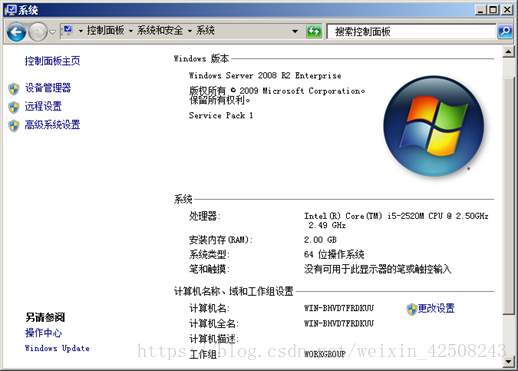{width="3.8088265529308836in"
height="2.7277318460192475in"}

图-1

单击左侧的"高级系统设置"，可以打开"系统属性"设置，如图-2所示，切换到"计算机名"对话框。

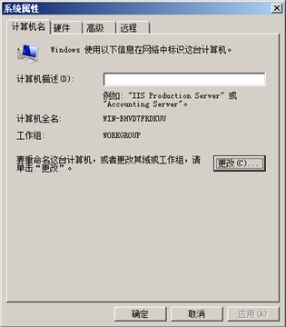{width="2.1398818897637795in"
height="2.445061242344707in"}

图-2

2）修改计算机名及所属工作组名。

通过系统属性修改计算机名、工作组

在"系统属性"的"计算机名"标签页中，单击"更改"按钮，弹出的对话框中会显示了当前设置的计算机名、工作组名信息，如图-3所示。

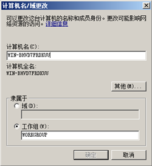{width="2.057832458442695in"
height="2.240570866141732in"}

图-3

根据实验要求设置修改计算机名（比如Teacher），将工作组名设为TARENA-NETWORK，如图-4所示，单击"确定"执行修改。

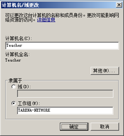{width="2.185741469816273in"
height="2.3946806649168852in"}

图-4

成功加入后会看到加入工作组欢迎信息（工作组由第一台加入的计算机自动创建），如图-5所示。

{width="2.4200853018372706in"
height="1.1558158355205599in"}

图-5

确定后，会提示需要重启以完成计算机名、域名的更改，如图-6所示。

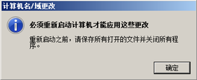{width="2.7429899387576553in"
height="1.1157731846019248in"}

图-6

关闭"系统属性"设置，根据提示"立即重新启动"计算机，再次以Administrator登入系统，确认计算机名、工作组信息等已经修改，如图-7所示。

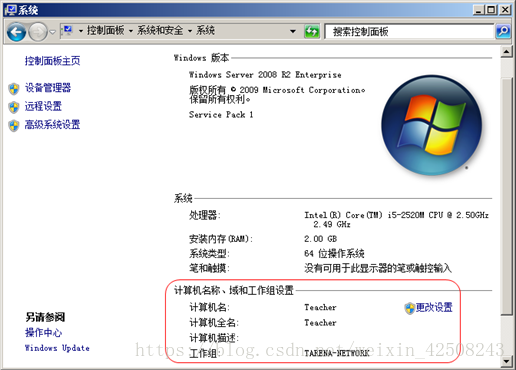{width="3.700929571303587in"
height="2.6510979877515313in"}

### 3.2TCP/IP地址配置(windows系统)

2.1 问题

为主机配置以下网络参数：

1）IP地址 192.168.1.10

2）子网掩码 255.255.255.0

3）网关 192.168.1.254

4）DNS 202.106.0.20

5）查看配置参数

2.2 方案

使用1台Windows 2008虚拟机，给其配置ip地址确保其可以正常的通信。

2.3 步骤

实现此案例需要按照如下步骤进行。

步骤一：为Windows 2008服务器配置IP地址，通过控制面板设置网卡的IP地址。

1）通过"开始"\--\>"控制面板"\--\>"网络和Internet"\--\>"网络和共享中心"\--\>"更改适配器设置"可查看网络连接列表，双击"本地连接"\--\>"属性"\--\>"Internet协议版本4（TCP/IPv4）"，可打开属性设置窗口。将IP地址设置为192.168.1.10，子网掩码255.255.255.0、网关设置为192.168.1.254、DNS设置为202.106.0.20，如图-8所示，单击"确定"保存

2）通过本地连接属性中的"详细信息"可确认设置结果，如图-9所示

3\) 通过命令行查看网卡的IP地址

单击"开始"\--\>"运行"，输入"cmd"并确定，将会打开cmd命令控制台窗口

#执行命令"ipconfig /all"可查看当前IP地址的详细配置：

C:\\Users\\Administrator\> ipconfig /all

Windows IP 配置

   主机名  . . . . . . . . . . . . . : WIN-BHVD7FRDKUU

   主 DNS 后缀 . . . . . . . . . . . :

   节点类型  . . . . . . . . . . . . : 混合

   IP 路由已启用 . . . . . . . . . . : 否

   WINS 代理已启用 . . . . . . . . . : 否

以太网适配器 本地连接:

   连接特定的 DNS 后缀 . . . . . . . :

   描述. . . . . . . . . . . . . . . : Intel(R) PRO/1000 MT Network Connection

   物理地址. . . . . . . . . . . . . : 00-0C-29-68-96-8E

   DHCP 已启用 . . . . . . . . . . . : 否

   自动配置已启用. . . . . . . . . . : 是

   本地链接 IPv6 地址. . . . . . . . : fe80::6996:7ae3:7c3b:4841%11(首选)

   IPv4 地址 . . . . . . . . . . . . : 192.168.1.10(首选)

   子网掩码  . . . . . . . . . . . . : 255.255.255.0

   默认网关. . . . . . . . . . . . . : 192.168.1.254

   DHCPv6 IAID . . . . . . . . . . . : 234884137

   DHCPv6 客户端 DUID  . . . . . . . : 00-01-00-01-1A-0B-72-75-00-0C-29-68-96-8E

   DNS 服务器  . . . . . . . . . . . : 202.106.0.20

   TCPIP 上的 NetBIOS  . . . . . . . : 已启用

### 3.3网络连通性测试

3.1 问题

为主机设置以下网络参数并测试连通性：

1)主机1配置IP地址 192.168.1.10，子网掩码 255.255.255.0

2)主机2配置IP地址 192.168.1.20，子网掩码 255.255.255.0

3)两台主机连接到同一网络

4)用[ping命令](https://www.baidu.com/s?wd=ping%E5%91%BD%E4%BB%A4&tn=24004469_oem_dg&rsv_dl=gh_pl_sl_csd)测试网络连通性

3.2 方案

使用2台Windows 2008虚拟机，通过："虚拟网络'private1相连，如图-12所示。将两个2008虚拟机网卡的IP地址设置为同一个网段，即可相互通信

实现此案例需要按照如下步骤进行。

3.3 步骤

步骤一：修改两台Windows 2008虚拟机的网络类及IP地址

1)在KVM窗口中， 调整Windows 2008虚拟机的硬件设置，在关机的状态下将网络[连接设置](https://www.baidu.com/s?wd=%E8%BF%9E%E6%8E%A5%E8%AE%BE%E7%BD%AE&tn=24004469_oem_dg&rsv_dl=gh_pl_sl_csd)为"虚拟网络'private1'：独立的网络、内部网且只能使用主机路由"，单击"应用"保存设置

2)为Windows 2008（server1）配置IP地址，通过控制面板设置网卡的IP地址

通过"开始"\--\>"控制面板"\--\>"网络和Internet"\--\>"网络和共享中心"\--\>"更改适配器设置"可查看网络连接列表，双击"本地连接"\--\>"属性"\--\>"Internet协议版本4（TCP/IPv4）"，可打开属性设置窗口。将IP地址设置为192.168.1.10，子网掩码255.255.255.0、网关设置为192.168.1.254、DNS设置为202.106.0.20，如图-14所示，单击"确定"保存。

 3)为Windows 2008（server2）配置IP地址，通过控制面板设置网卡的IP地址。

通过"开始"\--\>"控制面板"\--\>"网络和Internet"\--\>"网络和共享中心"\--\>"更改适配器设置"可查看网络连接列表，双击"本地连接"\--\>"属性"\--\>"Internet协议版本4（TCP/IPv4）"，可打开属性设置窗口。将IP地址设置为192.168.1.20，子网掩码255.255.255.0、网关设置为192.168.1.254、DNS设置为202.106.0.20，如图-15所示，单击"确定"保存。

步骤二：关闭两台Windows 2008系统的防火墙

3)通过"控制面板"\--\>"检查防火墙状态"，可以查看防火墙服务的运行状态（默认为绿色的标识，标识已启用）

4)单击左侧的"打开或关闭[Windows防火墙](https://www.baidu.com/s?wd=Windows%E9%98%B2%E7%81%AB%E5%A2%99&tn=24004469_oem_dg&rsv_dl=gh_pl_sl_csd)"，可自定义是否启用防火墙，对于普通内网服务器建议可将防火墙关闭，如图-17所示，单击确定。

5)再次检查防火墙状态，发现已经变成醒目的红色，表示Windows防火墙已停止

步骤三：使用ping命令测试网络连通性

1)使用命令行查看两台设备间是否可以通信

在Windows 2008（server1）中单击"开始"\--\>"运行"，输入"cmd"并确定，将会打开cmd命令控制台窗口，确认可ping通本网段内的其他主机IP地址（192.168.1.20），若成功获得"来自192.168.1.20的回复"，说明本机可访问本网段内其他主机：

C:\\Users\\Administrator\> ping 192.168.1.20

正在 Ping 192.168.1.20 具有 32 字节的数据:

来自 192.168.1.20 的回复: 字节=32 时间\<1ms TTL=128

来自 192.168.1.20 的回复: 字节=32 时间\<1ms TTL=128

来自 192.168.1.20 的回复: 字节=32 时间\<1ms TTL=128

来自 192.168.1.20 的回复: 字节=32 时间\<1ms TTL=128

192.168.1.20 的 Ping 统计信息:

    数据包: 已发送 = 4，已接收 = 4，丢失 = 0 (0% 丢失)，

往返行程的估计时间(以毫秒为单位):

    最短 = 0ms，最长 = 0ms，平均 = 0ms

## 4、2台电脑的网线直连

直连线：SIDE1（T568B）\--SIDE2（T568B）\
双绞线：SIDE1（T568B）\--SIDE2（T568A）

T568A：1绿白，2绿，3橙白，4蓝，5蓝白，6橙，7棕白，8棕

T568B：1橙白，2橙，3绿白，4蓝，5蓝白，6绿，7棕白，8棕

第一步、在两台电脑直接用网线连接时需要一头按EIA/TIA568A标准(白绿、绿、白橙、蓝、白蓝、橙、白棕、棕)压制[水晶头](https://www.baidu.com/s?wd=%E6%B0%B4%E6%99%B6%E5%A4%B4&tn=SE_PcZhidaonwhc_ngpagmjz&rsv_dl=gh_pc_zhidao)，另一头按
EIA/TIA
568B标准(白橙、橙、白绿、蓝、白蓝、绿、白棕、棕)压制水晶头，一般这样跳线称之为[级联线]{.mark}，具体色序见下图。

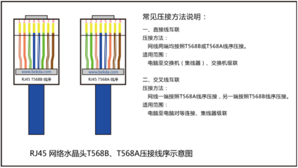{width="5.25in"
height="2.9633333333333334in"}

# Windows系统下构建局域网下的PC集群

## 小型局域网计算机集群并行计算配置

1、首先建立一个用于并行计算集群的工作组MPI（基于局域网）

将并行计算节点电脑建立一个工作组（workgroup)

{width="5.047654199475065in"
height="3.794154636920385in"}

2、在每台计算上上安装MPI并行库，并进行和单机操作一样的配置工作。

单机Windows操作系统下的MPI并行环境配置：启动MPI的注册操作界面，填写计算机的账户和密码，进行注册，成功后下面显示Password
encrypted into the Registry。推荐用命令行形式注册MPICH2

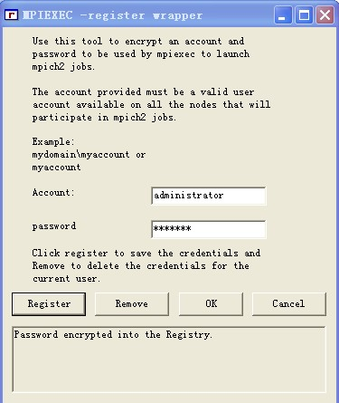{width="2.141554024496938in"
height="2.5416666666666665in"}

在每台电脑上安装好mpi的安装包，安装的路径任意选择，没必要每台计算机都是相同路径。安装过程中在使用者那选择everyone，安装好后，目录如下

然后将MPICH2的bin目录添加进系统环境变量Path中。

注意：安装好后，在资源管理器的进程内会有smpd.exe的进程，要进行MPI计算，必须要有这个进程，没有的话尝试重新安装。

工作组中的计算节点的MPI注册时：

mpiexec -register

account应输入：WORKGROUP\\Administrator

启动配置界面，在Domain中填写计算机名（Lijian），点击Get
Hosts，下面若显示为绿色则配置成功，为灰色则配置失败。

![C:\\DOCUME\~1\\ADMINI\~1\\LOCALS\~1\\Temp\\W\~C1L%M\`3M\]\$YE\$A\$)C6VY1.jpg](./media/image18.jpeg){width="3.7404024496937884in"
height="3.4186898512685913in"}

**添加新的用户账户**

为了是计算机群能使用MPI，应该给每个安装了MPI的计算机添加一个相同的账户，账户密码也必须相同，账户要求是管理员身份。这里分别为每台计算机创建一个名为mpi的账户，密码随便设，假设就是123.

这里要注意：如果原来使用的是Administrator账户，创建mpi账户后每次开机只有mpi账户可供选择。实际上Administrator账户既然存在，只不过是被隐藏了，要是开始时可以选择使用Administrator还是mpi账户登录，可以修改注册表：

HKEY_LOCAL_MACHINE\\SOFTWARE\\Microsoft\\WindowsNT\\CurrentVersion\\Winlogon\\SpecialAccounts\\UserList
，然后在右侧的窗口中找到以Administrator命名的Dword键（如果没有可以自己建立），双击，将键值由0改为1，退出后重新启动计算机。 

还有一点，要进行mpi计算，没有必要非要使用mpi账户登录计算机，即只要计算机上存在mpi这个账户即可进行mpi的并行计算，与用户选择是否利用mpi账户登录计算机没有关系(很多文章没有阐释清楚这个问题)。

3、检查计算机集群的联机状况。

在**Domain**里填写建立的工作组名MPI，用**Get
Hosts**搜索工作组中已经安装MPI并行库的计算机，已经安装的计算机将显示绿色，没有安装MPI并行库的将显示灰色，**Scan
for Version**显示MPI并行库的版本号。

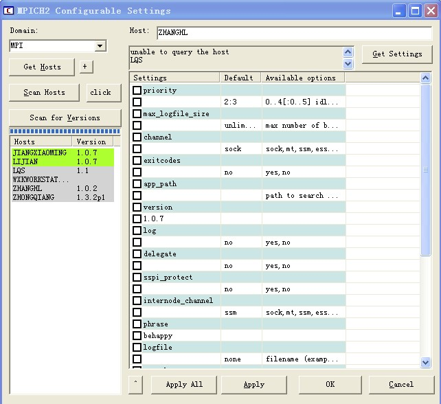{width="4.029826115485564in"
height="3.6908694225721783in"}

4\. 配置

测试前需要在每台计算机上创建一个路径相同的文件夹，比如在D盘根目录下创建一个mpi的文件夹，将编译成功需要执行的.exe文件放入mpi文件夹内。

注意将各计算机的防火墙关了(包括360杀毒软件以及防火墙等）。各计算机在同一个项目组内，这里我使用的个计算机都是在一个路由器内，都在WORKGROUP工作组内。

选择开始------MPICH2------wmpiconfig.exe，如下图，如果安装了MPI的计算机连接成功会高亮显示(如下图绿色)。如果有连接不成功的，请按以上步奏仔细检查。

所内路由器下主机161台，

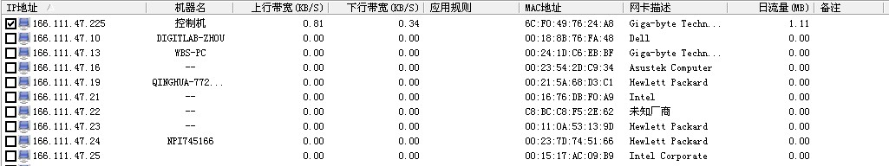{width="5.593020559930009in"
height="1.0480096237970253in"}

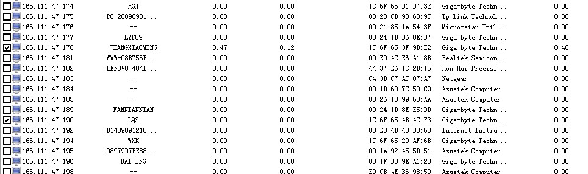{width="5.256944444444445in"
height="1.730152012248469in"}

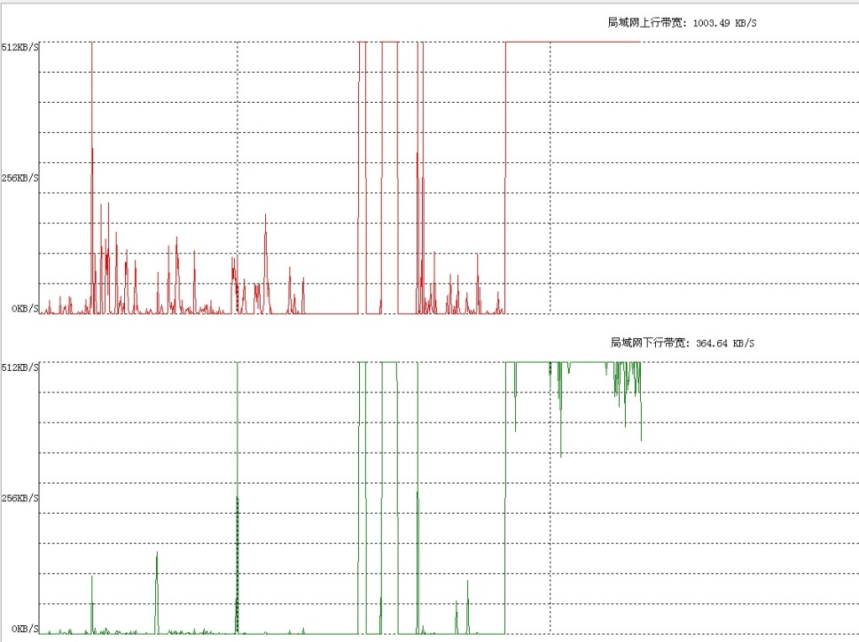{width="5.219873140857393in"
height="3.8435247156605423in"}

清华大学河流研究所的局域网带宽（路由器）

上行就是上传速度，下行就是下载速度

建立多台PC节点构成的一个机群计算环境时，还要有必要的路由器、交换机或是集线器等。

mpiexec -hosts 2 166.111.47.225 166.111.47.190 D:\\mpi\\cpi.exe

解决办法：

直接用一根网线对接，把两台电脑的IP设置成同一网段，比如一台是166.111.47.1，另一台可以使166.111.47.2。把网线两端分别插在两台电脑的网线插口上，在网上邻居里可以找到对方的电脑。

4、运行wmpiexec.exe，启动MPI计算界面。

方法有两种：

1、命令行形式：编写配置文件cpi.cfg（一个计算Pi的并行示例程序），内容如下：

-n 2 -host 166.111.47.1 c:\\mpi\\CPI.exe

-n 4 -host 166.111.47.2 c:\\mpi\\CPI.exe

其中，2和4表示各计算机启动的CPU个数，后面是各计算机的IP地址（[也可以为计算机名]{.mark}），接着是执行程序的路径地址。

在DOS界面下输入：**mpiexec --configfile
cpi.cfg**，即可运行并行程序cpi.exe。

或者

mpiexec -hosts 2 166.111.47.1 166.111.47.2 c:\\mpi\\CPI.exe

mpiexec -hosts 2 Jiangxiaoming -n 2 c:\\mpi\\CPI.exe lijian -n 4
c:\\mpi\\CPI.exe

**注意事项：**

**（1）每台电脑上安装的MPI版本尽最好一样；**

**（2）每台电脑设置的账户和密码都要一样；**

**（3）关闭所有的防火墙.**

2、GUI界面操作形式。

可选择计算工作路径，在hosts栏中填写集群中计算机名（Jiangxiaoming、Lijian）。采用界面操作形式，执行程序的路径必须在每台计算机中一致。

![C:\\Documents and Settings\\Chiang\\Application
Data\\Tencent\\Users\\693341396\\QQ\\WinTemp\\RichOle\\HO54)KNT\]7VJ\$J\~RIK\`02%9.jpg](./media/image23.jpeg){width="3.6862390638670166in"
height="3.7219903762029745in"}

{width="5.51253280839895in"
height="1.2535279965004373in"}

![C:\\Documents and Settings\\Chiang\\Application
Data\\Tencent\\Users\\693341396\\QQ\\WinTemp\\RichOle\\\]S5182Z4LHWD0F@K\[2N\[\$M3.jpg](./media/image25.jpeg){width="5.576887576552931in"
height="1.2812379702537182in"}

注意：必须关闭Windows防火墙和其他防火墙，否则影响通信以及运行将可能出错。

## 并行初步测试

使用洞庭湖水系的90万三角单元的计算，垂向为1层(nvrt=2)。模拟1h的物理过程（恒定流计算），计算时间步长为60s，
每1h保存一次计算结果。测试如下：

DELL工作站（使用8进程），CPU耗时0.208h，模拟耗时/物理时间=1//0.208=4.808倍。

使用120s计算时间步长，物理时间/模拟耗时=1//0.10715=9.33倍

DELL工作站（使用4进程）+笔记本（使用4进程），CPU耗时0.08672h，模拟耗时/物理时间=11.5312倍

# 香溪河水质模拟算例的集群并行计算

（1）将编译好的用于模拟香溪水流水质的并行程序Parallel_XiangXi.exe及输入参数文件和网格数据文件拷贝到每台计算机的工作目录下（路径需相同）。

（2）在主机中启动并行计算界面，按照上面相同的步骤操作。如图：

{width="3.986111111111111in"
height="4.016718066491689in"}

单机

![C:\\Documents and Settings\\Chiang\\Application
Data\\Tencent\\Users\\693341396\\QQ\\WinTemp\\RichOle\\05\]}OTFG{M@(F94%FO5{7O6.jpg](./media/image27.jpeg){width="4.378996062992126in"
height="4.416790244969379in"}

集群（只有两台PC）

一台机器上，4个处理器，计算速度较快，在两台机器上，同样4个处理器，由于通过网络传输中间计算数据，计算速度下降了很多。

通过观察：

1.  主机并行计算显示界面，子机并行计算过程中不显示计算界面，仅在电脑任务管理器中的进程中显示若干计算进程。

{width="2.5008759842519686in"
height="2.631327646544182in"}

师兄的电脑

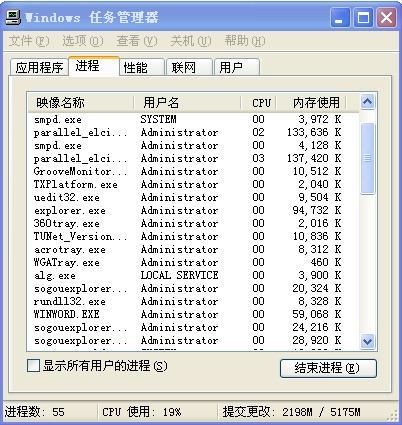{width="2.826388888888889in"
height="2.9904418197725287in"}

我的电脑

（2）在子机进程管理器中除了运行若干个计算程序进程Parallel_XiangXi.exe，还有2个进程smpd.exe（用于计算机之间的通信）。

（3）在一台计算机中进行多次mpiexec的并行计算，各CPU间的通信互不影响。

计算机配置：

+-----------+------------------+-------------------+------------------+
| 设备      | 计算机1（LI）    | 计算机2（LIN）    | 计算机3（JIANG） |
+===========+==================+===================+==================+
| CPU       | Intel Xeon i5    | Intel Xeon i7     | Intel Xeon i5    |
|           |                  |                   |                  |
|           | (2 Core 4P)      | (2 Core 4P)       | (2 Core 4P)      |
+-----------+------------------+-------------------+------------------+
| 内存(GB)  | 3.21             | 3.24              | 3.21             |
+-----------+------------------+-------------------+------------------+
| 主频(GHz) | 2.67             | 2.97              | 2.80             |
+-----------+------------------+-------------------+------------------+
| 操作系统  | Windows XP(32-   | Windows XP(32-    | Windows XP(32-   |
|           | bit)             | bit)              | bit)             |
+-----------+------------------+-------------------+------------------+

+---------------+---------------------------+--------------------------+
| 设备          | 工作站1                   | 工作站2                  |
+===============+===========================+==========================+
| CPU           | Intel Xeon X5365          | Intel Xeon E5320         |
|               |                           |                          |
|               | (4 P)                     | (8 P)                    |
+---------------+---------------------------+--------------------------+
| 内存(GB)      | 8.0                       | 4.0                      |
+---------------+---------------------------+--------------------------+
| 主频(GHz)     | 3.00                      | 1.86                     |
+---------------+---------------------------+--------------------------+
| 操作系统      | Windows Server 2008(64-   | Windows Server 2008 HPC  |
|               | bit)                      | Edition (64- bit)        |
+---------------+---------------------------+--------------------------+

## 并行ELcirc模型在香溪河水质模拟中的应用

目前绝大多数的并行计算是在Linux操作系统下进行的，本文将建立Windows操作系统下的并行计算平台，香溪河水质并行模拟计算在以下配置的计算平台上实施：

Windows XP操作系统、MPI通信方式、ParMETIS网格分区

采用的编译器Visual Studio6.0和 Intel Visual Fortran11.0

香溪计算网格分区示意图

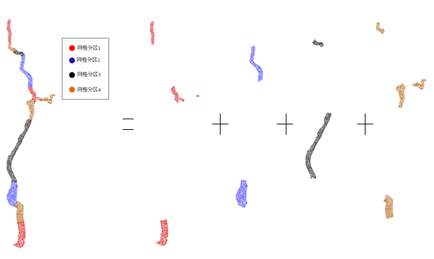{width="4.409722222222222in"
height="2.625in"}

+---------------+----------------+-----------------+-----------------+
| 研究尺度      | 研究目的       | 物              | 计算耗时        |
|               |                | 理过程持续时间  |                 |
+===============+================+=================+=================+
| 国家          | 国家政策       | 6-12个月        | 几星期          |
|               |                |                 |                 |
|               | 风险决策       | 年              | 几个月          |
+---------------+----------------+-----------------+-----------------+
| 地区          | 事后评估       | 6-12个月        | 几星期          |
|               |                |                 |                 |
|               | 洪水预警       | 12-24小时       | 2-3个小时       |
|               |                |                 |                 |
|               | 滞洪区修复     | 3-4个星期       | 几天            |
+---------------+----------------+-----------------+-----------------+
| 局部          | 工程设计       | 几个月-几年     | 几个月          |
|               |                |                 |                 |
|               | 风险决策       | 几个小时        | 几个小时        |
+---------------+----------------+-----------------+-----------------+

## 并行计算性能评价

并行计算性能的评价指标有：

1.  基本指标：执行时间、工作负荷、存储性能

2.  加速比评测：Amdahl定理、Gastofson定理、Sun-Ni定理

Amdahl定理是由IBM公司的计算机体系结构师吉恩·阿姆达尔在1967年发表的论文中提出的，由于程序中总存在一些不可并行计算的部分，因此它将限制并行化的好处，为了描述并行计算效率或"计算瓶颈"，Amdahl定理定义了加速比：加速比=采用改进措施后性能/未采用改进措施前的性能
=未采用改进措施前执行某任务时间／采用改进措施后执行某任务的时间

具体为：

n个处理器加速因子：

其中，f为非并行百分比，n不管多大，S也不能超过1/f。

可扩放性标准：等效率标准、等速度标准、平均延迟标准

加速比公式: 

其中，为使用个处理器时的总计算耗时。

并行效率公式：

理想情况下，并行效率为单位1。

随着处理器个数增加，实际的加速比与理想的加速线有偏离，是因为总存在没有并行化的代码，这部分的代码执行时间与处理器个数无关。而且，随着处理器个数增加，处理器间的通信时间也随之增加，但在较多的网格单元数情况下，抵消了一部分通信耗时，因此较多网格单元数的并行加速比更接近理想加速线。

{width="5.037225503062118in"
height="3.9963232720909887in"}

香溪河简单并行计算（使用4个进程）的并行计算效率评价如下：

{width="3.467296587926509in"
height="2.771593394575678in"}{width="3.7810323709536307in"
height="3.011599956255468in"}

{width="3.777774496937883in"
height="2.8679166666666664in"}

并行粒度表示并行任务的实际工作量，是衡量计算与通信大小的度量。如果粒度太细，则并行因通信开销增加而受到影响，如果粒度太粗，则并行性因负载不均衡而受到影响。具体可分为计算应用的粒度和机器的粒度，一般提高的粒度都是针对计算应用而言。粒度可用计算时间与通信时间的比值来表示。

{width="4.57142060367454in"
height="3.6541786964129486in"}

相对于计算时间，CPU间的通信时间很短。本计算中，计算时间一般是通信时间的30倍。

## 64位并行程序计算

（1）编译64位的网格分区静态链接库文件

A、使用VC6.0在32位平台上开发64位程序，在微软下载中心下载Microsoft
Platform SDK并安装，从64位内部版本环境启动Visual
C++6.0，导入MEtis和ParMEtis的工程项目。

B、添加 64 位调试配置，将编译器的活动配置设置为 64
位（Debug-64），执行编译生成两个静态链接库文件libMEtis.lib和libParMEtis.lib。

（2）在64位服务器上安装Visual Studio2008和Intel Visual
Fortran11.0编译器，同时安装64位的MPI并行库，并添加到以上安装的编译器相关目录下。

# 云计算和高性能计算和虚拟化

超级计算机和云计算都是时下比较火的两个概念，前者一般主要面向科学计算、工程模拟、动漫渲染等领域，大多属于计算密集型的应用，后者则主要是在Web2.0、社交网络、企业IT建设和信息化等领域，以数据密集型、I/O密集型应用为主。虽然侧重点有所不同，但这两者之间是很有渊源的，比如两者都使用了分布式计算、网格计算、集群、高密度计算等技术，也有一些领域在使用云计算从事HPC类的应用，如北京市计算中心就在打造"北京工业云"，为中小企业提供产品设计模拟服务，浪潮和NVIDIA也在分别推各自的"渲染云"方案。不过，HPC与云计算也存在很多不同，比如HPC几乎不用虚拟化技术，因为一个应用就可能把多个机器的CPU都跑满了，虚拟机没什么用武之地，而在企业私有云中，虚拟化却是一个最基础的技术。

# 参考文献

王皓，傅旭东，孙其诚等.大尺度流域水文并行计算的方法改进\[J\].应用基础与工程科学学报，2009,17（增刊）：1-9

郭延祥.并行组合数学模型方式研究及初步应用\[D\].清华大学博士论文，2010

Jason Sanders，Edward Kandrot著，聂雪军等 译. GPU高性能编程CUDA实战.
北京:机械工业出版社，2010

刘维峰，卢伟，许海燕. 基于局域网和MPI的PC集群计算环境.
计算机工程与设计，2005, 26(5)：1327-1329

# 工作站报价

-   DELL T3630图形工作站，6核6线程，3.0GHz，8G内存。报价：6980元

-   DELL T3630图形工作站，6核12线程，3.2GHz，16G内存/1T
    > SATA硬盘。报价：11580元\~1.5万元

-   DELL T7920 图形工作站，12核,3.4GHz，11G独显。报价：47330元

-   Dell T640 服务器，36核72线程，内存16G。报价：63399.0元

-   普赛 之强E5 2686 V4双路36核72线程。报价：23799-28199元

-   DELL T640, 36核72线程，32G 内存，3块8T硬盘。报价：84588元

-   DELLR930, 4CPU, E7-8867V4, 72核144线程， 2.4GHz， 128G内存，2块300G
    > 15K硬盘。报价：182980.0元

-   DELLR930, 4CPU, E7-8867V4, 72核144线程， 2.4GHz， 32G内存，4块600G
    > 15K硬盘。报价：

-   HP 金牌6150\*2颗，2.7GHz，36核72线程，64G内存，480G+4T，4块TESLA
    > GPU。报价：17万元

-   HP 金牌6140\*2颗，2.3GHz，36核72线程，64G内存，480G+4T，4块TITAN
    > GPU。报价：22万元。

## CPU报价：

Intel i9 7960X, 16核，CPU处理器。报价：11999.0元

AMD 16核32线程，TR4接口。报价：6599.0元

AMD 8 核16线程，3.7GHz。报价：4099元

AMD 8 核16线程，3.2GHz。报价：2199元
