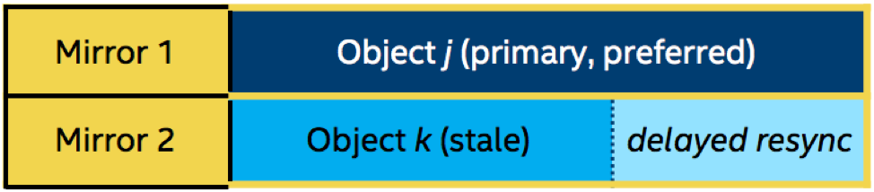

Introduced in Lustre 2.11

## File Level Redundancy (FLR)

- [File Level Redundancy (FLR)](#file-level-redundancy-flr)
- [Introduction](#introduction)
- [Operations](#operations)
  * [Creating a Mirrored File or Directory](#creating-a-mirrored-file-or-directory)
  * [Extending a Mirrored File](#extending-a-mirrored-file)
  * [Splitting a Mirrored File](#splitting-a-mirrored-file)
  * [Resynchronizing out-of-sync Mirrored File(s)](#resynchronizing-out-of-sync-mirrored-files)
  * [Verifying Mirrored File(s)](#verifying-mirrored-files)
  * [Finding Mirrored File(s)](#finding-mirrored-files)
- [Interoperability](#interoperability)

This chapter describes File Level Redundancy (FLR).

## Introduction

The Lustre file system was initially designed and implemented for HPC use. It has been working well on high-end storage that has internal redundancy and fault-tolerance. However, despite the expense and complexity of these storage systems, storage failures still occur, and before release 2.11, Lustre could not be more reliable than the individual storage and servers’ components on which it was based. The Lustre file system had no mechanism to mitigate storage hardware failures and files would become inaccessible if a server was inaccessible or otherwise out of service.

With the File Level Redundancy (FLR) feature introduced in Lustre Release 2.11, any Lustre file can store the same data on multiple OSTs in order for the system to be robust in the event of storage failures or other outages. With the choice of multiple mirrors, the best suited mirror can be chosen to satisfy an individual request, which has a direct impact on IO availability. Furthermore, for files that are concurrently read by many clients (e.g. input decks, shared libraries, or executables) the aggregate parallel read performance of a single file can be improved by creating multiple mirrors of the file data.

The first phase of the FLR feature has been implemented with delayed write ([Figure 18, “FLR Delayed Write”](#figure-18-flr-delayed-write)). While writing to a mirrored file, only one primary or preferred mirror will be updated directly during the write, while other mirrors will be simply marked as stale. The file can subsequently return to a mirrored state again by synchronizing among mirrors with command line tools (run by the user or administrator directly or via automated monitoring tools).

##### Figure 18. FLR Delayed Write

 

## Operations

Lustre provides `lfs mirror` command line tools for users to operate on mirrored files or directories.

### Creating a Mirrored File or Directory

**Command:**

```
lfs mirror create <--mirror-count|-N[mirror_count]
[setstripe_options|[--flags<=flags>]]> ... <filename|directory>
```

The above command will create a mirrored file or directory specified by *filename* or *directory*, respectively.

| Option                           | Description                                                  |
| -------------------------------- | ------------------------------------------------------------ |
| --mirror-count\|-N[mirror_count] | Indicates the number of mirrors to be created with the following setstripe options. It can be repeated multiple times to separate mirrors that have different layouts.The *mirror_count* argument is optional and defaults to `1` if it is not specified; if specified, it must follow the option without a space. |
| setstripe_options                | Specifies a specific layout for the mirror. It can be a plain layout with a specific striping pattern or a composite layout, such as [the section called “Progressive File Layout(PFL)”](03.08-Managing%20File%20Layout%20(Striping)%20and%20Free%20Space.md#progressive-file-layoutpfl). The options are the same as those for the `lfs setstripe` command.If *setstripe_options* are not specified, then the stripe options inherited from the previous component will be used. If there is no previous component, then the `stripe_count` and`stripe_size` options inherited from the filesystem-wide default values will be used, and the OST `pool_name` inherited from the parent directory will be used. |
| --flags<=flags>                  | Sets flags to the mirror to be created.Only the `prefer` flag is supported at this time. This flag will be set to all components that belong to the corresponding mirror. The `prefer` flag gives a hint to Lustre for which mirrors should be used to serve I/O. When a mirrored file is being read, the component(s) with the `prefer` flag is likely to be picked to serve the read; and when a mirrored file is prepared to be written, the MDT will tend to choose the component with the `prefer` flag set and mark the other components with overlapping extents as stale. This flag just provides a hint to Lustre, which means Lustre may still choose mirrors without this flag set, for instance, if all preferred mirrors are unavailable when the I/O occurs. This flag can be set on multiple components.**Note:** This flag will be set to all components that belong to the corresponding mirror. The `--comp-flags` option also exists, which can be set to individual components at mirror creation time. |

**Note:** For redundancy and fault-tolerance, users need to make sure that different mirrors must be on different OSTs, even OSSs and racks. An understanding of cluster topology is necessary to achieve this architecture. In the initial implementation the use of the existing OST pools mechanism will allow separating OSTs by any arbitrary criteria: i.e. fault domain. In practice, users can take advantage of OST pools by grouping OSTs by topological information. Therefore, when creating a mirrored file, users can indicate which OST pools can be used by mirrors.

**Examples:**

The following command creates a mirrored file with 2 plain layout mirrors:

```
client# lfs mirror create -N -S 4M -c 2 -p flash \
                          -N -c -1 -p archive /mnt/testfs/file1
```

The following command displays the layout information of the mirrored file `/mnt/testfs/file1`:

```
client# lfs getstripe /mnt/testfs/file1
/mnt/testfs/file1
  lcm_layout_gen:    2
  lcm_mirror_count:  2
  lcm_entry_count:   2
    lcme_id:             65537
    lcme_mirror_id:      1
    lcme_flags:          init
    lcme_extent.e_start: 0
    lcme_extent.e_end:   EOF
      lmm_stripe_count:  2
      lmm_stripe_size:   4194304
      lmm_pattern:       raid0
      lmm_layout_gen:    0
      lmm_stripe_offset: 1
      lmm_pool:          flash
      lmm_objects:
      - 0: { l_ost_idx: 1, l_fid: [0x100010000:0x2:0x0] }
      - 1: { l_ost_idx: 0, l_fid: [0x100000000:0x2:0x0] }

    lcme_id:             131074
    lcme_mirror_id:      2
    lcme_flags:          init
    lcme_extent.e_start: 0
    lcme_extent.e_end:   EOF
      lmm_stripe_count:  6
      lmm_stripe_size:   4194304
      lmm_pattern:       raid0
      lmm_layout_gen:    0
      lmm_stripe_offset: 3
      lmm_pool:          archive
      lmm_objects:
      - 0: { l_ost_idx: 3, l_fid: [0x100030000:0x2:0x0] }
      - 1: { l_ost_idx: 4, l_fid: [0x100040000:0x2:0x0] }
      - 2: { l_ost_idx: 5, l_fid: [0x100050000:0x2:0x0] }
      - 3: { l_ost_idx: 6, l_fid: [0x100060000:0x2:0x0] }
      - 4: { l_ost_idx: 7, l_fid: [0x100070000:0x2:0x0] }
      - 5: { l_ost_idx: 2, l_fid: [0x100020000:0x2:0x0] }
```

The first mirror has 4MB stripe size and two stripes across OSTs in the “flash” OST pool. The second mirror has 4MB stripe size inherited from the first mirror, and stripes across all of the available OSTs in the “archive” OST pool.

As mentioned above, it is recommended to use the `--pool|-p` option (one of the `lfs setstripe` options) with OST pools configured with independent fault domains to ensure different mirrors will be placed on different OSTs, servers, and/or racks, thereby improving availability and performance. If the setstripe options are not specified, it is possible to create mirrors with objects on the same OST(s), which would remove most of the benefit of using replication.

In the layout information printed by `lfs getstripe`, `lcme_mirror_id` shows mirror ID, which is the unique numerical identifier for a mirror. And `lcme_flags` shows mirrored component flags. Valid flag names are:

- `init` - indicates mirrored component has been initialized (has allocated OST objects).
- `stale` - indicates mirrored component does not have up-to-date data. Stale components will not be used for read or write operations, and need to be resynchronized by running `lfs mirror resync` command before they can be accessed again.
- `prefer` - indicates mirrored component is preferred for read or write. For example, the mirror is located on SSD-based OSTs or is closer, fewer hops, on the network to the client. This flag can be set by users at mirror creation time.

The following command creates a mirrored file with 3 PFL mirrors:

```
client# lfs mirror create -N -E 4M -p flash --flags=prefer -E eof -c 2 \
-N -E 16M -S 8M -c 4 -p archive --comp-flags=prefer -E eof -c -1 \
-N -E 32M -c 1 -p none -E eof -c -1 /mnt/testfs/file2
```

The following command displays the layout information of the mirrored file `/mnt/testfs/file2`:

```
client# lfs getstripe /mnt/testfs/file2
/mnt/testfs/file2
  lcm_layout_gen:    6
  lcm_mirror_count:  3
  lcm_entry_count:   6
    lcme_id:             65537
    lcme_mirror_id:      1
    lcme_flags:          init,prefer
    lcme_extent.e_start: 0
    lcme_extent.e_end:   4194304
      lmm_stripe_count:  1
      lmm_stripe_size:   1048576
      lmm_pattern:       raid0
      lmm_layout_gen:    0
      lmm_stripe_offset: 1
      lmm_pool:          flash
      lmm_objects:
      - 0: { l_ost_idx: 1, l_fid: [0x100010000:0x3:0x0] }

    lcme_id:             65538
    lcme_mirror_id:      1
    lcme_flags:          prefer
    lcme_extent.e_start: 4194304
    lcme_extent.e_end:   EOF
      lmm_stripe_count:  2
      lmm_stripe_size:   1048576
      lmm_pattern:       raid0
      lmm_layout_gen:    0
      lmm_stripe_offset: -1
      lmm_pool:          flash

    lcme_id:             131075
    lcme_mirror_id:      2
    lcme_flags:          init,prefer
    lcme_extent.e_start: 0
    lcme_extent.e_end:   16777216
      lmm_stripe_count:  4
      lmm_stripe_size:   8388608
      lmm_pattern:       raid0
      lmm_layout_gen:    0
      lmm_stripe_offset: 4
      lmm_pool:          archive
      lmm_objects:
      - 0: { l_ost_idx: 4, l_fid: [0x100040000:0x3:0x0] }
      - 1: { l_ost_idx: 5, l_fid: [0x100050000:0x3:0x0] }
      - 2: { l_ost_idx: 6, l_fid: [0x100060000:0x3:0x0] }
      - 3: { l_ost_idx: 7, l_fid: [0x100070000:0x3:0x0] }

    lcme_id:             131076
    lcme_mirror_id:      2
    lcme_flags:          0
    lcme_extent.e_start: 16777216
    lcme_extent.e_end:   EOF
      lmm_stripe_count:  6
      lmm_stripe_size:   8388608
      lmm_pattern:       raid0
      lmm_layout_gen:    0
      lmm_stripe_offset: -1
      lmm_pool:          archive

    lcme_id:             196613
    lcme_mirror_id:      3
    lcme_flags:          init
    lcme_extent.e_start: 0
    lcme_extent.e_end:   33554432
      lmm_stripe_count:  1
      lmm_stripe_size:   8388608
      lmm_pattern:       raid0
      lmm_layout_gen:    0
      lmm_stripe_offset: 0
      lmm_objects:
      - 0: { l_ost_idx: 0, l_fid: [0x100000000:0x3:0x0] }

    lcme_id:             196614
    lcme_mirror_id:      3
    lcme_flags:          0
    lcme_extent.e_start: 33554432
    lcme_extent.e_end:   EOF
      lmm_stripe_count:  -1
      lmm_stripe_size:   8388608
      lmm_pattern:       raid0
      lmm_layout_gen:    0
      lmm_stripe_offset: -1
```

For the first mirror, the first component inherits the stripe count and stripe size from filesystem-wide default values. The second component inherits the stripe size and OST pool from the first component, and has two stripes. Both of the components are allocated from the “flash” OST pool. Also, the flag `prefer` is applied to all the components of the first mirror, which tells the client to read data from those components whenever they are available.

For the second mirror, the first component has an 8MB stripe size and 4 stripes across OSTs in the “archive” OST pool. The second component inherits the stripe size and OST pool from the first component, and stripes across all of the available OSTs in the “archive” OST pool. The flag `prefer` is only applied to the first component.

For the third mirror, the first component inherits the stripe size of 8MB from the last component of the second mirror, and has one single stripe. The OST pool name is cleared and inherited from the parent directory (if it was set with OST pool name). The second component inherits stripe size from the first component, and stripes across all of the available OSTs.

### Extending a Mirrored File

**Command:**

```
lfs mirror extend [--no-verify] <--mirror-count|-N[mirror_count]
[setstripe_options|-f <victim_file>]> ... <filename>
```

The above command will append mirror(s) indicated by `setstripe options` or just take the layout from existing file *victim_file* into the file *filename*. The *filename* must be an existing file, however, it can be a mirrored or regular non-mirrored file. If it is a non-mirrored file, the command will convert it to a mirrored file.

| Option                           | Description                                                  |
| -------------------------------- | ------------------------------------------------------------ |
| --mirror-count\|-N[mirror_count] | Indicates the number of mirrors to be added with the following `setstripe options`. It can be repeated multiple times to separate mirrors that have different layouts.The *mirror_count* argument is optional and defaults to `1` if it is not specified; if specified, it must follow the option without a space. |
| setstripe_options                | Specifies a specific layout for the mirror. It can be a plain layout with specific striping pattern or a composite layout, such as [the section called “Progressive File Layout(PFL)”](03.08-Managing%20File%20Layout%20(Striping)%20and%20Free%20Space.md#progressive-file-layoutpfl). The options are the same as those for the `lfs setstripe` command. If *setstripe_options* are not specified, then the stripe options inherited from the previous component will be used. If there is no previous component, then the `stripe_count` and`stripe_size` options inherited from filesystem-wide default values will be used, and the OST`pool_name` inherited from parent directory will be used. |
| -f <victim_file>                 | If *victim_file* exists, the command will split the layout from that file and use it as a mirror added to the mirrored file. After the command is finished, the *victim_file* will be removed.                                                                                                               **Note**:                                                                                                                                                                                                                       The *setstripe_options* cannot be specified with `-f <victim_file>` option in one command line. |
| --no-verify                      | If *victim_file* is specified, the command will verify that the file contents from *victim_file* are the same as *filename*. Otherwise, the command will return a failure. However, the option `--no-verify` can be used to override this verification. This option can save significant time on file comparison if the file size is large, but use it only when the file contents are known to be the same. |

**Note**: The `lfs mirror extend` operation won't be applied to the directory.

**Examples:**

The following commands create a non-mirrored file, convert it to a mirrored file, and extend it with a plain layout mirror:

```
# lfs setstripe -p flash /mnt/testfs/file1
# lfs getstripe /mnt/testfs/file1
/mnt/testfs/file1
lmm_stripe_count:  1
lmm_stripe_size:   1048576
lmm_pattern:       raid0
lmm_layout_gen:    0
lmm_stripe_offset: 0
lmm_pool:          flash
        obdidx           objid           objid           group
             0               4            0x4                0

# lfs mirror extend -N -S 8M -c -1 -p archive /mnt/testfs/file1
# lfs getstripe /mnt/testfs/file1
/mnt/testfs/file1
  lcm_layout_gen:    2
  lcm_mirror_count:  2
  lcm_entry_count:   2
    lcme_id:             65537
    lcme_mirror_id:      1
    lcme_flags:          init
    lcme_extent.e_start: 0
    lcme_extent.e_end:   EOF
      lmm_stripe_count:  1
      lmm_stripe_size:   1048576
      lmm_pattern:       raid0
      lmm_layout_gen:    0
      lmm_stripe_offset: 0
      lmm_pool:          flash
      lmm_objects:
      - 0: { l_ost_idx: 0, l_fid: [0x100000000:0x4:0x0] }

    lcme_id:             131073
    lcme_mirror_id:      2
    lcme_flags:          init
    lcme_extent.e_start: 0
    lcme_extent.e_end:   EOF
      lmm_stripe_count:  6
      lmm_stripe_size:   8388608
      lmm_pattern:       raid0
      lmm_layout_gen:    0
      lmm_stripe_offset: 3
      lmm_pool:          archive
      lmm_objects:
      - 0: { l_ost_idx: 3, l_fid: [0x100030000:0x3:0x0] }
      - 1: { l_ost_idx: 4, l_fid: [0x100040000:0x4:0x0] }
      - 2: { l_ost_idx: 5, l_fid: [0x100050000:0x4:0x0] }
      - 3: { l_ost_idx: 6, l_fid: [0x100060000:0x4:0x0] }
      - 4: { l_ost_idx: 7, l_fid: [0x100070000:0x4:0x0] }
      - 5: { l_ost_idx: 2, l_fid: [0x100020000:0x3:0x0] }
```

The following commands split the PFL layout from a *victim_file* and use it as a mirror added to the mirrored file `/mnt/testfs/file1` created in the above example without data verification:

```
# lfs setstripe -E 16M -c 2 -p none \
                -E eof -c -1 /mnt/testfs/victim_file
# lfs getstripe /mnt/testfs/victim_file
/mnt/testfs/victim_file
  lcm_layout_gen:    2
  lcm_mirror_count:  1
  lcm_entry_count:   2
    lcme_id:             1
    lcme_mirror_id:      0
    lcme_flags:          init
    lcme_extent.e_start: 0
    lcme_extent.e_end:   16777216
      lmm_stripe_count:  2
      lmm_stripe_size:   1048576
      lmm_pattern:       raid0
      lmm_layout_gen:    0
      lmm_stripe_offset: 5
      lmm_objects:
      - 0: { l_ost_idx: 5, l_fid: [0x100050000:0x5:0x0] }
      - 1: { l_ost_idx: 6, l_fid: [0x100060000:0x5:0x0] }

    lcme_id:             2
    lcme_mirror_id:      0
    lcme_flags:          0
    lcme_extent.e_start: 16777216
    lcme_extent.e_end:   EOF
      lmm_stripe_count:  -1
      lmm_stripe_size:   1048576
      lmm_pattern:       raid0
      lmm_layout_gen:    0
      lmm_stripe_offset: -1

# lfs mirror extend --no-verify -N -f /mnt/testfs/victim_file \
                    /mnt/testfs/file1
# lfs getstripe /mnt/testfs/file1
/mnt/testfs/file1
  lcm_layout_gen:    3
  lcm_mirror_count:  3
  lcm_entry_count:   4
    lcme_id:             65537
    lcme_mirror_id:      1
    lcme_flags:          init
    lcme_extent.e_start: 0
    lcme_extent.e_end:   EOF
      lmm_stripe_count:  1
      lmm_stripe_size:   1048576
      lmm_pattern:       raid0
      lmm_layout_gen:    0
      lmm_stripe_offset: 0
      lmm_pool:          flash
      lmm_objects:
      - 0: { l_ost_idx: 0, l_fid: [0x100000000:0x4:0x0] }

    lcme_id:             131073
    lcme_mirror_id:      2
    lcme_flags:          init
    lcme_extent.e_start: 0
    lcme_extent.e_end:   EOF
      lmm_stripe_count:  6
      lmm_stripe_size:   8388608
      lmm_pattern:       raid0
      lmm_layout_gen:    0
      lmm_stripe_offset: 3
      lmm_pool:          archive
      lmm_objects:
      - 0: { l_ost_idx: 3, l_fid: [0x100030000:0x3:0x0] }
      - 1: { l_ost_idx: 4, l_fid: [0x100040000:0x4:0x0] }
      - 2: { l_ost_idx: 5, l_fid: [0x100050000:0x4:0x0] }
      - 3: { l_ost_idx: 6, l_fid: [0x100060000:0x4:0x0] }
      - 4: { l_ost_idx: 7, l_fid: [0x100070000:0x4:0x0] }
      - 5: { l_ost_idx: 2, l_fid: [0x100020000:0x3:0x0] }

    lcme_id:             196609
    lcme_mirror_id:      3
    lcme_flags:          init
    lcme_extent.e_start: 0
    lcme_extent.e_end:   16777216
      lmm_stripe_count:  2
      lmm_stripe_size:   1048576
      lmm_pattern:       raid0
      lmm_layout_gen:    0
      lmm_stripe_offset: 5
      lmm_objects:
      - 0: { l_ost_idx: 5, l_fid: [0x100050000:0x5:0x0] }
      - 1: { l_ost_idx: 6, l_fid: [0x100060000:0x5:0x0] }

    lcme_id:             196610
    lcme_mirror_id:      3
    lcme_flags:          0
    lcme_extent.e_start: 16777216
    lcme_extent.e_end:   EOF
      lmm_stripe_count:  -1
      lmm_stripe_size:   1048576
      lmm_pattern:       raid0
      lmm_layout_gen:    0
      lmm_stripe_offset: -1
```

After extending, the *victim_file* was removed:

```
# ls /mnt/testfs/victim_file
ls: cannot access /mnt/testfs/victim_file: No such file or directory
```

### Splitting a Mirrored File

**Command:**

```
lfs mirror split <--mirror-id <mirror_id>>
[--destroy|-d] [-f <new_file>] <mirrored_file>
```

The above command will split a specified mirror with ID *<mirror_id>* out of an existing mirrored file specified by*mirrored_file*. By default, a new file named `<mirrored_file>.mirror~<mirror_id>` will be created with the layout of the split mirror. If the `--destroy|-d` option is specified, then the split mirror will be destroyed. If the `-f <new_file>` option is specified, then a file named *new_file* will be created with the layout of the split mirror. If *mirrored_file* has only one mirror existing after split, it will be converted to a regular non-mirrored file. If the original *mirrored_file* is not a mirrored file, then the command will return an error.

| Option                  | Description                                                  |
| ----------------------- | ------------------------------------------------------------ |
| --mirror-id <mirror_id> | The unique numerical identifier for a mirror. The mirror ID is unique within a mirrored file and is automatically assigned at file creation or extension time. It can be fetched by the `lfs getstripe` command. |
| --destroy\|-d           | Indicates the split mirror will be destroyed.                |
| -f <new_file>           | Indicates a file named *new_file* will be created with the layout of the split mirror. |

**Examples:**

The following commands create a mirrored file with 4 mirrors, then split 3 mirrors separately from the mirrored file.

Creating a mirrored file with 4 mirrors:

```
# lfs mirror create -N2 -E 4M -p flash -E eof -c -1 \
                    -N2 -S 8M -c 2 -p archive /mnt/testfs/file1
# lfs getstripe /mnt/testfs/file1
/mnt/testfs/file1
  lcm_layout_gen:    6
  lcm_mirror_count:  4
  lcm_entry_count:   6
    lcme_id:             65537
    lcme_mirror_id:      1
    lcme_flags:          init
    lcme_extent.e_start: 0
    lcme_extent.e_end:   4194304
      lmm_stripe_count:  1
      lmm_stripe_size:   1048576
      lmm_pattern:       raid0
      lmm_layout_gen:    0
      lmm_stripe_offset: 1
      lmm_pool:          flash
      lmm_objects:
      - 0: { l_ost_idx: 1, l_fid: [0x100010000:0x4:0x0] }

    lcme_id:             65538
    lcme_mirror_id:      1
    lcme_flags:          0
    lcme_extent.e_start: 4194304
    lcme_extent.e_end:   EOF
      lmm_stripe_count:  2
      lmm_stripe_size:   1048576
      lmm_pattern:       raid0
      lmm_layout_gen:    0
      lmm_stripe_offset: -1
      lmm_pool:          flash

    lcme_id:             131075
    lcme_mirror_id:      2
    lcme_flags:          init
    lcme_extent.e_start: 0
    lcme_extent.e_end:   4194304
      lmm_stripe_count:  1
      lmm_stripe_size:   1048576
      lmm_pattern:       raid0
      lmm_layout_gen:    0
      lmm_stripe_offset: 0
      lmm_pool:          flash
      lmm_objects:
      - 0: { l_ost_idx: 0, l_fid: [0x100000000:0x5:0x0] }

    lcme_id:             131076
    lcme_mirror_id:      2
    lcme_flags:          0
    lcme_extent.e_start: 4194304
    lcme_extent.e_end:   EOF
      lmm_stripe_count:  2
      lmm_stripe_size:   1048576
      lmm_pattern:       raid0
      lmm_layout_gen:    0
      lmm_stripe_offset: -1
      lmm_pool:          flash

    lcme_id:             196613
    lcme_mirror_id:      3
    lcme_flags:          init
    lcme_extent.e_start: 0
    lcme_extent.e_end:   EOF
      lmm_stripe_count:  2
      lmm_stripe_size:   8388608
      lmm_pattern:       raid0
      lmm_layout_gen:    0
      lmm_stripe_offset: 4
      lmm_pool:          archive
      lmm_objects:
      - 0: { l_ost_idx: 4, l_fid: [0x100040000:0x5:0x0] }
      - 1: { l_ost_idx: 5, l_fid: [0x100050000:0x6:0x0] }

    lcme_id:             262150
    lcme_mirror_id:      4
    lcme_flags:          init
    lcme_extent.e_start: 0
    lcme_extent.e_end:   EOF
      lmm_stripe_count:  2
      lmm_stripe_size:   8388608
      lmm_pattern:       raid0
      lmm_layout_gen:    0
      lmm_stripe_offset: 7
      lmm_pool:          archive
      lmm_objects:
      - 0: { l_ost_idx: 7, l_fid: [0x100070000:0x5:0x0] }
      - 1: { l_ost_idx: 2, l_fid: [0x100020000:0x4:0x0] }
```

Splitting the mirror with ID `1` from `/mnt/testfs/file1` and creating `/mnt/testfs/file1.mirror~1` with the layout of the split mirror:

```
# lfs mirror split --mirror-id 1 /mnt/testfs/file1
# lfs getstripe /mnt/testfs/file1.mirror~1
/mnt/testfs/file1.mirror~1
  lcm_layout_gen:    1
  lcm_mirror_count:  1
  lcm_entry_count:   2
    lcme_id:             65537
    lcme_mirror_id:      1
    lcme_flags:          init
    lcme_extent.e_start: 0
    lcme_extent.e_end:   4194304
      lmm_stripe_count:  1
      lmm_stripe_size:   1048576
      lmm_pattern:       raid0
      lmm_layout_gen:    0
      lmm_stripe_offset: 1
      lmm_pool:          flash
      lmm_objects:
      - 0: { l_ost_idx: 1, l_fid: [0x100010000:0x4:0x0] }

    lcme_id:             65538
    lcme_mirror_id:      1
    lcme_flags:          0
    lcme_extent.e_start: 4194304
    lcme_extent.e_end:   EOF
      lmm_stripe_count:  2
      lmm_stripe_size:   1048576
      lmm_pattern:       raid0
      lmm_layout_gen:    0
      lmm_stripe_offset: -1
      lmm_pool:          flash
```

Splitting the mirror with ID `2` from `/mnt/testfs/file1` and destroying it:

```
# lfs mirror split --mirror-id 2 -d /mnt/testfs/file1
# lfs getstripe /mnt/testfs/file1
/mnt/testfs/file1
  lcm_layout_gen:    8
  lcm_mirror_count:  2
  lcm_entry_count:   2
    lcme_id:             196613
    lcme_mirror_id:      3
    lcme_flags:          init
    lcme_extent.e_start: 0
    lcme_extent.e_end:   EOF
      lmm_stripe_count:  2
      lmm_stripe_size:   8388608
      lmm_pattern:       raid0
      lmm_layout_gen:    0
      lmm_stripe_offset: 4
      lmm_pool:          archive
      lmm_objects:
      - 0: { l_ost_idx: 4, l_fid: [0x100040000:0x5:0x0] }
      - 1: { l_ost_idx: 5, l_fid: [0x100050000:0x6:0x0] }

    lcme_id:             262150
    lcme_mirror_id:      4
    lcme_flags:          init
    lcme_extent.e_start: 0
    lcme_extent.e_end:   EOF
      lmm_stripe_count:  2
      lmm_stripe_size:   8388608
      lmm_pattern:       raid0
      lmm_layout_gen:    0
      lmm_stripe_offset: 7
      lmm_pool:          archive
      lmm_objects:
      - 0: { l_ost_idx: 7, l_fid: [0x100070000:0x5:0x0] }
      - 1: { l_ost_idx: 2, l_fid: [0x100020000:0x4:0x0] }
```

Splitting the mirror with ID `3` from `/mnt/testfs/file1` and creating `/mnt/testfs/file2` with the layout of the split mirror:

```
# lfs mirror split --mirror-id 3 -f /mnt/testfs/file2 \
                   /mnt/testfs/file1
# lfs getstripe /mnt/testfs/file2
/mnt/testfs/file2
  lcm_layout_gen:    1
  lcm_mirror_count:  1
  lcm_entry_count:   1
    lcme_id:             196613
    lcme_mirror_id:      3
    lcme_flags:          init
    lcme_extent.e_start: 0
    lcme_extent.e_end:   EOF
      lmm_stripe_count:  2
      lmm_stripe_size:   8388608
      lmm_pattern:       raid0
      lmm_layout_gen:    0
      lmm_stripe_offset: 4
      lmm_pool:          archive
      lmm_objects:
      - 0: { l_ost_idx: 4, l_fid: [0x100040000:0x5:0x0] }
      - 1: { l_ost_idx: 5, l_fid: [0x100050000:0x6:0x0] }

# lfs getstripe /mnt/testfs/file1
/mnt/testfs/file1
  lcm_layout_gen:    9
  lcm_mirror_count:  1
  lcm_entry_count:   1
    lcme_id:             262150
    lcme_mirror_id:      4
    lcme_flags:          init
    lcme_extent.e_start: 0
    lcme_extent.e_end:   EOF
      lmm_stripe_count:  2
      lmm_stripe_size:   8388608
      lmm_pattern:       raid0
      lmm_layout_gen:    0
      lmm_stripe_offset: 7
      lmm_pool:          archive
      lmm_objects:
      - 0: { l_ost_idx: 7, l_fid: [0x100070000:0x5:0x0] }
      - 1: { l_ost_idx: 2, l_fid: [0x100020000:0x4:0x0] }
```

The above layout information showed that mirrors with ID `1, 2, and 3` were all split from the mirrored file`/mnt/testfs/file1`.

### Resynchronizing out-of-sync Mirrored File(s)

**Command:**

```
lfs mirror resync [--only <mirror_id[,...]>]
<mirrored_file> [<mirrored_file2>...]
```

The above command will resynchronize out-of-sync mirrored file(s) specified by *mirrored_file*. It supports specifying multiple mirrored files in one command line.

If there is no stale mirror for the specified mirrored file(s), then the command does nothing. Otherwise, it will copy data from synced mirror to the stale mirror(s), and mark all successfully copied mirror(s) as SYNC. If the `--only <mirror_id[,...]>` option is specified, then the command will only resynchronize the mirror(s) specified by the*mirror_id(s)*. This option cannot be used when multiple mirrored files are specified.

| Option                   | Description                                                  |
| ------------------------ | ------------------------------------------------------------ |
| --only <mirror_id[,...]> | Indicates which mirror(s) specified by *mirror_id(s)* needs to be resynchronized. The *mirror_id* is the unique numerical identifier for a mirror. Multiple *mirror_ids* are separated by comma. This option cannot be used when multiple mirrored files are specified. |

**Note:** With delayed write implemented in FLR phase 1, after writing to a mirrored file, users need to run `lfs mirror resync` command to get all mirrors synchronized.

**Examples:**

The following commands create a mirrored file with 3 mirrors, then write some data into the file and resynchronizes stale mirrors.

Creating a mirrored file with 3 mirrors:

```
# lfs mirror create -N -E 4M -p flash -E eof \
                    -N2 -p archive /mnt/testfs/file1
# lfs getstripe /mnt/testfs/file1
/mnt/testfs/file1
  lcm_layout_gen:    4
  lcm_mirror_count:  3
  lcm_entry_count:   4
    lcme_id:             65537
    lcme_mirror_id:      1
    lcme_flags:          init
    lcme_extent.e_start: 0
    lcme_extent.e_end:   4194304
      lmm_stripe_count:  1
      lmm_stripe_size:   1048576
      lmm_pattern:       raid0
      lmm_layout_gen:    0
      lmm_stripe_offset: 1
      lmm_pool:          flash
      lmm_objects:
      - 0: { l_ost_idx: 1, l_fid: [0x100010000:0x5:0x0] }

    lcme_id:             65538
    lcme_mirror_id:      1
    lcme_flags:          0
    lcme_extent.e_start: 4194304
    lcme_extent.e_end:   EOF
      lmm_stripe_count:  1
      lmm_stripe_size:   1048576
      lmm_pattern:       raid0
      lmm_layout_gen:    0
      lmm_stripe_offset: -1
      lmm_pool:          flash

    lcme_id:             131075
    lcme_mirror_id:      2
    lcme_flags:          init
    lcme_extent.e_start: 0
    lcme_extent.e_end:   EOF
      lmm_stripe_count:  1
      lmm_stripe_size:   1048576
      lmm_pattern:       raid0
      lmm_layout_gen:    0
      lmm_stripe_offset: 3
      lmm_pool:          archive
      lmm_objects:
      - 0: { l_ost_idx: 3, l_fid: [0x100030000:0x4:0x0] }

    lcme_id:             196612
    lcme_mirror_id:      3
    lcme_flags:          init
    lcme_extent.e_start: 0
    lcme_extent.e_end:   EOF
      lmm_stripe_count:  1
      lmm_stripe_size:   1048576
      lmm_pattern:       raid0
      lmm_layout_gen:    0
      lmm_stripe_offset: 4
      lmm_pool:          archive
      lmm_objects:
      - 0: { l_ost_idx: 4, l_fid: [0x100040000:0x6:0x0] }
```

Writing some data into the mirrored file `/mnt/testfs/file1`:

```
# yes | dd of=/mnt/testfs/file1 bs=1M count=2
2+0 records in
2+0 records out
2097152 bytes (2.1 MB) copied, 0.0320613 s, 65.4 MB/s

# lfs getstripe /mnt/testfs/file1
/mnt/testfs/file1
  lcm_layout_gen:    5
  lcm_mirror_count:  3
  lcm_entry_count:   4
    lcme_id:             65537
    lcme_mirror_id:      1
    lcme_flags:          init
    lcme_extent.e_start: 0
    lcme_extent.e_end:   4194304
    ......

    lcme_id:             65538
    lcme_mirror_id:      1
    lcme_flags:          0
    lcme_extent.e_start: 4194304
    lcme_extent.e_end:   EOF
    ......

    lcme_id:             131075
    lcme_mirror_id:      2
    lcme_flags:          init,stale
    lcme_extent.e_start: 0
    lcme_extent.e_end:   EOF
    ......

    lcme_id:             196612
    lcme_mirror_id:      3
    lcme_flags:          init,stale
    lcme_extent.e_start: 0
    lcme_extent.e_end:   EOF
    ......
```

The above layout information showed that data were written into the first component of mirror with ID `1`, and mirrors with ID `2` and `3` were marked with “stale” flag.

Resynchronizing the stale mirror with ID `2` for the mirrored file `/mnt/testfs/file1`:

```
# lfs mirror resync --only 2 /mnt/testfs/file1
# lfs getstripe /mnt/testfs/file1
/mnt/testfs/file1
  lcm_layout_gen:    7
  lcm_mirror_count:  3
  lcm_entry_count:   4
    lcme_id:             65537
    lcme_mirror_id:      1
    lcme_flags:          init
    lcme_extent.e_start: 0
    lcme_extent.e_end:   4194304
    ......

    lcme_id:             65538
    lcme_mirror_id:      1
    lcme_flags:          0
    lcme_extent.e_start: 4194304
    lcme_extent.e_end:   EOF
    ......

    lcme_id:             131075
    lcme_mirror_id:      2
    lcme_flags:          init
    lcme_extent.e_start: 0
    lcme_extent.e_end:   EOF
    ......

    lcme_id:             196612
    lcme_mirror_id:      3
    lcme_flags:          init,stale
    lcme_extent.e_start: 0
    lcme_extent.e_end:   EOF
    ......
```

The above layout information showed that after resynchronizing, the “stale” flag was removed from mirror with ID `2`.

Resynchronizing all of the stale mirrors for the mirrored file `/mnt/testfs/file1`:

```
# lfs mirror resync /mnt/testfs/file1
# lfs getstripe /mnt/testfs/file1
/mnt/testfs/file1
  lcm_layout_gen:    9
  lcm_mirror_count:  3
  lcm_entry_count:   4
    lcme_id:             65537
    lcme_mirror_id:      1
    lcme_flags:          init
    lcme_extent.e_start: 0
    lcme_extent.e_end:   4194304
    ......

    lcme_id:             65538
    lcme_mirror_id:      1
    lcme_flags:          0
    lcme_extent.e_start: 4194304
    lcme_extent.e_end:   EOF
    ......

    lcme_id:             131075
    lcme_mirror_id:      2
    lcme_flags:          init
    lcme_extent.e_start: 0
    lcme_extent.e_end:   EOF
    ......

    lcme_id:             196612
    lcme_mirror_id:      3
    lcme_flags:          init
    lcme_extent.e_start: 0
    lcme_extent.e_end:   EOF
    ......
```

The above layout information showed that after resynchronizing, none of the mirrors were marked as stale.

### Verifying Mirrored File(s)

**Command:**

```
lfs mirror verify [--only <mirror_id,mirror_id2[,...]>]
[--verbose|-v] <mirrored_file> [<mirrored_file2> ...]
```

The above command will verify that each SYNC mirror (contains up-to-date data) of a mirrored file, specified by*mirrored_file*, has exactly the same data. It supports specifying multiple mirrored files in one command line.

This is a scrub tool that should be run on regular basis to make sure that mirrored files are not corrupted. The command won't repair the file if it turns out to be corrupted. Usually, an administrator should check the file content from each mirror and decide which one is correct and then invoke `lfs mirror resync` to repair it manually.

| Option                              | Description                                                  |
| ----------------------------------- | ------------------------------------------------------------ |
| --only <mirror_id,mirror_id2[,...]> | Indicates which mirrors specified by *mirror_ids* need to be verified. The *mirror_id*is the unique numerical identifier for a mirror. Multiple *mirror_ids* are separated by comma.Note: At least two *mirror_ids* are required. This option cannot be used when multiple mirrored files are specified. |
| --verbose\|-v                       | Indicates the command will print where the differences are if the data do not match. Otherwise, the command will just return an error in that case. This option can be repeated for multiple times to print more information. |

**Note:**

Mirror components that have “stale” or “offline” flags will be skipped and not verified.

**Examples:**

The following command verifies that each mirror of a mirrored file contains exactly the same data:

```
# lfs mirror verify /mnt/testfs/file1
```

The following command has the `-v` option specified to print where the differences are if the data does not match:

```
# lfs mirror verify -vvv /mnt/testfs/file2
Chunks to be verified in /mnt/testfs/file2:
[0, 0x200000)   [1, 2, 3, 4]    4
[0x200000, 0x400000)    [1, 2, 3, 4]    4
[0x400000, 0x600000)    [1, 2, 3, 4]    4
[0x600000, 0x800000)    [1, 2, 3, 4]    4
[0x800000, 0xa00000)    [1, 2, 3, 4]    4
[0xa00000, 0x1000000)   [1, 2, 3, 4]    4
[0x1000000, 0xffffffffffffffff) [1, 2, 3, 4]    4

Verifying chunk [0, 0x200000) on mirror: 1 2 3 4
CRC-32 checksum value for chunk [0, 0x200000):
Mirror 1:       0x207b02f1
Mirror 2:       0x207b02f1
Mirror 3:       0x207b02f1
Mirror 4:       0x207b02f1

Verifying chunk [0, 0x200000) on mirror: 1 2 3 4 PASS

Verifying chunk [0x200000, 0x400000) on mirror: 1 2 3 4
CRC-32 checksum value for chunk [0x200000, 0x400000):
Mirror 1:       0x207b02f1
Mirror 2:       0x207b02f1
Mirror 3:       0x207b02f1
Mirror 4:       0x207b02f1

Verifying chunk [0x200000, 0x400000) on mirror: 1 2 3 4 PASS

Verifying chunk [0x400000, 0x600000) on mirror: 1 2 3 4
CRC-32 checksum value for chunk [0x400000, 0x600000):
Mirror 1:       0x42571b66
Mirror 2:       0x42571b66
Mirror 3:       0x42571b66
Mirror 4:       0xabdaf92

lfs mirror verify: chunk [0x400000, 0x600000) has different
checksum value on mirror 1 and mirror 4.
Verifying chunk [0x600000, 0x800000) on mirror: 1 2 3 4
CRC-32 checksum value for chunk [0x600000, 0x800000):
Mirror 1:       0x1f8ad0d8
Mirror 2:       0x1f8ad0d8
Mirror 3:       0x1f8ad0d8
Mirror 4:       0x18975bf9

lfs mirror verify: chunk [0x600000, 0x800000) has different
checksum value on mirror 1 and mirror 4.
Verifying chunk [0x800000, 0xa00000) on mirror: 1 2 3 4
CRC-32 checksum value for chunk [0x800000, 0xa00000):
Mirror 1:       0x69c17478
Mirror 2:       0x69c17478
Mirror 3:       0x69c17478
Mirror 4:       0x69c17478

Verifying chunk [0x800000, 0xa00000) on mirror: 1 2 3 4 PASS

lfs mirror verify: '/mnt/testfs/file2' chunk [0xa00000, 0x1000000]
exceeds file size 0xa00000: skipped
```

The following command uses the `--only` option to only verify the specified mirrors:

```
# lfs mirror verify -v --only 1,4 /mnt/testfs/file2
CRC-32 checksum value for chunk [0, 0x200000):
Mirror 1:       0x207b02f1
Mirror 4:       0x207b02f1

CRC-32 checksum value for chunk [0x200000, 0x400000):
Mirror 1:       0x207b02f1
Mirror 4:       0x207b02f1

CRC-32 checksum value for chunk [0x400000, 0x600000):
Mirror 1:       0x42571b66
Mirror 4:       0xabdaf92

lfs mirror verify: chunk [0x400000, 0x600000) has different
checksum value on mirror 1 and mirror 4.
CRC-32 checksum value for chunk [0x600000, 0x800000):
Mirror 1:       0x1f8ad0d8
Mirror 4:       0x18975bf9

lfs mirror verify: chunk [0x600000, 0x800000) has different
checksum value on mirror 1 and mirror 4.
CRC-32 checksum value for chunk [0x800000, 0xa00000):
Mirror 1:       0x69c17478
Mirror 4:       0x69c17478

lfs mirror verify: '/mnt/testfs/file2' chunk [0xa00000, 0x1000000]
exceeds file size 0xa00000: skipped
```

### Finding Mirrored File(s)

The `lfs find` command is used to list files and directories with specific attributes. The following two attribute parameters are specific to a mirrored file or directory:

```
lfs find <directory|filename ...>
    [[!] --mirror-count|-N [+-]n]
    [[!] --mirror-state <[^]state>]
```

| Option                    | Description                                                  |
| ------------------------- | ------------------------------------------------------------ |
| --mirror-count\|-N [+-]n  | Indicates mirror count.                                      |
| --mirror-state <[^]state> | Indicates mirrored file state.If *^state* is used, print only files not matching *state*. Only one state can be specified.Valid state names are:`ro` – indicates the mirrored file is in read-only state. All of the mirrors contain the up-to-date data.`wp` – indicates the mirrored file is in a state of being written.`sp` – indicates the mirrored file is in a state of being resynchronized. |

**Note:**

Specifying `!` before an option negates its meaning (files NOT matching the parameter). Using `+` before a numeric value means 'more than n', while `-` before a numeric value means 'less than n'. If neither is used, it means 'equal to n', within the bounds of the unit specified (if any).

**Examples:**

The following command recursively lists all mirrored files that have more than 2 mirrors under directory `/mnt/testfs`:

```
# lfs find --mirror-count +2 --type f /mnt/testfs
```

The following command recursively lists all out-of-sync mirrored files under directory `/mnt/testfs`:

```
# lfs find --mirror-state=^ro --type f /mnt/testfs
```

## Interoperability

Introduced in Lustre release 2.11.0, the FLR feature is based on the [the section called “Progressive File Layout(PFL)”](03.08-Managing%20File%20Layout%20(Striping)%20and%20Free%20Space.md#progressive-file-layoutpfl) feature introduced in Lustre 2.10.0

For Lustre release 2.9 and older clients, which do not understand the PFL layout, they cannot access and open mirrored files created in the Lustre 2.11 filesystem.

The following example shows the errors returned by accessing and opening a mirrored file (created in Lustre 2.11 filesystem) on a Lustre 2.9 client:

```
# ls /mnt/testfs/mirrored_file
ls: cannot access /mnt/testfs/mirrored_file: Invalid argument

# cat /mnt/testfs/mirrored_file
cat: /mnt/testfs/mirrored_file: Operation not supported
```

For Lustre release 2.10 clients, which understand the PFL layout, but do not understand a mirrored layout, they can access mirrored files created in Lustre 2.11 filesystem, however, they cannot open them. This is because the Lustre 2.10 clients do not verify overlapping components so they would read and write mirrored files just as if they were normal PFL files, which will cause a problem where synced mirrors actually contain different data.

The following example shows the results returned by accessing and opening a mirrored file (created in Lustre 2.11 filesystem) on a Lustre 2.10 client:

```
# ls /mnt/testfs/mirrored_file
/mnt/testfs/mirrored_file

# cat /mnt/testfs/mirrored_file
cat: /mnt/testfs/mirrored_file: Operation not supported
```
