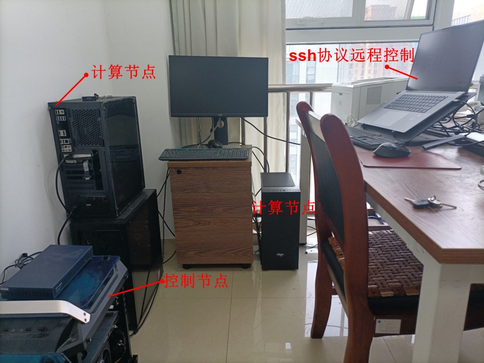

# 我的Ubuntu 20.04 集群安装

## 硬件配置
1个控制节点 + 3个计算节点

详细信息见"我的个人集群配置.xlsx"。

## 软件安装

### 基本的编译和通信软件(GNU compilers + OpenMPI)
    apt install build-essential gfortran
	apt-get install openmpi-bin libopenmpi-dev

### 分布式文件系统(NFS) 安装
	见"9步配置Linux网络文件系统(NFS).docx"。

### 集群调度系统 (slurm) 安装
	见"Ubuntu安装slurm.docx"。

### 测试节点间通信带宽
两台电脑需要处于同样的网络，一台作为服务机，另一台作为客户机，并且二者必须都要安装 iPerf 。
	apt install iperf
	
之后，我们再在服务机上启动 iperf 工具：
	$ iperf -s
	
然后，我们就可以等待客户机的接入了。客户机可以使用以下命令来连上服务机：
	$ iperf -c 192.168.1.225	

通过几秒钟的测试，它就会返回网络传输速率及带宽。
经过测试，我的集群通过以太网交换机，通信带宽为： 9432 Mbits/sec

### 集群监控工具安装

	见"集群监控-安装Prometheus.txt"和"集群监控-安装Grafana.docx"。

### 集群节点间通信的注意事项

1. 必须确保控制节点对计算节点的免密码SSH登录。
2. 关闭所有节点的防火墙: ufw disable
3. 所有节点的openm库尽可能都使用相同版本。
