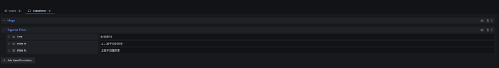
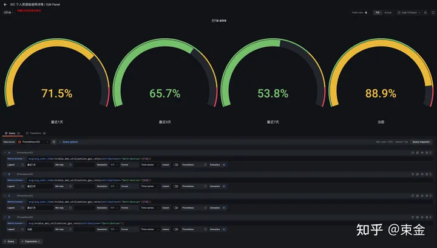
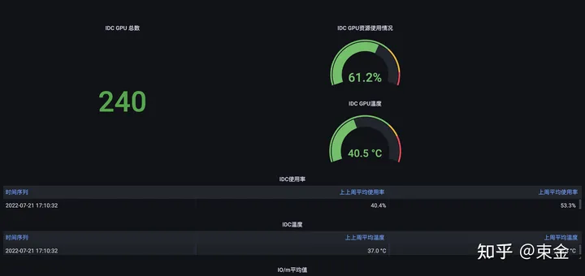
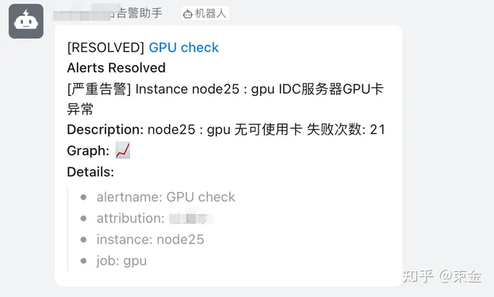
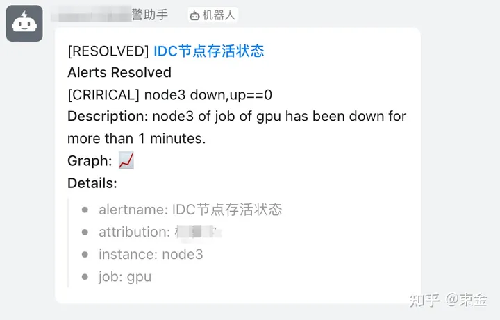
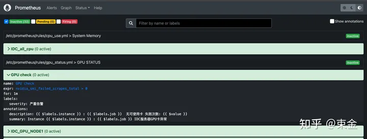

# prometheus监控gpu

<https://zhuanlan.zhihu.com/p/544321724>

公司环境新进30台GPU服务器，需要通过现有的prometheus进行监控，目前prometheus的插件中并不包含对GPU的监控功能，通过查询资料发现第三方插件，nvidia_gpu_expoter可以满足现有的需求。

nvidia_gpu_expoter是一个基于nvidia-smi命令收集指标的第三方服务，项目地址：https://github.com/utkuozdemir/nvidia_gpu_exporter

## 安装

项目地址上提供了不同环境的安装方式：

<https://github.com/utkuozdemir/nvidia_gpu_exporter/blob/master/INSTALL.md>

我的环境是linux所以选择二进制安装，如下：

\$ cd /opt

\$ VERSION=0.3.0

\$ wget
https://github.com/utkuozdemir/nvidia_gpu_exporter/releases/download/v\${VERSION}/nvidia_gpu_exporter\_\${VERSION}\_linux_x86_64.tar.gz

\$ tar -xvzf nvidia_gpu_exporter\_\${VERSION}\_linux_x86_64.tar.gz

\$ ./nvidia_gpu_exporter \--help

执行 ./nvidia_gpu_exporter \--help 后显示如下：

则安装成功。

启动：cd /opt && ./nvidia_gpu_exporter \--web.listen-address=\":9835\"

\--web.listen-address 参数指定端口号默认是9835

验证：访问ip:9835/metrics

指标页的信息太多了，不一一做展示，主要能看到nvidia_smi_gpu_info信息就代表，nvidia_gpu_exporter
已经获取到了本机显卡的信息；

本质上，nvidia_gpu_export二进制安装就是从项目地址下载一个二进制可执行文件到本地，二进制执行文件调用本机的nvidia_smi
命令去收集对应的指标并且反馈 /metrics 页下。

## 配置prometheus

通过以上操作后，我们获得了一个可访问地址，ip:9835/metrics，需要配置nvidia_gpu_exporter与prometheus的互联互通。

配置如下：

vim \$PROMETHEUS/prometheus.yml

···

scrape_configs:

\- job_name: gpu \# 任务名称，会在prometheus targets页面显示名称

static_configs:

\- targets: \[\'192.xx.xxx.x:9835\'\] \# nvidia_gpu_exporter地址

labels: \# 标签，可用于区分机器

instance: node1 \# 标签格式， key 与 value 介是自定义

\- targets: \[\'192.xx.xxx.x:9835\'\]

labels:

instance: node2

···

然后重启prometheus从targets页面查看新添加的job：

如图所示，则配置成功。接下来就是研究怎么出图了。

## Dashboard

grafana dashboard官方有开源适用于nvidia_gpu_exporter面板ID:14574

在grafana上导入即可；导入步骤：granfna左侧放大镜下的+号标识 -\> import
-\> 在import
via [grafana.com](https://link.zhihu.com/?target=http%3A//grafana.com/) 下输入
面板ID - \> 点击load - \> 配置面板详情如图所示：

配置完成后点击import，结果如下：

## nvidia_gpu_exporter指标

导入面板后[，发现不满足自己的需求，]{.mark}所以我们[要自定义面板]{.mark}，在自定义面板之前我们要介绍几个常用的nvidia_gpu_exporter指标：

  ------------------------------------------------------------------------------
  指标名                             功能
  ---------------------------------- -------------------------------------------
  nvidia_smi_utilization_gpu_ratio   GPU使用率 可以用于promql计算

  nvidia_smi_gpu_info                展现GPU卡的详情信息

  nvidia_smi_temperature_gpu         温度

  nvidia_smi_failed_scrapes_total    用于对GPU卡的检查，不等于0时则卡存在异常
  ------------------------------------------------------------------------------

prometheus的常用聚合操作符

sum 在维度上求和

max 在维度上求最大值

min 在维度上求最小值

avg 在维度上求平均值

stddev 求标准差

stdvar 求方差

count 统计向量元素的个数

count_values 统计相同数据值的元素数量

bottomk 样本值第k个最小值

topk 样本值第k个最大值

quantile 统计分位数

顺便引入一个函数，后边计算使用率可以用到

\<aggregation\>\_over_time()

以下函数允许随着时间的推移聚合给定范围向量的每个序列，并返回具有每个序列聚合结果的即时向量：

-   avg_over_time(range-vector)：指定间隔内所有点的平均值。

-   min_over_time(range-vector)：指定间隔中所有点的最小值。

-   max_over_time(range-vector)：指定间隔内所有点的最大值。

-   sum_over_time(range-vector)：指定时间间隔内所有值的总和。

### 接下来开始按照需求制作表盘

1需要知道所有GPU卡的总数；

新建granfna表盘 类型：stat

Query：

A: count(nvidia_smi_pstate{uuid=\~\".\*\"})

效果：

2\. 需要知道所有卡的平均使用率（实时）；

新建granfna表盘 类型：Gauge

Query：

A: avg(nvidia_smi_utilization_gpu_ratio{uuid=\~\".\*\"})

Unit：Percent(0.0-1.0)

效果：

3\. 需要知道所有卡的平均温度（实时）；

新建granfna表盘 类型：Gauge

Query：

A: avg(nvidia_smi_temperature_gpu{uuid=\~\".\*\"})

Unit：Celsius(℃)

效果：

4\. 要计算所有卡的上周上上周的平均使用率；

新建granfna表盘 类型：Table

Query：

A:
avg(avg_over_time(nvidia_smi_utilization_gpu_ratio{job=\~\"gpu\"}\[1w:1w\]))

B:
avg(avg_over_time(nvidia_smi_utilization_gpu_ratio{job=\~\"gpu\"}\[1w:1w\]
offset 1w))

Unit：Percent(0.0-1.0)

Transform:

Merge

Organize fields

Time ： 时间序列

Value #A : 上周平均使用率

Value #B : 上上周平均使用率

效果：

5\. 要计算所有卡的平均温度上周和上上周的数值；

新建granfna表盘 类型：Table

Query：

A: avg(avg_over_time(nvidia_smi_temperature_gpu\[1w:1w\] offset 1w))

B: avg(avg_over_time(nvidia_smi_temperature_gpu{job=\~\"gpu\"}\[1w:1w\]
offset 1w))

Unit：Celsius(℃)

Transform:

Merge

Organize fields

Time ： 时间序列

Value #A : 上周平均温度

Value #B : 上上周平均温度

6\. gpu服务器划分给项目的使用情况，分为几个维度 1/3/7
天使用率，上周和上上周的使用率以及卡的数量；

这里需要去prometheus的配置文件里给对一个的服务器打上对应的项目标签：

vim \$PROMETHEUS/prometheus.yml

···

scrape_configs:

\- job_name: gpu \# 任务名称，会在prometheus targets页面显示名称

static_configs:

\- targets: \[\'192.xx.xxx.x:9835\'\] \# nvidia_gpu_exporter地址

labels: \# 标签，可用于区分机器

instance: node1 \# 标签格式， key 与 value 介是自定义

attribution: 束金 \# 新打标签

重启prometheus生效；

因为涉及多个项目/人所以我们在grafana dashboard上创建变量

变量设置完成后在dashboard左上方显示下拉框，如图：

开始配置表盘：

1/3/7 天

新建granfna表盘 类型：Gauge

查询中引用 \$attribution 变量

表盘名称也可以引用变量

Query：

A:
avg(avg_over_time(nvidia_smi_utilization_gpu_ratio{attribution=\~\"\$attribution\"}\[1d\]))

B:
avg(avg_over_time(nvidia_smi_utilization_gpu_ratio{attribution=\~\"\$attribution\"}\[3d\]))

C:
avg(avg_over_time(nvidia_smi_utilization_gpu_ratio{attribution=\~\"\$attribution\"}\[7d\]))

D:
avg(nvidia_smi_utilization_gpu_ratio{attribution=\~\"\$attribution\"})

Unit：Percent(0.0-1.0)

效果：

最终效果：

## 告警

添加alertmanager告警规则

查看prometheus配置文件，查找alertmanager规则文件path

cat \$PROMETHEUS/prometheus.yml

alerting:

alertmanagers:

\- static_configs:

\- targets:

\- 192.xxx.xx.x:9093

rule_files: \# 告警规则文件

\- \'/etc/prometheus/rules/\*.yml\'

创建告警规则gpu_status.yml文件：

此规则主要目的是检测不到可用gpu卡就会告警。

vim /etc/prometheus/rules/gpu_status.yml

groups: \# 告警分组

\- name: GPU STATUS \# 组名称

rules: #告警规则

\- alert: GPU check \# 告警主题名称

expr: nvidia_smi_failed_scrapes_total \> 0

for: 1m \# 阈值持久时间

labels: \# 标签，定义告警级别

severity: 严重告警

annotations: \# 告警描述信息

summary: \"Instance {{ \$labels.instance }} : {{ \$labels.job }}
IDC服务器GPU卡异常 \"

description: \"{{ \$labels.instance }} : {{ \$labels.job }} 无可使用卡
失败次数: {{ \$value }}\" \# {{ \$value }} 调用的是上面的promeSQL的值

告警示例：

创建up_nodes.yml文件

此规则目的是检测服务器宕机发出告警

vim up_nodes.yml

groups:

\- name: base

rules:

\- alert: IDC节点存活状态

expr: up{job=\"gpu\"} == 0

for: 1m

labels:

severity: crirical

annotations:

description: \" {{ \$labels.instance }} of job of {{ \$labels.job }} has
been down for more than 1 minutes.\"

summary: \"{{ \$labels.instance }} down,up=={{ \$value }}\"

告警示例：

编辑完成yml文件后保存重启prometheus生效。然后通过web查看：

主要的告警规则这俩个就够了，可以根据不同的需求，在以上的规则基础上修改指标，新增不同的告警规则。

示例：

单卡故障告警规则；

至此，全部完成。
