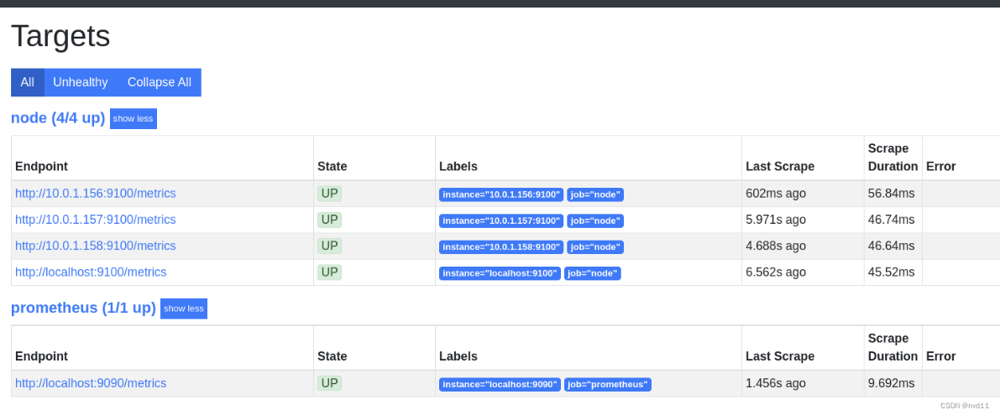
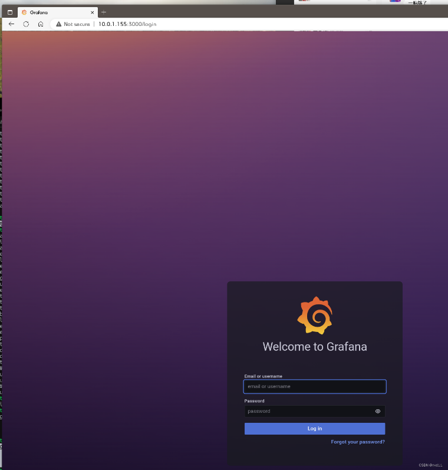
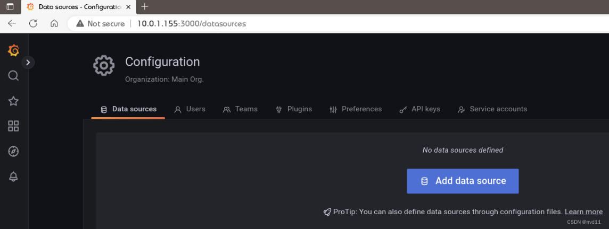
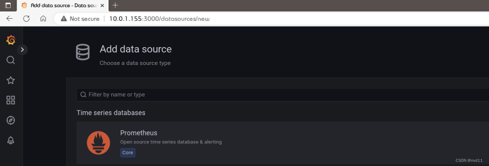
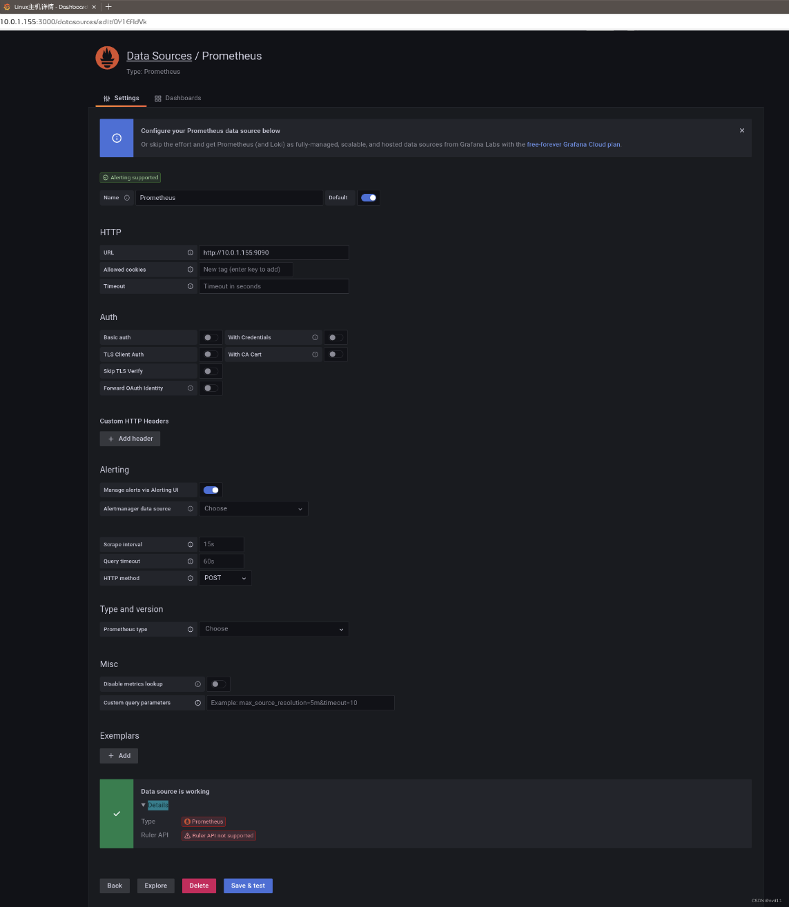
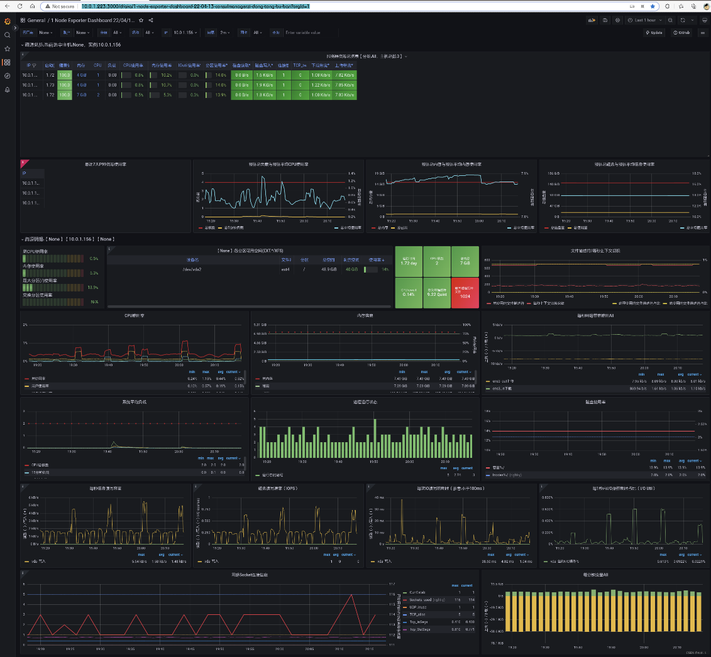
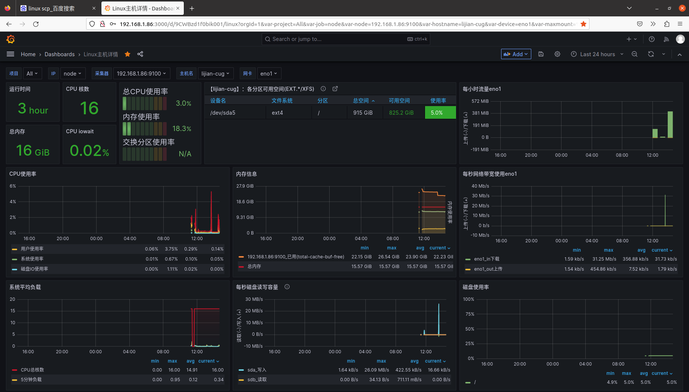
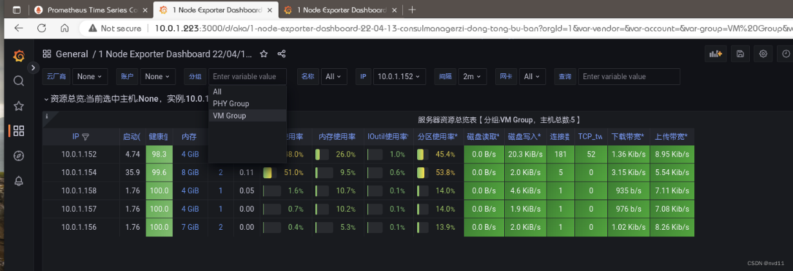

# 集群监控工具安装

<https://blog.csdn.net/nvd11/article/details/128030197>

寻找开源方案。好在google提供了一套成熟的开源方案

-   Prometheus - 用于管理机 - 集群服务器数据收集

-   node_exporter - 用于被管理节点 -
    提供节点本身的服务器数据给Prometheus

-   Grafana - 数据展示工具

下面就会写出详细的安装步骤。

## 1. 服务器准备

No hostname ip cpu数 memory os comment

1 amdeuc-vm0 10.0.1.155 1 2 ubuntu 22.04 LTS server 监控机

2 amdeuc-vm1 10.0.1.156 2 8 ubuntu 22.04 LTS server 被监控机

3 amdeuc-vm2 10.0.1.157 1 4 ubuntu 22.04 LTS server 被监控机

4 amdeuc-vm3 10.0.1.158 1 4 ubuntu 22.04 LTS server 被监控机

## 2. 在监控端安装Prometheus

### 2.1 安装 {#安装 .标题3}

个人觉得不用下载安装包这么复杂， 直接从ubuntu源安装

sudo apt-get install prometheus

检查prometheus 有没有启动

gateman@amdeuc-vm0:\~\$ systemctl status prometheus

● prometheus.service - Monitoring system and time series database

Loaded: loaded (/lib/systemd/system/prometheus.service; enabled; vendor
preset: enabled)

Active: active (running) since Thu 2022-11-24 15:58:52 UTC; 4h 3min ago

Docs: https://prometheus.io/docs/introduction/overview/

man:prometheus(1)

Main PID: 23080 (prometheus)

Tasks: 7 (limit: 23310)

Memory: 44.6M

CPU: 30.744s

CGroup: /system.slice/prometheus.service

└─23080 /usr/bin/prometheus

### 2.2 检查配置文件 {#检查配置文件 .标题3}

gateman@amdeuc-vm0:/etc/prometheus\$ cat prometheus.yml

\# Sample config for Prometheus.

global:

scrape_interval: 15s \# Set the scrape interval to every 15 seconds.
Default is every 1 minute.

evaluation_interval: 15s \# Evaluate rules every 15 seconds. The default
is every 1 minute.

\# scrape_timeout is set to the global default (10s).

\# Attach these labels to any time series or alerts when communicating
with

\# external systems (federation, remote storage, Alertmanager).

external_labels:

monitor: \'example\'

\# Alertmanager configuration

alerting:

alertmanagers:

\- static_configs:

\- targets: \[\'localhost:9093\'\]

\# Load rules once and periodically evaluate them according to the
global \'evaluation_interval\'.

rule_files:

\# - \"first_rules.yml\"

\# - \"second_rules.yml\"

\# A scrape configuration containing exactly one endpoint to scrape:

\# Here it\'s Prometheus itself.

scrape_configs:

\# The job name is added as a label \`job=\<job_name\>\` to any
timeseries scraped from this config.

\- job_name: \'prometheus\'

\# Override the global default and scrape targets from this job every 5
seconds.

scrape_interval: 5s

scrape_timeout: 5s

\# metrics_path defaults to \'/metrics\'

\# scheme defaults to \'http\'.

static_configs:

\- targets: \[\'localhost:9090\'\]

\- job_name: node

\# If prometheus-node-exporter is installed, grab stats about the local

\# machine by default.

static_configs:

\- targets: \[\'localhost:9100\'\]

可以见prometheus 的 控制端口是9090

在浏览器访问服务器ip和9090 端口， 如果 prometheus
页面能打开就没什么问题：

ip address:9090/graph

## 3. 在被监控节点安装node exporter

也是直接从ubuntu源里安装

sudo apt-get install prometheus-node-exporter

检查node exporter 服务有没有启动

gateman@amdeuc-vm3:\~\$ systemctl status prometheus-node-exporter

可以简单监控端口是9100

## 4. 配置监控机的 prometheus.xml 加入被监控的节点

\- job_name: node

\# If prometheus-node-exporter is installed, grab stats about the local

\# machine by default.

static_configs:

\- targets: \[\'localhost:9100\', \'10.0.1.156:9100\',
\'10.0.1.157:9100\', \'10.0.1.158:9100\'\]

然后重启服务

sudo systemctl restart prometheus

再打开 prometheus 的监控列表， 发现 已经有4个节点被监控了，
包括监控机本身：

## 5.在[监控端]{.mark}安装Grafana

没想到grafana居然不在ubuntu的默认仓库...

sudo wget -q -O - https://packages.grafana.com/gpg.key \| sudo apt-key
add -

echo \"deb https://packages.grafana.com/oss/deb stable main\" \| sudo
tee -a /etc/apt/sources.list.d/grafana.list

sudo apt-get update

sudo apt install grafana

安装完后检查服务有没有启动

systemctl status grafana-server

没有就手动起来

gateman@amdeuc-vm0:/etc/prometheus\$ sudo systemctl start grafana-server

gateman@amdeuc-vm0:/etc/prometheus\$ sudo systemctl enable
grafana-server

grafana 的默认端口是3000

再浏览器打开ip:3000， 如果见到grafana页面就代表安装好了

## 6.配置grafana

默认账号和密码都是admin 先登录再说

登录后马上要求你改密码的

### 6.1 添加数据源 {#添加数据源 .标题3}

Configuration -\> Data Sources -\>add data source -\> Prometheus

### 6.2 添加Dashboard

接下来我们先去下载一个模板

https://grafana.com/grafana/dashboards/?search=8919

把Json文件下载下来就好（已下载）。

然后在grafana

New Dashboard -\> Import Json

就得到1个比较完善的linux主机详情模板了

看着dashboard 效果， 各台服务器的状态一目了然。

如何你的服务器太多， 想分组看?

那么prometheus 的配置文件可以这样编写

\- job_name: node

\# If prometheus-node-exporter is installed, grab stats about the local

\# machine by default.

static_configs:

\- targets:

\- \'10.0.1.156:9100\'

\- \'10.0.1.157:9100\'

\- \'10.0.1.158:9100\'

\- \'10.0.1.158:9100\'

\- \'10.0.1.154:9100\'

\- \'10.0.1.152:9100\'

labels:

group: \'VM Group\'

\- targets:

\- \'10.0.1.198:9100\'

\- \'10.0.1.122:9100\'

\- \'10.0.1.107:9100\'

\- \'10.0.1.223:9182\'

labels:

group: \'PHY Group\'

在grafana中就可以分组查看了。

