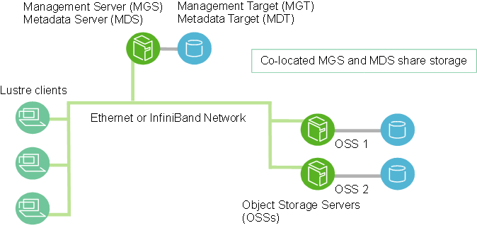
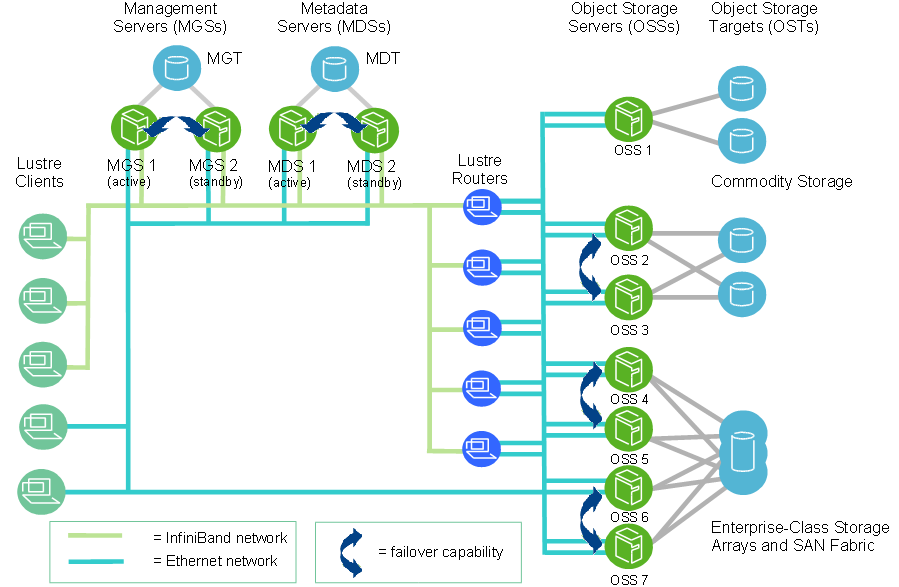
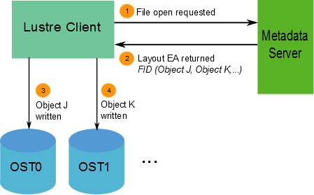
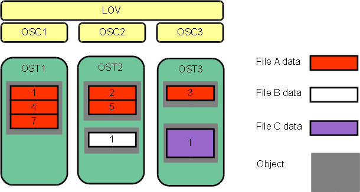
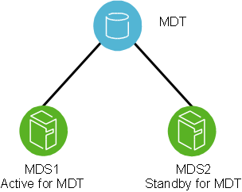
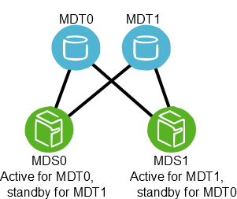
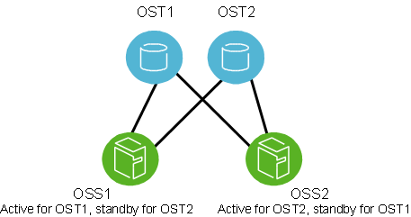

# Table of Content
- [Introducing the Lustre* File System](#introducing-the-lustre-file-system)
  * [Understanding Lustre Architecture](#understanding-lustre-architecture)
    + [What a Lustre File System Is (and What It Isn't)](#what-a-lustre-file-system-is-and-what-it-isnt)
      - [Lustre Features](#lustre-features)
    + [Lustre Components](#lustre-components)
      - [Management Server (MGS)](#management-server-mgs)
      - [Lustre File System Components](#lustre-file-system-components)
      - [Lustre Networking (LNet)](#lustre-networking-lnet)
      - [Lustre Cluster](#lustre-cluster)
    + [Lustre File System Storage and I/O](#lustre-file-system-storage-and-io)
      - [Lustre File System and Striping](#lustre-file-system-and-striping)
  * [Understanding Lustre Networking (LNet)](#understanding-lustre-networking-lnet)
    + [Introducing LNet](#introducing-lnet)
    + [Key Features of LNet](#key-features-of-lnet)
    + [Lustre Networks](#lustre-networks)
    + [Supported Network Types](#supported-network-types)
  * [Understanding Failover in a Lustre File System](#understanding-failover-in-a-lustre-file-system)
    + [What is Failover?](#what-is-failover)
      - [Failover Capabilities](#failover-capabilities)
      - [Types of Failover Configurations](#types-of-failover-configurations)
    + [Failover Functionality in a Lustre File System](#failover-functionality-in-a-lustre-file-system)
      - [MDT Failover Configuration (Active/Passive)](#mdt-failover-configuration-activepassive)
      - [MDT Failover Configuration (Active/Active)](#mdt-failover-configuration-activeactive)L 2.4
      - [OST Failover Configuration (Active/Active)](#ost-failover-configuration-activeactive)

# Introducing the Lustre* File System

Part I provides background information to help you understand the Lustre file system architecture and how the major components fit together. You will find information in this section about:

- [Understanding Lustre Architecture](#understanding-lustre-architecture)
- [Understanding Lustre Networking (LNet)](#understanding-lustre-networking-lnet)
- [Understanding Failover in a Lustre File System](#understanding-failover-in-a-lustre-file-system)

## Understanding Lustre Architecture

### What a Lustre File System Is (and What It Isn't)

The Lustre architecture is a storage architecture for clusters. The central component of the Lustre architecture is the Lustre file system, which is supported on the Linux operating system and provides a POSIX *standard-compliant UNIX file system interface.

The Lustre storage architecture is used for many different kinds of clusters. It is best known for powering many of the largest high-performance computing (HPC) clusters worldwide, with tens of thousands of client systems, petabytes (PiB) of storage and hundreds of gigabytes per second (GB/sec) of I/O throughput. Many HPC sites use a Lustre file system as a site-wide global file system, serving dozens of clusters.

The ability of a Lustre file system to scale capacity and performance for any need reduces the need to deploy many separate file systems, such as one for each compute cluster. Storage management is simplified by avoiding the need to copy data between compute clusters. In addition to aggregating storage capacity of many servers, the I/O throughput is also aggregated and scales with additional servers. Moreover, throughput and/or capacity can be easily increased by adding servers dynamically.

While a Lustre file system can function in many work environments, it is not necessarily the best choice for all applications. It is best suited for uses that exceed the capacity that a single server can provide, though in some use cases, a Lustre file system can perform better with a single server than other file systems due to its strong locking and data coherency.

A Lustre file system is currently not particularly well suited for "peer-to-peer" usage models where clients and servers are running on the same node, each sharing a small amount of storage, due to the lack of data replication at the Lustre software level. In such uses, if one client/server fails, then the data stored on that node will not be accessible until the node is restarted.

#### Lustre Features

Lustre file systems run on a variety of vendor's kernels. For more details, see the Lustre Test Matrix [the section called “ Preparing to Install the Lustre Software”](02.05-Installing%20the%20Lustre%20Software.md#installing-the-lustre-software).

A Lustre installation can be scaled up or down with respect to the number of client nodes, disk storage and bandwidth. Scalability and performance are dependent on available disk and network bandwidth and the processing power of the servers in the system. A Lustre file system can be deployed in a wide variety of configurations that can be scaled well beyond the size and performance observed in production systems to date.

[Table 1, “Lustre File System Scalability and Performance”](#table-1-lustre-file-system-scalability-and-performance) shows some of the scalability and performance characteristics of a Lustre file system. For a full list of Lustre file and filesystem limits see [Table 4, “File and file system limits”](02.02-Determining%20Hardware%20Configuration%20Requirements%20and%20Formatting%20Options.md#table-4-file-and-file-system-limits).

##### Table 1. Lustre File System Scalability and Performance

| **Feature**                 | **Current Practical Range**                                  | **Known Production Usage**                                   |
| --------------------------- | ------------------------------------------------------------ | ------------------------------------------------------------ |
| **Client Scalability**      | 100-100000                                                   | 50000+ clients, many in the 10000 to 20000 range             |
| **Client Performance**      | *Single client:*I/O 90% of network bandwidth*Aggregate:*10 TB/sec I/O | *Single client:*4.5 GB/sec I/O (FDR IB, OPA1), 1000 metadata ops/sec*Aggregate:*2.5 TB/sec I/O |
| **OSS Scalability**         | *Single OSS:*1-32 OSTs per OSS*Single OST:*300M objects, 256TiB per OST (ldiskfs)500M objects, 256TiB per OST (ZFS)*OSS count:*1000 OSSs, with up to 4000 OSTs | *Single OSS:*32x 8TiB OSTs per OSS (ldiskfs),8x 32TiB OSTs per OSS (ldiskfs)1x 72TiB OST per OSS (ZFS)*OSS count:*450 OSSs with 1000 4TiB OSTs192 OSSs with 1344 8TiB OSTs768 OSSs with 768 72TiB OSTs |
| **OSS Performance**         | *Single OSS:*15 GB/sec*Aggregate:*10 TB/sec                  | *Single OSS:*10 GB/sec*Aggregate:*2.5 TB/sec                 |
| **MDS Scalability**         | *Single MDS:*1-4 MDTs per MDS*Single MDT:*4 billion files, 8TiB per MDT (ldiskfs)64 billion files, 64TiB per MDT (ZFS)*MDS count:*1 primary + 1 standbyIntroduced in Lustre 2.4256 MDSs, with up to 256 MDTs | *Single MDS:*3 billion files*MDS count:*7 MDS with 7 2TiB MDTs in production256 MDS with 256 64GiB MDTs in testing |
| **MDS Performance**         | 50000/s create operations,200000/s metadata stat operations  | 15000/s create operations,50000/s metadata stat operations   |
| **File system Scalability** | *Single File:*32 PiB max file size (ldiskfs)2^63 bytes (ZFS)*Aggregate:*512 PiB space, 1 trillion files | *Single File:*multi-TiB max file size*Aggregate:*55 PiB space, 8 billion files |

 

 

Other Lustre software features are:

- **Performance-enhanced ext4 file system:** The Lustre file system uses an improved version of the ext4 journaling file system to store data and metadata. This version, called `ldiskfs` , has been enhanced to improve performance and provide additional functionality needed by the Lustre file system.
- Introduced in Lustre 2.4With the Lustre software release 2.4 and later, it is also possible to use ZFS as the backing filesystem for Lustre for the MDT, OST, and MGS storage. This allows Lustre to leverage the scalability and data integrity features of ZFS for individual storage targets.
- **POSIX standard compliance:** The full POSIX test suite passes in an identical manner to a local ext4 file system, with limited exceptions on Lustre clients. In a cluster, most operations are atomic so that clients never see stale data or metadata. The Lustre software supports mmap() file I/O.
- **High-performance heterogeneous networking:** The Lustre software supports a variety of high performance, low latency networks and permits Remote Direct Memory Access (RDMA) for InfiniBand *(utilizing OpenFabrics Enterprise Distribution (OFED*), Intel OmniPath®, and other advanced networks for fast and efficient network transport. Multiple RDMA networks can be bridged using Lustre routing for maximum performance. The Lustre software also includes integrated network diagnostics.
- **High-availability:** The Lustre file system supports active/active failover using shared storage partitions for OSS targets (OSTs). Lustre software release 2.3 and earlier releases offer active/passive failover using a shared storage partition for the MDS target (MDT). The Lustre file system can work with a variety of high availability (HA) managers to allow automated failover and has no single point of failure (NSPF). This allows application transparent recovery. Multiple mount protection (MMP) provides integrated protection from errors in highly-available systems that would otherwise cause file system corruption.
- Introduced in Lustre 2.4With Lustre software release 2.4 or later servers and clients it is possible to configure active/active failover of multiple MDTs. This allows scaling the metadata performance of Lustre filesystems with the addition of MDT storage devices and MDS nodes.
- **Security:** By default TCP connections are only allowed from privileged ports. UNIX group membership is verified on the MDS.
- **Access control list (ACL), extended attributes:** the Lustre security model follows that of a UNIX file system, enhanced with POSIX ACLs. Noteworthy additional features include root squash.
- **Interoperability:** The Lustre file system runs on a variety of CPU architectures and mixed-endian clusters and is interoperable between successive major Lustre software releases.
- **Object-based architecture:** Clients are isolated from the on-disk file structure enabling upgrading of the storage architecture without affecting the client.
- **Byte-granular file and fine-grained metadata locking:** Many clients can read and modify the same file or directory concurrently. The Lustre distributed lock manager (LDLM) ensures that files are coherent between all clients and servers in the file system. The MDT LDLM manages locks on inode permissions and pathnames. Each OST has its own LDLM for locks on file stripes stored thereon, which scales the locking performance as the file system grows.
- **Quotas:** User and group quotas are available for a Lustre file system.
- **Capacity growth:**The size of a Lustre file system and aggregate cluster bandwidth can be increased without interruption by adding new OSTs and MDTs to the cluster.
- **Controlled file layout:** The layout of files across OSTs can be configured on a per file, per directory, or per file system basis. This allows file I/O to be tuned to specific application requirements within a single file system. The Lustre file system uses RAID-0 striping and balances space usage across OSTs.
- **Network data integrity protection:** A checksum of all data sent from the client to the OSS protects against corruption during data transfer.
- **MPI I/O:** The Lustre architecture has a dedicated MPI ADIO layer that optimizes parallel I/O to match the underlying file system architecture.
- **NFS and CIFS export:** Lustre files can be re-exported using NFS (via Linux knfsd or Ganesha) or CIFS (via Samba), enabling them to be shared with non-Linux clients such as Microsoft*Windows, *Apple *Mac OS X*, and others.
- **Disaster recovery tool:** The Lustre file system provides an online distributed file system check (LFSCK) that can restore consistency between storage components in case of a major file system error. A Lustre file system can operate even in the presence of file system inconsistencies, and LFSCK can run while the filesystem is in use, so LFSCK is not required to complete before returning the file system to production.
- **Performance monitoring:** The Lustre file system offers a variety of mechanisms to examine performance and tuning.
- **Open source:** The Lustre software is licensed under the GPL 2.0 license for use with the Linux operating system.

### Lustre Components 

An installation of the Lustre software includes a management server (MGS) and one or more Lustre file systems interconnected with Lustre networking (LNet).

A basic configuration of Lustre file system components is shown in [Figure 1, “Lustre file system components in a basic cluster”](#figure-1-lustre-file-system-components-in-a-basic-cluster).

##### Figure 1. Lustre file system components in a basic cluster



#### Management Server (MGS)

The MGS stores configuration information for all the Lustre file systems in a cluster and provides this information to other Lustre components. Each Lustre target contacts the MGS to provide information, and Lustre clients contact the MGS to retrieve information.

It is preferable that the MGS have its own storage space so that it can be managed independently. However, the MGS can be co-located and share storage space with an MDS as shown in [Figure 1, “Lustre file system components in a basic cluster”](#figure-1-lustre-file-system-components-in-a-basic-cluster).

#### Lustre File System Components

Each Lustre file system consists of the following components:

- **Metadata Servers (MDS)**- The MDS makes metadata stored in one or more MDTs available to Lustre clients. Each MDS manages the names and directories in the Lustre file system(s) and provides network request handling for one or more local MDTs.

- **Metadata Targets (MDT**) - For Lustre software release 2.3 and earlier, each file system has one MDT. The MDT stores metadata (such as filenames, directories, permissions and file layout) on storage attached to an MDS. Each file system has one MDT. An MDT on a shared storage target can be available to multiple MDSs, although only one can access it at a time. If an active MDS fails, a standby MDS can serve the MDT and make it available to clients. This is referred to as MDS failover.

  Introduced in Lustre 2.4Since Lustre software release 2.4, multiple MDTs are supported in the Distributed Namespace Environment (DNE). In addition to the primary MDT that holds the filesystem root, it is possible to add additional MDS nodes, each with their own MDTs, to hold sub-directory trees of the filesystem.

  Introduced in Lustre 2.8Since Lustre software release 2.8, DNE also allows the filesystem to distribute files of a single directory over multiple MDT nodes. A directory which is distributed across multiple MDTs is known as a *striped directory*.

- **Object Storage Servers (OSS)**: The OSS provides file I/O service and network request handling for one or more local OSTs. Typically, an OSS serves between two and eight OSTs, up to 16 TiB each. A typical configuration is an MDT on a dedicated node, two or more OSTs on each OSS node, and a client on each of a large number of compute nodes.

- **Object Storage Target (OST)**: User file data is stored in one or more objects, each object on a separate OST in a Lustre file system. The number of objects per file is configurable by the user and can be tuned to optimize performance for a given workload.

- **Lustre clients**: Lustre clients are computational, visualization or desktop nodes that are running Lustre client software, allowing them to mount the Lustre file system.

The Lustre client software provides an interface between the Linux virtual file system and the Lustre servers. The client software includes a management client (MGC), a metadata client (MDC), and multiple object storage clients (OSCs), one corresponding to each OST in the file system.

A logical object volume (LOV) aggregates the OSCs to provide transparent access across all the OSTs. Thus, a client with the Lustre file system mounted sees a single, coherent, synchronized namespace. Several clients can write to different parts of the same file simultaneously, while, at the same time, other clients can read from the file.

A logical metadata volume (LMV) aggregates the MDCs to provide transparent access across all the MDTs in a similar manner as the LOV does for file access. This allows the client to see the directory tree on multiple MDTs as a single coherent namespace, and striped directories are merged on the clients to form a single visible directory to users and applications.

[Table 2, “ Storage and hardware requirements for Lustre file system components”](#table-2--storage-and-hardware-requirements-for-lustre-file-system-components) provides the requirements for attached storage for each Lustre file system component and describes desirable characteristics of the hardware used.

##### Table 2.  Storage and hardware requirements for Lustre file system components

|             | **Required attached storage**       | **Desirable hardware characteristics**                       |
| ----------- | ----------------------------------- | ------------------------------------------------------------ |
| **MDSs**    | 1-2% of file system capacity        | Adequate CPU power, plenty of memory, fast disk storage.     |
| **OSSs**    | 1-128 TiB per OST, 1-8 OSTs per OSS | Good bus bandwidth. Recommended that storage be balanced evenly across OSSs and matched to network bandwidth. |
| **Clients** | No local storage needed             | Low latency, high bandwidth network.                         |

 

 

For additional hardware requirements and considerations, see [*Determining Hardware Configuration Requirements and Formatting Options*](02.02-Determining%20Hardware%20Configuration%20Requirements%20and%20Formatting%20Options.md).

#### Lustre Networking (LNet)

Lustre Networking (LNet) is a custom networking API that provides the communication infrastructure that handles metadata and file I/O data for the Lustre file system servers and clients. For more information about LNet, see[*Understanding Lustre Networking (LNet)*](#understanding-lustre-networking-lnet).


#### Lustre Cluster

At scale, a Lustre file system cluster can include hundreds of OSSs and thousands of clients (see [Figure 2, “ Lustre cluster at scale”](#figure-2--lustre-cluster-at-scale). More than one type of network can be used in a Lustre cluster. Shared storage between OSSs enables failover capability. For more details about OSS failover, see [*Understanding Failover in a Lustre File System*](#understanding-failover-in-a-lustre-file-system).

##### Figure 2.  Lustre cluster at scale



### Lustre File System Storage and I/O

In Lustre software release 2.0, Lustre file identifiers (FIDs) were introduced to replace UNIX inode numbers for identifying files or objects. A FID is a 128-bit identifier that contains a unique 64-bit sequence number, a 32-bit object ID (OID), and a 32-bit version number. The sequence number is unique across all Lustre targets in a file system (OSTs and MDTs). This change enabled future support for multiple MDTs (introduced in Lustre software release 2.4) and ZFS (introduced in Lustre software release 2.4).

Also introduced in release 2.0 is an ldiskfs feature named FID-in-dirent(also known as dirdata) in which the FID is stored as part of the name of the file in the parent directory. This feature significantly improves performance for`ls` command executions by reducing disk I/O. The FID-in-dirent is generated at the time the file is created.

**Note**

The FID-in-dirent feature is not backward compatible with the release 1.8 ldiskfs disk format. Therefore, when an upgrade from release 1.8 to release 2.x is performed, the FID-in-dirent feature is not automatically enabled. For upgrades from release 1.8 to releases 2.0 through 2.3, FID-in-dirent can be enabled manually but only takes effect for new files.

For more information about upgrading from Lustre software release 1.8 and enabling FID-in-dirent for existing files, see [*Upgrading a Lustre File System*](03.06-Upgrading%20a%20Lustre%20File%20System.md) Chapter 16 “Upgrading a Lustre File System”.

Introduced in Lustre 2.4

The LFSCK file system consistency checking tool     released with Lustre software release 2.4 provides functionality that     enables FID-in-dirent for existing files. It includes the following     functionality:     

- Generates IGIF mode FIDs for existing files from a 1.8 version file system files.
- Verifies the FID-in-dirent for each file and regenerates the FID-in-dirent if it is invalid or missing.
- Verifies the linkEA entry for each and regenerates the linkEA if it is invalid or missing. The         linkEA consists of the file name and parent FID. It is stored as an extended attribute in the file         itself. Thus, the linkEA can be used to reconstruct the full path name of a file.

Information about where file data is located on the OST(s) is stored as an extended attribute called layout EA in an MDT object identified by the FID for the file (see [Figure 3, “Layout EA on MDT pointing to file data on OSTs”](#figure-3-layout-ea-on-mdt-pointing-to-file-data-on-osts). If the file is a regular file (not a directory or symbol link), the MDT object points to 1-to-N OST object(s) on the OST(s) that contain the file data. If the MDT file points to one object, all the file data is stored in that object. If the MDT file points to more than one object, the file data is striped across the objects using RAID 0, and each object is stored on a different OST. (For more information about how striping is implemented in a Lustre file system, see [the section called “ Lustre File System and Striping”](#lustre-file-system-and-striping).

##### Figure 3. Layout EA on MDT pointing to file data on OSTs

 


When a client wants to read from or write to a file, it first fetches the layout EA from the MDT object for the file. The client then uses this information to perform I/O on the file, directly interacting with the OSS nodes where the objects are stored. This process is illustrated in [Figure 4, “Lustre client requesting file data”](#figure-4-lustre-client-requesting-file-data).

##### Figure 4. Lustre client requesting file data

 

The available bandwidth of a Lustre file system is determined as follows:

- The *network bandwidth* equals the aggregated bandwidth of the OSSs to the targets.

- The *disk bandwidth* equals the sum of the disk bandwidths of the storage targets (OSTs) up to the limit of the network bandwidth.

- The *aggregate bandwidth* equals the minimum of the disk bandwidth and the network bandwidth.

- The *available file system space* equals the sum of the available space of all the OSTs.


#### Lustre File System and Striping

One of the main factors leading to the high performance of Lustre file systems is the ability to stripe data across multiple OSTs in a round-robin fashion. Users can optionally configure for each file the number of stripes, stripe size, and OSTs that are used.

Striping can be used to improve performance when the aggregate bandwidth to a single file exceeds the bandwidth of a single OST. The ability to stripe is also useful when a single OST does not have enough free space to hold an entire file. For more information about benefits and drawbacks of file striping, see [the section called “ Lustre File Layout (Striping) Considerations”](#lustre-file-layout-striping-considerations).

Striping allows segments or 'chunks' of data in a file to be stored on different OSTs, as shown in [Figure 5, “File striping on a Lustre file system”](#figure-5-file-striping-on-a-lustre-file-system). In the Lustre file system, a RAID 0 pattern is used in which data is "striped" across a certain number of objects. The number of objects in a single file is called the `stripe_count`.

Each object contains a chunk of data from the file. When the chunk of data being written to a particular object exceeds the `stripe_size`, the next chunk of data in the file is stored on the next object.

Default values for `stripe_count` and `stripe_size` are set for the file system. The default value for`stripe_count` is 1 stripe for file and the default value for `stripe_size` is 1MB. The user may change these values on a per directory or per file basis. For more details, see [the section called “Setting the File Layout/Striping Configuration (`lfs setstripe`)”](#setting-the-file-layoutstriping-configuration-lfs-setstripe).

[Figure 5, “File striping on a Lustre file system”](#figure-5-file-striping-on-a-lustre-file-system), the `stripe_size` for File C is larger than the `stripe_size` for File A, allowing more data to be stored in a single stripe for File C. The `stripe_count` for File A is 3, resulting in data striped across three objects, while the `stripe_count` for File B and File C is 1.

No space is reserved on the OST for unwritten data. File A in [Figure 5, “File striping on a Lustre file system”](#figure-5-file-striping-on-a-lustre-file-system).

##### Figure 5. File striping on a Lustre file system

 


The maximum file size is not limited by the size of a single target. In a Lustre file system, files can be striped across multiple objects (up to 2000), and each object can be up to 16 TiB in size with ldiskfs, or up to 256PiB with ZFS. This leads to a maximum file size of 31.25 PiB for ldiskfs or 8EiB with ZFS. Note that a Lustre file system can support files up to 2^63 bytes (8EiB), limited only by the space available on the OSTs.

**Note**

Versions of the Lustre software prior to Release 2.2 limited the maximum stripe count for a single file to 160 OSTs.

Although a single file can only be striped over 2000 objects, Lustre file systems can have thousands of OSTs. The I/O bandwidth to access a single file is the aggregated I/O bandwidth to the objects in a file, which can be as much as a bandwidth of up to 2000 servers. On systems with more than 2000 OSTs, clients can do I/O using multiple files to utilize the full file system bandwidth.

For more information about striping, see [*Managing File Layout (Striping) and Free Space*](03.08-Managing%20File%20Layout%20(Striping)%20and%20Free%20Space.md).


## Understanding Lustre Networking (LNet)

This chapter introduces Lustre networking (LNet). It includes the following sections:

- [the section called “ Introducing LNet”](#introducing-lnet)
- [the section called “Key Features of LNet”](#key-features-of-lnet)
- [the section called “Lustre Networks”](#lustre-networks)
- [the section called “Supported Network Types”](#supported-network-types)

 

### Introducing LNet

In a cluster using one or more Lustre file systems, the network communication infrastructure required by the Lustre file system is implemented using the Lustre networking (LNet) feature.

LNet supports many commonly-used network types, such as InfiniBand and IP networks, and allows simultaneous availability across multiple network types with routing between them. Remote direct memory access (RDMA) is permitted when supported by underlying networks using the appropriate Lustre network driver (LND). High availability and recovery features enable transparent recovery in conjunction with failover servers.

An LND is a pluggable driver that provides support for a particular network type, for example `ksocklnd` is the driver which implements the TCP Socket LND that supports TCP networks. LNDs are loaded into the driver stack, with one LND for each network type in use.

For information about configuring LNet, see [*Configuring Lustre Networking (LNet)*](02.06-Configuring%20Lustre%20Networking%20(LNet).md).

For information about administering LNet, see [Administering Lustre](03-Administering%20Lustre.md).


### Key Features of LNet

Key features of LNet include:

- RDMA, when supported by underlying networks
- Support for many commonly-used network types
- High availability and recovery
- Support of multiple network types simultaneously
- Routing among disparate networks

LNet permits end-to-end read/write throughput at or near peak bandwidth rates on a variety of network interconnects.


### Lustre Networks

A Lustre network is comprised of clients and servers running the Lustre software. It need not be confined to one LNet subnet but can span several networks provided routing is possible between the networks. In a similar manner, a single network can have multiple LNet subnets.

The Lustre networking stack is comprised of two layers, the LNet code module and the LND. The LNet layer operates above the LND layer in a manner similar to the way the network layer operates above the data link layer. LNet layer is connectionless, asynchronous and does not verify that data has been transmitted while the LND layer is connection oriented and typically does verify data transmission.

LNets are uniquely identified by a label comprised of a string corresponding to an LND and a number, such as tcp0, o2ib0, or o2ib1, that uniquely identifies each LNet. Each node on an LNet has at least one network identifier (NID). A NID is a combination of the address of the network interface and the LNet label in the form:`*address*@*LNet_label*`.

Examples:

```
192.168.1.2@tcp0
10.13.24.90@o2ib1
```

In certain circumstances it might be desirable for Lustre file system traffic to pass between multiple LNets. This is possible using LNet routing. It is important to realize that LNet routing is not the same as network routing. For more details about LNet routing, see [*Configuring Lustre Networking (LNet)*](02.06-Configuring%20Lustre%20Networking%20(LNet).md).

### Supported Network Types

The LNet code module includes LNDs to support many network types including:

- InfiniBand: OpenFabrics OFED (o2ib)
- TCP (any network carrying TCP traffic, including GigE, 10GigE, and IPoIB)
- RapidArray: ra
- Quadrics: Elan

## Understanding Failover in a Lustre File System

This chapter describes failover in a Lustre file system. It includes:

- [the section called “ What is Failover?”](#what-is-failover)
- [the section called “ Failover Functionality in a Lustre File System”](#failover-functionality-in-a-lustre-file-system)

### What is Failover?

In a high-availability (HA) system, unscheduled downtime is minimized by using redundant hardware and software components and software components that automate recovery when a failure occurs. If a failure condition occurs, such as the loss of a server or storage device or a network or software fault, the system's services continue with minimal interruption. Generally, availability is specified as the percentage of time the system is required to be available.

Availability is accomplished by replicating hardware and/or software so that when a primary server fails or is unavailable, a standby server can be switched into its place to run applications and associated resources. This process, called failover, is automatic in an HA system and, in most cases, completely application-transparent.

A failover hardware setup requires a pair of servers with a shared resource (typically a physical storage device, which may be based on SAN, NAS, hardware RAID, SCSI or Fibre Channel (FC) technology). The method of sharing storage should be essentially transparent at the device level; the same physical logical unit number (LUN) should be visible from both servers. To ensure high availability at the physical storage level, we encourage the use of RAID arrays to protect against drive-level failures.

**Note**

The Lustre software does not provide redundancy for data; it depends exclusively on redundancy of backing storage devices. The backing OST storage should be RAID 5 or, preferably, RAID 6 storage. MDT storage should be RAID 1 or RAID 10.

#### Failover Capabilities

To establish a highly-available Lustre file system, power management software or hardware and high availability (HA) software are used to provide the following failover capabilities:

- **Resource fencing**- Protects physical storage from simultaneous access by two nodes.
- **Resource management**- Starts and stops the Lustre resources as a part of failover, maintains the cluster state, and carries out other resource management tasks.
- **Health monitoring**- Verifies the availability of hardware and network resources and responds to health indications provided by the Lustre software.

These capabilities can be provided by a variety of software and/or hardware solutions. For more information about using power management software or hardware and high availability (HA) software with a Lustre file system, see [*Configuring Failover in a Lustre File System*](02.08-Configuring%20Failover%20in%20a%20Lustre%20File%20System.md).

HA software is responsible for detecting failure of the primary Lustre server node and controlling the failover.The Lustre software works with any HA software that includes resource (I/O) fencing. For proper resource fencing, the HA software must be able to completely power off the failed server or disconnect it from the shared storage device. If two active nodes have access to the same storage device, data may be severely corrupted.


#### Types of Failover Configurations

Nodes in a cluster can be configured for failover in several ways. They are often configured in pairs (for example, two OSTs attached to a shared storage device), but other failover configurations are also possible. Failover configurations include:

- **Active/passive** pair - In this configuration, the active node provides resources and serves data, while the passive node is usually standing by idle. If the active node fails, the passive node takes over and becomes active.
- **Active/active** pair - In this configuration, both nodes are active, each providing a subset of resources. In case of a failure, the second node takes over resources from the failed node.

In Lustre software releases previous to Lustre software release 2.4, MDSs can be configured as an active/passive pair, while OSSs can be deployed in an active/active configuration that provides redundancy without extra overhead. Often the standby MDS is the active MDS for another Lustre file system or the MGS, so no nodes are idle in the cluster.

Introduced in Lustre 2.4

Lustre software release 2.4 introduces metadata targets for individual sub-directories. Active-active failover configurations are available for MDSs that serve MDTs on shared storage.

 

### Failover Functionality in a Lustre File System

- [MDT Failover Configuration (Active/Passive)](#mdt-failover-configuration-activepassive)
- [MDT Failover Configuration (Active/Active)](#mdt-failover-configuration-activeactive)L 2.4
- [OST Failover Configuration (Active/Active)](#ost-failover-configuration-activeactive)

The failover functionality provided by the Lustre software can be used for the following failover scenario. When a client attempts to do I/O to a failed Lustre target, it continues to try until it receives an answer from any of the configured failover nodes for the Lustre target. A user-space application does not detect anything unusual, except that the I/O may take longer to complete.

Failover in a Lustre file system requires that two nodes be configured as a failover pair, which must share one or more storage devices. A Lustre file system can be configured to provide MDT or OST failover.

- For MDT failover, two MDSs can be configured to serve the same MDT. Only one MDS node can serve an MDT at a time.

  Introduced in Lustre 2.4Lustre software release 2.4 allows multiple MDTs. By placing two or more MDT partitions on storage shared by two MDSs, one MDS can fail and the remaining MDS can begin serving the unserved MDT. This is described as an active/active failover pair.

- For OST failover, multiple OSS nodes can be configured to be able to serve the same OST. However, only one OSS node can serve the OST at a time. An OST can be moved between OSS nodes that have access to the same storage device using `umount/mount` commands.

The `--servicenode` option is used to set up nodes in a Lustre file system for failover at creation time (using`mkfs.lustre`) or later when the Lustre file system is active (using `tunefs.lustre`). For explanations of these utilities, see [the section called “ mkfs.lustre”](06.07-System%20Configuration%20Utilities.md#mkfslustre)and [the section called “ tunefs.lustre”](06.07-System%20Configuration%20Utilities.md#tunefslustre).

Failover capability in a Lustre file system can be used to upgrade the Lustre software between successive minor versions without cluster downtime. For more information, see [*Upgrading a Lustre File System*](03.06-Upgrading%20a%20Lustre%20File%20System.md).

For information about configuring failover, see [*Configuring Failover in a Lustre File System*](02.08-Configuring%20Failover%20in%20a%20Lustre%20File%20System.md).

**Note**

The Lustre software provides failover functionality only at the file system level. In a complete failover solution, failover functionality for system-level components, such as node failure detection or power control, must be provided by a third-party tool.

**Caution**

OST failover functionality does not protect against corruption caused by a disk failure. If the storage media (i.e., physical disk) used for an OST fails, it cannot be recovered by functionality provided in the Lustre software. We strongly recommend that some form of RAID be used for OSTs. Lustre functionality assumes that the storage is reliable, so it adds no extra reliability features.


#### MDT Failover Configuration (Active/Passive)

Two MDSs are typically configured as an active/passive failover pair as shown in [Figure 6, “Lustre failover configuration for a active/passive MDT”](#figure-6-lustre-failover-configuration-for-a-active-passive-mdt). Note that both nodes must have access to shared storage for the MDT(s) and the MGS. The primary (active) MDS manages the Lustre system metadata resources. If the primary MDS fails, the secondary (passive) MDS takes over these resources and serves the MDTs and the MGS.

**Note**

In an environment with multiple file systems, the MDSs can be configured in a quasi active/active configuration, with each MDS managing metadata for a subset of the Lustre file system.

##### Figure 6. Lustre failover configuration for a active/passive MDT



Introduced in Lustre 2.4

#### MDT Failover Configuration (Active/Active)

Multiple MDTs became available with the advent of Lustre software release 2.4. MDTs can be setup as an active/active failover configuration. A failover cluster is built from two MDSs as shown in [Figure 7, “Lustre failover configuration for a active/active MDTs”](#figure-7-lustre-failover-configuration-for-a-active-active-mdts).

##### Figure 7. Lustre failover configuration for a active/active MDTs

 

#### OST Failover Configuration (Active/Active)

OSTs are usually configured in a load-balanced, active/active failover configuration. A failover cluster is built from two OSSs as shown in [Figure 8, “Lustre failover configuration for an OSTs”](#figure-8-lustre-failover-configuration-for-an-osts).

**Note**

OSSs configured as a failover pair must have shared disks/RAID.

##### Figure 8. Lustre failover configuration for an OSTs

 

 

In an active configuration, 50% of the available OSTs are assigned to one OSS and the remaining OSTs are assigned to the other OSS. Each OSS serves as the primary node for half the OSTs and as a failover node for the remaining OSTs.

In this mode, if one OSS fails, the other OSS takes over all of the failed OSTs. The clients attempt to connect to each OSS serving the OST, until one of them responds. Data on the OST is written synchronously, and the clients replay transactions that were in progress and uncommitted to disk before the OST failure.

For more information about configuring failover, see [*Configuring Failover in a Lustre File System*](02.08-Configuring%20Failover%20in%20a%20Lustre%20File%20System.md).

 
