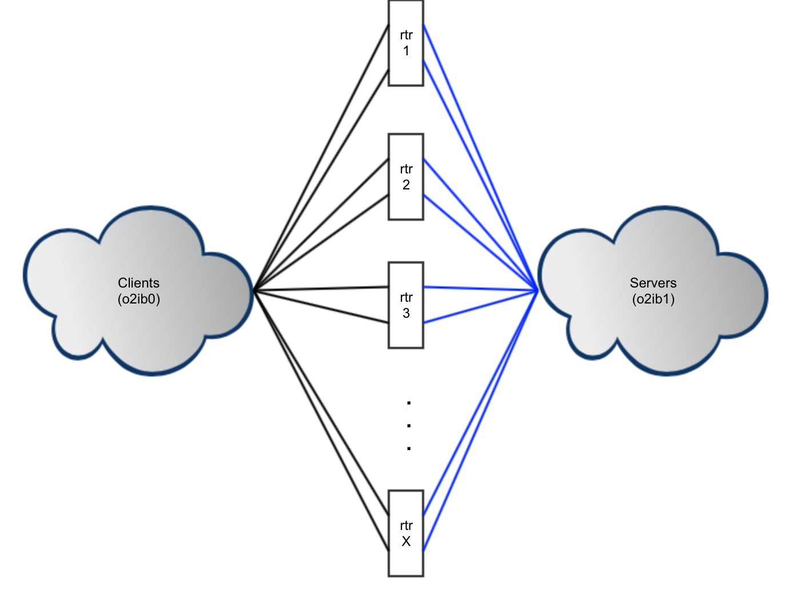

Introduced in Lustre 2.10

# LNet Software Multi-Rail

- [LNet Software Multi-Rail](#lnet-software-multi-rail)
  * [Multi-Rail Overview](#multi-rail-overview)
  * [Configuring Multi-Rail](#configuring-multi-rail)
    + [Configure Multiple Interfaces on the Local Node](#configure-multiple-interfaces-on-the-local-node)
    + [Deleting Network Interfaces](#deleting-network-interfaces)
    + [Adding Remote Peers that are Multi-Rail Capable](#adding-remote-peers-that-are-multi-rail-capable)
    + [Deleting Remote Peers](#deleting-remote-peers)
  * [Notes on routing with Multi-Rail](#notes-on-routing-with-multi-rail)
    + [Multi-Rail Cluster Example](#multi-rail-cluster-example)
    + [Utilizing Router Resiliency](#utilizing-router-resiliency)
    + [Mixed Multi-Rail/Non-Multi-Rail Cluster](#mixed-multi-railnon-multi-rail-cluster)
  * [LNet Health](#lnet-health)L 2.12
    + [Health Value](#health-value)
    + [Failure Types and Behavior](#failure-types-and-behavior)
    + [User Interface](#user-interface)
    + [Displaying Information](#displaying-information)
      - [Showing LNet Health Configuration Settings](#showing-lnet-health-configuration-settings)
      - [Showing LNet Health Statistics](#showing-lnet-health-statistics)
    + [Initial Settings Recommendations](#initial-settings-recommendations)

This chapter describes LNet Software Multi-Rail configuration and administration.

* [the section called “Multi-Rail Overview”](#multi-rail-overview)

* [the section called “Configuring Multi-Rail”)](#multi-rail-overview)

* [the section called “Notes on routing with Multi-Rail”](#notes-on-routing-with-multi-rail)

* [the section called “LNet Health”](#lnet-health)

## Multi-Rail Overview

In computer networking, multi-rail is an arrangement in which two or more network interfaces to a single network on a computer node are employed, to achieve increased throughput. Multi-rail can also be where a node has one or more interfaces to multiple, even different kinds of networks, such as Ethernet, Infiniband, and Intel® Omni-Path. For Lustre clients, multi-rail generally presents the combined network capabilities as a single LNet network. Peer nodes that are multi-rail capable are established during configuration, as are user-defined interface-section policies.

The following link contains a detailed high-level design for the feature: [Multi-Rail High-Level Design](http://wiki.lustre.org/images/b/bb/Multi-Rail_High-Level_Design_20150119.pdf)

## Configuring Multi-Rail

Every node using multi-rail networking needs to be properly configured. Multi-rail uses `lnetctl` and the LNet Configuration Library for configuration. Configuring multi-rail for a given node involves two tasks:

1. Configuring multiple network interfaces present on the local node.
2. Adding remote peers that are multi-rail capable (are connected to one or more common networks with at least two interfaces).

This section is a supplement to [*the section called “Adding, Deleting and Showing Networks”* ](02.06-Configuring%20Lustre%20Networking%20(LNet).md#adding-deleting-and-showing-networks) and contains further examples for Multi-Rail configurations.

For information on the dynamic peer discovery feature added in Lustre Release 2.11.0, see [*the section called “Dynamic Peer Discovery”*](02.06-Configuring%20Lustre%20Networking%20(LNet).md#dynamic-peer-discovery).

### Configure Multiple Interfaces on the Local Node

Example `lnetctl add` command with multiple interfaces in a Multi-Rail configuration:

```
lnetctl net add --net tcp --if eth0,eth1
```

Example of YAML net show:

```
lnetctl net show -v
net:
    - net type: lo
      local NI(s):
        - nid: 0@lo
          status: up
          statistics:
              send_count: 0
              recv_count: 0
              drop_count: 0
          tunables:
              peer_timeout: 0
              peer_credits: 0
              peer_buffer_credits: 0
              credits: 0
          lnd tunables:
          tcp bonding: 0
          dev cpt: 0
          CPT: "[0]"
    - net type: tcp
      local NI(s):
        - nid: 192.168.122.10@tcp
          status: up
          interfaces:
              0: eth0
          statistics:
              send_count: 0
              recv_count: 0
              drop_count: 0
          tunables:
              peer_timeout: 180
              peer_credits: 8
              peer_buffer_credits: 0
              credits: 256
          lnd tunables:
          tcp bonding: 0
          dev cpt: -1
          CPT: "[0]"
        - nid: 192.168.122.11@tcp
          status: up
          interfaces:
              0: eth1
          statistics:
              send_count: 0
              recv_count: 0
              drop_count: 0
          tunables:
              peer_timeout: 180
              peer_credits: 8
              peer_buffer_credits: 0
              credits: 256
          lnd tunables:
          tcp bonding: 0
          dev cpt: -1
          CPT: "[0]"
```

### Deleting Network Interfaces

Example delete with `lnetctl net del`:

Assuming the network configuration is as shown above with the `lnetctl net show -v` in the previous section, we can delete a net with following command:

```
lnetctl net del --net tcp --if eth0
```

The resultant net information would look like:

```
lnetctl net show -v
net:
    - net type: lo
      local NI(s):
        - nid: 0@lo
          status: up
          statistics:
              send_count: 0
              recv_count: 0
              drop_count: 0
          tunables:
              peer_timeout: 0
              peer_credits: 0
              peer_buffer_credits: 0
              credits: 0
          lnd tunables:
          tcp bonding: 0
          dev cpt: 0
          CPT: "[0,1,2,3]"
```

The syntax of a YAML file to perform a delete would be:

```
- net type: tcp
   local NI(s):
     - nid: 192.168.122.10@tcp
       interfaces:
           0: eth0
```

### Adding Remote Peers that are Multi-Rail Capable

The following example `lnetctl peer add` command adds a peer with 2 nids, with `192.168.122.30@tcp` being the primary nid:

```
lnetctl peer add --prim_nid 192.168.122.30@tcp --nid 192.168.122.30@tcp,192.168.122.31@tcp
      
```

The resulting `lnetctl peer show` would be:

```
lnetctl peer show -v
peer:
    - primary nid: 192.168.122.30@tcp
      Multi-Rail: True
      peer ni:
        - nid: 192.168.122.30@tcp
          state: NA
          max_ni_tx_credits: 8
          available_tx_credits: 8
          min_tx_credits: 7
          tx_q_num_of_buf: 0
          available_rtr_credits: 8
          min_rtr_credits: 8
          refcount: 1
          statistics:
              send_count: 2
              recv_count: 2
              drop_count: 0
        - nid: 192.168.122.31@tcp
          state: NA
          max_ni_tx_credits: 8
          available_tx_credits: 8
          min_tx_credits: 7
          tx_q_num_of_buf: 0
          available_rtr_credits: 8
          min_rtr_credits: 8
          refcount: 1
          statistics:
              send_count: 1
              recv_count: 1
              drop_count: 0
```

The following is an example YAML file for adding a peer:

```
addPeer.yaml
peer:
    - primary nid: 192.168.122.30@tcp
      Multi-Rail: True
      peer ni:
        - nid: 192.168.122.31@tcp
```

### Deleting Remote Peers

Example of deleting a single nid of a peer (192.168.122.31@tcp):

```
lnetctl peer del --prim_nid 192.168.122.30@tcp --nid 192.168.122.31@tcp
```

Example of deleting the entire peer:

```
lnetctl peer del --prim_nid 192.168.122.30@tcp
```

Example of deleting a peer via YAML:

```
Assuming the following peer configuration:
peer:
    - primary nid: 192.168.122.30@tcp
      Multi-Rail: True
      peer ni:
        - nid: 192.168.122.30@tcp
          state: NA
        - nid: 192.168.122.31@tcp
          state: NA
        - nid: 192.168.122.32@tcp
          state: NA

You can delete 192.168.122.32@tcp as follows:

delPeer.yaml
peer:
    - primary nid: 192.168.122.30@tcp
      Multi-Rail: True
      peer ni:
        - nid: 192.168.122.32@tcp
    
% lnetctl import --del < delPeer.yaml
```

## Notes on routing with Multi-Rail

Multi-Rail configuration can be applied on the Router to aggregate the interfaces performance.

### Multi-Rail Cluster Example

The below example outlines a simple system where all the Lustre nodes are MR capable. Each node in the cluster has two interfaces.

##### Figure 9. Routing Configuration with Multi-Rail

  

The routers can aggregate the interfaces on each side of the network by configuring them on the appropriate network.

An example configuration:

```
Routers
lnetctl net add --net o2ib0 --if ib0,ib1
lnetctl net add --net o2ib1 --if ib2,ib3
lnetctl peer add --nid <peer1-nidA>@o2ib,<peer1-nidB>@o2ib,...
lnetctl peer add --nid <peer2-nidA>@o2ib1,<peer2-nidB>>@o2ib1,...
lnetctl set routing 1

Clients
lnetctl net add --net o2ib0 --if ib0,ib1
lnetctl route add --net o2ib1 --gateway <rtrX-nidA>@o2ib
lnetctl peer add --nid <rtrX-nidA>@o2ib,<rtrX-nidB>@o2ib
        
Servers
lnetctl net add --net o2ib1 --if ib0,ib1
lnetctl route add --net o2ib0 --gateway <rtrX-nidA>@o2ib1
lnetctl peer add --nid <rtrX-nidA>@o2ib1,<rtrX-nidB>@o2ib1
```

In the above configuration the clients and the servers are configured with only one route entry per router. This works because the routers are MR capable. By adding the routers as peers with multiple interfaces to the clients and the servers, when sending to the router the MR algorithm will ensure that bot interfaces of the routers are used.

However, as of the Lustre 2.10 release LNet Resiliency is still under development and single interface failure will still cause the entire router to go down.

### Utilizing Router Resiliency

Currently, LNet provides a mechanism to monitor each route entry. LNet pings each gateway identified in the route entry on regular, configurable interval to ensure that it is alive. If sending over a specific route fails or if the router pinger determines that the gateway is down, then the route is marked as down and is not used. It is subsequently pinged on regular, configurable intervals to determine when it becomes alive again.

This mechanism can be combined with the MR feature in Lustre 2.10 to add this router resiliency feature to the configuration.

```
Routers
lnetctl net add --net o2ib0 --if ib0,ib1
lnetctl net add --net o2ib1 --if ib2,ib3
lnetctl peer add --nid <peer1-nidA>@o2ib,<peer1-nidB>@o2ib,...
lnetctl peer add --nid <peer2-nidA>@o2ib1,<peer2-nidB>@o2ib1,...
lnetctl set routing 1

Clients
lnetctl net add --net o2ib0 --if ib0,ib1
lnetctl route add --net o2ib1 --gateway <rtrX-nidA>@o2ib
lnetctl route add --net o2ib1 --gateway <rtrX-nidB>@o2ib
        
Servers
lnetctl net add --net o2ib1 --if ib0,ib1
lnetctl route add --net o2ib0 --gateway <rtrX-nidA>@o2ib1
lnetctl route add --net o2ib0 --gateway <rtrX-nidB>@o2ib1
```

There are a few things to note in the above configuration:

1. The clients and the servers are now configured with two routes, each route's gateway is one of the interfaces of the route. The clients and servers will view each interface of the same router as a separate gateway and will monitor them as described above.
2. The clients and the servers are not configured to view the routers as MR capable. This is important because we want to deal with each interface as a separate peers and not different interfaces of the same peer.
3. The routers are configured to view the peers as MR capable. This is an oddity in the configuration, but is currently required in order to allow the routers to load balance the traffic load across its interfaces evenly.

### Mixed Multi-Rail/Non-Multi-Rail Cluster

The above principles can be applied to mixed MR/Non-MR cluster. For example, the same configuration shown above can be applied if the clients and the servers are non-MR while the routers are MR capable. This appears to be a common cluster upgrade scenario.


Introduced in Lustre 2.12

## LNet Health

LNet Multi-Rail has implemented the ability for multiple interfaces to be used on the same LNet network or across multiple LNet networks. The LNet Health feature adds the ability to maintain a health value for each local and remote interface. This allows the Multi-Rail algorithm to consider the health of the interface before selecting it for sending. The feature also adds the ability to resend messages across different interfaces when interface or network failures are detected. This allows LNet to mitigate communication failures before passing the failures to upper layers for further error handling. To accomplish this, LNet Health monitors the status of the send and receive operations and uses this status to increment the interface's health value in case of success and decrement it in case of failure.

### Health Value

The initial health value of a local or remote interface is set to `LNET_MAX_HEALTH_VALUE`, currently set to be `1000`. The value itself is arbitrary and is meant to allow for health granularity, as opposed to having a simple boolean state. The granularity allows the Multi-Rail algorithm to select the interface that has the highest likelihood of sending or receiving a message.

### Failure Types and Behavior

LNet health behavior depends on the type of failure detected:

| **Failure Type**  | **Behavior**                                                 |
| ----------------- | ------------------------------------------------------------ |
| `localresend`     | A local failure has occurred, such as no route found or an address resolution error. These failures could be temporary, therefore LNet will attempt to resend the message. LNet will decrement the health value of the local interface and will select it less often if there are multiple available interfaces. |
| `localno-resend`  | A local non-recoverable error occurred in the system, such as out of memory error. In these cases LNet will not attempt to resend the message. LNet will decrement the health value of the local interface and will select it less often if there are multiple available interfaces. |
| `remoteno-resend` | If LNet successfully sends a message, but the message does not complete or an expected reply is not received, then it is classified as a remote error. LNet will not attempt to resend the message to avoid duplicate messages on the remote end. LNet will decrement the health value of the remote interface and will select it less often if there are multiple available interfaces. |
| `remoteresend`    | There are a set of failures where we can be reasonably sure that the message was dropped before getting to the remote end. In this case, LNet will attempt to resend the message. LNet will decrement the health value of the remote interface and will select it less often if there are multiple available interfaces. |

### User Interface

LNet Health is turned off by default. There are multiple module parameters available to control the LNet Health feature.

All the module parameters are implemented in sysfs and are located in /sys/module/lnet/parameters/. They can be set directly by echoing a value into them as well as from lnetctl.

| **Parameter**              | **Description**                                              |
| -------------------------- | ------------------------------------------------------------ |
| `lnet_health_sensitivity`  | When LNet detects a failure on a particular interface it will decrement its Health Value by `lnet_health_sensitivity`. The greater the value, the longer it takes for that interface to become healthy again. The default value of `lnet_health_sensitivity` is set to 0, which means the health value will not be decremented. In essense, the health feature is turned off.The sensitivity value can be set greater than 0. A `lnet_health_sensitivity` of 100 would mean that 10 consecutive message failures or a steady-state failure rate over 1% would degrade the interface Health Value until it is disabled, while a lower failure rate would steer traffic away from the interface but it would continue to be available. When a failure occurs on an interface then its Health Value is decremented and the interface is flagged for recovery.                                                                                                                        `lnetctl set health_sensitivity: sensitivity to failure                                                                           0 - turn off health evaluation                                                                 >0 - sensitivity value not more than 1000` |
| `lnet_recovery_interval`   | When LNet detects a failure on a local or remote interface it will place that interface on a recovery queue. There is a recovery queue for local interfaces and another for remote interfaces. The interfaces on the recovery queues will be LNet PINGed every `lnet_recovery_interval`. This value defaults to `1` second. On every successful PING the health value of the interface pinged will be incremented by `1`.Having this value configurable allows system administrators to control the amount of control traffic on the network.                                                                                                          `lnetctl set recovery_interval: interval to ping unhealthy interfaces                                                                      >0 - timeout in seconds` |
| `lnet_transaction_timeout` | This timeout is somewhat of an overloaded value. It carries the following functionality:                                                                                                                             - A message is abandoned if it is not sent successfully when the lnet_transaction_timeout expires and the retry_count is not reached.                                                                                                                                                                          - A GET or a PUT which expects an ACK expires if a REPLY or an ACK respectively, is not received within the `lnet_transaction_timeout`.                                                                                                                             This value defaults to 30 seconds.                                                                                                             `lnetctl set transaction_timeout: Message/Response timeout                                                                                                               >0 - timeout in seconds`                                                                                      **Note**                                                                                                                             The LND timeout will now be a fraction of the `lnet_transaction_timeout` as described in the next section.                                                                                                                                                                                                                                                      This means that in networks where very large delays are expected then it will be necessary to increase this value accordingly. |
| `lnet_retry_count`         | When LNet detects a failure which it deems appropriate for re-sending a message it will check if a message has passed the maximum retry_count specified. After which if a message wasn't sent successfully a failure event will be passed up to the layer which initiated message sending.                                                                                        Since the message retry interval (`lnet_lnd_timeout`) is computed from `lnet_transaction_timeout / lnet_retry_count`, the `lnet_retry_count` should be kept low enough that the retry interval is not shorter than the round-trip message delay in the network. A `lnet_retry_count` of 5 is reasonable for the default `lnet_transaction_timeout` of 50 seconds.                                                                           `lnetctl set retry_count: number of retries                                                                                                        0 - turn off retries                                                                             >0 - number of retries, cannot be more than lnet_transaction_timeout` |
| `lnet_lnd_timeout`         | This is not a configurable parameter. But it is derived from two configurable parameters: `lnet_transaction_timeout` and `retry_count`.                                                                        `lnet_lnd_timeout = lnet_transaction_timeout / retry_count `                                                                                                             As such there is a restriction that `lnet_transaction_timeout >= retry_count`                                                                  The core assumption here is that in a healthy network, sending and receiving LNet messages should not have large delays. There could be large delays with RPC messages and their responses, but that's handled at the PtlRPC layer. |

### Displaying Information

#### Showing LNet Health Configuration Settings

`lnetctl` can be used to show all the LNet health configuration settings using the `lnetctl global show` command.

```
#> lnetctl global show
      global:
      numa_range: 0
      max_intf: 200
      discovery: 1
      retry_count: 3
      transaction_timeout: 10
      health_sensitivity: 100
      recovery_interval: 1
```

#### Showing LNet Health Statistics

LNet Health statistics are shown under a higher verbosity settings. To show the local interface health statistics:

```
lnetctl net show -v 3
```

To show the remote interface health statistics:

```
lnetctl peer show -v 3
```

Sample output:

```
#> lnetctl net show -v 3
      net:
      - net type: tcp
        local NI(s):
           - nid: 192.168.122.108@tcp
             status: up
             interfaces:
                 0: eth2
             statistics:
                 send_count: 304
                 recv_count: 284
                 drop_count: 0
             sent_stats:
                 put: 176
                 get: 138
                 reply: 0
                 ack: 0
                 hello: 0
             received_stats:
                 put: 145
                 get: 137
                 reply: 0
                 ack: 2
                 hello: 0
             dropped_stats:
                 put: 10
                 get: 0
                 reply: 0
                 ack: 0
                 hello: 0
             health stats:
                 health value: 1000
                 interrupts: 0
                 dropped: 10
                 aborted: 0
                 no route: 0
                 timeouts: 0
                 error: 0
             tunables:
                 peer_timeout: 180
                 peer_credits: 8
                 peer_buffer_credits: 0
                 credits: 256
             dev cpt: -1
             tcp bonding: 0
             CPT: "[0]"
      CPT: "[0]"
```

There is a new YAML block, `health stats`, which displays the health statistics for each local or remote network interface.

Global statistics also dump the global health statistics as shown below:

```
#> lnetctl stats show
        statistics:
            msgs_alloc: 0
            msgs_max: 33
            rst_alloc: 0
            errors: 0
            send_count: 901
            resend_count: 4
            response_timeout_count: 0
            local_interrupt_count: 0
            local_dropped_count: 10
            local_aborted_count: 0
            local_no_route_count: 0
            local_timeout_count: 0
            local_error_count: 0
            remote_dropped_count: 0
            remote_error_count: 0
            remote_timeout_count: 0
            network_timeout_count: 0
            recv_count: 851
            route_count: 0
            drop_count: 10
            send_length: 425791628
            recv_length: 69852
            route_length: 0
            drop_length: 0
```

### Initial Settings Recommendations

LNet Health is off by default. This means that `lnet_health_sensitivity` and `lnet_retry_count` are set to `0`.

Setting `lnet_health_sensitivity` to `0` will not decrement the health of the interface on failure and will not change the interface selection behavior. Furthermore, the failed interfaces will not be placed on the recovery queues. In essence, turning off the LNet Health feature.

The LNet Health settings will need to be tuned for each cluster. However, the base configuration would be as follows:

```
#> lnetctl global show
    global:
        numa_range: 0
        max_intf: 200
        discovery: 1
        retry_count: 3
        transaction_timeout: 10
        health_sensitivity: 100
        recovery_interval: 1
```

This setting will allow a maximum of two retries for failed messages within the 5 second transaction timeout.

If there is a failure on the interface the health value will be decremented by 1 and the interface will be LNet PINGed every 1 second.
