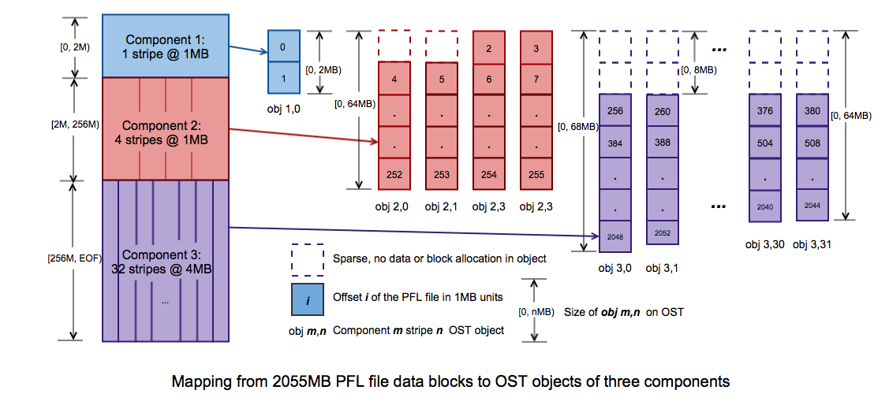
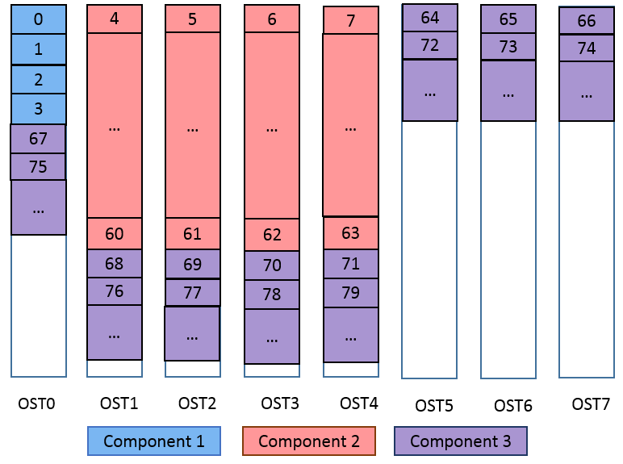
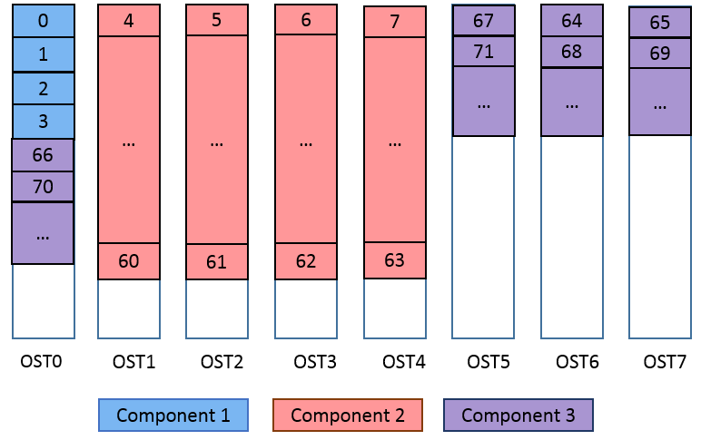
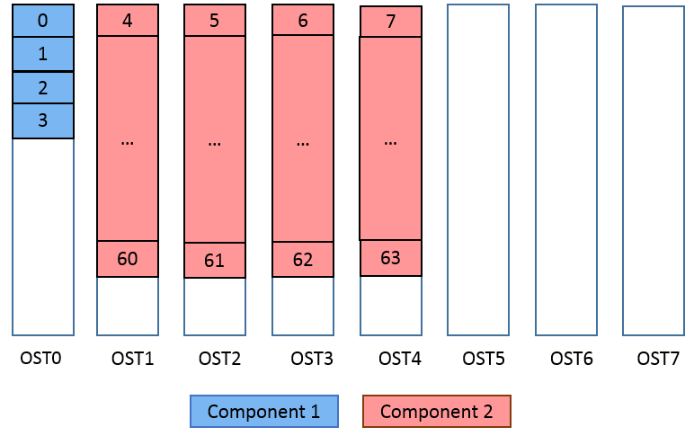
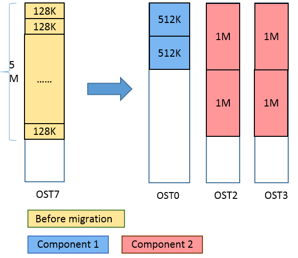
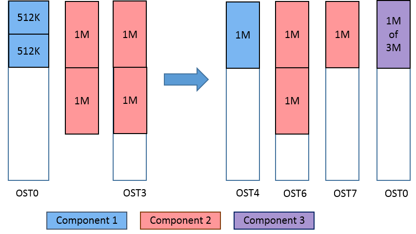
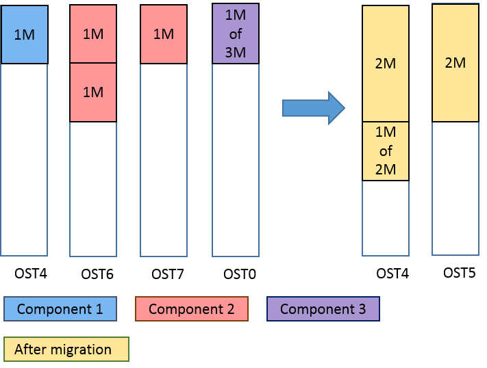

# Managing File Layout (Striping) and Free Space

- [Managing File Layout (Striping) and Free Space](#managing-file-layout-striping-and-free-space)
  * [How Lustre File System Striping Works](#how-lustre-file-system-striping-works)
  * [Lustre File Layout (Striping) Considerations](#lustre-file-layout-striping-considerations)
    + [Choosing a Stripe Size](#choosing-a-stripe-size)
  * [Setting the File Layout/Striping Configuration (`lfs setstripe`)](#setting-the-file-layoutstriping-configuration-lfs-setstripe)
    + [Specifying a File Layout (Striping Pattern) for a Single File](#specifying-a-file-layout-striping-pattern-for-a-single-file)
      - [Setting the Stripe Size](#setting-the-stripe-size)
      - [Setting the Stripe Count](#setting-the-stripe-count)
    + [Setting the Striping Layout for a Directory](#setting-the-striping-layout-for-a-directory)
    + [Setting the Striping Layout for a File System](#setting-the-striping-layout-for-a-file-system)
    + [Creating a File on a Specific OST](#creating-a-file-on-a-specific-ost)
  * [Retrieving File Layout/Striping Information (`getstripe`)](#retrieving-file-layoutstriping-information-getstripe)
    + [Displaying the Current Stripe Size](#displaying-the-current-stripe-size)
    + [Inspecting the File Tree](#inspecting-the-file-tree)
    + [Locating the MDT for a remote directory](#locating-the-mdt-for-a-remote-directory)
  * [Progressive File Layout(PFL)](#progressive-file-layoutpfl)L 2.10
    + [`lfs setstripe`](#lfs-setstripe)
      - [Create a PFL file](#create-a-pfl-file)
      - [Add component(s) to an existing composite file](#add-components-to-an-existing-composite-file)
      - [Delete component(s) from an existing file](#delete-components-from-an-existing-file)
      - [Set default PFL layout to an existing directory](#set-default-pfl-layout-to-an-existing-directory)
    + [`lfs migrate`](#lfs-migrate)
    + [`lfs getstripe`](#lfs-getstripe)
    + [`lfs find`](#lfs-find)
  * [Managing Free Space](#managing-free-space)
    + [Checking File System Free Space](#checking-file-system-free-space)
    + [Stripe Allocation Methods](#stripe-allocation-methods)
    + [Adjusting the Weighting Between Free Space and Location](#adjusting-the-weighting-between-free-space-and-location)
  * [Lustre Striping Internals](#lustre-striping-internals)

This chapter describes file layout (striping) and I/O options, and includes the following sections:

* [the section called “ How Lustre File System Striping Works”](#how-lustre-file-system-striping-works)
* [the section called “ Lustre File Layout (Striping) Considerations”](#lustre-file-layout-striping-considerations)
* [the section called “Setting the File Layout/Striping Configuration (`lfs setstripe`)”](#setting-the-file-layoutstriping-configuration-lfs-setstripe)
* [the section called “Retrieving File Layout/Striping Information (getstripe)”](#retrieving-file-layoutstriping-information-getstripe)
* [the section called “Managing Free Space”](#managing-free-space)
* [the section called “Lustre Striping Internals”](#lustre-striping-internals)

## How Lustre File System Striping Works

In a Lustre file system, the MDS allocates objects to OSTs using either a round-robin algorithm or a weighted algorithm. When the amount of free space is well balanced (i.e., by default, when the free space across OSTs differs by less than 17%), the round-robin algorithm is used to select the next OST to which a stripe is to be written. Periodically, the MDS adjusts the striping layout to eliminate some degenerated cases in which applications that create very regular file layouts (striping patterns) preferentially use a particular OST in the sequence.

Normally the usage of OSTs is well balanced. However, if users create a small number of exceptionally large files or incorrectly specify striping parameters, imbalanced OST usage may result. When the free space across OSTs differs by more than a specific amount (17% by default), the MDS then uses weighted random allocations with a preference for allocating objects on OSTs with more free space. (This can reduce I/O performance until space usage is rebalanced again.) For a more detailed description of how striping is allocated, see [*the section called “Managing Free Space”*](#managing-free-space).

Files can only be striped over a finite number of OSTs, based on the maximum size of the attributes that can be stored on the MDT. If the MDT is ldiskfs-based without the `ea_inode` feature, a file can be striped across at most 160 OSTs. With a ZFS-based MDT, or if the `ea_inode` feature is enabled for an ldiskfs-based MDT, a file can be striped across up to 2000 OSTs. For more information, see [*the section called “Lustre Striping Internals”*](#lustre-striping-internals).

## Lustre File Layout (Striping) Considerations

Whether you should set up file striping and what parameter values you select depends on your needs. A good rule of thumb is to stripe over as few objects as will meet those needs and no more.

Some reasons for using striping include:

- **Providing high-bandwidth access.** Many applications require high-bandwidth access to a single file, which may be more bandwidth than can be provided by a single OSS. Examples are a scientific application that writes to a single file from hundreds of nodes, or a binary executable that is loaded by many nodes when an application starts.

  In cases like these, a file can be striped over as many OSSs as it takes to achieve the required peak aggregate bandwidth for that file. Striping across a larger number of OSSs should only be used when the file size is very large and/or is accessed by many nodes at a time. Currently, Lustre files can be striped across up to 2000 OSTs, the maximum stripe count for an `ldiskfs` file system.

- **Improving performance when OSS bandwidth is exceeded.** Striping across many OSSs can improve performance if the aggregate client bandwidth exceeds the server bandwidth and the application reads and writes data fast enough to take advantage of the additional OSS bandwidth. The largest useful stripe count is bounded by the I/O rate of the clients/jobs divided by the performance per OSS.

- **Providing space for very large files.** Striping is useful when a single OST does not have enough free space to hold the entire file.

Some reasons to minimize or avoid striping:

- **Increased overhead.** Striping results in more locks and extra network operations during common operations such as `stat` and `unlink`. Even when these operations are performed in parallel, one network operation takes less time than 100 operations.

  Increased overhead also results from server contention. Consider a cluster with 100 clients and 100 OSSs, each with one OST. If each file has exactly one object and the load is distributed evenly, there is no contention and the disks on each server can manage sequential I/O. If each file has 100 objects, then the clients all compete with one another for the attention of the servers, and the disks on each node seek in 100 different directions resulting in needless contention.

- **Increased risk.** When files are striped across all servers and one of the servers breaks down, a small part of each striped file is lost. By comparison, if each file has exactly one stripe, fewer files are lost, but they are lost in their entirety. Many users would prefer to lose some of their files entirely than all of their files partially.

### Choosing a Stripe Size

Choosing a stripe size is a balancing act, but reasonable defaults are described below. The stripe size has no effect on a single-stripe file.

- **The stripe size must be a multiple of the page size.** Lustre software tools enforce a multiple of 64 KB (the maximum page size on ia64 and PPC64 nodes) so that users on platforms with smaller pages do not accidentally create files that might cause problems for ia64 clients.
- **The smallest recommended stripe size is 512 KB.** Although you can create files with a stripe size of 64 KB, the smallest practical stripe size is 512 KB because the Lustre file system sends 1MB chunks over the network. Choosing a smaller stripe size may result in inefficient I/O to the disks and reduced performance.
- **A good stripe size for sequential I/O using high-speed networks is between 1 MB and 4 MB.** In most situations, stripe sizes larger than 4 MB may result in longer lock hold times and contention during shared file access.
- **The maximum stripe size is 4 GB.** Using a large stripe size can improve performance when accessing very large files. It allows each client to have exclusive access to its own part of a file. However, a large stripe size can be counterproductive in cases where it does not match your I/O pattern.
- **Choose a stripe pattern that takes into account the write patterns of your application.** Writes that cross an object boundary are slightly less efficient than writes that go entirely to one server. If the file is written in a consistent and aligned way, make the stripe size a multiple of the `write()` size.

## Setting the File Layout/Striping Configuration (`lfs setstripe`)

Use the `lfs setstripe` command to create new files with a specific file layout (stripe pattern) configuration.

```
lfs setstripe [--size|-s stripe_size] [--count|-c stripe_count] \
[--index|-i start_ost] [--pool|-p pool_name] filename|dirname 
```

**stripe_size**

The `stripe_size` indicates how much data to write to one OST before moving to the next OST. The default `stripe_size` is 1 MB. Passing a `stripe_size` of 0 causes the default stripe size to be used. Otherwise, the `stripe_size` value must be a multiple of 64 KB.

**stripe_count**

The `stripe_count` indicates how many OSTs to use. The default `stripe_count` value is 1. Setting `stripe_count` to 0 causes the default stripe count to be used. Setting `stripe_count` to -1 means stripe over all available OSTs (full OSTs are skipped).

**start_ost**

The start OST is the first OST to which files are written. The default value for `start_ost` is -1, which allows the MDS to choose the starting index. This setting is strongly recommended, as it allows space and load balancing to be done by the MDS as needed. If the value of `start_ost` is set to a value other than -1, the file starts on the specified OST index. OST index numbering starts at 0.

**Note**

If the specified OST is inactive or in a degraded mode, the MDS will silently choose another target.

**Note**

If you pass a `start_ost` value of 0 and a `stripe_count` value of *1*, all files are written to OST 0, until space is exhausted. This is probably not what you meant to do. If you only want to adjust the stripe count and keep the other parameters at their default settings, do not specify any of the other parameters:

```
client# lfs setstripe -c stripe_count filename
```

**pool_name**

The `pool_name` specifies the OST pool to which the file will be written. This allows limiting the OSTs used to a subset of all OSTs in the file system. For more details about using OST pools, see [*Creating and Managing OST Pools*](03.12-Managing%20the%20File%20System%20and%20IO.md).

### Specifying a File Layout (Striping Pattern) for a Single File

It is possible to specify the file layout when a new file is created using the command `lfs setstripe`. This allows users to override the file system default parameters to tune the file layout more optimally for their application. Execution of an `lfs setstripe`command fails if the file already exists.

#### Setting the Stripe Size

The command to create a new file with a specified stripe size is similar to:

```
[client]# lfs setstripe -s 4M /mnt/lustre/new_file
```

This example command creates the new file `/mnt/lustre/new_file` with a stripe size of 4 MB.

Now, when the file is created, the new stripe setting creates the file on a single OST with a stripe size of 4M:

```
 [client]# lfs getstripe /mnt/lustre/new_file
/mnt/lustre/4mb_file
lmm_stripe_count:   1
lmm_stripe_size:    4194304
lmm_pattern:        1
lmm_layout_gen:     0
lmm_stripe_offset:  1
obdidx     objid        objid           group
1          690550       0xa8976         0 
```

In this example, the stripe size is 4 MB.

#### Setting the Stripe Count

The command below creates a new file with a stripe count of `-1` to specify striping over all available OSTs:

```
[client]# lfs setstripe -c -1 /mnt/lustre/full_stripe
```

The example below indicates that the file `full_stripe` is striped over all six active OSTs in the configuration:

```
[client]# lfs getstripe /mnt/lustre/full_stripe
/mnt/lustre/full_stripe
  obdidx   objid   objid   group
  0        8       0x8     0
  1        4       0x4     0
  2        5       0x5     0
  3        5       0x5     0
  4        4       0x4     0
  5        2       0x2     0
```

This is in contrast to the output in [*the section called “Setting the Stripe Size”*](#setting-the-stripe-size), which shows only a single object for the file.

### Setting the Striping Layout for a Directory

In a directory, the `lfs setstripe` command sets a default striping configuration for files created in the directory. The usage is the same as `lfs setstripe` for a regular file, except that the directory must exist prior to setting the default striping configuration. If a file is created in a directory with a default stripe configuration (without otherwise specifying striping), the Lustre file system uses those striping parameters instead of the file system default for the new file.

To change the striping pattern for a sub-directory, create a directory with desired file layout as described above. Sub-directories inherit the file layout of the root/parent directory.

### Setting the Striping Layout for a File System

Setting the striping specification on the `root` directory determines the striping for all new files created in the file system unless an overriding striping specification takes precedence (such as a striping layout specified by the application, or set using `lfs setstripe`, or specified for the parent directory).

**Note**

The striping settings for a `root` directory are, by default, applied to any new child directories created in the root directory, unless striping settings have been specified for the child directory.

### Creating a File on a Specific OST

You can use `lfs setstripe` to create a file on a specific OST. In the following example, the file `file1` is created on the first OST (OST index is 0).

```
$ lfs setstripe --count 1 --index 0 file1
$ dd if=/dev/zero of=file1 count=1 bs=100M
1+0 records in
1+0 records out

$ lfs getstripe file1
/mnt/testfs/file1
lmm_stripe_count:   1
lmm_stripe_size:    1048576
lmm_pattern:        1
lmm_layout_gen:     0
lmm_stripe_offset:  0               
     obdidx    objid   objid    group                    
     0         37364   0x91f4   0
```

## Retrieving File Layout/Striping Information (`getstripe`)

The `lfs getstripe` command is used to display information that shows over which OSTs a file is distributed. For each OST, the index and UUID is displayed, along with the OST index and object ID for each stripe in the file. For directories, the default settings for files created in that directory are displayed.

### Displaying the Current Stripe Size

To see the current stripe size for a Lustre file or directory, use the `lfs getstripe` command. For example, to view information for a directory, enter a command similar to:

```
[client]# lfs getstripe /mnt/lustre 
```

This command produces output similar to:

```
/mnt/lustre 
(Default) stripe_count: 1 stripe_size: 1M stripe_offset: -1
```

In this example, the default stripe count is `1` (data blocks are striped over a single OST), the default stripe size is 1 MB, and the objects are created over all available OSTs.

To view information for a file, enter a command similar to:

```
$ lfs getstripe /mnt/lustre/foo
/mnt/lustre/foo
lmm_stripe_count:   1
lmm_stripe_size:    1048576
lmm_pattern:        1
lmm_layout_gen:     0
lmm_stripe_offset:  0
  obdidx   objid    objid      group
  2        835487   m0xcbf9f   0 
```

In this example, the file is located on `obdidx 2`, which corresponds to the OST `lustre-OST0002`. To see which node is serving that OST, run:

```
$ lctl get_param osc.lustre-OST0002-osc.ost_conn_uuid
osc.lustre-OST0002-osc.ost_conn_uuid=192.168.20.1@tcp
```

### Inspecting the File Tree

To inspect an entire tree of files, use the `lfs find` command:

```
lfs find [--recursive | -r] file|directory ...
```

### Locating the MDT for a remote directory

Introduced in Lustre 2.4Lustre software release 2.4 can be configured with multiple MDTs in the same file system. Each sub-directory can have a different MDT. To identify on which MDT a given subdirectory is located, pass the `getstripe [--mdt-index|-M]` parameters to `lfs`. An example of this command is provided in the section [*the section called “Removing an MDT from the File System”*](03.03-Lustre%20Maintenance.md#removing-an-mdt-from-the-file-system).

Introduced in Lustre 2.10

## Progressive File Layout(PFL)

The Lustre Progressive File Layout (PFL) feature simplifies the use of Lustre so that users can expect reasonable performance for a variety of normal file IO patterns without the need to explicitly understand their IO model or Lustre usage details in advance. In particular, users do not necessarily need to know the size or concurrency of output files in advance of their creation and explicitly specify an optimal layout for each file in order to achieve good performance for both highly concurrent shared-single-large-file IO or parallel IO to many smaller per-process files.

The layout of a PFL file is stored on disk as `composite layout`. A PFL file is essentially an array of `sub-layout components`, with each sub-layout component being a plain layout covering different and non-overlapped extents of the file. For PFL files, the file layout is composed of a series of components, therefore it's possible that there are some file extents are not described by any components.

An example of how data blocks of PFL files are mapped to OST objects of components is shown in the following PFL object mapping diagram:

##### Figure 10. PFL object mapping diagram



The PFL file in [Figure 10, “PFL object mapping diagram”](#figure-10-pfl-object-mapping-diagram)  has 3 components and shows the mapping for the blocks of a 2055MB file. The stripe size for the first two components is 1MB, while the stripe size for the third component is 4MB. The stripe count is increasing for each successive component. The first component only has two 1MB blocks and the single object has a size of 2MB. The second component holds the next 254MB of the file spread over 4 separate OST objects in RAID-0, each one will have a size of 256MB / 4 objects = 64MB per object. Note the first two objects `obj 2,0` and `obj 2,1` have a 1MB hole at the start where the data is stored in the first component. The final component holds the next 1800MB spread over 32 OST objects. There is a 256MB / 32 = 8MB hole at the start each one for the data stored in the first two components. Each object will be 2048MB / 32 objects = 64MB per object, except the `obj 3,0` that holds an extra 4MB chunk and `obj 3,1` that holds an extra 3MB chunk. If more data was written to the file, only the objects in component 3 would increase in size.

When a file range with defined but not instantiated component is accessed, clients will send a Layout Intent RPC to the MDT, and the MDT would instantiate the objects of the components covering that range.

Next, some commands for user to operate PFL files are introduced and some examples of possible composite layout are illustrated as well. Lustre provides commands `lfs setstripe` and `lfs migrate` for users to operate PFL files. `lfs setstripe`commands are used to create PFL files, add or delete components to or from an existing composite file; `lfs migrate` commands are used to re-layout the data in existing files using the new layout parameter by copying the data from the existing OST(s) to the new OST(s). Also, as introduced in the previous sections, `lfs getstripe` commands can be used to list the striping/component information for a given PFL file, and `lfs find` commands can be used to search the directory tree rooted at the given directory or file name for the files that match the given PFL component parameters.

**Note**

Using PFL files requires both the client and server to understand the PFL file layout, which isn't available for Lustre 2.9 and earlier. And it will not prevent older clients from accessing non-PFL files in the filesystem.

### `lfs setstripe`

`lfs setstripe` commands are used to create PFL files, add or delete components to or from an existing composite file. (Suppose we have 8 OSTs in the following examples and stripe size is 1MB by default.)

#### Create a PFL file

**Command**

```
lfs setstripe
[--component-end|-E end1] [STRIPE_OPTIONS]
[--component-end|-E end2] [STRIPE_OPTIONS] ... filename
```

The `-E` option is used to specify the end offset (in bytes or using a suffix “kMGTP”, e.g. 256M) of each component, and it also indicates the following `STRIPE_OPTIONS` are for this component. Each component defines the stripe pattern of the file in the range of [start, end). The first component must start from offset 0 and all components must be adjacent with each other, no holes are allowed, so each extent will start at the end of previous extent. A `-1` end offset or `eof` indicates this is the last component extending to the end of file.

**Example**

```
$ lfs setstripe -E 4M -c 1 -E 64M -c 4 -E -1 -c -1 -i 4 \
/mnt/testfs/create_comp
```

This command creates a file with composite layout illustrated in the following figure. The first component has 1 stripe and covers [0, 4M), the second component has 4 stripes and covers [4M, 64M), and the last component stripes start at OST4, cross over all available OSTs and covers [64M, EOF).

**Figure 11. Example: create a composite file**

  

The composite layout can be output by the following command:

```
$ lfs getstripe /mnt/testfs/create_comp
/mnt/testfs/create_comp
  lcm_layout_gen:  3
  lcm_entry_count: 3
    lcme_id:             1
    lcme_flags:          init
    lcme_extent.e_start: 0
    lcme_extent.e_end:   4194304
      lmm_stripe_count:  1
      lmm_stripe_size:   1048576
      lmm_pattern:       1
      lmm_layout_gen:    0
      lmm_stripe_offset: 0
      lmm_objects:
      - 0: { l_ost_idx: 0, l_fid: [0x100000000:0x2:0x0] }

    lcme_id:             2
    lcme_flags:          0
    lcme_extent.e_start: 4194304
    lcme_extent.e_end:   67108864
      lmm_stripe_count:  4
      lmm_stripe_size:   1048576
      lmm_pattern:       1
      lmm_layout_gen:    0
      lmm_stripe_offset: -1
    lcme_id:             3
    lcme_flags:          0
    lcme_extent.e_start: 67108864
    lcme_extent.e_end:   EOF
      lmm_stripe_count:  -1
      lmm_stripe_size:   1048576
      lmm_pattern:       1
      lmm_layout_gen:    0
      lmm_stripe_offset: 4
```

**Note**

Only the first component’s OST objects of the PFL file are instantiated when the layout is being set. Other instantiation is delayed to later write/truncate operations.

If we write 128M data to this PFL file, the second and third components will be instantiated:

```
$ dd if=/dev/zero of=/mnt/testfs/create_comp bs=1M count=128
$ lfs getstripe /mnt/testfs/create_comp
/mnt/testfs/create_comp
  lcm_layout_gen:  5
  lcm_entry_count: 3
    lcme_id:             1
    lcme_flags:          init
    lcme_extent.e_start: 0
    lcme_extent.e_end:   4194304
      lmm_stripe_count:  1
      lmm_stripe_size:   1048576
      lmm_pattern:       1
      lmm_layout_gen:    0
      lmm_stripe_offset: 0
      lmm_objects:
      - 0: { l_ost_idx: 0, l_fid: [0x100000000:0x2:0x0] }

    lcme_id:             2
    lcme_flags:          init
    lcme_extent.e_start: 4194304
    lcme_extent.e_end:   67108864
      lmm_stripe_count:  4
      lmm_stripe_size:   1048576
      lmm_pattern:       1
      lmm_layout_gen:    0
      lmm_stripe_offset: 1
      lmm_objects:
      - 0: { l_ost_idx: 1, l_fid: [0x100010000:0x2:0x0] }
      - 1: { l_ost_idx: 2, l_fid: [0x100020000:0x2:0x0] }
      - 2: { l_ost_idx: 3, l_fid: [0x100030000:0x2:0x0] }
      - 3: { l_ost_idx: 4, l_fid: [0x100040000:0x2:0x0] }

    lcme_id:             3
    lcme_flags:          init
    lcme_extent.e_start: 67108864
    lcme_extent.e_end:   EOF
      lmm_stripe_count:  8
      lmm_stripe_size:   1048576
      lmm_pattern:       1
      lmm_layout_gen:    0
      lmm_stripe_offset: 4
      lmm_objects:
      - 0: { l_ost_idx: 4, l_fid: [0x100040000:0x3:0x0] }
      - 1: { l_ost_idx: 5, l_fid: [0x100050000:0x2:0x0] }
      - 2: { l_ost_idx: 6, l_fid: [0x100060000:0x2:0x0] }
      - 3: { l_ost_idx: 7, l_fid: [0x100070000:0x2:0x0] }
      - 4: { l_ost_idx: 0, l_fid: [0x100000000:0x3:0x0] }
      - 5: { l_ost_idx: 1, l_fid: [0x100010000:0x3:0x0] }
      - 6: { l_ost_idx: 2, l_fid: [0x100020000:0x3:0x0] }
      - 7: { l_ost_idx: 3, l_fid: [0x100030000:0x3:0x0] }
```

#### Add component(s) to an existing composite file

**Command**

```
lfs setstripe --component-add
[--component-end|-E end1] [STRIPE_OPTIONS]
[--component-end|-E end2] [STRIPE_OPTIONS] ... filename
```

The option `--component-add` is used to add components to an existing composite file. The extent start of the first component to be added is equal to the extent end of last component in the existing file, and all components to be added must be adjacent with each other.

**Note**

If the last existing component is specified by `-E -1` or `-E eof`, which covers to the end of the file, it must be deleted before a new one is added.

**Example**

```
$ lfs setstripe -E 4M -c 1 -E 64M -c 4 /mnt/testfs/add_comp
$ lfs setstripe --component-add -E -1 -c 4 -o 6-7,0,5 \
/mnt/testfs/add_comp
```

This command adds a new component which starts from the end of the last existing component to the end of file. The layout of this example is illustrated in [Figure 12, “Example: add a component to an existing composite file”](#figure-12-example-add-a-component-to-an-existing-composite-file). The last component stripes across 4 OSTs in sequence OST6, OST7, OST0 and OST5, covers [64M, EOF).

##### Figure 12. Example: add a component to an existing composite file

 Example: add a component to an existing composite file 

The layout can be printed out by the following command:

```
$ lfs getstripe /mnt/testfs/add_comp
/mnt/testfs/add_comp
  lcm_layout_gen:  5
  lcm_entry_count: 3
    lcme_id:             1
    lcme_flags:          init
    lcme_extent.e_start: 0
    lcme_extent.e_end:   4194304
      lmm_stripe_count:  1
      lmm_stripe_size:   1048576
      lmm_pattern:       1
      lmm_layout_gen:    0
      lmm_stripe_offset: 0
      lmm_objects:
      - 0: { l_ost_idx: 0, l_fid: [0x100000000:0x2:0x0] }

    lcme_id:             2
    lcme_flags:          init
    lcme_extent.e_start: 4194304
    lcme_extent.e_end:   67108864
      lmm_stripe_count:  4
      lmm_stripe_size:   1048576
      lmm_pattern:       1
      lmm_layout_gen:    0
      lmm_stripe_offset: 1
      lmm_objects:
      - 0: { l_ost_idx: 1, l_fid: [0x100010000:0x2:0x0] }
      - 1: { l_ost_idx: 2, l_fid: [0x100020000:0x2:0x0] }
      - 2: { l_ost_idx: 3, l_fid: [0x100030000:0x2:0x0] }
      - 3: { l_ost_idx: 4, l_fid: [0x100040000:0x2:0x0] }

    lcme_id:             5
    lcme_flags:          0
    lcme_extent.e_start: 67108864
    lcme_extent.e_end:   EOF
      lmm_stripe_count:  4
      lmm_stripe_size:   1048576
      lmm_pattern:       1
      lmm_layout_gen:    0
      lmm_stripe_offset: -1
```

The component ID "lcme_id" changes as layout generation changes. It is not necessarily sequential and does not imply ordering of individual components.

**Note**

Similar to specifying a full-file composite layout at file creation time, `--component-add` won't instantiate OST objects, the instantiation is delayed to later write/truncate operations. For example, after writing beyond the 64MB start of the file's last component, the new component has had objects allocated:

```
$ lfs getstripe -I5 /mnt/testfs/add_comp
/mnt/testfs/add_comp
  lcm_layout_gen:  6
  lcm_entry_count: 3
    lcme_id:             5
    lcme_flags:          init
    lcme_extent.e_start: 67108864
    lcme_extent.e_end:   EOF
      lmm_stripe_count:  4
      lmm_stripe_size:   1048576
      lmm_pattern:       1
      lmm_layout_gen:    0
      lmm_stripe_offset: 6
      lmm_objects:
      - 0: { l_ost_idx: 6, l_fid: [0x100060000:0x4:0x0] }
      - 1: { l_ost_idx: 7, l_fid: [0x100070000:0x4:0x0] }
      - 2: { l_ost_idx: 0, l_fid: [0x100000000:0x5:0x0] }
      - 3: { l_ost_idx: 5, l_fid: [0x100050000:0x4:0x0] }
```

#### Delete component(s) from an existing file

**Command**

```
lfs setstripe --component-del
[--component-id|-I comp_id | --component-flags comp_flags]
filename
```

The option `--component-del` is used to remove the component(s) specified by component ID or flags from an existing file. This operation will result in any data stored in the deleted component will be lost.

The ID specified by `-I` option is the numerical unique ID of the component, which can be obtained by command `lfs getstripe -I` command, and the flag specified by `--component-flags` option is a certain type of components, which can be obtained by command `lfs getstripe --component-flags`. For now, we only have two flags `init` and `^init` for instantiated and un-instantiated components respectively.

**Note**

Deletion must start with the last component because hole is not allowed.

**Example**

```
$ lfs getstripe -I /mnt/testfs/del_comp
1
2
5
$ lfs setstripe --component-del -I 5 /mnt/testfs/del_comp
```

This example deletes the component with ID 5 from file `/mnt/testfs/del_comp`. If we still use the last example, the final result is illustrated in [Figure 13, “Example: delete a component from an existing file”](#figure-13-example-delete-a-component-from-an-existing-file).

##### Figure 13. Example: delete a component from an existing file

  

If you try to delete a non-last component, you will see the following error:

```
$ lfs setstripe -component-del -I 2 /mnt/testfs/del_comp
Delete component 0x2 from /mnt/testfs/del_comp failed. Invalid argument
error: setstripe: delete component of file '/mnt/testfs/del_comp' failed: Invalid argument
```

#### Set default PFL layout to an existing directory

Similar to create a PFL file, you can set default PFL layout to an existing directory. After that, all the files created will inherit this layout by default.

**Command**

```
lfs setstripe
[--component-end|-E end1] [STRIPE_OPTIONS]
[--component-end|-E end2] [STRIPE_OPTIONS] ... dirname
```

**Example**

```
$ mkdir /mnt/testfs/pfldir
$ lfs setstripe -E 256M -c 1 -E 16G -c 4 -E -1 -S 4M -c -1 /mnt/testfs/pfldir
```

When you run `lfs getstripe`, you will see:

```
$ lfs getstripe /mnt/testfs/pfldir
/mnt/testfs/pfldir
  lcm_layout_gen:  0
  lcm_entry_count: 3
    lcme_id:             N/A
    lcme_flags:          0
    lcme_extent.e_start: 0
    lcme_extent.e_end:   268435456
      stripe_count:  1       stripe_size:   1048576       stripe_offset: -1
    lcme_id:             N/A
    lcme_flags:          0
    lcme_extent.e_start: 268435456
    lcme_extent.e_end:   17179869184
      stripe_count:  4       stripe_size:   1048576       stripe_offset: -1
    lcme_id:             N/A
    lcme_flags:          0
    lcme_extent.e_start: 17179869184
    lcme_extent.e_end:   EOF
      stripe_count:  -1       stripe_size:   4194304       stripe_offset: -1
```

If you create a file under `/mnt/testfs/pfldir`, the layout of that file will inherit the layout from its parent directory:

```
$ touch /mnt/testfs/pfldir/pflfile
$ lfs getstripe /mnt/testfs/pfldir/pflfile
/mnt/testfs/pfldir/pflfile
  lcm_layout_gen:  2
  lcm_entry_count: 3
    lcme_id:             1
    lcme_flags:          init
    lcme_extent.e_start: 0
    lcme_extent.e_end:   268435456
      lmm_stripe_count:  1
      lmm_stripe_size:   1048576
      lmm_pattern:       raid0
      lmm_layout_gen:    0
      lmm_stripe_offset: 1
      lmm_objects:
      - 0: { l_ost_idx: 1, l_fid: [0x100010000:0xa:0x0] }

    lcme_id:             2
    lcme_flags:          0
    lcme_extent.e_start: 268435456
    lcme_extent.e_end:   17179869184
      lmm_stripe_count:  4
      lmm_stripe_size:   1048576
      lmm_pattern:       raid0
      lmm_layout_gen:    0
      lmm_stripe_offset: -1

    lcme_id:             3
    lcme_flags:          0
    lcme_extent.e_start: 17179869184
    lcme_extent.e_end:   EOF
      lmm_stripe_count:  -1
      lmm_stripe_size:   4194304
      lmm_pattern:       raid0
      lmm_layout_gen:    0
      lmm_stripe_offset: -1
```

**Note**

`lfs setstripe --component-add/del` can't be run on a directory, because default layout in directory is likea config, which can be arbitrarily changed by `lfs setstripe`, while layout in file may have data (OST objects) attached. If you want to delete default layout in a directory, run `lfs setstripe -d *dirname*` to return the directory to the filesystem-wide defaults, like:

```
$ lfs setstripe -d /mnt/testfs/pfldir
$ lfs getstripe -d /mnt/testfs/pfldir
/mnt/testfs/pfldir
stripe_count:  1 stripe_size:   1048576 stripe_offset: -1
/mnt/testfs/pfldir/commonfile
lmm_stripe_count:  1
lmm_stripe_size:   1048576
lmm_pattern:       1
lmm_layout_gen:    0
lmm_stripe_offset: 0
	obdidx		 objid		 objid		 group
	     2	             9	          0x9	             0
```

### `lfs migrate`

`lfs migrate` commands are used to re-layout the data in the existing files with the new layout parameter by copying the data from the existing OST(s) to the new OST(s).

**Command**

```
lfs migrate [--component-end|-E comp_end] [STRIPE_OPTIONS] ...
filename
```

The difference between `migrate` and `setstripe` is that `migrate` is to re-layout the data in the existing files, while `setstripe` is to create new files with the specified layout.

**Example**

**Case1. Migrate a normal one to a composite layout**

```
$ lfs setstripe -c 1 -S 128K /mnt/testfs/norm_to_2comp
$ dd if=/dev/urandom of=/mnt/testfs/norm_to_2comp bs=1M count=5
$ lfs getstripe /mnt/testfs/norm_to_2comp --yaml
/mnt/testfs/norm_to_comp
lmm_stripe_count:  1
lmm_stripe_size:   131072
lmm_pattern:       1
lmm_layout_gen:    0
lmm_stripe_offset: 7
lmm_objects:
      - l_ost_idx: 7
        l_fid:     0x100070000:0x2:0x0
$ lfs migrate -E 1M -S 512K -c 1 -E -1 -S 1M -c 2 \
/mnt/testfs/norm_to_2comp
```

In this example, a 5MB size file with 1 stripe and 128K stripe size is migrated to a composite layout file with 2 components, illustrated in [Figure 14, “Example: migrate normal to composite”](#figure-14-example-migrate-normal-to-composite).

##### Figure 14. Example: migrate normal to composite



The stripe information after migration is like:

```
$ lfs getstripe /mnt/testfs/norm_to_2comp
/mnt/testfs/norm_to_2comp
  lcm_layout_gen:  4
  lcm_entry_count: 2
    lcme_id:             1
    lcme_flags:          init
    lcme_extent.e_start: 0
    lcme_extent.e_end:   1048576
      lmm_stripe_count:  1
      lmm_stripe_size:   524288
      lmm_pattern:       1
      lmm_layout_gen:    0
      lmm_stripe_offset: 0
      lmm_objects:
      - 0: { l_ost_idx: 0, l_fid: [0x100000000:0x2:0x0] }

    lcme_id:             2
    lcme_flags:          init
    lcme_extent.e_start: 1048576
    lcme_extent.e_end:   EOF
      lmm_stripe_count:  2
      lmm_stripe_size:   1048576
      lmm_pattern:       1
      lmm_layout_gen:    0
      lmm_stripe_offset: 2
      lmm_objects:
      - 0: { l_ost_idx: 2, l_fid: [0x100020000:0x2:0x0] }
      - 1: { l_ost_idx: 3, l_fid: [0x100030000:0x2:0x0] }
```

**Case2. Migrate a composite layout to another composite layout**

```
$ lfs setstripe -E 1M -S 512K -c 1 -E -1 -S 1M -c 2 \
/mnt/testfs/2comp_to_3comp
$ dd if=/dev/urandom of=/mnt/testfs/norm_to_2comp bs=1M count=5
$ lfs migrate -E 1M -S 1M -c 2 -E 4M -S 1M -c 2 -E -1 -S 3M -c 3 \
/mnt/testfs/2comp_to_3comp
```

In this example, a composite layout file with 2 components is migrated a composite layout file with 3 components. If we still use the example in case1, the migration process is illustrated in [Figure 15, “Example: migrate composite to composite”](#figure-15-example-migrate-composite-to-composite).

##### Figure 15. Example: migrate composite to composite



The stripe information is like:

```
$ lfs getstripe /mnt/testfs/2comp_to_3comp
/mnt/testfs/2comp_to_3comp
  lcm_layout_gen:  6
  lcm_entry_count: 3
    lcme_id:             1
    lcme_flags:          init
    lcme_extent.e_start: 0
    lcme_extent.e_end:   1048576
      lmm_stripe_count:  2
      lmm_stripe_size:   1048576
      lmm_pattern:       1
      lmm_layout_gen:    0
      lmm_stripe_offset: 4
      lmm_objects:
      - 0: { l_ost_idx: 4, l_fid: [0x100040000:0x2:0x0] }
      - 1: { l_ost_idx: 5, l_fid: [0x100050000:0x2:0x0] }

    lcme_id:             2
    lcme_flags:          init
    lcme_extent.e_start: 1048576
    lcme_extent.e_end:   4194304
      lmm_stripe_count:  2
      lmm_stripe_size:   1048576
      lmm_pattern:       1
      lmm_layout_gen:    0
      lmm_stripe_offset: 6
      lmm_objects:
      - 0: { l_ost_idx: 6, l_fid: [0x100060000:0x2:0x0] }
      - 1: { l_ost_idx: 7, l_fid: [0x100070000:0x3:0x0] }

    lcme_id:             3
    lcme_flags:          init
    lcme_extent.e_start: 4194304
    lcme_extent.e_end:   EOF
      lmm_stripe_count:  3
      lmm_stripe_size:   3145728
      lmm_pattern:       1
      lmm_layout_gen:    0
      lmm_stripe_offset: 0
      lmm_objects:
      - 0: { l_ost_idx: 0, l_fid: [0x100000000:0x3:0x0] }
      - 1: { l_ost_idx: 1, l_fid: [0x100010000:0x2:0x0] }
      - 2: { l_ost_idx: 2, l_fid: [0x100020000:0x3:0x0] }
```

**Case3. Migrate a composite layout to a normal one**

```
$ lfs migrate -E 1M -S 1M -c 2 -E 4M -S 1M -c 2 -E -1 -S 3M -c 3 \
/mnt/testfs/3comp_to_norm
$ dd if=/dev/urandom of=/mnt/testfs/norm_to_2comp bs=1M count=5
$ lfs migrate -c 2 -S 2M /mnt/testfs/3comp_to_normal
```

In this example, a composite file with 3 components is migrated to a normal file with 2 stripes and 2M stripe size. If we still use the example in Case2, the migration process is illustrated in [Figure 16, “Example: migrate composite to normal”](#figure-16-example-migrate-composite-to-normal).

##### Figure 16. Example: migrate composite to normal

 

The stripe information is like:

```
$ lfs getstripe /mnt/testfs/3comp_to_norm --yaml
/mnt/testfs/3comp_to_norm
lmm_stripe_count:  2
lmm_stripe_size:   2097152
lmm_pattern:       1
lmm_layout_gen:    7
lmm_stripe_offset: 4
lmm_objects:
      - l_ost_idx: 4
        l_fid:     0x100040000:0x3:0x0
      - l_ost_idx: 5
        l_fid:     0x100050000:0x3:0x0
```

### `lfs getstripe`

`lfs getstripe` commands can be used to list the striping/component information for a given PFL file. Here, only those parameters new for PFL files are shown.

**Command**

```
lfs getstripe
[--component-id|-I [comp_id]]
[--component-flags [comp_flags]]
[--component-count]
[--component-start [+-][N][kMGTPE]]
[--component-end|-E [+-][N][kMGTPE]]
dirname|filename
```

**Example**

Suppose we already have a composite file `/mnt/testfs/3comp`, created by the following command:

```
$ lfs setstripe -E 4M -c 1 -E 64M -c 4 -E -1 -c -1 -i 4 \
/mnt/testfs/3comp
```

And write some data

```
$ dd if=/dev/zero of=/mnt/testfs/3comp bs=1M count=5
```

**Case1. List component ID and its related information**

- List all the components ID

  ```
  $ lfs getstripe -I /mnt/testfs/3comp
  1
  2
  3
  ```

- List the detailed striping information of component ID=2

  ```
  $ lfs getstripe -I2 /mnt/testfs/3comp
  /mnt/testfs/3comp
    lcm_layout_gen:  4
    lcm_entry_count: 3
      lcme_id:             2
      lcme_flags:          init
      lcme_extent.e_start: 4194304
      lcme_extent.e_end:   67108864
        lmm_stripe_count:  4
        lmm_stripe_size:   1048576
        lmm_pattern:       1
        lmm_layout_gen:    0
        lmm_stripe_offset: 5
        lmm_objects:
        - 0: { l_ost_idx: 5, l_fid: [0x100050000:0x2:0x0] }
        - 1: { l_ost_idx: 6, l_fid: [0x100060000:0x2:0x0] }
        - 2: { l_ost_idx: 7, l_fid: [0x100070000:0x2:0x0] }
        - 3: { l_ost_idx: 0, l_fid: [0x100000000:0x2:0x0] }
  ```

- List the stripe offset and stripe count of component ID=2

  ```
  $ lfs getstripe -I2 -i -c /mnt/testfs/3comp
        lmm_stripe_count:  4
        lmm_stripe_offset: 5
  ```

**Case2. List the component which contains the specified flag**

- List the flag of each component

  ```
  $ lfs getstripe -component-flag -I /mnt/testfs/3comp
      lcme_id:             1
      lcme_flags:          init
      lcme_id:             2
      lcme_flags:          init
      lcme_id:             3
      lcme_flags:          0
  ```

- List component(s) who is not instantiated

  ```
  $ lfs getstripe --component-flags=^init /mnt/testfs/3comp
  /mnt/testfs/3comp
    lcm_layout_gen:  4
    lcm_entry_count: 3
      lcme_id:             3
      lcme_flags:          0
      lcme_extent.e_start: 67108864
      lcme_extent.e_end:   EOF
        lmm_stripe_count:  -1
        lmm_stripe_size:   1048576
        lmm_pattern:       1
        lmm_layout_gen:    4
        lmm_stripe_offset: 4
  ```

**Case3. List the total number of all the component(s)**

- List the total number of all the components

  ```
  $ lfs getstripe --component-count /mnt/testfs/3comp
  3
  ```

**Case4. List the component with the specified extent start or end positions**

- List the start position in bytes of each component

  ```
  $ lfs getstripe --component-start /mnt/testfs/3comp
  0
  4194304
  67108864
  ```

- List the start position in bytes of component ID=3

  ```
  $ lfs getstripe --component-start -I3 /mnt/testfs/3comp
  67108864
  ```

- List the component with start = 64M

  ```
  $ lfs getstripe --component-start=64M /mnt/testfs/3comp
  /mnt/testfs/3comp
    lcm_layout_gen:  4
    lcm_entry_count: 3
      lcme_id:             3
      lcme_flags:          0
      lcme_extent.e_start: 67108864
      lcme_extent.e_end:   EOF
        lmm_stripe_count:  -1
        lmm_stripe_size:   1048576
        lmm_pattern:       1
        lmm_layout_gen:    4
        lmm_stripe_offset: 4
  ```

- List the component(s) with start > 5M

  ```
  $ lfs getstripe --component-start=+5M /mnt/testfs/3comp
  /mnt/testfs/3comp
    lcm_layout_gen:  4
    lcm_entry_count: 3
      lcme_id:             3
      lcme_flags:          0
      lcme_extent.e_start: 67108864
      lcme_extent.e_end:   EOF
        lmm_stripe_count:  -1
        lmm_stripe_size:   1048576
        lmm_pattern:       1
        lmm_layout_gen:    4
        lmm_stripe_offset: 4
  ```

- List the component(s) with start < 5M

  ```
  $ lfs getstripe --component-start=-5M /mnt/testfs/3comp
  /mnt/testfs/3comp
    lcm_layout_gen:  4
    lcm_entry_count: 3
      lcme_id:             1
      lcme_flags:          init
      lcme_extent.e_start: 0
      lcme_extent.e_end:   4194304
        lmm_stripe_count:  1
        lmm_stripe_size:   1048576
        lmm_pattern:       1
        lmm_layout_gen:    0
        lmm_stripe_offset: 4
        lmm_objects:
        - 0: { l_ost_idx: 4, l_fid: [0x100040000:0x2:0x0] }
  
      lcme_id:             2
      lcme_flags:          init
      lcme_extent.e_start: 4194304
      lcme_extent.e_end:   67108864
        lmm_stripe_count:  4
        lmm_stripe_size:   1048576
        lmm_pattern:       1
        lmm_layout_gen:    0
        lmm_stripe_offset: 5
        lmm_objects:
        - 0: { l_ost_idx: 5, l_fid: [0x100050000:0x2:0x0] }
        - 1: { l_ost_idx: 6, l_fid: [0x100060000:0x2:0x0] }
        - 2: { l_ost_idx: 7, l_fid: [0x100070000:0x2:0x0] }
        - 3: { l_ost_idx: 0, l_fid: [0x100000000:0x2:0x0] }
  ```

- List the component(s) with start > 3M and end < 70M

  ```
  $ lfs getstripe --component-start=+3M --component-end=-70M \
  /mnt/testfs/3comp
  /mnt/testfs/3comp
    lcm_layout_gen:  4
    lcm_entry_count: 3
      lcme_id:             2
      lcme_flags:          init
      lcme_extent.e_start: 4194304
      lcme_extent.e_end:   67108864
        lmm_stripe_count:  4
        lmm_stripe_size:   1048576
        lmm_pattern:       1
        lmm_layout_gen:    0
        lmm_stripe_offset: 5
        lmm_objects:
        - 0: { l_ost_idx: 5, l_fid: [0x100050000:0x2:0x0] }
        - 1: { l_ost_idx: 6, l_fid: [0x100060000:0x2:0x0] }
        - 2: { l_ost_idx: 7, l_fid: [0x100070000:0x2:0x0] }
        - 3: { l_ost_idx: 0, l_fid: [0x100000000:0x2:0x0] }
  ```

### `lfs find`

`lfs find` commands can be used to search the directory tree rooted at the given directory or file name for the files that match the given PFL component parameters. Here, only those parameters new for PFL files are shown. Their usages are similar to `lfs getstripe` commands.

**Command**

```
lfs find directory|filename
[[!] --component-count [+-=]comp_cnt]
[[!] --component-start [+-=]N[kMGTPE]]
[[!] --component-end|-E [+-=]N[kMGTPE]]
[[!] --component-flags=comp_flags]
```

**Note**

If you use `--component-xxx` options, only the composite files will be searched; but if you use `! --component-xxx` options, all the files will be searched.

**Example**

We use the following directory and composite files to show how `lfs find` works.

```
$ mkdir /mnt/testfs/testdir
$ lfs setstripe -E 1M -E 10M -E eof /mnt/testfs/testdir/3comp
$ lfs setstripe -E 4M -E 20M -E 30M -E eof /mnt/testfs/testdir/4comp
$ mkdir -p /mnt/testfs/testdir/dir_3comp
$ lfs setstripe -E 6M -E 30M -E eof /mnt/testfs/testdir/dir_3comp
$ lfs setstripe -E 8M -E eof /mnt/testfs/testdir/dir_3comp/2comp
$ lfs setstripe -c 1 /mnt/testfs/testdir/dir_3comp/commnfile
```

**Case1. Find the files that match the specified component count condition**

Find the files under directory /mnt/testfs/testdir whose number of components is not equal to 3.

```
$ lfs find /mnt/testfs/testdir ! --component-count=3
/mnt/testfs/testdir
/mnt/testfs/testdir/4comp
/mnt/testfs/testdir/dir_3comp/2comp
/mnt/testfs/testdir/dir_3comp/commonfile
```

**Case2. Find the files/dirs that match the specified component start/end condition**

Find the file(s) under directory /mnt/testfs/testdir with component start = 4M and end < 70M

```
$ lfs find /mnt/testfs/testdir --component-start=4M -E -30M
/mnt/testfs/testdir/4comp
```

**Case3. Find the files/dirs that match the specified component flag condition**

Find the file(s) under directory /mnt/testfs/testdir whose component flags contain `init`

```
$ lfs find /mnt/testfs/testdir --component-flag=init
/mnt/testfs/testdir/3comp
/mnt/testfs/testdir/4comp
/mnt/testfs/testdir/dir_3comp/2comp
```

**Note**

Since `lfs find` uses "`!`" to do negative search, we don’t support flag `^init` here.

## Managing Free Space

To optimize file system performance, the MDT assigns file stripes to OSTs based on two allocation algorithms. The round-robin allocator gives preference to location (spreading out stripes across OSSs to increase network bandwidth utilization) and the weighted allocator gives preference to available space (balancing loads across OSTs). Threshold and weighting factors for these two algorithms can be adjusted by the user. The MDT reserves 0.1 percent of total OST space and 32 inodes for each OST. The MDT stops object allocation for the OST if available space is less than reserved or the OST has fewer than 32 free inodes. The MDT starts object allocation when available space is twice as big as the reserved space and the OST has more than 64 free inodes. Note, clients could append existing files no matter what object allocation state is.

Introduced in Lustre 2.9The reserved space for each OST can be adjusted by the user. Use the `lctl set_param` command, for example the next command reserve 1GB space for all OSTs.`lctl set_param -P osp.*.reserved_mb_low=1024`

This section describes how to check available free space on disks and how free space is allocated. It then describes how to set the threshold and weighting factors for the allocation algorithms.

### Checking File System Free Space

Free space is an important consideration in assigning file stripes. The `lfs df` command can be used to show available disk space on the mounted Lustre file system and space consumption per OST. If multiple Lustre file systems are mounted, a path may be specified, but is not required. Options to the `lfs df` command are shown below.

| **Option**     | **Description**                                              |
| -------------- | ------------------------------------------------------------ |
| `-h`           | Displays sizes in human readable format (for example: 1K, 234M, 5G). |
| `-i, --inodes` | Lists inodes instead of block usage.                         |

**Note**

The `df -i` and `lfs df -i` commands show the minimum number of inodes that can be created in the file system at the current time. If the total number of objects available across all of the OSTs is smaller than those available on the MDT(s), taking into account the default file striping, then `df -i` will also report a smaller number of inodes than could be created. Running `lfs df -i` will report the actual number of inodes that are free on each target.

For ZFS file systems, the number of inodes that can be created is dynamic and depends on the free space in the file system. The Free and Total inode counts reported for a ZFS file system are only an estimate based on the current usage for each target. The Used inode count is the actual number of inodes used by the file system.

**Examples**

```
[client1] $ lfs df
UUID                1K-blockS  Used      Available Use% Mounted on
mds-lustre-0_UUID   9174328    1020024   8154304   11%  /mnt/lustre[MDT:0]
ost-lustre-0_UUID   94181368   56330708  37850660  59%  /mnt/lustre[OST:0]
ost-lustre-1_UUID   94181368   56385748  37795620  59%  /mnt/lustre[OST:1]
ost-lustre-2_UUID   94181368   54352012  39829356  57%  /mnt/lustre[OST:2]
filesystem summary: 282544104  167068468 39829356  57%  /mnt/lustre
 
[client1] $ lfs df -h
UUID                bytes    Used    Available   Use%  Mounted on
mds-lustre-0_UUID   8.7G     996.1M  7.8G        11%   /mnt/lustre[MDT:0]
ost-lustre-0_UUID   89.8G    53.7G   36.1G       59%   /mnt/lustre[OST:0]
ost-lustre-1_UUID   89.8G    53.8G   36.0G       59%   /mnt/lustre[OST:1]
ost-lustre-2_UUID   89.8G    51.8G   38.0G       57%   /mnt/lustre[OST:2]
filesystem summary: 269.5G   159.3G  110.1G      59%   /mnt/lustre
 
[client1] $ lfs df -i 
UUID                Inodes  IUsed IFree   IUse% Mounted on
mds-lustre-0_UUID   2211572 41924 2169648 1%    /mnt/lustre[MDT:0]
ost-lustre-0_UUID   737280  12183 725097  1%    /mnt/lustre[OST:0]
ost-lustre-1_UUID   737280  12232 725048  1%    /mnt/lustre[OST:1]
ost-lustre-2_UUID   737280  12214 725066  1%    /mnt/lustre[OST:2]
filesystem summary: 2211572 41924 2169648 1%    /mnt/lustre[OST:2]
```

### Stripe Allocation Methods

Two stripe allocation methods are provided:

- **Round-robin allocator** - When the OSTs have approximately the same amount of free space, the round-robin allocator alternates stripes between OSTs on different OSSs, so the OST used for stripe 0 of each file is evenly distributed among OSTs, regardless of the stripe count. In a simple example with eight OSTs numbered 0-7, objects would be allocated like this:

  

  ```
  File 1: OST1, OST2, OST3, OST4
  File 2: OST5, OST6, OST7
  File 3: OST0, OST1, OST2, OST3, OST4, OST5
  File 4: OST6, OST7, OST0
  ```

  

  Here are several more sample round-robin stripe orders (each letter represents a different OST on a single OSS):

  | 3: AAA           | One 3-OST OSS                           |
  | ---------------- | --------------------------------------- |
  | 3x3: ABABAB      | Two 3-OST OSSs                          |
  | 3x4: BBABABA     | One 3-OST OSS (A) and one 4-OST OSS (B) |
  | 3x5: BBABBABA    | One 3-OST OSS (A) and one 5-OST OSS (B) |
  | 3x3x3: ABCABCABC | Three 3-OST OSSs                        |

- **Weighted allocator** - When the free space difference between the OSTs becomes significant, the weighting algorithm is used to influence OST ordering based on size (amount of free space available on each OST) and location (stripes evenly distributed across OSTs). The weighted allocator fills the emptier OSTs faster, but uses a weighted random algorithm, so the OST with the most free space is not necessarily chosen each time.

The allocation method is determined by the amount of free-space imbalance on the OSTs. When free space is relatively balanced across OSTs, the faster round-robin allocator is used, which maximizes network balancing. The weighted allocator is used when any two OSTs are out of balance by more than the specified threshold (17% by default). The threshold between the two allocation methods is defined in the file `/proc/fs/*fsname*/lov/*fsname*-mdtlov/qos_threshold_rr`.

To set the `qos_threshold_r` to `25`, enter this command on the MGS:

```
lctl set_param lov.fsname-mdtlov.qos_threshold_rr=25
```

### Adjusting the Weighting Between Free Space and Location

The weighting priority used by the weighted allocator is set in the file `/proc/fs/*fsname*/lov/*fsname*-mdtlov/qos_prio_free`. Increasing the value of `qos_prio_free` puts more weighting on the amount of free space available on each OST and less on how stripes are distributed across OSTs. The default value is `91` (percent). When the free space priority is set to `100` (percent), weighting is based entirely on free space and location is no longer used by the striping algorithm.

To change the allocator weighting to `100`, enter this command on the MGS:

```
lctl conf_param fsname-MDT0000.lov.qos_prio_free=100
```

.

**Note**

When `qos_prio_free` is set to `100`, a weighted random algorithm is still used to assign stripes, so, for example, if OST2 has twice as much free space as OST1, OST2 is twice as likely to be used, but it is not guaranteed to be used.


## Lustre Striping Internals

Individual files can only be striped over a finite number of OSTs, based on the maximum size of the attributes that can be stored on the MDT. If the MDT is ldiskfs-based without the `ea_inode` feature, a file can be striped across at most 160 OSTs. With ZFS-based MDTs, or if the `ea_inode` feature is enabled for an ldiskfs-based MDT, a file can be striped across up to 2000 OSTs.

Lustre inodes use an extended attribute to record on which OST each object is located, and the identifier each object on that OST. The size of the extended attribute is a function of the number of stripes.

If using an ldiskfs-based MDT, the maximum number of OSTs over which files can be striped can been raised to 2000 by enabling the `ea_inode` feature on the MDT:

```
tune2fs -O ea_inode /dev/mdtdev
```

**Note**

The maximum stripe count for a single file does not limit the maximum number of OSTs that are in the filesystem as a whole, only the maximum possible size and maximum aggregate bandwidth for the file.
