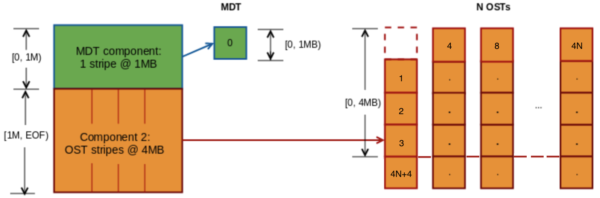

Introduced in Lustre 2.11 

# Data on MDT (DoM)

- [Data on MDT (DoM)](#data-on-mdt-dom)
  * [Introduction to Data on MDT (DoM)](#introduction-to-data-on-mdt-dom)
  * [User Commands](#user-commands)
    + [lfs setstripe for DoM files](#lfs-setstripe-for-dom-files)
      - [Command](#command)
      - [Example](#example)
    + [Setting a default DoM layout to an existing directory](#setting-a-default-dom-layout-to-an-existing-directory)
      - [Command](#command-1)
      - [Example](#example-1)
    + [DoM Stripe Size Restrictions](#dom-stripe-size-restrictions)
      - [LFS limits for DoM component size](#lfs-limits-for-dom-component-size)
      - [MDT Server Limits](#mdt-server-limits)
    + [lfs getstripe for DoM files](#lfs-getstripe-for-dom-files)
      - [Command](#command-2)
      - [Examples](#examples)
    + [lfs find for DoM files](#lfs-find-for-dom-files)
      - [Command](#command-3)
      - [Examples](#examples-1)
    + [The dom_stripesize parameter](#the-dom_stripesize-parameter)
      - [Get Command](#get-command)
      - [Get Examples](#get-examples)
      - [Temporary Set Command](#temporary-set-command)
      - [Temporary Set Examples](#temporary-set-examples)
      - [Persistent Set Command](#persistent-set-command)
      - [Persistent Set Examples](#persistent-set-examples)
    + [Disable DoM](#disable-dom)


This chapter describes Data on MDT (DoM).

## Introduction to Data on MDT (DoM)

The Lustre Data on MDT (DoM) feature improves small file IO by placing small files directly on the MDT, and also improves large file IO by avoiding the OST being affected by small random IO that can cause device seeking and hurt the streaming IO performance. Therefore, users can expect more consistent performance for both small file IO and mixed IO patterns.

The layout of a DoM file is stored on disk as a composite layout and is a special case of Progressive File Layout (PFL). Please see [*the section called “Progressive File Layout(PFL)”*](#progressive-file-layoutpfl) for more information on PFL. For DoM files, the file layout is composed of the component of the file, which is placed on an MDT, and the rest of components are placed on OSTs, if needed. The first component is placed on the MDT in the MDT object data blocks. This component always has one stripe with size equal to the component size. Such a component with an MDT layout can be only the first component in composite layout. The rest of components are placed over OSTs as usual with a RAID0 layout. The OST components are not instantiated until a client writes or truncates the file beyond the size of the MDT component.

## User Commands

Lustre provides the `lfs setstripe` command for users to create DoM files. Also, as usual, `lfs getstripe` command can be used to list the striping/component information for a given file, while `lfs find` command can be used to search the directory tree rooted at the given directory or file name for the files that match the given DoM component parameters, e.g. layout type.

### lfs setstripe for DoM files

The `lfs setstripe` command is used to create DoM files.

#### Command

```
lfs setstripe --component-end|-E end1 --layout|-L mdt \
        [--component-end|-E end2 [STRIPE_OPTIONS] ...] <filename>
              
```

The command above creates a file with the special composite layout, which defines the first component as an MDT component. The MDT component must start from offset 0 and ends at *end1*. The *end1* is also the stripe size of this component, and is limited by the `lod.*.dom_stripesize` of the MDT the file is created on. No other options are required for this component. The rest of the components use the normal syntax for composite files creation.

**Note**

If the next component doesn't specify striping, such as:

```
lfs setstripe -E 1M -L mdt -E EOF <filename>
```

Then that component get its settings from the default filesystem striping.

#### Example

The command below creates a file with a DoM layout. The first component has an `mdt` layout and is placed on the MDT, covering [0, 1M). The second component covers [1M, EOF) and is striped over all available OSTs.

```
client$ lfs setstripe -E 1M -L mdt -E -1 -S 4M -c -1 \
          /mnt/lustre/domfile
```

The resulting layout is illustrated by [Figure 17, “Resulting file layout”](#figure-17-resulting-file-layout).

##### Figure 17. Resulting file layout

 

The resulting can also be checked with `lfs getstripe` as shown below:

```
client$ lfs getstripe /mnt/lustre/domfile
/mnt/lustre/domfile
  lcm_layout_gen:   2
  lcm_mirror_count: 1
  lcm_entry_count:  2
    lcme_id:             1
    lcme_flags:          init
    lcme_extent.e_start: 0
    lcme_extent.e_end:   1048576
      lmm_stripe_count:  0
      lmm_stripe_size:   1048576
      lmm_pattern:       mdt
      lmm_layout_gen:    0
      lmm_stripe_offset: 0
      lmm_objects:
      
    lcme_id:             2
    lcme_flags:          0
    lcme_extent.e_start: 1048576
    lcme_extent.e_end:   EOF
      lmm_stripe_count:  -1
      lmm_stripe_size:   4194304
      lmm_pattern:       raid0
      lmm_layout_gen:    65535
      lmm_stripe_offset: -1
```

The output above shows that the first component has size 1MB and pattern is 'mdt'. The second component is not instantiated yet, which is seen by `lcme_flags: 0`.

If more than 1MB of data is written to the file, then `lfs getstripe` output is changed accordingly:

```
client$ lfs getstripe /mnt/lustre/domfile
/mnt/lustre/domfile
  lcm_layout_gen:   3
  lcm_mirror_count: 1
  lcm_entry_count:  2
    lcme_id:             1
    lcme_flags:          init
    lcme_extent.e_start: 0
    lcme_extent.e_end:   1048576
      lmm_stripe_count:  0
      lmm_stripe_size:   1048576
      lmm_pattern:       mdt
      lmm_layout_gen:    0
      lmm_stripe_offset: 2
      lmm_objects:
      
    lcme_id:             2
    lcme_flags:          init
    lcme_extent.e_start: 1048576
    lcme_extent.e_end:   EOF
      lmm_stripe_count:  2
      lmm_stripe_size:   4194304
      lmm_pattern:       raid0
      lmm_layout_gen:    0
      lmm_stripe_offset: 0
      lmm_objects:
      - 0: { l_ost_idx: 0, l_fid: [0x100000000:0x2:0x0] }
      - 1: { l_ost_idx: 1, l_fid: [0x100010000:0x2:0x0] }
```

The output above shows that the second component now has objects on OSTs with a 4MB stripe.

### Setting a default DoM layout to an existing directory

A DoM layout can be set on an existing directory as well. When set, all the files created after that will inherit this layout by default.

#### Command

```
lfs setstripe --component-end|-E end1 --layout|-L mdt \
[--component-end|-E end2 [STRIPE_OPTIONS] ...] <dirname>
```

#### Example

```
client$ mkdir /mnt/lustre/domdir
client$ touch /mnt/lustre/domdir/normfile
client$ lfs setstripe -E 1M -L mdt -E -1 /mnt/lustre/domdir/
client$ lfs getstripe -d /mnt/lustre/domdir
  lcm_layout_gen:   0
  lcm_mirror_count: 1
  lcm_entry_count:  2
    lcme_id:             N/A
    lcme_flags:          0
    lcme_extent.e_start: 0
    lcme_extent.e_end:   1048576
      stripe_count:  0    stripe_size:   1048576    \
      pattern:  mdt    stripe_offset:  -1
    
    lcme_id:             N/A
    lcme_flags:          0
    lcme_extent.e_start: 1048576
    lcme_extent.e_end:   EOF
      stripe_count:  1    stripe_size:   1048576    \
      pattern:  raid0    stripe_offset:  -1
              
```

In the output above, it can be seen that the directory has a default layout with a DoM component.

The following example will check layouts of files in that directory:

```
client$ touch /mnt/lustre/domdir/domfile
client$ lfs getstripe /mnt/lustre/domdir/normfile
/mnt/lustre/domdir/normfile
lmm_stripe_count:  2
lmm_stripe_size:   1048576
lmm_pattern:       raid0
lmm_layout_gen:    0
lmm_stripe_offset: 1
  obdidx   objid   objid   group
       1              3           0x3              0
       0              3           0x3              0

client$ lfs getstripe /mnt/lustre/domdir/domfile
/mnt/lustre/domdir/domfile
  lcm_layout_gen:   2
  lcm_mirror_count: 1
  lcm_entry_count:  2
    lcme_id:             1
    lcme_flags:          init
    lcme_extent.e_start: 0
    lcme_extent.e_end:   1048576
      lmm_stripe_count:  0
      lmm_stripe_size:   1048576
      lmm_pattern:       mdt
      lmm_layout_gen:    0
      lmm_stripe_offset: 2
      lmm_objects:
      
    lcme_id:             2
    lcme_flags:          0
    lcme_extent.e_start: 1048576
    lcme_extent.e_end:   EOF
      lmm_stripe_count:  1
      lmm_stripe_size:   1048576
      lmm_pattern:       raid0
      lmm_layout_gen:    65535
      lmm_stripe_offset: -1
```

We can see that first file **normfile** in that directory has an ordinary layout, whereas the file **domfile** inherits the directory default layout and is a DoM file.

**Note**

The directory default layout setting will be inherited by new files even if the server DoM size limit will be set to a lower value.

### DoM Stripe Size Restrictions

The maximum size of a DoM component is restricted in several ways to protect the MDT from being eventually filled with large files.

#### LFS limits for DoM component size

`lfs setstripe` allows for setting the component size for MDT layouts up to 1GB (this is a compile-time limit to avoid improper configuration), however, the size must also be aligned by 64KB due to the minimum stripe size in Lustre (see [Table 4, “File and file system limits”](02.02-Determining%20Hardware%20Configuration%20Requirements%20and%20Formatting%20Options.md#table-4-file-and-file-system-limits) `Minimum stripe size`). There is also a limit imposed on each file by `lfs setstripe -E end` that may be smaller than the MDT-imposed limit if this is better for a particular usage.

#### MDT Server Limits

The `lod.$fsname-MDTxxxx.dom_stripesize` is used to control the per-MDT maximum size for a DoM component. Larger DoM components specified by the user will be truncated to the MDT-specified limit, and as such may be different on each MDT to balance DoM space usage on each MDT separately, if needed. It is 1MB by default and can be changed with the `lctl` tool. For more information on setting `dom_stripesize` please see [*the section called “ The dom_stripesize parameter”*](#the-dom_stripesize-parameter).

### lfs getstripe for DoM files

The `lfs getstripe` command is used to list the striping/component information for a given file. For DoM files, it can be used to check its layout and size.

#### Command

```
lfs getstripe [--component-id|-I [comp_id]] [--layout|-L] \
              [--stripe-size|-S] <dirname|filename>
```

#### Examples

```
client$ lfs getstripe -I1 /mnt/lustre/domfile
/mnt/lustre/domfile
  lcm_layout_gen:   3
  lcm_mirror_count: 1
  lcm_entry_count:  2
    lcme_id:             1
    lcme_flags:          init
    lcme_extent.e_start: 0
    lcme_extent.e_end:   1048576
      lmm_stripe_count:  0
      lmm_stripe_size:   1048576
      lmm_pattern:       mdt
      lmm_layout_gen:    0
      lmm_stripe_offset: 2
      lmm_objects:
```

Short info about the layout and size of DoM component can be obtained with the use of the `-L` option along with `-S` or `-E` options:

```
client$ lfs getstripe -I1 -L -S /mnt/lustre/domfile
      lmm_stripe_size:   1048576
      lmm_pattern:       mdt
client$ lfs getstripe -I1 -L -E /mnt/lustre/domfile
    lcme_extent.e_end:   1048576
      lmm_pattern:       mdt
```

Both commands return layout type and its size. The stripe size is equal to the extent size of component in case of DoM files, so both can be used to get size on the MDT.

### lfs find for DoM files

The `lfs find` command can be used to search the directory tree rooted at the given directory or file name for the files that match the given parameters. The command below shows the new parameters for DoM files and their usages are similar to the `lfs getstripe` command.

#### Command

```
lfs find <directory|filename> [--layout|-L] [...]
```

#### Examples

Find all files with DoM layout under directory `/mnt/lustre`:

```
client$ lfs find -L mdt /mnt/lustre
/mnt/lustre/domfile
/mnt/lustre/domdir
/mnt/lustre/domdir/domfile
                          
client$ lfs find -L mdt -type f /mnt/lustre
/mnt/lustre/domfile
/mnt/lustre/domdir/domfile
                          
client$ lfs find -L mdt -type d /mnt/lustre
/mnt/lustre/domdir
```

By using this command you can find all DoM objects, only DoM files, or only directories with default DoM layout.

Find the DoM files/dirs with a particular stripe size:

```
client$ lfs find -L mdt -S -1200K -type f /mnt/lustre
/mnt/lustre/domfile
/mnt/lustre/domdir/domfile
                          
client$ lfs find -L mdt -S +200K -type f /mnt/lustre
/mnt/lustre/domfile
/mnt/lustre/domdir/domfile
```

The first command finds all DoM files with stripe size less than 1200KB. The second command above does the same for files with a stripe size greater than 200KB. In both cases, all DoM files are found because their DoM size is 1MB.

### The dom_stripesize parameter

The MDT controls the default maximum DoM size on the server via the parameter `dom_stripesize` in the LOD device. The `dom_stripesize` can be set differently for each MDT, if necessary. The default value of the parameter is 1MB and can be changed with `lctl` tool.

#### Get Command

```
lctl get_param lod.*MDT<index>*.dom_stripesize
```

#### Get Examples

The commands below get the maximum allowed DoM size on the server. The final command is an attempt to create a file with a larger size than the parameter setting and correctly fails.

```
mds# lctl get_param lod.*MDT0000*.dom_stripesize
lod.lustre-MDT0000-mdtlov.dom_stripesize=1048576

mds# lctl get_param -n lod.*MDT0000*.dom_stripesize
1048576

client$ lfs setstripe -E 2M -L mdt /mnt/lustre/dom2mb
Create composite file /mnt/lustre/dom2mb failed. Invalid argument
error: setstripe: create composite file '/mnt/lustre/dom2mb' failed:
Invalid argument
```

#### Temporary Set Command

To temporarily set the value of the parameter, the `lctl set_param` is used:

```
lctl set_param lod.*MDT<index>*.dom_stripesize=<value>
              
```

#### Temporary Set Examples

The example below shows a change to the default DoM limit on the server to 64KB and try to create a file with 1MB DoM size after that.

```
mds# lctl set_param -n lod.*MDT0000*.dom_stripesize=64K
mds# lctl get_param -n lod.*MDT0000*.dom_stripesize
65536

client$ lfs setstripe -E 1M -L mdt /mnt/lustre/dom
Create composite file /mnt/lustre/dom failed. Invalid argument
error: setstripe: create composite file '/mnt/lustre/dom' failed:
Invalid argument
```

#### Persistent Set Command

To persistently set the value of the parameter, the `lctl conf_param` command is used:

```
lctl conf_param <fsname>-MDT<index>.lod.dom_stripesize=<value>
```

#### Persistent Set Examples

The new value of the parameter is saved in config log permanently:

```
mgs# lctl conf_param lustre-MDT0000.lod.dom_stripesize=512K
mds# lctl get_param -n lod.*MDT0000*.dom_stripesize
524288
```

New settings are applied in few seconds and saved persistently in server config.

### Disable DoM

When `lctl set_param` or `lctl conf_param` sets `dom_stripesize` to `0`, DoM component creation will be disabled on the selected server, and any *new* layouts with a specified DoM component will have that component removed from the file layout. Existing files and layouts with DoM components on that MDT are not changed.

**Note**

DoM files can still be created in existing directories with a default DoM layout.
