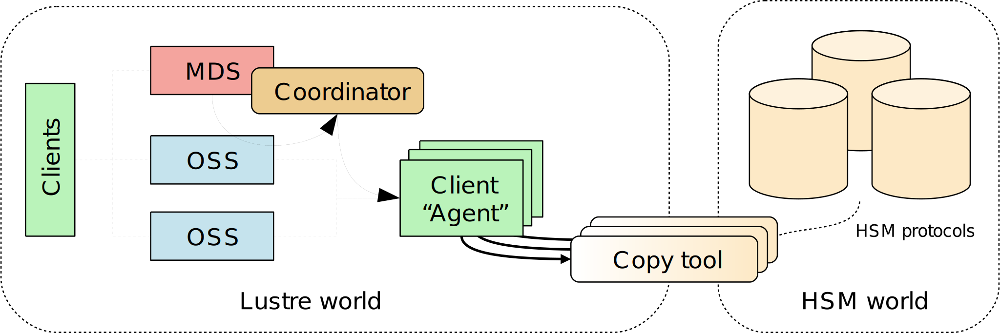

Introduced in Lustre 2.5

# Hierarchical Storage Management (HSM)

- [Hierarchical Storage Management (HSM)](#hierarchical-storage-management-hsm)
  * [Introduction](#introduction)
  * [Setup](#setup)
    + [Requirements](#requirements)
    + [Coordinator](#coordinator)
    + [Agents](#agents)
  * [Agents and copytool](#agents-and-copytool)
    + [Archive ID, multiple backends](#archive-id-multiple-backends)
    + [Registered agents](#registered-agents)
    + [Timeout](#timeout)
  * [Requests](#requests)
    + [Commands](#commands)
    + [Automatic restore](#automatic-restore)
    + [Request monitoring](#request-monitoring)
  * [File states](#file-states)
  * [Tuning](#tuning)
    + [`hsm_controlpolicy`](#hsm_controlpolicy)
    + [`max_requests`](#max_requests)
    + [`policy`](#policy)
    + [`grace_delay`](#grace_delay)
  * [change logs](#change-logs)
  * [Policy engine](#policy-engine)
    + [Robinhood](#robinhood)

This chapter describes how to bind Lustre to a Hierarchical Storage Management (HSM) solution.

## Introduction

The Lustre file system can bind to a Hierarchical Storage Management (HSM) solution using a specific set of functions. These functions enable connecting a Lustre file system to one or more external storage systems, typically HSMs. With a Lustre file system bound to a HSM solution, the Lustre file system acts as a high speed cache in front of these slower HSM storage systems.

The Lustre file system integration with HSM provides a mechanism for files to simultaneously exist in a HSM solution and have a metadata entry in the Lustre file system that can be examined. Reading, writing or truncating the file will trigger the file data to be fetched from the HSM storage back into the Lustre file system.

The process of copying a file into the HSM storage is known as *archive*. Once the archive is complete, the Lustre file data can be deleted (known as *release*.) The process of returning data from the HSM storage to the Lustre file system is called *restore*. The archive and restore operations require a Lustre file system component called an *Agent*.

An Agent is a specially designed Lustre client node that mounts the Lustre file system in question. On an Agent, a user space program called a copytool is run to coordinate the archive and restore of files between the Lustre file system and the HSM solution.

Requests to restore a given file are registered and dispatched by a facet on the MDT called the Coordinator.

##### Figure 19. Overview of the Lustre file system HSM



## Setup

### Requirements

To setup a Lustre/HSM configuration you need:

- a standard Lustre file system (version 2.5.0 and above)
- a minimum of 2 clients, 1 used for your chosen computation task that generates useful data, and 1 used as an agent.

Multiple agents can be employed. All the agents need to share access to their backend storage. For the POSIX copytool, a POSIX namespace like NFS or another Lustre file system is suitable.

### Coordinator

To bind a Lustre file system to a HSM system a coordinator must be activated on each of your filesystem MDTs. This can be achieved with the command:

```
$ lctl set_param mdt.$FSNAME-MDT0000.hsm_control=enabled
mdt.lustre-MDT0000.hsm_control=enabled
```

To verify that the coordinator is running correctly

```
$ lctl get_param mdt.$FSNAME-MDT0000.hsm_control
mdt.lustre-MDT0000.hsm_control=enabled
```

### Agents

Once a coordinator is started, launch the copytool on each agent node to connect to your HSM storage. If your HSM storage has POSIX access this command will be of the form:

```
lhsmtool_posix --daemon --hsm-root $HSMPATH --archive=1 $LUSTREPATH
```

The POSIX copytool must be stopped by sending it a TERM signal.

## Agents and copytool

Agents are Lustre file system clients running copytool. copytool is a userspace daemon that transfers data between Lustre and a HSM solution. Because different HSM solutions use different APIs, copytools can typically only work with a specific HSM. Only one copytool can be run by an agent node.

The following rule applies regarding copytool instances: a Lustre file system only supports a single copytool process, per ARCHIVE ID (see below), per client node. Due to a Lustre software limitation, this constraint is irrespective of the number of Lustre file systems mounted by the Agent.

Bundled with Lustre tools, the POSIX copytool can work with any HSM or external storage that exports a POSIX API.

### Archive ID, multiple backends

A Lustre file system can be bound to several different HSM solutions. Each bound HSM solution is identified by a number referred to as ARCHIVE ID. A unique value of ARCHIVE ID must be chosen for each bound HSM solution. ARCHIVE ID must be in the range 1 to 32.

A Lustre file system supports an unlimited number of copytool instances. You need, at least, one copytool per ARCHIVE ID. When using the POSIX copytool, this ID is defined using `--archive` switch.

For example: if a single Lustre file system is bound to 2 different HSMs (A and B,) ARCHIVE ID “1” can be chosen for HSM A and ARCHIVE ID “2” for HSM B. If you start 3 copytool instances for ARCHIVE ID 1, all of them will use Archive ID “1”. The same rule applies for copytool instances dealing with the HSM B, using Archive ID “2”.

When issuing HSM requests, you can use the `--archive` switch to choose the backend you want to use. In this example, file `foo` will be archived into backend ARCHIVE ID “5”:

```
$ lfs hsm_archive --archive=5 /mnt/lustre/foo
```

A default ARCHIVE ID can be defined which will be used when the `--archive` switch is not specified:

```
$ lctl set_param -P mdt.lustre-MDT0000.hsm.default_archive_id=5
```

The ARCHIVE ID of archived files can be checked using `lfs hsm_state` command:

```
$ lfs hsm_state /mnt/lustre/foo
/mnt/lustre/foo: (0x00000009) exists archived, archive_id:5
```

### Registered agents

A Lustre file system allocates a unique UUID per client mount point, for each filesystem. Only one copytool can be registered for each Lustre mount point. As a consequence, the UUID uniquely identifies a copytool, per filesystem.

The currently registered copytool instances (agents UUID) can be retrieved by running the following command, per MDT, on MDS nodes:

```
$ lctl get_param -n mdt.$FSNAME-MDT0000.hsm.agents
uuid=a19b2416-0930-fc1f-8c58-c985ba5127ad archive_id=1 requests=[current:0 ok:0 errors:0]
```

The returned fields have the following meaning:

- `uuid` the client mount used by the corresponding copytool.
- `archive_id` comma-separated list of ARCHIVE IDs accessible by this copytool.
- `requests` various statistics on the number of requests processed by this copytool.

### Timeout

One or more copytool instances may experience conditions that cause them to become unresponsive. To avoid blocking access to the related files a timeout value is defined for request processing. A copytool must be able to fully complete a request within this time. The default is 3600 seconds.

```
$ lctl set_param -n mdt.lustre-MDT0000.hsm.active_request_timeout
```

## Requests

Data management between a Lustre file system and HSM solutions is driven by requests. There are five types:

- `ARCHIVE` Copy data from a Lustre file system file into the HSM solution.
- `RELEASE` Remove file data from the Lustre file system.
- `RESTORE` Copy back data from the HSM solution into the corresponding Lustre file system file.
- `REMOVE` Delete the copy of the data from the HSM solution.
- `CANCEL` Cancel an in-progress or pending request.

Only the `RELEASE` is performed synchronously and does not involve the coordinator. Other requests are handled by Coordinators. Each MDT coordinator is resiliently managing them.

### Commands

Requests are submitted using `lfs` command:

```
$ lfs hsm_archive [--archive=ID] FILE1 [FILE2...]
$ lfs hsm_release FILE1 [FILE2...]
$ lfs hsm_restore FILE1 [FILE2...]
$ lfs hsm_remove  FILE1 [FILE2...]
```

Requests are sent to the default ARCHIVE ID unless an ARCHIVE ID is specified with the `--archive` option (See *the section called “ Archive ID, multiple backends ”*).

### Automatic restore

Released files are automatically restored when a process tries to read or modify them. The corresponding I/O will block waiting for the file to be restored. This is transparent to the process. For example, the following command automatically restores the file if released.

```
$ cat /mnt/lustre/released_file
```

### Request monitoring

The list of registered requests and their status can be monitored, per MDT, with the following command:

```
$ lctl get_param -n mdt.lustre-MDT0000.hsm.actions
```

The list of requests currently being processed by a copytool is available with:

```
$ lctl get_param -n mdt.lustre-MDT0000.hsm.active_requests
```

## File states

When files are archived or released, their state in the Lustre file system changes. This state can be read using the following `lfs` command:

```
$ lfs hsm_state FILE1 [FILE2...]
```

There is also a list of specific policy flags which could be set to have a per-file specific policy:

- `NOARCHIVE` This file will never be archived.
- `NORELEASE` This file will never be released. This value cannot be set if the flag is currently set to `RELEASED`
- `DIRTY` This file has been modified since a copy of it was made in the HSM solution. `DIRTY` files should be archived again. The `DIRTY` flag can only be set if `EXIST` is set.

The following options can only be set by the root user.

- `LOST` This file was previously archived but the copy was lost on the HSM solution for some reason in the backend (for example, by a corrupted tape), and could not be restored. If the file is not in the `RELEASE` state it needs to be archived again. If the file is in the `RELEASE` state, the file data is lost.

Some flags can be manually set or cleared using the following commands:

```
$ lfs hsm_set [FLAGS] FILE1 [FILE2...]
$ lfs hsm_clear [FLAGS] FILE1 [FILE2...]
```

## Tuning

### `hsm_controlpolicy`

`hsm_control` controls coordinator activity and can also purge the action list.

```
$ lctl set_param mdt.$FSNAME-MDT0000.hsm_control=purge
```

Possible values are:

- `enabled` Start coordinator thread. Requests are dispatched on available copytool instances.
- `disabled` Pause coordinator activity. No new request will be scheduled. No timeout will be handled. New requests will be registered but will be handled only when the coordinator is enabled again.
- `shutdown` Stop coordinator thread. No request can be submitted.
- `purge` Clear all recorded requests. Do not change coordinator state.

### `max_requests`

`max_requests` is the maximum number of active requests at the same time. This is a per coordinator value, and independent of the number of agents.

For example, if 2 MDT and 4 agents are present, the agents will never have to handle more than 2 x `max_requests`.

```
$ lctl set_param mdt.$FSNAME-MDT0000.hsm.max_requests=10
```

### `policy`

Change system behavior. Values can be added or removed by prefixing them with '+' or '-'.

```
$ lctl set_param mdt.$FSNAME-MDT0000.hsm.policy=+NRA
```

Possible values are a combination of:

- `NRA` No Retry Action. If a restore fails, do not reschedule it automatically.
- `NBR` Non Blocking Restore. No automatic restore is triggered. Access to a released file returns `ENODATA`.

### `grace_delay`

`grace_delay` is the delay, expressed in seconds, before a successful or failed request is cleared from the whole request list.

```
$ lctl set_param mdt.$FSNAME-MDT0000.hsm.grace_delay=10
```

## change logs

A changelog record type “HSM“ was added for Lustre file system logs that relate to HSM events.

```
16HSM   13:49:47.469433938 2013.10.01 0x280 t=[0x200000400:0x1:0x0]
```

Two items of information are available for each HSM record: the FID of the modified file and a bit mask. The bit mask codes the following information (lowest bits first):

- Error code, if any (7 bits)
- HSM event (3 bits)
  - `HE_ARCHIVE = 0` File has been archived.
  - `HE_RESTORE = 1` File has been restored.
  - `HE_CANCEL = 2` A request for this file has been canceled.
  - `HE_RELEASE = 3` File has been released.
  - `HE_REMOVE = 4` A remove request has been executed automatically.
  - `HE_STATE = 5` File flags have changed.
- HSM flags (3 bits)
  - `CLF_HSM_DIRTY=0x1`

In the above example, `0x280` means the error code is 0 and the event is HE_STATE.

When using `liblustreapi`, there is a list of helper functions to easily extract the different values from this bitmask, like: `hsm_get_cl_event()`, `hsm_get_cl_flags()`, and `hsm_get_cl_error()`

## Policy engine

A Lustre file system does not have an internal component responsible for automatically scheduling archive requests and release requests under any conditions (like low space). Automatically scheduling archive operations is the role of the policy engine.

It is recommended that the Policy Engine run on a dedicated client, similar to an agent node, with a Lustre version 2.5+.

A policy engine is a userspace program using the Lustre file system HSM specific API to monitor the file system and schedule requests.

Robinhood is the recommended policy engine.

### Robinhood

Robinhood is a Policy engine and reporting tool for large file systems. It maintains a replicate of file system metadata in a database that can be queried at will. Robinhood makes it possible to schedule mass action on file system entries by defining attribute-based policies, provides fast `find` and `du` enhanced clones, and provides administrators with an overall view of file system content through a web interface and command line tools.

Robinhood can be used for various configurations. Robinhood is an external project, and further information can be found on the project website: <https://sourceforge.net/apps/trac/robinhood/wiki/Doc>.
