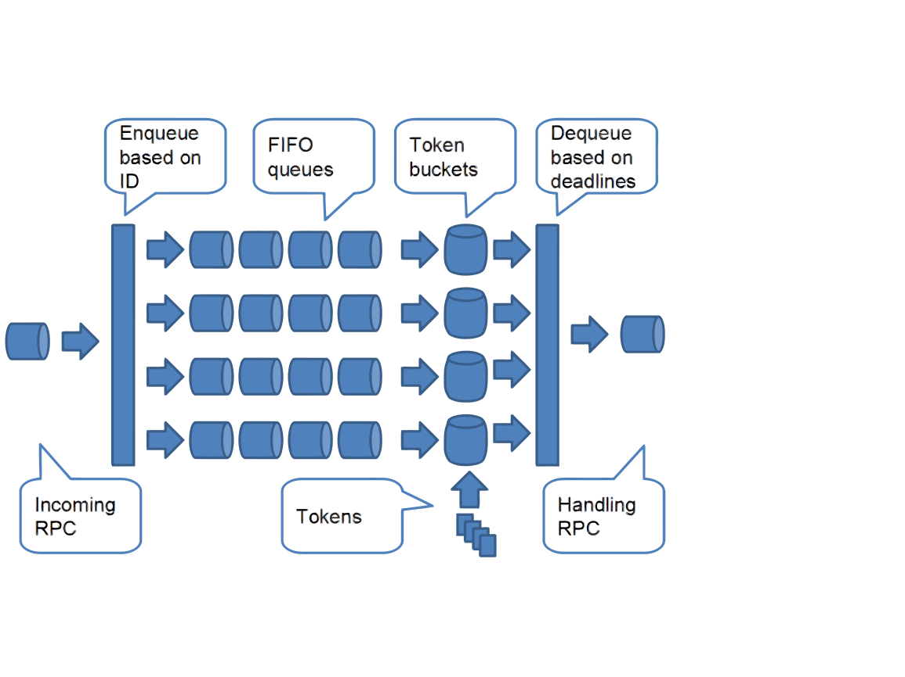

# Tuning a Lustre File System

- [Tuning a Lustre File System](#tuning-a-lustre-file-system)
  * [Optimizing the Number of Service Threads](#optimizing-the-number-of-service-threads)
    + [Specifying the OSS Service Thread Count](#specifying-the-oss-service-thread-count)
    + [Specifying the MDS Service Thread Count](#specifying-the-mds-service-thread-count)
  * [Binding MDS Service Thread to CPU Partitions](#binding-mds-service-thread-to-cpu-partitions)
  * [Tuning LNet Parameters](#tuning-lnet-parameters)
    + [Transmit and Receive Buffer Size](#transmit-and-receive-buffer-size)
    + [Hardware Interrupts ( `enable_irq_affinity`)](#hardware-interrupts--enable_irq_affinity)
    + [Binding Network Interface Against CPU Partitions](#binding-network-interface-against-cpu-partitions)
    + [Network Interface Credits](#network-interface-credits)
    + [Router Buffers](#router-buffers)
    + [Portal Round-Robin](#portal-round-robin)
    + [LNet Peer Health](#lnet-peer-health)
  * [libcfs Tuning](#libcfs-tuning)
    + [CPU Partition String Patterns](#cpu-partition-string-patterns)
  * [LND Tuning](#lnd-tuning)
    + [ko2iblnd Tuning](#ko2iblnd-tuning)
  * [Network Request Scheduler (NRS) Tuning](#network-request-scheduler-nrs-tuning)L 2.4
    + [First In, First Out (FIFO) policy](#first-in-first-out-fifo-policy)
    + [Client Round-Robin over NIDs (CRR-N) policy](#client-round-robin-over-nids-crr-n-policy)
    + [Object-based Round-Robin (ORR) policy](#object-based-round-robin-orr-policy)
    + [Target-based Round-Robin (TRR) policy](#target-based-round-robin-trr-policy)
    + [Token Bucket Filter (TBF) policy](#token-bucket-filter-tbf-policy)L 2.6
      - [Enable TBF policy](#enable-tbf-policy)
      - [Start a TBF rule](#start-a-tbf-rule)
      - [Change a TBF rule](#change-a-tbf-rule)
      - [Stop a TBF rule](#stop-a-tbf-rule)
      - [Rule options](#rule-options)
    + [Delay policy](#delay-policy)L 2.10
  * [Lockless I/O Tunables](#lockless-io-tunables)
  * [Server-Side Advice and Hinting](#server-side-advice-and-hinting)L 2.9
    + [Overview](#overview)
    + [Examples](#examples)
  * [Large Bulk IO (16MB RPC)](#large-bulk-io-16mb-rpc)
    + [Overview](#overview-1)
    + [Usage](#usage)
  * [Improving Lustre I/O Performance for Small Files](#improving-lustre-io-performance-for-small-files)
  * [Understanding Why Write Performance is Better Than Read Performance](#understanding-why-write-performance-is-better-than-read-performance)


This chapter contains information about tuning a Lustre file system for better performance.

**Note**
Many options in the Lustre software are set by means of kernel module parameters. These parameters are contained in the /etc/modprobe.d/lustre.conf file.

## Optimizing the Number of Service Threads

An OSS can have a minimum of two service threads and a maximum of 512 service threads. The number of service threads is a function of how much RAM and how many CPUs are on each OSS node (1 thread / 128MB * num_cpus). If the load on the OSS node is high, new service threads will be started in order to process more requests concurrently, up to 4x the initial number of threads (subject to the maximum of 512). For a 2GB 2-CPU system, the default thread count is 32 and the maximum thread count is 128.

Increasing the size of the thread pool may help when:

- Several OSTs are exported from a single OSS
- Back-end storage is running synchronously
- I/O completions take excessive time due to slow storage

Decreasing the size of the thread pool may help if:

- Clients are overwhelming the storage capacity
- There are lots of "slow I/O" or similar messages

Increasing the number of I/O threads allows the kernel and storage to aggregate many writes together for more efficient disk I/O. The OSS thread pool is shared--each thread allocates approximately 1.5 MB (maximum RPC size + 0.5 MB) for internal I/O buffers.

It is very important to consider memory consumption when increasing the thread pool size. Drives are only able to sustain a certain amount of parallel I/O activity before performance is degraded, due to the high number of seeks and the OST threads just waiting for I/O. In this situation, it may be advisable to decrease the load by decreasing the number of OST threads.

Determining the optimum number of OSS threads is a process of trial and error, and varies for each particular configuration. Variables include the number of OSTs on each OSS, number and speed of disks, RAID configuration, and available RAM. You may want to start with a number of OST threads equal to the number of actual disk spindles on the node. If you use RAID, subtract any dead spindles not used for actual data (e.g., 1 of N of spindles for RAID5, 2 of N spindles for RAID6), and monitor the performance of clients during usual workloads. If performance is degraded, increase the thread count and see how that works until performance is degraded again or you reach satisfactory performance.

**Note**

If there are too many threads, the latency for individual I/O requests can become very high and should be avoided. Set the desired maximum thread count permanently using the method described above.

### Specifying the OSS Service Thread Count

The `oss_num_threads` parameter enables the number of OST service threads to be specified at module load time on the OSS nodes:

```
options ost oss_num_threads={N}
```

After startup, the minimum and maximum number of OSS thread counts can be set via the`{service}.thread_{min,max,started}` tunable. To change the tunable at runtime, run:

```
lctl {get,set}_param {service}.thread_{min,max,started}
```

This works in a similar fashion to binding of threads on MDS. MDS thread tuning is covered in [*the section called “ Binding MDS Service Thread to CPU Partitions”*](#binding-mds-service-thread-to-cpu-partitions).

- `oss_cpts=[EXPRESSION]` binds the default OSS service on CPTs defined by `[EXPRESSION]`.
- `oss_io_cpts=[EXPRESSION]` binds the IO OSS service on CPTs defined by `[EXPRESSION]`.

For further details, see [*the section called “Setting MDS and OSS Thread Counts”*](06.02-Lustre%20Parameters.md#setting-mds-and-oss-thread-counts).

### Specifying the MDS Service Thread Count

The `mds_num_threads` parameter enables the number of MDS service threads to be specified at module load time on the MDS node:

```
options mds mds_num_threads={N}
```

After startup, the minimum and maximum number of MDS thread counts can be set via the`{service}.thread_{min,max,started}` tunable. To change the tunable at runtime, run:

```
lctl {get,set}_param {service}.thread_{min,max,started}
```

For details, see [*the section called “Setting MDS and OSS Thread Counts”*](06.02-Lustre%20Parameters.md#setting-mds-and-oss-thread-counts).

The number of MDS service threads started depends on system size and the load on the server, and has a default maximum of 64. The maximum potential number of threads (`MDS_MAX_THREADS`) is 1024.

**Note**

The OSS and MDS start two threads per service per CPT at mount time, and dynamically increase the number of running service threads in response to server load. Setting the `*_num_threads` module parameter starts the specified number of threads for that service immediately and disables automatic thread creation behavior.

Parameters are available to provide administrators control over the number of service threads.

- `mds_rdpg_num_threads` controls the number of threads in providing the read page service. The read page service handles file close and readdir operations.
- `mds_attr_num_threads` controls the number of threads in providing the setattr service to clients running Lustre software release 1.8.

## Binding MDS Service Thread to CPU Partitions

With the Node Affinity ([*Node affinity*](07-Glossary.md#n)) feature, MDS threads can be bound to particular CPU partitions (CPTs) to improve CPU cache usage and memory locality. Default values for CPT counts and CPU core bindings are selected automatically to provide good overall performance for a given CPU count. However, an administrator can deviate from these setting if they choose. For details on specifying the mapping of CPU cores to CPTs see [*the section called “ libcfs Tuning”*](#libcfs-tuning).

- `mds_num_cpts=[EXPRESSION]` binds the default MDS service threads to CPTs defined by `EXPRESSION`. For example `mds_num_cpts=[0-3]` will bind the MDS service threads to `CPT[0,1,2,3]`.
- `mds_rdpg_num_cpts=[EXPRESSION]` binds the read page service threads to CPTs defined by `EXPRESSION`. The read page service handles file close and readdir requests. For example `mds_rdpg_num_cpts=[4]` will bind the read page threads to `CPT4`.
- `mds_attr_num_cpts=[EXPRESSION]` binds the setattr service threads to CPTs defined by `EXPRESSION`.

Parameters must be set before module load in the file `/etc/modprobe.d/lustre.conf`. For example:

**Example 1. lustre.conf**

```
options lnet networks=tcp0(eth0)
options mdt mds_num_cpts=[0]
```
## Tuning LNet Parameters

This section describes LNet tunables, the use of which may be necessary on some systems to improve performance. To test the performance of your Lustre network, see [*Testing Lustre Network Performance (LNet Self-Test)*](04.01-Testing%20Lustre%20Network%20Performance%20(LNet%20Self-Test).md).

### Transmit and Receive Buffer Size

The kernel allocates buffers for sending and receiving messages on a network.

`ksocklnd` has separate parameters for the transmit and receive buffers.

```
options ksocklnd tx_buffer_size=0 rx_buffer_size=0
```

If these parameters are left at the default value (0), the system automatically tunes the transmit and receive buffer size. In almost every case, this default produces the best performance. Do not attempt to tune these parameters unless you are a network expert.

### Hardware Interrupts ( `enable_irq_affinity`)

The hardware interrupts that are generated by network adapters may be handled by any CPU in the system. In some cases, we would like network traffic to remain local to a single CPU to help keep the processor cache warm and minimize the impact of context switches. This is helpful when an SMP system has more than one network interface and ideal when the number of interfaces equals the number of CPUs. To enable the `enable_irq_affinity`parameter, enter:

```
options ksocklnd enable_irq_affinity=1
```

In other cases, if you have an SMP platform with a single fast interface such as 10 Gb Ethernet and more than two CPUs, you may see performance improve by turning this parameter off.

```
options ksocklnd enable_irq_affinity=0
```

By default, this parameter is off. As always, you should test the performance to compare the impact of changing this parameter.

### Binding Network Interface Against CPU Partitions

Lustre allows enhanced network interface control. This means that an administrator can bind an interface to one or more CPU partitions. Bindings are specified as options to the LNet modules. For more information on specifying module options, see [*the section called “ Introduction”*](06.06-Configuration%20Files%20and%20Module%20Parameters.md#introduction).

For example, `o2ib0(ib0)[0,1]` will ensure that all messages for `o2ib0` will be handled by LND threads executing on`CPT0` and `CPT1`. An additional example might be: `tcp1(eth0)[0]`. Messages for `tcp1` are handled by threads on`CPT0`.

### Network Interface Credits

Network interface (NI) credits are shared across all CPU partitions (CPT). For example, if a machine has four CPTs and the number of NI credits is 512, then each partition has 128 credits. If a large number of CPTs exist on the system, LNet checks and validates the NI credits for each CPT to ensure each CPT has a workable number of credits. For example, if a machine has 16 CPTs and the number of NI credits is 256, then each partition only has 16 credits. 16 NI credits is low and could negatively impact performance. As a result, LNet automatically adjusts the credits to 8* `peer_credits`( `peer_credits` is 8 by default), so each partition has 64 credits.

Increasing the number of `credits`/ `peer_credits` can improve the performance of high latency networks (at the cost of consuming more memory) by enabling LNet to send more inflight messages to a specific network/peer and keep the pipeline saturated.

An administrator can modify the NI credit count using `ksoclnd` or `ko2iblnd`. In the example below, 256 credits are applied to TCP connections.

```
ksocklnd credits=256
```

Applying 256 credits to IB connections can be achieved with:

```
ko2iblnd credits=256
```

**Note**

LNet may revalidate the NI credits, so the administrator's request may not persist.

### Router Buffers

When a node is set up as an LNet router, three pools of buffers are allocated: tiny, small and large. These pools are allocated per CPU partition and are used to buffer messages that arrive at the router to be forwarded to the next hop. The three different buffer sizes accommodate different size messages.

If a message arrives that can fit in a tiny buffer then a tiny buffer is used, if a message doesn’t fit in a tiny buffer, but fits in a small buffer, then a small buffer is used. Finally if a message does not fit in either a tiny buffer or a small buffer, a large buffer is used.

Router buffers are shared by all CPU partitions. For a machine with a large number of CPTs, the router buffer number may need to be specified manually for best performance. A low number of router buffers risks starving the CPU partitions of resources.

- `tiny_router_buffers`: Zero payload buffers used for signals and acknowledgements.
- `small_router_buffers`: 4 KB payload buffers for small messages
- `large_router_buffers`: 1 MB maximum payload buffers, corresponding to the recommended RPC size of 1 MB.

The default setting for router buffers typically results in acceptable performance. LNet automatically sets a default value to reduce the likelihood of resource starvation. The size of a router buffer can be modified as shown in the example below. In this example, the size of the large buffer is modified using the `large_router_buffers`parameter.

```
lnet large_router_buffers=8192
```

**Note**

LNet may revalidate the router buffer setting, so the administrator's request may not persist.

### Portal Round-Robin

Portal round-robin defines the policy LNet applies to deliver events and messages to the upper layers. The upper layers are PLRPC service or LNet selftest.

If portal round-robin is disabled, LNet will deliver messages to CPTs based on a hash of the source NID. Hence, all messages from a specific peer will be handled by the same CPT. This can reduce data traffic between CPUs. However, for some workloads, this behavior may result in poorly balancing loads across the CPU.

If portal round-robin is enabled, LNet will round-robin incoming events across all CPTs. This may balance load better across the CPU but can incur a cross CPU overhead.

The current policy can be changed by an administrator with `echo *value*> /proc/sys/lnet/portal_rotor`. There are four options for `*value* `:

- `OFF`

  Disable portal round-robin on all incoming requests.

- `ON`

  Enable portal round-robin on all incoming requests.

- `RR_RT`

  Enable portal round-robin only for routed messages.

- `HASH_RT`

  Routed messages will be delivered to the upper layer by hash of source NID (instead of NID of router.) This is the default value.

### LNet Peer Health

Two options are available to help determine peer health:

- `peer_timeout`- The timeout (in seconds) before an aliveness query is sent to a peer. For example, if`peer_timeout` is set to `180sec`, an aliveness query is sent to the peer every 180 seconds. This feature only takes effect if the node is configured as an LNet router.

  In a routed environment, the `peer_timeout` feature should always be on (set to a value in seconds) on routers. If the router checker has been enabled, the feature should be turned off by setting it to 0 on clients and servers.

  For a non-routed scenario, enabling the `peer_timeout` option provides health information such as whether a peer is alive or not. For example, a client is able to determine if an MGS or OST is up when it sends it a message. If a response is received, the peer is alive; otherwise a timeout occurs when the request is made.

  In general, `peer_timeout` should be set to no less than the LND timeout setting. For more information about LND timeouts, see [*the section called “Setting Static Timeouts”*](06.02-Lustre%20Parameters.md#setting-static-timeouts).

  When the `o2iblnd`(IB) driver is used, `peer_timeout` should be at least twice the value of the `ko2iblnd`keepalive option. for more information about keepalive options, see [*the section called “ `SOCKLND` Kernel TCP/IP LND”*](06.06-Configuration%20Files%20and%20Module%20Parameters.md#socklnd-kernel-tcpip-lnd).

- `avoid_asym_router_failure`– When set to 1, the router checker running on the client or a server periodically pings all the routers corresponding to the NIDs identified in the routes parameter setting on the node to determine the status of each router interface. The default setting is 1. (For more information about the LNet routes parameter, see [*the section called “Setting the LNet Module routes Parameter”*](02.06-Configuring%20Lustre%20Networking%20(LNet).md#setting-the-lnet-module-routes-parameter).

  A router is considered down if any of its NIDs are down. For example, router X has three NIDs: `Xnid1`, `Xnid2`, and `Xnid3`. A client is connected to the router via `Xnid1`. The client has router checker enabled. The router checker periodically sends a ping to the router via `Xnid1`. The router responds to the ping with the status of each of its NIDs. In this case, it responds with `Xnid1=up`, `Xnid2=up`, `Xnid3=down`. If`avoid_asym_router_failure==1`, the router is considered down if any of its NIDs are down, so router X is considered down and will not be used for routing messages. If `avoid_asym_router_failure==0`, router X will continue to be used for routing messages.

The following router checker parameters must be set to the maximum value of the corresponding setting for this option on any client or server:

- `dead_router_check_interval`
- `live_router_check_interval`
- `router_ping_timeout`

For example, the `dead_router_check_interval` parameter on any router must be MAX.

## libcfs Tuning

Lustre allows binding service threads via CPU Partition Tables (CPTs). This allows the system administrator to fine-tune on which CPU cores the Lustre service threads are run, for both OSS and MDS services, as well as on the client.

CPTs are useful to reserve some cores on the OSS or MDS nodes for system functions such as system monitoring, HA heartbeat, or similar tasks. On the client it may be useful to restrict Lustre RPC service threads to a small subset of cores so that they do not interfere with computation, or because these cores are directly attached to the network interfaces.

By default, the Lustre software will automatically generate CPU partitions (CPT) based on the number of CPUs in the system. The CPT count can be explicitly set on the libcfs module using `cpu_npartitions=*NUMBER*`. The value of `cpu_npartitions` must be an integer between 1 and the number of online CPUs.

Introduced in Lustre 2.9In Lustre 2.9 and later the default is to use one CPT per NUMA node. In earlier versions of Lustre, by default there was a single CPT if the online CPU core count was four or fewer, and additional CPTs would be created depending on the number of CPU cores, typically with 4-8 cores per CPT.

**Tip**

Setting `cpu_npartitions=1` will disable most of the SMP Node Affinity functionality.

### CPU Partition String Patterns

CPU partitions can be described using string pattern notation. If `cpu_pattern=N` is used, then there will be one CPT for each NUMA node in the system, with each CPT mapping all of the CPU cores for that NUMA node.

It is also possible to explicitly specify the mapping between CPU cores and CPTs, for example:

- `cpu_pattern="0[2,4,6] 1[3,5,7]`

  Create two CPTs, CPT0 contains cores 2, 4, and 6, while CPT1 contains cores 3, 5, 7. CPU cores 0 and 1 will not be used by Lustre service threads, and could be used for node services such as system monitoring, HA heartbeat threads, etc. The binding of non-Lustre services to those CPU cores may be done in userspace using `numactl(8)` or other application-specific methods, but is beyond the scope of this document.

- `cpu_pattern="N 0[0-3] 1[4-7]`

  Create two CPTs, with CPT0 containing all CPUs in NUMA node[0-3], while CPT1 contains all CPUs in NUMA node [4-7].

The current configuration of the CPU partition can be read via `lctl get_parm cpu_partition_table`. For example, a simple 4-core system has a single CPT with all four CPU cores:

```
$ lctl get_param cpu_partition_table
cpu_partition_table=0	: 0 1 2 3
```

while a larger NUMA system with four 12-core CPUs may have four CPTs:

```
$ lctl get_param cpu_partition_table
cpu_partition_table=
0	: 0 1 2 3 4 5 6 7 8 9 10 11
1	: 12 13 14 15 16 17 18 19 20 21 22 23
2	: 24 25 26 27 28 29 30 31 32 33 34 35
3	: 36 37 38 39 40 41 42 43 44 45 46 47
```

## LND Tuning

LND tuning allows the number of threads per CPU partition to be specified. An administrator can set the threads for both `ko2iblnd` and `ksocklnd` using the `nscheds` parameter. This adjusts the number of threads for each partition, not the overall number of threads on the LND.

**Note**

Lustre software release 2.3 has greatly decreased the default number of threads for `ko2iblnd` and`ksocklnd` on high-core count machines. The current default values are automatically set and are chosen to work well across a number of typical scenarios.

### ko2iblnd Tuning

The following table outlines the ko2iblnd module parameters to be used for tuning:

| **Module Parameter**      | **Default Value**                                      | **Description**                                              |
| ------------------------- | ------------------------------------------------------ | ------------------------------------------------------------ |
| `service`                 | `987`                                                  | Service number (within RDMA_PS_TCP).                         |
| `cksum`                   | `0`                                                    | Set non-zero to enable message (not RDMA) checksums.         |
| `timeout`                 | `50`                                                   | Timeout in seconds.                                          |
| `nscheds`                 | `0`                                                    | Number of threads in each scheduler pool (per CPT). Value of zero means we derive the number from the number of cores. |
| `conns_per_peer`          | `4 (OmniPath), 1 (Everything else)`                    | Introduced in 2.10. Number of connections to each peer. Messages are sent round-robin over the connection pool. Provides signifiant improvement with OmniPath. |
| `ntx`                     | `512`                                                  | Number of message descriptors allocated for each pool at startup. Grows at runtime. Shared by all CPTs. |
| `credits`                 | `256`                                                  | Number of concurrent sends on network.                       |
| `peer_credits`            | `8`                                                    | Number of concurrent sends to 1 peer. Related/limited by IB queue size. |
| `peer_credits_hiw`        | `0`                                                    | When eagerly to return credits.                              |
| `peer_buffer_credits`     | `0`                                                    | Number per-peer router buffer credits.                       |
| `peer_timeout`            | `180`                                                  | Seconds without aliveness news to declare peer dead (less than or equal to 0 to disable). |
| `ipif_name`               | `ib0`                                                  | IPoIB interface name.                                        |
| `retry_count`             | `5`                                                    | Retransmissions when no ACK received.                        |
| `rnr_retry_count`         | `6`                                                    | RNR retransmissions.                                         |
| `keepalive`               | `100`                                                  | Idle time in seconds before sending a keepalive.             |
| `ib_mtu`                  | `0`                                                    | IB MTU 256/512/1024/2048/4096.                               |
| `concurrent_sends`        | `0`                                                    | Send work-queue sizing. If zero, derived from `map_on_demand`and `peer_credits`. |
| `map_on_demand`           | `0 (pre-4.8 Linux) 1 (4.8 Linux onward) 32 (OmniPath)` | Number of fragments reserved for connection. If zero, use global memory region (found to be security issue). If non-zero, use FMR or FastReg for memory registration. Value needs to agree between both peers of connection. |
| `fmr_pool_size`           | `512`                                                  | Size of fmr pool on each CPT (>= ntx / 4). Grows at runtime. |
| `fmr_flush_trigger`       | `384`                                                  | Number dirty FMRs that triggers pool flush.                  |
| `fmr_cache`               | `1`                                                    | Non-zero to enable FMR caching.                              |
| `dev_failover`            | `0`                                                    | HCA failover for bonding (0 OFF, 1 ON, other values reserved). |
| `require_privileged_port` | `0`                                                    | Require privileged port when accepting connection.           |
| `use_privileged_port`     | `1`                                                    | Use privileged port when initiating connection.              |
| `wrq_sge`                 | `2`                                                    | Introduced in 2.10. Number scatter/gather element groups per work request. Used to deal with fragmentations which can consume double the number of work requests. |

Introduced in Lustre 2.4

## Network Request Scheduler (NRS) Tuning

The Network Request Scheduler (NRS) allows the administrator to influence the order in which RPCs are handled at servers, on a per-PTLRPC service basis, by providing different policies that can be activated and tuned in order to influence the RPC ordering. The aim of this is to provide for better performance, and possibly discrete performance characteristics using future policies.

The NRS policy state of a PTLRPC service can be read and set via the `{service}.nrs_policies` tunable. To read a PTLRPC service's NRS policy state, run:

```
lctl get_param {service}.nrs_policies
```

For example, to read the NRS policy state of the `ost_io` service, run:

```
$ lctl get_param ost.OSS.ost_io.nrs_policies
ost.OSS.ost_io.nrs_policies=

regular_requests:
  - name: fifo
    state: started
    fallback: yes
    queued: 0
    active: 0

  - name: crrn
    state: stopped
    fallback: no
    queued: 0
    active: 0

  - name: orr
    state: stopped
    fallback: no
    queued: 0
    active: 0

  - name: trr
    state: started
    fallback: no
    queued: 2420
    active: 268

  - name: tbf
    state: stopped
    fallback: no
    queued: 0
    active: 0

  - name: delay
    state: stopped
    fallback: no
    queued: 0
    active: 0

high_priority_requests:
  - name: fifo
    state: started
    fallback: yes
    queued: 0
    active: 0

  - name: crrn
    state: stopped
    fallback: no
    queued: 0
    active: 0

  - name: orr
    state: stopped
    fallback: no
    queued: 0
    active: 0

  - name: trr
    state: stopped
    fallback: no
    queued: 0
    active: 0

  - name: tbf
    state: stopped
    fallback: no
    queued: 0
    active: 0

  - name: delay
    state: stopped
    fallback: no
    queued: 0
    active: 0
```

NRS policy state is shown in either one or two sections, depending on the PTLRPC service being queried. The first section is named `regular_requests` and is available for all PTLRPC services, optionally followed by a second section which is named `high_priority_requests`. This is because some PTLRPC services are able to treat some types of RPCs as higher priority ones, such that they are handled by the server with higher priority compared to other, regular RPC traffic. For PTLRPC services that do not support high-priority RPCs, you will only see the`regular_requests` section.

There is a separate instance of each NRS policy on each PTLRPC service for handling regular and high-priority RPCs (if the service supports high-priority RPCs). For each policy instance, the following fields are shown:

| **Field**  | **Description**                                              |
| ---------- | ------------------------------------------------------------ |
| `name`     | The name of the policy.                                      |
| `state`    | The state of the policy; this can be any of `invalid, stopping, stopped, starting, started`. A fully enabled policy is in the `started` state. |
| `fallback` | Whether the policy is acting as a fallback policy or not. A fallback policy is used to handle RPCs that other enabled policies fail to handle, or do not support the handling of. The possible values are `no, yes`. Currently, only the FIFO policy can act as a fallback policy. |
| `queued`   | The number of RPCs that the policy has waiting to be serviced. |
| `active`   | The number of RPCs that the policy is currently handling.    |

To enable an NRS policy on a PTLRPC service run:

```
lctl set_param {service}.nrs_policies=
policy_name
```

This will enable the policy *policy_name*for both regular and high-priority RPCs (if the PLRPC service supports high-priority RPCs) on the given service. For example, to enable the CRR-N NRS policy for the ldlm_cbd service, run:

```
$ lctl set_param ldlm.services.ldlm_cbd.nrs_policies=crrn
ldlm.services.ldlm_cbd.nrs_policies=crrn
      
```

For PTLRPC services that support high-priority RPCs, you can also supply an optional *reg|hp*token, in order to enable an NRS policy for handling only regular or high-priority RPCs on a given PTLRPC service, by running:

```
lctl set_param {service}.nrs_policies="
policy_name 
reg|hp"
```

For example, to enable the TRR policy for handling only regular, but not high-priority RPCs on the `ost_io` service, run:

```
$ lctl set_param ost.OSS.ost_io.nrs_policies="trr reg"
ost.OSS.ost_io.nrs_policies="trr reg"
      
```

**Note**

When enabling an NRS policy, the policy name must be given in lower-case characters, otherwise the operation will fail with an error message.

### First In, First Out (FIFO) policy

The first in, first out (FIFO) policy handles RPCs in a service in the same order as they arrive from the LNet layer, so no special processing takes place to modify the RPC handling stream. FIFO is the default policy for all types of RPCs on all PTLRPC services, and is always enabled irrespective of the state of other policies, so that it can be used as a backup policy, in case a more elaborate policy that has been enabled fails to handle an RPC, or does not support handling a given type of RPC.

The FIFO policy has no tunables that adjust its behaviour.

### Client Round-Robin over NIDs (CRR-N) policy      

The client round-robin over NIDs (CRR-N) policy performs batched round-robin scheduling of all types of RPCs, with each batch consisting of RPCs originating from the same client node, as identified by its NID. CRR-N aims to provide for better resource utilization across the cluster,       and to help shorten completion times of jobs in some cases, by distributing available bandwidth more evenly across all clients.

The CRR-N policy can be enabled on all types of PTLRPC services, and has the following tunable that can be used to adjust its behavior:

-  `{service}.nrs_crrn_quantum`           

  The  `{service}.nrs_crrn_quantum` tunable determines the maximum allowed size of each batch of RPCs; the unit of measure is in number of RPCs. To read the maximum allowed batch size of a CRR-N policy, run:

  ```
  lctl get_param {service}.nrs_crrn_quantum
  ```

  For example, to read the maximum allowed batch size of a CRR-N policy on the ost_io service, run:

  ```
  $ lctl get_param ost.OSS.ost_io.nrs_crrn_quantum
  ost.OSS.ost_io.nrs_crrn_quantum=reg_quantum:16
  hp_quantum:8
  ```

  You can see that there is a separate maximum allowed batch size value for regular (           `reg_quantum`) and high-priority ( `hp_quantum`) RPCs (if the PTLRPC service supports           high-priority RPCs).

  To set the maximum allowed batch size of a CRR-N policy on a given service, run:

  ```
  lctl set_param {service}.nrs_crrn_quantum=
  1-65535
  ```

  This will set the maximum allowed batch size on a given service, for both regular and high-priority RPCs (if the PLRPC  service supports high-priority RPCs), to the indicated value.

  For example, to set the maximum allowed batch size on the ldlm_canceld service to 16 RPCs, run:

  ```
  $ lctl set_param ldlm.services.ldlm_canceld.nrs_crrn_quantum=16
  ldlm.services.ldlm_canceld.nrs_crrn_quantum=16     
  ```

  For PTLRPC services that support high-priority RPCs, you can also specify a different maximum allowed batch size for regular and high-priority RPCs, by running:

  ```
  $ lctl set_param {service}.nrs_crrn_quantum=
  reg_quantum|hp_quantum:
  1-65535"
  ```

  For example, to set the maximum allowed batch size on the ldlm_canceld service, for high-priority RPCs to 32, run:

  ```
  $ lctl set_param ldlm.services.ldlm_canceld.nrs_crrn_quantum="hp_quantum:32"
  ldlm.services.ldlm_canceld.nrs_crrn_quantum=hp_quantum:32    
  ```

  By using the last method, you can also set the maximum regular and high-priority RPC batch sizes to different values, in a single command invocation.

### Object-based Round-Robin (ORR) policy

The object-based round-robin (ORR) policy performs batched round-robin scheduling of bulk read write (brw) RPCs, with each batch consisting of RPCs that pertain to the same backend-file system object, as identified by its OST FID.

The ORR policy is only available for use on the ost_io service. The RPC batches it forms can potentially consist of mixed bulk read and bulk write RPCs. The RPCs in each batch are ordered in an ascending manner, based on either the file offsets, or the physical disk offsets of each RPC (only applicable to bulk read RPCs).

The aim of the ORR policy is to provide for increased bulk read throughput in some cases, by ordering bulk read RPCs (and potentially bulk write RPCs), and thus minimizing costly disk seek operations. Performance may also benefit from any resulting improvement in resource utilization, or by taking advantage of better locality of reference between RPCs.

The ORR policy has the following tunables that can be used to adjust its behaviour:

- `ost.OSS.ost_io.nrs_orr_quantum`

  The `ost.OSS.ost_io.nrs_orr_quantum` tunable determines the maximum allowed size of each batch of RPCs; the unit of measure is in number of RPCs. To read the maximum allowed batch size of the ORR policy, run:

  ```
  $ lctl get_param ost.OSS.ost_io.nrs_orr_quantum
  ost.OSS.ost_io.nrs_orr_quantum=reg_quantum:256
  hp_quantum:16
            
  ```

  You can see that there is a separate maximum allowed batch size value for regular ( `reg_quantum`) and high-priority ( `hp_quantum`) RPCs (if the PTLRPC service supports high-priority RPCs).

  To set the maximum allowed batch size for the ORR policy, run:

  ```
  $ lctl set_param ost.OSS.ost_io.nrs_orr_quantum=
  1-65535
  ```

  This will set the maximum allowed batch size for both regular and high-priority RPCs, to the indicated value.

  You can also specify a different maximum allowed batch size for regular and high-priority RPCs, by running:

  ```
  $ lctl set_param ost.OSS.ost_io.nrs_orr_quantum=
  reg_quantum|hp_quantum:
  1-65535
  ```

  For example, to set the maximum allowed batch size for regular RPCs to 128, run:

  ```
  $ lctl set_param ost.OSS.ost_io.nrs_orr_quantum=reg_quantum:128
  ost.OSS.ost_io.nrs_orr_quantum=reg_quantum:128
            
  ```

  By using the last method, you can also set the maximum regular and high-priority RPC batch sizes to different values, in a single command invocation.

- `ost.OSS.ost_io.nrs_orr_offset_type`

  The `ost.OSS.ost_io.nrs_orr_offset_type` tunable determines whether the ORR policy orders RPCs within each batch based on logical file offsets or physical disk offsets. To read the offset type value for the ORR policy, run:

  ```
  $ lctl get_param ost.OSS.ost_io.nrs_orr_offset_type
  ost.OSS.ost_io.nrs_orr_offset_type=reg_offset_type:physical
  hp_offset_type:logical
            
  ```

  You can see that there is a separate offset type value for regular ( `reg_offset_type`) and high-priority (`hp_offset_type`) RPCs.

  To set the ordering type for the ORR policy, run:

  ```
  $ lctl set_param ost.OSS.ost_io.nrs_orr_offset_type=
  physical|logical
  ```

  This will set the offset type for both regular and high-priority RPCs, to the indicated value.

  You can also specify a different offset type for regular and high-priority RPCs, by running:

  ```
  $ lctl set_param ost.OSS.ost_io.nrs_orr_offset_type=
  reg_offset_type|hp_offset_type:
  physical|logical
  ```

  For example, to set the offset type for high-priority RPCs to physical disk offsets, run:

  ```
  $ lctl set_param ost.OSS.ost_io.nrs_orr_offset_type=hp_offset_type:physical
  ost.OSS.ost_io.nrs_orr_offset_type=hp_offset_type:physical
  ```

  By using the last method, you can also set offset type for regular and high-priority RPCs to different values, in a single command invocation.

  **Note**

  Irrespective of the value of this tunable, only logical offsets can, and are used for ordering bulk write RPCs.

- `ost.OSS.ost_io.nrs_orr_supported`

  The `ost.OSS.ost_io.nrs_orr_supported` tunable determines the type of RPCs that the ORR policy will handle. To read the types of supported RPCs by the ORR policy, run:

  ```
  $ lctl get_param ost.OSS.ost_io.nrs_orr_supported
  ost.OSS.ost_io.nrs_orr_supported=reg_supported:reads
  hp_supported=reads_and_writes
            
  ```

  You can see that there is a separate supported 'RPC types' value for regular ( `reg_supported`) and high-priority ( `hp_supported`) RPCs.

  To set the supported RPC types for the ORR policy, run:

  ```
  $ lctl set_param ost.OSS.ost_io.nrs_orr_supported=
  reads|writes|reads_and_writes
  ```

  This will set the supported RPC types for both regular and high-priority RPCs, to the indicated value.

  You can also specify a different supported 'RPC types' value for regular and high-priority RPCs, by running:

  ```
  $ lctl set_param ost.OSS.ost_io.nrs_orr_supported=
  reg_supported|hp_supported:
  reads|writes|reads_and_writes
  ```

  For example, to set the supported RPC types to bulk read and bulk write RPCs for regular requests, run:

  ```
  $ lctl set_param
  ost.OSS.ost_io.nrs_orr_supported=reg_supported:reads_and_writes
  ost.OSS.ost_io.nrs_orr_supported=reg_supported:reads_and_writes
            
  ```

  By using the last method, you can also set the supported RPC types for regular and high-priority RPC to different values, in a single command invocation.

### Target-based Round-Robin (TRR) policy

The target-based round-robin (TRR) policy performs batched round-robin scheduling of brw RPCs, with each batch consisting of RPCs that pertain to the same OST, as identified by its OST index.

The TRR policy is identical to the object-based round-robin (ORR) policy, apart from using the brw RPC's target OST index instead of the backend-fs object's OST FID, for determining the RPC scheduling order. The goals of TRR are effectively the same as for ORR, and it uses the following tunables to adjust its behaviour:

  - `ost.OSS.ost_io.nrs_trr_quantum`

    The purpose of this tunable is exactly the same as for the `ost.OSS.ost_io.nrs_orr_quantum` tunable for the ORR policy, and you can use it in exactly the same way.

  - `ost.OSS.ost_io.nrs_trr_offset_type`

    The purpose of this tunable is exactly the same as for the `ost.OSS.ost_io.nrs_orr_offset_type` tunable for the ORR policy, and you can use it in exactly the same way.

  - `ost.OSS.ost_io.nrs_trr_supported`

    The purpose of this tunable is exactly the same as for the `ost.OSS.ost_io.nrs_orr_supported` tunable for the ORR policy, and you can use it in exactly the sme way.

    

  Introduced in Lustre 2.6

  ### Token Bucket Filter (TBF) policy

The TBF (Token Bucket Filter) is a Lustre NRS policy which enables Lustre services to enforce the RPC rate limit on clients/jobs for QoS (Quality of Service) purposes.

  **Figure 20. The internal structure of TBF policy**

  When a RPC request arrives, TBF policy puts it to a waiting queue according to its classification. The classification of RPC requests is based on either NID or JobID of the RPC according to the configure of TBF. TBF policy maintains multiple queues in the system, one queue for each category in the classification of RPC requests. The requests waits for tokens in the FIFO queue before they have been handled so as to keep the RPC rates under the limits.

When Lustre services are too busy to handle all of the requests in time, all of the specified rates of the queues will not be satisfied. Nothing bad will happen except some of the RPC rates are slower than configured. In this case, the queue with higher rate will have an advantage over the queues with lower rates, but none of them will be starved.

To manage the RPC rate of queues, we don't need to set the rate of each queue manually. Instead, we define rules which TBF policy matches to determine RPC rate limits. All of the defined rules are organized as an ordered list. Whenever a queue is newly created, it goes though the rule list and takes the first matched rule as its rule, so that the queue knows its RPC token rate. A rule can be added to or removed from the list at run time. Whenever the list of rules is changed, the queues will update their matched rules.

#### Enable TBF policy

Command:

```
lctl set_param ost.OSS.ost_io.nrs_policies="tbf <policy>"
	
```

For now, the RPCs can be classified into the different types according to their NID, JOBID, OPCode and UID/GID. When enabling TBF policy, you can specify one of the types, or just use "tbf" to enable all of them to do a fine-grained RPC requests classification.

Example:

```
$ lctl set_param ost.OSS.ost_io.nrs_policies="tbf"
$ lctl set_param ost.OSS.ost_io.nrs_policies="tbf nid"
$ lctl set_param ost.OSS.ost_io.nrs_policies="tbf jobid"
$ lctl set_param ost.OSS.ost_io.nrs_policies="tbf opcode"
$ lctl set_param ost.OSS.ost_io.nrs_policies="tbf uid"
$ lctl set_param ost.OSS.ost_io.nrs_policies="tbf gid"
```

#### Start a TBF rule

The TBF rule is defined in the parameter `ost.OSS.ost_io.nrs_tbf_rule`.

Command:

```
lctl set_param x.x.x.nrs_tbf_rule=
"[reg|hp] start rule_name arguments..."
	
```

'*rule_name*' is a string of the TBF policy rule's name and '*arguments*' is a string to specify the detailed rule according to the different types.

Next, the different types of TBF policies will be described.

- **NID based TBF policy**

  Command:

  ```
  lctl set_param x.x.x.nrs_tbf_rule=
  "[reg|hp] start rule_name nid={nidlist} rate=rate"
  	    
  ```

  '*nidlist*' uses the same format as configuring LNET route. '*rate*' is the (upper limit) RPC rate of the rule.

  Example:

  ```
  $ lctl set_param ost.OSS.ost_io.nrs_tbf_rule=\
  "start other_clients nid={192.168.*.*@tcp} rate=50"
  $ lctl set_param ost.OSS.ost_io.nrs_tbf_rule=\
  "start computes nid={192.168.1.[2-128]@tcp} rate=500"
  $ lctl set_param ost.OSS.ost_io.nrs_tbf_rule=\
  "start loginnode nid={192.168.1.1@tcp} rate=100"
  ```

  In this example, the rate of processing RPC requests from compute nodes is at most 5x as fast as those from login nodes. The output of `ost.OSS.ost_io.nrs_tbf_rule` is like:

  ```
  lctl get_param ost.OSS.ost_io.nrs_tbf_rule
  ost.OSS.ost_io.nrs_tbf_rule=
  regular_requests:
  CPT 0:
  loginnode {192.168.1.1@tcp} 100, ref 0
  computes {192.168.1.[2-128]@tcp} 500, ref 0
  other_clients {192.168.*.*@tcp} 50, ref 0
  default {*} 10000, ref 0
  high_priority_requests:
  CPT 0:
  loginnode {192.168.1.1@tcp} 100, ref 0
  computes {192.168.1.[2-128]@tcp} 500, ref 0
  other_clients {192.168.*.*@tcp} 50, ref 0
  default {*} 10000, ref 0
  ```

  Also, the rule can be written in `reg` and `hp` formats:

  ```
  $ lctl set_param ost.OSS.ost_io.nrs_tbf_rule=\
  "reg start loginnode nid={192.168.1.1@tcp} rate=100"
  $ lctl set_param ost.OSS.ost_io.nrs_tbf_rule=\
  "hp start loginnode nid={192.168.1.1@tcp} rate=100"
  ```

- **JobID based TBF policy**

  For the JobID, please see [*the section called “ Lustre Jobstats”*](03.01-Monitoring%20a%20Lustre%20File%20System.md#lustre-jobstats) for more details.

  Command:

  ```
  lctl set_param x.x.x.nrs_tbf_rule=
  "[reg|hp] start rule_name jobid={jobid_list} rate=rate"    
  ```
  

Wildcard is supported in {*jobid_list*}.

Example:

```
  $ lctl set_param ost.OSS.ost_io.nrs_tbf_rule=\
  "start iozone_user jobid={iozone.500} rate=100"
  $ lctl set_param ost.OSS.ost_io.nrs_tbf_rule=\
  "start dd_user jobid={dd.*} rate=50"
  $ lctl set_param ost.OSS.ost_io.nrs_tbf_rule=\
  "start user1 jobid={*.600} rate=10"
  $ lctl set_param ost.OSS.ost_io.nrs_tbf_rule=\
  "start user2 jobid={io*.10* *.500} rate=200"
```

Also, the rule can be written in `reg` and `hp` formats:

```
  $ lctl set_param ost.OSS.ost_io.nrs_tbf_rule=\
  "hp start iozone_user1 jobid={iozone.500} rate=100"
  $ lctl set_param ost.OSS.ost_io.nrs_tbf_rule=\
  "reg start iozone_user1 jobid={iozone.500} rate=100"
```

- **Opcode based TBF policy**

  Command:

  ```
  $ lctl set_param x.x.x.nrs_tbf_rule=
  "[reg|hp] start rule_name opcode={opcode_list} rate=rate"
  	    
  ```

  Example:

  ```
  $ lctl set_param ost.OSS.ost_io.nrs_tbf_rule=\
  "start user1 opcode={ost_read} rate=100"
  $ lctl set_param ost.OSS.ost_io.nrs_tbf_rule=\
  "start iozone_user1 opcode={ost_read ost_write} rate=200"
  ```

  Also, the rule can be written in `reg` and `hp` formats:

  ```
  $ lctl set_param ost.OSS.ost_io.nrs_tbf_rule=\
  "hp start iozone_user1 opcode={ost_read} rate=100"
  $ lctl set_param ost.OSS.ost_io.nrs_tbf_rule=\
  "reg start iozone_user1 opcode={ost_read} rate=100"
  ```

- **UID/GID based TBF policy**

  Command:

  ```
  $ lctl set_param ost.OSS.*.nrs_tbf_rule=\
  "[reg][hp] start rule_name uid={uid} rate=rate"
  $ lctl set_param ost.OSS.*.nrs_tbf_rule=\
  "[reg][hp] start rule_name gid={gid} rate=rate"
  ```

  Exapmle:

  Limit the rate of RPC requests of the uid 500

  ```
  $ lctl set_param ost.OSS.*.nrs_tbf_rule=\
  "start tbf_name uid={500} rate=100"
  ```

  Limit the rate of RPC requests of the gid 500

  ```
  $ lctl set_param ost.OSS.*.nrs_tbf_rule=\
  "start tbf_name gid={500} rate=100"
  ```

  Also, you can use the following rule to control all reqs to mds:

  Start the tbf uid QoS on MDS:

  ```
  $ lctl set_param mds.MDS.*.nrs_policies="tbf uid"
  ```

  Limit the rate of RPC requests of the uid 500

  ```
  $ lctl set_param mds.MDS.*.nrs_tbf_rule=\
  "start tbf_name uid={500} rate=100"
  ```

- **Policy combination**

  To support TBF rules with complex expressions of conditions, TBF classifier is extented to classify RPC in a more fine-grained way. This feature supports logical conditional conjunction and disjunction operations among different types. In the rule: "&" represents the conditional conjunction and "," represents the conditional disjunction.

  Example:

  ```
  $ lctl set_param ost.OSS.ost_io.nrs_tbf_rule=\
  "start comp_rule opcode={ost_write}&jobid={dd.0},\
  nid={192.168.1.[1-128]@tcp 0@lo} rate=100"
  ```

  In this example, those RPCs whose `opcode` is ost_write and `jobid` is dd.0, or `nid` satisfies the condition of {192.168.1.[1-128]@tcp 0@lo} will be processed at the rate of 100 req/sec. The output of `ost.OSS.ost_io.nrs_tbf_rule`is like:

  ```
  $ lctl get_param ost.OSS.ost_io.nrs_tbf_rule
  ost.OSS.ost_io.nrs_tbf_rule=
  regular_requests:
  CPT 0:
  comp_rule opcode={ost_write}&jobid={dd.0},nid={192.168.1.[1-128]@tcp 0@lo} 100, ref 0
  default * 10000, ref 0
  CPT 1:
  comp_rule opcode={ost_write}&jobid={dd.0},nid={192.168.1.[1-128]@tcp 0@lo} 100, ref 0
  default * 10000, ref 0
  high_priority_requests:
  CPT 0:
  comp_rule opcode={ost_write}&jobid={dd.0},nid={192.168.1.[1-128]@tcp 0@lo} 100, ref 0
  default * 10000, ref 0
  CPT 1:
  comp_rule opcode={ost_write}&jobid={dd.0},nid={192.168.1.[1-128]@tcp 0@lo} 100, ref 0
  default * 10000, ref 0
  ```

  Example:

  ```
  $ lctl set_param ost.OSS.*.nrs_tbf_rule=\
  "start tbf_name uid={500}&gid={500} rate=100"
  ```

  In this example, those RPC requests whose uid is 500 and gid is 500 will be processed at the rate of 100 req/sec.

#### Change a TBF rule

Command:

```
lctl set_param x.x.x.nrs_tbf_rule=
"[reg|hp] change rule_name rate=rate"
          
```

Example:

```
$ lctl set_param ost.OSS.ost_io.nrs_tbf_rule=\
"change loginnode rate=200"
$ lctl set_param ost.OSS.ost_io.nrs_tbf_rule=\
"reg change loginnode rate=200"
$ lctl set_param ost.OSS.ost_io.nrs_tbf_rule=\
"hp change loginnode rate=200"
```

#### Stop a TBF rule

Command:

```
lctl set_param x.x.x.nrs_tbf_rule="[reg|hp] stop
rule_name"
```

Example:

```
$ lctl set_param ost.OSS.ost_io.nrs_tbf_rule="stop loginnode"
$ lctl set_param ost.OSS.ost_io.nrs_tbf_rule="reg stop loginnode"
$ lctl set_param ost.OSS.ost_io.nrs_tbf_rule="hp stop loginnode"
```

#### Rule options

To support more flexible rule conditions, the following options are added.

- **Reordering of TBF rules**

  By default, a newly started rule is prior to the old ones, but by specifying the argument '`rank=`' when inserting a new rule with "`start`" command, the rank of the rule can be changed. Also, it can be changed by "`change`" command.

  Command:

  ```
  lctl set_param ost.OSS.ost_io.nrs_tbf_rule=
  "start rule_name arguments... rank=obj_rule_name"
  lctl set_param ost.OSS.ost_io.nrs_tbf_rule=
  "change rule_name rate=rate rank=obj_rule_name"
  ```

  By specifying the existing rule '*obj_rule_name*', the new rule '*rule_name*' will be moved to the front of '*obj_rule_name*'.

  Example:

  ```
  $ lctl set_param ost.OSS.ost_io.nrs_tbf_rule=\
  "start computes nid={192.168.1.[2-128]@tcp} rate=500"
  $ lctl set_param ost.OSS.ost_io.nrs_tbf_rule=\
  "start user1 jobid={iozone.500 dd.500} rate=100"
  $ lctl set_param ost.OSS.ost_io.nrs_tbf_rule=\
  "start iozone_user1 opcode={ost_read ost_write} rate=200 rank=computes"
  ```

  In this example, rule "iozone_user1" is added to the front of rule "computes". We can see the order by the following command:

  ```
  $ lctl get_param ost.OSS.ost_io.nrs_tbf_rule
  ost.OSS.ost_io.nrs_tbf_rule=
  regular_requests:
  CPT 0:
  user1 jobid={iozone.500 dd.500} 100, ref 0
  iozone_user1 opcode={ost_read ost_write} 200, ref 0
  computes nid={192.168.1.[2-128]@tcp} 500, ref 0
  default * 10000, ref 0
  CPT 1:
  user1 jobid={iozone.500 dd.500} 100, ref 0
  iozone_user1 opcode={ost_read ost_write} 200, ref 0
  computes nid={192.168.1.[2-128]@tcp} 500, ref 0
  default * 10000, ref 0
  high_priority_requests:
  CPT 0:
  user1 jobid={iozone.500 dd.500} 100, ref 0
  iozone_user1 opcode={ost_read ost_write} 200, ref 0
  computes nid={192.168.1.[2-128]@tcp} 500, ref 0
  default * 10000, ref 0
  CPT 1:
  user1 jobid={iozone.500 dd.500} 100, ref 0
  iozone_user1 opcode={ost_read ost_write} 200, ref 0
  computes nid={192.168.1.[2-128]@tcp} 500, ref 0
  default * 10000, ref 0
  ```

- **TBF realtime policies under congestion**

  During TBF evaluation, we find that when the sum of I/O bandwidth requirements for all classes exceeds the system capacity, the classes with the same rate limits get less bandwidth than if preconfigured evenly. The reason for this is the heavy load on a congested server will result in some missed deadlines for some classes. The number of the calculated tokens may be larger than 1 during dequeuing. In the original implementation, all classes are equally handled to simply discard exceeding tokens.

  Thus, a Hard Token Compensation (HTC) strategy has been implemented. A class can be configured with the HTC feature by the rule it matches. This feature means that requests in this kind of class queues have high real-time requirements and that the bandwidth assignment must be satisfied as good as possible. When deadline misses happen, the class keeps the deadline unchanged and the time residue(the remainder of elapsed time divided by 1/r) is compensated to the next round. This ensures that the next idle I/O thread will always select this class to serve until all accumulated exceeding tokens are handled or there are no pending requests in the class queue.

  Command:

  A new command format is added to enable the realtime feature for a rule:

  ```
  lctl set_param x.x.x.nrs_tbf_rule=\
  "start rule_name arguments... realtime=1
  ```

  Example:

  ```
  $ lctl set_param ost.OSS.ost_io.nrs_tbf_rule=
  "start realjob jobid={dd.0} rate=100 realtime=1
  ```

  This example rule means the RPC requests whose JobID is dd.0 will be processed at the rate of 100req/sec in realtime.

 

Introduced in Lustre 2.10

### Delay policy

The NRS Delay policy seeks to perturb the timing of request processing at the PtlRPC layer, with the goal of simulating high server load, and finding and exposing timing related problems. When this policy is active, upon arrival of a request the policy will calculate an offset, within a defined, user-configurable range, from the request arrival time, to determine a time after which the request should be handled. The request is then stored using the cfs_binheap implementation, which sorts the request according to the assigned start time. Requests are removed from the binheap for handling once their start time has been passed.

The Delay policy can be enabled on all types of PtlRPC services, and has the following tunables that can be used to adjust its behavior:

- `{service}.nrs_delay_min`

  The `{service}.nrs_delay_min` tunable controls the minimum amount of time, in seconds, that a request will be delayed by this policy. The default is 5 seconds. To read this value run:

  ```
  lctl get_param {service}.nrs_delay_min
  ```

  For example, to read the minimum delay set on the ost_io service, run:

  ```
  $ lctl get_param ost.OSS.ost_io.nrs_delay_min
  ost.OSS.ost_io.nrs_delay_min=reg_delay_min:5
  hp_delay_min:5
  ```

  To set the minimum delay in RPC processing, run:

  ```
  lctl set_param {service}.nrs_delay_min=0-65535
  ```

  This will set the minimum delay time on a given service, for both regular and high-priority RPCs (if the PtlRPC service supports high-priority RPCs), to the indicated value.

  For example, to set the minimum delay time on the ost_io service to 10, run:

  ```
  $ lctl set_param ost.OSS.ost_io.nrs_delay_min=10
  ost.OSS.ost_io.nrs_delay_min=10
  ```

  For PtlRPC services that support high-priority RPCs, to set a different minimum delay time for regular and high-priority RPCs, run:

  ```
  lctl set_param {service}.nrs_delay_min=reg_delay_min|hp_delay_min:0-65535
          
  ```

  For example, to set the minimum delay time on the ost_io service for high-priority RPCs to 3, run:

  ```
  $ lctl set_param ost.OSS.ost_io.nrs_delay_min=hp_delay_min:3
  ost.OSS.ost_io.nrs_delay_min=hp_delay_min:3
  ```

  Note, in all cases the minimum delay time cannot exceed the maximum delay time.

- `{service}.nrs_delay_max`

  The `{service}.nrs_delay_max` tunable controls the maximum amount of time, in seconds, that a request will be delayed by this policy. The default is 300 seconds. To read this value run:

  ```
  lctl get_param {service}.nrs_delay_max
  ```

  For example, to read the maximum delay set on the ost_io service, run:

  ```
  $ lctl get_param ost.OSS.ost_io.nrs_delay_max
  ost.OSS.ost_io.nrs_delay_max=reg_delay_max:300
  hp_delay_max:300
  ```

  To set the maximum delay in RPC processing, run:

  ```
  lctl set_param {service}.nrs_delay_max=0-65535
  ```

  This will set the maximum delay time on a given service, for both regular and high-priority RPCs (if the PtlRPC service supports high-priority RPCs), to the indicated value.

  For example, to set the maximum delay time on the ost_io service to 60, run:

  ```
  $ lctl set_param ost.OSS.ost_io.nrs_delay_max=60
  ost.OSS.ost_io.nrs_delay_max=60
  ```

  For PtlRPC services that support high-priority RPCs, to set a different maximum delay time for regular and high-priority RPCs, run:

  ```
  lctl set_param {service}.nrs_delay_max=reg_delay_max|hp_delay_max:0-65535
  ```

  For example, to set the maximum delay time on the ost_io service for high-priority RPCs to 30, run:

  ```
  $ lctl set_param ost.OSS.ost_io.nrs_delay_max=hp_delay_max:30
  ost.OSS.ost_io.nrs_delay_max=hp_delay_max:30
  ```

  Note, in all cases the maximum delay time cannot be less than the minimum delay time.

- `{service}.nrs_delay_pct`

  The `{service}.nrs_delay_pct` tunable controls the percentage of requests that will be delayed by this policy. The default is 100. Note, when a request is not selected for handling by the delay policy due to this variable then the request will be handled by whatever fallback policy is defined for that service. If no other fallback policy is defined then the request will be handled by the FIFO policy. To read this value run:

  ```
  lctl get_param {service}.nrs_delay_pct
  ```

  For example, to read the percentage of requests being delayed on the ost_io service, run:

  ```
  $ lctl get_param ost.OSS.ost_io.nrs_delay_pct
  ost.OSS.ost_io.nrs_delay_pct=reg_delay_pct:100
  hp_delay_pct:100
  ```

  To set the percentage of delayed requests, run:

  ```
  lctl set_param {service}.nrs_delay_pct=0-100
  ```

  This will set the percentage of requests delayed on a given service, for both regular and high-priority RPCs (if the PtlRPC service supports high-priority RPCs), to the indicated value.

  For example, to set the percentage of delayed requests on the ost_io service to 50, run:

  ```
  $ lctl set_param ost.OSS.ost_io.nrs_delay_pct=50
  ost.OSS.ost_io.nrs_delay_pct=50
  ```

  For PtlRPC services that support high-priority RPCs, to set a different delay percentage for regular and high-priority RPCs, run:

  ```
  lctl set_param {service}.nrs_delay_pct=reg_delay_pct|hp_delay_pct:0-100
  ```

  For example, to set the percentage of delayed requests on the ost_io service for high-priority RPCs to 5, run:

  ```
  $ lctl set_param ost.OSS.ost_io.nrs_delay_pct=hp_delay_pct:5
  ost.OSS.ost_io.nrs_delay_pct=hp_delay_pct:5
  ```

## Lockless I/O Tunables

The lockless I/O tunable feature allows servers to ask clients to do lockless I/O (the server does the locking on behalf of clients) for contended files to avoid lock ping-pong.

The lockless I/O patch introduces these tunables:

- **OST-side:**

  ```
  ldlm.namespaces.filter-fsname-*.
  ```

  `contended_locks`- If the number of lock conflicts in the scan of granted and waiting queues at contended_locks is exceeded, the resource is considered to be contended.

  `contention_seconds`- The resource keeps itself in a contended state as set in the parameter.

  `max_nolock_bytes`- Server-side locking set only for requests less than the blocks set in the`max_nolock_bytes` parameter. If this tunable is set to zero (0), it disables server-side locking for read/write requests.

- **Client-side:**

  ```
  /proc/fs/lustre/llite/lustre-*
  ```

  `contention_seconds`- `llite` inode remembers its contended state for the time specified in this parameter.

- **Client-side statistics:**

  The `/proc/fs/lustre/llite/lustre-*/stats` file has new rows for lockless I/O statistics.

  `lockless_read_bytes` and `lockless_write_bytes`- To count the total bytes read or written, the client makes its own decisions based on the request size. The client does not communicate with the server if the request size is smaller than the `min_nolock_size`, without acquiring locks by the client.

  

Introduced in Lustre 2.9 

## Server-Side Advice and Hinting

### Overview

Use the `lfs ladvise` command to give file access advices or hints to servers.

```
lfs ladvise [--advice|-a ADVICE ] [--background|-b]
[--start|-s START[kMGT]]
{[--end|-e END[kMGT]] | [--length|-l LENGTH[kMGT]]}
file ...
      
```

| **Option**                     | **Description**                                              |
| ------------------------------ | ------------------------------------------------------------ |
| `-a`, `--advice=``ADVICE`      | Give advice or hint of type `ADVICE`. Advice types are:`willread` to prefetch data into server cache`dontneed` to cleanup data cache on server`lockahead` Request an LDLM extent lock of the given mode on the given byte range`noexpand` Disable extent lock expansion behavior for I/O to this file descriptor |
| `-b`, `--background`           | Enable the advices to be sent and handled asynchronously.    |
| `-s`, `--start=``START_OFFSET` | File range starts from `START_OFFSET`                        |
| `-e`, `--end=``END_OFFSET`     | File range ends at (not including) `END_OFFSET`. This option may not be specified at the same time as the `-l` option. |
| `-l`, `--length=``LENGTH`      | File range has length of `LENGTH`. This option may not be specified at the same time as the`-e` option. |
| `-m`, `--mode=` `MODE`         | Lockahead request mode `{READ,WRITE}`. Request a lock with this mode. |

Typically, `lfs ladvise` forwards the advice to Lustre servers without guaranteeing when and what servers will react to the advice. Actions may or may not triggered when the advices are recieved, depending on the type of the advice, as well as the real-time decision of the affected server-side components.

A typical usage of ladvise is to enable applications and users with external knowledge to intervene in server-side cache management. For example, if a bunch of different clients are doing small random reads of a file, prefetching pages into OSS cache with big linear reads before the random IO is a net benefit. Fetching that data into each client cache with fadvise() may not be, due to much more data being sent to the client.

`ladvise lockahead` is different in that it attempts to control LDLM locking behavior by explicitly requesting LDLM locks in advance of use. This does not directly affect caching behavior, instead it is used in special cases to avoid pathological results (lock exchange) from the normal LDLM locking behavior.

Note that the `noexpand` advice works on a specific file descriptor, so using it via lfs has no effect. It must be used on a particular file descriptor which is used for i/o to have any effect.

The main difference between the Linux `fadvise()` system call and `lfs ladvise` is that `fadvise()` is only a client side mechanism that does not pass the advice to the filesystem, while `ladvise` can send advices or hints to the Lustre server side.

### Examples

The following example gives the OST(s) holding the first 1GB of `/mnt/lustre/file1`a hint that the first 1GB of the file will be read soon.

```
client1$ lfs ladvise -a willread -s 0 -e 1048576000 /mnt/lustre/file1
        
```

The following example gives the OST(s) holding the first 1GB of `/mnt/lustre/file1` a hint that the first 1GB of file will not be read in the near future, thus the OST(s) could clear the cache of the file in the memory.

```
client1$ lfs ladvise -a dontneed -s 0 -e 1048576000 /mnt/lustre/file1
        
```

The following example requests an LDLM read lock on the first 1 MiB of `/mnt/lustre/file1`. This will attempt to request a lock from the OST holding that region of the file.

```
client1$ lfs ladvise -a lockahead -m READ -s 0 -e 1M /mnt/lustre/file1
        
```

The following example requests an LDLM write lock on [3 MiB, 10 MiB] of `/mnt/lustre/file1`. This will attempt to request a lock from the OST holding that region of the file.

```
client1$ lfs ladvise -a lockahead -m WRITE -s 3M -e 10M /mnt/lustre/file1
```


Introduced in Lustre 2.9

## Large Bulk IO (16MB RPC)

### Overview

Beginning with Lustre 2.9, Lustre is extended to support RPCs up to 16MB in size. By enabling a larger RPC size, fewer RPCs will be required to transfer the same amount of data between clients and servers. With a larger RPC size, the OSS can submit more data to the underlying disks at once, therefore it can produce larger disk I/Os to fully utilize the increasing bandwidth of disks.

At client connection time, clients will negotiate with servers what the maximum RPC size it is possible to use, but the client can always send RPCs smaller than this maximum.

The parameter `brw_size` is used on the OST to tell the client the maximum (preferred) IO size. All clients that talk to this target should never send an RPC greater than this size. Clients can individually set a smaller RPC size limit via the `osc.*.max_pages_per_rpc` tunable.

**Note**

The smallest `brw_size` that can be set for ZFS OSTs is the `recordsize` of that dataset. This ensures that the client can always write a full ZFS file block if it has enough dirty data, and does not otherwise force it to do read- modify-write operations for every RPC.

### Usage

In order to enable a larger RPC size, `brw_size` must be changed to an IO size value up to 16MB. To temporarily change `brw_size`, the following command should be run on the OSS:

```
oss# lctl set_param obdfilter.fsname-OST*.brw_size=16
```

To persistently change `brw_size`, the following command should be run:

```
oss# lctl set_param -P obdfilter.fsname-OST*.brw_size=16
```

When a client connects to an OST target, it will fetch `brw_size` from the target and pick the maximum value of `brw_size` and its local setting for `max_pages_per_rpc` as the actual RPC size. Therefore, the `max_pages_per_rpc` on the client side would have to be set to 16M, or 4096 if the PAGESIZE is 4KB, to enable a 16MB RPC. To temporarily make the change, the following command should be run on the client to set `max_pages_per_rpc`:

```
client$ lctl set_param osc.fsname-OST*.max_pages_per_rpc=16M
```

To persistently make this change, the following command should be run:

```
client$ lctl set_param -P obdfilter.fsname-OST*.osc.max_pages_per_rpc=16M
```

**Caution**

The `brw_size` of an OST can be changed on the fly. However, clients have to be remounted to renegotiate the new maximum RPC size.

## Improving Lustre I/O Performance for Small Files

An environment where an application writes small file chunks from many clients to a single file can result in poor I/O performance. To improve the performance of the Lustre file system with small files:

- Have the application aggregate writes some amount before submitting them to the Lustre file system. By default, the Lustre software enforces POSIX coherency semantics, so it results in lock ping-pong between client nodes if they are all writing to the same file at one time.

  Using MPI-IO Collective Write functionality in the Lustre ADIO driver is one way to achieve this in a straight forward manner if the application is already using MPI-IO.

- Have the application do 4kB `O_DIRECT` sized I/O to the file and disable locking on the output file. This avoids partial-page IO submissions and, by disabling locking, you avoid contention between clients.

- Have the application write contiguous data.

- Add more disks or use SSD disks for the OSTs. This dramatically improves the IOPS rate. Consider creating larger OSTs rather than many smaller OSTs due to less overhead (journal, connections, etc).

- Use RAID-1+0 OSTs instead of RAID-5/6. There is RAID parity overhead for writing small chunks of data to disk.

## Understanding Why Write Performance is Better Than Read Performance

Typically, the performance of write operations on a Lustre cluster is better than read operations. When doing writes, all clients are sending write RPCs asynchronously. The RPCs are allocated, and written to disk in the order they arrive. In many cases, this allows the back-end storage to aggregate writes efficiently.

In the case of read operations, the reads from clients may come in a different order and need a lot of seeking to get read from the disk. This noticeably hampers the read throughput.

Currently, there is no readahead on the OSTs themselves, though the clients do readahead. If there are lots of clients doing reads it would not be possible to do any readahead in any case because of memory consumption (consider that even a single RPC (1 MB) readahead for 1000 clients would consume 1 GB of RAM).

For file systems that use socklnd (TCP, Ethernet) as interconnect, there is also additional CPU overhead because the client cannot receive data without copying it from the network buffers. In the write case, the client CAN send data without the additional data copy. This means that the client is more likely to become CPU-bound during reads than writes.

 
