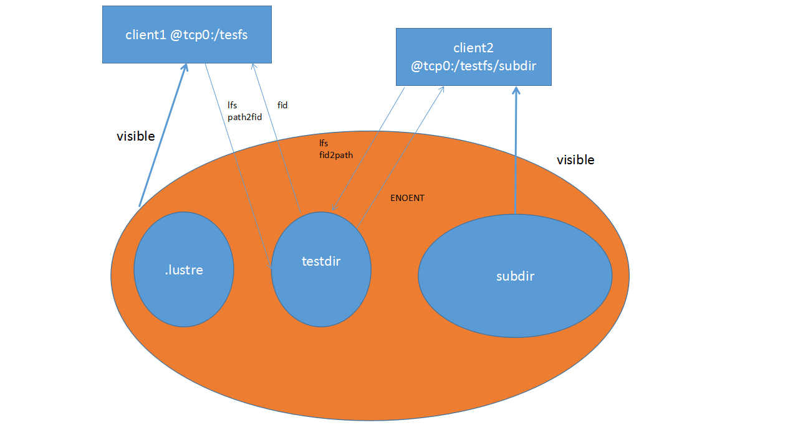

# System Configuration Utilities

- [System Configuration Utilities](#system-configuration-utilities)
  * [e2scan](#e2scan)
    + [Synopsis](#synopsis)
    + [Description](#description)
    + [Options](#options)
  * [l_getidentity](#l_getidentity)
    + [Synopsis](#synopsis-1)
    + [Description](#description-1)
    + [Options](#options-1)
    + [Files](#files)
  * [lctl](#lctl)
    + [Synopsis](#synopsis-2)
    + [Description](#description-2)
    + [Setting Parameters with lctl](#setting-parameters-with-lctl)
    + [Caution](#caution)
    + [Options](#options-2)
    + [Examples](#examples)
    + [See Also](#see-also)
  * [ll_decode_filter_fid](#ll_decode_filter_fid)
    + [Synopsis](#synopsis-3)
    + [Description](#description-3)
    + [Examples](#examples-1)
    + [See Also](#see-also-1)
  * [ll_recover_lost_found_objs](#ll_recover_lost_found_objs)
    + [Synopsis](#synopsis-4)
    + [Description](#description-4)
    + [Options](#options-3)
    + [Example](#example)
  * [llobdstat](#llobdstat)
    + [Synopsis](#synopsis-5)
    + [Description](#description-5)
    + [Example](#example-1)
    + [Files](#files-1)
  * [llog_reader](#llog_reader)
    + [Synopsis](#synopsis-6)
    + [Description](#description-6)
    + [See Also](#see-also-2)
  * [llstat](#llstat)
    + [Synopsis](#synopsis-7)
    + [Description](#description-7)
    + [Options](#options-4)
    + [Example](#example-2)
    + [Files](#files-2)
  * [llverdev](#llverdev)
    + [Synopsis](#synopsis-8)
    + [Description](#description-8)
    + [Options](#options-5)
    + [Examples](#examples-2)
  * [lshowmount](#lshowmount)
    + [Synopsis](#synopsis-9)
    + [Description](#description-9)
    + [Options](#options-6)
    + [Files](#files-3)
  * [lst](#lst)
    + [Synopsis](#synopsis-10)
    + [Description](#description-10)
    + [Modules](#modules)
    + [Utilities](#utilities)
    + [Example Script](#example-script)
  * [lustre_rmmod.sh](#lustre_rmmodsh)
  * [lustre_rsync](#lustre_rsync)
    + [Synopsis](#synopsis-11)
    + [Description](#description-11)
    + [Options](#options-7)
    + [Examples](#examples-3)
    + [See Also](#see-also-3)
  * [mkfs.lustre](#mkfslustre)
    + [Synopsis](#synopsis-12)
    + [Description](#description-12)
    + [Examples](#examples-4)
    + [See Also](#see-also-4)
  * [mount.lustre](#mountlustre)
    + [Synopsis](#synopsis-13)
    + [Description](#description-13)
    + [Options](#options-8)
    + [Examples](#examples-5)
    + [See Also](#see-also-5)
  * [plot-llstat](#plot-llstat)
    + [Synopsis](#synopsis-14)
    + [Description](#description-14)
    + [Options](#options-9)
    + [Example](#example-3)
  * [routerstat](#routerstat)
    + [Synopsis](#synopsis-15)
    + [Description](#description-15)
    + [Output](#output)
    + [Example](#example-4)
    + [Files](#files-4)
  * [tunefs.lustre](#tunefslustre)
    + [Synopsis](#synopsis-16)
    + [Description](#description-16)
    + [Options](#options-10)
    + [Examples](#examples-6)
    + [See Also](#see-also-6)
  * [Additional System Configuration Utilities](#additional-system-configuration-utilities)
    + [Application Profiling Utilities](#application-profiling-utilities)
    + [More /proc Statistics for Application Profiling](#more-proc-statistics-for-application-profiling)
    + [Testing / Debugging Utilities](#testing--debugging-utilities)
      - [lr_reader](#lr_reader)
      - [sgpdd-survey](#sgpdd-survey)
      - [obdfilter-survey](#obdfilter-survey)
      - [ior-survey](#ior-survey)
      - [ost-survey](#ost-survey)
      - [stats-collect](#stats-collect)
    + [Fileset Feature](#fileset-feature)
      - [Examples](#examples-7)


This chapter includes system configuration utilities and includes the following sections:

- [the section called “ e2scan”](#e2scan)
- [the section called “ l_getidentity”](#l_getidentity)
- [the section called “ lctl”](#lctl)
- [the section called “ ll_decode_filter_fid”](#ll_decode_filter_fid)
- [the section called “ ll_recover_lost_found_objs”](#ll_recover_lost_found_objs)
- [the section called “ llobdstat”](#llobdstat)
- [the section called “ llog_reader”](#llog_reader)
- [the section called “ llstat”](#llstat)
- [the section called “ llverdev”](#llverdev)
- [the section called “ lshowmount”](#lshowmount)
- [the section called “ lst”](#lst)
- [the section called “ lustre_rmmod.sh”](#lustre_rmmodsh)
- [the section called “ lustre_rsync”](#lustre_rsync)
- [the section called “ mkfs.lustre”](#mkfslustre)
- [the section called “ mount.lustre”](#mountlustre)
- [the section called “ plot-llstat”](#plot-llstat)
- [the section called “ routerstat”](#routerstat)
- [the section called “ tunefs.lustre”](#tunefslustre)
- [the section called “ Additional System Configuration Utilities”](#additional-system-configuration-utilities)

## e2scan

The e2scan utility is an ext2 file system-modified inode scan program. The e2scan program uses libext2fs to find inodes with ctime or mtime newer than a given time and prints out their pathname. Use e2scan to efficiently generate lists of files that have been modified. The e2scan tool is included in the e2fsprogs package, located at:

<http://downloads.whamcloud.com/public/e2fsprogs/latest/>

### Synopsis

```
e2scan [options] [-f file] block_device
```

### Description

When invoked, the e2scan utility iterates all inodes on the block device, finds modified inodes, and prints their inode numbers. A similar iterator, using libext2fs(5), builds a table (called parent database) which lists the parent node for each inode. With a lookup function, you can reconstruct modified pathnames from root.

### Options

| **Option**                 | **Description**                                              |
| -------------------------- | ------------------------------------------------------------ |
| `-b *inode buffer blocks*` | Sets the readahead inode blocks to get excellent performance when scanning the block device. |
| `-o *output file*`         | If an output file is specified, modified pathnames are written to this file. Otherwise, modified parameters are written to stdout. |
| `-t *inode*| *pathname*`   | Sets the e2scan type if type is inode. The e2scan utility prints modified inode numbers to stdout. By default, the type is set as pathname.The e2scan utility lists modified pathnames based on modified inode numbers. |
| `-u`                       | Rebuilds the parent database from scratch. Otherwise, the current parent database is used. |

## l_getidentity

The l_getidentity tool normally handles Lustre user/group mapping upcall.

### Synopsis

```
l_getidentity { $FSNAME-MDT{xxxx}| -d} {uid}
```

### Description

The `l_getidentity` utility is called from the MDS to map a numeric UID value into the list of supplementary group values for that UID, and writes this into the `mdt.*.identity_info` parameter file. The list of supplementary groups is cached in the kernel to avoid repeated upcalls. See [*the section called “User/Group Upcall”*](06.04-Programming%20Interfaces.md#usergroup-upcall) for more details.

The `l_getidentity` utility can also be run directly for debugging purposes to ensure that the UID mapping for a particular user is configured correctly, by using the `-d` argument instead of the MDT name.

### Options

| **Option**            | **Description**             |
| --------------------- | --------------------------- |
| `${FSNAME}-MDT{xxxx}` | Metadata server target name |
| `uid`                 | User identifier             |

### Files

The l_getidentity files are located at:

```
/proc/fs/lustre/mdt/${FSNAME}-MDT{xxxx}/identity_upcall 
```

## lctl

The lctl utility is used for root control and configuration. With lctl you can directly control Lustre via an ioctl interface, allowing various configuration, maintenance and debugging features to be accessed.

### Synopsis

```
lctl [--device devno] command [args]
```

### Description

The lctl utility can be invoked in interactive mode by issuing the lctl command. After that, commands are issued as shown below. The most common lctl commands are:

```
dl
dk
device
network up|down
list_nids
ping nidhelp
quit
```

For a complete list of available commands, type `help` at the `lctl` prompt. To get basic help on command meaning and syntax, type `help *command*`. Command completion is activated with the TAB key (depending on compile options), and command history is available via the up- and down-arrow keys.

For non-interactive use, use the second invocation, which runs the command after connecting to the device.

### Setting Parameters with lctl

Lustre parameters are not always accessible using the procfs interface, as it is platform-specific. As a solution, lctl {get,set}_param has been introduced as a platform-independent interface to the Lustre tunables. Avoid direct references to /proc/{fs,sys}/{lustre,lnet}. For future portability, use lctl {get,set}_param .

When the file system is running, use the `lctl set_param` command on the affected node(s) to *temporarily* set parameters (mapping to items in /proc/{fs,sys}/{lnet,lustre}). The `lctl set_param` command uses this syntax:

```
lctl set_param [-n] [-P] [-d] obdtype.obdname.property=value
```

For example:

```
mds# lctl set_param mdt.testfs-MDT0000.identity_upcall=NONE
```

Introduced in Lustre 2.5Use `-P` option to set parameters permanently. Option `-d `deletes permanent parameters. For example:`mgs# lctl set_param -P mdt.testfs-MDT0000.identity_upcall=NONE mgs# lctl set_param -P -d mdt.testfs-MDT0000.identity_upcall`

Many permanent parameters can be set with `lctl conf_param`. In general, `lctl conf_param` can be used to specify any OBD device parameter settable in a /proc/fs/lustre file. The `lctl conf_param` command must be run on the MGS node, and uses this syntax:

```
obd|fsname.obdtype.property=value) 
```

For example:

```
mgs# lctl conf_param testfs-MDT0000.mdt.identity_upcall=NONE
$ lctl conf_param testfs.llite.max_read_ahead_mb=16 
```

### Caution

The `lctl conf_param` command *permanently* sets parameters in the file system configuration for all nodes of the specified type.

To get current Lustre parameter settings, use the `lctl get_param` command on the desired node with the same parameter name as `lctl set_param`:

```
lctl get_param [-n] obdtype.obdname.parameter
```

For example:

```
mds# lctl get_param mdt.testfs-MDT0000.identity_upcall
```

To list Lustre parameters that are available to set, use the `lctl list_param` command, with this syntax:

```
lctl list_param [-R] [-F] obdtype.obdname.*
```

For example, to list all of the parameters on the MDT:

```
oss# lctl list_param -RF mdt
```

For more information on using lctl to set temporary and permanent parameters, see [the section called “Setting Parameters with `lctl`”](#setting-parameters-with-lctl).

**Network Configuration**

| **Option**                 | **Description**                                              |
| -------------------------- | ------------------------------------------------------------ |
| `network up|down|tcp|elan` | Starts or stops LNet, or selects a network type for other `lctl` LNet commands. |
| `list_nids`                | Prints all NIDs on the local node. LNet must be running.     |
| `which_nid *nidlist*`      | From a list of NIDs for a remote node, identifies the NID on which interface communication will occur. |
| `ping *nid*`               | Checks LNet connectivity via an LNet ping. This uses the fabric appropriate to the specified NID. |
| `interface_list`           | Prints the network interface information for a given *network* type. |
| `peer_list`                | Prints the known peers for a given *network* type.           |
| `conn_list`                | Prints all the connected remote NIDs for a given *network* type. |
| `active_tx`                | This command prints active transmits. It is only used for the Elan *network* type. |
| `route_list`               | Prints the complete routing table.                           |

**Device Selection**

| **Option**         |      | **Description**                                              |
| ------------------ | ---- | ------------------------------------------------------------ |
| `device *devname*` |      | This selects the specified OBD device. All other commands depend on the device being set. |
| `device_list`      |      | Shows the local Lustre OBDs, a/k/a `dl`.                     |

**Device Operations**

| **Option**                                           | **Description**                                              |                                                              |
| ---------------------------------------------------- | ------------------------------------------------------------ | ------------------------------------------------------------ |
| `list_param [-F|-R] *parameter* *[parameter ...]*`   | Lists the Lustre or LNet parameter name.                     |                                                              |
|                                                      | `-F`                                                         | Adds '/', '@' or '=' for directories, symlinks and writeable files, respectively. |
|                                                      | `-R`                                                         | Recursively lists all parameters under the specified path. If `param_path` is unspecified, all parameters are shown. |
| `get_param [-n|-N|-F] *parameter* *[parameter ...]*` | Gets the value of a Lustre or LNet parameter from the specified path. |                                                              |
|                                                      | `-n`                                                         | Prints only the parameter value and not the parameter name.  |
|                                                      | `-N`                                                         | Prints only matched parameter names and not the values; especially useful when using patterns. |
|                                                      | `-F`                                                         | When `-N` is specified, adds '/', '@' or '=' for directories, symlinks and writeable files, respectively. |
| `set_param [-n] *parameter*=*value*`                 | Sets the value of a Lustre or LNet parameter from the specified path. |                                                              |
|                                                      | `-n`                                                         | Disables printing of the key name when printing values.      |
| `conf_param [-d] *device|fsname**parameter*=*value*` | Sets a permanent configuration parameter for any device via the MGS. This command must be run on the MGS node.All writeable parameters under `lctl list_param` (e.g. `lctl list_param -F osc.*.* | grep` =) can be permanently set using `lctl conf_param`, but the format is slightly different. For `conf_param`, the device is specified first, then the obdtype. Wildcards are not supported. Additionally, failover nodes may be added (or removed), and some system-wide parameters may be set as well (sys.at_max, sys.at_min, sys.at_extra, sys.at_early_margin, sys.at_history, sys.timeout, sys.ldlm_timeout). For system-wide parameters, *device* is ignored.For more information on setting permanent parameters and `lctl conf_param`command examples, see [the section called “Setting Permanent Parameters”](03.02-Lustre%20Operations.md#setting-permanent-parameters)(Setting Permanent Parameters). |                                                              |
|                                                      | `-d *device|fsname*.*parameter*`                             | Deletes a parameter setting (use the default value at the next restart). A null value for *value* also deletes the parameter setting. |
| `activate`                                           | Re-activates an import after the deactivate operation. This setting is only effective until the next restart (see `conf_param`). |                                                              |
| `deactivate`                                         | Deactivates an import, in particular meaning do not assign new file stripes to an OSC. Running lctl deactivate on the MDS stops new objects from being allocated on the OST. Running lctl deactivate on Lustre clients causes them to return -EIO when accessing objects on the OST instead of waiting for recovery. |                                                              |
| `abort_recovery`                                     | Aborts the recovery process on a re-starting MDT or OST.     |                                                              |

**Note**

Lustre tunables are not always accessible using the procfs interface, as it is platform-specific. As a solution, `lctl {get,set,list}_param` has been introduced as a platform-independent interface to the Lustre tunables. Avoid direct references to `/proc/{fs,sys}/{lustre,lnet}`. For future portability, use `lctl {get,set,list}_param` instead.

**Virtual Block Device Operations**

Lustre can emulate a virtual block device upon a regular file. This emulation is needed when you are trying to set up a swap space via the file.

| **Option**                                      | **Description**                                              |
| ----------------------------------------------- | ------------------------------------------------------------ |
| `blockdev_attach *filename**/dev/lloop_device*` | Attaches a regular Lustre file to a block device. If the device node does not exist, `lctl`creates it. It is recommend that a device node is created by `lctl` since the emulator uses a dynamical major number. |
| `blockdev_detach */dev/lloop_device*`           | Detaches the virtual block device.                           |
| `blockdev_info */dev/lloop_device*`             | Provides information about the Lustre file attached to the device node. |

**Changelogs**

| **Option**                | **Description**                                              |
| ------------------------- | ------------------------------------------------------------ |
| `changelog_register`      | Registers a new changelog user for a particular device. Changelog entries are saved persistently on the MDT with each filesystem operation, and are only purged beyond all registered user's minimum set point (see `lfs changelog_clear`). This may cause the Changelog to consume a large amount of space, eventually filling the MDT, if a changelog user is registered but never consumes those records. |
| changelog_deregister *id* | Unregisters an existing changelog user. If the user's "clear" record number is the minimum for the device, changelog records are purged until the next minimum. |

**Debug**

| **Option**                               | **Description**                                              |
| ---------------------------------------- | ------------------------------------------------------------ |
| `debug_daemon`                           | Starts and stops the debug daemon, and controls the output filename and size. |
| `debug_kernel *[file]* [raw]`            | Dumps the kernel debug buffer to stdout or a file.           |
| `debug_file *input_file**[output_file]*` | Converts the kernel-dumped debug log from binary to plain text format. |
| `clear`                                  | Clears the kernel debug buffer.                              |
| `mark *text*`                            | Inserts marker text in the kernel debug buffer.              |
| `filter *subsystem_id|debug_mask*`       | Filters kernel debug messages by subsystem or mask.          |
| `show *subsystem_id|debug_mask*`         | Shows specific types of messages.                            |
| `debug_list *subsystems|types*`          | Lists all subsystem and debug types.                         |
| `modules *path*`                         | Provides GDB-friendly module information.                    |

### Options

Use the following options to invoke lctl.

| **Option**                        | **Description**                                              |
| --------------------------------- | ------------------------------------------------------------ |
| `--device`                        | Device to be used for the operation (specified by name or number). See device_list. |
| `--ignore_errors | ignore_errors` | Ignores errors during script processing.                     |

### Examples

`lctl`

```
$ lctl
lctl > dl 
   0 UP mgc MGC192.168.0.20@tcp btbb24e3-7deb-2ffa-eab0-44dffe00f692 5 
   1 UP ost OSS OSS_uuid 3 
   2 UP obdfilter testfs-OST0000 testfs-OST0000_UUID 3 
lctl > dk /tmp/log Debug log: 87 lines, 87 kept, 0 dropped. 
lctl > quit
```

### See Also

- [the section called “ mkfs.lustre”](#makelustre)
- [the section called “ mount.lustre”](mountlustre)
- [the section called “ lctl”](lctl)
- [the section called “ `lfs` ”](06.03-User%20Utilities.md#lfs)

## ll_decode_filter_fid

The ll_decode_filter_fid utility displays the Lustre object ID and MDT parent FID.

### Synopsis

```
ll_decode_filter_fid object_file [object_file ...]
```

### Description

The ll_decode_filter_fid utility decodes and prints the Lustre OST object ID, MDT FID, stripe index for the specified OST object(s), which is stored in the "trusted.fid" attribute on each OST object. This is accessible to `ll_decode_filter_fid` when the OST file system is mounted locally as type ldiskfs for maintenance.

The "trusted.fid" extended attribute is stored on each OST object when it is first modified (data written or attributes set), and is not accessed or modified by Lustre after that time.

The OST object ID (objid) is useful in case of OST directory corruption, though normally the ll_recover_lost_found_objs(8) utility is able to reconstruct the entire OST object directory hierarchy. The MDS FID can be useful to determine which MDS inode an OST object is (or was) used by. The stripe index can be used in conjunction with other OST objects to reconstruct the layout of a file even if the MDT inode was lost.

### Examples

```
root@oss1# cd /mnt/ost/lost+found
root@oss1# ll_decode_filter_fid #12345[4,5,8]
#123454: objid=690670 seq=0 parent=[0x751c5:0xfce6e605:0x0]
#123455: objid=614725 seq=0 parent=[0x18d11:0xebba84eb:0x1]
#123458: objid=533088 seq=0 parent=[0x21417:0x19734d61:0x0]
```

This shows that the three files in lost+found have decimal object IDs - 690670, 614725, and 533088, respectively. The object sequence number (formerly object group) is 0 for all current OST objects.

The MDT parent inode FIDs are hexadecimal numbers of the form sequence:oid:idx. Since the sequence number is below 0x100000000 in all these cases, the FIDs are in the legacy Inode and Generation In FID (IGIF) namespace and are mapped directly to the MDT inode = seq and generation = oid values; the MDT inodes are 0x751c5, 0x18d11, and 0x21417 respectively. For objects with MDT parent sequence numbers above 0x200000000, this indicates that the FID needs to be mapped via the MDT Object Index (OI) file on the MDT to determine the internal inode number.

The idx field shows the stripe number of this OST object in the Lustre RAID-0 striped file.

### See Also

[the section called “ ll_recover_lost_found_objs”](#ll_recover_lost_found_objs)


Introduced in Lustre 2.8

## ll_recover_lost_found_objs

The `ll_recover_lost_found_objs` utility was used to help recover Lustre OST objects (file data) from the`lost+found` directory of an OST and return them to their correct locations based on information stored in the`trusted.fid` extended attribute stored on every OST object containing data.

Introduced in Lustre 2.6

**Note**

This utility is not needed with Lustre 2.6 and later, and is removed in Lustre 2.8 since `LFSCK` online scanning will automatically move objects from `lost+found` to the proper place in the OST.

Introduced in Lustre 2.5

**Note**

The `ll_recover_lost_found_objs` tool is not strictly necessary to bring an OST back online, it just avoids losing access to objects that were moved to the lost+found directory due to directory corruption on the OST.

### Synopsis

```
$ ll_recover_lost_found_objs [-hv] -d directory
```

### Description

The first time Lustre modifies an object, it saves the MDS inode number and the objid as an extended attribute on the object, so in case of directory corruption of the OST, it is possible to recover the objects. Running e2fsck fixes the corrupted OST directory, but it puts all of the objects into a lost and found directory, where they are inaccessible to Lustre. Use the ll_recover_lost_found_objs utility to recover all (or at least most) objects from a lost and found directory and return them to the O/0/d* directories.

To use ll_recover_lost_found_objs, mount the file system locally (using the `-t ldiskfs`, or `-t zfs` command), run the utility and then unmount it again. The OST must not be mounted by Lustre when ll_recover_lost_found_objs is run.

### Options

| **Option**       | **Description**                        |
| ---------------- | -------------------------------------- |
| `-h`             | Prints a help message                  |
| `-v`             | Increases verbosity                    |
| `-d *directory*` | Sets the lost and found directory path |

### Example

```
ll_recover_lost_found_objs -d /mnt/ost/lost+found 
```

## llobdstat

The llobdstat utility displays OST statistics.

### Synopsis

```
llobdstat ost_name [interval]
```

### Description

The llobdstat utility displays a line of OST statistics for the given ost_name every interval seconds. It should be run directly on an OSS node. Type `CTRL-C` to stop statistics printing.

### Example

```
# llobdstat liane-OST0002 1
/usr/bin/llobdstat on /proc/fs/lustre/obdfilter/liane-OST0002/stats
Processor counters run at 2800.189 MHz
Read: 1.21431e+07, Write: 9.93363e+08, create/destroy: 24/1499, stat: 34, p\
unch: 18
[NOTE: cx: create, dx: destroy, st: statfs, pu: punch ]
Timestamp Read-delta ReadRate Write-delta WriteRate
--------------------------------------------------------
1217026053 0.00MB 0.00MB/s 0.00MB 0.00MB/s
1217026054 0.00MB 0.00MB/s 0.00MB 0.00MB/s
1217026055 0.00MB 0.00MB/s 0.00MB 0.00MB/s
1217026056 0.00MB 0.00MB/s 0.00MB 0.00MB/s
1217026057 0.00MB 0.00MB/s 0.00MB 0.00MB/s
1217026058 0.00MB 0.00MB/s 0.00MB 0.00MB/s
1217026059 0.00MB 0.00MB/s 0.00MB 0.00MB/s st:1
```

### Files

```
/proc/fs/lustre/obdfilter/ostname/stats
```

## llog_reader

The llog_reader utility translates a Lustre configuration log into human-readable form.

### Synopsis

```
llog_reader filename
```

### Description

The llog_reader utility parses the binary format of Lustre's on-disk configuration logs. Llog_reader can only read logs; use tunefs.lustre to write to them.

To examine a log file on a stopped Lustre server, mount its backing file system as ldiskfs or zfs, then use llog_reader to dump the log file's contents, for example:

```
mount -t ldiskfs /dev/sda /mnt/mgs 
llog_reader /mnt/mgs/CONFIGS/tfs-client
```

To examine the same log file on a running Lustre server, use the ldiskfs-enabled debugfs utility (called debug.ldiskfs on some distributions) to extract the file, for example:

```
debugfs -c -R 'dump CONFIGS/tfs-client /tmp/tfs-client' /dev/sda 
llog_reader /tmp/tfs-client
```

**Caution**

Although they are stored in the CONFIGS directory, mountdata files do not use the configuration log format and will confuse the llog_reader utility.

### See Also

[the section called “ tunefs.lustre”](#tunefslustre)

## llstat

The llstat utility displays Lustre statistics.

### Synopsis

```
llstat [-c] [-g] [-i interval] stats_file
```

### Description

The llstat utility displays statistics from any of the Lustre statistics files that share a common format and are updated at `interval` seconds. To stop statistics printing, use `ctrl`-`c.`

### Options

| **Option**   | **Description**                                              |
| ------------ | ------------------------------------------------------------ |
| `-c`         | Clears the statistics file.                                  |
| `-i`         | Specifies the polling period (in seconds).                   |
| `-g`         | Specifies graphable output format.                           |
| `-h`         | Displays help information.                                   |
| `stats_file` | Specifies either the full path to a statistics file or the shorthand reference, `mds` or `ost` |

### Example

To monitor /proc/fs/lustre/ost/OSS/ost/stats at 1 second intervals, run;

```
llstat -i 1 ost
```

### Files

The llstat files are located at:

```
/proc/fs/lustre/mdt/MDS/*/stats
/proc/fs/lustre/mdt/*/exports/*/stats
/proc/fs/lustre/mdc/*/stats
/proc/fs/lustre/ldlm/services/*/stats
/proc/fs/lustre/ldlm/namespaces/*/pool/stats
/proc/fs/lustre/mgs/MGS/exports/*/stats
/proc/fs/lustre/ost/OSS/*/stats
/proc/fs/lustre/osc/*/stats
/proc/fs/lustre/obdfilter/*/exports/*/stats
/proc/fs/lustre/obdfilter/*/stats
/proc/fs/lustre/llite/*/stats
```

## llverdev

The llverdev verifies a block device is functioning properly over its full size.

### Synopsis

```
llverdev [-c chunksize] [-f] [-h] [-o offset] [-l] [-p] [-r] [-t timestamp] [-v] [-w] device
```

### Description

Sometimes kernel drivers or hardware devices have bugs that prevent them from accessing the full device size correctly, or possibly have bad sectors on disk or other problems which prevent proper data storage. There are often defects associated with major system boundaries such as 2^32 bytes, 2^31 sectors, 2^31 blocks, 2^32 blocks, etc.

The llverdev utility writes and verifies a unique test pattern across the entire device to ensure that data is accessible after it was written, and that data written to one part of the disk is not overwriting data on another part of the disk.

It is expected that llverdev will be run on large size devices (TB). It is always better to run llverdev in verbose mode, so that device testing can be easily restarted from the point where it was stopped.

Running a full verification can be time-consuming for very large devices. We recommend starting with a partial verification to ensure that the device is minimally sane before investing in a full verification.

### Options

| **Option**       | **Description**                                              |
| ---------------- | ------------------------------------------------------------ |
| `-c|--chunksize` | I/O chunk size in bytes (default value is 1048576).          |
| `-f|--force`     | Forces the test to run without a confirmation that the device will be overwritten and all data will be permanently destroyed. |
| `-h|--help`      | Displays a brief help message.                               |
| `-o *offset*`    | Offset (in kilobytes) of the start of the test (default value is 0). |
| `-l|--long`      | Runs a full check, writing and then reading and verifying every block on the disk. |
| `-p|--partial`   | Runs a partial check, only doing periodic checks across the device (1 GB steps). |
| `-r|--read`      | Runs the test in read (verify) mode only, after having previously run the test in `-w` mode. |
| `-t *timestamp*` | Sets the test start time as printed at the start of a previously-interrupted test to ensure that validation data is the same across the entire file system (default value is the current time()). |
| `-v|--verbose`   | Runs the test in verbose mode, listing each read and write operation. |

### Examples

Runs a partial device verification on /dev/sda:

```
llverdev -v -p /dev/sda 
llverdev: permanently overwrite all data on /dev/sda (yes/no)? y 
llverdev: /dev/sda is 4398046511104 bytes (4096.0 GB) in size 
Timestamp: 1009839028 
Current write offset: 4096 kB
```

Continues an interrupted verification at offset 4096kB from the start of the device, using the same timestamp as the previous run:

```
llverdev -f -v -p --offset=4096 --timestamp=1009839028 /dev/sda 
llverdev: /dev/sda is 4398046511104 bytes (4096.0 GB) in size 
Timestamp: 1009839028 
write complete 
read complete 
```

## lshowmount

The lshowmount utility shows Lustre exports.

### Synopsis

```
lshowmount [-ehlv]
```

### Description

The lshowmount utility shows the hosts that have Lustre mounted to a server. This utility looks for exports from the MGS, MDS, and obdfilter.

### Options

| **Option**       | **Description**                                              |
| ---------------- | ------------------------------------------------------------ |
| `-e|--enumerate` | Causes lshowmount to list each client mounted on a separate line instead of trying to compress the list of clients into a hostrange string. |
| `-h|--help`      | Causes lshowmount to print out a usage message.              |
| `-l|--lookup`    | Causes lshowmount to try to look up the hostname for NIDs that look like IP addresses. |
| `-v|--verbose`   | Causes lshowmount to output export information for each service instead of only displaying the aggregate information for all Lustre services on the server. |

### Files

```
/proc/fs/lustre/mgs/server/exports/uuid/nid
/proc/fs/lustre/mds/server/exports/uuid/nid
/proc/fs/lustre/obdfilter/server/exports/uuid/nid
```

## lst

The lst utility starts LNet self-test.

### Synopsis

```
lst
```

### Description

LNet self-test helps site administrators confirm that Lustre Networking (LNet) has been properly installed and configured. The self-test also confirms that LNet and the network software and hardware underlying it are performing as expected.

Each LNet self-test runs in the context of a session. A node can be associated with only one session at a time, to ensure that the session has exclusive use of the nodes on which it is running. A session is create, controlled and monitored from a single node; this is referred to as the self-test console.

Any node may act as the self-test console. Nodes are named and allocated to a self-test session in groups. This allows all nodes in a group to be referenced by a single name.

Test configurations are built by describing and running test batches. A test batch is a named collection of tests, with each test composed of a number of individual point-to-point tests running in parallel. These individual point-to-point tests are instantiated according to the test type, source group, target group and distribution specified when the test is added to the test batch.

### Modules

To run LNet self-test, load these modules: libcfs, lnet, lnet_selftest and any one of the klnds (ksocklnd, ko2iblnd...). To load all necessary modules, run modprobe lnet_selftest, which recursively loads the modules on which lnet_selftest depends.

There are two types of nodes for LNet self-test: the console node and test nodes. Both node types require all previously-specified modules to be loaded. (The userspace test node does not require these modules).

Test nodes can be in either kernel or in userspace. A console user can invite a kernel test node to join the test session by running lst add_group NID, but the user cannot actively add a userspace test node to the test session. However, the console user can passively accept a test node to the test session while the test node runs lst client to connect to the console.

### Utilities

LNet self-test includes two user utilities, lst and lstclient.

lst is the user interface for the self-test console (run on the console node). It provides a list of commands to control the entire test system, such as create session, create test groups, etc.

lstclient is the userspace self-test program which is linked with userspace LNDs and LNet. A user can invoke lstclient to join a self-test session:

```
lstclient -sesid CONSOLE_NID group NAME
```

### Example Script

This is a sample LNet self-test script which simulates the traffic pattern of a set of Lustre servers on a TCP network, accessed by Lustre clients on an IB network (connected via LNet routers), with half the clients reading and half the clients writing.

```
#!/bin/bash
export LST_SESSION=$$
lst new_session read/write
lst add_group servers 192.168.10.[8,10,12-16]@tcp
lst add_group readers 192.168.1.[1-253/2]@o2ib
lst add_group writers 192.168.1.[2-254/2]@o2ib
lst add_batch bulk_rw
lst add_test --batch bulk_rw --from readers --to servers     brw read check\
=simple size=1M
lst add_test --batch bulk_rw --from writers --to servers     brw write chec\
k=full size=4K
# start running
lst run bulk_rw
# display server stats for 30 seconds
lst stat servers & sleep 30; kill $!
# tear down
lst end_session 
```

## lustre_rmmod.sh

The lustre_rmmod.sh utility removes all Lustre and LNet modules (assuming no Lustre services are running). It is located in /usr/bin.

**Note**

The lustre_rmmod.sh utility does not work if Lustre modules are being used or if you have manually run the lctl network up command.

## lustre_rsync

The lustre_rsync utility synchronizes (replicates) a Lustre file system to a target file system.

### Synopsis

```
lustre_rsync --source|-s src --target|-t tgt 
   --mdt|-m mdt [--user|-u userid]
   [--xattr|-x yes|no] [--verbose|-v]
   [--statuslog|-l log] [--dry-run] [--abort-on-err] 
 
lustre_rsync --statuslog|-l log
 
lustre_rsync --statuslog|-l log --source|-s source
   --target|-t tgt --mdt|-m mdt
```

### Description

The lustre_rsync utility is designed to synchronize (replicate) a Lustre file system (source) to another file system (target). The target can be a Lustre file system or any other type, and is a normal, usable file system. The synchronization operation is efficient and does not require directory walking, as lustre_rsync uses Lustre MDT changelogs to identify changes in the Lustre file system.

Before using lustre_rsync:

- A changelog user must be registered (see lctl (8) changelog_register)

\- AND -

- Verify that the Lustre file system (source) and the replica file system (target) are identical before the changelog user is registered. If the file systems are discrepant, use a utility, e.g. regular rsync (not lustre_rsync) to make them identical.

### Options

| **Option**          | **Description**                                              |
| ------------------- | ------------------------------------------------------------ |
| `--source=*src*`    | The path to the root of the Lustre file system (source) which will be synchronized. This is a mandatory option if a valid status log created during a previous synchronization operation (--statuslog) is not specified. |
| `--target=*tgt*`    | The path to the root where the source file system will be synchronized (target). This is a mandatory option if the status log created during a previous synchronization operation (--statuslog) is not specified. This option can be repeated if multiple synchronization targets are desired. |
| `--mdt=*mdt*`       | The metadata device to be synchronized. A changelog user must be registered for this device. This is a mandatory option if a valid status log created during a previous synchronization operation (--statuslog) is not specified. |
| `--user=*userid*`   | The changelog user ID for the specified MDT. To use lustre_rsync, the changelog user must be registered. For details, see the changelog_register parameter in the lctl man page. This is a mandatory option if a valid status log created during a previous synchronization operation (--statuslog) is not specified. |
| `--statuslog=*log*` | A log file to which synchronization status is saved. When lustre_rsync starts, the state of a previous replication is read from here. If the status log from a previous synchronization operation is specified, otherwise mandatory options like --source, --target and --mdt options may be skipped. By specifying options like --source, --target and/or --mdt in addition to the --statuslog option, parameters in the status log can be overridden. Command line options take precedence over options in the status log. |
| `--xattr*yes|no*`   | Specifies whether extended attributes (xattrs) are synchronized or not. The default is to synchronize extended attributes.NOTE: Disabling xattrs causes Lustre striping information not to be synchronized. |
| `--verbose`         | Produces a verbose output.                                   |
| `--dry-run`         | Shows the output of lustre_rsync commands (copy, mkdir, etc.) on the target file system without actually executing them. |
| `--abort-on-err`    | Shows the output of lustre_rsync commands (copy, mkdir, etc.) on the target file system without actually executing them. |

### Examples

Register a changelog user for an MDT (e.g., MDT lustre-MDT0000).

```
$ ssh 
$ MDS lctl changelog_register \
           --device lustre-MDT0000 -n 
cl1
```

Synchronize/replicate a Lustre file system (/mnt/lustre) to a target file system (/mnt/target).

```
$ lustre_rsync --source=/mnt/lustre --target=/mnt/target \ 
           --mdt=lustre-MDT0000 --user=cl1 \ 
           --statuslog replicate.log  --verbose 
Lustre filesystem: lustre 
MDT device: lustre-MDT0000 
Source: /mnt/lustre 
Target: /mnt/target 
Statuslog: sync.log 
Changelog registration: cl1 
Starting changelog record: 0 
Errors: 0 
lustre_rsync took 1 seconds 
Changelog records consumed: 22
```

After the file system undergoes changes, synchronize the changes with the target file system. Only the statuslog name needs to be specified, as it has all the parameters passed earlier.

```
$ lustre_rsync --statuslog replicate.log --verbose 
Replicating Lustre filesystem: lustre 
MDT device: lustre-MDT0000 
Source: /mnt/lustre 
Target: /mnt/target 
Statuslog: replicate.log 
Changelog registration: cl1 
Starting changelog record: 22 
Errors: 0 
lustre_rsync took 2 seconds 
Changelog records consumed: 42
```

Synchronize a Lustre file system (/mnt/lustre) to two target file systems (/mnt/target1 and /mnt/target2).

```
$ lustre_rsync --source=/mnt/lustre \ 
   --target=/mnt/target1 --target=/mnt/target2 \ 
   --mdt=lustre-MDT0000 --user=cl1 
   --statuslog replicate.log
```

### See Also

[the section called “ `lfs` ”](06.03-User%20Utilities.md#lfs)

## mkfs.lustre

The `mkfs.lustre` utility formats a disk for a Lustre service.

### Synopsis

```
mkfs.lustre target_type [options] device
```

where *target_type* is one of the following:

| **Option**            | **Description**                                              |
| --------------------- | ------------------------------------------------------------ |
| `--ost`               | Object storage target (OST)                                  |
| `--mdt`               | Metadata storage target (MDT)                                |
| `--network=*net,...*` | Network(s) to which to restrict this OST/MDT. This option can be repeated as necessary. |
| `--mgs`               | Configuration management service (MGS), one per site. This service can be combined with one `--mdt` service by specifying both types. |

### Description

`mkfs.lustre` is used to format a disk device for use as part of a Lustre file system. After formatting, a disk can be mounted to start the Lustre service defined by this command.

When the file system is created, parameters can simply be added as a `--param` option to the `mkfs.lustre`command. See [*the section called “Setting Tunable Parameters with `mkfs.lustre`”*](03.02-Lustre%20Operations.md#setting-tunable-parameters-with-mkfslustre).

| **Option**                      | **Description**                                              |
| ------------------------------- | ------------------------------------------------------------ |
| `--backfstype=*fstype*`         | Forces a particular format for the backing file system such as ldiskfs (the default) or zfs. |
| `--comment=*comment*`           | Sets a user comment about this disk, ignored by the Lustre software. |
| `--device-size=*#*>KB`          | Sets the device size for loop devices.                       |
| `--dryrun`                      | Only prints what would be done; it does not affect the disk. |
| `--servicenode=*nid,...*`       | Sets the NID(s) of all service nodes, including primary and failover partner service nodes. The `--servicenode` option cannot be used with `--failnode` option. See [*the section called “Preparing a Lustre File System for Failover”*](02.08-Configuring%20Failover%20in%20a%20Lustre%20File%20System.md#preparing-a-lustre-file-system-for-failover) for more details. |
| `--failnode=*nid,...*`          | Sets the NID(s) of a failover service node for a primary server for a target. The `--failnode` option cannot be used with `--servicenode` option. See [*the section called “Preparing a Lustre File System for Failover”*](02.08-Configuring%20Failover%20in%20a%20Lustre%20File%20System.md#preparing-a-lustre-file-system-for-failover) for more details.                             **Note**                                                                                                                                                                                                         When the `--failnode` option is used, certain restrictions apply (see [*the section called “Preparing a Lustre File System for Failover”*](02.08-Configuring%20Failover%20in%20a%20Lustre%20File%20System.md#preparing-a-lustre-file-system-for-failover)). |
| `--fsname=*filesystem_name*`    | The Lustre file system of which this service/node will be a part. The default file system name is `lustre`.                                                                                                                        **Note**                                                                                                                                                                                                          The file system name is limited to 8 characters. |
| `--index=*index_number*`        | Specifies the OST or MDT number (0...N). This allows mapping between the OSS and MDS node and the device on which the OST or MDT is located. |
| `--mkfsoptions=*opts*`          | Formats options for the backing file system. For example, ext3 options could be set here. |
| `--mountfsoptions=*opts*`       | Sets the mount options used when the backing file system is mounted.                                                                                                                                                                                    **Warning**                                                                                                                                                                                                      Unlike earlier versions of `mkfs.lustre`, this version completely replaces the default mount options with those specified on the command line, and issues a warning on stderr if any default mount options are omitted.                                                                                                          The defaults for ldiskfs are:                                                                        MGS/MDT: `errors=remount-ro,iopen_nopriv,user_xattr`                                                                                                         OST: `errors=remount-ro,extents,mballoc`                                                                                              Introduced in Lustre 2.5                                                                                                                                                   OST: `errors=remount-ro`                                                                                                                                        Use care when altering the default mount options. |
| `--network=*net,...*`           | Network(s) to which to restrict this OST/MDT. This option can be repeated as necessary. |
| `--mgsnode=*nid,...*`           | Sets the NIDs of the MGS node, required for all targets other than the MGS. |
| `--param *key*=*value*`         | Sets the permanent parameter *key* to value *value*. This option can be repeated as necessary. Typical options might include: |
| `--param sys.timeout=40`>       | System obd timeout.                                          |
| `--param lov.stripesize=2M`     | Default stripe size.                                         |
| `param lov.stripecount=2`       | Default stripe count.                                        |
| `--param failover.mode=failout` | Returns errors instead of waiting for recovery.              |
| `--quiet`                       | Prints less information.                                     |
| `--reformat`                    | Reformats an existing Lustre disk.                           |
| `--stripe-count-hint=stripes`   | Used to optimize the MDT's inode size.                       |
| `--verbose`                     | Prints more information.                                     |

### Examples

Creates a combined MGS and MDT for file system `testfs` on, e.g., node `cfs21`:

```
mkfs.lustre --fsname=testfs --mdt --mgs /dev/sda1
```

Creates an OST for file system `testfs` on any node (using the above MGS):

```
mkfs.lustre --fsname=testfs --mgsnode=cfs21@tcp0 --ost --index=0 /dev/sdb
```

Creates a standalone MGS on, e.g., node `cfs22`:

```
mkfs.lustre --mgs /dev/sda1
```

Creates an MDT for file system `myfs1` on any node (using the above MGS):

```
mkfs.lustre --fsname=myfs1 --mdt --mgsnode=cfs22@tcp0 /dev/sda2
```

### See Also

- [*the section called “ mkfs.lustre”*](#mkfslustre)mkfs.lustre,
- [*the section called “ mount.lustre”*](mountlustre)mount.lustre,
- [*the section called “ `lfs` ”*](06.03-User%20Utilities.md#lfs)lfs

## mount.lustre

The mount.lustre utility starts a Lustre client or target service.

### Synopsis

```
mount -t lustre [-o options] device mountpoint
```

### Description

The mount.lustre utility starts a Lustre client or target service. This program should not be called directly; rather, it is a helper program invoked through mount(8), as shown above. Use the umount command to stop Lustre clients and targets.

There are two forms for the device option, depending on whether a client or a target service is started:

| **Option**                       | **Description**                                              |
| -------------------------------- | ------------------------------------------------------------ |
| `*mgsname*:/*fsname**[/subdir]*` | Mounts the Lustre file system named *fsname* (optionally starting at subdirectory *subdir* within the filesystem, if specified) on the client at the directory*mountpoint*, by contacting the Lustre Management Service at *mgsname*. The format for *mgsname* is defined below. A client file system can be listed in `fstab(5)` for automatic mount at boot time, is usable like any local file system, and provides a full POSIX standard-compliant interface. |
| *block_device*                   | Starts the target service defined by the `mkfs.lustre(8)` command on the physical disk *block_device*. The *block_device* may be specified using `-L *label*` to find the first block device with that label (e.g. `testfs-MDT0000`), or by UUID using the`-U *uuid*` option. Care should be taken if there is a device-level backup of the target filesystem on the same node, which would have a duplicate label and UUID if it has not been changed with `tune2fs(8)` or similar. The mounted target service filesystem mounted at *mountpoint* is only useful for `df(1)` operations and appears in `/proc/mounts` to show the device is in use. |

### Options

| **Option**                      | **Description**                                              |
| ------------------------------- | ------------------------------------------------------------ |
| `mgsname=*mgsnode*[:*mgsnode*]` | *mgsname* is a colon-separated list of *mgsnode* names where the MGS service may run. Multiple *mgsnode* values can be specified if the MGS service is configured for HA failover and may be running on any one of the nodes. |
| `mgsnode=*mgsnid*[,*mgsnid*]`   | Each *mgsnode* may specify a comma-separated list of NIDs, if there are different LNet interfaces for that `mgsnode`. |
| `mgssec=*flavor*`               | Specifies the encryption flavor for the initial network RPC connection to the MGS. Non-security flavors are: `null`, `plain`, and `gssnull`, which respectively disable, or have no encryption or integrity features for testing purposes. Kerberos flavors are: `krb5n`, `krb5a`, `krb5i`, and `krb5p`. Shared-secret key flavors are: `skn`, `ska`,`ski`, and `skpi`, see the [*Configuring Shared-Secret Key (SSK) Security*](03.17-Configuring%20Shared-Secret%20Key%20(SSK)%20Security.md) for more details. The security flavor for client-to-server connections is specified in the filesystem configuration that the client fetches from the MGS. |
| `skpath=*file|directory*`       | Introduced in Lustre 2.9Path to a file or directory with the keyfile(s) to load for this mount command. Keys are inserted into the `KEY_SPEC_SESSION_KEYRING` keyring in the kernel with a description containing `lustre:` and a suffix which depends on whether the context of the mount command is for an MGS, MDT/OST, or client. |
| `exclude=*ostlist*`             | Starts a client or MDT with a colon-separated list of known inactive OSTs that it will not try to connect to. |

In addition to the standard mount(8) options, Lustre understands the following client-specific options:

| **Option**        | **Description**                                              |
| ----------------- | ------------------------------------------------------------ |
| `always_ping`     | Introduced in Lustre 2.9The client will periodically ping the server when it is idle, even if the server `ptlrpc` module is configured with the `suppress_pings` option. This allows clients to reliably use the filesystem even if they are not part of an external client health monitoring mechanism. |
| `flock`           | Enables advisory file locking support between participating applications using the `flock(2)`system call. This causes file locking to be coherent across all client nodes also using this mount option. This is useful if applications need coherent userspace file locking across multiple client nodes, but also imposes communications overhead in order to maintain locking consistency between client nodes. |
| `localflock`      | Enables client-local `flock(2)` support, using only client-local advisory file locking. This is faster than using the global `flock` option, and can be used for applications that depend on functioning `flock(2)` but run only on a single node. It has minimal overhead using only the Linux kernel's locks. |
| `noflock`         | Disables `flock(2)` support entirely, and is the default option. Applications calling `flock(2)`get an `ENOSYS` error. It is up to the administrator to choose either the `localflock` or `flock`mount option based on their requirements. It is possible to mount clients with different options, and only those mounted with `flock` will be coherent amongst each other. |
| `lazystatfs`      | Allows `statfs(2)` (as used by `df(1)` and `lfs-df(1)`) to return even if some OST or MDT is unresponsive or has been temporarily or permanently disabled in the configuration. This avoids blocking until all of the targets are available. This is the default behavior since Lustre 2.9.0. |
| `nolazystatfs`    | Requires that `statfs(2)` block until all OSTs and MDTs are available and have returned space usage. |
| `user_xattr`      | Enables get/set of extended attributes by regular users in the `user.*` namespace. See the`attr(5)` manual page for more details. |
| `nouser_xattr`    | Disables use of extended attributes in the `user.*` namespace by regular users. Root and system processes can still use extended attributes. |
| `verbose`         | Enable extra mount/umount console messages.                  |
| `noverbose`       | Disable mount/umount console messages.                       |
| `user_fid2path`   | Enable FID-to-path translation by regular users.NoteThis option allows a potential security hole because it allows regular users direct access to a file by its Lustre File ID. This bypasses POSIX path-based permission checks, and could allow the user to access a file in a directory that they do not have access to. Regular POSIX file mode and ACL permission checks are still performed on the file itself, so users cannot access a file to which they have no permission. |
| `nouser_fid2path` | Disable FID to path translation by regular users. Root and processes with`CAP_DAC_READ_SEARCH` can still perform FID to path translation. |

In addition to the standard mount options and backing disk type (e.g. ldiskfs) options, Lustre understands the following server-specific mount options:

| **Option**                     | **Description**                                              |
| ------------------------------ | ------------------------------------------------------------ |
| `nosvc`                        | Starts the MGC (and MGS, if co-located) for a target service, not the actual service. |
| `nomgs`                        | Starts only the MDT (with a co-located MGS), without starting the MGS. |
| `abort_recov`                  | Aborts client recovery on that server and starts the target service immediately. |
| `max_sectors_kb=*KB*`          | Introduced in Lustre 2.10Sets the block device parameter `max_sectors_kb` limit for the MDT or OST target being mounted to specified maximum number of kilobytes. When `max_sectors_kb` isn't specified as a mount option, it will automatically be set to the `max_hw_sectors_kb` (up to a maximum of 16MiB) for that block device. This default behavior is suited for most users. When `max_sectors_kb=0` is used, the current value for this tunable will be kept. |
| `md_stripe_cache_size`         | Sets the stripe cache size for server-side disk with a striped RAID configuration. |
| `recovery_time_soft=*timeout*` | Allows `timeout` seconds for clients to reconnect for recovery after a server crash. This timeout is incrementally extended if it is about to expire and the server is still handling new connections from recoverable clients.The default soft recovery timeout is 3 times the value of the Lustre timeout parameter (see [*the section called “Setting Static Timeouts”*](06.02-Lustre%20Parameters.md#setting-static-timeouts)). The default Lustre timeout is 100 seconds, which would make the soft recovery timeout default to 300 seconds (5 minutes). The soft recovery timeout is set at mount time and will not change if the Lustre timeout is changed after mount time. |
| `recovery_time_hard=*timeout*` | The server is allowed to incrementally extend its timeout up to a hard maximum of *timeout* seconds.The default hard recovery timeout is 9 times the value of the Lustre timeout parameter (see [*the section called “Setting Static Timeouts”*](06.02-Lustre%20Parameters.md#setting-static-timeouts)). The default Lustre timeout is 100 seconds, which would make the hard recovery timeout default to 900 seconds (15 minutes). The hard recovery timeout is set at mount time and will not change if the Lustre timeout is changed after mount time. |
| `noscrub`                      | Typically the MDT will detect restoration from a file-level backup during mount. This mount option prevents the OI Scrub from starting automatically when the MDT is mounted. Manually starting LFSCK after mounting provides finer control over the starting conditions. This mount option also prevents OI scrub from occurring automatically when OI inconsistency is detected (see [*the section called “Auto scrub”*](05.02-Troubleshooting%20Recovery.md#auto-scrub)). |

### Examples

Starts a client for the Lustre file system *chipfs* at mount point */mnt/chip*. The Management Service is running on a node reachable from this client via the cfs21@tcp0 NID.

```
mount -t lustre cfs21@tcp0:/chipfs /mnt/chip
```

Introduced in Lustre 2.9Similar to the above example, but mounting a subdirectory under *chipfs* as a fileset.`mount -t lustre cfs21@tcp0:/chipfs/v1_0 /mnt/chipv1_0`

Starts the Lustre metadata target service from /dev/sda1 on mount point /mnt/test/mdt.

```
mount -t lustre /dev/sda1 /mnt/test/mdt
```

Starts the testfs-MDT0000 service (using the disk label), but aborts the recovery process.

```
mount -t lustre -L testfs-MDT0000 -o abort_recov /mnt/test/mdt
```

### See Also

- [the section called “ mkfs.lustre”](mkfslustre)
- [the section called “ tunefs.lustre”](tunefslustre)
- [the section called “ lctl”](lctl)
- [the section called “ `lfs` ”](06.03-User%20Utilities.md#lfs)

## plot-llstat

The plot-llstat utility plots Lustre statistics.

### Synopsis

```
plot-llstat results_filename [parameter_index]
```

### Description

The plot-llstat utility generates a CSV file and instruction files for gnuplot from the output of llstat. Since llstat is generic in nature, plot-llstat is also a generic script. The value of parameter_index can be 1 for count per interval, 2 for count per second (default setting) or 3 for total count.

The plot-llstat utility creates a .dat (CSV) file using the number of operations specified by the user. The number of operations equals the number of columns in the CSV file. The values in those columns are equal to the corresponding value of parameter_index in the output file.

The plot-llstat utility also creates a .scr file that contains instructions for gnuplot to plot the graph. After generating the .dat and .scr files, the plot-llstat tool invokes gnuplot to display the graph.

### Options

| **Option**         | **Description**                                              |
| ------------------ | ------------------------------------------------------------ |
| `results_filename` | Output generated by plot-llstat                              |
| `parameter_index`  | Value of parameter_index can be:1 - count per interval2 - count per second (default setting)3 - total count |

### Example

```
llstat -i2 -g -c lustre-OST0000 > log
plot-llstat log 3
```

## routerstat

The routerstat utility prints Lustre router statistics.

### Synopsis

```
routerstat [interval]
```

### Description

The routerstat utility displays LNet router statistics. If no `*interval*` is specified, then statistics are sampled and printed only one time. Otherwise, statistics are sampled and printed at the specified `*interval*` (in seconds).

### Output

The routerstat output includes the following fields:

| **Output** | **Description**                                              |
| ---------- | ------------------------------------------------------------ |
| `M`        | Number of messages currently being processed by LNet (The maximum number of messages ever processed by LNet concurrently) |
| `E`        | Number of LNet errors                                        |
| `S`        | Total size (length) of messages sent in bytes/ Number of messages sent |
| `R`        | Total size (length) of messages received in bytes/ Number of messages received |
| `F`        | Total size (length) of messages routed in bytes/ Number of messages routed |
| `D`        | Total size (length) of messages dropped in bytes/ Number of messages dropped |

When an `*interval*` is specified, additional lines of statistics are printed including the following fields:

| **Output** | **Description**                                              |
| ---------- | ------------------------------------------------------------ |
| `M`        | Number of messages currently being processed by LNet (The maximum number of messages ever processed by LNet concurrently) |
| `E`        | Number of LNet errors per second                             |
| `S`        | Rate of data sent in Mbytes per second/ Count of messages sent per second |
| `R`        | Rate of data received in Mbytes per second/ Count of messages received per second |
| `F`        | Rate of data routed in Mbytes per second/ Count of messages routed per second |
| `D`        | Rate of data dropped in Mbytes per second/ Count of messages dropped per second |

### Example

```
# routerstat 1
M 0(13) E 0 S 117379184/4250 R 878480/4356 F 0/0 D 0/0
M   0( 13) E 0 S    7.00/     7 R    0.00/    14 F    0.00/     0 D 0.00/0
M   0( 13) E 0 S    7.00/     7 R    0.00/    14 F    0.00/     0 D 0.00/0
M   0( 13) E 0 S    8.00/     8 R    0.00/    16 F    0.00/     0 D 0.00/0
M   0( 13) E 0 S    7.00/     7 R    0.00/    14 F    0.00/     0 D 0.00/0
M   0( 13) E 0 S    7.00/     7 R    0.00/    14 F    0.00/     0 D 0.00/0
M   0( 13) E 0 S    7.00/     7 R    0.00/    14 F    0.00/     0 D 0.00/0
M   0( 13) E 0 S    7.00/     7 R    0.00/    14 F    0.00/     0 D 0.00/0
M   0( 13) E 0 S    8.00/     8 R    0.00/    16 F    0.00/     0 D 0.00/0
M   0( 13) E 0 S    7.00/     7 R    0.00/    14 F    0.00/     0 D 0.00/0
...
```

### Files

The routerstat utility extracts statistics data from:

```
/proc/sys/lnet/stats
```

## tunefs.lustre

The tunefs.lustre utility modifies configuration information on a Lustre target disk.

### Synopsis

```
tunefs.lustre [options] /dev/device
```

### Description

tunefs.lustre is used to modify configuration information on a Lustre target disk. This does not reformat the disk or erase the target information, but modifying the configuration information can result in an unusable file system.

**Caution**

Changes made here affect a file system only when the target is mounted the next time.

With tunefs.lustre, parameters are "additive" -- new parameters are specified in addition to old parameters, they do not replace them. To erase all old tunefs.lustre parameters and just use newly-specified parameters, run:

```
$ tunefs.lustre --erase-params --param=new_parameters 
```

The tunefs.lustre command can be used to set any parameter settable in a /proc/fs/lustre file and that has its own OBD device, so it can be specified as *{obd|fsname}.obdtype.proc_file_name=value*. For example:

```
$ tunefs.lustre --param mdt.identity_upcall=NONE /dev/sda1
```
### Options

The tunefs.lustre options are listed and explained below.

| **Option**                   | **Description**                                              |
| ---------------------------- | ------------------------------------------------------------ |
| `--comment=*comment*`        | Sets a user comment about this disk, ignored by Lustre.      |
| `--dryrun`                   | Only prints what would be done; does not affect the disk.    |
| `--erase-params`             | Removes all previous parameter information.                  |
| `--servicenode=*nid,...*`    | Sets the NID(s) of all service nodes, including primary and failover partner service nodes. The `--servicenode` option cannot be used with `--failnode` option. See [*the section called “Preparing a Lustre File System for Failover”*](02.08-Configuring%20Failover%20in%20a%20Lustre%20File%20System.md#preparing-a-lustre-file-system-for-failover) for more details. |
| `--failnode=*nid,...*`       | Sets the NID(s) of a failover service node for a primary server for a target. The `--failnode` option cannot be used with `--servicenode` option. See [*the section called “Preparing a Lustre File System for Failover”*](02.08-Configuring%20Failover%20in%20a%20Lustre%20File%20System.md#preparing-a-lustre-file-system-for-failover) for more details.                                                                                          **Note**                                                                                                              When the `--failnode` option is used, certain restrictions apply (see [*the section called “Preparing a Lustre File System for Failover”*](02.08-Configuring%20Failover%20in%20a%20Lustre%20File%20System.md#preparing-a-lustre-file-system-for-failover)). |
| `--fsname=*filesystem_name*` | The Lustre file system of which this service will be a part. The default file system name is `lustre`. |
| `--index=*index*`            | Forces a particular OST or MDT index.                        |
| `--mountfsoptions=*opts*`    | Sets the mount options used when the backing file system is mounted.                                                                                                                                                                          **Warning**                                                                                                         Unlike earlier versions of tunefs.lustre, this version completely replaces the existing mount options with those specified on the command line, and issues a warning on stderr if any default mount options are omitted.                                                                                                            The defaults for ldiskfs are:                                                                   MGS/MDT: `errors=remount-ro,iopen_nopriv,user_xattr`                  OST: `errors=remount-ro,extents,mballoc`                                   Introduced in Lustre 2.5                                                                                    OST: `errors=remount-ro`                                                                             Do not alter the default mount options unless you know what you are doing. |
| `--network=*net,...*`        | Network(s) to which to restrict this OST/MDT. This option can be repeated as necessary. |
| `--mgs`                      | Adds a configuration management service to this target.      |
| `--msgnode=*nid,...*`        | Sets the NID(s) of the MGS node; required for all targets other than the MGS. |
| `--nomgs`                    | Removes a configuration management service to this target.   |
| `--quiet`                    | Prints less information.                                     |
| `--verbose`                  | Prints more information.                                     |
| `--writeconf`                | Erases all configuration logs for the file system to which this MDT belongs, and regenerates them. This is dangerous operation. All clients must be unmounted and servers for this file system should be stopped. All targets (OSTs/MDTs) must then be restarted to regenerate the logs. No clients should be started until all targets have restarted.    The correct order of operations is:                                                        1.Unmount all clients on the file system                                           2.Unmount the MDT and all OSTs on the file system                              3.Run `tunefs.lustre --writeconf *device*` on every server        4.Mount the MDT and OSTs                                                                    5.Mount the clients |

### Examples

Change the MGS's NID address. (This should be done on each target disk, since they should all contact the same MGS.)

```
tunefs.lustre --erase-param --mgsnode=new_nid --writeconf /dev/sda
```

Add a failover NID location for this target.

```
tunefs.lustre --param="failover.node=192.168.0.13@tcp0" /dev/sda 
```

### See Also

- [the section called “ mkfs.lustre”](mkfslustre)
- [the section called “ tunefs.lustre”](tunefslustre)
- [the section called “ lctl”](lctl)
- [the section called “ `lfs` ”](06.03-User%20Utilities.md#lfs)

## Additional System Configuration Utilities

This section describes additional system configuration utilities for Lustre.

### Application Profiling Utilities

The following utilities are located in /usr/bin.

`lustre_req_history.sh`

The lustre_req_history.sh utility (run from a client), assembles as much Lustre RPC request history as possible from the local node and from the servers that were contacted, providing a better picture of the coordinated network activity.

### More /proc Statistics for Application Profiling

The following utilities provide additional statistics.

`vfs_ops_stats`

The client vfs_ops_stats utility tracks Linux VFS operation calls into Lustre for a single PID, PPID, GID or everything.

```
/proc/fs/lustre/llite/*/vfs_ops_stats
/proc/fs/lustre/llite/*/vfs_track_[pid|ppid|gid]
```

`extents_stats`

The client extents_stats utility shows the size distribution of I/O calls from the client (cumulative and by process).

```
/proc/fs/lustre/llite/*/extents_stats, extents_stats_per_process
```

`offset_stats`

The client offset_stats utility shows the read/write seek activity of a client by offsets and ranges.

```
/proc/fs/lustre/llite/*/offset_stats
```

Lustre includes per-client and improved MDT statistics:

- Per-client statistics tracked on the servers

Each MDS and OSS now tracks LDLM and operations statistics for every connected client, for comparisons and simpler collection of distributed job statistics.

```
/proc/fs/lustre/mds|obdfilter/*/exports/
```

- Improved MDT statistics

More detailed MDT operations statistics are collected for better profiling.

```
/proc/fs/lustre/mdt/*/md_stats
```

### Testing / Debugging Utilities

Lustre offers the following test and debugging utilities.

#### lr_reader

The lr_reader utility translates the content of the `last_rcvd` and `reply_data` files into human-readable form.

The following utilities are part of the Lustre I/O kit. For more information, see [*Benchmarking Lustre File System Performance (Lustre I/O Kit)*](04.02-Benchmarking%20Lustre%20File%20System%20Performance%20(Lustre%20IO%20Kit).md).

#### sgpdd-survey

The `sgpdd-survey` utility tests 'bare metal' performance, bypassing as much of the kernel as possible. The `sgpdd-survey` tool does not require Lustre, but it does require the sgp_dd package.

**Caution**

The `sgpdd-survey` utility erases all data on the device. 

#### obdfilter-survey

The `obdfilter-survey` utility is a shell script that tests performance of isolated OSTS, the network via echo clients, and an end-to-end test.

#### ior-survey

The ior-survey utility is a script used to run the IOR benchmark. Lustre includes IOR version 2.8.6.

#### ost-survey

The `ost-survey` utility is an OST performance survey that tests client-to-disk performance of the individual OSTs in a Lustre file system.

#### stats-collect

The stats-collect utility contains scripts used to collect application profiling information from Lustre clients and servers.

Introduced in Lustre 2.9

### Fileset Feature

With the fileset feature, Lustre now provides subdirectory mount support. Subdirectory mounts, also referred to as filesets, allow a client to mount a child directory of a parent filesystem, thereby limiting the filesystem namespace visibility on a specific client. A common use case is for a client to use a subdirectory mount when there is a desire to limit the visibility of the entire filesystem namesapce to aid in the prevention of accidental file deletions outside of the subdirectory mount.

It is important to note that invocation of the subdirectory mount is voluntary by the client and not does prevent access to files that are visible in multiple subdirectory mounts via hard links. Furthermore, it does not prevent the client from subsequently mounting the whole file system without a subdirectory being specified.

**Figure 21.  Lustre fileset**

  

#### Examples

The following example will mount the `chipfs` filesystem on client1 and create a subdirectory `v1_1` within that filesystem. Client2 will then mount only the `v1_1` subdirectory as a fileset, thereby limiting access to anything else in the `chipfs` filesystem from client2.

```
client1# mount -t lustre mgs@tcp:/chipfs /mnt/chip
client1# mkdir /mnt/chip/v1_1
```

```
client2# mount -t lustre mgs@tcp:/chipfs/v1_1 /mnt/chipv1_1
```

You can check the created mounts in /etc/mtab. It should look like the following:

```
client1
mds@tcp0:/chipfs/ /mnt/chip lustre rw         0       0
```

```
client2
mds@tcp0:/chipfs/v1_1 /mnt/chipv1_1 lustre rw         0       0
```

Create a directory under the /mnt/chip mount, and get its FID

```
client1# mkdir /mnt/chip/v1_2
client1# lfs path2fid /mnt/chip/v1_2
[0x200000400:0x2:0x0]
```

If you try resolve the FID of the `/mnt/chip/v1_2` path (as created in the example above) on client2, an error will be returned as the FID can not be resolved on client2 since it is not part of the mounted fileset on that client. Recall that the fileset on client2 mounted the `v1_1` subdirectory beneath the top level `chipfs` filesystem.

```
client2# lfs fid2path /mnt/chip/v1_2 [0x200000400:0x2:0x0]
fid2path: error on FID [0x200000400:0x2:0x0]: No such file or directory
```

Subdirectory mounts do not have the `.lustre` pseudo directory, which prevents clients from opening or accessing files only by FID.

```
client1# ls /mnt/chipfs/.lustre
        fid  lost+found
client2# ls /mnt/chipv1_1/.lustre
        ls: cannot access /mnt/chipv1_1/.lustre: No such file or directory
```

 
