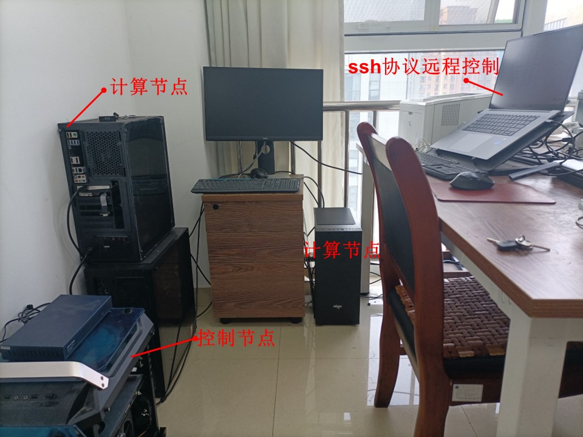

# 我的Ubuntu 20.04 集群安装

## 硬件配置
1个控制节点 + 2个计算节点

详细信息见"我的个人集群配置.xlsx"

## 软件安装

### 基本的编译和通信软件(GNU compilers + OpenMPI)
    apt install build-essential gfortran
	apt-get install openmpi-bin libopenmpi-dev

### 分布式文件系统(NFS) 安装
见"9步配置Linux网络文件系统(NFS).docx"

### 集群调度系统 (slurm) 安装
见"Ubuntu安装slurm.docx"

