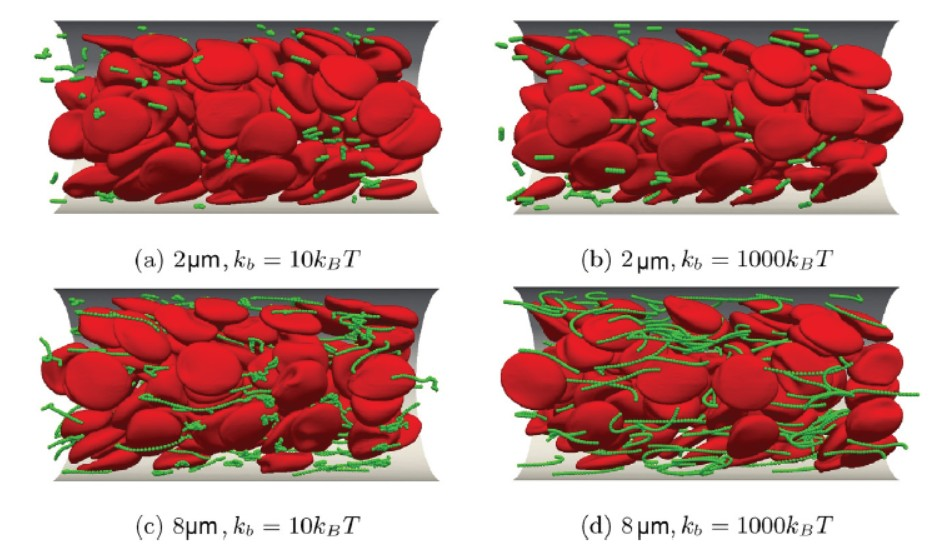

# BloodFlow
分子动力学LAMMPS + LBM模拟后端Palabos库

SENSEI在线可视化系统，实现血管中红细胞运动的模拟及可视化

## 参考文献
Jifu Tan, Talid R. Sinno, Scott L. Diamon. A parallel fluid�Csolid coupling model using LAMMPS and Palabos based on the immersed boundary method. Journal of Computational Science. Volume 25, March 2018, Pages 89-100
