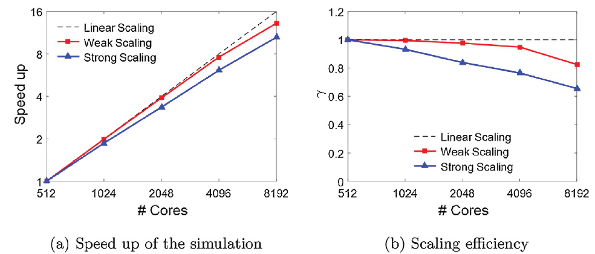

# palabos-lammps模型
流动中的颗粒运动模拟。高度可变形的颗粒，如：血细胞(血红细胞和血小板)、气泡、高分子聚合物等。描述此类问题非常有挑战。

模拟方法有2大类：

（1）conformal mesh

边界元法、Arbitrary-Lagrangian--Eulerian method (ALE) （计算量大）

（2）non-conformal mesh

浸没边界法(IBM)

基于IBM的并行化的开源流固耦合模拟代码有：

IBAMR, CFDEM (OpenFOMA-LIGGGHS), SimVascular

## palabos-lammps
流体运动使用Palabos (Parallel Lattice Boltzmann Solver),
固体位移和变形使用LAMMPS (Large-scale Atomic/Molecular Massively
Parallel Simulator)模式, 通过浸没边界法(immersed boundary method
(IBM)实现双向耦合.

## 方法
### Lattice Boltzmann fluid solver: Palabos

lattice Boltzmann method (LBM)
### Particle based solid solver: LAMMPS for deformable cells and particles 

Fig. 1. Models for a deformable red blood cell and a polymer chain
implemented in LAMMPS: (a) A particle based coarse grained red blood
cell membrane model that can bear stretching and bending. The particles
on the cell membrane are interacting with potentials. (b) A particle
connected polymer chain model with stretching and bending resistance.

### Fluid-solid coupling: the immersed boundary method

Fig. 2. An illustration of the fluid-solid coupling through the immersed
boundary method.

The solid velocity for each particle, U(X, t), is interpolated from the
local fluid velocities, u(x, t), while the solid force at each particle
F(X, t) is spread out onto the local fluid nodes, f(x, t). The influence
range of the central solid particle on fluid is shown in dashed
rectangles.

### Spatial decomposition for fluid-solid coupling

Fig. 3. Spatial decomposition for parallel computing for fluid--solid
coupling. The blood flow with cells (red lines) was divided into
multiple regions. One processor was assigned to each region to calculate
the both fluid and solid motions within the region, thus, the coupling
between fluid and solid within the region is local to the processor. On
the interface between processors, ghost layers (green stripe) we reused
for communication for both fluid and solid independently. An example of
8processors were used for the task partition in the figure.

## 测试算例
### Validation I: Ellipsoid in shear flow

### Validation II: Red blood cell stretching test

Fig. 8. (a) The deformed shape of a red blood cell under 200 pN using
2562 membrane particles (top) and 10,242 membrane particles (bottom).
(b) Comparison between the simulation results and optical tweezer
experimental results for the force diameter curve for red blood cells
under different loadings. Simulation results were presented with three
different membrane mesh size, e.g., N = 1320, 2562, and 10,242,
respectively.

### Validation III: Effective blood viscosity

Fig. 9. (a) The normalized effective viscosity for blood flowing through
tubes with different diameters. The data by boundary integral method was
from Ref. \[97\], the empirical fit curve was from Ref. \[96\]. (b) The
snapshots for the red blood cells flowing through tubes with different
diameters, showing different red blood cell shapes under flow. The
hematocrit was 30%.

### Scalability: parallel performance

Fig. 10. (a) The speed up of the simulation for strong and weak scaling
cases. (b) The strong and weak scaling efficiency of the code based on
the immersed boundary method. The dashed lines showed the ideal linear
scaling performance.

### Case study: transport of flexible filaments in flowing red blood cell suspensions 

微循环流动中药物输运

图12 Initial positions for the blood cells and filaments. The cells were
randomly distributed in the blood vessel, while the filaments were
uniformly distributed in one end of the vessel.

图13 Snapshots of the simulations of filaments (green) mixing with blood
cell suspensions (red) at 8×106time steps. 2 m filaments with bending
stiffness 10kBT (a)and 1000kBT (b); 8 m filaments with bending stiffness
10kBT (c) and 1000kBT (d). Half of the vessel wall was also shown in the
figure.
