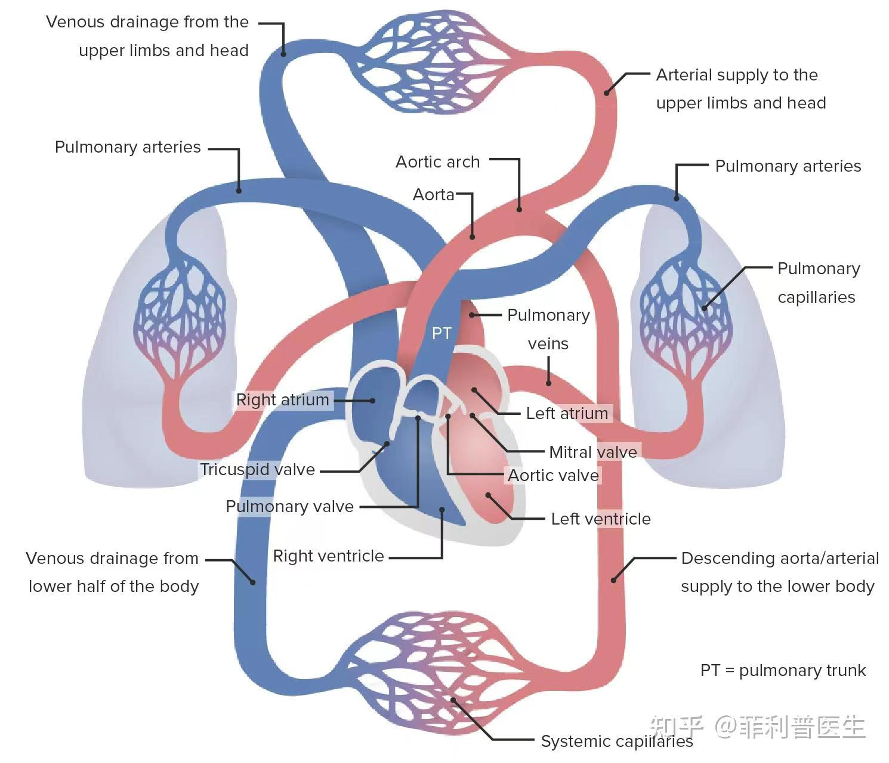

# Hemodynamics
血液动力学CFD

心血管循环系统

## SimVascular
心血管血液流动的全流程CFD模型, 包括： SimVascular (前处理), svFSI (FORTRAN), svFSIplus (C++), svSolver(0D, 1D, 3D)

## lifex-CFD
基于deal.II库开发的血液动力学CFD模型

## OasisMove
基于FEniCS框架开发的血液动力学CFD模型

## bloodFlow
