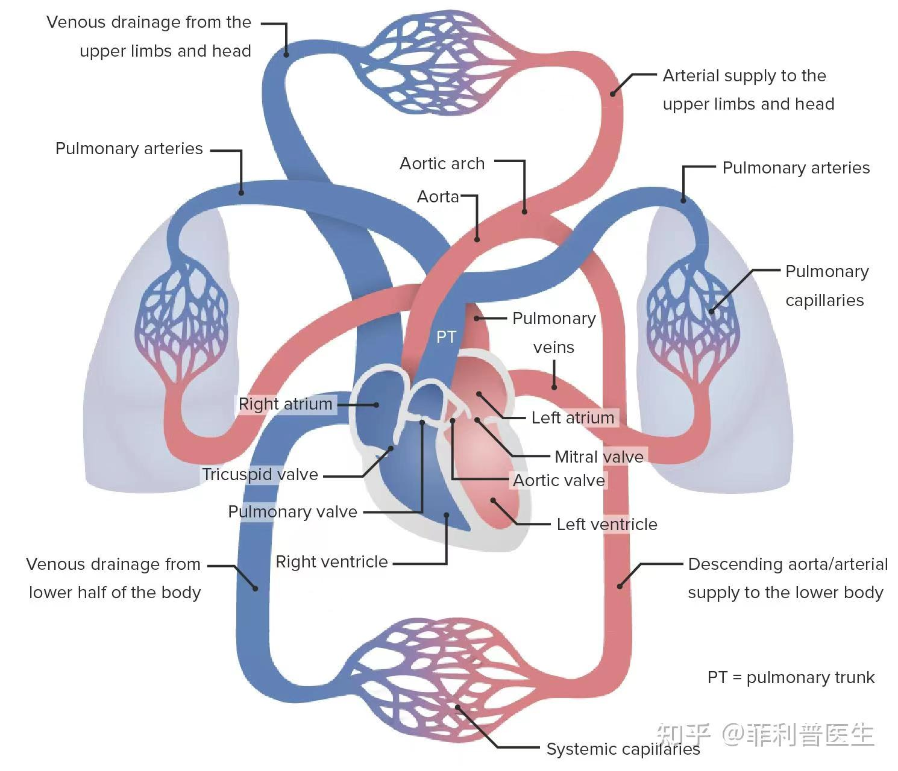

# Hemodynamics

血液动力学 CFD。

心血管循环系统示意。

## 子目录

- [SimVascular](./SimVascular/)：全流程心血管血液流动 CFD（前处理 SimVascular；svFSI / svFSIplus / svSolver 等）
- [lifex-cfd](./lifex-cfd/)：基于 deal.II 的血液动力学 CFD
- [OasisMove](./OasisMove/)：基于 FEniCS 的血液动力学 CFD
- [BloodFlow](./BloodFlow/)：血液流动相关文档与笔记

## 相关文档

- [Turbulence](../Turbulence/)：通用 CFD / OpenFOAM 对照
- [Meshing](../Meshing/)：血管网格前处理思路
- [VirtualReality](../VirtualReality/)：结果可视化
- [hpc-base](../hpc-base/)：PETSc、Trilinos、MPI 等依赖
