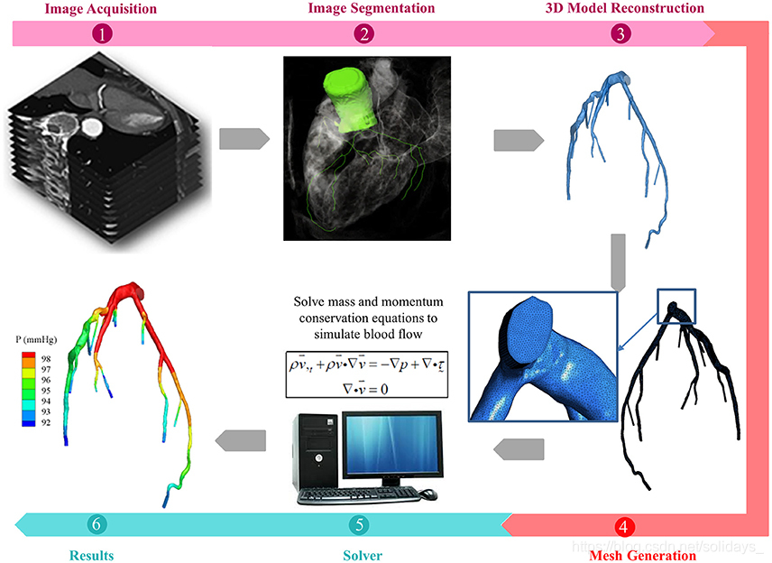
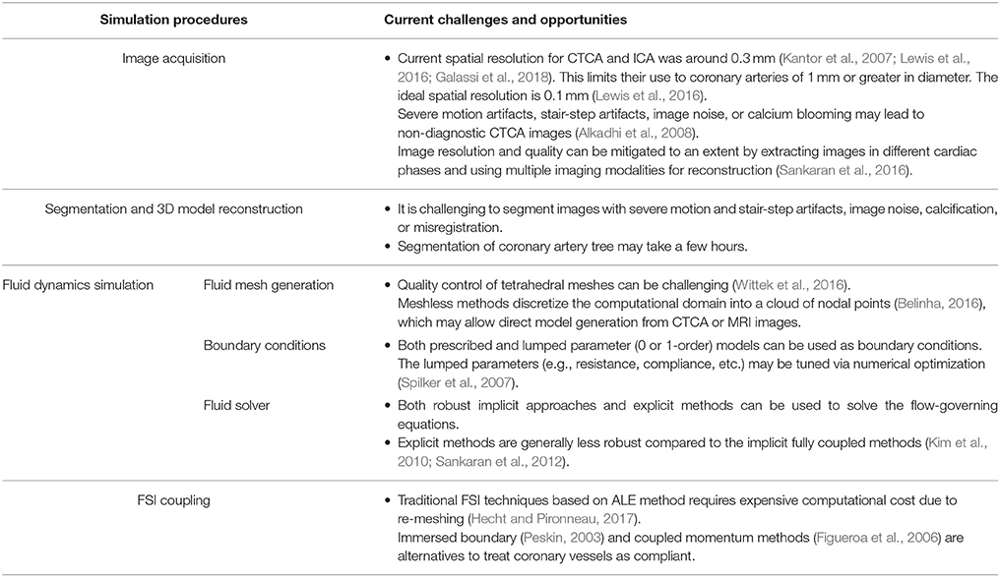
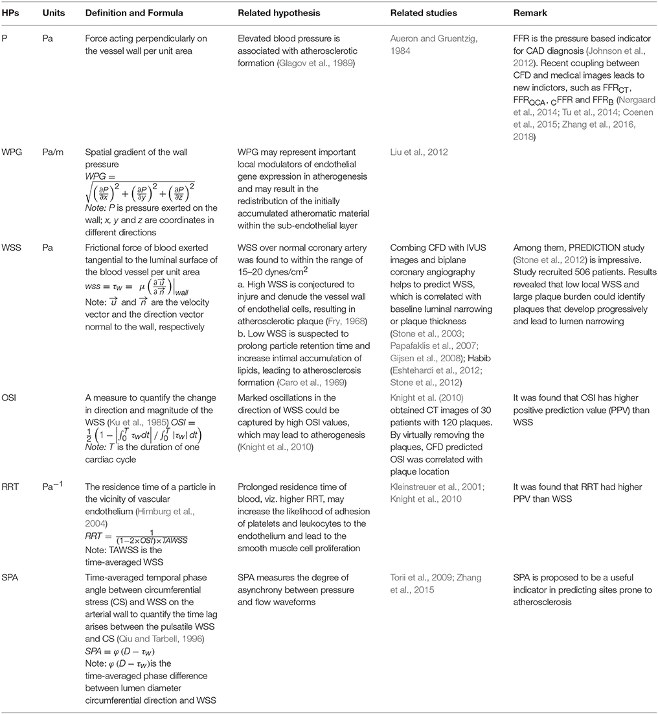
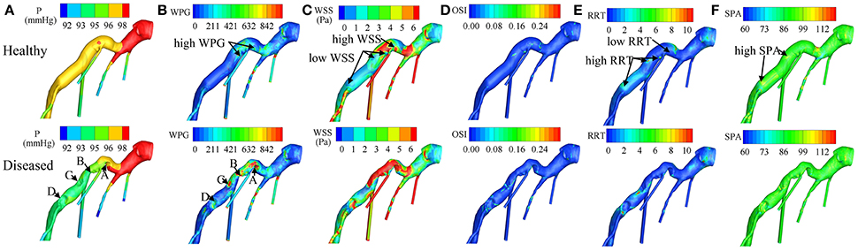
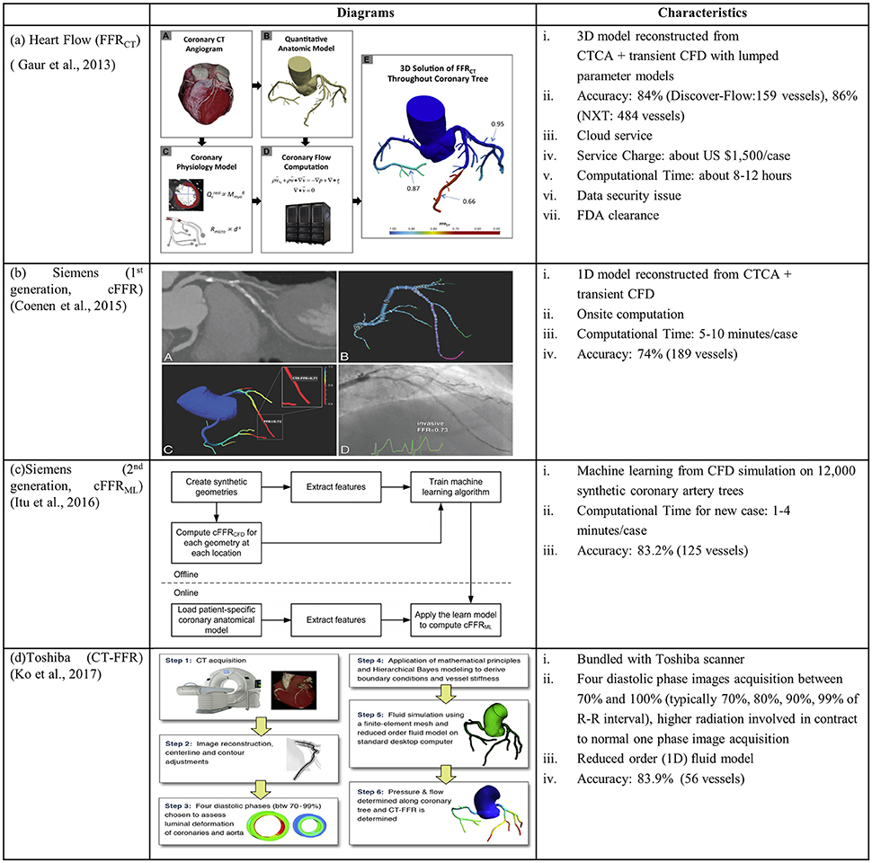
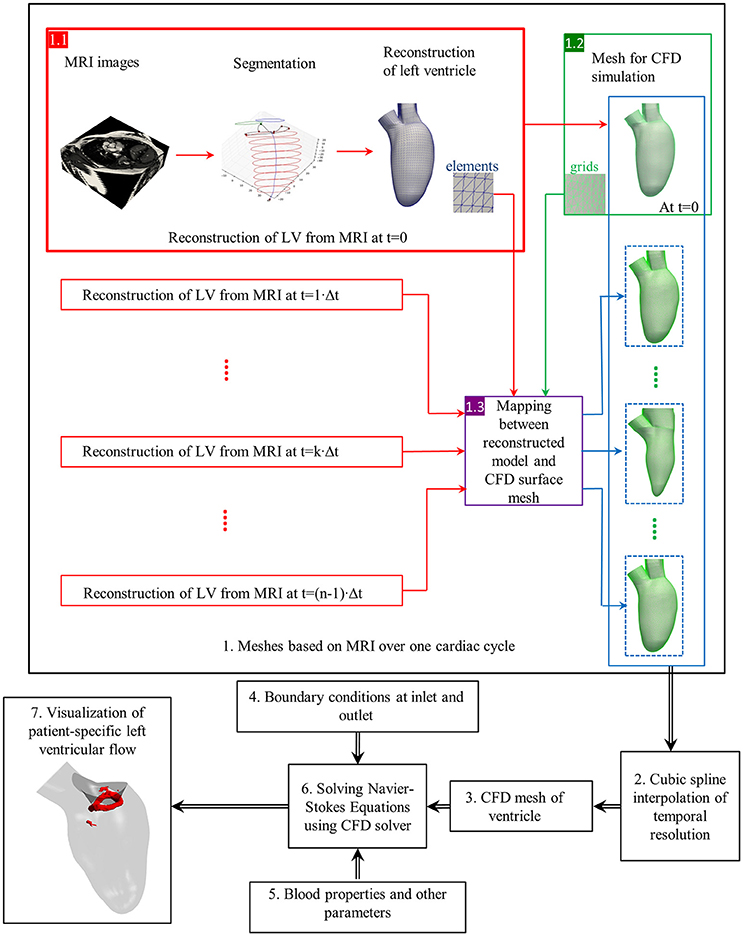
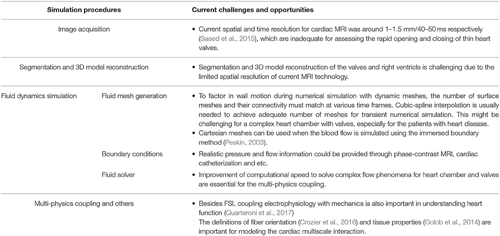
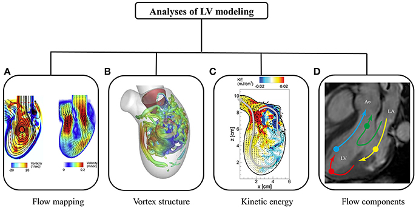
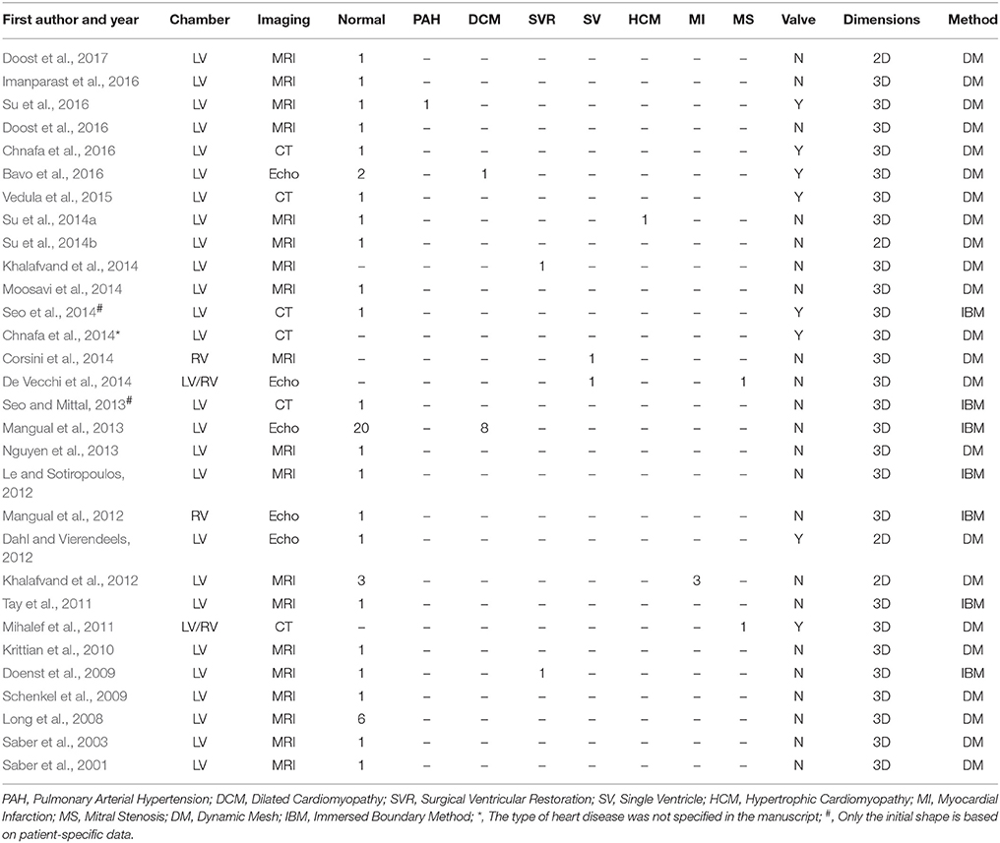
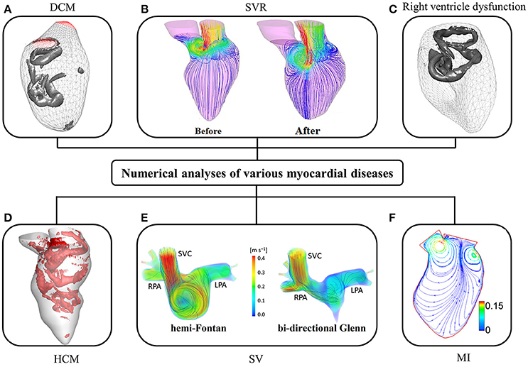

# 特定于患者的计算流体动力学在冠状动脉和心脏内血流模拟中的应用

https://blog.csdn.net/solidays\_/article/details/104152670

## 摘要

心脏的新型心脏诊断和治疗方法的出现引起了针对特定患者环境的虚拟设计和技术测试领域的挑战。鉴于医学成像，计算能力和数学算法的最新进展，可以比以往更快，更有效地从心脏图像生成患者特定的心脏模型。特定于患者的计算流体动力学（CFD）的出现为计算机辅助诊断的新领域铺平了道路。本文概述了CFD方法，在冠状动脉和心脏内血流模拟中的挑战和机遇。它包括对市场产品和临床试验的评论。简要介绍了针对特定患者的CFD的关键组成部分，包括图像分割，几何重建，网格生成，流固耦合以及求解器技术。

## 简介---冠状动脉疾病，心脏功能障碍和诊断

在冠状动脉疾病（CAD）中，动脉粥样硬化的堆积可使动脉管腔变窄，从而导致心肌缺血。在一般人群中，CAD的患病率为6％，在65岁以上的人群中CAD的患病率高达20％。约13％的死亡是由于CAD。到2030年，预计15％的男性死亡将归因于CAD。

\*\*可以通过解剖学参数（例如直径狭窄）或与冠状动脉心肌缺血相关的功能参数来诊断CAD。\*\*狭窄并不会一定程度地损害远端冠状动脉血流，这对于中间冠状动脉病变（即直径狭窄在30％至70％之间）尤其如此。心肌缺血的非侵入性测试（例如核心肌灌注成像，应力超声心动图）可确定相对冠状动脉血流储备最严重减少的区域。对于每位患者而言，它们对于心肌缺血的检测是相当准确的，但是在量化单个冠状动脉局部缺血的严重程度方面，它们的表现较差。后者与多支血管经皮冠状动脉介入治疗（PCI）有关，其中冠脉生理信息，覆盖在患者特定冠状动脉解剖结构的详细地图上，指示管理决策。**在腺苷引起的充血下的有创冠状动脉造影（ICA）期间测量的分数血流储备（FFR）已成为评估冠脉血流生理和冠状动脉局部缺血的金标准（Johnson等，2012年）。**

诊断心脏收缩功能障碍需要表现出舒张功能或收缩功能异常。确定舒张功能障碍的金标准是在左心室（LV）的情况下，有创测量的心室舒张末期压力升高-\>
15 mmHg（Nishimura and
Tajik，1997）。收缩功能障碍通过等容性收缩期间最大心室压力（P）的变化dP /
dt
max进行评估（Yamada等，1998）。使用电导导管在变化的负荷条件下测定的多个心室压力-容积环可产生舒张末期（E
ed）和收缩末期弹性（E es）分别表征心室舒张功能和收缩功能障碍（Burkhoff
et
al。，2005）。**新兴的无创超声心动图和心脏磁共振（MRI）成像技术**可对包括应变和应变率（Zhong
et
al。，2012），弯曲度（三维心室形状的描述子）和弯曲度的区域和整体心室功能障碍进行确证评估（Zhong等，2009），心室收缩力dσ\*
/ dt
max，其中σ\*为压力标准化壁应力（Zhong等，2014）和房室速度（Leng等，2016）。

特定于患者的计算流体动力学（CFD）建模是最近的发展。非侵入性FFR（FFR~ct~）源自使用计算机断层扫描冠状动脉造影（CTCA）采集的图像的CFD建模。与侵入性FFR作为金标准，FFR~ct~ ≤0.80优越于CTCA和ICA确定用于确定缺血直径狭窄冠状动脉区域的基础上（Min等人，2012）。仅可通过HeartFlow公司基于集中式商业网络的服务来进行FFRCT分析。费时的计算需求以及高昂的成本-处理一个案例需要花费6小时和2000美元（Kimura等人，2015）-阻碍广泛的临床采用。敏感的机密患者信息和相关医疗状况的必要的异地处理是一个非常棘手的问题，涉及IT安全性，数据滥用的可能性等。

与冠状动脉血流模拟不同，由于对心脏内血流建模的复杂性，对心脏内血流的CFD研究主要局限于研究目的。实际上，冠状动脉和心脏内的血流紧密相连。冠状动脉功能障碍导致心肌缺血，心脏内血流为全身循环提供血液，包括冠脉循环。长时间未治疗的心肌缺血可能会增加死亡或心肌梗塞的风险（Iskander和Iskandrian，1998年）。为了能够全面评估心脏循环病理生理，需要对冠状动脉和心脏内血流模拟进行进一步集成。本文旨在为集成模拟铺平道路，并着重研究CFD在冠状动脉和心脏内血流建模中的应用进展。CFD在心血管疾病中的其他应用可以在Morris等人的文章中找到。（2015）。

## 冠状动脉血流模拟------用于研究冠状动脉血流的患者专用模拟技术的挑战和机遇

**通常，针对患者特定的冠状动脉树执行CFD模拟所涉及的任务如下**：（1）图像采集和分割，以重建3D患者特定的冠状动脉模型；（2）CFD预处理，用网格离散化域并定义边界条件；（3）使用流体求解器求解流体控制方程，并进行后处理以可视化流场（图1）。如果考虑流体结构相互作用（FSI），则使用附加的固体求解器，并实现流体和固体求解器之间的耦合。表1总结了所涉及的挑战

图1。特定患者模拟冠状动脉血流过程的示意图，包括（1）CTA或ICA图像的采集（2）采集图像的分割（3）3D模型的重建（4）网格生成以离散化3D模型（5）求解质量和动量守恒方程以模拟冠状动脉中的血流，如果考虑FSI，还将激活固体求解器，以及（6）进行模拟。

表1冠状动脉数值模拟的当前挑战和机遇

**冠状动脉解剖可使用ICA，血管内超声（IVUS），光学相干断层扫描（OCT），CTCA和MRI进行成像（Zhang等，2014）**。侵入式IVUS和OCT产生了冠状动脉的高分辨率横截面图，可以与双翼ICA结合使用来重建3D血管模型。由于无创CTCA具有比MRI和超声心动图更高的空间分辨率，因此被广泛用于3D患者特定的冠状动脉模型重建。然而，目前的CTCA具有约0.3mm的空间分辨率，这限制了其在直径为1mm或更大的冠状动脉中的使用。尽管在这样的小血管中通常无法确定CAD的特征，也无法测量FFR，但后者对于表征冠状动脉微循环至关重要。

通过将双翼ICA与IVUS图像融合（Papafaklis等人，2007）或直接从水平集分割（Bekkers和Taylor，2008）等复杂的分割方法中，已经应用到重建2D和3D患者特异性冠状动脉模型。
CTCA图像（Torii等，2009）。商业（例如3D
Doctor，Mimics，SliceOmatic，Amira）和开源通用图像处理工具\[例如VTK，ITK，ITK-SNAP，VTK，Analyze和ImageJ（或斐济）\]可以重建针对患者的从医学图像中建立模型。此外，它们的插件功能可轻松自定义细分工具。诸如钙化，运动和重合失调等伪影很难通过分割技术克服，并且仍然具有挑战性。

在模拟工具方面，诸如ANSYS（包括ICEM，FLUENT，CFX），STAR-CCM之类的商业软件和开源工具（例如OpenFOAM）可用于通用CFD模拟，包括模拟冠状动脉的血流。SimVascular（Schmidt等人，2008）是一种专用工具，用于模拟血管中的血流。这些工具允许用户指定网格生成，边界条件设置等。关于网格，网格生成方案可以分为结构化或非结构化网格。结构化网格生成器，包括"块结构化"技术（用于ICEM
CFD，TrueGrid和IA-FEMesh），通常需要复杂的迭代平滑过程才能使元素与边界或物理域对齐。对于从医学图像重建的复杂3D冠状动脉模型，通常需要非结构化网格，这些网格是基于节点坐标和节点之间的连接以形成元素而构建的。商业软件包（例如ANSYS，TGrid）和开放源代码（例如TetGen，gmesh）**允许使用四面体网格自动离散复杂的几何形状**。Wittek
et
al。，2016）。先进的前端方法（例如Delaunay三角剖分方法）可以更好地控制网格质量，但以延长的计算时间为代价。此外，四节点四面体单元还参与了人工加固，这在建模软组织（例如冠状动脉壁）方面提出了挑战（Wittek等，2010）。高阶和​​混合配方的四面体元件可以帮助克服这些挑战。然而，它们的计算成本比四节点四面体单元高约四倍（Bourdin等，2007）。为了克服在有限的时间内为复杂的几何体生成高质量网格的困难以及在对具有大变形的结构进行建模时难以收敛的问题，无网格方法被认为是一种可能的解决方案（Doblare等，2005）。无网格方法将计算域离散为节点点云（Belinha，2016）。这种离散灵活性可以允许从CTCA或MRI图像直接生成模型。然而，无网格方法也有很多缺点：（i）严格的数学证明有限；（ii）理论不完整；（iii）与使用网格的传统计算方法相比，其计算效率较低（Zhang等，2012）。

为了获得可接受的冠状动脉血流模拟，适当的边界条件至关重要。尽管可以从文献中获得流量和压力波形，但要进行精确的模拟，必须进行体外和体内测量。对于许多CFD应用而言，由于很难获得冠状动脉的同时测量值，因此实际上不可能事先知道流量和/或压力波形。为了解决此问题，已经开发了多尺度模拟，该模拟在边界上将3D模拟与降阶（1或0维）模型耦合在一起。这些模型表征了上游和下游脉管系统中的压力和流速（Kim等，2010）作为电阻，顺从性和阻抗。如何确定这些患者特定参数的值仍然是一个难题。尽管形态学信息（例如缩放定律）已被广泛使用，但可能需要进行数值优化来调整这些患者特定的参数（Spilker等，2007）。

多尺度模拟中的另一个障碍是如何使用降阶模型作为边界条件来求解流量控制方程。健壮的隐式方法和显式方法都已使用。显式方法不需要更改数值算法来求解控制方程（Sankaran等，2012），尽管与隐式完全耦合方法（Kim等，2010）相比，它们通常不那么健壮。

FSI技术的最新进展已允许将冠状动脉视为顺应性。在传统的任意Lagrangian-
Eulerian（ALE）方法（Malvè等，2012）中，在迭代过程中可以精确地跟踪流体和结构计算域的边界和界面。当考虑心脏运动时，经常需要重新划分计算域以保持网格质量，这会大大增加计算成本。多年来，ALE方法的稳定性得到了改善（Hecht和Pironneau，2017年）。

用于在存在运动边界的情况下模拟流动的替代FSI技术包括沉浸边界法和耦合动量法。这些使用固定的流体网格，其边界由一组移动的拉格朗日点（Peskin，2003年）或线性膜（Figueroa等，2006年）定义。尽管已使用规定的心脏运动来模拟左（Prosi等人，2004）和右（Torii等人，2010）冠状动脉的血流，但更有效，更强大的FSI技术对于模拟冠状动脉的大变形是必要的考虑到心动周期中的心脏运动时的动脉。

流固相生长模型的最新发展将受应力介导的生长和重塑（G＆R）控制的血管壁几何形状，结构和特性纳入FSI模拟中（Figueroa
et
al。，2009）。这样，可以更好地理解生物流体力学，生物固体力学和生物运输现象，例如动脉生长，重塑和适应（Valentín等人，2013）。近来，机器学习已被纳入CFD仿真中以减少计算时间，并结合了由一组离线CFD仿真生成的数据库所训练的特征（Sankaran等人，2015
;
Itu等人，2016）。Sankaran和Marsden（2011）开发了一种自适应搭配算法来量化输入不确定性对心血管模拟的影响。Sankaran等人使用数据驱动的框架。（2016）研究了解剖和生理不确定性（例如，各种边界条件和血液粘度）对血流模拟的影响。这些将CFD数据用于丰富和完善模型的数据驱动的建模方法可能会在将来流行。

另外，假设血液为牛顿流体仅对高于100 s
-1的剪切速率有效，而当在冠状动脉狭窄附近形成血流再循环区域时可能不成立。已通过各种单相和多相非牛顿血液动力学模型研究了血液的非牛顿特性对速度分布和剪切稀化的影响（Jung等，2006）。在牛雷诺数为100或更少的情况下，非牛顿特性对整个动脉狭窄的总体压降有影响（Cho和Kensey，1991）。

应用特定于患者的CFD技术诊断冠状动脉疾病严重程度的挑战和机遇\
最近针对患者的CFD模拟提供了详细的血液动力学参数（HP）信息，例如压力（P），壁压力梯度（WPG）（Liu等，2012），壁切应力（WSS）（Papafaklis等，2007
;
Stone等人，2012），振荡剪切指数（OSI），相对停留时间（RRT）和应力相角（SPA）（Knight等人，2010），可表征冠状动脉壁上的HP分布。这些HP的定义（表2）及其在左冠状动脉树中的分布图（图2））。在模拟中，将压力和阻力边界条件分别分配给入口和出口。在墙壁上施加了防滑条件（Zhang等，2015）。

表2 由CFD预测的血液动力学参数（HPs）与CAD（冠状动脉疾病）相关

\
图2 的分布（A） P（压力），（B） WPG（壁压力梯度），（C）
WSS（壁剪切应力），（d） OSI（振荡剪切指数），（E）
RRT（相对保留时间），及（F）
SPA上几乎健康和患病左冠状动脉树分别（应力相角）。（A--D）的标签指出狭窄的位置。在实际上健康的动脉模型中，在形成狭窄的四个部位中，三个部位表现出低WSS和高RRT，第四部位表现出具有低RRT的高WSS。这些发现表明，冠状动脉斑块更有可能在低WSS和高RRT或高WSS和低RRT的位置形成。

在HP中，压力与FFR密切相关（Johnson等，2012），FFR是ICA期间获得的远端狭窄压力和充血时主动脉压力的比率。几个小组已经尝试了无创计算FFR的替代方法。

Heart Flow公司是将CTCA图像与CFD相结合以计算CAD诊断中的非侵入性FFR
CT的先驱。Kim等人（Kim等人，2010年）通过从CTCA图像重建3D特定于患者的冠状动脉模型，并将集总参数模型耦合到流体控制方程的隐式求解器，开创了非侵入性FFR
CT（图3A）。多中心临床试验DISCOVER-FLOW，DeFACTO和NXT（Koo等人，2011年；Min等人，2012年；Nørgaard等人，2014年）证明了FFR
CT优于单独的CTCA的诊断准确性。PLATFORM试验（Douglas等，2015）（Lu等，2017）证实了与诊断标准相比，FFR
CT作为诊断可疑CAD患者的诊断策略的可行性和安全性。REAL-FFR
CT（Kawaji等人，2017）即使在血管严重钙化的患者中也表现出良好的FFR
CT诊断性能。最近，HeartFlow的FFR
CT软件已被FDA批准用于无创测量冠状动脉阻塞。但是，它使用云技术上传了CTCA图像并下载了FFR
CT报告。这可能会涉及会阻碍现场计算的数据安全性问题。

图3（A） Heart Flow：FFR
CT（Gaur等人，2013）；通过将CTCA与CFD相结合来计算非侵入性FFR的图表和特性。（B）西门子（第一代：cFFR）（Coenen等，2015）;
（C）西门子（第二代：cFFR ML）（Itu等人，2016）; 和（d）东芝：（CT-FFR
。Ko等人，2017）

为了促进西门子公司支持的现场FFR计算，Coenen等人。将冠状动脉建模为一维片段，并采用降阶模型来模拟冠状动脉循环。这样，每位患者的计算时间减少到5-10分钟（Coenen等，2015）。计算的压力信息，即。计算FFR（cFFR）被映射到从CTCA图像重建的3D模型上（图3B）。但是，cFFR和FFR之间的相关性很差（r = 0.59）。为了进一步减少计算时间，西门子的Itu及其同事应用了机器学习方法来计算cFFR ML，并从训练数据库中提取了特征（Itu等人，2016）。该数据库由人工合成的冠状动脉模型和从CFD算法计算得出的相应FFR值组成（图3C）。

东芝医疗系统公司核心实验室的Ko及其同事进行了另一种将计算时间减少到30分钟以下的尝试（Ko等人，2017年）。与上述研究不同，在RR间隔的70％，80％，90％和99％的相位上获取并重建了4张CTCA图像。考虑了动脉腔变形，并使用降阶流体模型来模拟冠状动脉树中的一维压力和流量分布（图3D）。在这种方法中，虽然不是完全耦合的FSI模拟，但在某种程度上考虑了流体与结构之间的相互作用。

除CTCA图像外，在从ICA重建的患者特异性冠状动脉模型中，已尝试使用CFD模拟得出FFR
QCA。在一项涉及77个冠状血管的研究中（Tu等人，2014年），FFR
QCA与冠状动脉造血功能密切相关。金标准FFR（r = 0.81，p \<0.001）。有创FFR
QCA消除了对压力线/导管和腺苷的需求。QFR进一步从使用固定经验流速的3种流动模型得出；建模的充血流速由测量的血管造影术（不给予腺苷）和充血流速分别得出（Tu
et al。，2016）。QFA的诊断准确性已在FAVOR II China（Xu等人，2017）和WIFI
II（Westra等人，2018）研究中进行了测试。基于此方法，开发了Medis QAngio
3D XA软件来计算QFR。

Morris等人还研究了将冠状动脉血管造影图像与CFD模拟相结合。（2013）估计具有通用边界条件的虚拟分数流储备（vFFR）。因此，开发了VIRTUheart软件来简化vFFR的计算。CathWorks是将冠状动脉造影和CFD模拟相结合的另一种可用于基于FFR模拟的服务的工具。

Poon等人使用了带冠状动脉造影的OCT输注。（2015年，2017年），试图重建船只并计算虚拟衍生的FFR。

基于涉及血管结构调节的生物力学力，已经考虑了与CAD
相关的其他HP（表2）（Langille和O'Donnell，1986）。其中，WSS研究最多。WSS是每单位面积切向施加到血管腔表面的血液摩擦力。对于正常动脉，WSS通常在15-20达因/
cm
2的范围内（Kassab和Navia，2006年）。超出此范围的异常WSS会促进动脉粥样硬化的形成。有两种相互竞争的理论。在犬胸主动脉内皮细胞（EC）的体外实验中，当WSS\>
379 dynes / cm
2时，EC变得异常（Fry，1968）。这意味着高WSS可能会伤害并剥夺EC从而导致动脉粥样硬化。相反，Caro等。WSS
\<6 dynes / cm
2时发现内膜增厚和动脉粥样硬化（Caro等，1969）。他们推测，低WSS与延长的颗粒保留时间和脂质的内膜积累增加有关，从而导致动脉粥样硬化。实际上，Rutsch等人。提出了将受干扰的WSS与EC机械化学转导相关的几种信号通路（Rutsch
et al。，2011）。

CFD已在理想化和特定于患者的冠状动脉模型中用于研究HP分布，特别是WSS（Papafaklis等，2007）。PREDICTION研究（Stone等人，2012年）招募了506位PCI患者，研究了PCI后6至10个月内374个亚组（74％）的斑块形成的自然史。对于通过合并冠状动脉内IVUS和双翼ICA图像重建的3D冠状动脉模型，计算了WSS。发现大的斑块负担和低的局部WSS是独立的，并且是斑块进展和管腔变窄的附加预测因子。目前正在进行其他临床试验，以研究HP与冠状动脉粥样硬化之间的潜在联系（Antoniadis等人，2015年）。这些预示着令人兴奋的可能性，这些发现可能会确定可用于CAD诊断和患者管理的指标。

## 心脏内血流模拟------特定于患者的模拟研究心脏内血流的挑战和机遇

图4说明了基于心脏MRI图像对左心室血流进行CFD模拟的一般过程（Su等，2015）。==图像包括长轴和一堆12--14个短轴图像，这些图像覆盖了从顶点到基点的LV。典型的切片厚度为8毫米；每个心动周期的典型帧速率为20--40。手动或自动分割短轴图像，其中血池不同于心肌，乳头肌包括在血池中。长轴图像用于跟踪左心房和左心房相交处的二尖瓣环，由于通面移位，在短轴图像上不易将其分割。采用类似的方法在LV流出道上构建主动脉瓣环。由此生成基于分割的患者特定模型（步骤在图4的
1.1中用红色矩形突出显示）。

图4
特定于患者的心脏内血流的CFD模拟流程图。黑匣子：数值模拟的每个步骤（Su等，2016）。红框：根据MRI图像重建左心室。绿框：CFD网格生成。紫色框：重建模型和CFD曲面网格之间的映射。蓝色虚线框：CFD网格由映射产生。蓝框：每帧包含一系列CFD网格。元素（蓝色）和网格（绿色）分别用于重构的几何和CFD网格。

接下来，使用内部或商用网格生成器（例如ANSYS ICEM CFD，STAR-CCM
+）将复杂的3D模型离散为四面体，六面体或多面体网格。经常采用**四面体网格**，当基于弹簧的平滑无法应对较大变形时，需要重新网格化。多面体网格具有出色的收敛速度（Spiegel等人，2011），并且可以轻松地用于FSI仿真。为了在数值模拟过程中考虑壁运动，表面网格编号及其连接性必须在每个时间步都匹配。通过利用特定于患者的模型内的一致拓扑，可以根据相应的LV几何以及在第一个时间步的3D模型与表面网格之间的相关性，在其他时间范围内生成表面网格。通常使用三次样条插值，因为MRI的帧频不足以进行数值模拟。

在使用沉浸边界方法的模拟中（Peskin，2003年），通常将笛卡尔网格应用于血域，其中LV表面由三角形小平面组成。换句话说，可以直接使用特定于患者的模型来跳过离散化步骤。

在求解Navier-Stokes方程之前，使用适当的血液属性初始化入口和出口的边界条件。从速度编码成像模式（例如相衬MRI扫描）测量的心脏血流曲线可用于指定入口和出口边界条件（Wong等，2017）。主动脉/肺动脉压只能通过侵入性方式进行测量，而这可能并非总是可行的。

此外，心脏是一个复杂的多尺度系统，涉及心脏电生理与肌肉组织的相互作用，瓣膜的快速打开和关闭以及在心动周期期间壁大变形（Quarteroni等，2017）。为了考虑电生理学和心脏力学之间的耦合，纤维取向/结构信息对于模拟电传导和相关力的产生是必要的（Crozier
et
al。，2016）。由于体内很难获取纤维结构（Toussaint等人，2013），因此使用"基于规则"的方法将纤维方向分配给心室心脏模型，其中不包括心内膜和壁内结构中的纤维结构（Bayer等人，2012）。"基于Atlas的"方法使用网格变形过程将与扩散张量MRI纤维数据关联的网格映射到理想化的模板网格上。这样，纤维结构信息可以自动合并到新的患者特定模型中（Vadakkumpadan等，2012）。

本构模型和材料参数的适当选择以代表计算研究中的瓣膜是与心脏瓣膜力学相关的另一个主题。==在Rausch等人的研究中。（2013年），二尖瓣的建模如下：（i）Neo-Hooken各向同性非线性增生模型（忽略二尖瓣小叶组织的各向异性微观结构；（ii）耦合的May-Newman模型来表征整个二尖瓣的异质性反应瓣膜复合体；（iii）解耦的Holzapfel模型代表动脉组织的各向异性，后两种模型相对于第一种模型产生较小的局部位移误差。

心脏组织特性是用于建模心脏多尺度相互作用的其他重要参数。==但是，在大多数情况下，使用心脏组织力学测试系统进行体外组织特性测量（Golob等，2014）不适用于外周。通过压力-体积环分析估计材料刚度可能是一种实用的方法（Pironet等，2013）。通过将血流动力学方程与生化对流-扩散-反应（CDR）方程耦合，对流动介导的血栓生成进行建模变得可行（Mittal等，2016）。表3总结了特定于患者的心脏内血流模拟的挑战。

表3 心内流数值模拟的当前挑战和机遇

图5总结了心脏内血流的各种后处理分析。流量映射有助于可视化整个心动周期的流量模式。舒张期血流的特征是顺时针前涡流，据信它可以保持动量并将血流引向流出道（Chnafa等，2014）。流映射一次描绘了一个复杂3D
LV流的一个2D切片。因此，3D涡旋结构是优越的，并已在文献中得到广泛应用。\

图5心脏内血流的后处理，显示（A）血流图（Seo等，2014）；（B）涡结构（Seo等，2014）;
（C）动能（Seo和Mittal，2013年）; 及（d）流动成分（Svalbring等人，2016）

在正常受试者中，在快速充盈阶段观察到涡流环，这是由于二尖瓣尖端处的流量分离所致（Seo等人，2014年）。涡流环与心内膜相互作用并消散（即，在透析过程中分解成较小的涡流）。尽管在穿透距离方面较弱，但在心房收缩过程中再次产生了另一个涡流环。2D流量映射和3D涡流结构都可以对LV流量进行定量分析。

已经提出了许多参数来量化心脏运动期间的动能和能量损失。收缩期的泵浦效率定义为通过主动脉的机械能总通量与心肌的血流消耗功率的比值（Seo等，2014）。相反，基于压力-容量循环的心肌效率被定义为收缩期功与心肌能量消耗之比。动能耗散与流场密切相关，是将能量耗散为热量。由于涡流形成，在具有复杂流场的区域中预计会有相对较高的能量耗散。由于能量耗散对流场敏感，因此已被用于诊断心室功能不全（Mangual等，2013）。

为了量化穿过LV的血液传输，在几个心动周期中获得了许多无质量颗粒的轨迹（Pedrizzetti和Domenichini，2014年）。根据血流轨迹，舒张末期容积可分为四个亚组：（i）直流血流，一种心跳期间通过心室的血液；（ii）保留血流，血液在心脏舒张期进入，但在心跳一跳时并未退出；（iii）血流延迟，血液在较早的心动周期进入脑室，但在当前周期退出；（iv）在多个心动周期中残留在心室中的血液的残留量。体内研究表明，直接流量和残余流量（≥2个循环）分别约占舒张末期容积的37％和30％（Eriksson等，2011）。尽管据信较大的残留量可能促进血栓形成，但尚未阐明四个体积亚组相对分布的临床意义。数值研究之间的巨大差异（Mangual等，2013；Seo和Mittal，2013）可能是由于不确定性，假设和方法的不同所致。

## 使用特定于患者的CFD技术诊断心脏功能障碍的挑战和机遇

在外科手术和介入计划中，数值模型有望用于预测手术结果。Corsini和同事比较了单脑室畸形患者的两种手术选择（Corsini等，2014）。第二个应用是增进对心肌疾病和外科手术对心室血流的影响的了解。Su和他的同事推断，HCM可以在舒张期阻滞涡流环的形成，因为狭窄的LV腔室会延迟气流分离并加剧能量消散（Su等人，2014a）。尽管已经研究了心肌疾病对心室血流的各种影响，但这些数值研究中的样本量太小，无法提供有意义的见解。

自1990年代以来，进行了包括心脏室内血流在内的心脏功能研究（Hunter等，2003；Sugiura等，2012）。由于成像技术的局限性，早期的研究主要集中在理想模型上，特别是从嘈杂的数据中分割图像。表4总结了更多当代已发表的针对患者的数值研究，其中大多数研究集中在LV而不是RV（几何比LV复杂）上。如表4所示，很少有研究采用从超声心动图图像重建的3D模型（Mangual等人，2013）。==在各种成像方式中，由于出色的软组织对比度以及没有电离辐射，MRI被最广泛地使用。==根据我们的经验，当前商业（例如3D
Doctor，Mimics，SliceOmatic，Amira）和开放式（例如ITK，ITK-SNAP，VTK，分析）软件包的准确性取决于处理MRI的用户的经验图片。这是广泛采用数值研究的障碍。大多数研究集中于正常受试者，心肌病病例相对较少，例如，右心室（RV）功能障碍（Mangual等，2012），扩张型心肌病（Mangual等，2013），肥厚型心肌病（HCM）（Su
et al。，2014a），单心室（Corsini et
al。，2014）和心肌梗塞（Khalafvand等，2012）（图6）。\
\
表4 已发布的患者特定的心室CFD模拟

图6心脏内血流的CFD模拟显示（A）扩张型心肌病（DCM）中的涡流形成（Mangual
et al。，2013）;
（B）手术室恢复（SVR）前后的血流速度分布（Khalafvand等，2014）;
（C）右心室的涡流形成（Mangual等，2012）；（D）肥厚性心肌病（HCM）中的涡流形成；（E）单心室（SV）的血流速度分布（SVC，上腔静脉；
RPA，右肺动脉； LPA，左肺动脉）；以及
（F）左室心肌梗死（MI）的血流速度分布（Khalafvand et al。，2012）。

尽管瓣膜小叶动力学相对于涡流形成机制和穿透深度会影响脑室内血流的发展，但由于当前的MRI和CT图像时空分辨率不足以评估薄型心脏瓣膜的快速打开和关闭，因此在大多数研究中并未将其考虑在内。尽管二尖瓣由Seo等人合并。（2014），该模型不是完整的针对患者的模型。仅初始几何形状基于患者特定的CT数据，而其余几何形状仅根据理想模型进行扩张。此外，二尖瓣运动是预先定义的，而不是基于患者特定的数据。Mihalef等。（2011年）研究了患有严重二尖瓣狭窄和反流的患者。舒张期向心尖的预期强向前射流和收缩期向心房的反向平衡被抵消，从而避免了小叶动力学和左室容积变化之间的不匹配。

FSI（Kalafvand等人，2011 ; Domenichini and Pedrizzetti，2014 ;
Doost等人，2016）是一种对瓣膜运动进行建模的可行解决方案，该方法迄今为止仅应用于二维研究（表4）。）。基本上，有两种方法可以模拟心动周期中的心肌变形：动态网格和浸入边界方法。体积网格变形以适应动态网格方法中边界（例如心室）的运动。而在浸入式边界法中，建模是使用固定网格并在Navier-Stokes方程的边界附近施加力以考虑心室壁效应来完成的。尽管沉浸边界方法避免了在网格生成和变形过程中潜在的网格划分失败的问题，但是必须添加其他功能以获得解决方案，这会导致额外的计算成本。

## 结论

美国食品药品监督管理局等监管机构已经意识到计算机建模和仿真在监管审批流程中的价值（Malinauskas等，2017）。当局鼓励使用模拟来补充实验台，动物和人体测试。包括模拟在内的FDA应用越来越多。心流的FFR
CT该软件已被美国FDA批准用于非侵入性测量冠状动脉阻塞。由于大多数医疗保健从业者和组织都不熟悉针对特定患者的CFD的技术，计算和模拟方法，并且该方法尚未得到充分开发，因此对于采用该方法存在一定的犹豫。这是研究人员和医生倡导者目前无法实现的，有效传达特定于患者的CFD潜在好处的能力的补充。临床医生缺乏兴趣的一个可能原因可能是总体上缺乏验证协议。一般的验证协议将规定使用标准技术测量特定临床量并将其与CFD计算进行比较的程序和方法。然而，几乎没有特定临床量与公认的病理联系（PCI的FFR除外），因此可以预测决策，这在验证患者特定模型时尤其困难。此外，开发特定于患者的模型是一项耗时的工作，需要特定于患者的几何形状，材料属性和实际边界条件。这些代表着巨大的挑战，但同时也为将精密医学插入临床实践以改善临床效果提供了巨大的机会。在验证针对特定患者的模型时会产生特别具有挑战性的障碍。此外，开发特定于患者的模型是一项耗时的工作，需要特定于患者的几何形状，材料属性和实际边界条件。这些代表着巨大的挑战，但同时也为将精密医学插入临床实践以改善临床效果提供了巨大的机会。在验证针对特定患者的模型时会产生特别具有挑战性的障碍。此外，开发特定于患者的模型是一项耗时的工作，需要特定于患者的几何形状，材料属性和实际边界条件。这些代表着巨大的挑战，但同时也为将精密医学插入临床实践以改善临床效果提供了巨大的机会。
