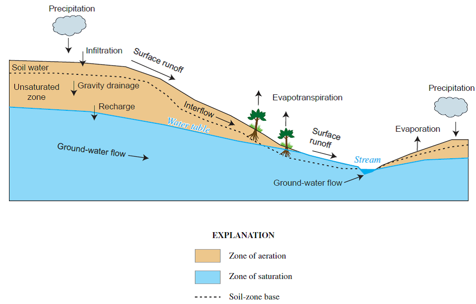
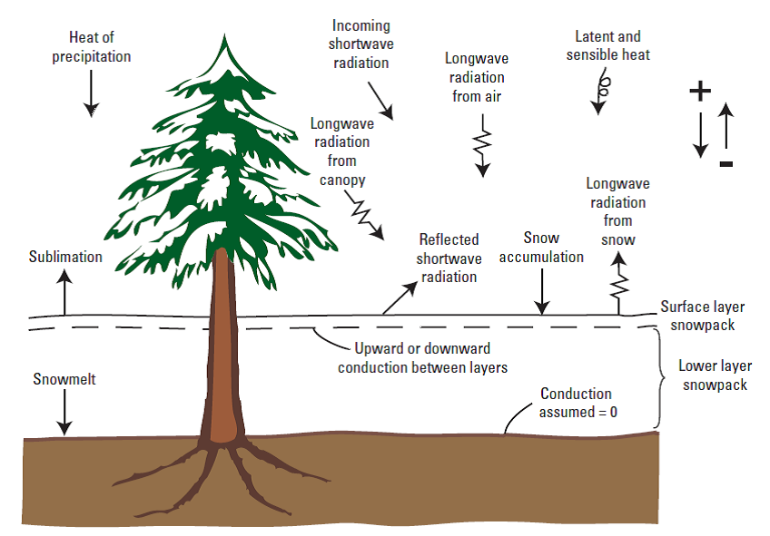
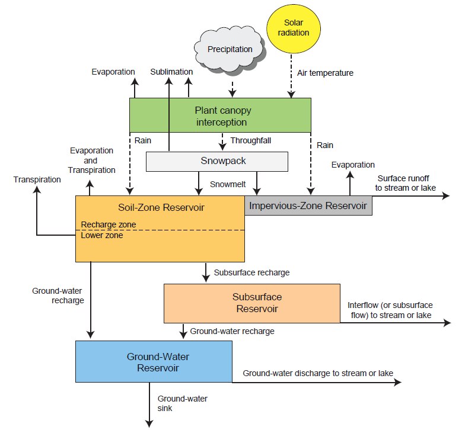

# GSFLOW

	Coupled Groundwater and Surface-water FLOW model，由美国地质调查局开发

	编程语言： FORTRAN 
	
	没有并行计算功能

## 应用

	耦合了地下水模型MODFLOW与降雨径流模型PRIMS
	
## PRMS-MODFLOW

为了评估气候、地质和人类活动对水循环的影响，需要研发模型耦合2个或更多的水循环模块。耦合模型通常包含降雨径流响应模型（分布式水文模型）、地表水和地下水模块，反映出水流在水文响应单元(Hydrologic
Response Units, HRUs)和水动力计算单元（地表水和地下水单元）之间的交换。

模型耦合的方式有2类：

1.  松散耦合：一种模型的输出作为另一模型的输入，此类模型的计算稳定性好，但不能更准确地耦合计算状态变量，如：GSFlow

2.  紧密耦合：求解一套耦合的微分方程组，此类模型的计算量大，且稳定性受到CFL条件的限制较大，如：ParFlow,
    OpenGeoSys等

水流在空气-地表和地下的循环过程如图1，通过对地表物理过程（如图2）的数学描述，然后建立数学模型，即可实现耦合求解，如图3。

图1 水流在陆地和地下的分布、流动和交换示意图

图2 水文模型中的能量平衡、累计、融雪和水分升华的示意图

图3 水文模型的模块示意图(USGS-PRMS模型)