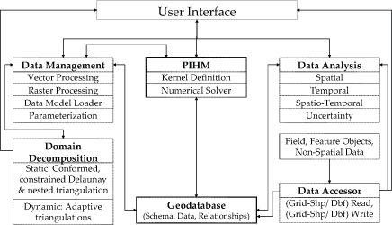

MM-PIHM (Multi-modular Penn State Integrated Hydrologic Model)

已开发的模块包含：

【1】Flux-PIHM (a surface heat flux module) (Shi et al.,
2013)，FLux-PIHM中的陆地表面模型改写至Noah_LSM (Chen and Dudhia, 2001)

【2】Flux-PIHM-BGC (PIHM with surface heat flux and biogeochemistry
module), 耦合了Flux-PIHM与地表生态系统模型 (改写至biome-BGC) (Thornton
et al., 2002)

【3】Flux-PIHM-EnKF (Shi et al., 2014)

尚在开发的模块有：

reactive transport (RT)和landscape evolution (LE)

Thornton, P. E. et al. 2002: Modeling and measuring the effects of
disturbance history and climate on carbon and water budgets in evergreen
needleleaf forests. Agric. For. Meteor.,113 (1-4), 185--222.

# 参考文献

# PIHM-Sediment Transport (地貌演变模块)

地质年代意义上的地貌演变及泥沙输移

The 3D landscape evolution model (PIHMSed) that couples the processes of
bedrock uplift, weathering, and regolith.

One of the objectives of the Shale Hills Critical Zone Observatory is to
understand how landscape morphology arises from feedbacks among
hydrological, hillslope, and fluvial processes.  Towards this end we are
constructing a next-generation 3D landscape evolution model (PIHMSed)
that couples the processes of bedrock uplift, weathering, and regolith
transport.  The model is based upon PIHM, the Penn State Integrated
Hydrologic Model, but also includes regolith and soil transport and
evolving bedrock and soil-air interfaces.  The relevant conservation
equations are discretized on a TIN (see figure) using the semi-discrete
finite volume approach.

Among the processes causes regolith flux on hillslopes, tree throw is
considered particularly important at Shale Hills.  We use the sine
function suggested by Gabet, Reichman et al. (2003) to describe lateral
regolith flux caused by tree throw: q~tr~ = K sin α, where K is a
coefficient that depends upon the frequency of tree-fall per unit area,
width of the root plate, and pit depth, and taken at Shale Hills to be
4.8\*10-3 m2/year. Streams are modeled as regions of the triangular mesh
where the overland flow exceeds a user-supplied threshold.

[Definition sketch of hillslope]{.mark}

Consider a hillslope where the variables are defined as z = ground
surface elevation (m), e = bedrock interface elevation (m), h = regolith
thickness in vertical (m), U = rock uplift rate (positive upwards)
(m/yr), E = the net surface erosion rate (negative for deposition)
(m/yr) on the surface by overland flow, and q~x~ = the lateral
volumetric regolith flux rate (positive in the x-dir) (m3 m-1 yr-1)
entering the sides of the control volume.  We want to predict the
evolution of the ground elevation and regolith thickness as functions of
location (x) (units of meters) and time (t) (measured in years to be
consistent with standard practice).   Let the regolith bulk density be
σ~re~ and the rock bulk density be σ~ro~.

Then from conservation of mass:

{width="3.64375in"
height="2.3131944444444446in"}

[Conversion of mass equation]{.mark}

Initial conditions for z, h, and e must be specified.  Typical boundary
conditions are no lateral sediment flux at the drainage divide and a
fixed ground elevation in the valley as set, for example, by an
under-capacity stream that can keep up with the bedrock uplift rate.

# PIHM Dissolved Organic Carbon (地表生态系统模型)

{width="2.537265966754156in"
height="3.466013779527559in"}

*Image: DOC concentration distribution in groundwater for White Clay
Creek watershed simulated by PIHMdoc*

The objective is to integrate feedbacks among the three major processes
governing the critical zone --- the water cycle, the mineral cycle, and
the carbon cycle. This requires a reliable model framework that can
coupling the major processes. The Penn State Hydrological Model (PIHM)
was adopted as our modeling framework to achieve the goal. Ultimately we
envision integrating a large number of high resolution GIS, satellite
data, and meteorological data for the mesoscale watershed and using PIHM
to scale sediment and carbon fluxes across the basin. The physical
mechanisms involved in all of the complex processes involved can only be
investigated holistically by exploring results from such an integrated
model.

To achieve our goal, the first step is to integrate all the GIS data
(e.g., land use, soil type, DEM), into the model framework, and simulate
the water flow and mass flux across the watershed. To date, we have
successfully set up the PIHM for the mesoscale watershed simulation. The
1440 km^2^ watershed was divided into over 4000 mesh triangles (Figure
1). Stream discharge data from ten USGS stream stations within the
Christina Basin were used to guide the model development. In the next
step, we intend to incorporate high resolution RADAR-derived,
gauge-calibrated precipitation datasets with PIHM to explore the
hydrological response to the model up scaling at the basin scale. After
the PIHM model calibration, we will integrate the PIHM model with a
biogeochemistry model, DOC model, and sediment transport model (all
these models are already available from the PIHM group at Penn State
University) and finally do the basin scale sediment, carbon flux
calculation.

The finding of this research will (i) advance our knowledge of the
mesoscale carbon cycling and budget, and cast light on the effects of
climate change on the regional carbon cycling; (ii) understand the fate
and transport of sediment at basin scale; and (iii) test our hypothesis
that the primary factor limiting organic carbon stabilization and
preservation in a wide range of environments are insufficient supply,
mixing, and complexation with mineral surfaces and polyvalent metals.

# Flux-PIHM

[Adapted from Noah_LSM]{.mark}

Flux PIHM is a fully-coupled land surface hydrologic model with improved
land-atmosphere interactions.

{width="3.7302930883639545in"
height="2.778089457567804in"}

*Image: Schematic of Flux-PIHM model structure on an individual TIN
cell.*

 PIHM is a fully-coupled land surface hydrologic model. It is developed
by incorporating a land-surface scheme into the Penn State Integrated
Hydrologic Model (PIHM). The land-surface scheme is mainly adapted from
the Noah LSM.

In Flux-PIHM, the surface energy balance scheme completely replaces the
original evapotranspiration formulation in PIHM. The land surface and
hydrologic components are coupled by exchanging water table depth, soil
moisture, infiltration rate, recharge rate, net precipitation rate, and
evapotranspiration rate between each other. At each time step, the
hydrologic component provides the land surface component with water
table depth, infiltration rate, recharge rate, and integrated soil water
storage over soil column. The soil layers below water table are set to
saturation. Soil moisture equations are applied to the soil layers above
the water table. Infiltration rate and recharge rate calculated by the
hydrologic component are used as top and bottom boundary conditions for
soil moisture transport. The volumetric soil moisture contents simulated
by [land surface co]{.mark}mponent are rescaled using the integrated
soil water storage provided by PIHM to guarantee mass conservation. The
land surface component then starts surface energy balance simulation and
provides the hydrologic component with net precipitation rate and
evapotranspiration rate.

Because PIHM is capable of simulating lateral groundwater flow that
explicitly resolves low-order channel networks, Flux-PIHM is able to
represent land surface heterogeneities caused by topography and capture
time scales that are generally missing in current land surface models.
At the same time, the robust land surface scheme provides accurate
sensible heat flux and evapotranspiration simulations at all scales in
the watershed or river network. The coupled hydrologic and land surface
schemes guarantee mass conservation at the subsurface as well as the
land surface, conserve energy balance at land surface, and provide
physical constraints to surface heat fluxes and subsurface water
movement.

{width="3.64375in"
height="2.6868055555555554in"}

*Flux-PIHM has been implemented at the Shale Hills watershed (0.08 km2)
in central Pennsylvania.*

{width="3.64375in"
height="2.834722222222222in"}

*Calibration data includes discharge, water table depth, soil moisture
content, sensible and latent heat fluxes during the period June and July
2009.*

Flux-PIHM has been implemented at the Shale Hills watershed (0.08 km2)
in central Pennsylvania. Multi-state observations of discharge, water
table depth, soil moisture, soil temperature, and sensible and latent
heat fluxes in June and July 2009 are used to manually calibrate
Flux-PIHM. Model predictions from 1 March to 1 December 2009 are
evaluated. Both hydrologic predictions and SEB predictions show good
agreement with observations. The discharge prediction is comparable or
superior to a state-of-the-art conceptual model implemented at similar
watersheds. Comparisons of model predictions between Flux-PIHM and the
original PIHM show that the inclusion of the complex SEB simulation only
brings slight improvement in hourly model discharge predictions.
Flux-PIHM improves the evapotranspiration prediction at hourly scale,
the prediction of total runoff (discharge), and the predictions of some
peak discharge events, especially after extended dry periods.

Flux-PIHM also serves as the conceptual framework for the
Weather/Climate component of Critical Zone processes for the SSHCZO
team. 

# Publications

2014

Evaluation of the parameter sensitivity of a coupled land surface
hydrologic model. Shi, Y., K. J. Davis, F. Zhang, and C. J. Duffy
(2014):*Journal of Hydrometeorology, 15:279-299*

2013

Development of a Coupled Land Surface Hydrologic Model and Evaluation at
a Critical Zone Observatory. Shi, Y., K. J. Davis, C. J. Duffy, and X.
Yu (2013): *Journal of Hydrometeorology, 14, 1401-1420*

2012

Development of a land surface hydrologic modeling and data assimilation
system for the study of subsurface-land surface interaction. Shi, Y.
(2012): *Doctor of Philosophy, Meteorology, The Pennsylvania State
University, p. 214.*
