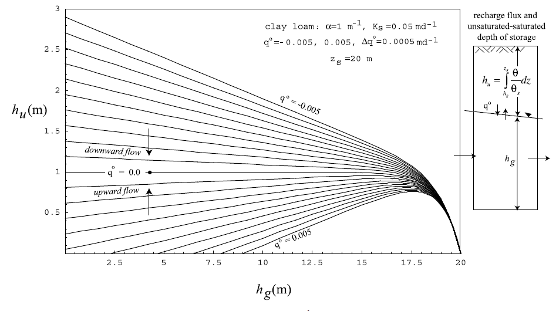
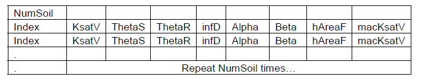
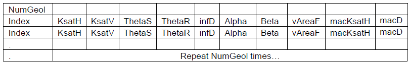
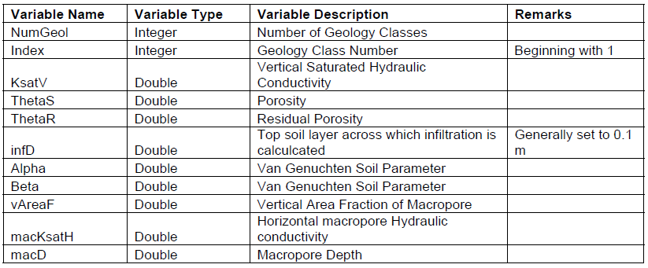
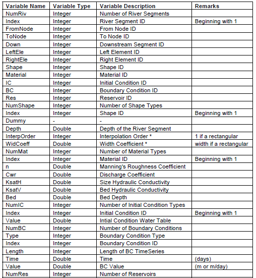
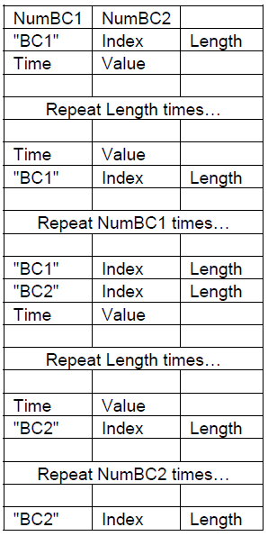

# 一种用于多进程流域模拟的半离散有限体积法方案

QU

陆地水循环中的水文过程在很大范围内的时间和空间尺度上运行,
而且涉及的主要方程可能是包含常微分方程 (ODE) 和偏微分方程 (PDE)
的混合方程。本文提出了在流域和河流流域尺度上的全耦合过程方程的制定和求解的统一方法。该方法显示了如何利用半离散有限体积法
(FVM)
将混合方程组局部化为常微分方程组。域分解将流域表面分割到非结构化网格上，并且每个元素的垂直投影形成有限体积，在该体积上形成所有物理过程方程。投影体积或棱柱体分为表面和地下层，产生完全耦合的局部常微分方程系统，称为模型"内核"。全局常微分方程系统通过域上的局部常微分方程系统进行组合，然后由最先进的常微分方程求解器求解。基于狄劳尼三角剖分的非结构化网格,
是由与河网、流域边界、海拔等高线、植被、地质等相关的约束条件产生的，然后将基本几何和参数场投影到不规则网络上。基于内核的公式简化了添加或消除状态、本构关系或闭包关系的过程。该策略在宾夕法尼亚州中部的页岩山实验流域得到证明并观察到几种现象：（1）该束缚原理被证明是对高地流域浅层土壤的土壤水分 -
水位动力学的有用近似；（2）耦合显示前期的湿度 (即初始条件)
能放大峰值流量；（3）耦合方程能预测高地瞬流通道的起始或阈值；（4）该模型显示了微图像信息如何控制页岩山地块的陆地流动路径的表面饱和度和连通性。本研究开发的开源代码被称为宾州州立综合水文模型（PIHM）。

## 前言

在本文中，我们解决了流域和流域水文预测过程整合问题。
模拟现在被广泛用作理论和实验的补充研究方法\[Post and Votta,
2005\]。然而, 流域和河流流域的网格分辨率、模型规模以及水文过程的范围,
为预测水文响应或模拟耦合系统的某些行为提供了必要的条件。在本文中,
我们制定了一个多尺度策略,
包含了表示体积-平均状态变量的本构关系。对于小流域和精细的数值网格,
局部连续关系 (例如, 达西定律)
产生一个完全耦合的、基于物理学的分布式模型。在较大尺度和粗网格下，应用与大规模体积平均值的经验关系，该模型成为半分布模型。对水文建模策略的简要回顾表明了与多个过程的整合和耦合相关的问题，并阐明了本文的目的。

目前的水文模型可以从两个角度来描述：基于物理的、空间分布的模型和集中的概念模型。Freeze
and
Harlan\[1969\]从连续统一的角度开发了第一个基于物理的分布式流域模型的数值方法蓝图（即地下流的Richards方程，表面流和渠道流的Saint
Venant方程）。该模型开发于SHE模型的前几年\[Abbott et al., 1986a,
1986b\]。其变型产生了第二代，其中耦合的物理方程实际上在常规网格上解决，其中通过在过程之间传递信息（例如，表面水 -
地下水交换）的复杂控制算法进行耦合处理。

通过时滞和迭代耦合时通过边界条件耦合多个过程的方法通常被认为是弱耦合形式，因为它可能导致严重的不稳定性和错误\[LaBolle
et al., 2003\]。如果对特定应用的物理方程进行了更改,
则该方法还需要进行大量的重新编程。最近，Panday和Huyakorn\[2004\]开发了一种方法，其中模型中的所有方程都是扩散类型，它们在常规网格上的单个系统中解决（例如，Richard方程和扩散波方程），而方程式其他过程（植被，能量，雪）分别（迭代）处理。Yeh
et al.
\[1998\]使用了类似的方法，但是使用了有限元素。正如稍后将介绍的那样,
我们的方法将所有的动力学方程与同一个棱柱体积
(棱镜是由从顶盖投射的三角形, 通过陆地表面到地下水流的下边界)
来定义的；所有方程都同时求解, 消除了对控制器、延迟或离线过程方程的需要。

集中或空间集成的模型今天被广泛使用，其中预测的目标是从外力流出（例如，降雨径流，补充基流，降水渗透）。集中系统是低维的，能够方便地解决，但仍然需要通常假定为线性或弱非线性并且适合或校准数据的通量排放的经验关系。此方法的简化参数集可以解决整体质量平衡,
但不能通过定义来通知物理过程的内部时空变化。斯坦福流域模型是包含流域过程的集中模型的早期示例\[Crawford
and Linsley, 1966\]。已经有人努力尝试弥合这两种方法，达菲 \[1996\]
描述了一个二状态模型通过集成理查兹方程在山坡入饱和和不饱和状态,
并且以后扩展了这个方法到山前补给的问题使用测深法分配高原，过渡和泛洪平原区进入中间维度系统\[Duffy,
2004\]。Reggiani et al.
\[1998,1999\]提出了一个综合的半分布框架，其中质量，动量和能量的综合守恒方程在一个代表性的基本流域（REW）中得到解决。他们讨论了在REW尺度上参数积分通量存储关系所涉及的问题,
并将其称为水文闭合。

使用集中，分布式或半分布式方法来模拟流域系统的决策最终取决于模型的目的，每个都有其优点和缺点。对于分布式情况，控制方程是从局部本构关系得出的。例如,
达西方程适用于地块或坡面尺度，但是不清楚当使用半分布或集中模型的较大尺度时，通量与状态变量的有效关系应该是什么（例如，
Beven
\[2006\]讨论的水文闭合问题）。目前，有关数据需求与预测模型的关系的文献还有相当多的讨论，包括模型类型（集中，半分布，分布式），唯一性以及合适的集成度\[Sivapalanetal.,
2002\]。

在本文中，提出了一种综合水文模型的新策略，其自然地将混合偏微分方程（PDE）和常微分方程（ODE）的物理过程作为完全耦合系统。该模型通过有限体积方法制定了局部物理方程，使用地理信息系统（GIS）工具对非结构化网格中的模型域进行分解，以及将先验参数估计分配给每个网格单元。在小规模数字网格的限制下，有限体积法实现了经典（例如连续）本构关系。对于较大的网格尺度，该方法反映了上述半分布方法的假设，但完全耦合了所有元素。改变物理模型以适应有效的参数或新方程的过程是一个相对简单的过程,
因为所有的等式都驻留在代码中的同一位置
(即内核)。在这种方法中，相互作用被组装在全局ODE系统的右侧，然后用针对刚性非线性系统设计的最先进的求解器来解决。该方法利用三角形不规则网格覆盖了三角形数量最少的域\[Palacios-Velez
and Duevas-Renaud, 1986; Polis and McKeown,
1993\]受到特定问题所定义的限制。

## 1建模方法

1.  $\mathbf{半离散}\mathbf{FVM}\mathbf{方法}$

在本节中，我们开发了在非结构化网格单元上运行的任意物理过程的有限体积近似。可以写出任意标量状态变量χ的质量守恒方程的一般形式：

$\frac{\partial\chi}{\partial t} + \nabla \cdot \chi V + \frac{\partial\chi}{\partial z} = \Omega_{\chi}$（1）

其中χ表示存储的质量分数（无量纲）。
为了方便起见，（1）中的速度矢量被分为水平（V =
{u，v}）和垂直分量{w}，$\Omega_{\chi}$是由χ表示的过程的局部源/汇项。（1）的体积整合分两步进行：首先，我们整合层的深度，然后整合在该区域上。
对于单层厚度$z_{a} \leq z \leq z_{b}$包含标量χ，深度上的积分采取形式:

$\frac{\partial}{\partial t}\int_{z_{a}}^{z_{b}}{\chi dz - \chi_{z_{b}}}\frac{\partial z_{b}}{\partial t} + \chi_{z_{a}}\frac{\partial z_{a}}{\partial t} + \nabla\int_{z_{a}}^{z_{b}}{\chi Vdz - (V{\chi)}_{z_{b}}}\nabla z_{b} + (V{\chi)}_{z_{a}}\nabla z_{a} + (w\chi)_{z_{a}} + (w\chi)_{z_{b}} = \int_{z_{a}}^{z_{b}}{\Omega_{\chi}dz}$
（2）

我们可以通过重写关于边界本身的小层的方程 (2)
来评估边界条件，$z_{b}^{-} \leq z_{b} \leq z_{b}^{+}$,其中$z_{b}^{-} = z_{b} - \varepsilon$,$z_{b}^{+} = z_{b} + \varepsilon$。让层厚度接近零，$z_{b}^{+} - z_{b}^{-} \rightarrow 0$,积分项被消除，剩下项必须平衡，因为我们从双方进入界面，产生界面通量的界定：

$\chi_{b^{+}}\frac{{\partial z}_{b^{+}}}{\partial t} + {(V\chi)}_{b^{+}}\nabla z_{b^{+}} - (w\chi)_{b^{+}} = \chi_{b^{-}}\frac{{\partial z}_{b^{-}}}{\partial t}$+$(V\chi)_{b^{-}}\nabla z_{b^{-}} - (w\chi)_{b^{-}} = Q_{b}$
（3）

其中$Q_{b}$是$z = z_{b}$上的净通量。
在$z = z_{a}$处找到$Q_{a}$的类似表达式。
现在，方程式（2）是根据层中的垂直集成存储来编写的：

$\frac{\partial\overline{x}}{\partial t} + \nabla\left( V\overline{x} \right) = \ Q_{b} - Q_{a} + \omega$
（4）

其中$\overline{x}$是层中每个单位面积（L）的容积存储, 定义为：

$\overline{x} = \int_{z_{a}}^{z_{b}}{xdz}$ （5）

ω是垂直整合的源/汇项：

$\omega = \int_{z_{a}}^{z_{b}}{\Omega_{x}dz}$ （6）

为了完成体积积分, 等式 (4) 现在写为：

$\frac{\partial}{\partial t}\int_{A}^{}{\overline{x}dA + \int_{\Gamma}^{}{N\left( V\overline{x} \right)d\Gamma = \int_{A}^{}(}}Q_{b} - Q_{a} + \omega)dA$
（7）

其中发散定理被应用于第二项，$\Gamma$是A的周长，N是$\Gamma$上的单位法向量。在半分布有限体积中写出（7）\[Leveque，2002\]：

$\frac{d\overline{x}}{dt} = \sum_{k = 1}^{2}Q_{k} - \sum_{i = 1}^{m}Q_{i}$
（8）

其中$\overline{x}$被解释为控制体积（不可压缩流体）中x的体积存储（L^3^），$Q_{i}$是通过控制体积的侧面i
= 1,2,3的净体积通量，$Q_{k}$是净体积通量跨越上边界和下边界k = 1,2。之后,
将会方便地除以有限体积的投影水平表面积 (8), 从而使存储具有等效的深度,
并将体积通量项归一化为单位水平面积。

方程（8）的矢量形式表示所有过程$\overline{x} = \left\{ x_{1},x_{2},\cdots x_{k} \right\}$，并形成完全耦合的局部ODE系统。通过对特定过程和应用的适当的本构
(或闭合) 关系,
对控制容积两侧的通量进行评估，我们再次注意到，有限体积方法保证了每个控制体积的质量守恒\[Leveque，2002\]，半分散表示将所有方程式都减小到一个标准形式。

2.  $多尺度，多进程方案$

开发多进程系统的下一步是域分解。流域的水平投影分解为Delauney三角形。每个三角形垂直投影以跨越形成棱柱体积的"活动流量"，其进一步细分为层，以考虑物理过程方程和材料层。当控制方程是ODE（例如，植被拦截）和PDE（例如，陆地流，地下水流）的混合时，首先通过应用上述的半分离有限体积法（FVM）方法将PDE简化为ODE，然后将所有ODE与棱镜内的层相关联。棱镜是所有物理方程（因此所有问题的时间尺度）所在的地方，我们将这个局部系统称为内核。在流域上组装局部ODE系统，形成一个全局系统，然后用有效的ODE求解器。这种解决方法也被称为"线法"\[Madsen，1975\]，这里应用于微分方程组。对于在流域研究中遇到的多个过程，该方法有几个优点，首先，代表在棱镜控制卷中运行的所有物理过程的模型内核可以容易地针对不同的应用或过程进行修改，而不改变求解器或甚至域分解。
由于所有物理方程都在单个子程序中，因此添加或省略过程，材料属性或强制使程序被修改非常简单。
第二，ODE被解决为"完全耦合"系统，没有时间滞后或迭代连接的过程。
第三，替代的本构关系或关闭关系也很容易在这个策略中实施和测试。
本构关系可能来自概念模型，数值实验\[Duffy，1996\]或理论推导\[Reggiani et
al。，1999; Reggiani和Rientjes，2005\]。
值得注意的是，本体关系对于体积整合的规模是敏感的\[Beven，2006\]，这是这里使用的半混合方法自然的特征。

在这项研究中，我们正在开发一个用于模拟流域和河流流域的开源商业代码，我们将该代码称为PIHM：宾州州立综合水文模型。在第一代PIHM中，我们考虑以下过程和维度：一维（1-D）渠道流量，2维地上流量和2维地下流量由PDE控制，而冠层拦截，蒸散量和融雪由ODE描述。每个过程被分配给内核中的一个层，其中分配给表层的过度流和通道流，以及以元素的任何边缘为中心的通道。在域分解之前，河网，水力结构或其他设备，如水坝，量具，堰等被识别为用于限制分解的特殊点。虽然这对网格生成带来了一些计算负担，但这种想法简化了分解区域的几何形状，从而有助于组合全局ODE系统。例如，该步骤将确保没有通道与控制体积内部相交，或者通道段总是居中在两个流域元素之间的边界上。它还可以在需要的元素顶点处定位（阶段，井级，气候站），简化后处理。
图1说明了这里要研究的系统的分解和内核。

{width="5.768055555555556in"
height="4.459722222222222in"}

图1.山坡和溪流达到的域分解示意图。
有限体积元素是从也称为TIN（三角形不规则网络）的三角形不规则网格投影的棱镜。
TIN以通道为约束生成，这将保证通道沿着元素边界。
在图的上半部分，基本元素在左边显示了多个水文过程。
右侧显示一个由流限定的三角形的通道段

## 2构建局部ODE系统

在任何情况下，方程式的选择是假定在流域（在我们的情况下，页岩山）中运行的最重要的物理过程的实际平衡，在特定表示中对这些过程做出的假设以及计算的规模。
我们注意到，更复杂（或更简单）的方程/过程没有固有的局限性。
在这里提出的这些都足以表征我们所选择的特定物理环境的物理设置。

3.  $\mathbf{受偏微分方程控制的过程}$

    1.  **地表径流**

表面流动的控制方程是2维圣维南方程。 Sleigh et al.
\[1998\]已经开发了一种使用有限体积法预测河流和河口流量的全圣维南方程的数值算法，其中使用Riemann方法计算法向通量矢量\[Leveque，2002\]，我们按照他们的方法，让$\overline{x} \rightarrow h_{0}(x,y,t)$，连续性方程（4）的垂直整合形式由下式给出:

$\frac{\partial h_{0}}{\partial t} + \frac{\partial(uh_{0})}{\partial x} + \frac{\partial(vh_{0})}{\partial y} = \sum_{k = 1}^{2}q_{k}$（9）

其中h~o~（x，y，t）是局部水深。
这里u和v是平面x，y中的速度；$q_{k}$是通过表面积归一化的表面通量项。
请注意，对于每个元素，有三个未知数，h~o~，u和v。
为了减少解决全圣维南方程的复杂性，我们忽略了动量方程中的惯性项，并使用曼宁公式来闭合等式（9），得到扩散波近似\[Gottardi和Venutelli，1993\]：

$\frac{\partial h_{0}}{\partial t} = \frac{\partial}{\partial x}\left( h_{0}k_{s}\frac{\partial H}{\partial x} \right) + \frac{\partial}{\partial x}\left( h_{0}k_{s}\frac{\partial H}{\partial x} \right) + \sum_{k}^{}q_{k}$
（10）

和

$k_{s} = \frac{h_{0}^{\frac{2}{3}}}{n_{s}}\frac{1}{{|\partial H/\partial s|}^{\frac{1}{2}}}$
（11）

其中h (x、y、t) 是水平面以上的水平基准， n 是曼宁粗糙系数， s = s (x, y)
是最大斜率的矢量方向，$q_{k}$是层的顶部和底部的输入/输出。

由于我们实现的基本元素是垂直投影的棱镜 (图 1),
因此对$k_{s}$的评估略有复杂。让 ($x_{i},y_{i},H_{i}$)
是在顶点$V_{i}$上的自由水面的局部坐标，假定自由面平面由顶点$V_{2},V_{3},V_{4}$和$D_{4}D_{7}D_{8}$的三角形元素相同。然后定义该平面
(参见图 2)：

{width="3.4in" height="3.221026902887139in"}

图2.
Delaunay三角剖分和Voronoi图。实线形成Delanunay三角形，虚线形成Voronoi多边形。
外围中心V~i~是三角形垂直平分线的顶点，用于表示状态变量的体积平均值的三角形

$\left| \begin{matrix}
\begin{matrix}
x & y \\
x_{2} & y_{2}
\end{matrix} & \begin{matrix}
H & 1 \\
H_{2} & 1
\end{matrix} \\
\begin{matrix}
x_{3} & y_{3} \\
x_{4} & y_{4}
\end{matrix} & \begin{matrix}
H_{3} & 1 \\
H_{4} & 1
\end{matrix}
\end{matrix} \right| = 0$ （12）

注意：

$$\frac{\partial H}{\partial s} = \frac{s}{||s||} \bullet \nabla H$$

从而给出了沿单元$D_{4}D_{7}D_{8}$最大斜率方向的水头梯度：

$\frac{\partial H}{\partial s} = \sqrt{\left( \frac{\left( y_{3} - y_{2} \right)\left( H_{4} - H_{2} \right)}{\left( x_{2} - x_{3} \right)\left( H_{4} - H_{2} \right)} \right)^{2} + \left( \frac{\left( x_{4} - x_{2} \right)\left( H_{3} - H_{2} \right)}{\left( x_{3} - x_{2} \right)\left( H_{4} - H_{2} \right)} \right)^{2}}$（13）

对于通道边界的元素, 需要进行特殊处理, 我们在3.1.3
节中讨论此问题。对于扩散波近似,每单位流量的表面通量：

$Q_{s} = h_{0}k_{s}\frac{\partial H}{\partial s}$, $s = s(x,y)$ （14）

使用（11）和（13）。
将上述半混合方法应用于等式（10）并且通过元素的表面积归一化，得到陆地流量的半离散近似：

$\left( \frac{dh_{0}}{dt} = p - q^{+} - e + \sum_{j = 1}^{3}q_{j}^{s} \right)_{i}$
（15）

其中$q_{j}^{s}$是从元素 i 到它的邻 j 的规范化的侧向流速。p、q + 和 e
分别为穿透沉淀、浸润和蒸发。

2.  **地下径流**

对于地下径流 , 我们从 ( 1 ) 再次开始，让我们的标量是含水量 ( 体积水 /
空隙量 )，$x \rightarrow \theta$，我们写 (1)为：

$\frac{\partial\theta}{\partial t} + \nabla\theta V + \frac{\partial(w\theta)}{\partial z} = + S_{\theta}$
（16）

其中再次将发散项分离成垂直（w）和水平V =（u，v）分量。
地层内的流动由于层内自由表面边界或水位的存在而变得复杂。
该层分为两部分，其中水面上方的土壤（$z^{+}$）受重力和表面张力控制，而重力单独控制在水位下方（$z^{-}$）。
使用（2）和（3）并在层的深度上积分得到：

$$\theta_{s}\frac{\partial h_{u}}{\partial t} + \nabla\left( \theta Vh_{u} \right) = q^{+} - q^{0}$$

$\theta_{s}\frac{\partial h_{g}}{\partial t} + \nabla\left( \theta Vh_{g} \right) = q^{0} - q^{-}$
（17）

\(17\) 中的散度项表示在不饱和 (加号) 和饱和 (负号)
部分的水平流动，$\theta_{s}$是含水饱和度的含水量，$h_{u}$是水分在水面上的当量深度，而$h_{g}$是水表下饱和度的深度定义：

$h_{u} = \int_{z_{0}^{+}}^{z_{b}}\frac{\theta}{\theta_{s}}dz$,
$h_{g} = \int_{z_{a}}^{z_{0}^{-}}\frac{\theta_{s}}{\theta_{s}}$dz （18）

该层现在定义了两个互补区以上$\left( z_{a} \leq z \leq z_{0}^{+} \right)$和低于水表$\left( z_{a} \leq z \leq z_{0}^{-} \right)$。对土壤水分区$q^{+}和q^{0}$的通量分别定义为通过土壤表面的渗透/渗出,
并从水表中补给。通量$q^{-}$是与更深的地下水层的交换。横向流的发散项通过积分
(17) 在控制容积的投影表面积 (图 1) 进行评估。应用雷诺输运定理\[Slattery,
1978\]和发散定理分别给出了水位上下流动方程：

$$\frac{1}{A}\iint_{A}^{}{\nabla\left( \theta Vh_{u} \right)}dA = \frac{1}{A}\int_{B}^{}{\left( \theta Vh_{u} \right)ndB \simeq \sum_{j = 1}^{3}q_{j}^{u}}$$

$\frac{1}{A}\iint_{A}^{}{\nabla\left( \theta Vh_{g} \right)}dA = \frac{1}{A}\int_{B}^{}{\left( \theta Vh_{g} \right)ndB \simeq \sum_{j = 1}^{3}q_{j}^{g}}$（19）

参见Duffy \[1996\]详细信息。最后,
在层内形成一个完全耦合的非饱和-饱和流动的平衡方程：

$$\theta_{s}\frac{dh_{u}}{dt} = q^{+} - q^{0} + \sum_{j = 1}^{3}q_{j}^{u}$$

$\theta_{s}\frac{dh_{g}}{dt} = q^{0} - q^{-} + \sum_{j = 1}^{3}q_{j}^{g}$
（20）

其中不饱和和饱和储存深度（$h_{u},h_{g}$）现在被解释为每单位投影水平面积的体积平均值。（20）中的散度项定义了相邻元素的净侧向土壤水分通量和净侧向地下水交换。
从这一点我们将假设流体在不饱和区域是垂直的，横向饱和地下水流量是：

$$\sum_{j = 1}^{3}{q_{j}^{g} \neq 0}$$

我们注意到这个术语也代表与通道相邻的元件的含水层相互作用。水表$q^{0}\left( h_{u},h_{g} \right)$的净通量表示不饱和流量和从水位进行补给的积分性质以及水位波动的影响。
再次，在控制ODE中，所有通量都通过单位\[L/T\]的元素的投影水平表面积归一化。

对于达西关系是适当的应用, 横向地下水通量的评估使用其体积平均形式\[Duffy,
2004\]给出：

$q_{ij}^{g} = B_{ij}K_{eff}\frac{\left( H_{g} \right)_{i} - \left( H_{g} \right)_{j}}{D_{ij}}\frac{\left( H_{g} \right)_{i} + \left( H_{g} \right)_{j}}{2}$
（21）

其中$B_{ij}$是公共边界的长度，$D_{ij}$是元素i和j的外界之间的距离。$\left( H_{g} = h_{g} + z \right)$是水头，其中$z_{i}$是单元i的基准的高度。
有效水力传导率$K_{eff}$是单元i和j中水力传导率的谐波平均值。
等式（21）中的存储 --释放关系由于垂直积分而是非线性的。 Brandes
\[1998\]还通过数值实验表明，积分储存或"有效"本构关系是坡度尺上水头的非线性函数。
可以在适当的情况下引入概念模型，数值实验和理论推导的灵活的本构关系。

这里使用的方法假定模型中的每个地下层都可以具有饱和和不饱和的存储组件。
不饱和和饱和储存之间的相互作用或耦合项由方程（20）中的补给或水位通量$q^{0}$定义。
Duffy
\[2004\]通过使用简单的指数型土壤特性，基于在层的不饱和部分上的积分，开发了向/从水位表的补给通量的简化分析表达式\[Gardner，1958\]，其形式：

$q^{0}\left( h_{u},h_{g} \right) = K_{s}\frac{1 - e^{- \alpha\left( z_{s} - h_{g} \right)} - \alpha h_{u}}{\alpha\left( z_{s} - h_{g} \right) - \left( 1 - e^{- \alpha\left( z_{s} - h_{g} \right)} \right)}$
（22）

其中$K_{s}$是饱和水力传导性。$\alpha$是指数土壤模型的土壤质地参数；$z_{s}$是总层厚度。
水位$q^{0}$处的积分内部通量是水位位置的非线性函数和水位以上土壤水分储存深度。
在Duffy \[2004\]之后，图3中显示了土壤粘壤土的方程式（22）。
值得注意的是，尽管van Genuchten \[1980\]或Brooks和Corey
\[1964\]公式更一般地以离散形式使用，但是补充功能（22）具有简单和计算速度的优点。

一般来说，内核可以很容易地编辑所需的本构关系或闭合关系，并适当注意配方所需的新参数。
在浅水位条件下发生特殊情况，其中不饱和储存由饱和储存的简单函数近似，系统（20）可以减少。
这个想法是针对第6节中的特定情况开发的。

{width="4.1621172353455815in"
height="2.3296030183727034in"}

图3.基于等式（22），理论补给$q^{0}\left\lbrack LT^{- 1} \right\rbrack$或部分饱和层内水位流量的图示。
该图显示了不饱和和饱和储存与补给的关系，并且基于Richard对指数型土壤特性的方程的解决方案\[Duffy，2004\]。
在这个例子中，我们忽略了不饱和区域中的横向流动。

3.  **渠道流动**

对于渠道流，将半混合方法应用于具有与陆上流量产生相同假设的[1维圣维南方程：]{.mark}

$\left( \frac{dh_{c}}{dt} = p - e + \sum_{l = 1}^{2}{\left( q_{l}^{s} + q_{l}^{g} \right) + q_{in}^{c} - q_{out}^{c}} \right)_{i}$
（23）

其中$h_{c}$是渠道中水的深度，p和e是渠道段的沉淀和蒸发，$q_{l}^{g}$和$q_{l}^{s}$是来自渠道每侧的含水层和表面流的横向相互作用项。
上游和下游渠道段分别为$q_{in}^{c}$和$q_{out}^{c}$。
体积通量通过通道段的水平投影表面积归一化，其中通道是具有梯形或其他横截面的1-D棱柱体积。
如在陆上流动的情况下，扩散波近似被应用于上游和下游渠道通量项。

表面陆地流栋和渠道流动的相互作用，等式（15）和（23）中的$q_{l}^{s}$由Panday和Huyakorn
\[2004\]内的一个方程式控制。
对于渠道溢流（即，渠道深度超过临界深度）的情况，条件变为浸没式堰，其中出流是表面陆上流动和通道段中的流动深度的函数。
方程（20）和（23）中的饱和地下水流量和渠道流动$q_{l}^{g}$之间的相互作用由（21）中的Darcy方程的离散形式决定，其中相邻的水头是渠道的深度。

地表流与地的相互作用受两种径流产生机制的控制。当表面有积水时, 方程 (15)
和 (20) 的渗透率是土壤水分的函数, 其上限为最大入渗能力
(如有界线性关系)。如果该层是完全饱和的, 那么径流是由地下饱和
(Dunne径流生成机制) 产生的, 并且在该时间步长内被排斥。

4.  $\mathbf{受常微分方程控制的过程}$

    1.  **拦截过程**

在植被和冠层覆盖的情况下，一部分沉淀物被截留并暂时储存，直到其作为蒸发返回大气，或通过冠层作为通过或茎流。
在这种情况下，守恒方程直接写为ODE形式的平衡方程。
假设元素间冠层存储空间相互作用是微不足道的，控制方程式具有形式：

$\left( \frac{dh_{v}}{dt} = p_{v} - e_{v} - p \right)_{i}$ （24）

其中$h_{v}$是植被拦截储存。
这里$p_{v}$是总水当量降水，$e_{v}$表示表面植被的蒸发，p是通过下降和茎流或有效降水到表面储存的方程（15）$h_{v}$。的上限是植被类型，冠层密度，甚至
降水强度\[Dingman，1994\]。 当树冠达到上限阈值时，所有降水都将通过。

2.  **融雪过程**

积雪融雪的过程是一个寒季需应对的。
虽然可以应用更全面的积雪物理学，但在这里我们使用简单的指数法来积雪和融化\[Dingman，1994\]。
假设在雪季期间植被休眠，当空气温度低于融雪温度Tm时，降雪过程中积雪，如果空气温度超过融化温度，则积雪层融化。
动态融雪守恒方程由下式给出：

$\left( \frac{dh_{s}}{dt} = p_{s} - e_{s} - \mathrm{\Delta}w \right)_{i}$
（25）

其中$\mathrm{\Delta}w$是融雪速率，也是陆上流量的输入。
可以通过空气温度计算：

$\mathrm{\Delta}w = \left\{ \begin{array}{r}
M\left( T_{a} - T_{m} \right),\ \ \ \ \ T_{a} > T_{m} \\
0,\ \ \ \ \ \ \ \ \ \ \ \ \ \ \ \ \ \ \ \ \ \ \ \ \ \ T_{a} \leq T_{m}
\end{array} \right.\ $ （26）

其中M是融解因素，其可以从经验公式估计\[Dingman，1994\]，并且$e_{s}$是直接从雪中蒸发。

3.  **蒸发和蒸散**

使用Pennman方程\[Bras，1990\]估计植被拦截，陆上流量和雪和河流表面的蒸发，其代表组合的质量传递和能量方法：

$\left( e = \frac{\mathrm{\Delta}\left( R_{n} - G \right) + \rho_{a}C_{p}\left( \varepsilon_{s} - \varepsilon_{a} \right)}{\mathrm{\Delta} + \gamma} \right)_{i}$
（27）

使用Penman-Monteith方程估算土壤和植物的潜在蒸散量：

$\left( et_{0} = \frac{\mathrm{\Delta}\left( R_{n} - G \right) + \rho_{a}C_{p}\frac{\left( \varepsilon_{s} - \varepsilon_{a} \right)}{r_{a}}}{\mathrm{\Delta} + \gamma\left( 1 + \frac{r_{s}}{r_{a}} \right)} \right)_{i}$
（28）

这里$et_{0}$是指潜在的蒸散量，$R_{n}$是植被表面的净辐射，G是土壤热通量密度，$\varepsilon_{s} - \varepsilon_{a}$表示空气蒸汽压力缺陷，$\rho_{a}$是空气密度，$C_{p}$是空气的比热。$\mathrm{\Delta}$是饱和蒸气压 -
温度关系的斜率，$\gamma$是测量常数，$r_{s},r_{a}$是表面和空气动力学阻力。
实际蒸散是潜在的$et_{0}$和当前植物，气候和水文条件（如土壤水分）的函数。
在实施中，引入系数以计算Kristensen和Jensen \[1975\]之后的潜在实际ET。
Allen等人 \[1998\]提供了用于计算不同植被系数的指南。

组合方程（15），（20），（23），（24）和（25）产生在棱镜或内核元素i中表示多个水文过程的ODE的局部系统。空间相互作用用适当的组成或闭合
（14），（21），（22），（26）和（27）的关系。

PIHM集成模型的一个中心特征是所有进程完全耦合，首先通过局部内核，然后在全局ODE系统中。
在这里，我们概述了主要水文过程之间的相互作用，例如表面陆地流动，不饱和地下流动，饱和地下流动和渠道流动。
更多细节可以在Qu \[2005\]的论文中找到。

1.  **组装全局ODE系统**

全局ODE系统是通过组合局部方程组（例如内核）和在流域上分配单元到单元的连接而形成的。
非结构化网格的生成涉及到域分解成棱柱体积。
非结构化的网格生成试图实现覆盖该区域的最少数量的单元,
同时满足特定的约束条件 (例如, 河流沿单元边缘形成,
单元格应尽可能接近于质量网格的等边三角形等)。

我们应用Delaunay三角测量法\[Delanunay, 1934;Voronoi, 1907; Du et al.,
1999\]形成正交三角形非结构网格\[见Palacios-Velez和Duevas-Renaud，1986;
Polis and McKeown, 1993; Vivoni et
al.,2004\]。对于给定的一组约束，每个三角形尽可能接近于等边的网格是最佳的。约束可以包括流域边界，流网络，地质边界，高程轮廓或水力结构。在完成域分解之后，如图1和图2所示，三角形不规则网络（TIN）垂直向下投影以形成棱柱体积元素。使用外围中心作为定义每个三角形而不是细胞的质心的节点，确保通过其邻居的任何边缘的通量与公共边界垂直。例如，$V_{1}V_{2}$在图2中是正常的$D_{4}D_{7}$。这简化了每个边界通量的评估。但是，在任何情况下，限制中心必须保持在三角形之内。
Shewchuk
\[1997\]开发了一种从原理上计算满足上述要求的Delaunay三角测量的算法，我们在这里采用这种算法。

流域范围的网格生成从一组已定义的控制点开始。一般来说,
目标是用最小的三角形和特殊的约束来表示地形, 例如水文点 (例如,
上地点、水坝等) 和其他指定的关键地形点 (例如,
局部地形最大值/最小值、凸/凹或鞍点)。这些特殊点是使用地形分析工具来选择的。一旦选定,
它们将被授予任何后续网格生成的荣誉。除了特殊的点,
我们还可以使用线段从流域边界, 如流网络, 海拔轮廓, 植被多边形等,
作为约束的网格生成。这将保留特定问题的域分解中的某些自然边界。通常的目标是生成一个网格,
尽可能小的元素, 同时仍然满足 Delauney 三角形的所有要求 (最小角度,
最大面积和约束等), 并达到水力逻辑模拟的目标 (最小支持河网,
最小通道长度增量等)。

{width="5.124359142607174in"
height="5.020205599300088in"}

图4.域分解中步骤的示意图。
在分解过程中，集水边界，河网和关键地形点等作为生成TIN的约束被引入。
GIS工具以及土壤测量和/或地质图用于为每个模型元素分配先验水力特性。

图4说明了用于生成网格和估计河流流域每个元素的参数的程序顺序。
鉴于约束框架，分解过程涉及以所需解决方案（支持）划分流域边界和河网。
这些限制，通常从数字高程数据或其他相关的覆盖描绘出来\[Tarboton et al.,
1991; Palacios-Velez et al., 1998;Maidment,
2002\]，在域分解中起着非常重要的作用。

仔细匹配包括通道网络在内的特殊点和线路限制以及最小面积支持（分辨率）的选择将确保域分解前的域边界是一致的。一旦生成网格，就可以从GIS的先验参数域
（土壤和地质水力特性，植被参数等）投影到网格上。

2.  **全局ODE系统的求解**

将局部ODE系统整合到解决方案领域，形成一个全局的ODE系统：

$My' = f(t,y,x)$ （29）

其中M是单位矩阵，y是n乘1个状态变量向量，x是外力。
未知状态在等式（29）的右侧完全耦合。

如果可以实现可接受的解决方案，则显式求解器始终是首选的，因为在每个时间步长内，显式解算器需要较少的右侧评估。
然而，流域过程产生的多个时间尺度通常会使（29）高度僵硬的系统\[Ascher and
Petzold，1998\]。
对于刚性问题，由于稳定性问题，显式解决方案的总体计算成本实际上可能高于隐式求解器。
这里使用的隐含顺序求解器是在Lawrence
Livermore国家实验室开发的SUNDIALS包（非线性和差分/代数方程求解器套件）。
该代码已被广泛应用，经过广泛的测试，并得到了很好的支持。

{width="5.371119860017497in"
height="2.8058377077865266in"}

图5. 页岩丘陵流域和测量地点。它包括44口井, 44
个中子探针和四个测流堰分布在19英亩流域。

对于初始条件$y\left( t_{0} \right) = y_{0}$，多步公式：

$\sum_{i = 0}^{KI}{\alpha_{n,i}y_{n - i}} + h_{n}\sum_{i = 0}^{K_{2}}\beta_{n,i}{y'}_{n - i} = 0$
（30）

其中a和b是系数。 对于刚性ODE，SUNDIAL包中的CVODE
\[Cohen和Hindmarsh，1994\]采用自适应时间步长和方法顺序在1和5之间变化的向后微分公式（BDF）。应用（30）到（29）产生非线性系统
的形式：

$G\left( y_{n} \right) \equiv y_{n} - h_{n}\beta_{n,0}f\left( t_{n},y_{n} \right) - a_{n} = 0$
（31）

和

$a_{n} \equiv \sum_{i > 0}^{}\left( \alpha_{n,i}y_{n - i} + h_{n}\beta_{n,i}{y'}_{n - i} \right)$
（32）

用牛顿迭代的一些变体的数值求解方程（31）等效于迭代求解形式的线性系统：

$M\left( y_{n(m + 1)} - y_{n(m)} \right) = - G\left( y_{n(m)} \right)$
（33）

其中$M = I - h\beta_{n,0}J,\ \ J = \partial f/\partial y$

SUNDIAL中的GMRES（广义最小残差）迭代线性求解器使得解决全局ODE系统的计算成本与其他开源解算器相比非常有竞争力。

3.  **页岩山实验**

1974年由宾夕法尼亚州立大学森林水文学系\[Lynch and Corbett, 1985; Lynch,
1976\]，在位于宾夕法尼亚州中部的山谷和山脊19.8英亩的流域进行了页岩山水文实验。实验目的是确定高原森林流域径流和流量生成的物理机制，评估前期土壤水分对径流峰值和时间的影响。前面描述的完全耦合的数值模型PIHM现在被应用于页岩山地区。目标是一般地利用综合模型探索原始现场实验的问题。具体来说，这些包括以下内容：（1）地下水流量和土壤水分对溪流径流和峰值流产生的影响是什么？
（2）复杂地形在页岩山生产径流中的作用是什么？
（3）完全耦合模型能否提高模拟具有短暂或间歇通道的集水区的能力？

{width="4.45in" height="2.966666666666667in"}

图6.在Shale Hills实验期间，喷淋装置被调节以控制树冠下的灌溉速率

{width="5.768055555555556in"
height="3.420138888888889in"}

图7.相同幅度和持续时间的六次人造降雨事件，以及页岩山实验的出口堰的相应径流

1.  $\mathbf{实验设计与数据}$

该设计包括一个40个压力计的综合网络，40个用于土壤水分的中子进入管和四个堰。采样点的分布如图5所示。通道的上部是短暂的或间歇的，在大风暴期间或在季节性融雪期间流动。流域采用喷灌网络实施，如图6所示，以精确控制整个流域的人工降雨量。灌溉施用在树冠下方和森林凋落物以上，在灌溉事件中消除了冠层拦截储存。分水岭具有混合的落叶和针叶林冠层，森林凋落物相对较浓。页岩山的土壤剖面通常是一个粉砂壤土，范围从脊顶的0.6米厚到通道附近的2.5米深。三种土壤类型被确定为Ashby，在流域的高地部分是沙土粉砂壤土;中间高程斜坡上的Blairton淤泥壤土;和沿渠道下部地区的欧内斯特淤泥壤土。土壤的底层是玫瑰山页岩，被认为具有较低的渗透率\[Lynch，1976\]，并且作为深层流动的有效屏障。基岩地形估计是通过手工灌溉通过土壤剖面到基岩的极限。

1974年7月至9月期间，对整个流域进行了一系列六次相同的人为降雨事件（0.64厘米/小时，6小时）\[Lynch，1976\]。
这些事件的时间安排使得先前的水分从第一次风暴中的非常干燥逐渐增加到最后一次事件后的接近饱和度。
随着人造降雨，还发生了几起自然降雨事件。
我们注意到，实验是在夏季夏季进行的，在秋季，当蒸散量较小时，雪和霜可以忽略。
本实验中进行了许多灌溉处理。
这里选择的数据特别反映了一个实验，通过相同速率和持续时间的连续风暴事件来测试先前水分对峰值径流的影响。

2.  $\mathbf{水资源预算}$

图7说明了7月下旬至9月初间隔15分钟的外力和径流数据。
注意六次人造降雨（灌溉）事件以及自然降雨。 自然降雨当然应用于顶棚顶部。
尽管如此，在后面的季节，我们认为截取存储量很小，可以忽略。

从实地数据可以看出，每个降雨事件的径流量/降水率都计算在一起，结果如表1所示。质量平衡表明，径流量不能计算4％的降雨量。
这个"错误"可能是由于测量密度不足，缺少过程或参数（即基岩的截断或深度损失）。

表1.页岩山1974年降雨径流实验的累积投入/产出和径流比

{width="4.3in" height="1.8202263779527559in"}

{width="4.725in" height="2.3414523184601923in"}

图8.用于模拟页岩山流域响应的非结构化网格。

3.  $\mathbf{前期土壤水分效应}$

通过等量降雨事件进行实验（0.64
厘米/小时），可以测试初始条件或前期水分对径流产量的影响。我们注意到，在实验过程中没有观察到显着的渗透过量的陆上流量。显然，渗透能力足够大以适应降雨率而不产生陆上流量。然而，深层森林垃圾使这一观察成为问题。图7和表1都表明，由于前期水分从事前非常干燥的事件状态增加到非常潮湿的情况，峰值流量和总径流量也增加，只有12％的降雨量成为第一次风暴的径流(非常干)，和63%
的径流比非常潮湿的条件。图7中的第六个事件的松弛和表1中的径流比明确地表明了土壤水分和地下水储存对降雨径流产生水分阈值变化的意义。接下来将对集成模型实现进行更详细的检查。

4.  $\mathbf{模型域和优先数据}$

Shale
Hills的地形地形由1米分辨率的数字高程模型（DEM）表示，从数字化的流域的详细地形测量数字化。有44个监测井/中子探测器覆盖该领域，如图5所示。在压力计位置测量基岩高程，然后插值到整个区域。该域被分解为具有315个节点的566个三角形元素（图8）。该渠道由DEM划分，包括21个片段，包括临时和永久河段。表面渗透能力设定为与饱和水力传导率相同。表面粗糙度随流动深度和表面障碍而变化\[Hauser，2003\]。在这种情况下，估计有效的表面粗糙度（试错法）为0.83分钟$m^{- 1/3}$。降水/灌溉如图7所示。只有在现场附近才有每日温度，所以每天的数据被用于粗略估计蒸散量。该通道假设为矩形，宽1.5米，深0.5米。通道的液压粗糙度设定为0.5分钟$m^{- 1/3}$。流域边界条件假定表面和地下水没有流动，在集水区的出口处，渠道被认为处于临界深度。所有的初始条件都是通过中子探针插值和观察井数据估算出刚刚在第一次灌溉之前的值。

在每次灌溉之前和之后测量土壤水分和饱和厚度的垂直剖面图，如图5所示，再次以实验中的灌溉间隔进行测量。
计算整个场地土壤水分储存空间平均深度（${\overline{h}}_{u}$），并对空间平均饱和地下水储存（${\overline{h}}_{g}$）作图，如图9所示。它揭示了饱和和不饱和储存之间的强相关性。
根据该信息估算土壤水力特性，并在下一节描述该过程。

{width="4.86909230096238in"
height="3.2562051618547683in"}

图9.在实验期间空间平均的页岩山数据（点）的饱和不饱和土壤水分储存。
实线代表了基于van
Genuchten和指数土特征的浅层地下水假设的理论"稳态"饱和不饱和储存关系。
具体参数见6.5节。
注意$h_{s} = h_{g} - z_{b}$，在这种情况下，绘制了基岩的饱和高度，其中$z_{b}$是页岩基岩的高程

5.  $\mathbf{简化页岩山模型}$

第3节开发的方程组用于模拟页岩山地块。
然而，由于现场的浅层土壤，确定可以进行简化。 Duffy
\[2004\]发展了一个理论论证，即地下水位在地表附近，地下流量的控制方程可以通过应用"奴役主体"简化为单一状态。也就是说，水位奴役土壤水分：

$\frac{dh_{u}}{dt} = G\left( h_{g} \right)\frac{dh_{g}}{dt}$ （34）

$G\left( h_{g} \right) = \frac{dh_{u}}{dh_{g}}$ （35）

其中$G\left( h_{g} \right)$可以被认为是土壤特征函数的综合形式（详见Duffy
\[2004\]）。这个论点基本上是Bierkens \[1998\]早期文章中所做的。
耦合的两状态地下模型（20）现在可以减少到：

$G\left( h_{g} \right)\frac{dh_{g}}{dt} = p + q^{+} - et + \sum_{j = 1}^{3}q_{j}^{g}$
（36）

Bierkens \[1998\]使用van
Genuchten土壤特征函数导出（34）中$G\left( h_{g} \right)$的形式：

$G\left( h_{g} \right) = \varepsilon_{0} + \left( \theta_{s} - \theta_{r} \right)\left( 1 - \left( 1 + \left( \alpha\left( z_{s} - h \right) \right)^{n} \right)^{- \left( (n + 1)/n \right)} \right)$
（37）

其中$h_{g}$和$z_{s}$是相对于某些参考物的潜水面和地表高程的高度。$\varepsilon_{0}$是一个小参数，用于处理函数$G\left( h_{g} \right)^{- 1}$中的奇点，当$h_{g} \rightarrow z_{s}$时。$\theta_{s}$和$\theta_{r}$是饱和和残留水分含量，$\alpha$和n是土壤参数。
将（18）和（35）代入（37），并且执行积分产生作为的$h_{g}$函数的$h_{u}$的表达式：

$h_{u} = \frac{1}{\alpha}\left\lbrack 1 + \left( \alpha\left( z_{s} - h_{g} \right) \right)^{- n} \right\rbrack^{- \frac{1}{n}}$
（38）

对于以前给出的指数土壤特征（22），可以开发出类似的表达式：

$h_{u} = \frac{1}{\alpha}\left( 1 - e^{- \alpha\left( z_{x} - h_{g} \right)} \right)$
（39）

利用$h_{u}$和$h_{g}$的现场平均数据，估计了 (38) 和 (39)
中的参数，并给出了图9的结果。图9中的平均数据与土壤测量信息一起用于估计模拟中使用的
van Genuchten
参数：$\theta_{s} = 0.40,\ \theta_{r} = 0.05,\ \alpha = 2.0\frac{L}{m},\ n = 1.8,\ 0.6 \leq z_{s} \leq 2.5\ m,\ K_{s} = 1 \times 10^{- 5}\ m/s$
还请注意, 在图9中,
高度饱和的泥岩基岩海拔绘制使用$h_{s} = h_{g} - z_{b}$。

{width="3.8761548556430445in"
height="3.941712598425197in"}

图10.
8月1日，8月16日和8月29日期间观测和模拟地下水位。拟合与1的斜率没有显着差异

{width="5.321155949256343in"
height="3.5408169291338583in"}

图11. Shale Hills实验的观测（蓝色）与模型（红色）径流模拟。
注意，耦合模型成功地模拟了每个堰的内部径流，包括渠道的上部短暂部分

{width="5.175in" height="5.674058398950131in"}

图12.在六个降雨事件中的每一个之后的模拟表面饱和区域。
请注意，在前两个事件之后，饱和区域是不连续的，并且与通道几乎没有连接。
饱和斑块发生在斜坡或地形凹陷处的局部断裂处。
对于后来的事件，连通性随着水位的上升和饱和的陆上流量的增加而增加。
应注意，使用来自三角形元素的反距离加权，将饱和度值内插至1-m分辨率

6.  $\mathbf{模型结果}$

对于上述范围，外力和先验参数，在双处理器台式机上进行了仿真，几秒钟后完成了仿真。由于模拟规模相对较小，计算效率在这个问题上不成问题。图10比较了实验期间，8月1日，8月16日，8月30日和8月30日三天的模拟和观测地下水深度，总回归斜率为1.05，R
=
0.965。图11示出了所有四个堰的模拟和观测径流数据。第一个事件与其他事件不匹配，可能是由于初始条件中的错误，这在下面讨论。第六个事件也显示出一些偏离，这可能与我们忽视遮盖拦截的假设有关。有趣的是，观测和模型在每次降雨事件的水文图中都显示双峰（图11）。这似乎是由小尺度地形和n渠道地表径流控制的地表径流与地下流动的复杂相互作用引起的。分配精确效果需要进行附加实验，但是很明显，完全耦合的分布式模型可以捕获这种行为。对于页岩山实地，模型中假设的降雨径流产生机制包括由于降水过剩导致的霍顿内陆流量以及饱和陆上流量。在大多数数值实验中，土壤渗透能力足够大以适应降雨，霍顿流量的重要性有限，除了在第五和第六次事件中的高原地区。饱和度陆地流量发生在水位从下面饱和的地方。在图12中，绘制了每个降雨事件之后的模拟表面饱和度区域。请注意，在前两个事件期间，饱和区域是平坦的和未连接的，与通道的连接很少。饱和斑块发生在斜坡局部断裂或地形凹陷处。回想一下，土壤的水力特性和流域的外力是均匀的，因此局部变异主要是地形的结果。不连续的临时补充补丁的影响是水不会通过渠道进行再渗透。VanderKwaak和Loague
\[2001\]讨论了由于局部地形造成的地表流动的这个阈值，他们引入了一个子网格参数化来解决它。

{width="5.17959208223972in"
height="3.4603357392825895in"}

图13.第三次灌溉事件沿着渠道的流动深度。
实线显示事件期间和事件发生后600分钟内的流量深度分布。
虚线表示放松或衰退期间的流动深度。 出口堰位于图的右侧。

对于以后的降雨事件（3-6），地表饱和度的连通性随着水位的上升而增加，陆地饱和饱和流量使渠道与斑块连接。后期事件中的降雨量减少也有助于饱和地区的增加。在这种分析中，表层和基岩地形对饱和陆上流量具有很强的控制作用，因此对页岩山实验中的地表径流具有主要影响。
这与在其他东北流域的Amerman \[1965\]和Dunne and Black
\[1970a，1970b\]的观察相似。

图11中观察到的模拟的另一个方面是在上部短暂渠道达到的流量的开始。流域上游的渠道只能在大雪期间或大型跌倒风暴后才能观测到。
图13显示了响应于第三次降雨事件沿着渠道的流动深度的综合模型结果。
第三次降雨的开始时间为0分钟，大部分渠道是干燥的（未显示）。
在事件（200分钟）内，流动渠道的长度大大增加。
400分钟后，事件结束，频道继续增长，直到大约10小时，达到最大值并开始放松。
3000分钟后，渠道达到了很大程度。
检查流量的内部细节的能力是完全耦合方法的一个重要方面，包括湿通道和干通道的阈值。

{width="5.225in" height="3.2837106299212597in"}

图14.模拟干燥初始条件（干旱持续）对出口径流的影响。
土壤水分和地下水位的初始条件设定为非常低的值，然后将实验外力应用于模型。
请注意，恢复在大约333小时完成。

7.  $\mathbf{对初始条件的敏感性}$

接下来，我们模拟非常干燥的前期土壤水分和低水位条件的影响，以了解流域从重大干旱中恢复的时间。该模型以相同的强制序列运行，除了初始状态（地下水和土壤水分）减少到最小可能值。出口堰的响应如图14所示。请注意，与先前的模拟（第三个事件或333小时）相比，峰值流量的完全恢复需要相对较短的时间。这个简单的结果提供了一个线索，我们在模型中的假设有一些问题，因为随后在1990年代的干旱期间观察到，出口堰完全干涸，几年没有恢复。这表明在潜在的较低渗透性页岩沉积物中可能存在较慢和更深的流动成分（例如，多年时间尺度）。这也可能解释了前面描述的缺失质量，并且本研究正在进行中。

4.  **结论**

本文描述了一个半离散有限体积策略的全耦合综合水文模型，对于加法和减法过程和构建离散解域有效。我们通过耦合混合PDE-ODE系统的方程来展示策略，该系统包括2-D陆上流量，1-D渠道流量，1-D不饱和流量和2-D地下水流量，冠层拦截和融雪。包括组成或闭合关系的完整方程系统直接在单个棱镜单元的局部核内耦合。
GIS工具用于将域分解为非结构化网格，并将内核分布在网格上并进行组合以形成全局ODE系统。全局ODE系统是用最先进的ODE求解器解决的。该策略提供了一种有效和灵活的方式来耦合可以利用最少元素捕获详细动态的多个分布式进程。
FVM在所有单元模拟期间保证质量守恒。该模型被称为宾州州综合水文模型（PIHM）。

该方法已在宾夕法尼亚州中部的页岩山实验实验中实施。模型结果表明，它可以使用先验参数成功地模拟观测到的地下水水位，以及流域内出口和内部点的径流。模拟用于确定重要的径流生成机制，并说明前期土壤水分和地下水位对扩大流域体积和峰值径流的影响。复杂地形的影响显示是对流域内渗透/再渗透区域的非常重要的控制。耦合模型能够模拟流域高原部分短暂流量的开始和松弛。模型的过程和组件已经单独测试，这些结果由Qu
\[2005\]给出。
PIHM的完整GIS界面目前正在将Web发布定稿为灵活且易于实现的开源商业建模资源。

## References

Abbott, M. B., J. A. Bathurst, and P. E. Cunge (1986a), An introduction
tothe European Hydrological System--SystemeHydrologicqueEuropeen''SHE'':
part 1. History and philosophy of a physically based distributedmodeling
system, J. Hydrol., 87, 45-- 59.

Abbott, M. B., J. A. Bathurst, and P. E. Cunge (1986b), An introduction
tothe European Hydrological System--SystemeHydrologicqueEuropeen''SHE'':
part 2. Structure of a physically based distributed modelingsystem, J.
Hydrol., 87, 61-- 77.

Allen, R. G., L. S. Pereira, D. Raes, and M. Smith (1998), Crop
evapotranspiration,FAO Irrig. Drain. Pap. 56, United Nations Food and
Agric.Organ., Rome.

Amerman, C. R. (1965), The use of unit-source watershed data for
runoffprediction, Water Resour. Res., 1(4), 499-- 508.

Ascher, U. M., and L. R. Petzold (1998), Computer Methods for
OrdinaryDifferential Equations and Differential Algebraic Equations,
Soc. ForInd. and Appl. Math., Philadelphia, Pa.

Beven, K. (2006), Searching for the holy grail of scientific hydrology:
Qt =H(SR)A as closure, Hydrol. Earth Syst. Sci. Discuss., 3, 769-- 792.

Bierkens, M. F. P. (1998), Modeling water table fluctuations by means of
astochastic differential equation, Water Resour. Res., 34(10),
2485--2499.

Brandes, D. (1998), A low-dimensional dynamical model of hillslope
soilmoisture, with application to a semiarid field site, Ph.D. thesis,
Pa. StateUniv., University Park.

Bras, R. L. (1990), Hydrology: An Introduction to Hydrologic
Science,Addison-Wesley, Boston, Mass.Brooks, R. H., and A. T. Corey
(1964), Hydraulic properties of porousmedia, Hydrol. Pap. 3, Colo. State
Univ., Fort Collins.

Cohen, S. D., and A. C. Hindmarsh (1994), CVODE user guide,
Rep.UCRL-MA-118618, Numer. Math. Group, Lawrence Livermore Natl.Lab.,
Livermore, Calif.

Crawford, N. H., and R. K. Linsley (1966), Digital simulation on
hydrology:Stanford Watershed Model IV, Stanford Univ. Tech. Rep. 39,
StanfordUniv., Palo Alto, Calif.

Delanunay, B. (1934), Sur la sphere vide, Bull. Acad. Sci. USSR Class
Sci.Math. Nat., 7(6), 793-- 800.

Dingman, S. L. (1994), Physical Hydrology, Prentice-Hall, Upper
SaddleRiver, N. J.

Du, Q., V. Faber, and M. Gunzburger (1999), Centroidal
Voronoitessalations:Applications and algorithms, SIAM Rev., 41(4),
637--676.

Duffy, C. J. (1996), A two-state integral-balance model for soil
moistureand groundwater dynamics in complex terrain, Water Resour. Res.,
32(8),2421-- 2434.

Duffy, C. J. (2004), Semi-discrete dynamical model for
mountain-frontrecharge and water balance estimation, Rio Grande of
southern Coloradoand New Mexico, in Groundwater Recharge in a Desert
Environment:

The Southwestern United States, Water Sci. Appl. Ser., vol. 9, edited
byJ. F. Hogan et al., pp. 255-- 271, AGU, Washington, D. C.

Dunne, T., and R. D. Black (1970a), An experimental investigation
ofrunoff production in permeable soils, Water Resour. Res., 6(2),
478--490.

Dunne, T., and R. D. Black (1970b), Partial area contributions to
stormrunoff in a small New England watershed, Water Resour. Res.,
6(5),1296-- 1311.

Freeze, R. A., and R. L. Harlan (1969), Blueprint for a
physically-based,digitally-simulated hydrologic response model, J.
Hydrol., 9, 237-- 258.

Gardner, W. R. (1958), Some steady-state solutions of the
unsaturatedmoisture flow equation with application to evaporation from a
watertable, Soil Sci., 85, 228-- 232.

Gottardi, G., and M. Venutelli (1993), A control-volume
finite-elementmodel for two-dimensional overland flow, Adv. Water
Resour., 16,277-- 284.

Hauser, G. E. (2003), River modeling system user guide and
technicalreference, report, Tenn. Valley Auth., Norris, Tenn.

Kristensen, K. J., and S. E. Jensen (1975), A model for estimating
actualevapotranspiration from potential evapotranspiration, Nord.
Hydrol., 6,170-- 188.

LaBolle, E. M., A. A. Ayman, and E. F. Graham (2003), Review of
theintegrated groundwater and surface-water model (IGSM), Ground
Water,41(2), 238-- 246.

Leveque, R. J. (2002), Finite Volume Methods for Hyperbolic
Problems,Cambridge Univ. Press, New York.

Lynch, J. A. (1976), Effects of antecedent moisture on storage
hydrographs,Ph.D. thesis, 192 pp., Dep. of Forestry, Pa. State Univ.,
University Park.

Lynch, J. A., andW. Corbett (1985), Source-area variability during
peakflow,in watershed management in the 80's, J. Irrig. Drain. Eng.,
300-- 307.

Madsen, N. K. (1975), The method of lines for the numerical solution
ofpartial differential equations, in Proceedings of the SIGNUM Meeting
onSoftware for Partial Differential Equations, pp. 5 --7, ACM Press, New

York.

Maidment, D. R. (2002), Arc Hydro: GIS for Water Resources, 140 pp.,ESRI
Press, Redlands, Calif.

Palacios-Velez, O. L., and B. Duevas-Renaud (1986), Automated
rivercourse,ridge and basin delineation from digital elevation data, J.
Hydrol.,86, 299-- 314.

Palacios-Velez, O., W. Gandoy-Bernasconi, and B. Cuevas-Renaud
(1998),Geometric analysis of surface runoff and the computation order of
unitelements in distributed hydrological models, J. Hydrol., 211,
266--274.

Panday, S., and P. S. Huyakorn (2004), A fully coupled
physically-basedspatially-distributed model for evaluating
surface/subsurface flow, Adv.WaterResour., 27, 361-- 382.

Polis, M. F., and D. M. McKeown (1993), Issues in iterative TIN
generationto support large scale simulations, paper presented at 11th
International

Symposium on Computer Assisted Cartography (AUTOCARTO11),Minneapolis,
Minn.

Post, D. E., and L. G. Votta (2005), Computational science demands a
newparadigm, Phys. Today, 58(1), 35--41.

Qu, Y. (2005), An integrated hydrologic model for multi-process
simulationusing semi-discrete finite volume approach, Ph.D. thesis, 136
pp., Civ.and Environ. Eng. Dep., Pa. State Univ., Univ. Park.

Reggiani, P., and T. H. M. Rientjes (2005), Flux parameterization in
therepresentative elementary watershed approach: Application to a
naturalbasin, Water Resour. Res., 41, W04013, doi:10.1029/2004WR003693.

Reggiani, P., M. Sivapalan, and M. Hassanizadeh (1998), A unifying
frameworkfor watershed thermodynamics: Balance equations for
mass,momentum, energy and entropy, and the second law of
thermodynamics,Adv. Water Res., 22, 367-- 398.

Reggiani, P., M. Hassanizadeh, M. Sivapalan, and W. G. Gray (1999),
Aunifying framework for watershed thermodynamics: Constitutive
relationships,Adv. Water Res., 23, 15-- 39.

Shewchuk, J. R. (1997), Delaunay refinement mesh generation,
Ph.D.thesis, Carnegie Mellon Univ., Pittsburgh, Pa.

Sivapalan, M., C. Jothityangkoon, and M. Menabde (2002), Linearity
andnon-linearity of basin response as a function of scale: Discussion
ofalternative definitions, Water Resour. Res., 38(2), 1012,
doi:10.1029/2001WR000482.

Slattery, J. (1978), Momentum, Energy, and Mass Transfer in
Continua,Krieger, Melbourne, Fla.

Sleigh, P. A., P. H. Gaskell, M. Berzins, and N. G. Wright (1998),
Anunstructured finite-volume algorithm for predicting flow in rivers
andestuaries, Comput. Fluids, 27(4), 479-- 508.

Tarboton, D. G., R. L. Bras, and I. Rodriguez-Iturbe (1991), On the
extractionof channel networks from digital elevation data, Hydrol.
Processes,5, 81-- 100.

VanderKwaak, J. E., and K. Loague (2001), Hydrologic response
simulationsfor the R-5 catchment with a comprehensive physics-based
model,Water Resour. Res., 37(4), 999--1013.

van Genuchten, M. T. (1980), A closed form equation for predicting
thehydraulic conductivity of unsaturated soils, Soil Sci. Soc. Am. J.,
44,892-- 898.

Vivoni, E. R., V. Y. Ivanov, R. L. Bras, and D. Entekhabi (2004),
Generationof triangulated irregular networks based on hydrological
similarity,J. Hydrol. Eng., 9(4), 288--302.

Voronoi, G. (1907), Nouvelles applications des parame\`trescontinus a\`
lathe´orie des formesquadratiques, J. Reine Angewandte Math., 133,
97--178.

Yeh, G. T., H. P. Cheng, J. R. Cheng, H. C. Lin, and W. D. Martin
(1998), Anumerical model simulating water flow, contaminant and sediment
transportin a watershed systems of 1-D stream-river network, 2-D
overlandregime, and 3-D subsurface media (WASH123D: Version 1.0),
Tech.Rep. CHL-98-19, U. S. Environ. Prot. Agency Environ. Res.
Lab.,Athens, Ga.
