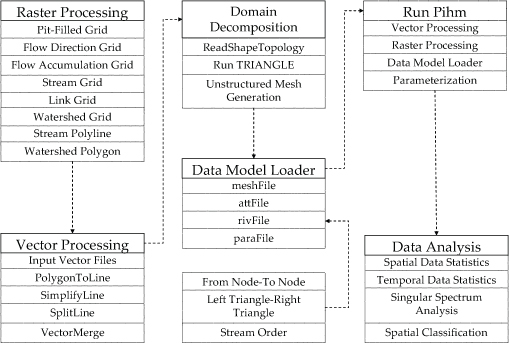

# PIHM分布式水文模型介绍

## 1、简介

The Penn State Integrated Hydrologic Model
([PIHM](http://www.pihm.psu.edu/pihm_home.html)) is a multiprocess,
multi-scale hydrologic model where the major hydrological processes are
fully coupled using the semi-discrete finite volume method. The model
itself is \"tightly-coupled\"
with [PIHMgis](http://www.pihm.psu.edu/pihmgis_home.html), an
open-source Geographical Information System designed for PIHM. The
PIHMgis provides the interface to PIHM, access to the digital data sets
(terrain, forcing and parameters) and tools necessary to drive the
model, as well as a collection of GIS-based pre- and post-processing
tools. Collectively the system is referred to as the Penn State
Integrated Hydrologic Modeling System. The modeling system has been
written in C/C++, while the GIS interface is supported
by [Qt](http://trolltech.com/products/qt).

PIHM represents our strategy for the synthesis of multi-state,
multiscale distributed hydrologic models using the integral
representation of the underlying physical process equations and state
variables. Our interest is in devising a concise representation of
watershed and/or river basin hydrodynamics, which allows interactions
among major physical processes operating simultaneously, but with the
flexibility to add or eliminate states/processes/constitutive relations
depending on the objective of the numerical experiment or purpose of the
scientific or operational application.

The approach is based on the semi-discrete finite-volume method (FVM)
which represents a system of coupled partial differential equations
(e.g. groundwater-surface water, overland flow-infiltration, etc.) in
integral form, as a spatially-discrete system of ordinary differential
equations. Domain discretization is fundamental to the approach and an
unstructured triangular irregular network (e.g. Delaunay triangles) is
generated with constraints (geometric, and parametric)
using [TRIANGLE](http://www.cs.cmu.edu/~quake/triangle.html). A local
prismatic control volume is formed by vertical projection of the
Delauney triangles forming each layer of the model. Given a set of
constraints (e.g. river network support, watershed boundary, altitude
zones, ecological regions, hydraulic properties, climate zones, etc), an
"optimal" mesh is generated. River volume elements are also prismatic,
with trapezoidal or rectangular cross-section, and are generated along
edges of river triangles. The local control volume contains all
equations to be solved and is referred to as the model kernel. The
global ODE system is assembled by combining all local ODE systems
throughout the domain and then solved by a state-of-the-art parallel ODE
solver known as [CVODE](http://www.llnl.gov/CASC/sundials/) developed at
the Lawrence- Livermore National Laboratory.

The Penn State Integrated Hydrologic Model (PIHM) is a fully coupled
multiprocess hydrologic model. Instead of coupling through artificial
boundary conditions, major hydrological processes are fully coupled by
the semi-discrete finite volume approach. For those processes whose
governing equations are partial differential equations (PDE), we first
discretize in space via the finite volume method. This results in a
system of ordinary differential equations (ODE) representing those
procesess within the control volume. Within the same control volume,
combining other processes whose governing equations are ODE's, (e.g. the
snow accumulation and melt process), a local ODE system is formed for
the complete dynamics of the finite volume. After assembling the local
ODE system throughout the entire domain, the global ODE system is formed
and solved by a state-of-art ODE solver.

{width="5.291666666666667in"
height="2.925in"}

## 2、多物理过程分布式水文模拟系统

PIHM has incorporated channel routing, surface overland flow, and
subsurface flow together with interception, snow melt and
evapotranspiration using the semi-discrete approach with FVM. Table 1
shows all these processes along with the original and reduced governing
equations. For channel routing and overland flow which is governed by
St. Venant equations, both kinematic wave and diffusion wave
approximation are included. For saturated groundwater flow, the 2-D
Dupuit approximation is applied. For unsaturated flow, either shallow
groundwater assumption in which unsaturated soil moisture is dependent
on groundwater level or 1-D vertical integrated form of Richards's
equation can be applied. From physical arguments, it is necessary to
fully couple channel routing, overland flow and subsurface flow in the
ODE solver.

Snowmelt, vegetation and evapotranspiration are assumed to be weakly
coupled. That is, these processes are calculated at end of each time
step, which is automatically selected within a user specified range in
the ODE solver.

  -------------------------------------------------------------------------------
  物理过程         控制方程/模型      原始控制方程              半离散形式的ODE
  ---------------- ------------------ ------------------------- -----------------
  河道汇流         圣维南方程            

  坡面流           浅水方程              

  非饱和壤中流     Richard方程                                  

  地下水流         Richard方程                                  

  植被截流         Bucket Model                                 

  融雪             ISNOBAL Model                                

  蒸腾             Pennman-Monteith                             
                   Method                                       
  -------------------------------------------------------------------------------

## 3、PIHMGis

3.1 Overview

Physically-based fully-distributed hydrologic models try to simulate
hydrologic state variables in space and time while using information
regarding heterogeneity in climate, land use, topography and
hydrogeology. However incorporating a large number of physical data
layers in the hydrologic model requires intensive data development and
topology definitions. Traditionally GIS has been used for data
management, data analysis and visualization. But proprietary data
structures, platform dependence, isolated data model and non-dynamic
data-interaction with pluggable software components of existing GIS
frameworks, makes it restrictive to perform sophisticated numerical
modeling.

In this effort we present a "tightly-coupled" GIS interface to Penn
State Integrated Hydrologic Model (PIHM) called PIHMgis which is open
source, platform independent and extensible. The tight coupling between
GIS and the model is achieved by developing a shared data-model and
hydrologic-model data structure.

3.2 Coupling

PIHMgis demonstrates an integration methodology for an open source GIS
framework and a integrated hydrologic model that enables users to take
advantage of object oriented computer programming (OOP) to provide more
direct access to the GIS data structure to better support efficient
query and data transfer between the hydrologic model and GIS. The data
structure has been designed to be flexible for modification and
customization of the model or GIS, rich enough to represent complex user
defined spatial relations and extensible to add more software tools as
need be. The "tightly-coupled" integrated GIS interface to Penn State
Integrated Hydrologic Model (PIHM) has been created in the Open
Source [Quantum GIS](http://www.pihm.psu.edu/www.qgis.org).

Modularity is achieved via the plugin architecture which provides a
mechanism for third parties to extend the QGIS core application while
maintaining independent development paths. QGIS has a simple plugin
mechanism that can be used to add new functionality to QGIS without
needing to modify the core source code. Users can write-in plugins to
add additional functionality (models, special viewers, hot-link
handlers, data editors, etc.) and pass these along to any number of
clients and end users. PIHMgis is an external plugin to QGIS with an
independent build system in order to maximize flexibility in using and
extending the software.

### 3.3 INTERFACE

PIHMgis is an integrated and extensible GIS system with data management,
data analysis, data modeling, unstructured mesh generation and
distributed PIHM modeling capabilities. The underlying philosophy of
this integrated system is a shared geo-data model between GIS and PIHM
thus making it possible to handle the complexity of the different data
models, representation structures and model simulations.

PIHMgis has been developed using basic [[QGIS source
code]{.underline}](http://download.qgis.org/qgis/src/). The GUI
component of PIHMgis have been written in Qt, which is a cross-platform
graphical widget toolkit and C++ while the algorithms and the hydrologic
model PIHM have been coded in C and C++.

The interface is interactive and procedural. Figure shows a snapshot of
PIHMgis interface. At each step, "Help" guides the user about the
processes, the underlying algorithms, and provides guidance on selecting
control parameters.

-PIHMgis Snapshot -

ARCHITECTURAL FRAMEWORK

The architectural framework of the PIHMgis, as depicted in following
figure, shows the functionalities and concepts inherent to it. The
direction of arrows in Figure 4 indicates the possible flow of output
from each of the functionalities. For example, the geodatabase gets
enriched by the data-accessor or outputs from data-management or PIHM
modules. The PIHMgis interface facilitates a range of potential to
analyze like spatio-temporal statistics on outputs from the
data-management module, raw data or enriched geo-database.

{width="4.538888888888889in"
height="2.6in"}

 

 

PROCEDURAL FRAMEWORK

The procedural framework of the interface is shown in Figure. In the
first step, raster-DEM-processing is facilitated for watershed
delineation and stream definition. The Vector Processing module aids
users in defining watershed properties and grid constraints using points
(stream gauge, ground water observation-well locations), polygons
(watershed and subshed boundary obtained in raster processing step,
physiographic boundaries) and polylines (streams obtained from raster
processing step). The domain constraints as well as internal and
external boundaries are used to generate constrained Delaunay
triangulations with certain restrictions on the minimum angle of each
triangle. Before solving the finite volume based ODEs defined for each
triangle, the respective forcing, soil parameters and boundary condition
values are assigned in an automated way in Data Model Loader Module.
Topology is used in PIHM to calculate the fluxes in and out of each mesh
element. The parameters and topology embedded in the geodatabase, is
shared by the PIHM data structure to support numerical calculations at
each time step. Finally, statistical and other kind of data analysis can
be performed on the model output using data-analysis module.

{width="5.304166666666666in"
height="3.573611111111111in"}
