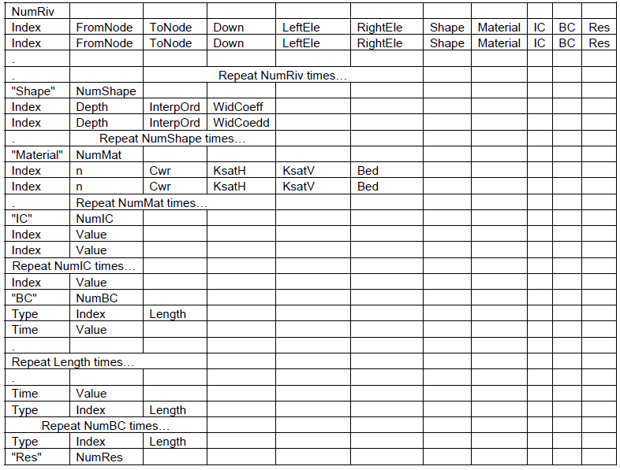

# PIHM输入文件说明

# 前处理

PIHM2.0模型主要输入文件有**11**个，可使用基于QGIS的PIHMGis软件生成，也可以自己编程生成。

## 1 mesh 文件

（1）文件数据结构：

{width="5.037890419947507in"
height="1.6526312335958004in"}

（2）参数描述：

{width="5.030643044619422in"
height="2.3879943132108488in"}

需要：地表高程数据和基岩高程数据（或者土壤深度）

（3）需要的数据文件及处理方式：

模拟流域的DEM数据，经过PIHMGis软件前处理，可生成mesh文件。

## 2 att文件

存储每个网格单元的物理参数，包括：soil type, land cover type,
其他作用力。

（1）文件数据结构：

{width="5.4591666666666665in"
height="0.6035662729658793in"}

注：数据存储在**单元**上。

需要数据：

土壤类型（Soil Class)

地质类型(Geology Class)

地覆盖类型(Land cover Class)

初始条件：截留存储量、积雪、地下流状态、非饱和状态

时间序列：降雨、气温、相对湿度、风速、太阳辐射、蒸汽压强、融雪因子、源汇

三角形单元的边界条件类型

[数据下载网站，中国土壤数据库（要注册）;也可以在globalchange.bnu.cn上下载]{.mark}

http://soil.geodata.cn/

（2）参数描述：

{width="5.330458223972004in"
height="3.9790583989501314in"}

（3）需要的数据文件及处理方式：

生成mesh文件过程中的TIN shape file；

若干种物理变量的栅格分类数据(raster classification
map)，注意：栅格数据需要包含TIN网格区域，且空间参考坐标要一致。

栅格分类数据可以到相关网站下载，也可以自己处理生成。香溪河的有一些数据，在XXH_DB.mdb文件里面找，有些没有需要到相关网站上下载。

PIHMGis分为3大类：forcing, landuse/landcover, miscellaneous

## 3 soil文件

存储所有与不同土壤类别表面/地下流动相关的水文和水力参数。

（1）文件数据结构：

{width="5.325159667541557in"
height="1.0604155730533684in"}

（2）参数描述：

{width="5.768055555555556in"
height="2.220833333333333in"}

（3）需要的数据文件及处理方式：

ROSETTA：美国盐化实验室 (USDA-ARS)
的软件，可以成为获取这些参数的有用工具。PIHMGis有此计算功能。

## 4 geol文件

（1）文件数据结构：

{width="5.768055555555556in"
height="0.9048611111111111in"}

（2）参数描述：

{width="5.768055555555556in"
height="2.3895833333333334in"}

（3）需要的数据文件及处理方式：

存储所有与地下流不同地质类别相关的水文和水力参数。

## 5 lc文件

（1）文件数据结构：

{width="5.486719160104987in"
height="1.4162685914260718in"}

（2）参数描述：

{width="5.572656386701662in"
height="1.8886384514435695in"}

（3）需要的数据文件及处理方式：

存储模拟流域中存在的不同土地覆盖类别的几个植被参数。

## 6 riv文件

（1）文件数据结构：

{width="5.768055555555556in"
height="4.3805555555555555in"}

（2）参数描述：

{width="5.445360892388451in"
height="5.906286089238845in"}

（3）需要的数据文件及处理方式：

存储与河段相关的拓扑信息。还提供了河段的不同形状和材料特性。其他变量，如关于河段的初始条件和边界条件放置在此文件的末尾。

## 7 forc文件

（1）文件数据结构：

{width="5.768055555555556in"
height="3.138888888888889in"}

（2）参数描述：

{width="5.768055555555556in" height="3.18125in"}

（3）需要的数据文件及处理方式：

存储所有外力变量信息（时间序列）。

## 8 ibc文件

（1）文件数据结构：

{width="2.24332239720035in"
height="4.47911854768154in"}

（2）参数描述：

{width="5.376052055993001in"
height="1.6472495625546806in"}

（3）需要的数据文件及处理方式：

存储与单元相对应的边界条件的所有信息。

## 9 para文件

（1）文件数据结构：

{width="5.768055555555556in"
height="2.004166666666667in"}

（2）参数描述：

{width="5.768055555555556in"
height="3.6104166666666666in"}

{width="5.768055555555556in"
height="4.501388888888889in"}

（3）需要的数据文件及处理方式：

para文件为模型提供所有的控制数据。它包含规划求解选项；模型模式；还控制模型错误的参数。

## 10 init文件

init 文件包含所有初始状态条件变量。

{width="5.768055555555556in"
height="1.5652777777777778in"}

## 11 calib文件

（1）文件数据结构：

{width="5.145190288713911in"
height="2.010165135608049in"}

（2）参数描述：

{width="5.768055555555556in"
height="4.052777777777778in"}

（3）需要的数据文件及处理方式：

提供了校准几个物理参数的控制。

# 后处理

PIHM的计算结果可使：

-   MATLAB程序分析

-   自己编程分析

-   用Tecplot软件可视化流域特性分布。

# BPCC模型输入的基础地理数据

GBHM模型使用的基础地理信息数据包括：

-   美国联邦地质调查局( USGS) 提供的100m DEM ；SRTM_90m

-   全球土地利用分类数据库2.0版(分辨率为1 km) ;

-   联合国国际粮农组织( FAO) 提供的全球土壤分类数据( 分辨率为10 km) ;

-   来源于IGBPDIS全球土壤数据的土壤水分参数;

-   分布及其季节变化用逐旬的植被叶面积指数(LAI) 来反映，由SPOT
    卫星逐旬的归一化植被指数(NDVI) 遥感影像推算得到(分辨率为1 km) 。

BPCC模型使用的基础地理数据包括：

DEM数据（中国科学院地理科学与资源研究所数据中心）精度为1：25万，水平分辨率为25m，垂直分辨率为1m

土地利用方式：将1：10万的ESRI
Shape格式的研究区域的分区土地利用类型图（中国科学院地理科学与资源研究所数据中心），应用ArcGIS
9软件进行合并，并用流域边界作为掩膜（Mask）进行切割，得到研究区的土地利用方式图（见）。原始文件的土地利用方式共有24种，其中香溪河流域含16种，将其重新归类为6种，见。新的土地利用方式所对应的基本参数见。

土壤类型：将1：100万的ESRI Shape格式的研究区域的分区土壤类型图（Shi X Z
et al，2002；史学正 等，2004），应用ArcGIS
9软件进行合并，并用流域边界作为掩膜进行切割，得到研究区的土壤类型图（见）。

NDVI和植被覆盖率资料：

植被随季节的变化用逐月的叶面积指数（LAI）来表示，该指数根据逐月的NDVI数据来估算，而NDVI数据来源于遥感数据。本文根据所获取的ETM遥感图像（http://glcfapp.umiacs.umd.edu:8080/esdi/index.jsp），由ERDAS解译得出NDVI。Deering于1978年提出如下形式的NDVI计算式：

+---------+-------------------------------------------------+---------+
|         | >                       | >       |
|         |                                                 | （5-1） |
+=========+=================================================+=========+
+---------+-------------------------------------------------+---------+

式中，为近红外波段，对应于ETM遥感图像的第4波段；为红色光波段，对应于ETM遥感图像的第3波段。

土壤属性数据：

土壤物理属性主要包括饱和水力传导率、饱和含水量、残余含水量等。土壤水分运移参数见

气象资料数据：时间和空间插值。

**参考文献**

李哲，杨大文，田富强. 2013. 基于地面雨情信息的长江三峡区间洪水预报研究.
水力发电学报, 32(1): 44-49.
