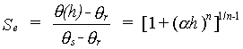

***ROSETTA Hydraulic Functions***

  -----------------------------------------------------------------------
  The present version of Rosetta is capable of predicting van Genuchten
  (1980) water retention and unsaturated hydraulic conductivity
  parameters, as well as of providing estimates of the saturated
  hydraulic conductivity, K~s~. The van Genuchten water retention
  function is given by:
  -----------------------------------------------------------------------
   

  {width="2.272222222222222in"
  height="0.5756944444444444in"}

   

  where *?*(*h*) represents the water retention curve defining the water
  content, *?* (cm^3^/cm^3^), as a function of the soil water pressure
  head *h* (cm), *?~r~* and *?~s~* (cm^3^/cm^3^) are residual and
  saturated water contents, respectively, while a (1/cm) and *n* are
  curve shape parameters. This equation can be rewritten to yield the
  relative saturation, *S*~e~:

   

  {width="2.8243055555555556in"
  height="0.5756944444444444in"}

   

  This equation is used in conjunction with the pore-size distribution
  model by Mualem (1976) to yield the van Genuchten-Mualem model (van
  Genuchten, 1980):

   

  {width="3.0479166666666666in"
  height="0.32013888888888886in"}

   

  n which* K~o~* is the matching point at saturation (cm/day) and
  similar, but not necessarily equal, to the saturated hydraulic
  conductivity, *K*~s~. The parameter *L* (-) is an empirical pore
  tortuosity/connectivity parameter that is normally assumed to be 0.5
  (*Mualem*, 1976). Rosetta predicts *L* which will be negative in most
  cases. Although this leads to some theoretical complications,
  negative *L* values give far better results (cf., Kosugi, 1999; Schaap
  and Leij, 1999).
  -----------------------------------------------------------------------

  -----------------------------------------------------------------------
  ROSETTA Class Average Hydraulic Parameters
  -----------------------------------------------------------------------

  -----------------------------------------------------------------------

+-----------------------------------------------------------------------+
| The table below gives class-average values of the seven hydraulic     |
| parameters for the twelve USDA textural classes. Effectively, this    |
| table represents the first model of the hierarchical sequence. For    |
| the θr, θ s, α, n and Ks parameters, the values have been generated   |
| by computing the average values for each textural class. For Ko and L |
| the values were generated by inserting the class average values       |
| of θr, θs, α, n into Model C2 (see Rosetta\'s help file). This means  |
| that Ko and L are based on predicted parameters and may not be very   |
| reliable. The values in parentheses give the one standard deviation   |
| uncertainties of the class average values                             |
+=======================================================================+
|                                                                       |
+-----------------------------------------------------------------------+
| <table>                                                               |
| <colgroup>                                                            |
| <col style="width: 6%" />                                             |
| <col style="width: 4%" />                                             |
| <col style="width: 5%" />                                             |
| <col style="width: 6%" />                                             |
| <col style="width: 5%" />                                             |
| <col style="width: 7%" />                                             |
| <col style="width: 5%" />                                             |
| <col style="width: 7%" />                                             |
| <col style="width: 5%" />                                             |
| <col style="width: 6%" />                                             |
| <col style="width: 5%" />                                             |
| <col style="width: 6%" />                                             |
| <col style="width: 5%" />                                             |
| <col style="width: 6%" />                                             |
| <col style="width: 5%" />                                             |
| <col style="width: 7%" />                                             |
| </colgroup>                                                           |
| <thead>                                                               |
| <tr class="header">                                                   |
| <th><strong>Texture                                              |
| Class</strong></th>                                                   |
| <th>
<strong>N</strong>
                                         |
| 
 
</th>                                                         |
| <th colspan="2"><strong>-- θr --                                 |
| cm3/cm3</strong></th>                                                 |
| <th colspan="2"><strong>-- θs --                                 |
| cm3/cm3</strong></th>                                                 |
| <th colspan="2"><strong>-- log(α) --                             |
| log(1/cm)</strong></th>                                               |
| <th colspan="2"><strong>-- log(n) --                             |
| log10</strong></th>                                                   |
| <th colspan="2"><strong>-- Ks --                                 |
| log(cm/day)</strong></th>                                             |
| <th colspan="2"><strong>-- Ko --                                 |
| log(cm/day)</strong></th>                                             |
| <th colspan="2"><strong>-- L --                                  |
|  </strong></th>                                                       |
| </tr>                                                                 |
| </thead>                                                              |
| <tbody>                                                               |
| <tr class="odd">                                                      |
| <td>Clay</td>                                                         |
| <td>84</td>                                                           |
| <td>0.098</td>                                                        |
| <td>(0.107)</td>                                                      |
| <td>0.459</td>                                                        |
| <td>(0.079)</td>                                                      |
| <td>-1.825</td>                                                       |
| <td>(0.68)</td>                                                       |
| <td>0.098</td>                                                        |
| <td>(0.07)</td>                                                       |
| <td>1.169</td>                                                        |
| <td>(0.92)</td>                                                       |
| <td>0.472</td>                                                        |
| <td>(0.26)</td>                                                       |
| <td>-1.561</td>                                                       |
| <td>(1.39)</td>                                                       |
| </tr>                                                                 |
| <tr class="even">                                                     |
| <td>C loam</td>                                                       |
| <td>140</td>                                                          |
| <td>0.079</td>                                                        |
| <td>(0.076)</td>                                                      |
| <td>0.442</td>                                                        |
| <td>(0.079)</td>                                                      |
| <td>-1.801</td>                                                       |
| <td>(0.69)</td>                                                       |
| <td>0.151</td>                                                        |
| <td>(0.12)</td>                                                       |
| <td>0.913</td>                                                        |
| <td>(1.09)</td>                                                       |
| <td>0.699</td>                                                        |
| <td>(0.23)</td>                                                       |
| <td>-0.763</td>                                                       |
| <td>(0.90)</td>                                                       |
| </tr>                                                                 |
| <tr class="odd">                                                      |
| <td>Loam</td>                                                         |
| <td>242</td>                                                          |
| <td>0.061</td>                                                        |
| <td>(0.073)</td>                                                      |
| <td>0.399</td>                                                        |
| <td>(0.098)</td>                                                      |
| <td>-1.954</td>                                                       |
| <td>(0.73)</td>                                                       |
| <td>0.168</td>                                                        |
| <td>(0.13)</td>                                                       |
| <td>1.081</td>                                                        |
| <td>(0.92)</td>                                                       |
| <td>0.568</td>                                                        |
| <td>(0.21)</td>                                                       |
| <td>-0.371</td>                                                       |
| <td>(0.84)</td>                                                       |
| </tr>                                                                 |
| <tr class="even">                                                     |
| <td>L Sand</td>                                                       |
| <td>201</td>                                                          |
| <td>0.049</td>                                                        |
| <td>(0.042)</td>                                                      |
| <td>0.390</td>                                                        |
| <td>(0.070)</td>                                                      |
| <td>-1.459</td>                                                       |
| <td>(0.47)</td>                                                       |
| <td>0.242</td>                                                        |
| <td>(0.16)</td>                                                       |
| <td>2.022</td>                                                        |
| <td>(0.64)</td>                                                       |
| <td>1.386</td>                                                        |
| <td>(0.24)</td>                                                       |
| <td>-0.874</td>                                                       |
| <td>(0.59)</td>                                                       |
| </tr>                                                                 |
| <tr class="odd">                                                      |
| <td>Sand</td>                                                         |
| <td>308</td>                                                          |
| <td>0.053</td>                                                        |
| <td>(0.029)</td>                                                      |
| <td>0.375</td>                                                        |
| <td>(0.055)</td>                                                      |
| <td>-1.453</td>                                                       |
| <td>(0.25)</td>                                                       |
| <td>0.502</td>                                                        |
| <td>(0.18)</td>                                                       |
| <td>2.808</td>                                                        |
| <td>(0.59)</td>                                                       |
| <td>1.389</td>                                                        |
| <td>(0.24)</td>                                                       |
| <td>-0.930</td>                                                       |
| <td>(0.49)</td>                                                       |
| </tr>                                                                 |
| <tr class="even">                                                     |
| <td>S Clay</td>                                                       |
| <td>11</td>                                                           |
| <td>0.117</td>                                                        |
| <td>(0.114)</td>                                                      |
| <td>0.385</td>                                                        |
| <td>(0.046)</td>                                                      |
| <td>-1.476</td>                                                       |
| <td>(0.57)</td>                                                       |
| <td>0.082</td>                                                        |
| <td>(0.06)</td>                                                       |
| <td>1.055</td>                                                        |
| <td>(0.89)</td>                                                       |
| <td>0.637</td>                                                        |
| <td>(0.34)</td>                                                       |
| <td>-3.665</td>                                                       |
| <td>(1.80)</td>                                                       |
| </tr>                                                                 |
| <tr class="odd">                                                      |
| <td>S C L</td>                                                        |
| <td>87</td>                                                           |
| <td>0.063</td>                                                        |
| <td>(0.078)</td>                                                      |
| <td>0.384</td>                                                        |
| <td>(0.061)</td>                                                      |
| <td>-1.676</td>                                                       |
| <td>(0.71)</td>                                                       |
| <td>0.124</td>                                                        |
| <td>(0.12)</td>                                                       |
| <td>1.120</td>                                                        |
| <td>(0.85)</td>                                                       |
| <td>0.841</td>                                                        |
| <td>(0.24)</td>                                                       |
| <td>-1.280</td>                                                       |
| <td>(0.99)</td>                                                       |
| </tr>                                                                 |
| <tr class="even">                                                     |
| <td>S loam</td>                                                       |
| <td>476</td>                                                          |
| <td>0.039</td>                                                        |
| <td>(0.054)</td>                                                      |
| <td>0.387</td>                                                        |
| <td>(0.085)</td>                                                      |
| <td>-1.574</td>                                                       |
| <td>(0.56)</td>                                                       |
| <td>0.161</td>                                                        |
| <td>(0.11)</td>                                                       |
| <td>1.583</td>                                                        |
| <td>(0.66)</td>                                                       |
| <td>1.190</td>                                                        |
| <td>(0.21)</td>                                                       |
| <td>-0.861</td>                                                       |
| <td>(0.73)</td>                                                       |
| </tr>                                                                 |
| <tr class="odd">                                                      |
| <td>Silt</td>                                                         |
| <td>6</td>                                                            |
| <td>0.050</td>                                                        |
| <td>(0.041)</td>                                                      |
| <td>0.489</td>                                                        |
| <td>(0.078)</td>                                                      |
| <td>-2.182</td>                                                       |
| <td>(0.30)</td>                                                       |
| <td>0.225</td>                                                        |
| <td>(0.13)</td>                                                       |
| <td>1.641</td>                                                        |
| <td>(0.27)</td>                                                       |
| <td>0.524</td>                                                        |
| <td>(0.32)</td>                                                       |
| <td>0.624</td>                                                        |
| <td>(1.57)</td>                                                       |
| </tr>                                                                 |
| <tr class="even">                                                     |
| <td>Si Clay</td>                                                      |
| <td>28</td>                                                           |
| <td>0.111</td>                                                        |
| <td>(0.119)</td>                                                      |
| <td>0.481</td>                                                        |
| <td>(0.080)</td>                                                      |
| <td>-1.790</td>                                                       |
| <td>(0.64)</td>                                                       |
| <td>0.121</td>                                                        |
| <td>(0.10)</td>                                                       |
| <td>0.983</td>                                                        |
| <td>(0.57)</td>                                                       |
| <td>0.501</td>                                                        |
| <td>(0.27)</td>                                                       |
| <td>-1.287</td>                                                       |
| <td>(1.23)</td>                                                       |
| </tr>                                                                 |
| <tr class="odd">                                                      |
| <td>Si C L</td>                                                       |
| <td>172</td>                                                          |
| <td>0.090</td>                                                        |
| <td>(0.082)</td>                                                      |
| <td>0.482</td>                                                        |
| <td>(0.086)</td>                                                      |
| <td>-2.076</td>                                                       |
| <td>(0.59)</td>                                                       |
| <td>0.182</td>                                                        |
| <td>(0.13)</td>                                                       |
| <td>1.046</td>                                                        |
| <td>(0.76)</td>                                                       |
| <td>0.349</td>                                                        |
| <td>(0.26)</td>                                                       |
| <td>-0.156</td>                                                       |
| <td>(1.23)</td>                                                       |
| </tr>                                                                 |
| <tr class="even">                                                     |
| <td>Si Loam</td>                                                      |
| <td>330</td>                                                          |
| <td>0.065</td>                                                        |
| <td>(0.073)</td>                                                      |
| <td>0.439</td>                                                        |
| <td>(0.093)</td>                                                      |
| <td>-2.296</td>                                                       |
| <td>(0.57)</td>                                                       |
| <td>0.221</td>                                                        |
| <td>(0.14)</td>                                                       |
| <td>1.261</td>                                                        |
| <td>(0.74)</td>                                                       |
| <td>0.243</td>                                                        |
| <td>(0.26)</td>                                                       |
| <td>0.365</td>                                                        |
| <td>(1.42)</td>                                                       |
| </tr>                                                                 |
| </tbody>                                                              |
| </table>                                                              |
+-----------------------------------------------------------------------+
| **Abstract**                                                          |
|                                                                       |
| Mathematical models have become increasingly popular in both research |
| and management problems involving flow and transport processes in the |
| subsurface. The unsaturated hydraulic functions are key input data in |
| numerical models of vadose zone processes. These functions may be     |
| either measured directly or estimated indirectly through prediction   |
| from more easily measured data based using quasi-empirical models.    |
| Rosetta V1.0 is a Windows 95/98 program to estimate unsaturated       |
| hydraulic properties from surrogate soil data such as soil texture    |
| data and bulk density. Models of this type are called pedotransfer    |
| functions (PTFs) since they translate basic soil data into hydraulic  |
| properties. Rosetta can be used to estimate the following properties: |
|                                                                       |
| -   Water retention parameters according to van Genuchten (1980)      |
|                                                                       |
| -   Saturated hydraulic conductivity                                  |
|                                                                       |
| -   Unsaturated hydraulic conductivity parameters according to van    |
|     Genuchten (1980) and Mualem (1976)                                |
|                                                                       |
| [Detailed description of the hydraulic                                |
| func                                                                  |
| tions](https://www.ars.usda.gov/Services/docs.htm?docid=8954) Rosetta |
| offers five PTFs that allow prediction of the hydraulic properties    |
| with limited or more extended sets of input data. This hierarchical   |
| approach is of a great practical value because it permits optimal use |
| of available input data. The models use the following hierarchical    |
| sequence of input data                                                |
|                                                                       |
| -   Soil textural class                                               |
|                                                                       |
| -   Sand, silt and clay percentages                                   |
|                                                                       |
| -   Sand, silt and clay percentages and bulk density                  |
|                                                                       |
| -   Sand, silt and clay percentages, bulk density \                   |
|     and a water retention point at 330 cm (33 kPa).                   |
|                                                                       |
| -   Sand, silt and clay percentages, bulk density \                   |
|     and water retention points at 330 and 15000 cm (33 and 1500 kPa)  |
|                                                                       |
| The first model is based on a [lookup                                 |
| table](https://www.ars.usda.gov/Services/docs.htm?docid=8955) that    |
| provides class average hydraulic parameters for each USDA soil        |
| textural class. The other four models are based on neural network     |
| analyses and provide more accurate predictions when more input        |
| variables are used. In addition to the hierarchical approach, we also |
| offer a model that allows prediction of the unsaturated hydraulic     |
| conductivity parameters from fitted van Genuchten (1980) retention    |
| parameters (Schaap and Leij, 1999). This model is also used in the    |
| hierarchical approach such that it automatically uses the predicted   |
| retention parameters as input, instead of measured (fitted) retention |
| parameters.\                                                          |
| \                                                                     |
| All estimated hydraulic parameters are accompanied by uncertainty     |
| estimates that permit an assessment of the reliability of Rosetta\'s  |
| predictions. These uncertainty estimates were generated by combining  |
| the neural networks with the bootstrap method (see Schaap and Leij    |
| (1998) and Schaap et al. (1999) for more information).                |
+-----------------------------------------------------------------------+
| **Data input and output**                                             |
|                                                                       |
| Rosetta is based on ACCESS-97 database tables which allow efficient   |
| handling and lookup of small and large volumes of data. Data can be   |
| either manually entered or read from ASCII files. The maximum amount  |
| of samples (records) that Rosetta can handle is limited by the        |
| available hard disk space. Estimated hydraulic properties can be      |
| exported in ASCII files and used in other programs. ACCESS-97 is not  |
| required to run Rosetta; however, ACCESS-97 can be used to manage     |
| Rosetta\'s predictions in a larger project, provided that the tables  |
| created by Rosetta are not altered.                                   |
+-----------------------------------------------------------------------+

参考文献

Kosugi, K. 1999. General model for unsaturated hydraulic conductivity
for soils with lognormal pore-size distribution. Soil Sci. Soc. Am. J.
63:270-277.\
\
Mualem, Y. 1976. A new model predicting the hydraulic conductivity of
unsaturated porous media. Water Resour. Res. 12:513-522.\
\
Schaap, M.G. and W. Bouten. 1996. Modeling water retention curves of
sandy soils using neural networks. Water Resour. Res. 32:3033-3040.\
\
Schaap, M.G., Leij F.J. and van Genuchten M.Th. 1998. Neural network
analysis for hierarchical prediction of soil water retention and
saturated hydraulic conductivity. Soil Sci. Soc. Am. J. 62:847-855.\
\
Schaap, M.G., and F.J. Leij, 1998. Database Related Accuracy and
Uncertainty of Pedotransfer Functions, Soil Science 163:765-779.\
\
Schaap, M.G., F.J. Leij and M. Th. van Genuchten. 1999. A
bootstrap-neural network approach to predict soil hydraulic parameters.
In: van Genuchten, M.Th., F.J. Leij, and L. Wu (eds), Proc. Int.
Workshop, Characterization and Measurements of the Hydraulic Properties
of Unsaturated Porous Media, pp 1237-1250, University of California,
Riverside, CA.\
\
Schaap, M.G., F.J. Leij, 1999, Improved prediction of unsaturated
hydraulic conductivity with the Mualem-van Genuchten, Submitted to Soil
Sci. Soc. Am. J.\
\
van Genuchten, M.Th. 1980. A closed-form equation for predicting the
hydraulic conductivity of unsaturated soils. Soil Sci. Am. J.
44:892-898.
