# ParFlow模型介绍

Integrated Hydrologic Models
(IHMs)可以在一个框架下集成地表水系统和地下水系统。IHMs模拟技术一直在发展，但主要面对开发者，而不是一般用户。

ParFlow是一个并行化、集成的水文模型，可模拟地表水和地下水。ParFlow求解描述3D变化饱和地下水系统的Richards方程和2D动力波近似浅水方程的坡面流。ParFlow采用守恒的中心有限差分法求解地下水，采用守恒的有限体积法求解物质输移。ParFlow使用多重网格预处理的Krylov和Newton-Krylov方法在每一时间步求解线性和非线性方程组。ParFlow表现出很好的并行求解功能。ParFlow与地球化学反应、陆面模型（CLM）和大气模型耦合，研究地下、陆面和大气系统等跨尺度的相互作用。

## 前言(What exactly can IHM do today?)

ParFlow是并行化集成的水文模型，模拟地表水、非饱和的地下水(Maxwell et
al., 2016)。ParFlow计算地下与地上和地表(overland
flow)的通量：均以水头梯度来驱动。采用三维Richards方程模拟变饱和地下水。使用自由坡面流边界条件及Manning方程和动力波方程的饱和或超渗透边界，生成坡面流。ParFlow采用完全耦合或集成方法求解这些控制方程，其中地表水和地下水使用3D形式的Richards方程，或者使用间接方法---可以分离不同模块，分别求解不同系统的流动（地表或地下水）。集成方法允许地表水与地下水之间动态演变的相互联系。相互联系仅仅与物理系统和控制方程的属性有关。水流模块顺序求解。ParFlow采用时间项隐式向后Euler差分格式求解，空间上采用中心差分格式求解。对于坡面流，采用隐式向后Euler差分格式求解，空间上采用迎风格式求解。

ParFlow的基于物理机制的方法需要大量的参数化，包括：地下水力特性，如孔隙度、饱和水力传导度、压力-饱和度关系参数(相对渗透)等。

## 模块介绍

ParFlow可以以3种不同模式运行：（1）变饱和；（2）恒定态饱和；（3）集成流域水文。但所有模式都公用稀疏系数矩阵求解框架。

### 变饱和水流

模拟河流-含水层交换（自由液面流动和地下水）和高度各向异性问题。

Richards方程：

### 恒定态饱和流

模拟假设条件下，线性的地下水流动，可使用此模式。

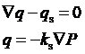

ParFlow使用IMPES求解器，求解单相、完全饱和的恒定态条件。

### 坡面流

2D浅水坡面流的连续方程：

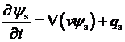

动力波近似：忽略动量方程中的动力和扩散项：

使用曼宁公式生成水流的深度-流量关系：

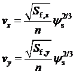

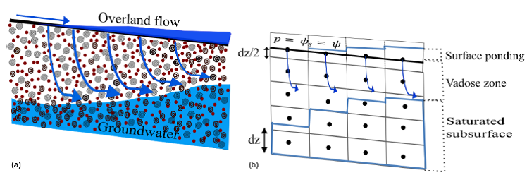

图1
耦合的地表水和地下水系统：(a)坡面流边界条件（在地面处压力和通量是连续的）；(b)方程表明：在地表处，垂向平均表面压力和地下压力水头相等，是ParFlow使用的坡面流边界

### 多相流和物质输移

多孔介质中的多相流的物质平衡和动量方程：

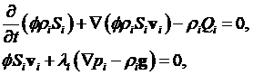

## 计算网格

ParFlow使用规则的结构网格，目前有2种形式：正交网格与地形跟踪网格(TFG)，两种形式都允许垂向变化离散。

### 正交网格

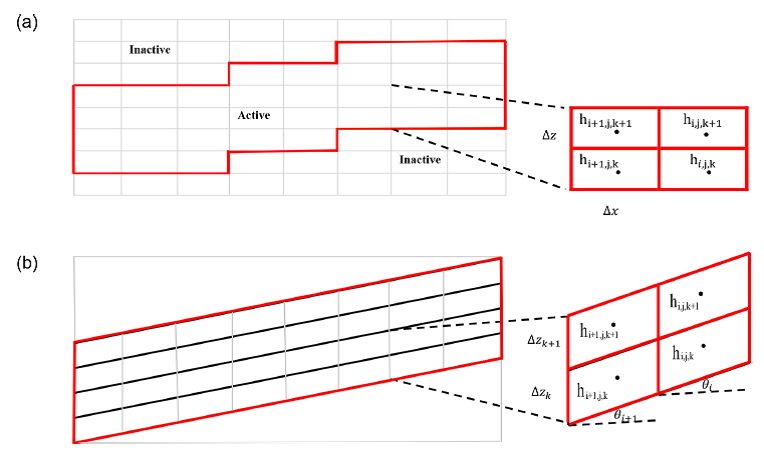

图2 正交网格(a)和地形跟踪网格(b)：i, j, k是x, y, z单元编号

### 地形跟踪网格

地形跟踪网格转换：

## 方程离散和求解器

### 变饱和流动的Newton-Krylov求解器

在KINSOL软件包中实施不精确的Newton-Krylov方法。

对变饱和流动，ParFlow使用GMRES Krylov方法求解。图3是流程图。

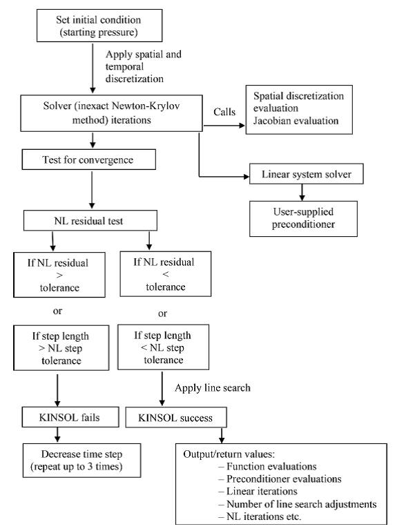

图3 ParFlow的线性和非线性系统求解流程图

### 多重网格求解器

ParFlow Multigrid
(FPMG)算法。多重网格算法用于离散椭圆型PDE，理想情况下收敛速率与求解规模无关。ParFlow在hypre库中实施PFMG。

对于变饱和流动，ParFlow采用Newton-Krylov方法耦合多重网格预处理器，精确求解地下水的压强（水头）并诊断饱和流场（用来确定水面线）。

对于饱和流动，ParFlow使用共轭梯度法耦合多重网格法。

### 多重网格预处理的共轭梯度法(MGCG)

ParFlow使用MGCG求解器求解恒定态和完全饱和流动的地下水方程。这些问题是对称正定的，因此CG法合适。

并行化实施了MGCG (Gasper et al., 2014)。

### 耦合地表水地下水的预处理Newton-Krylov求解

地表水-地下水耦合系统的离散方程求解。

## 并行效率

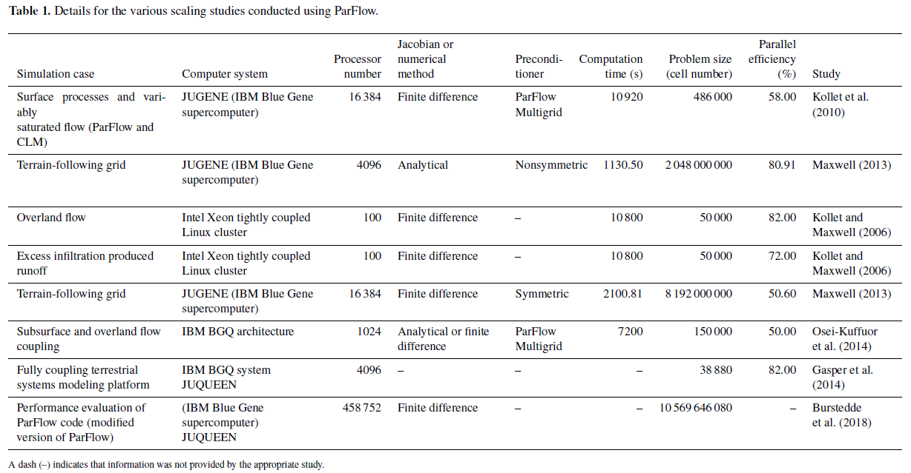

## 模式耦合

有不同的耦合模拟，包括：大气或气象预报模型(WRF)，陆面模型(CLM,
Noah-LSM)和地下模型(CunchFlow)，已经与ParFlow耦合，模拟各种耦合的地球系统效应，如图4a。

耦合：offline与online

在耦合界面处，各模型的信息和贡献，见图4b，在ParFlow内联系。

图5显示了耦合模型的通信网络。

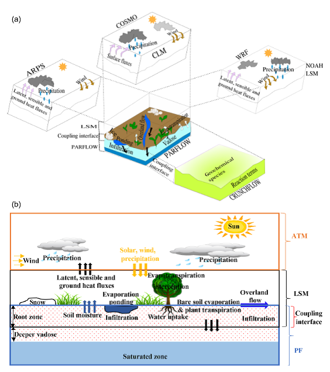

图4(a)相关的物理环境特征和模型耦合；(b)耦合界面处的信息传递

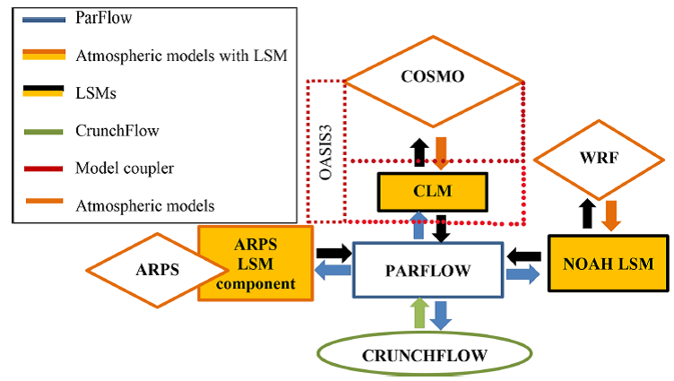

图5耦合模式的通信结构示意图

表2 ParFlow与大气、陆面和地下模式的耦合研究列表

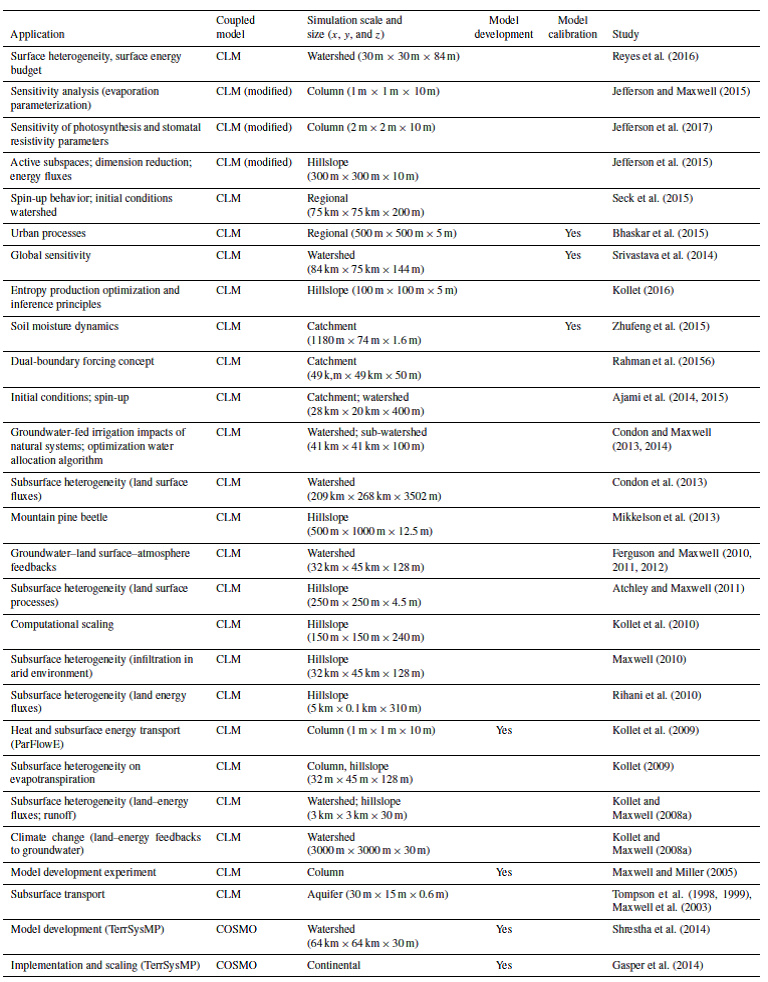

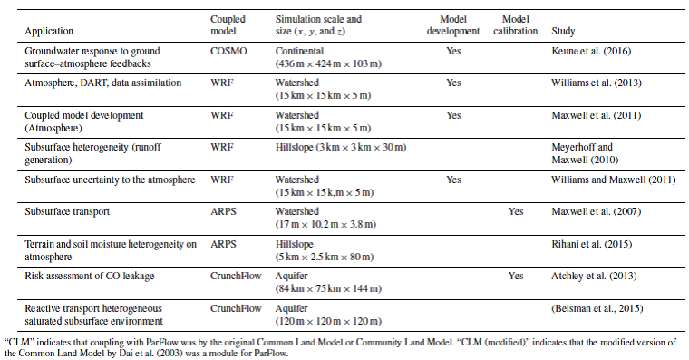

### ParFlow--Common Land Model (PF.CLM)

### ParFlowE--Common Land Model (ParFlowE\[CLM\])

### ParFlow in the Terrestrial Systems Modeling Platform, TerrSysMP

Terrestrial System Modeling Platform TerrSysMP

An online coupling between ParFlow and the COSMO model is performed via
CLM3.5

### ParFlow--Weather Research and Forecasting models (PF.WRF)

### ParFlow--Advanced Regional Prediction System (PF.ARPS)

### ParFlow--CrunchFlow (ParCrunchFlow)

## 应用案例

地表水与地下水系统的相互作用研究。例如，评估地下水抽取对河流和地下水资源的影响(Markstrom
et al., 2008)，评估地形和地下水的关系(Condon and Maxwell,
2015)，耦合水流与物质输移(Weill et al., 2011)。

在大的空间范围和1km^2^分辨率尺度上模拟（图6），或更小的空间尺度（图7），并行化计算使耦合模拟可以实现。

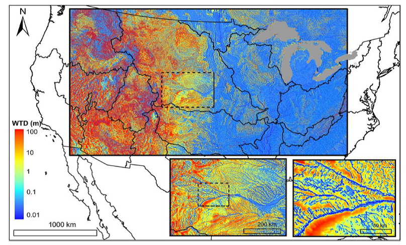

图6 密西西比河流域的南北Plattte流域的水面线深度(m)分布图

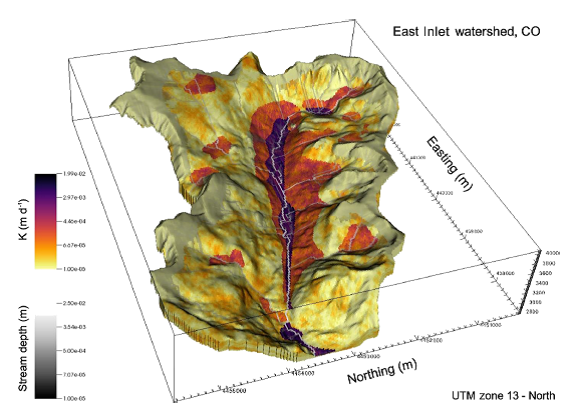

图7 水力传导度(K) 和河流深度分布图：流域覆盖30 km^2^，使用310万网格单元

ParFlow基于有效的并行化（高性能效率）和健壮的水文功能。模型求解器和数值方法都是快速、健壮和稳定的。

ParFlow通过使用参数化的河道调蓄子程序，可精确求解河流流动。

Interface-based和process-level
coupling，可以高分辨率的执行真实案例模拟。

耦合模式的计算量很大，ParFlow在大空间尺度和高分辨率上解决此问题。

ParFlow代码开源，持续演进。

## 参考文献

Benjamin N. O. Kuffour, et al. 2020. Simulating coupled
surface-subsurface flows with ParFlow v3.5.0: capabilities,
applications, and ongoing development of an open-source, massively
parallel, integrated hydrologic model. Geosci. Model Dev., 13,
1373-1397.
