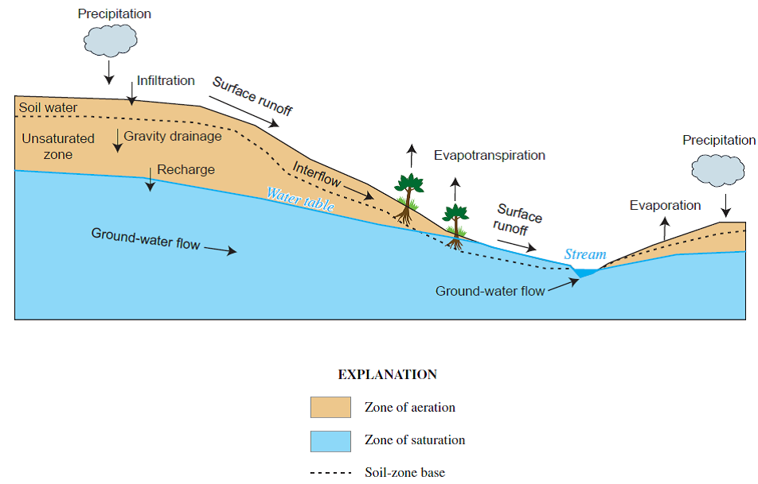
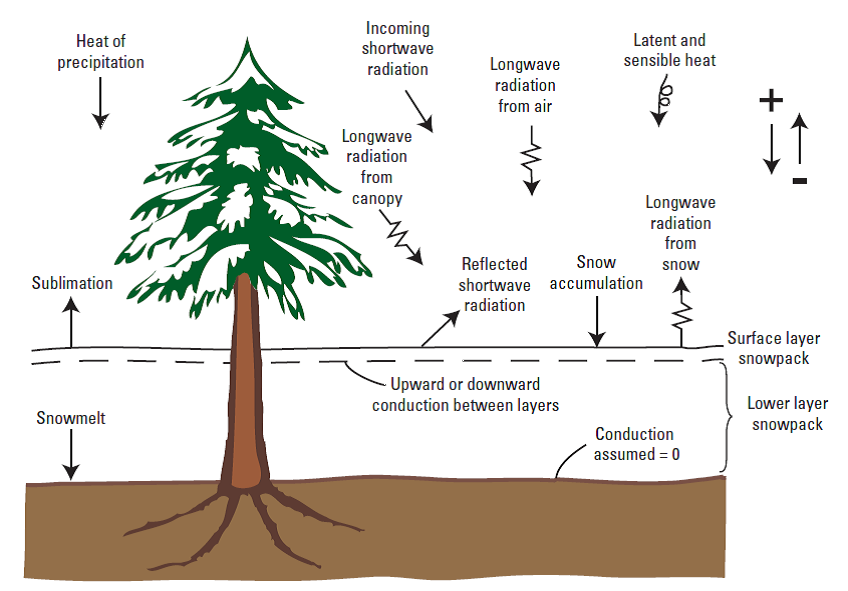
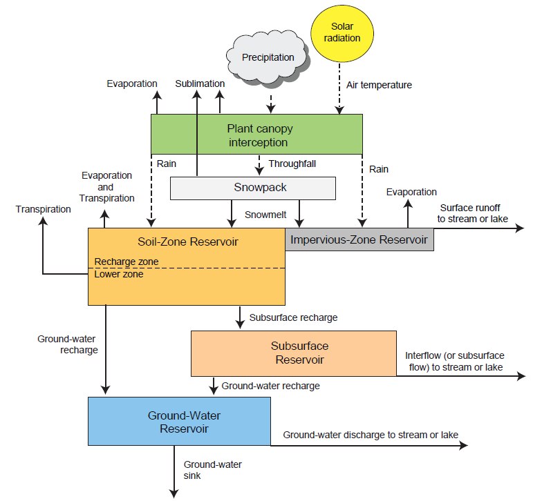

# Hydrology

## 降雨径流-地表水-地下水耦合模式

为了评估气候、地质和人类活动对水循环的影响，需要研发模型耦合2个或更多的水循环模块。耦合模型通常包含降雨径流响应模型（分布式水文模型）、地表水和地下水模块，反映出水流在水文响应单元(Hydrologic
Response Units, HRUs)和水动力计算单元（地表水和地下水单元）之间的交换。

模型耦合的方式有2类：

1.  松散耦合：一种模型的输出作为另一模型的输入，此类模型的计算稳定性好，但不能更准确地耦合计算状态变量，如：GSFlow

2.  紧密耦合：求解一套耦合的微分方程组，此类模型的计算量大，且稳定性受到CFL条件的限制较大，如：ParFlow,
    OpenGeoSys等

水流在空气-地表和地下的循环过程如图1，通过对地表物理过程（如图2）的数学描述，然后建立数学模型，即可实现耦合求解，如图3。

图1 水流在陆地和地下的分布、流动和交换示意图

图2 水文模型中的能量平衡、累计、融雪和水分升华的示意图

图3 水文模型的模块示意图(USGS-PRMS模型)

## 仓库内容
   
   分布式水文模型及其耦合模型，包括：
   
   1. PIHM - OpenMP并行的三角形非结构网格的分布式水文模型(版本有PIHM2.x, PIHM4.0, SHUD)
   2. ParFLOW - 地表水与地下水模型MODFLOW的耦合模型(C语言开发核心代码, TCL和Python脚本)
   3. GSFLOW - USGS开发的地表水与MODFLOW的耦合模型(pywatersed的前身)
   4. CHM - 加拿大开发的基于非结构网格的冰雪下垫面的分布式水文模型
   5. pywatersed - USGS开发的耦合PRMS水文模型与MODFLOW6地下水模型(Python脚本)
   6. UniFHy - 英国开发的耦合地表水-地下水的水文模型(Python脚本)
   
   Python语言开发的水文模型(pywatershed, UniFHy)降低了复杂的水文模型的使用难度，但并行化仍然是未来分布式水文模型的发展趋势(ParFlow)
