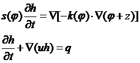
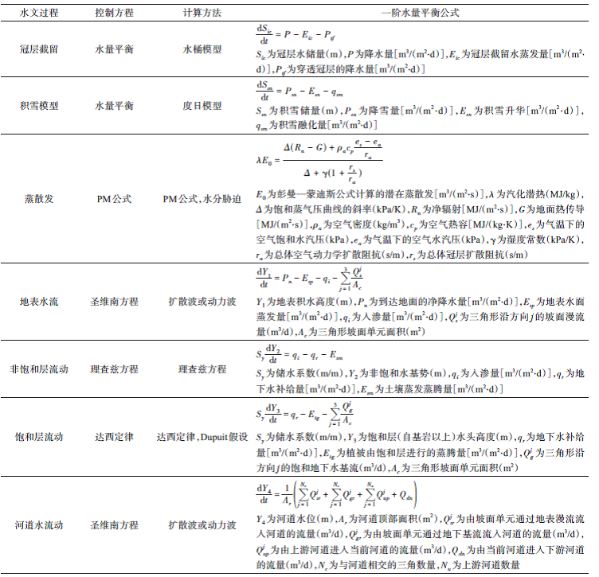
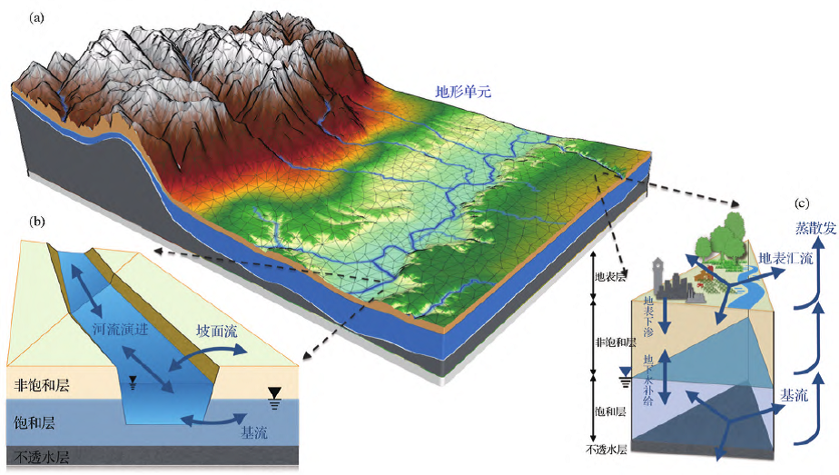
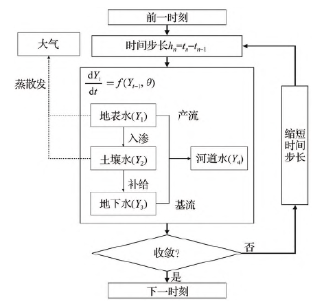
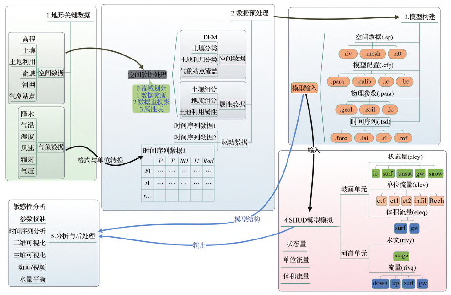
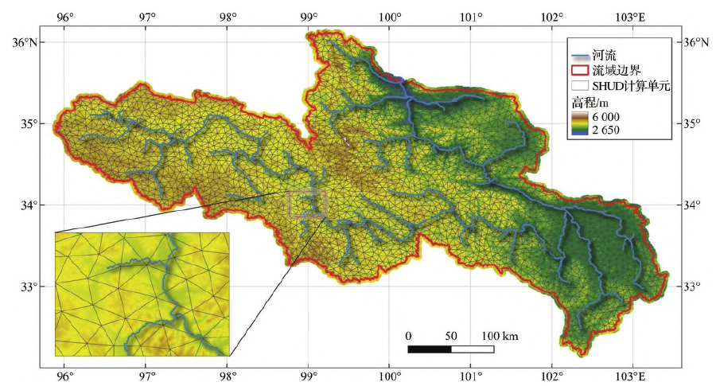
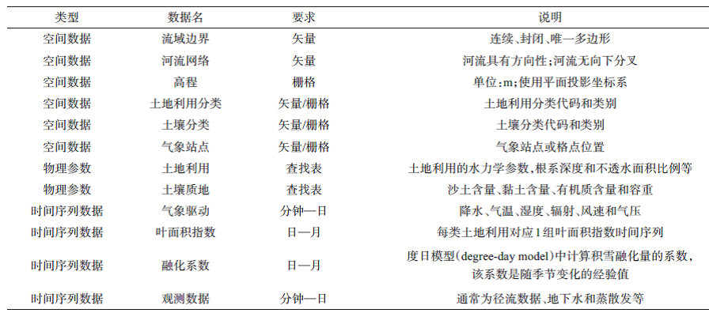
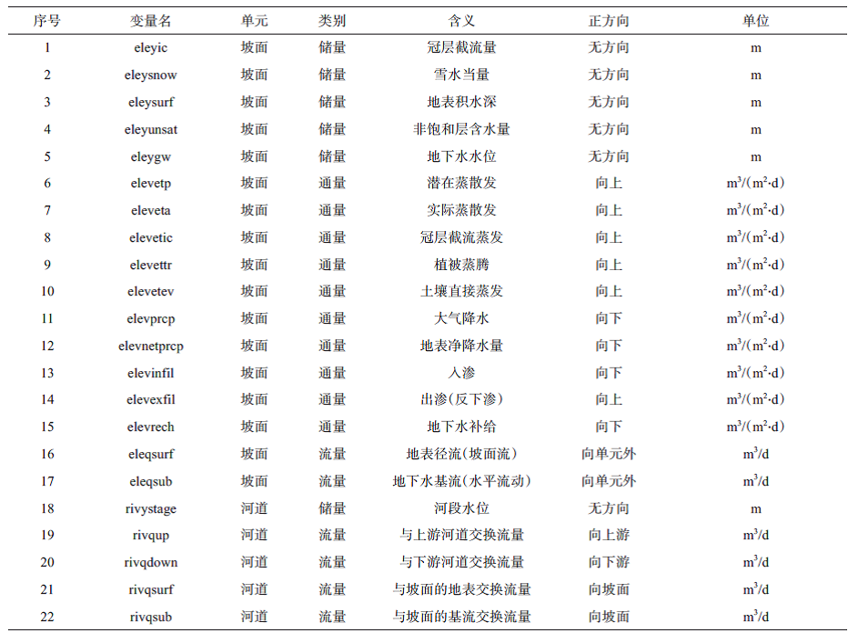

# SHUD模型介绍

关于SHUD的介绍内容就是文献：

舒乐乐, 常燕, 王建, 等. SHUD 数值方法分布式水文模型介绍. 地球科学进展.
2022, 37(7): 680-691.

## 摘要

水文模型是高效且经济的科学实验工具，不仅能结合观测数据验证科学理论、指导观测网络布设，而且对社会水资源管理、灾害防治以及经济决策等有不可或缺的重要价值。数值方法水文模型依据达西定律、理查兹方程和圣维南方程等水文物理公式，充分表现水文参数空间异质性，精细化表达水文物理过程，是水文模型发展的重要方向之一。SHUD模型利用有限体积法求解地表---地下耦合的流域水文过程，采用不规则三角网构成流域模拟空间，可实现空间上米---公里、时间上秒---小时的超高分辨率的数值模拟。由SHUD模型、rSHUD工具和全球基础地理数据组成的AutoSHUD水文模拟系统，构建了数据制备---模型模拟---结果分析的标准范式，其有效性和适用性已得到验证。当前我国水文领域对于数值方法分布式水文模型的探讨、开发和应用较为薄弱，亟需更多探索；不仅需要支持新模型的研发，同时应丰富已有模型在全球不同区域的验证、推广和改进工作。

## 1前言

水文模型根据不同的空间表现方式大致经历了集总式、半分布式到分布式模型的发展历程。

自20 世纪90
年代以来，水文领域陆续出现一类特殊的分布式水文模型，即地表---地下耦合的数值方法水文模型，简称数值方法水文模型。数值方法水文模型从质量守恒或动量守恒定律出发，利用有限元法、有限差分法或有限体积法等数值方法，在可随机分割的空间单元上，耦合求解地表---地下---河道水文过程的基本物理公式(达西定律、理查兹方程)、圣维南方程和纳维---斯托克方程等］，计算气象和人类活动驱动下地表和地下水文变量的时空变化。数值方法水文模型采用较高空间分辨率，充分表现水文参数的空间异质性（百米级），并具有高时间分辨率（秒---小时），满足了精细表达微观水文物理过程的要求。

数值方法水文模型的理论基础建立在Freeze等设计的"基于物理的水文响应模型蓝图"之上，该蓝图将坡面、土壤、地下水和河道水文过程统一于理查兹方程和圣维南方程，地表和地下水文过程分别由不同变形的理查兹方程和圣维南方程来实现。在空间上水文计算单元划分具有显著的随机性，能够反映地形、土壤、含水层、土地利用和气象条件的空间异质性，并能够通过微观尺度水文过程的数学描述，综合计算流域局部或整体的水文响应过程。数值方法水文模型因其极高的空间分辨率和更高数量级的计算单元，在相同模拟精度条件下可更好地反映水文物理过程，计算模块具有灵活的可拓展性，便于集成地表及地下能量和水分运移参数化方案，具有长远的发展潜力。

已有的开源水文模型：PIHM, ParFlow, OpenGeoSys, SHUD

## 2 SHUD模型原理

SHUD是多尺度、多过程、高时间分辨率、灵活空间分辨率、地表---地下紧密耦合、有限体积法求解的分布式水文模型。SHUD模型使用C/C++语言实现了"基于物理的水文响应模型蓝图"和"双态水量平衡"的概念框架，开发过程吸收了PIHM模型的应用经验。

SHUD 正式版本发布前曾使用PIHM++ 或PIHM v4.0
的名称；由于研发工作获得美国多个大学和不同经费来源支持，且为突出该模型空间单元的非结构化特征在水文模拟中的优势，因此团队发布新模型时，将其全新命名为SHUD。

根据Freeze
等的路线，数值水文模型利用变形的理查兹方程［公式（1）］求解土壤水和地下水运动，并利用简化的圣维南方程［公式（2）］求解地表和河道水运动，形成基础偏微分方程组。

式中，s为地下水的储水系数(m/s)；h为水头高度(m)；t为时间(d)；k为水力传导度(m/d)；phi为土壤水基势(m)，是随土壤湿度变化的函数；u为流速(m/d)；q为流量(m^3^/(m^2^d))；z为高程(m)。

SHUD利用扩散波（曼宁公式）和理查兹方程分别计算坡面漫流和非饱和土壤水运动，并由达西定律结合Dupuit
假设计算饱和地下水的水平流动。在降水到达地表之前经过的植被冠层截留和积雪过程，由基于水量平衡的水桶模型和积雪度日模型实现。地表、土壤水和地下的蒸散发通过彭曼---蒙特斯公式计算的潜在蒸散发与土壤水分胁迫系数计算得到。模型涉及的物理过程及其一阶水量平衡公式如表1
所列，模型中更多的水文过程的理论设计、详细描述可通过Shu
等的研究进一步了解。

表1 SHUD模型所用的控制方程和水量平衡公式

### 2.1 空间结构

SHUD模型利用非结构化的三角网格表达模拟空间，同时支持规则三角形和Delaunay
不规则三角形。Delaunay不规则三角形便于表达流域边界和特征的不规则性。空间上每个三角形单元作为基本水文计算单元，单元内水文参数具有一致性，因此三角形之间的参数差异性即反映流域水文特征在水平方向的空间异质性（图1）。SHUD模型采用显式的河道单元，河道单元截面抽象为梯形，根据梯形底的宽度和斜坡角度变形为矩形或者三角形；河道顶面为任意多边形形状。描述河道几何形状的关键参数包括河道长度、河床底宽度和河岸坡度。

三维的坡面单元是三棱柱，顶面与地面均为全等三角形，关键几何参数是三棱柱6
个点的三维坐标，可计算出三角形面积和三棱柱长度。坡面单元在垂直方向上分为3
层：地表层、非饱和层和饱和层［图1（c）］，饱和层之下是假设的理想不透水层或基岩。模型中使用梯形河道单元，河道与坡面单元之间的地表---地下水交换关系由河道线段与三角形坡面之间的空间拓扑关系来确定，即：与河道有相邻或相交关系的坡面三角形单元能够与河道单元进行地表/地下水量交换［图1（b）］。因为坡面单元垂直方向分为3
层，当三角形单元数量为Nc，河道单元数为Nr 时，总计算单元数量为Nc×3+Nr。

图**1
SHUD**模型的水平空间结构、河流网络拓扑关系和垂直分层关系：（a）由不规则三角形构成的水文计算单元；（b）坡面三角形与河道单元的拓扑和流量交换关系；（c）坡面三角形单元的垂直分层以及水文过程；SHUD使用不规则三角形单元构成流域水平空间，河流网络与三角形单元呈交叉关系，垂直方向计算分为地表层、非饱和层和饱和层

### 2.2求解算法

SHUD模型采用了有限体积法，并通过Newton-Krylov
迭代方法求解流域地表和地下水的非线性流动。同时，SHUD模型支持OpenMP
并行计算以保证模型快速稳定的运行。坡面三角形单元分为地表层、非饱和层和饱和层。地表计算植被截留、积雪、下渗、水平流动和地表蒸发；非饱和层计算土壤湿度、地下水补给、土壤蒸发和植物蒸腾；饱和层计算地下水的水平流动以及地下水与河网的水量交换。

SHUD模型迭代求解过程如图2
所示。地表水（*Y*1）、非饱和层水（即土壤水）（*Y*2）、饱和层（即地下水）（*Y*3）以及河道水（*Y*4）储量作为4
组目标变量参与计算，其在*t* 时刻的变量集合为***Y***，***Y***
=\[*Y*1，*Y*2，*Y*3，*Y*4 \]。*Y*1、*Y*2 和*Y*3
长度均为三角形单元数量*Nc*，*Y*4 的长度为河道单元数量*Nr*，***Y***
的长度为*Nc*×3+*Nr*。*Y* (*t*)为未知时刻*t*
的状态变量，Y（t-1）则为已知的前一时刻（t-1）时的变量，y\`
为（t-1）时刻由Y（t-1）计算的变化量（即导数），t
与（t-1）时刻的时间差为h，则Y（t）=Y（t-1）+y\`×h。每个时间步长内计算的关键内容是向量y\`
的值，即该时刻流动造成的储量变化值。水平方向上，地表单元通过地表汇流（Σ*j*
= 1*NcQjsr*）交换；地下水通过基流（Σ*j* =
1*NcQjgr*）交换。因重力决定的垂直水力梯度往往大于水平方向上含水量决定的压力梯度，且水平方向分辨率通常远大于垂直方向分辨率，因而SHUD模型忽略不饱和层的水平流动。垂直分层的计算单元之间以及坡面单元与河道单元之间的水量交换由不同的水文物理过程相互连接：入渗/出渗过程（*qi*
）连接地表层和非饱和层，非饱和层与饱和层通过地下水补给（*qr*）连接；河道通过地表坡面流（Σ*j*
= 1*NcQjsr*）和地下基流（Σ*j* = 1*NcQjgr*）2
个途径与坡面的地表和地下水发生交换。

图**2 SHUD**模型在指定时间步长内的迭代计算流程图

模型并不预设各水文过程中的水流方向，方向由该时刻的水力梯度方向决定。例如，河道水位高于地下水水位时，河流对地下水形成补给作用；当坡面地下水位高于河道水位时，则地下水补给河流。

SHUD计算过程中，*Y*1\~*Y*4 组合成的***Y***
在每个时间步长内一起进入迭代求解，此方法称为全局隐式求解。全局隐式求解法能保证变量的物质守恒，也能表达各变量空间上的连续性，但受制于CFL
条件限制求解效率相对较低。所有数值方法都对计算单元的空间分辨率敏感，且其求解的最大时间步长和空间分辨率的关系需满足CFL
条件。CFL
一般规律可总结为：变量变化速率越快，确保系统收敛所需时间步长越小；空间分辨率越小，确保系统收敛所需时间步长越小。SHUD
模型用户可指定最大时间步长（通常为1\~10
分钟），然后模型运行时根据变量收敛状况确定每一步的计算时间步长，其收敛时间步长由空间分辨率和变量最大变化速率决定。例如在暴雨事件中，地表水流速快，则模型需要缩短迭代时间步长以保证模型计算的收敛性和稳定性。模型自适应搜寻可达成全局收敛的最大时间步长；自适应时间步长方案既提高了模型的运行效率，又能保证数值计算的收敛性和稳定性。

### **2.3 SHUD**模型的特征与优势

与传统的概念性、集总式和半分布式模型（主要参考SWAT
模型）相比，SHUD模型以及同类数值方法的分布式水文模型在表达微观水文过程和水循环机理方面具有显著的优势，可总结为以下几点：

（1）物理性分布式水文模型：基于物理公式（达西定律、理查兹方程、简化圣维南方程等）描述流域水文过程，能完整地表现水文过程；在流域水文过程和空间异质性表达上，物理过程更加完备，显著优于概念模型和集总式模型。数值模型的参数物理含义明确有利于观测对比、结果解读、无观测流域模拟以及未来预测。比如，土地利用变化在模型中通过蒸发、地表径流、植被物候规律以及土壤特性变化4
个方面来体现，直观有效地表现了土地利用对水循环的影响机制。在集总式和半分布式模型中，多数参数不具有明确的、可测量的物理属性。例如SWAT（Soil
Water Assessment Tools）模型中土地利用特征由CN（Curve
Number）值表达；CN值无单位，且综合了土壤透水性、地面流动阻力、植被状况和不透水面积属性，也并不直接影响蒸散发过程，与实际水循环过程差异较大。

（2）时间和空间连续性：SHUD模型计算步长在秒---分钟范围，且步长根据系统收敛条件自适应调节，既提高模型效率，又满足数值方法的收敛性和稳定性要求。相比计算时间分辨率为天的水文模型，对于描述流域水运动的快过程（如洪水过境与洪水淹没）有显著优势。空间连续性要求水从空间任意一点经过坡面、地下、河道和河道出口的流动应当是连续的、可跟踪的过程。SHUD模型内，水由流域最远点至流域出口的运动和扩散路径及土壤水---地下水---河道的扩散路径都可跟踪。模型对于水从山坡汇流路径的详细描述，便于与生物化学、污染物运动、湖泊、生态以及地貌变迁等方面的模型耦合。时空连续性是数值方法模型相比于传统水文模型的显著优势。

（3）地表---地下全耦合：实际流域的地表---地下水交互频繁且重要，数值方法水文模型真实表达了地表---地下水的交互过程，增强模型在不同流域应用研究的通用性。SHUD模型的地表---地下耦合策略不仅以物理性公式表达了坡面地表水和地下水垂直方向上的运动，同时地下水与河流水平流动由实时水力梯度决定，即水可以在河道与坡面之间双向流动。例如，在湿地周边由于地下水位的涨跌，地下水与地表水紧密相关，水流可以是向地表流动也可能是向地下流动。在传统的集总式模型和半分布式模型中，地表---地下水流动方向固定，则无法反映不同时空上地表---地下双向交互过程。

以上特点是SHUD
模型与传统水文模型比较得来的，同时也包含一般数值方法分布式水文模型的通用特征。流域水文过程包含地表/地下、饱和/非饱和等复杂的非线性三维系统，所涉及常（偏）微分方程复杂，因此现有地表---地下耦合的数值方法水文模型在数值方法、求解精度、耦合方式和空间结构等采用不同方案，各模型在模拟效率、精度和适用性方面都存在各自优势。SHUD模型作为数值方法水文模型的一员，与其他同类模型（以ParFlow和PAWS
为代表）相比，也有其自身的特点：

（1）非结构化空间分割：相比于结构化网格，非结构网格更有利于表达流域边界、河流和空间特征，其边界条件控制也更符合数值理论。非结构化网络在实际应用中可以针对流域内重点区域进行局部加密或者局部疏松------保证可靠边界条件的情况下，有效控制数值方法的计算规模。现有研究结果验证了SHUD模型可在厘米---公里分辨率上运行，并取得预期模拟效果。Shu
等的模拟测试中采用厘米分辨率重复了Vauclin
水槽箱试验，地下水模拟精度与其他同类模型相当。公里级分辨率已应用于Cache
Creek（美国）、Conastoga
River（美国）和Pongo（苏丹）等诸多流域研究，并获得预期模拟效果。

（2）全局隐式求解：流域快过程（地表径流等）与慢过程（地下水流动等）同时求解。保证每一步长水文状态变量都满足收敛性要求，保证了水文变量的连续性、一致性和收敛性。相比有限元法和有限差分法，SHUD采用的有限体积法和程序内算法共同保证了模型局地和全局的水量平衡。

（3）河道与三角形单元的交叉拓扑关系：非结构网格中常见河道与三角形单元的相邻拓扑关系，但由于河道自身弯曲绵延，会导致4
个问题：①绵延曲折的河道附近易产生大量微小三角形单元；②河道附近易出现大钝角三角形，影响模拟精度；③河道起始点附近易出现异常积水单元；④河道线条简化后，河道坡度易出现负值，导致河道积水和假洪水（模拟中河道水位高于堤岸而漫流到坡面单元）现象。PIHM模型中河道与其三角形单元采用相邻拓扑关系，SHUD
在PIHM模型的经验基础上采纳了交叉拓扑关系即可以解决以上问题，从而显著提高了数据制备和模拟效率。

SHUD团队坚持开源模式开发，模型及工具的源代码实时共享；开源模式促进模型自身快速发展，同时有效支撑相关学科耦合研究；SHUD相关代码以及模型说明书可从网站https://www.shud.xyz/获取。处于开源状态的同类数值方法模型包括ParFlow、PIHM和OpenGeoSys
等。

## 3 数据前处理和后处理

SHUD模型应用的基本流程如图3
所示。水文模拟过程可以分为数据收集、数据预处理、模型构建、模型模拟、结果分析与后处理5
个步骤。

图**3 SHUD**模型模拟的基本流程图

### **3.1** 输入数据

空间数据、物理参数和时间序列数据是水文建模的关键基础数据，而数值方法水文模型往往对数据的要求高。用于构建流域水文模型的关键地理变量（Essential
Terrestrial
Variables，ETV）包括高程、土壤质地、土地利用、流域边界和河网等空间数据，以及降水、风速、气温、空气湿度、气压和辐射等气象驱动数据。SHUD输入数据分为模型配置、空间数据、物理参数和时间序列数据4
类。

表2 列举了SHUD
模型运行所需要的空间数据、时间序列数据和物理参数。空间数据用于构建模型计算的空间信息，表达气象、土地利用、土壤和地形的空间异质性。图4
以黄河源为例展示rSHUD对流域进行空间离散化后的结果，包括三角形坡面单元、河道单元、坡面与河道单元拓扑关系，以及计算单元与海拔高程之间的对应关系。土地利用的水力学参数指用于体现土地利用分类差异的直接影响水文计算的参数，包括不透水面积比、植被覆盖率、曼宁系数或曼宁粗糙度和最大叶面积指数等。

图**4** 原始的地形和河网数据以及生成的模型计算单元（以黄河源为例）

以上参数不由土壤性质决定，而是由土地利用类别决定，其值的差异表征土地利用类型对水文循环过程造成的差异。

表**2** 用于构建**SHUD** 模型的基础数据列表

观测数据用于对模型参数的优化。气象数据、叶面积指数和融化系数的时间序列数据作为驱动数据。气象数据的时间分辨率直接决定了模型模拟结果的时间精度，例如，以天为单位的降水数据隐藏了短时降水强度，即使模型计算过程仍然在分钟尺度，但模拟结果中的径流无法反映可靠的小时尺度径流过程。

模型计算使用的土壤的水力学参数，通过土壤质地获得。例如PTF（Pedotransfer
Function）经验函数可根据土壤的沙\--粉\--黏比例、有机质含量和土壤容重计算土壤水力传导度和孔隙度等水力学参数。土地利用有关的初始参数值根据分类查找表确定，不同的土地利用类型具有不同的参数组合。初始的土壤和土地利用参数能够反映流域空间异质性特征，但其依然具有不同程度的不确定性，需要在参数优化过程获得合理的参数值。

### **3.2** 输出结果

SHUD模型输出结果包括坡面单元和河道单元在指定时间间隔下的储量、通量和流量（表3），不同的输出变量具有不同的方向定义和单位。通量是单位时间通过单位面积的水量，流量是单位时间水的移动量或者变化量。坡面单元结果的维度为*Nt*×*Nc*，河道单元结果的维度为*Nt*×*Nr*，其中*Nt*为时间数，*Nc*为水平坡面单元数，*Nr*为河道单元数量。

表**3 SHUD** 模型输出结果变量列表

### **3.3** 自动参数优化

数值方法水文模型能够计算流域多维度、多尺度和多过程的变量，但模型运行所需参数数量多、维度大且精度要求高，因而建模者的参数准备和校准工作面临挑战。SHUD模型的预设参数可根据基础的地理数据（土地利用和土壤质地等）进行估算，然后通过自动参数优化程序获取优化后的参数。SHUD模型开放的可优化参数约50
个，其中约10
个参数对径流响应较为敏感，包括水平和垂直水力传导度、孔隙度、大孔隙比率、含水层厚度、不透水面积比率、河床水力传导度和河床几何形状等。

参数优化基本公式为：

*ε* = *g*\[ *f* (*t*, *αθ* ) - *Qo* \]

式中：*f* 是代表SHUD模型计算的函数；*t* 是时间；*θ*
是初始参数集合，其数量为*Nθ*；*α* 是参数的调节系数；*Qo*
是参考或者观测变量；*g*
是评价模型模拟与观测接近程度的目标函数，常见函数为纳什效率系数（Nash-Sutcliffe
Efficiency，NSE），确定系数*R*2
和均方根误差（RMSE）。调节系数（*α*，维度*Nθ*×1）对空间所有参数（*θ*，维度*Nθ*×*Nc*）进行调节（相乘或者相加），使目标函数值最优；*NSE*和*R*2趋近1，RMSE
趋近0，则表明模型结果与参考值接近；调节参数改变了参数值的分布范围，但在一定程度上保留了参数集合内的差异，即保留了水文参数的空间异质性。

因为参数集的维度大，一般枚举法和简单蒙特卡洛采样法无法获得在大维度下的全局最优解，因此推荐使用遗传算法。SHUD
团队在rSHUD 中实现了的协方差矩阵遗传算法（Covariance MatrixAdaptation
Evolutionary
Strategy，CMA-ES），该算法代际之间参数采样范围根据前一代参数的空间分布规律确定，因此参数迭代效率高且可以保证获得全局最优解。

### **3.4** 数据处理工具

SHUD
模型的数据前处理、模型构建、参数优化、结果分析和可视化都可以通过rSHUD
实现。

rSHUD 是R
语言开发的库，包含空间数据前处理、模型空间离散化构建、水文数据分析、二维/三维数据可视化和CMA-ES
自动化参数优化等功能。SHUD研发团队还开发了AutoSHUD自动化模拟框架，通过全球基础地理数据和气象再分析资料，将模型快速应用于全球任意流域，开展水文模拟并生成基础水文分析结果。AutoSHUD模拟系统包含5个基本步骤：地形关键数据获取、原始数据预处理、模型构建、水文模拟和数据后处理。通过存储在本地计算机或服务器上的全球通用关键地形数据（高程、土地利用、土壤）以及气象驱动数据等，自动完成数据提取、预处理、模型模拟以及结果初步分析。rSHUD
和AutoSHUD
的源代码皆开放于GitHub（https://github.com/SHUD-System/）。AutoSHUD
系统集成了SHUD 模型、rSHUD
工具集和公开的全球基础数据集，形成"数据---模型---工具"通用平台，不仅提供关键地理数据加快模型测试和迭代的速率，也创建了快速、可重复、可全球部署的"数据制备---模型模拟---结果分析"的水文模拟标准范式，其基础数据服务功能正在调试运行（http://www.shuddata.com或http://shud.ncdc.ac.cn）。SHUD模型已应用于若干流域，模拟尺度覆盖1
m2至10
万km2，空间分辨率从厘米至千米；时间尺度从小时至百年尺度。模型已应用于气候变化及人类活动对水循环影响、水资源时空特征及其变化、干旱与洪水预测以及水文---农业---经济耦合关系研究等研究领域。

## 4 总结与展望

SHUD作为地表---地下耦合的数值方法分布式水文模型，具有多尺度、多过程、高时间分辨率和灵活空间分辨率的特点，其物理过程表达更接近真实、综合运算效率高、模拟精度好，在全球若干流域的应用研究已初步验证了模型的有效性和适用性。SHUD模型源码公开，支持源码修改和重发布，是对水文模拟方法的贡献，也是水文模型中具有强发展潜力的成果之一。集合SHUD模型、rSHUD工具和全球公开基础地理数据组成的AutoSHUD
自动化水文模拟系统，已应用于多项学科交叉研究项目中。

考虑到冰冻圈、生态系统、环境化学对能量---水分循环的直接影响，数值方法模型需深入探索"冰冻圈---水文---生态---环境化学"紧密耦合的集成模型，以便更好地理解气候变化和人类活动影响下的水资源和水循环响应，为国家生态文明建设提供科学支撑。ParFlow
v3.5 探索了CLM陆面过程模型（Community Land
Model）与数值水文模型ParFlow的紧密耦合，开拓了模型耦合的新思路。

地表---地下耦合的数值方法水文模型的研发面临的关键挑战在于：①有限计算能力与时空分辨率的无限要求之间的矛盾；②模型对大数量和高质量物理参数的要求与有限观测手段和观测覆盖范围之间的矛盾；③模型需要多尺度、多问题的应用测试的需求与有限验证数据之间的矛盾；④精细的多物理过程表达与关键变量快速模拟响应之间的矛盾。模型研发工作结合水文、数学、工程和计算机领域的进展，也需要人才、经费和时间方面的巨大投入。以ParFlow模型为例，该模型由美国普林斯顿大学、科罗拉多矿业大学、华盛顿州立大学、雪城大学、劳伦斯---利佛摩国家实验室、德国的伯恩大学、利希研究中心、地球系统超算中心和法国地球环境研究所等多家大学和研究机构共同参与研发（https://parflow.org/#team），足见其研究的重要性和研发难度。

当前我国科学家在概念水文模型和大尺度分布式水文模型方面已有较多原创性成果，但是对数值方法分布式水文模型的探讨、开发和应用都较为薄弱，亟需在此领域进行更多原创性探索。在模型应用方面，根据知网关键词搜索结果，SWAT、VIC和TopModel
等传统模型为关键词的文献数量分别约为2 700 篇、700 篇和300 篇，但是以MIKE
SHE为关键词的文献搜索结果数量则小于100
篇，其他数值方法水文模型的中文文献数量则接近或等于0篇。因此，未来我国在水文研究领域，不仅需要支持新模型研发，同时需丰富已有模型在全球不同区域和应用需求的验证、推广和改进工作。

## 参考文献

FREEZE R A，HARLAN R L. Blueprint for a physically based，
digitally-simulated hydrologic response model. Journal of Hydrology.
1969, 9(3): 237-258.

Lele Shu, Paul A. Ullrich, Christopher J. Duffy. 2020. Simulator for
Hydrologic Unstructured Domains (SHUD v1.0): numerical modeling of
watershed hydrology with the finite volume method. Geosci. Model Dev.,
13: 2743-2762.
