# ACE Tools的基本操作

## 1、安装ACE Tools

run xmgredit5.exe through Cygwin X server,

firstly, you should install **xinit, xorg-server**, libxm

then, in terminal input ./xmgredit5.exe hgrid.gr3

## 2、ACE的图片输出

ACE的图片输出：print to file,
以postscript格式(.ps)输出文件，然后用pdf转换为图片即可。

## 3、ACE的具体操作

以下操作步骤按照视频中(SELFE_tutorial2012.flv)出现的顺序整理。

### 3.1生成边界

使用xmgredit5.exe程序可以辅助SCHISM模型输入文件的制作（如transect.bp,
prop文件\...\....），提高工作效率。

EdGr: Edit Grid 可以编辑网格

BkGr:Background Grid 背景网格不可以编辑（原始地形数据）

Boundary \--\> Compute boundary 生成网格边界（每次第一步就做这个！）

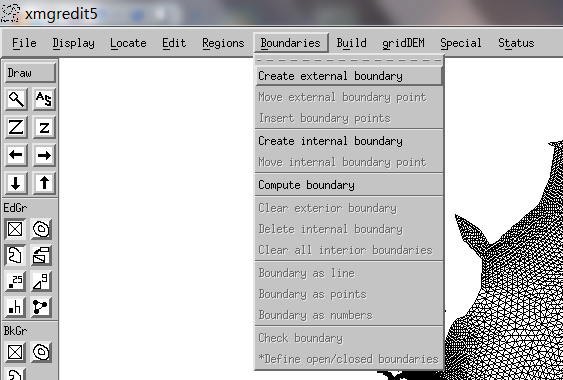

### 3.2 显示等值线图

Display\--\>isolines of bathymetry (Edit Grid):

\# of isoline: 等值线的分级数。Spacing by: start, step
设置起始和步长；specified values 用户自己定义分级值

place legend \--\> accept\--\>draw

Display\--\> color\--\> Tune the RGB color \--\> draw

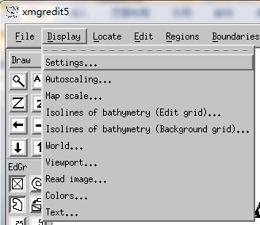

### 3.3 定位点在网格中的位置

定位节点、单元、坐标的位置，光标会自动移动到定位的位置

见下图中的选项。

Locate\--\>Find the nearest node 可查看设置的节点水深值

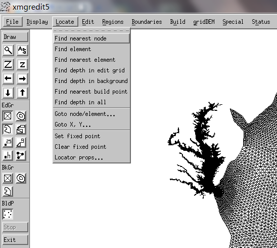

3.4 创建三角形(triangle)和区域(region)

Edit -\> Edit nodes/elements

功能有：移动/添加/删除 节点、三角形和四边形单元；加密三角形/四边形(split
3 or split 4)

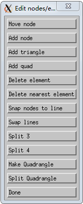

Edit -\> Create Region

Evaluate
可以定义全部网格或上面创建区域内的水深（或其他任何标量值）：Edit \--\>
Edit over grid/region\--\> Evalute （[修改局部区域的Z值]{.mark}）

可以在Entire grid/Defined region/Boundary上边界网格的depth

Function: 按照C语言的规则设定，比如：max, min, sin, cos等函数

Create Region: Regions\--\>Create region,
按鼠标左键圈定，按中间按键（滚轮）封闭创建的区域，然后可以在region内定义depth分布：

输入：depth = max(0.0,min((x-110.)/(100.0-90.0), 30.0))

[其他功能还有：]{.mark}

旋转坐标、设置可接受的skewness(歪斜度)、删去region中的单元（例如创建小岛）、Filter
triangles，split element

复制网格、四边形网格质量检查、三角形转成四边形单元、高亮单元、提取子网格（extract
sub-grid，类似于Cutmesh?）

固定负面积区域、Volumes... CPP投影

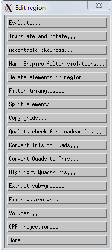

### 3.4 区域(region)操作

创建、清除、读取和保存region操作

计算区域的面积和周长。

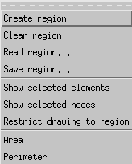

### 3.5 边界(boundary)操作

创建边界等。。。

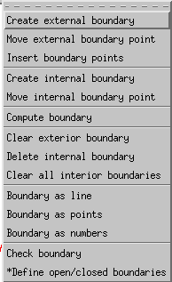

### 3.6 Build

创建一些点？还没用过

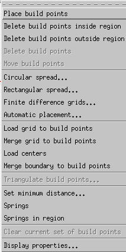

### 3.7 gridDEM

加载水深/地形、创建开边界和陆地边界、梯度/坡度、剖面

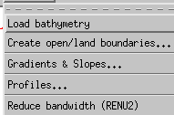

创建开边界(Create open boundary)：可以不在SMS或GAMBIT中设置边界标记了。

Display\--\>Settings\--\>increase Scroll%(35% for example) 增加zoom-in
or zoom-out 的速度，放大（缩小）局部开边界处

GridDEM \--\> create open/land boundary\--\>Define new open boundary
segment\--\>

定义开边界（可以用locate x,y找开边界处），**开边界是蓝色**

Create land boundary 是一样的。**陆地边界是绿色。**

**其他内边界不用编辑，是红色，**自动定义为island (internal boundary)

**注意：**

**[（1）需要以逆时针按顺序依次选择开边界和陆地边界的端点，相邻的开边界和陆地边界节点要重合。]{.mark}**

**（2）定义一个开边界或陆地边界，只能用上下左右的箭头移动计算域。两头端点的点击之间，不能点击其他按钮。**

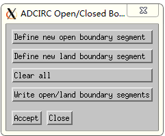

### 特殊功能(Special)

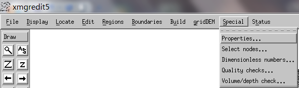

其中设置prop文件的功能如下：

操作顺序很重要：设置好默认属性值和当前属性值，再点击\"Initialize\"，然后是\"Region\"（创建定义属性值的区域），然后是\"Accept
in region\"，然后是保存\"Write...\"

操作顺序不对，程序会退出！

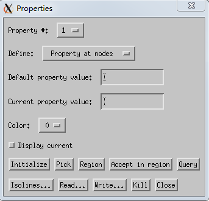

[创建及可视化prop文件]{.mark}

（1）SCHISM模型需要一些prop文件，prop文件格式是定义在单元中心上的一列整数，目前只需要[2个prop文件]{.mark}，包括:

tvd.prop, fluxflag.prop

tvd.prop：定义在哪些区域实施upwind (0), TVD(1)和TVD^2^(2)的数值格式。

fluxflag.prop：单元属性标记(从-1,0,1,\...的整数)，定义通过某些断面的通量（流量,
m^3^/s）：2个相邻单元的差为1，并且两边的标记不是-1

（2）prop文件导入gredit5.exe程序用于可视化，例如:
显示MPI并行的分区情况：

Special\--\>Properties

Define: Property at nodes (or elements)

Read\...\--\>Filter:outputs/\*.prop (global_to_local.prop) \--\> Read
property (Property at element)\--\>
OK\--\>回到Properties窗口，选中Display currents\--\>Isolines\--\>Element
properties\--\> Autoscale

[无量纲参数：]{.mark}

Special\--\>Dimensionless numbers 检查CFL条件在单元上的满足情况

设置dt, warning Courant number, \--\>draw

**注意：**SCHISM模型要求CFL条件不能太大(\<0.8)，也不能太小(\>0.4)，这与显格式模型（如FVCOM）很不一样。因此，计算时间步长和网格密度要设置的合理（计算时间步长不能太小，网格密度可以适当做的粗一些。）

## 保存编辑网格的数据

然后，File\--\>Save: Write data\--\> To file: diffmax.gr3 (for example)

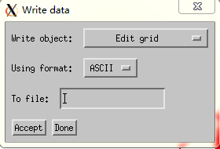

## 检查网格

（1）在param.in中设置ipre=1，然后使用1个CPU运行schism，如果没有问题会提示pre-processing
grid successfully!，outputs文件夹中生成centers.bp, sides.bp文件

然后，File\--\>read\--\> choose Read object: Build points\--\>choose
\*.bp files

然后, Build\--\>Triangulate build points\...\--\>Triangulation engine:
Shewchunk\'s Triangle\--\>Minimum distance (0)\--\>Apply\--\>Save (Write
data, Edit grid, ASCII, centers.gr3)
（将bp文件三角化，并形成gr3文件）。（相当于散点地形三角化后，形成Delauney非结构化三角网格）

（2）创建 transect.bp 文件： Build\--\>Palce build points\--\>Save
(Build points)

# 可视化程序vis6

因为SCHISM模型计算结果可以用VisIT、TECPLOT、MATLAB等软件可视化，xmvis6.exe并不是很重要了，可以临时看一下计算结果的合理性。

需要安装gd3

xmvis6.exe也在Cygwin_X Server下运行：

./xmvis6.exe 1_elev.61

可以增加Grid后面的数字：5 (for example)

Files\--\>Grids\--\>Read data_popup\--\>Read to grid:2

View\--\>Grid setup\--\>Isolines\--\>Colors

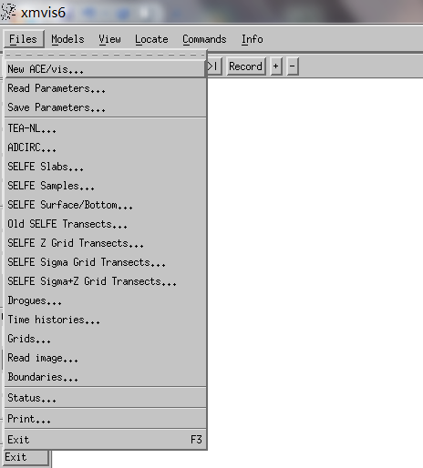

SELFE slabs （水平分层面）

SELFE Surface/Bottom\--\>Data file: 1_elev.61\--\>sample steps\--\>

SELFE Transects\--\>transect.bp

注意画矢量/标量到一个图时，要apply to data set （不同数字）

保存动画

Command\--\> batch run 1,20

回到terminal\--\>display xmvis50000014400.gif

SELFE Samples\--\>Setup

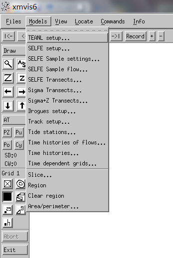
