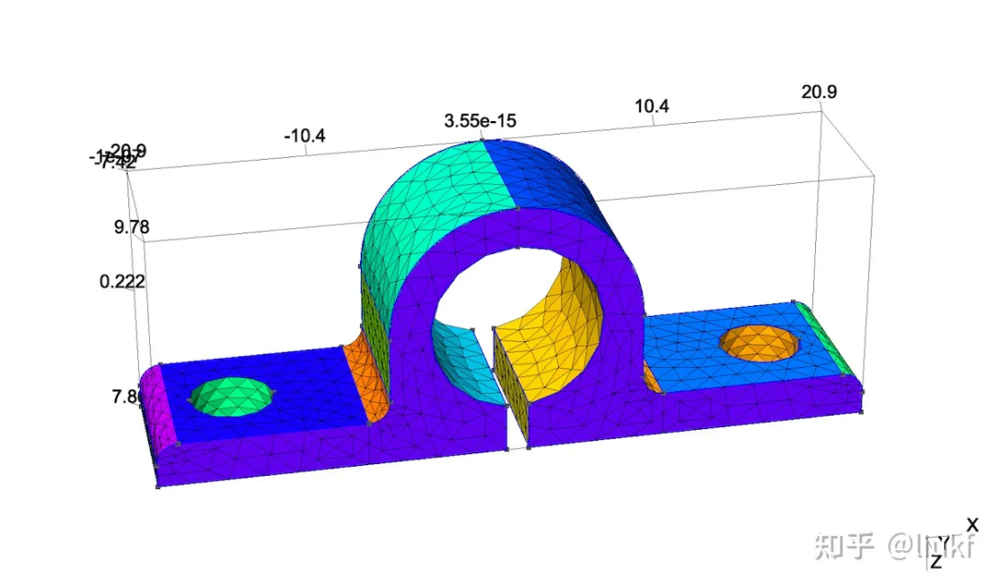

# Gmsh 极简入门

<https://zhuanlan.zhihu.com/p/256334824>

## Gmsh简介

[Gmsh](https://zhuanlan.zhihu.com/p/256334824/www.gmsh.info) 是一个免费开源且具有内置
CAD 引擎和后期处理子的三维有限元网格生成软件.

它的目的是提供一个快速的, 轻量级的, 用户友好的网格工具,
并且具有参数化输入和后期可视化能力. 目前 Gmsh 具有四个模块: 几何模块,
网格模块, 解子模块和后期处理模块, 且所有模块的使用都可以通过两种方式:
命令行和 GUI. 有限元网格生成工具有很多种, 比如 MeshGen, Hypermesh,
以及一个 MATLAB 小工具 DistMesh, 等等.

Gmsh 提供 Linux, Mac and Windows 版本, 并且在下载的安装包的 **tutorial
目录**中包含一个介绍关键概念和一些实例的**教程**.
这个教程里的实例都有非常详细的脚本注释, 易于入门, 是学习 Gmsh
的最佳入门材料.

## 为什么需要网格

网格生成 (Mesh generation or grid generation) 又可以称为网格剖分,
即将一个有界的连续的几何空间划分成由有限个单纯形, 矩形,
多边形或多面体构成的离散的几何空间, 是有限元方法求解偏微分方程的第一步.
高质量的网格往往依赖于求解区域及方程特性,
同时一般能够带来更精确的有限元解.

表示网格最简单的数据结构应该就是 **单元-节点** 结构,
例如 \[0,1\]×\[0,1\] 上一个简单的三角形网格可以由两个变量表示 points 和 elements:

points **=** \# 所有节点的坐标(x, y, z), 对二维空间 z=0

\[\[0. 0. 0. \] \# vertice 0

\[1. 0. 0. \] \# vertex 1

\[1. 1. 0. \] \# vertex 2

\[0. 1. 0. \] \# vertex 3

\[0.5 0.5 0. \]\] \# vertex 4

elements **=** \# 每一个网格单元由那些节点构成, 一般节点按逆时针排序

\[\[0 1 4\] \# element 0

\[3 0 4\] \# element 1

\[1 2 4\] \# element 2

\[2 3 4\]\] \# element 3

对于简单的求解区域, 例如 \[0,1\]×\[0,1\] ,
我们可以很容易划分一个三角形网格, 甚至直接写出 C 或者 Python
代码生成网格. 但是, 当求解区域是一个复杂多边形或边界是光滑曲线时,
手动生成网格就变得相当困难或者烦琐,
借助相关的网格生成软件或程序是必须的. 考虑到求解区域复杂度,
网格单元分类, 网格单元大小及形状正则性, 网格加细等等,
可以想象关于网格生成是相当有挑战性的研究方向,
有相当多的会议和研讨会将网格生成作为议题,
还有不少知名杂志持续地接收关于网格生成的研究成果,
更多介绍请参考维基百科: Mesh generation.

好消息是, 如果不是专门做网格生成的研究, 我们只需利用现成的网格生成工具,
如 Gmsh, 来生成需要的网格.

## 如何使用 Gmsh

如果你是第一次利用 Gmsh 生成网格, 可以参考如下几步:

1\. 官网下载并安装最新版 Gmsh. 无论你用 Win, MacOS 还是
Linux, Gmsh 均提供相应二进制文件;

2\. 正确编写脚本文件 \*.geo. **tutorial 目录**下有许多脚本示例,
非常适合入门; 或者以下面的脚本作为第一个例子.
新建空白文本文档 *unitSquare.geo*, 拷贝如下内容并保存:

// unit square

//

len **=** 1.; //Mesh size

Point(1) **=** {0,0,0,len}; Point(2) **=** {1,0,0,len};

Point(3) **=** {1,1,0,len}; Point(4) **=** {0,1,0,len};

Line(1) **=** {1,2}; Line(2) **=** {2,3};

Line(3) **=** {3,4}; Line(4) **=** {4,1};

Line **Loop**(5) **=** {1,2,3,4};

Plane **Surface**(1) **=** {5};

// 生成标准三角元，最后的参数可以是Left, Right, 或者Alternate

//Transfinite Surface{1}={1,2,3,4} Alternate;

// 通过合并三角元生成标准矩形元

// Recombine Surface{1};

Physical **Line**(1) **=** {2,4};

Physical **Surface**(2) **=** {1};

3\. 在 Gmsh 中打开该文件, 界面左边找到 Modules -\> Mesh -\> 2D 并点击;
然后点击 File -\> Save mesh,
就可以在相同文件夹下生成同名网格文件 *unitSquare.msh*;

我们需要的网格 (points 和 elements) 就存储在文件 *unitSquare.msh* 中,
下一步就是提取这些数据 (后面有介绍) 并应用在有限元程序或其它程序中.

## msh 文件

Gmsh 生成的 \*.msh 文件中保存了全部网格信息,
也就完成了网格生成的任务. \*.msh 文件的详细解释请参考官网: [MSH
文件格式](https://link.zhihu.com/?target=https%3A//gmsh.info/doc/texinfo/gmsh.html%23MSH-file-format).
除了官网给出的教程中包含的 GEO 文件示例外, 更多的例子可以参考 [[Visual
Description of GMSH
Tutorials]{.underline}](https://link.zhihu.com/?target=http%3A//www.cfdyna.com/Home/gmshCatalogue.html).

上面的 .geo 脚本生成的 MSH 文件 *unitSquare.msh* 如下 (Gmsh 4.4.1):

\$MeshFormat

4.1 0 8

\$EndMeshFormat

\$Entities

4 4 1 0

1 0 0 0 0

2 1 0 0 0

3 1 1 0 0

4 0 1 0 0

1 0 0 0 1 0 0 0 2 1 **-**2

2 1 0 0 1 1 0 1 1 2 2 **-**3

3 0 1 0 1 1 0 0 2 3 **-**4

4 0 0 0 0 1 0 1 1 2 4 **-**1

1 0 0 0 1 1 0 1 2 4 1 2 3 4

\$EndEntities

\$Nodes

7 5 1 5

0 1 0 1

1

0 0 0

0 2 0 1

2

1 0 0

0 3 0 1

3

1 1 0

0 4 0 1

4

0 1 0

1 2 0 0

1 4 0 0

2 1 0 1

5

0.5 0.5 0

\$EndNodes

\$Elements

3 6 1 6

1 2 1 1

1 2 3

1 4 1 1

2 4 1

2 1 2 4

3 1 2 5

4 4 1 5

5 2 3 5

6 3 4 5

\$EndElements

## 使用 CAD 文件

Gmsh 可以直接导入 CAD 文件并生成 2D/3D 网格,
并且可以在用户界面直接修改网格参数并指定网格大小,
一个相关教程可以参考 [Gmsh CAD File Import and Mesh Generation
Tutorial](https://link.zhihu.com/?target=https%3A//www.featool.com/tutorial/2017/11/06/gmsh-cad-step-file-import-and-mesh-generation-tutorial).
下图是从文件 8871T32.STEP 文件导入生成的网格示意图,
文件是从 [[https://www.servocity.com]](https://link.zhihu.com/?target=https%3A//www.servocity.com/step-files/) 下载的,
非常感谢. 另外, Gmsh 可以从导入的 STEP 文件导出 GEO 脚本文件,
从而需要的话, 可以在 geo 文件中对模型参数进行修改。

## Python 中使用 Gmsh

### 利用 meshio

[Meshio](https://link.zhihu.com/?target=https%3A//pypi.org/project/meshio/) 是
Python 下的标准模块, 可以读写许多网格文件格式, 例如:

Abaqus, ANSYS msh, AVS-UCD, CGNS, DOLFIN XML, Exodus, FLAC3D, H5M,
Kratos/MDPA, Medit, MED/Salome, Nastran (bulk data), Neuroglancer
precomputed
format, [[Gmsh]](https://link.zhihu.com/?target=http%3A//gmsh.info/doc/texinfo/gmsh.html%23File-formats) (format
versions 2.2, 4.0, and
4.1), [[OBJ]](https://link.zhihu.com/?target=https%3A//en.wikipedia.org/wiki/Wavefront_.obj_file),
OFF, PERMAS, PLY, STL, Tecplot .dat, TetGen .node/.ele, SVG (2D only,
output only), SU2,
UGRID, [[VTK]](https://link.zhihu.com/?target=https%3A//www.vtk.org/wp-content/uploads/2015/04/file-formats.pdf),
VTU, WKT (TIN), XDMF.
\-- [https://pypi.org/project/meshio/](https://link.zhihu.com/?target=https%3A//pypi.org/project/meshio/)

Meshio 模块的使用非常简单,
官网有详细的说明: [https://pypi.org/project/meshio/](https://link.zhihu.com/?target=https%3A//pypi.org/project/meshio/).
利用 meshio 读取上面的文件 *unitSquare.msh* 的程序如下:

import meshio

import numpy as np

mesh = meshio.read(\'./unitSquare.msh\', \\

file_format=\'gmsh\')

\# 保存数据或打印, 或者提供给其它使用网格的程序, 如有限元等等

\# np.savetxt(\'points.txt\', mesh.points)

\# np.savetxt(\'cells.txt\', mesh.cells\[\'triangle\'\])

print(mesh.points,\'\\n\', mesh.cells_dict\[\'triangle\'\])

print(\'\\n\')

\# 输出如下:

\# \[\[0. 0. 0. \]

\# \[1. 0. 0. \]

\# \[1. 1. 0. \]

\# \[0. 1. 0. \]

\# \[0.5 0.5 0. \]\]

\# \[\[0 1 4\]

\# \[3 0 4\]

\# \[1 2 4\]

\# \[2 3 4\]\]

当网格数据被提取并保存在文本文件里之后, 其它的程序语言如 Matlab, C/C++,
Scilab 或者 R 等, 均可以利用这些网格数据.

### 利用 pygmsh

如果以 Python 做为生产力编程语言, 并且需要用到网格,
那么就非常有必要了解一下 Pygmsh. 它的目的是提供 Gmsh 的 Python 接口,
并改进一些直接利用 Gmsh 的缺点.

-   例如在 Gmsh 脚本中每一个几何实体 (点, 线, 面等) 必须手动分配一个编号
    (1, 2, \...), 并且必须检查这些编号是唯一的, 但是如果利用 Pygmsh,
    这些几何实体可以变量名命名 (点可以用 p1, p2, \...命名, 线为 l1, l2,
    \...), 这样就避免了对编号是否唯一的检查.

#! /usr/bin/env python3

*\# 在矩形 \[0,1\]\*\[0,1\] 上生成三角形网格*

*\#*

**import** pygmsh

**import** meshio

**import** numpy **as** np

*\# 构造一个空的几何体数据结构*

*\#*

**with** pygmsh**.**geo**.**Geometry() **as** geom:

geom**.**add_rectangle(0.0, 1.0, 0.0, 1.0, 0.0, 0.1)

mesh **=** geom**.**generate_mesh()

*\#*

*\# 生成网格 mesh, 其具有数据结构:*

*\# \|- mesh.points \# coordinates of nodes (N\*3)*

*\# \|- mesh.cells_dict\[\'line\'\] \# mesh edges (N\*2)*

*\# \|- mesh.cells_dict\[\'triangle\'\] \# triangles (N\*3)*

*\#*

*\#*

*\# 保存数据或打印, 或者提供给其它使用网格的程序, 如有限元等等*

*\# np.savetxt(\'points.txt\', mesh.points)*

*\# np.savetxt(\'cells.txt\', mesh.cells_dict\[\'triangle\'\])*

*\#*

**print**(mesh**.**points)

**print**(mesh**.**cells_dict\[\'triangle\'\])

## 参考文献

[[\[1\] Gmsh
官方网站]](https://zhuanlan.zhihu.com/p/256334824/www.gmsh.info)

[[\[2\] Gmsh CAD File Import and Mesh Generation
Tutorial.]](https://link.zhihu.com/?target=https%3A//www.featool.com/tutorial/2017/11/06/gmsh-cad-step-file-import-and-mesh-generation-tutorial)

[[\[3\] Visual Description of GMSH
Tutorials]](https://link.zhihu.com/?target=http%3A//www.cfdyna.com/Home/gmshCatalogue.html)

[\[4\] Gmsh
极简入门](https://link.zhihu.com/?target=https%3A//numanal.com/gmsh-%25E6%259E%2581%25E7%25AE%2580%25E5%2585%25A5%25E9%2597%25A8/)
