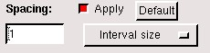

作图软件AutoCAD的操作步骤：

（1）可以移动其中边界的一段线段，但要保证最终的图形，边界要封闭；

（2）点击左边的按钮，选择所有线段，形成计算区域的面域，然后选择
文件---输出---sat格式的图形文件。

（3）如果需要拆分已形成面域的计算区域为分散线段，进行边界的修改。可以点击右边的，选择面域图形就可以了。

剖分网格软件Gambit的操作步骤：

（1）打开GAMBIT软件。

（2）导入sat文件，步骤：File -\> Import -\> ACIS 输入
sat文件的路径，如e:\\zmp.sat

(3)然后，点击右上角的，点击，，里面选择所有的边，形成face，再点击，删除其中的face2；

（4）在点击按钮，，，，在里面选择face1,
，单元选择Quad为四边形单元，TYPE
选择PAVE为非结构网格，，spacing里面填写网格单边尺寸，一般选择15-30m，点击Apply可生成网格单元。

（5）选择Solver --\> Polyflow

（6）选择File Export Mesh
输入保存路径，如：e:\\zmp.neu，注意：为neu文件。

（7）使用 gambit-tec-pro.for程序，处理zmp.neu文件，如下：
filename=\'zmp.neu\'

open(unit=2,file=filename,status=\'old\')

filename=\'zmp_TEC.dat\'

open(unit=3,file=filename)

以上zmp_TEC.dat文件就是可以用TECPLOT打开的网格数据文件。

（8）地形插值步骤过程：

首先，打开散点地形，散点地形数据文件为：variables=x,y,z以及XYZ坐标值。

然后，打开zmp_TEC.dat文件。

然后，地形插值，选择 data interpolate inverse distance

 然后，输出插值后的网格地形数据：file write data file

(9)再使用Data_pre。For程序处理地形插值文件，形成Elcirc模型输入的hgrid文件。Hgrid文件还有手动填入边界信息节点号。

使用Timeserial.for程序形成程序使用的时间序列流量或水位波动过程。
