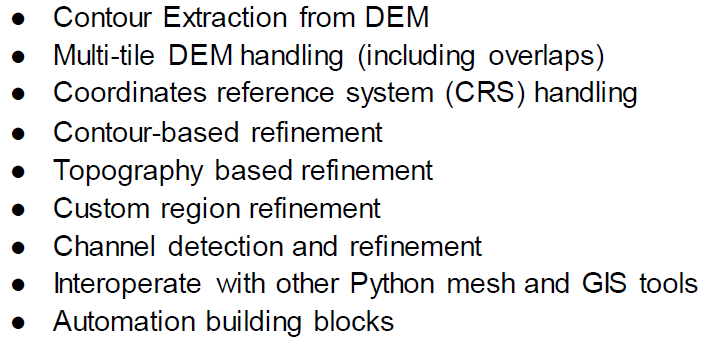
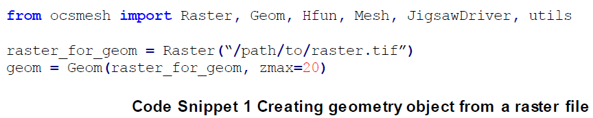
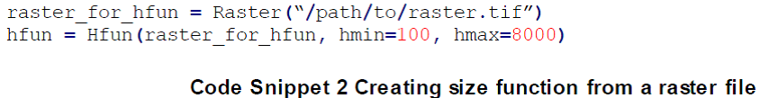
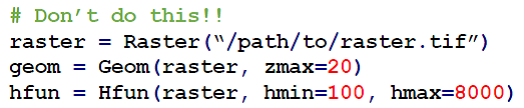
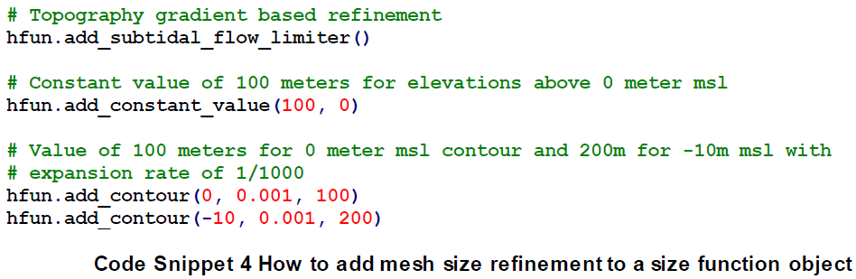
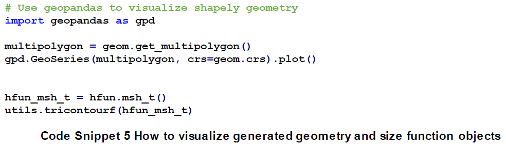
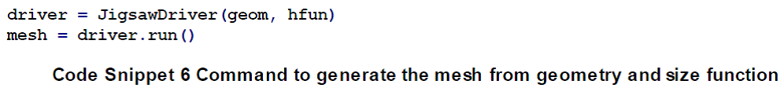
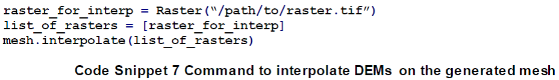
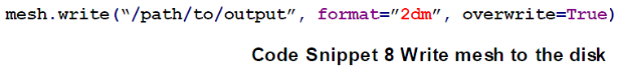

# OCSMesh介绍

## 摘要

OCSMesh是生成用户海岸环境模拟的非结构网格的Python工具，使用面向对象编程生成计算域和网格尺寸函数，使用Jigsaw作为网格划分引擎，服务于SCHISM模型，但是生成的三角形网格可用于任何求解器。OCSMesh可以处理常见的DEM数据格式和Coverage定义，如Polygon,
Line和Point。OCSMesh还支持常见的近海岸模型，如SMS 2DM格式和ADCIRC/SCHISM
GRD格式。使用OCSMesh生成网格过程，涉及创建定义几何的对象，即模拟区域，以及模拟域的单元大小。因此，可以通过API操作网格对象，如扩展计算域、增加网格密度以及插值DEM数据到网格上。基于不同类型数据定义几何对象，类似的，可以基于栅格数据或网格数据构建尺寸函数。这种灵活框架允许用户在不同阶段定义网格划分过程，达到一定的计算效率。如果出错，可以从中间阶段继续网格划分过程。还可以使用其他的Python网格划分工具与OCSMesh交互使用。

## 特点

## 快速使用

执行以下步骤：

-   识别模拟区域

-   定义最大和最小单元尺寸，以及细化网格

-   网格生成，插值地形数据到网格上

可以使用不同方式定义模拟区域。其一，通过DEM
Raster文件和DEM中最大等高线级数定义。级数需要以海平面以上米数定义（向上为正）。

OCSMesh支持使用RasterIO (Gillies, RasterIO,
2021)读取栅格数据，即支持GeoTIFF和NetCDF格式。

定义好模拟域后，需要定义单元大小。使用栅格（与域几何一样）创建尺寸函数：

注意：

1 以米为单位定义最小和最大网格单元尺寸，与栅格CRS无关。

2 使用独立的栅格对象创建域几何和尺寸函数。

Code Snippet 3 What to avoid when initializing geometry and size
function from a raster object

定义最小的全局尺寸的函数仅松弛（不强制）网格划分标准，即不会细化网格。为得到更小的单元，需要指定划分：

在传递几何和尺寸函数给网格驱动器之前，可提取并检查结果：

每次调用get_multipolygon()时计算几何多边形。因此，如果绘制几何，然后传递给驱动，会计算多边形两次。可以避免两次计算的计算量（特别是在多个DEM
collector对象中）。但是这个话题超过了文档的范围。

生成网格：

生成的网格没有高程数据。Code Snippet 7展示如果从栅格插值高程数据。

如Code Snippet
7所示，interpolate()接受插值多个栅格文件列表。列表中的最后一个栅格有最高优先级。更高优先级的栅格数据，在重叠部分，将覆盖低优先级的数据。

插值完成后，输出网格对象到文件。目前OCSMesh仅支持以WGS1984坐标输出网格到磁盘：

具体操作细节参考Examples一节。

## 参考文献

OCSMesh: a data-driven automated unstructured mesh generation software
for coastal ocean modeling. NOAA Technical Memorandum NOS CS 47, 2021
