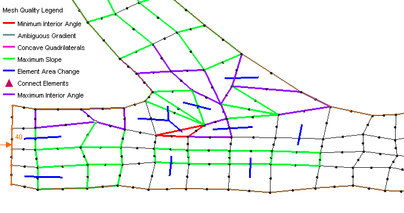

SMS是英文Surface Water Modeling
System(地表水模拟系统)首个字母的组合，是美国陆军工程兵水利工程实验室(United
States Army Corps of Engineers Hydraulics
Laboratory)和扬·伯明翰大学(Brigham Young
University)等合作开发的商业软件，可用来模拟水体的流场和浓度场。它由FESWMS-2DH、RMA2、RMA4、SED2D等软件包组成。本章对将使用的RMA2和RMA4软件包及其强大的后处理功能作较详细地说明。

1 水动力模型的建立

水动力模型建立的步骤如图1所示：

图1 RMA2二维水动力模型的工作流程

1.1 输入底图

采用SMS进行地表水模拟时，首先要输入较详细的底图。SMS8.1软件输入底图的途径主要有两种：

1.  打开tiff格式的图形文件，将地图中随机的三点的坐标输入定位，使底图与实际地形吻合；

2.  此外SMS8.1软件还支持AutoCAD转换成的R12的.dxf格式的电子地图，可以直接打开.dxf格式的地图。

1.2定义节点

具体操作如下：

1.  点击图标{width="0.2722222222222222in"
    height="0.2611111111111111in"}增加节点，利用图标{width="0.25in"
    height="0.2388888888888889in"}选择节点，以便对节点进行修改；

2.  选中两节点，在SMS8.1版本中在窗口下方偏右出现*distance*项为两节点距离，如图2所示。已知两点距离，可在*Node/Interpolation
    Option*项中调整插入的节点数，根据实际情况插入节点。

3.  节点坐标包括x、y、z值可在坐标框中输入，确定节点的确切位置及高程，如图3所示。

> {width="4.316666666666666in"
> height="0.18888888888888888in"}
>
> 图2 两节点间距离显示图
>
> {width="5.427777777777778in"
> height="0.20555555555555555in"}
>
> 图3 节点坐标显示图

1.3 构建网格

1.3.1 网格的构建应满足以下条件：

1.  据水力特征流速大小和过水能力的大小使网格疏密有致；

2.  构建模型者所估计的流线平行；

3.  三角形与四边形注意过渡。边界、流场复杂区域用三角形，流速均匀、航道、湖区等地使用四边形。

1.3.2 构建方法：

1、手动添加网格单元:
选中三个节点，点击{width="0.25in"
height="0.2611111111111111in"}，形成形如图标的六节点三角形网格；选中四个节点，点{width="0.25in"
height="0.2388888888888889in"}形成八节点的四边形网格；点{width="0.2388888888888889in"
height="0.2611111111111111in"}分割四边形网格或将两相邻的三角形网格合成为四边形网格；点{width="0.2388888888888889in"
height="0.2388888888888889in"}将内含两个三角形网格的四边形网格调转方向，使得网格满足适应流线，避免出现网格质量的原则。

2、通过节点线构造三角形、四边形网格：

节点如图4所示，点{width="0.2388888888888889in"
height="0.2611111111111111in"}连接节点线，三角形网格三边界，四边形网格四边界，从起点开始，终点双击结束，形如图5所示；最终，6条边界的节点线如图6所示。

{width="1.6888888888888889in"
height="1.5722222222222222in"} {width="1.7in"
height="1.5722222222222222in"}
{width="1.6555555555555554in"
height="1.5722222222222222in"}

图4 图5 图6

点{width="0.2833333333333333in"
height="0.2611111111111111in"}选择节点线，三边界须构造三角形网格单元，选中三条边界，在*Element/Triangular
Patch*构造三角形单元，点*Preview*预览，如图7；

{width="4.344444444444444in"
height="2.3555555555555556in"}

图7

四边形网格构造与三角形网格构造大体相同，选其四条边界，在*Element*/*Rectangular
Patch*中构造,如图8；另外可根据图中的四条边界*End1、End2、Side1、Side2*中*Distribute*命令可在中间插入若干个节点，此方法适合构建大规模、结构简单的四边形网格。

{width="5.144444444444445in"
height="2.3333333333333335in"}

图8

3、通过map模型，构造大规模的网格

按{width="0.2611111111111111in"
height="0.2833333333333333in"}切换至地图模型，点{width="0.25in"
height="0.25in"}在底图边界上绘制节点线，起始点单击，在终点双击结束此条节点线的绘制,如图9。绘制另一条相邻的节点线时，软件将自动识别节点之间的耦合性如图10。不管地形规则或不规则，都要形成一个图块，图块至少需要四条节点线，形如图11所示。构建模型时，为了不同的材质、地形可设置互相连接的若干个块；连接完所有的块，点*feature
objects*/*build
polygons*，这时，模型自动建立块，但是从界面上看不出来。点{width="0.25in"
height="0.25in"}再选择你所要构造的块，出现如图12
所示的效果。接下来点*feature objective\\attribute*
，出现如图13所示，您可以在*Mesh Type*
中选择网格的类型，分*paving、patch、adaptive
tessellation*分别代表三角形网格、四边形网格、密集型三角形网格。点*preview*预览。假如构造的块含有4条以上的节点线，点{width="0.2388888888888889in"
height="0.2611111111111111in"}选中某个你认为不必要的点（此点是节点线的起点或终点）在*node
option*中选择*merge*就可以把此点转换成中间点，可进行下一步骤。最后点*feature
objects/map-\>2D mesh*把地图生成二维网格。

{width="1.1777777777777778in"
height="1.1555555555555554in"}
{width="1.0555555555555556in"
height="1.5722222222222222in"}
{width="1.1444444444444444in"
height="1.5722222222222222in"}
{width="1.0722222222222222in"
height="1.5722222222222222in"}

图9 图10 图11 图12

网格构造完后，要对模型定义底高程。确定模型所用的单位（米或英尺及其它），在*edit\\current
coordination*中改变*unit*选项调整单位。

{width="5.488888888888889in"
height="3.1055555555555556in"}

图13 网格的类型

1.4 模型质量检查

整个计算区域的网格划分完毕后，为使网格收敛，点击{width="0.25in"
height="0.25in"}图标选中Mesh quality选项，对网格进行检查，检查内容包括：

1、三角形内角满足10°≤α≤150°，四边形内角满足30°≤α≤150°；

2、两单元之间的地形最大坡度≤10%；

3、相邻有限元的面积比是否控制在0.5\~2之间；

4、三角形、四边形任意两条边长度的最大比值不超过10；

5、节点地面高程大于水面高程时，是否打开"干/湿"边界条件；

6、为保证能量守恒，尽量使系统的边界光滑；

7、三角形、四边形有限元是否光滑、平整；

8、为节省计算时间，需要对有限元网格重新编号。

对于不符合要求的有限元网格如图14所示，可根据检查结果进行调整，具体步骤如下：

1、首先将选项Nodes/Locked前面的对号去掉，以便可以任意移动节点；

点击图标{width="0.25in"
height="0.2388888888888889in"}移动节点，直到该节点处不出现质量问题为止；

2、对于一些节点需改变其底高程，可在图3节点坐标显示图中输入适当的值，直到不出现网格质量；

3、点击图标{width="0.2388888888888889in"
height="0.2611111111111111in"}按逆时针方向，点击需光滑的节点线起始点，按住Ctrl键点击终点，然后点击图标{width="0.2833333333333333in"
height="0.2611111111111111in"}选中需光滑的节点线，点击Nodestrings/Smooth命令即可；

4、此外，对于四边形单元应尽量使其长边与短边的比例增大，并使长边方向与水流方向一致。在敏感区域（如水流变化较大处）需适当增加单元数，以使网格收敛。

修改后直至不再出现网格质量问题，方可进行下一步操作。

{width="5.322222222222222in" height="2.8in"}

图14网格质量显示图

1.5 定义材质

不同的材质有不同的糙率，定义材质步骤如下：

1、添加新材质，选择*Edit*/*Material
Date*点击*New*创建新材质，点击对话框中的*ID*、*Name*和*Pattern*可以定义不同的特性。

2、选择*Element/Option*，点击*Set default
material*可以设置默认的材质。若需更改单元的材质，可以点击{width="0.25in"
height="0.2611111111111111in"}工具选择需要修改的单元。然后选择*Element/Assign
Element Type*重新选择材质。

3、最后在*RMA2*/*Material
Properties*中设置材质的不同的参数（曼宁系数和涡粘性系数等）。

1.6 设置边界条件

1、利用{width="0.2388888888888889in"
height="0.2611111111111111in"}工具，按下Shift键点击起始点，最后双击终点即可创建节点串。然后利用{width="0.2833333333333333in"
height="0.2611111111111111in"}工具点击节点串，查看边界线方向。入流边界方向应朝向计算域内，出流边界方向应朝向计算域外。若不符合要求，可以选择*Nodestrings*/*Reverse
Direction*更改方向。

2、入流与出流边界方向确定后，利用{width="0.2833333333333333in"
height="0.2611111111111111in"}工具点击节点串选择*RMA2*/*Assign
BC*分别设置入流和出流边界条件。选项Boundary Condition
Type中可以设置边界的类型，Specified flow可以定义流量边界；Water surface
elevation可以定义水位高程边界；Reflecting
boundary可以定义反射边界；Rating
curve可以定义非恒定边界。一般进口处可以设置入流量和流速，出口处设置水位。

1.7 模型控制参数设置

模型控制参数的设置是用来定义水动力模型的初始条件的。选择*RMA2*/*Model
Control*打开模型控制对话框，参数设置具体步骤如下：

1、General选项：计算机类型Machine Type选择第一项；Water
Properties选择中，Temperature设置水温，Density设置水的密度，Specify
initial water surface for定义模型出口初始水位，Specify 1D node initial
condition设置初始水深和流速估计值；其它选项取默认值，如图15所示。

{width="5.405555555555556in"
height="2.988888888888889in"}

> 图15 RMA2模型控制General选项对话框

2、Timing选项：模拟类型Simulation Type中恒定计算选择Steady
state，动态模拟则选择Dynamic；设置迭代次数Iteration For Flow
Calculations/Initial；在Depth Convergence Parameters/Steady state
depth选项中输入模拟计算的收敛标准（一般取0.0001）；非恒定计算选择Dynamic，迭代次数和收敛标准设置同上，并在Computation
Time中输入各项值。

3、File选项：该选项中设计到文件的存储功能。若是冷启动，则保持选项中的默认值即可；若为热启动，则需在进行初次计算时打开Write
hotstart按钮，计算完毕后，系统会自动生成"\*.hot"文件，若需要利用同一地形继续进行计算，则可以打开Hotstart
input按钮，找到"\*.hot"文件，便可进行热启动计算。

4、Materials选项：该选项主要控制干/湿地的打开和关闭。

5、Weather选项：该选项可以控制风效应、降雨、蒸发等因素对计算的影响。

1.8 RMA2模型检查

上述操作完成后，便可进行RMA2模型检查了。选择*RMA2*/*Model
Check*，然后点击*Run
Check*即可运行模型检查。若出现错误，可根据提示进行修改；若无错误提示，剩下的可能提示就是对网格进行重新编号。此时可以利用{width="0.2833333333333333in"
height="0.2611111111111111in"}工具点击出口处节点串，选择*Nodestrings*/*Renumber*命令即可对网格重新编号，文件存档。

1.9 模型运行

对网格进行重新编号后，便可进行模型计算。选择*RMA2*/*Run
RMA2*命令进行模型计算，若模型计算结果收敛，则计算框内会出现"RMA2
finished"字样；若模型计算发散，则会出现"Stop depth convergence exceed
25.0"字样；此时必须重新对网格进行检查，可以通过修改网格、修改参数设置等措施使网格最终收敛。具体操作如下：

1、打开网格质量显示*Mesh quality*，查看网格是否还有未发现的质量问题；

2、网格总体方向应与水流流向大体保持一致，特别是过渡地区，三角形与四边形应合理选取，网格疏密程度应与水流特性相符，水流较复杂、流速变化较大的区域应加密网格，反之则适当减小网格密度；

3、检查边界条件的设置：出口水位是否太低，入口流量是否太大，在模型控制中，初始水位的设置可以进行调整，方便模型收敛，入口与出口边界应设置过渡段防止局部区域流速过高；

4、糙率问题检查：不同材质之间需要一定的过渡区域，以满足网格收敛。
