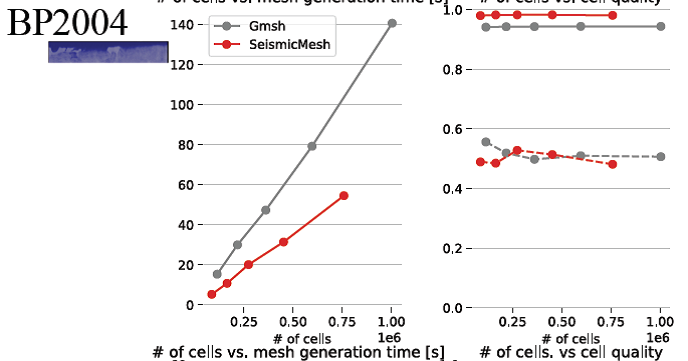
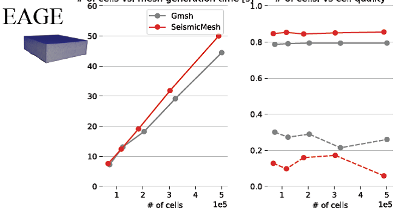
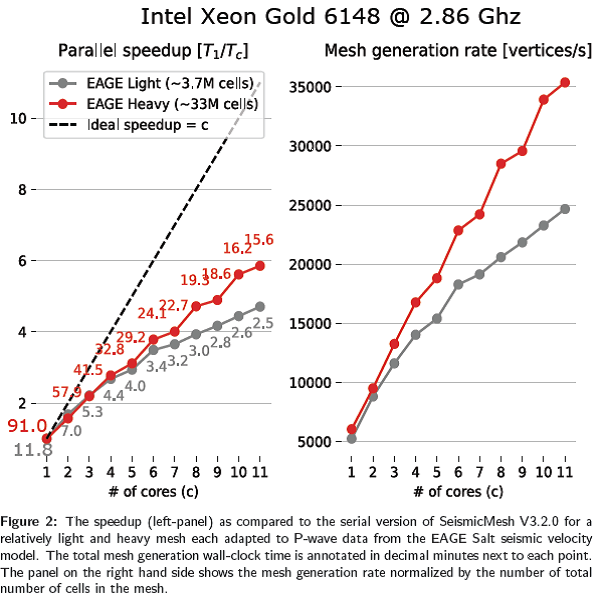

# SeismicMesh介绍

SeismicMesh是生成2D和3D单纯性网格的Python软件。类似DistMesh实施，生成高质量网格。为增加计算效率，核心程序使用C++编写，并行化计算，使用Computational
Geometry Algorithms Library (Hert & Seel,
2020)。SeismicMesh还可以从地震数据生成网格密度函数，用于网格生成使用。

## 核心功能

1
创建2D/3D定义在轴平行规则笛卡尔网格上的分级网格尺寸函数。这些网格尺寸函数确定网格分辨率的分布，与输入的地震速度模型数据的变化一致，根据几种经验条件分布（K.
Roberts, 2020）。网格大小函数分级使用Persson (2006)的方法。

2
分布式内存并行。使用分布式内存并行生成大型(\>1千万个网格单元)的高质量三角形或四面体网格，基于网格尺寸函数的网格分辨率分布。

3 实施3D Silver四面体单元剔除技术(Tournois et al.,
2009)，来约束网格质量。2D网格生成不会受到Silver单元的影响。

网格的域几何形状作为符号距离函数(SDF)的0-level
set定义，避免了需要给出定义边界的显示几何信息，在地球物理领域非常有用。

## 效率比较

比较SeismicMesh,
Gmsh和CGAL串行生成2D/3D网格的效率，考虑网格单元质量和网格生成时间。

使用2个地震数据(BP2004和EAGE)。

图1 使用SeismicMesh，创建网格时间（左列）和网格单元质量（右列）

## 并行效率

图2显示了使用11核，执行50次网格迭代，使用EAGE
P波速度模型，生成33M网格单元的效率，达到近6倍加速比。

## 参考文献

Keith J. Roberts, Rafael dos Santos Gioria, William J. Pringle.
SeismicMesh: Triangular meshing for seismology. Journal of Open Source
Software, 6(57), 2687. https://doi.org/10.21105/joss.02687

Roberts K. (2020). Tutorial: Seismicmesh. In ReadTheDocs website.
<https://seismicmesh>. readthedocs.io/en/master/tutorial.html

Tournois J., Srinivasan R., Alliez P. (2009). Perturbing slivers in 3D
delaunay meshes. In Proceedings of the 18th international meshing
roundtable (pp. 157-173). Springer.
https://doi.org/10.1007/978-3-642-04319-2_10
