# ACE/gredit
# Chapter 1: Concept and Overview
ACE网格生成及编辑程序是由美国俄勒冈卫生健康大学开发网格编辑程序

## 介绍ACE/gredit: 是什么以及能做什么
ACE/gredit is a tool for the flexible, interactive, semi-automatic
generation of two-dimensional triangular finite element grids. Although
designed to support studies of estuarine and coastal dynamics and water
quality, ACE/gredit can be perceived as a rather generic tool, with wide
application.

A typical grid is built based on a domain outline (a shoreline, for
estuarine/coastal applications) and an unstructured set of points, each
associated with a fundamental property of the domain (the water depth,
in estuarine/coastal applications). The user retains full control of the
grid design, while letting the computer perform the mechanical,
time-consuming tasks. A menu-driven interface makes the use of
ACE/gredit fairly intuitive and self-explanatory.

We note that ACE/gredit targets the generation of geometrically complex
but static grids; self-adaptive grids in time are not handled by this
software.

## ACE/gredit: Hardware and software requirements
ACE/gredit is designed for workstations and X-terminals operating under
UNIX and the X window system with the Motif graphical user interface.
ACE/gredit has also been ported to Windows 95/NT using Hummingbird
Corp\'s Motif toolkit.

## ACE/gredit: Suggestions and bug reports
Suggestions and bug reports on both ACE/gredit and on this document are
welcome. They should be sent to:

gredit-bugs@ccalmr.ogi.edu

Each suggestion or report will be carefully considered, but time
constraints may prevent individual replies to all queries.

## ACE/gredit: Overview of documentation
This User\'s Manual is the first of a series of documents planned for
ACE/gredit. A tutorial will follow.

# Chapter 2: Guide to Use
## Concept and Terminology
ACE/gredit is an evolving tool for the generation of two-dimensional
triangular finite element grids for coastal and land-margin
applications. The user retains full control of the final grid design,
while letting the computer perform the mechanical, time-consuming tasks.
ACE/gredit has automatic grid generation features, but we recommend that
grids be generated semi-automatically, with substantial user control.

## Grids
**• Background grid（背景网格）**

This is a non-modifiable grid that contains baseline information on
bathymetry. This grid is composed of 3-node triangular elements. If the
user starts ACE/gredit directly from a set of soundings, a background
grid is formed automatically by triangulation of the sounding
points.不可修改，包含基本的地形信息，一般由散点地形数据三角化形成。

**• Edit grid（编辑网格）**

This is the grid that we want to construct. By definition, the edit grid
is modifiable during the operation of ACE/gredit; when ACE/gredit is
started the edit and background grids coincide. This grid is composed of
3-node triangular elements. Nodal bathymetry is obtained by
interpolation from the background grid, an operation that requires a
specific request by the user.
最终要建立的三角网格，节点地形由背景网格插值得到。

**• Auxiliary grid**

This is a uniform quadrangular grid, formed occasionally to assist
specific operations. In particular, this grid is formed to support the
automatic placement of build points (see below).

## Outlines
**• Coastal outline**

This outline represents the shape of land boundaries (coast, islands,
etc.). This is an optional and non-binding feature, which is intended
only as a reference for visual quality control by the user.

**• Boundary (or \"edit-grid boundary\")**

The boundary represents the actual limit of the \"meshable\" domain. It
is a binding and extremely important feature within ACE/gredit. Whenever
build points are assembled in the form of an edit grid, elements can be
formed only within this boundary. The edit-grid boundary is not
automatically updated every time that a triangulation occurs; hence the
edit-grid boundary may at times be non-coincident with the actual
outline of the edit grid.

## Miscellaneous
**• Elements**

Elements are the grid \"cells\". In ACE/gredit they can 3 or 6 node
triangles, or 4 node quadrangles.

**• Nodes**

Nodes are the \"key points\" of the elements. They support the shape
functions that will be used to define geometric mapping and/or the space
distribution of variables of interest. In the current version of
ACE/gredit the nodes are the vertices of the elements.

**• Build points**

Build points are potential nodes, but are not formally connected as a
grid. Build points are used to build edit grids by \"triangulation\",
and they will effectively coincide with nodes immediately after a
triangulation. However, nodes and build points will often be
non-coincident, as the user can independently modify the number and
locations of either set.

# Chapter 3: Reference Guide
## Program start-up and command line parameters

ACE/gredit is started by typing one of the following commands:

**xmgredit -f \[grid file\]**

**xmgredit -m \[minimum distance\] -b \[bathymetry file\] -w**

**xmgredit -m \[minimum distance\] -b \[bathymetry file\] -f \[grid
file\]**

**xmgredit -W \[xminyminxmaxymax\]**

The first command assumes that a grid file already exists, and that it
will be initially loaded as both the background grid and the edit grid
for the session of ACE/gredit initiated with the command. The flag -f is
optional, referring to the format of the grid file (-f for binary, blank
for ASCII).

The second command assumes that the user wants to generate the
background grid from a set of unstructured data points, each with an
assigned depth, and that no edit grid is previously available. The
meanings of the flags and read-in parameters are as follows:

**-m \[minimum distance\]**

Sets the minimum distance allowed between nodes when triangulating a
file of bathymetry. The ensemble of build points is tested for the
minimum distance criterion, and points not satisfying the criterion are
eliminated from the triangulation process. The -m flag is optional (but
highly recommended); if used, it requires the use of the -b flag
described below. The \[minimum distance parameter\] is an user-specified
real number, in units consistent with those of the bathymetry file.

**-b \[bathymetry\]**

The flag -b indicates that the background grid will be built by
triangulation from a set of unstructured points, contained in a
bathymetry file. The parameter \[bathymetry\] is the user-specified name
of this file.

**-w**

Generates a two-element editable grid, based on the geometric limits
found in the file of bathymetry.

The third command is a combination of the first and second ones. It
assumes that the background grid will be generated from a bathymetry
file, but that an edit grid file is already available. All flags and
parameters have already been described.

The fourth command generates a 2-triangle grid between the specified
coordinates, with uniform depth of 1m.

Typing

xmgredit \[return\]

will bring a help text, describing the different options described
above. The ACE/gredit code will not be activated.

Typing

xmgredit -v \[return\]

will in addition indicate the date of the compilation of the current
version of ACE/gredit..

The formats of all files introduced above, and others used by ACE/gredit
are listed in Chapter 4.

## 用户界面

### Menu bar and Main panel

The initial user interface to ACE/gredit consists of the menu bar on the
top, a drawing area, a toolbar on the left, and a status line on the
bottom of the display. Using pulldown menus, the menu bar allows access
to a variety of features used to create, modify, and report on the
status of grids.

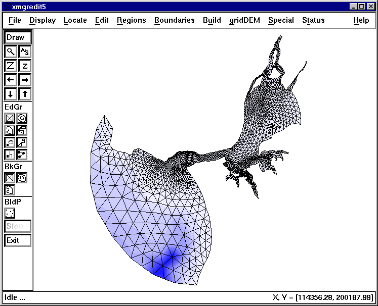

File

The pulldown menu **File** controls the reading/writing of data files
(through two separate popups), printing of the drawing area, and
allowing the user to exit ACE/gredit.

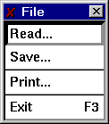

• Selecting the **Read** item from the **File** pulldown opens a dialog
allowing data to be read from disk. See Chapter 3 for details about the
file formats.

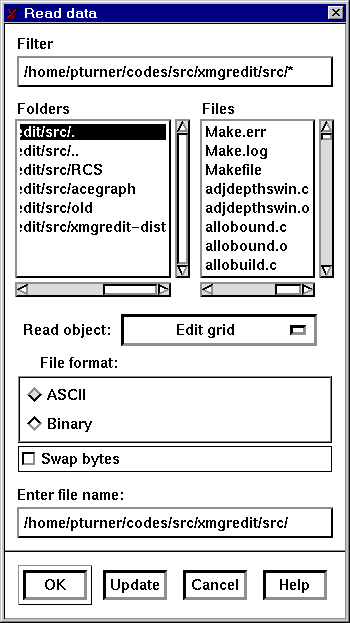

Use the **Filter** selection to get a listing of files in the directory.

Select the type of file using the selection **Read object**. The choices
are:

-   **Edit grid** indicates that the file given in the Selection item is
    a grid to edit.

-   **Edit boundary (X, Y)** is a file containing boundaries given as
    locations.

-   **Edit boundary (nodes)** is a file containing boundaries given as
    nodes from the edit grid.

-   **Background grid** is a file containing a grid to use as a
    reference grid to use to interpolate bathymetry to the edit grid, or
    automatic placement of build points.

-   **Coastal boundary** file type is a boundary given as locations.

-   **Build points** indicates a file type containing locations and
    bathymetry to use in the triangulation routines.

Select the file format, either ASCII or binary. At the present time, the
only objects with a binary format are grids.

Use the Selection item to enter the specific file name.

Click on the OK button to read the desired ACE/gredit object. On success
the drawing area is refreshed, and the new object (if drawable) is
drawn.

• Save

Similarly, selecting the Save popup

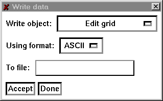

opens a dialogue allowing data to be written to disk.

Select the object to write, the file format, and the name of the file
and click on Accept.

• Print

To generate a hardcopy, select the **Print** item from
the **File** menu.

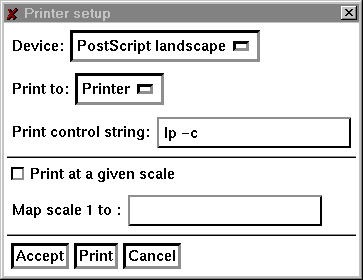

Select the device, either PostScript landscape, PostScript portrait,
FrameMake .mif landscape, or FrameMaker .mif portrait.

**Print control string**: The meaning of this item depends on the
selection chosen in the **Print to:** item above. If the printing is to
be done to a printer, enter the string used to spool. If printing is to
be done to a file, enter the file name.

Press **Accept** to register the changes, **Print** to print the current
display, or **Cancel** to close the popup without printing.
The **Accept** button does not print.

**Exit**

Selecting Exit terminates ACE/gredit, upon the user\'s acceptance of a
confirmation question. Note that all data that was not previously saved
to disk will be lost upon the termination of ACE/gredit.

**Display**

Items in the **Display** pulldown menu affect how and which objects are
drawn on the drawing area.

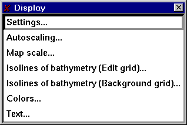

**Settings**

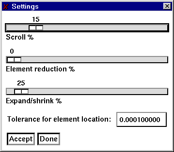

**Scroll %** sets the amount of movement for the arrow buttons located
on the main panel. With the mouse, press on the highlighted bar while
holding the mouse button down and move to the right (increasing scroll)
or left (decreasing scroll). Changes in the position take effect
immediately and affect the next and subsequent presses of the scrolling
arrows on the main panel.

**Element reduction %** sets the amount to shrink elements about their
centers. This is sometimes convenient to check whether elements exist
and/or are properly formed. Changes in this item take effect the next
time the grid is re-drawn.

**Expand/shrink %** sets the amount to expand or shrink the grid when
the Z or z buttons are pressed, respectively.

**Tolerance for element location** sets the value to use to determine if
a point is in an element.

**Autoscaling**

Autoscale the display with regard to one or more features

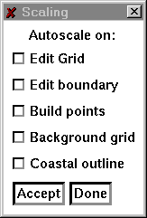

Select the object(s) to use to set the scale, then click on Accept. The
display will be scaled in such a manner that the selected object(s) will
be contained in the display.

**Map scale**

Set the

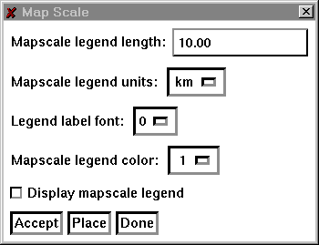

Set the map scale legend by selecting the length of the legend, the
units of the legend, and other properties. Use \<bplace\< b=\"\"\>to
pick the location of the legend on the drawing area.

**Set isolines of bathymetry (edit grid)**

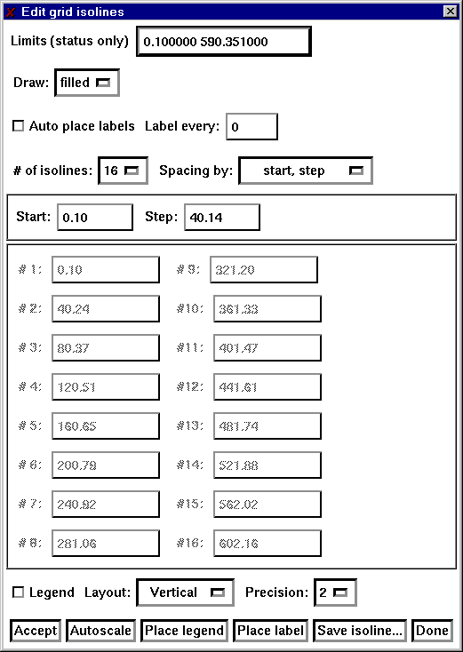

**Limits (status only)**: Display the minimum and maximum values of the
depths in the edit grid.

**Draw isolines**: Select the method used to draw isolines. There are
three selections, Lines, Filled, or Both. If Lines is selected, isolines
are drawn as lines at the isoline values. Filled draws filled contours
with the isoline values representing lower bounds. With Both, isolines
are draw as lines and color filled contours. Use View/Colors to set the
colors for filled contours.

**Precision:** Set the number of places to the right of the decimal
point for labels in the legends and in the assignment of the isoline
values.

**\# of isolines:** Set the number of isolines to use for both the
start/step or specified spacing of isolines.

**Isoline spacing by:** A choice item, either Start/step or Specified.
If Start/step is selected, the the values for Start and Step below are
used to determine the spacing of isolines.

**Start value:** In the Start/step method of isolines spacing, the
starting value for isolines.

**Step value:** In the Start/step method of islolines spacing, the
increment between successive isolines.

**Precision:** Number of decimal places to the right of the decimal
point to use for the isoline levels.

The two columns of text items occupying the center of this popup are
used for the Specified method of isoline spacing and to display the
values computed by the selection of the Start step method.

Click on **Accept** to register the changes. **Autoscale** will update
the values in the **Limits** text item.

**Set isolines of bathymetry (background grid)**

This popup is identical to the previous popup, but operates on the
background grid only.

**World**

Set the scaling of the drawing area

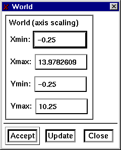

**Viewport**

Set the viewport or clipping region of the drawing area

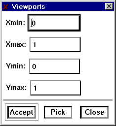

Read an image to display on the drawing area.

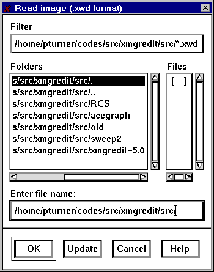

**Set colors**

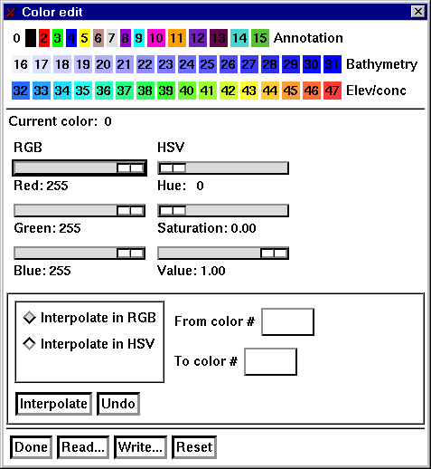

ACE/gredit uses 48 colors divided into three sections, one reserved for
annotation, the second is used for isolines of bathymetry, the third for
isolines of concentrations and elevations. Each sections contains 16
colors for a total of 48.

Each color may be individually set, or linearly interpolated using
either the RGB color model (red, green, blue) or the HSV color model
(hue, saturation, and value).

RGB values range from 0 to 255 for each of the three primary colors. A
value of 0 for any primary color means that this component is not
included in creation of the selected color. Black is the color composed
of RGB values (0, 0, 0), or no contribution from any of the three
primary colors. White is formed when each of the primary color values
are 255. To form the most solid blue, set the RGB values to (0, 0, 255).

Colors are set using the HSV color model by selecting a hue, or color,
then varying the amounts of white (saturation), and black (value). The
hue is a value from 0 to 360, and is measured in degrees around a color
wheel that begins with red (hue = 0), and cycles through the colors,
winding up at red again (hue = 360). Going from 0 to 360 degrees, a
color goes from red, to yellow, to green, to cyan, to blue, to violet,
then back to red at 360. The saturation of a color is a measure, from
(0, 1.0), of the amount of the color to add. A saturation value of 0.0
will be white regardless of the hue, as this means that none of the hue
will be used to form the color. A completely saturated color, i.e. a
saturation value of 1.0, indicates that there is no white in this color.
The value quantity measures the how light the color determined by the
hue and saturation values will be. A value of 0 means that the color
will appear black, a value of 1 indicates that the color will be the
maximum brightness allowed by the hue and saturation values.

To set a particular color, click on the color then adjust the sliders
provided in either the RGB or HSV color spaces. As there is a mapping to
and from each color space, changing a value in one color space will
cause a corresponding change in the other.

To set a range of values, use linear interpolation. Select the color
space in which to do the interpolation, the starting color and ending
color, then click on Interpolate to perform a linear interpolation from
the starting to the ending color. The starting and ending colors are not
affected by the interpolation, it applys to the intervening colors only.

Use Undo to reverse the effects of Interpolate. Use Reset to set the
colors to the start-up values. Read and Write bring up popups that allow
the current colormaps to be read or written to disk. Use Done to close
the popup.

**Text**

Use this popup to place annotative text, lines, and rectangles on the
drawing area.

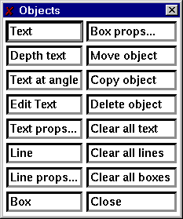

**Text:** To draw a text string, click on Text, then click at the
location on the drawing area to place the text and type the text
directly onto the drawing area.

**Text at angle:** With two successive mouse clicks on the drawing area,
define a line to specify the angle at which the text is to be drawn,
then click again at the location of the start of the text line and type
in the desired text.

**Edit Text:** Selecting this item and click near the start of the text
line to edit.

**Text props:** Set the color, line width, rotaion, and justification of
text. This popup only affects strings created after using this popup.

**Line:** Click at the start and end of the line.

**Line props:** Set the color, line width, line style, and arrows of
lines created after the use of this popup.

**Box:** Create a rectangle by clicking on opposite corners of the
rectangle.

**Box props:** Set the color, line width, line style, and fill style of
rectangles created after the use of this popup.

**Use Move, Copy, and Delete** to manipulate existing objects.

**Use Clear all text, Clear all lines, and Clear all boxes** to remove
each of these types of objects.

### Locate

Displays information concerning individual nodes and elements, and
places the pointer at user-selected nodes and elements.

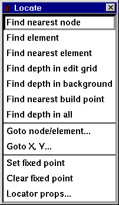

**Find nearest node**

Display information about the node nearest the pointer when the left
mouse button is pressed. The node number, the location and the depth at
this node are displayed in the Locate message item on the main panel.

**Find element**

Display information about the element containing the pointer when the
left mouse button is pressed.

**Find nearest element**

Display information about the element nearest the pointer when the left
mouse button is pressed. The element number, the numbers of nodes
defining this element, the area, and the equivalent radius and the depth
at this node are displayed in the Locate message item on the main panel.

**Find depth in edit grid**

Clicking at a point in an element of the edit grid containing the
pointer displays the interpolated depth at that point in the Locate
message item on the main panel..

**Find depth in background grid**

Clicking at a point in an element of the background grid containing the
pointer displays the interpolated depth at that point in the Locate
message item on the main panel.

**Find nearest build point**

Display the location and depth of the build point nearest the pointer
when the left mouse button is pressed.

**Find depth in all**

Report on the depth in both the edit and background grids when the left
mouse button is pressed.

**Goto node/element**

Warp the cursor to a user specified node or element.

Selecting the Goto node/element item brings up a popup allowing a node
or element number to be entered. pressing the Goto node or Goto element
button moves the pointer to that node or element.

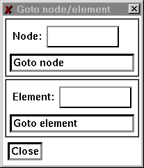

**Goto X, Y**

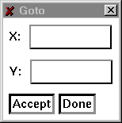

Use Goto X, Y to warp the pointer to a particular location in the
drawing area.

**Set fixed point**

Set the point to use as a fixed point from which positions are computed
for the locator message item.

**Clear fixed point**

Disable the use of a fixed point for the locator position.

**Fixed point props**

Set the format and precision to use for the display of the pointer
position.

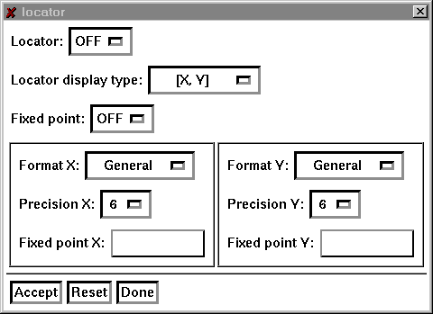

**Locator:** Toggle the continuous display of the pointer position. When
ON, the pointers posistion is displayed continuously in the locator item
on the main panel, when OFF, the position of the pointer is displayed
only when the left mouse button is pressed.

**Locator display type:** Set the transformation used to compute the
locator\'s position. There 6 choices

**X, Y:** Display the pointer location in terms of the doamin coordinate
system.

**DX, DY:** If the locator fixed point is set, display the location of
the pointer as the difference between the pointer\'s location in the
grid coordiante system and the fixed point. If no fixed point is set,
then the display is the same as for \[X, Y\].

**Distance:** If the locator fixed point is set, display the difference
in distance between the pointer\'s position in the grid coordinate
system and the fixed point. If no fixed point is set, then display the
distance from the origin.

**R, Theta:** If the locator fixed point is set, display the position of
the pointer in polar coordinates relative to the fixed point. If no
fixed point is set, display the position of the pointer in polar
coordinates relative to the origin.

**VX, VY:** Display the pointer\'s position in viewport coordinates.

**SX, SY:** Display the pointers posistion in screen coordinates.

The items **Format X** and **Format Y** select the format of the
numerical display of the pointer position. Either General, Decimal, or
Exponential. General selects one of decimal or scientific notation to
display the location, depending on the magnitude of the numbers. Decimal
selects a fixed number of significant digits, exponential uses
scientific notation for the display.

The number of places to the right of the decimal point is set using
the **Precision X** and **Precision Y** items.

Explicitly set the fixed point position using the **Fixed point
X** and **Fixed point Y** text items.

Toggle the use of the fixed point using the Fixed point choice item.
Selecting ON will cause the locator display to use the fixed point in
computing the pointer location if the locator display type is \[DX,
DY\], \[DISTANCE\], or \[R, Theta\].

Press **Accept** to register the changes, **Reset** to restore the
default values, and **Done** to close the popup.

### Edit

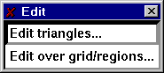

Call the pop-ups that control the editing of nodes, elements and
associated features, either in an individual basis, over the entire
grid, or within selected regions.

**Individual operations**

For grids composed strictly of triangles, the following operations may
be performed on nodes and elements of the grid.

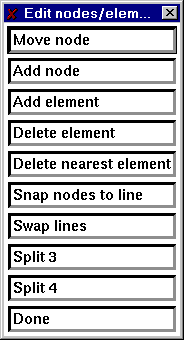

**Move node**

The move node item allows the location of individual nodes to be changed
by using the mouse.

Select the Move node item and click near the node to be moved and click
again with the pointer at the new location.

The coordinates in the table of nodes defining the locations will be
updated to reflect the new location for each node that is moved. This
procedure may be repeated as often as desired, as once the Move node
item is selected, the mouse will stay in this mode until the right mouse
button is pressed or another action item is selected.

**Add node**

The add node item allows a node to be added to the table of nodes.
Select the Add node item and click at the location of the new node, the
coordinates of the new node will be appended to the table of nodes.
Adding nodes may be repeated as often as desired until the right mouse
button is pressed or another action item is selected.

Note:

Merely adding nodes to the table of nodes does not automatically create
new elements. To use the add node function effectively, it should be
used with the Add element function described below.

**Add element**

Add an element to the table of elements in the editable grid.

Click on three nodes in a counter-clockwise fashion to specify the nodes
for the new element. If additional elements are required, repeat as
needed as this function repeats until the right mouse button is pressed.
The new element is added to the table of elements.

**Delete element**

Remove elements from the table of elements.

Click on the Delete element button. Click in the interior of the element
to be removed. Repeat as needed, when completed, use the middle mouse
button to register the deletions. To cancel, press the right mouse
button. Elements are removed from the table of elements.

**Delete nearest element**

Remove the element nearest the pointer from the table of elements.

Click near the element to be removed. Repeat as needed, when done, use
the the middle mouse button to register the deletions. To cancel, press
the right mouse button. Elements are removed from the table of elements.

Note:

Delete nearest element uses the centers of elements to determine which
element is nearest the pointer.

**Snap nodes to line**

Move selected nodes so that they lie on a previously defined line.

Snapping nodes require the definition of a line. After selecting the
snap to line option, click at the beginning of the line, and again at
the end of the line. Click on each node to be snapped, when done, press
the middle mouse button to register the collection of nodes to be
snapped. The right mouse button cancels the operation.

Result

Each selected node is translated to the line by computing the shortest
distance from the node to the line.

**Swap lines**

Swap the shared lines between elements.

Select the two elements with a shared edge by clicking on each element.

**Split 3**

Split an element into three elements.

Click in the interior of the element to be split, repeat as needed. When
done, use the the middle mouse button to split each selected element
into 3 elements. To cancel, press the right mouse button.

Result

Elements are split into 3 by joining the vertices of each selected
element with the center of the element.

Note

Generally, the elements formed by this procedure are poorly formed.
Triangulating will rearrange the elements in a more acceptable
configuration.

**Split 4**

Split an element into four elements.

Click in the interior of the element to be split, repeat as needed. When
completed, use the middle mouse button to split each selected element
into 4. To cancel, press the right mouse button.

Result

Elements are split into 4 elements using a division based on joining the
midpoints of the element edges.

Note

This function forms elements that may not be properly formed.
Specifically, nodes are created that are not necessarily shared by
adjacent elements. Triangulating will rearrange the elements to a more
acceptable configuration.

Operations over an entire grid or in specified regions

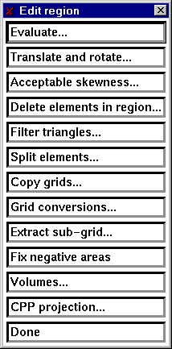

The popup for operations within specified regions includes several
items.

**Evaluate**

Evaluate a mathematical expression on the co-ordinates or depths of
nodes. Variables are x, y for the coordinate directions and depth for
the depth at a node.

**Translate and rotate**

Allows the translation and rotation of a grid

Enter values for the translation, the rotation (in degrees), and the
point about which to rotate, then click on Accept.

Note: The order of operations is translation followed by rotation.

**Acceptable skewness**

During the process of grid creation, occasional skinny elements are
formed. Selecting this item marks these elements and optionally allows
them to be deleted.

**Delete elements in region**

Remove all elements inside or outside the current region.

**Split elements in region**

Split elements into 3 or 4 elements inside or outside the currently
defined region.

**Copy grids**

Select the grid to copy from and the grid to copy to. There are 5 slots
for grids in ACE/gredit plus one for the background grid.

**Extract sub-grid (提取子区域网格)**

Select the number of the grid that will hold the extracted sub-grid,
then click on Apply. With successive mouse clicks, form a region
containing the sub-grid. Press the middle mouse button to select all
elements in the region to use to form the new grid. To make this grid
active, copy it to grid 0 (unless grid 0 was selected as the destination
for the sub-grid).

**Fix negative areas
（三角单元的节点需要逆时针排序，否则单元面积为负值）**

Perform a check on each element to make sure that each is formed in a
counter-clockwise fashion.

### Regions 

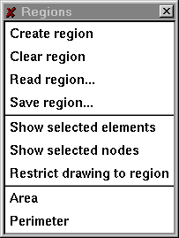

• Create region

Select a polygonal region used to restrict operations to a particular
segment of the editable grid. Successive clicks at the vertices of the
polygon, builds the region. Use the middle mouse button to register the
defined polygon, or the right mouse button to cancel.

• Clear region

Remove the currently defined region, if any.

• Area

Compute the area of a polygonal region.

• Perimeter

Compute the perimeter of a polygonal region

Boundaries

This menu allows the creation and edition of edit internal and external
boundaries.

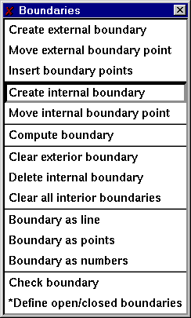

Individual items in the menu are discussed below.

• Create external boundary

Define the outer boundary of the editable grid. Define a boundary by
clicking with the left mouse button at the locations of the boundary in
a counter-clockwise fashion.

• Move external boundary point

Change the location of one or more external boundary points. With the
left mouse button click near the node to be moved, then click again at
the new location.

• Insert boundary points

Add a point to an existing boundary. Click on the nodes to either side
of the location of the new boundary node, then click at the location of
the new boundary node.

• Create internal boundary

Define a boundary in the interior of the editable grid. Define a
boundary by clicking with the left mouse button at the locations of the
boundary in a clockwise fashion.

• Move internal boundary point

Change the location of one or more internal boundary points. With the
left mouse button click near the node to be moved, then click again at
the new location.

• Delete internal boundary

Remove an internal boundary by clicking near the boundary point with the
left mouse button.

• Compute boundary

Determine, from the elements defining the editable grid, the external
boundary and all interior boundaries.

• Clear exterior boundary

Remove the definition for the external boundary.

• Clear internal boundaries

Remove all interior boundaries.

• Boundary as line

Display the boundary as a line.

• Boundary as points

Display the boundary using markers at each node.

•Boundary as node numbers

Display the boundary as node numbers.

### Build

This menu controls the placement of build points and their triangulation
into a properly formed finite element grid.

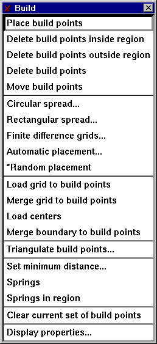

• Place build points

Define build points using the mouse. With the left mouse button, click
at the location in the domain to place the build point.

• Delete build points

Click near a build point to remove the build point from the collection
of build points.

• Move build points

Select a build point by clicking near the point then move the mouse to
the new location of the build point. Click again to place the point.

• Circular spread

Create build points according to a circular pattern.

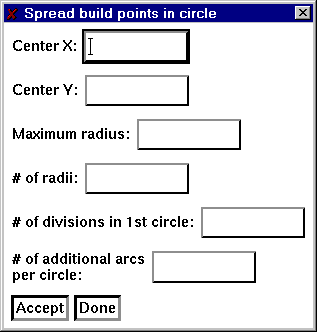

In the items Center X and Center Y enter the point to use as the center
of the circle. Enter the maximum radius in the text item labeled Maximum
radius. The item \# of radii gives the number of divisions that will be
made from the maximum radius. The next two items determine the density
of points as the radii increases.

• Rectangular spread

Create build points within a rectangular region, according to a either
regular (rectangular or rectangular offset) or random patterns

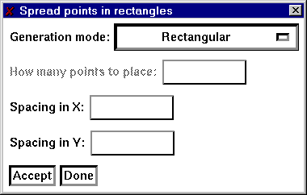

• Automatic placement

Create build points according to one of four pre-specified criterion.
The Courant number and maximum dimensionless criteria are currently set
for flow models (i.e., rely on a depth-related celerity, c=sqrt(gh)).

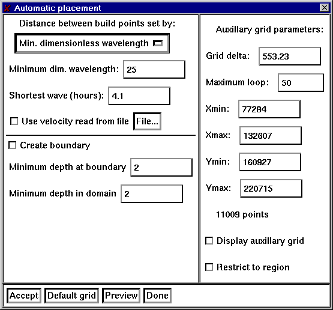

The minimal requirements for automatic generation of build points, are
an edit grid boundary and a background grid of bathymetry. If the
boundary is to be created, then a coastal outline needs to be present
also.

For build point generation, a rectangular grid (referred to here as the
auxillary grid) is created, such that the bounding rectangle of the
background grid is covered. The resolution of this auxilary grid is set
by the numeric text item labelled **Grid delta**. To change the limits
of the auxillary grid use the **Xmin, Xmax, Ymin, Ymax**items. The
algorithm starts by interpolating the depth from the background grid to
the vertices of the auxillary grid. Build points are formed by searching
for the vertex in the auxillary grid with the greatest depth, then
spiraling out from this vertex accumulating the depth and locations of
unvisited vertices. The accumulated depths are used to compute the value
of the test criteria and compared with the limiting value (either the
minimum allowable dimensionless wavelength or Courant criteria). When
the criteria is met, a build point is placed at the average location of
the vertices visted. If the number of loops performed in the process of
spiralling out from the center vertex is greater than the amount
specified in the numeric text item, **Maximum loop**, the search is
halted and a build point placed at the average location.

The item **Create boundary** toggles the automatic generation of the
edit grid boundary. Because it is unlikely that the coastal outline and
the background bathymetry will match in every case along the boundary,
it is necessary to establish a minimum value for the depth at the
boundary using the numeric text item **Minimum depth at boundary**.

Use the item **Minimum depth in domain** to set a minimum allowable
depth in the interior of the edit grid boundary. This is necessary as
the numerical criteria used to place build points will fail in the
presence of negative depths.

• Load grid to build points

Make the nodes of the editable grid the current set of build points.

• Merge grid to build points

Add the nodal positions in the editable grid to the currently defined
set of build points.

• Load centers

Add the positions of the centers of all elements to the current set of
build points.

• Merge boundary to build points

Add the positions of the boundary to the current set of build points.

• Triangulate

Perform a Delauney triangulation on the current set of build points,
removing all elements that are formed outside the external boundary or
inside internal boundaries providing said boundaries exist.

• Set minimum distance

Define the distance treshold below which two build points are collapsed
into a single point.

• Springs

Re-shapes existing elements, to create triangles that are more
equilateral in shape. More than one application may be necessary.

**Toggle drawing of build points**

• Set the display of the current set of build points.

• Clear current set of build points

• Remove the current set of build points.

### **gridDEM**

This menu allows the execution of some final-stage, model-oriented
operations. These operations are currently limited to the loading of the
bathymetry to the edit grid nodes, and to the generation/display of
bathymetric profiles. This is a menu in expansion phase.

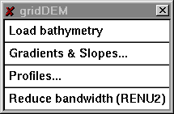

**Load bathymetry**

Using the background grid, interpolate depths for the nodes in the
editable grid.

**Gradients & Slopes**

Use this feature to display the gradients and slopes of the bathymetry.

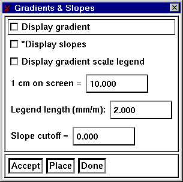

**Profiles**

Take a one-dimensional \`slice\' through the editable and/or background
grid, for which the bathymetry profile can be examined.

**Reduce bandwidth**

Minimize the bandwidth of a grid of linear triangles.

### Application specific popups.

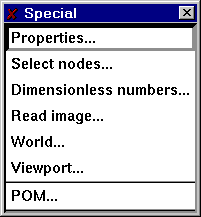

### Properties

Use the properties popup to define quantities or groups of elements.

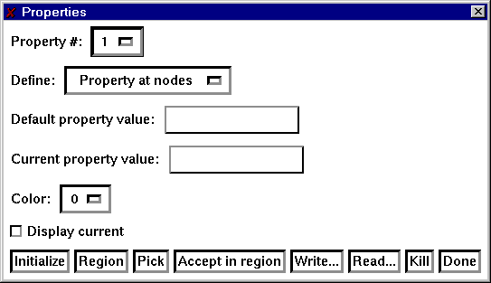

Select the number of the property to define. Use the item Define to
select if the property is to be defined at the nodes of the grid, or at
the elements. The Default property value is used to assign a value to
all nodes (elements) for initialization. The Current property value is
the selection that will be used in the Pick and Region operations
described below. Set the color for the current property and toggle the
display of the current values.

Click on Initialize to set the properties to the default value defined
above. Use Region to define a polygonal region containing nodes
(elements) that will be assigned the value of the Current property
value. Use Pick to select individual nodes (elements). Accept region
sets the property values of all nodes (elements) that are presently
contained in the Region. Use Write to write the current state of the
property values and Read to read in previously defined values.

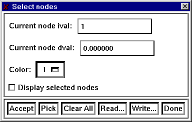

**Dimensionless numbers**

Use the functions provided here to determine if the current grid
satisfies specific numerical criteria. At present there are two
selections that may be displayed simultaneously.

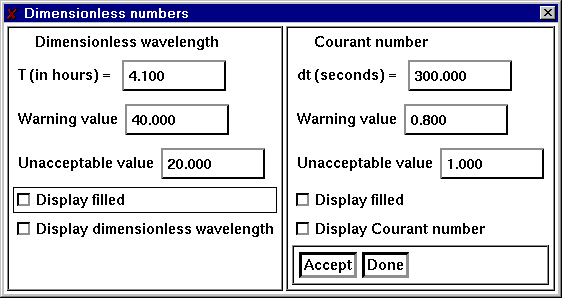

The dimensionless wavelength, L~m~, is defined by:

sqrt(g\*h)\*T/delX

The Courant number, Cu, is defined by:

sqrt(g\*h)\*delT/delX

**Status**

Report on items pertaining to the edit grid, build points, and
boundaries.

# Chapter 4: 数据结构及文件格式

## Introduction

Data structures recognized by gredit as inputs can be classified as
follows:

• Grids

• Grid boundaries

• Coastal outlines

• Build points

File contents for each identified data structure are now described. For
each type of data structure, two major format options are or will be
available: one ASCII, and one binary.

Grids

A data structure, representing the grid to edit. It\'s currently
configured as a 2D finite element grid, formed by 3-node triangles.

ASCII format

• alphanumeric identifier

• number of elements, number of nodes

•node_number, x, y, depth \| repeat for each node

•element_number, number_of_nodes, node(1), node(2),\...,
node(number_of_nodes) \| repeat for each element, in a counterclockwise
orientation.

Example of a grid in ASCII format:

This is a line of alpha

2 4 \# number of elements and number of nodes

1 0.0 0.0 1.0 \# node number, x, y, depth

2 1.0 0.0 9.0 \# node number, x, y, depth

3 1.0 1.0 3.0 \# node number, x, y, depth

4 0.0 1.0 2.0 \# node number, x, y, depth

1 3 1 2 4 \# element number, number of nodes, node list

2 3 2 3 4 \# element number, number of nodes, node list

Binary format

The following applies to grids composed of triangles only.

• 4 byte integer giving length of record ( = 4).

• 4 byte integer magic number ( = 2).

• 4 byte integer giving length of record ( = 4).

• 4 byte integer giving length of record ( = 4).

• 4 byte integer number of elements.

• 4 byte integer giving length of record ( = 4).

• 4 byte integer giving length of record ( = 4).

• 4 byte integer number of nodes.

• 4 byte integer giving length of record ( = 4).

• 4 byte integer giving length of record (4 \* number of nodes).

• 4 byte float with the x-coordinate of node positions.

• 4 byte integer giving length of record (4 \* number of nodes).

• 4 byte integer giving length of record (4 \* number of nodes).

• 4 byte float with the y-coordinate of node positions.

• 4 byte integer giving length of record (4 \* number of nodes).

• 4 byte integer giving length of record (4 \* number of nodes).

• 4 byte float with the depth-coordinate of node positions.

• 4 byte integer giving length of record (4 \* number of nodes).

• 4 byte integer giving length of record (4 \* number of elements).

• 4 byte integer vector with the first node of connectivity for all
elements.

• 4 byte integer giving length of record (4 \* number of elements).

• 4 byte integer giving length of record (4 \* number of elements).

• 4 byte integer vector with the second node of connectivity for all
elements.

• 4 byte integer giving length of record (4 \* number of elements).

• 4 byte integer giving length of record (4 \* number of elements).

• 4 byte integer vector with the third node of connectivity for all
elements.

• 4 byte integer giving length of record (4 \* number of elements).

**Edit grid Boundary**

The edit grid boundary represents the outline of the reference finite
element grid.

**ASCII (x,y) format**

• alphanumeric identifier

• number of boundaries

For each boundary:

• number of points in this boundary, magic number

• x y / repeat for each point in this boundary

**ASCII nodal format**

• alphanumeric identifier

• number of boundaries

For each boundary:

• number of points in this boundary, magic number

• node number / repeat for each point in this boundary

Binary format is currently not available

**Coastal outline**

This is a mandatory data structure only when an automatic placement of
build points on the coastal outline is required. It represents the
contour of the reference domain limits.

**ASCII format**

• alphanumeric identifier

• number of boundaries

For each boundary:

• number of points in this boundary, magic number

• x y / repeat for each point in this boundary

Binary format is currently not available

**Build points**

**ASCII format**

• alphanumeric identifier

• number of build points

• n x y depth / repeat for each build point
