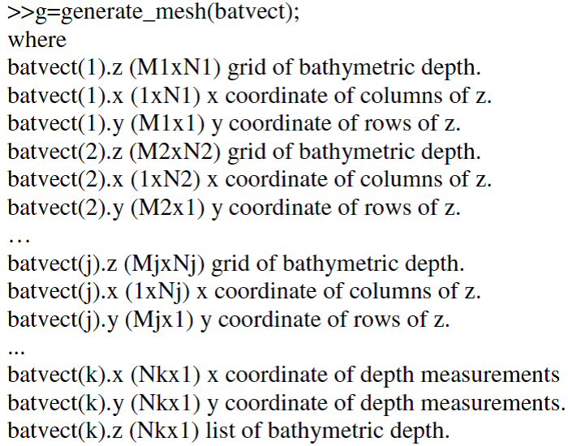

# BATTRI划分三角网格MATLAB程序的使用方法

学习目的：深入学习海洋河流数值模拟中经常用到的非结构化三角网格生成的原理和工具应用。
注意软件(software)和程序(program
code)之间的区别。

深入学习Delauney非结构网格生成原理的程序：Triangle

基于Triangle程序开发的实用非结构三角形网格划分MATLAB程序BATTRI

开源代码的非结构网格生成程序有：

(1) DistMesh -- A simple Mesh Generator in MATLAB

可以生成很多理想形状的2D和3D三角形非结构化网格。

(2) GMSH

可以交互式和运行参数文件的形式生成2D和3D三角形非结构化网格。

(3) TriGrid

(4) ACE/gredit5.exe

还有很多，......

## 1、简介

BATTRI是MATLAB图形用户界面的平面2D三角形非结构化网格划分程序，基于C语言的2D网格生成软件**Triangle**程序(Jonathan
Richard
Shewchuk开发)。BATTRI可实现网格编辑、地形导入和插值、网格生成和细化属性、准备Triangle的输入文件和可视化及保存网格的功能。BATTRI通过设置约束条件和调用Triangle生成和细化网格。

## 2、下载和安装BATTRI, OPNML和Triangle

使用BATTRI程序前需要下载和安装以下程序：

（1）下载Triangle网格划分C程序，仅安装triangle即可，不用安装Showme，Windows系统下可以使用Cygwin编译安装，更改generate_mesh.m子程序中的triangle_path；

（2）下载OPNML工具箱，设置好MATLAB路径；

（3）下载BATTRI程序。

## 3、输入文件和地形数据

为了生成网格，用户需要输入：计算区域边界节点信息、边界分段信息和岛屿信息(.poly文件)：

可参考Triangle程序手册(http://www.cs.cmu.edu/\~quake/triangle.poly.html)

.poly文件中输入线段节点和分段用于三角化计算区域，这些输入数据可以在BatTri中使用编辑选项由地形数据创建（运行BATTRI中的选项0）。这一过程可能需要手动删除不必要的分段和节点、添加分段封闭岛屿、增加海洋开边界段等。

然后，下载海岸线数据，如果海岸线点数过多（岸线划分网格会过密），可使用xy_simplify.m减少海岸线的节点数至期望的网格分辨率。注意：将这些数据编辑入.poly文件，包括节点和分段，然后导入BATTRI。后期如果要细化已生成好的网格，可以使用之前创建的.poly文件或NML格式的.nod,
.ele, .bat数据文件做参考信息。

地形数据需要覆盖整个计算区域，用于生成和细化网格。BATTRI中有4种方法导入地形数据：

\(1\) 网格地形数据导入

\(2\) 散点地形并三角化预处理（三角化是为了插值和做等值线）

\(3\) 散点地形（没有三角化预处理）

\(4\) 多种地形数据源，包括网格化(1:j)和散点(k)都有的数据矢量

## 4、运行BATTRI生成网格

首先，运行generate_mesh(x,y,z,e)或者generate_mesh(batvect)

然后，BATTRI会显示Triangle的路径，还需要选择是否使用精确的代数方法(option
0)，也可以关闭(option 1)：第一轮的地形数据三角化阶段。

然后，选择地形数据插值方法：选项1-线性插值；选项0-GSOA插值。选择GOSA插值后，还要设置：

\(1\) 地形测量误差的标准差(默认: 0.25)

\(2\) GSOA协方差尺度因子，*λ*(默认: 1)

\(3\) GSOA使用的散点数(默认：2-网格地形或10-散点地形)

**建议：**网格生成后再使用GSOA算法，因为迭代计算很慢，并且输入参数会带来误差或计算错误。

然后，需要输入最终生成网格的文件名，后缀是NML的.nod, .ele,
.bat。注意：此处的.bat文件中，从基准面向下方向为正，与输入的地形数据不同（基准面向下为负）。中间文件：.poly和Triangle网格文件(.node和.ele)也会生成，每次更改.poly文件都会保存一次中间文件(finalgrid_triangle.#.\*)

然后，需要输入等值线分级数，格式：\[C~1~, C~2~, ..., C~N~\]

然后，设置网格节点最小水深：大于此水深的位置都设为该最小水深。

然后，输入.poly文件名，有3种选择：

\(1\)
选项0：读取之前的(*x,y,z*)地形数据，画等值线，不需要输入.poly文件。

\(2\) 选项1：加载需要编辑的.poly文件，输入路径或文件名。

\(3\) 选项2：加载之前创建的NML类网格文件：.nod, .ele,
.bat，仅输入文件名（不要后缀）。

选项0适用于散点且散点密度变化较大的地形数据。选项1还会询问是否在.poly文件中已经定义了岛屿：输入1是有，输入0是没有。下一步：输入1：表明.poly文件中定义的zones(or
regions)，输入0是没有定义。下一步：输入1或0：检查地形数据点是否在计算区域(coastline)边界内，可以局部放大，检查地形散点是位于水体而不是陆地上，这对于有很多狭窄河道的近海区域是很有用的。然后，程序会绘制边界线、等值线和地形散点位置等，切换到编辑模式。选项2读取对应的.nod,
.ele,
.bat文件，然后询问是够要画地形散点位置，然后也是切换到编辑模式，该选项计算速度最慢。

## 5、网格编辑（重点）

网格编辑选择一共有17个：-2\~14

**选项-2：**编辑整个计算区域范围。

**选项-1：**编辑用鼠标左键定义的框方法局部的区域，或用鼠标右键放大。

这2个选项的编辑模式，适用于PSLG很大的情况，交互计算的速度很快。

**选项0：**在网格中增加一条等值线：该步实际上是沿着某一条等值线增加局部网格节点和单元数（为了更好地描述大陆架或地形突变的区域），或者可以沿着某些等值线进行网格划分（对需要进行干湿边界跟踪的水动力模拟很有用），或者应用于具有不同单元划分标准的多个局域（比如：水深小于10m的浅水区需要更高分辨率的网格，或比10m深的区域网格分辨率可以更低些）。当等值线内部提取后，BATTRI会要求用户选择系列的光滑算法，包括：box-car光滑，样条光滑，Douglas-Peuker光滑和无光滑，选择光滑算法后，还要求输入等值线插值到网格上时的节点间距（单位：米），用户需要输入一个最优的间距值，如果输入的值过小，那么会因为等值线与周围网格的分辨率差异很大，而产生大量的节点数和形状很差的单元。解决这个问题的办法是：使用单元内角限制条件，会改善过渡单元的形状。选择的节点间距值过大，加密生成的网格节点数过小，不足以分界等值线。如果使用一条等值线创建区域(使用选项10)，需要增加段数将等值线终点与模拟区域边界链接起来，这能保证定义的区域封闭。

**选项1：**使用鼠标左键添加顶点(vertices)到网格。节点可以逐个输入。用鼠标右键可以脱离用户界面，返回MATLAB命令行窗口的网格编辑菜单。

**选项2：**使用鼠标左键删除网格的一些顶点。如果某顶点与边界连接，该边界也要从计算区域中删除。可以逐一删除顶点。鼠标右键返回主菜单。

**选项3：**在屏幕中移动顶点。使用鼠标左键点击选中需要移动的顶点。移动到新的位置，点击鼠标左键，移动顶点完成。该过程可重复进行以移动多个顶点。鼠标右键返回编辑主菜单。

**选项4：**向网格增加边（段）。段(segments)是强制添加到网格中的一些线段。添加1条边，需要2个顶点。首先，使用鼠标左键选择边的第1个顶点，再使用同样方法选择第2个顶点。1条红线将连接2个顶点，定义好边。可逐一形成边。

**选项5**：从网格中删除边。点击一个小圆圈(中心位于边的中点)，选中需要删除的边，圆圈将标记为红色**×**。可逐一选择多条边。点击鼠标右键返回编辑菜单。删除1条边不会删除对应的顶点。

**选项6：**将1条边分解为若干小的段。选中要分解的边（同选项5），输入要分解的段数。该过程不可重复，每次分解边都要选择一次编辑网格。该选项对分解海洋开边界线时很有用。

**选项7：**向网格中增加1条样条曲线。可选择添加的是封闭(0)或开放(1)的样条曲线。封闭样条曲线可用于定义简单的岛屿(选项8)或区域(选项10)，而开放样条曲线可用于创建弯曲的海洋开边界。通过点击鼠标左键逐个输入样条曲线上的节点。点击一次鼠标右键就会在屏幕上创建一条红线。此时用户可以同选项3的步骤删除样条曲线上的节点。对样条曲线形状满意，可以点击鼠标右键，返回编辑菜单，程序会询问沿着样条曲线的期望节点间距，同选项0的方法一样选择节点间距。

**选项8：**向网格中增加岛屿（洞）。尽管网格中存在由线段围成的封闭区域，但没有将其定义为岛屿。通过输入关心区域内部的随机点的*x,
y*坐标来定义封闭区域为一个岛屿，可点击鼠标左键完成。岛屿可重复创建。定义为岛屿的封闭区域标记为红色叉叉。点击鼠标右键返回编辑主菜单。注意：一个定义为岛屿的区域实际上是由线段(segments)封闭的，否则，the
entire triangulation will be eaten away by Triangle until an edge is
encountered.

**选项9：**从网格删除岛屿（洞）。在定义为岛屿的红色叉叉上点击鼠标左键删除该岛屿。可删除多个岛屿。点击鼠标右键返回编辑主菜单。

**选项10：**使用与选项8同样的方法向网格增加区域(zones,
regions)。区域是由线段封闭的区域，可向局部区域上的网格单元施加面积限制条件。区域定义方法同岛屿，但区域是标记为绿色叉叉及区域编号。在网格生成初始阶段使用区域编号施加面积限制。区域编号从每次起动增加区域操作开始，即使之前定义过的区域。但是，区域一般增加成功，该次操作关闭，区域将自动重新编号。

**选项11：**使用选项9的同样方法从网格中删除一些区域(zones)。

**选项12：**删除用户定义的盒子范围内的网格节点和对应的边。点击鼠标左键定义盒子的一个角拖动到另一个角，盒子区域内的网格节点标记为红色叉叉。在命令行窗口，如果想从网格中删除则输入1，如果误操作（不想删除）则输入0。点击鼠标右键返回编辑主菜单。

**选项13：**将目前计算区域的编辑状态保存为filename.poly文件，文件名由用户输入。

**选项14：**离开网格编辑菜单，将变化情况保存到'finalgrid_triangle.#.poly'文件。

## 6、生成初始网格(first-cut mesh generation)

在细化或编辑网格之前先生成一个初始网格，这个初始网格是基础，可提供网格细化步骤中需要的单元面积和水深信息。

用户需要仔细选择初步生成网格的输入参数，在最小角度限制、最大单元面积和增加的最大节点数之间找到平衡。网格过粗不能精确描述地形变化，网格过细，则增大计算耗时。对模拟区域内的地形变化尺度有一个大致了解是确定网格生成输入参数的开始。诸如河道-海滩-沼泽带宽度-河口-沙波尺度等都可提供一些物理启示，这对用户确定网格单元面积和内部角度限制都是有好处的。如果初始生成网格不满意，可试验着重复生成网格。

生成初始网格步骤中需要输入的变量有：

**最小角度限制**：限制网格单元的最大内角，比如：设为25度，生成网格单元内角就不能小于25度。注意：角度限制对输入线段夹角不起作用，如果夹角小于20.7度或更小，三角化算法理论上会停止（Triangle计算失败）。实际上，最小角度为33.8度，算法会计算成功。如果使用很细的网格，有必要将这个角度设置在20度以下。

**最大单元面积限制**：限制初步生成网格单元的最大面积。比如：设为5000m^2^,
那么网格单元面积就不能超过5000m^2^。使用选项10定义了区域，需要输入不同的面积限制，如果不同区域的差异较大，可能会生成aspect
ratio很差的单元，这可以通过设置最小角度限制来解决。输入一个很大的面积限制数，可能该功能就不起作用。

**增加节点的最大数目限制**：增加到初始网格中的最大节点(Steiner点)数目以满足单元最小角度和最大面积的限制条件。注意：该值应尽可能小，通过优化（使用角度和面积限制），生成具备Delaunay特性的足够分辨率的离散区域。如果Triangle三角化数目未达到该设置，则该限制不起作用。如果用户不想设置该条件，可以设置一个很大的数，Triangle则无限制地生成网格，但这可能使生成的网格不是真正的Delaunay网格，Triangle会输出警告。

**边界细化**：设置该条件就是以-y选项运行Triangle，保证网格细化或边界线段分裂过程中不会对边界增加新的节点。注意：这可能会影响输出的网格质量。当需要保证边界总体一致时该功能是有用的。

配置完所有的输入参数后，BATTRI将调用网格生成程序Triangle，生成的初始网格将保存到当前路径。程序将显示新网格的文件名和其他一些输入输出信息（网格生成过程耗时、输入的节点数、线段数、岛屿数目、输出节点数、单元数、边数和边界线段数）。此阶段，屏幕上将显示初始生成的网格用于快速检查，BATTRI将提供2个选择：如果对网格满意，可选择1，继续进行将地形数据插值到网格上；否则，选择0，返回重新生成初始网格。如果选择1，将使用输入的地形数据(*x,y,z*
MATLAB列向量)插值形成网格地形(为网格节点付水深)。如果有网格节点的水平坐标位于地形数据范围以外，将会受到插值的警告信息。根据结果，用户从诊断画图程序做判断，如果不满足用户的要求，输入0，重新划分初始网格；输入1，进入下一步的网格细化阶段。

## 7、绘制并诊断初步生成的网格

在进行细化网格之前，用户可能希望计算并输出初始网格的特性。为方便检查网格特性，可调用子程序diagnostic_plots.m用于此目的：

\>\>diagnostic_plots(g, (optional)bat);

其中，g为有限单元网格数据结构，bat为BATTRI地形数据结构。如果从命令行调用diagnostic_plots.m，用户还需要使用xyz2bat.m，将(x,y,z)坐标的散点或网格化地形数据转换为BATTRI的bat结构（help
xyz2bat）。可使用大部分的绘图选项查看受到各种限制条件影响的网格区域。diagnostic_plots.m中的绘图选项并未包含所有功能，用户可以增加自己需要的功能到菜单中。每个绘图选项将启用新的绘图窗口，用户可放大、旋转和编辑MATLAB的绘图。BATTRI支持下面的11个绘图选项：

**h/\[grad(h)\*A\] (Option 0):**
以*h/\[grad(h)\*A\]*函数计算当前网格的单元值并颜色显示。在网格细化菜单中定义了所有变量（见下节）。如果在下一步的网格细化中需要使用*h/\[grad(h)\*A\]*限制条件，可使用绘图窗口下面的颜色条(colorbar)来选择参数的值，使得。所有小于（颜色条左边）的单元将被标记颜色，该部分单元将受限制条件作用做细化。在颜色条左边的距离越远，单元被细化的越多。

**h/A (Option 1)**: 与选项0一样，用*h/A*代替*h/\[grad(h)\*A\]*

**1/\[grad(h)\*A\] (Option 2)**:
与选项0一样，用*1/\[grad(h)\*A\]*代替*h/\[grad(h)\*A\]*

**Bathymetry Plot (Option 3)**:
绘制网格的地形。根据网格节点上的水深绘制颜色填充的网格。用户可定义颜色轴以重点关注一定地形范围内的特殊单元。

**Contour Comparison (Option 4)**:
基于导入的地形数据绘制网格地形等值线图。该选项可用来检查以当前网格分辨率可充分描述的地形特征。例如：现在需要模拟10m深的海港内的疏浚河道，河道外的水深小于5m，用户可基于地形数据绘制当前网格的9m等值线图。如果地形数据生成2条不相交的曲线(蓝色)表示河道边缘，网格生成系列的拉长的岛屿(红色)，那么当前网格不能充分描述该河道。基于一定梯度或坡度的网格细化可能解决此问题，即在河道"边壁"附近增加更多网格单元。可使用绘图选项0或2来检查。如果手动运行diagnostic_plots.m则该选项需要输入bat数据结构。

**delta(h)/h (Option 5)**:
对每个单元以delta(h)/h函数做颜色填充。delta(h)/h在网格细化的选项6中定义。

**Grid Plotting (Option 6)**: 绘制当前网格的简单线框图(wire-frame)。

**Minimum Angle Plot (Option 7)**:
以单元的最小内角绘制颜色填充图。等边三角形标记为红色，而内角较小偏向于蓝色。

**Element Quality Plot (Option 8)**:
绘制每个单元"质量"检查的颜色填充图。一个单元的质量定义为：

式中，*A*为单元面积，*L~1~, L~2~,
L~3~*为三角形单元的3条边长。如果*q*\>0.6，三角形单元质量可接受。等边三角形有*q*=1.
单元质量数低会造成数值计算问题。

**CFL Required Time Step Distribution Plot (Option 9)**:
该选项使用CFL条件()，为计算时间步长(s)，为局部网格长度(m)，为预估的最大流速(m/s)，以此计算满足CFL条件的网格单元的颜色填充图。

**Quit (Option 10):** 结束诊断绘图菜单，继续网格细化步骤。

## 8、网格细化（重点）

BATTRI的网格细化算法是基于简单的水深相关函数的集合，目的是为网格生成程序Triangle提供最大面积限制条件矩阵来细化单元。

http://www.cs.cmu.edu/\~quake/triangle.refine.html

除了对模拟区域内的所有单元施加一个面积限制条件，Triangle还可以对三角化得每个单元施加不同的面积限制，可以这么做：创建一个.area文件，每行内容由每个网格单元编号和对应的最大面积组成。如果初步生成网格单元面积大于.area文件中指定的面积，Triangle会将该单元分裂为更小单元直到满足限制条件。如果小于指定面积，该单元不变。无限制的单元在.area文件中标记为-999.

另外的一个控制就是选择一定的地形（水深）范围做网格细化。基于网格单元上1个（或更多）节点上在一定范围内的水深或某水深跨度内的限制条件，应用某一特殊水深进行网格细化。在水深范围以外的单元也可以根据最小内角限制进行网格细化。如果用户需要应用基于梯度限制条件
(a gradient based on
constraint)来解析海岸线附近的沙波，而又不想过度细化大陆架附近的网格，用户可以选择\[-40,
0\]范围的水深，这样梯度限制条件就不会对大陆架起作用。选择\[-Inf,
Inf\]或\[
\]将对整个网格施加限制条件。使用水深范围参数应避免限制条件的单一性(singularities)。如果用户希望划分用于模拟干湿边界的网格或者相对平均低潮位的"0"水深的网格，那就要控制低潮位线附近的*h/A*限制条件（或波长限制），可通过对水深范围\[-Inf,
-0.5\]施加*h/A*限制条件来避免单一性。在下一步网格细化阶段，可对\[-0.5,
Inf\]水深范围施加面积限制。

当使用水深相关函数来施加逐个单元的最大面积限制条件时，在局部地形有突变的区域（如大陆架，湿地边缘）会产生陡变(sharp
transition)的单元面积的情况。与初始网格的区域细化相似，可增加最小内角限制条件避免这个问题，会使过渡区域的网格更平滑。

用户也可以对网格单元施加最小单元面积限制条件。如果某单元面积小于最小面积，BATTRI不会细化该单元，即使违反了已施加(being
enforced)的限制条件。可以以任意常数或CFL常数的形式输入最小面积限制。CFL条件限制是基于预期最大流速、计算时间步长来确定单元的最小面积，但该方法仅对较粗的网格细化起作用。如果细化的单元已经比之前设置的CFL条件限制的面积要小了，该限制将对最终网格不起作用。

BATTRI提供8种网格细化算法供选择使用：

**Spring Relaxation (Option 0)**:
弹簧松弛复位没有网格细化的节点。每个不在边界上的网格节点向邻近三角单元形成的多边形质心移动。该作用是让网格更规则，而不增加新的节点。

**h/grad(h) Refinement (Option 1)**:
该选项使用下式将最大单元面积与单元平均水深和水深变化关联：

式中，*h*为单元平均水深，*grad(h)*为单元顶点的*h*梯度，*alpha*为用户设定的参数，*A*为施加的最大单元面积。

***h* Refinement (Option 2)**:
该选项通过一个简单因子a将最大单元面积与水深线性相关：

式中，*h*为单元平均水深，*alpha*为用户设定的比例常数，*A*为施加的最大单元面积。

**1/grad(h) Refinement (Option 3)**:
该选项将最大单元面积与水深变化关联：

式中，*grad(h)*为单元顶点的*h*梯度，*alpha*为用户设定的比例常数，*A*为施加的最大单元面积。

**Maximum Slope Refinement (Option 4)**: 该选项细化所有*x,
y*轴方向上边的坡度大于用户设定值的网格单元。输入参数包括角度阈值（度）和最大单元面积。该选项对在小网格上求解局部较小地形扰动（如沙波）和卵石是有用的。可能会有"除以0"的警告，但这不会妨碍最终的网格求解，因为最大坡度被过滤掉了(filtered
out)。

**CFL Refinement with Tidal Wave Celerity (Option 5)**:
该选项是基于CFL条件，这允许浅水区域比深水区域使用更高分辨率的网格，因为在某一计算时间步内，浅水区域存在更慢的潮汐波速。根据下式计算单元面积：

式中，*g*为重力加速度(m/s^2^)，*h*为单元的平均水深(m)，*t*为计算时间步长(s)，*R*为用户设置的潮汐波长与网格尺寸比值（默认：1），*A*为单元面积。

可能还需要使用最小内角限制条件作为该条件的上限值，以光滑创建的网格单元使其具有更好的aspect
ratio。

**Constant Maximum Area Refinement (Option 6)**:
该选项对模拟区域内的所有网格单元施加一个常数值的最大单元面积限制条件，不使用地形数据。

**delta(h)/h Refinement (Option 7)**:
该选项检查是否当前网格单元满足以下准则：

式中，定义为：，其中，，分别为单元节点的最大和最小水深。

如果小于或等于比值，满足条件，不对单元做细化。如果大于，细化后的子单元面积不再大于用户设定的常数'tarea'。

当用户对初始三角网格施加了限制条件，生成细化网格后，BATTRI要求用户选择系列的诊断绘图。根据这些绘图显示的结果，用户可选择结束细化操作步骤，继续最终网格生成（选项1），还是继续从当前网格做细化（选项0），还是返回网格编辑和初始网格生成阶段（选项2），还是对当前网格不满意而返回n步到之前版本的网格（选项-1，-2，等，根据当前BATTRI细化网格操作次数）。

## 9、绘制并诊断细化的网格

同初步生成网格的绘制和诊断。

## 10、创建最终的网格

如果用户在细化网格阶段结束时选择1，BATTRI将插值网格地形，使用Cuthill-McKee(very
fast, less reduction)或Collins(very slow, more
reduction)算法减少网格的bandwidth，显示初始和减少后的half-bandwidths以及网格属性（节点数、单元数、边界节点数和带宽），然后exit。最终，网格将以NML标准网格格式和文件名finalgrid.nod,
finalgrid.ele和finalgrid.bat的形式保存在当前路径下(finalgrid为运行BATTRI阶段定义的最终网格文件名)。

#  参考文献

Ata Bilgili, Keston W. Smith, Daniel R. Lynch. (2006) BatTri: A
two-dimensional bathymetry-based unstructured triangular grid generator
for finite element circulation modeling. Computers & Geosciences, 32:
632-642.
