# GRIDGEN使用手册

## 摘要

GRIDGEN是创建分层四叉树(layed quadtree)网格的数值模型，如MODFLOW-USG模型。GRIDGEN读取3D基础网格，可以是变化的行和列宽度，空间上变化的单元顶部和底部高程。
从基础网格，GRIDEN将连续地，与用户提供的细化特征（[点、线、多边形]{.mark}shapefile）相交单元，分解为4个任意单元，直到达到期望的细化程度。然后，GRIDGEN将光滑或平衡网格，使得没有2个相邻的单元，包括上覆或垫底的单元，以用户自定义的误差区分。一旦这些网格化处理完成，GRIDGEN将保存树状结构文件，快速重构分层的四叉树网格。一旦树状结构文件创建完成，可使用GRIDGEN：

（1）输出shapefile格式的分层四叉树网格；

（2）输出网格连接关系和单元信息（ASCII格式文件），用于MODFLOW-USG或其他数值模型；

（3）点、线、多边形的shapefile相交网格，以ASCII文本文件和shapefile保存相交文件。

为Biscayne含水层创建分层四叉树网格来展示GRIDGEN的使用。

GRIDGEN是C++语言编程的，可在Windows和Linux系统上运行。

## 前言

GRIDGEN是命令行形式的可执行程序，读取和保存shapefile文件。没有GUI，没有后处理功能。GRIDGEN创建MODFLOW-USG需要的离散信息，包括单元连接信息和其他单元连接属性，但不能为MODFLOW-USG创建非结构离散输入文件（使用flopy或modflow-setup
python脚本创建输入文件）。

GRIDGEN使用shapelib的C语言库读写shapefiles文件和相关属性文件（带.shx和.dbf文件后缀）。

## 空间信息

shapefile文件必须是有效的，与模型网格相同的地理单位（一般为米），GRIDGEN可以读写几种常见的空间特征，包括：点、线、多边形。

## 定义文件和信息块

除了shapefiles，GRIDGEN读写定义文件，都是简单的ASCII文本文件。

定义文件一般使用.dfn文件后缀，与其他类型文件区分。定义文件用来提供指令和其他需要的信息。可以手动创建。定义文件不能存储数组或其他长列表信息，需要使用数组时，定义文件可指向一个包含数组的文件。

定义文件包含一个或多个信息块。

Record
value一般是文本字符串、整数、浮点数或布尔数（true或false），使用如下语法：

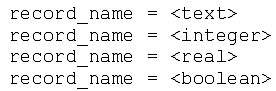

定义文件也支持数组：

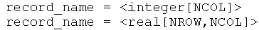

下面的命令行执行称为qtgbuilder的块，定义文件为qtg.dfn:

gridgen.exe qtgbuilder qtg.dfn

## GRIDGEN定义块

GRIDGEN_ver1.0支持的块类型如表1.不是每个例子都需要所有的块。后文详细介绍这些块。

表1 GRIDGEN ver.1.0支持的块类型

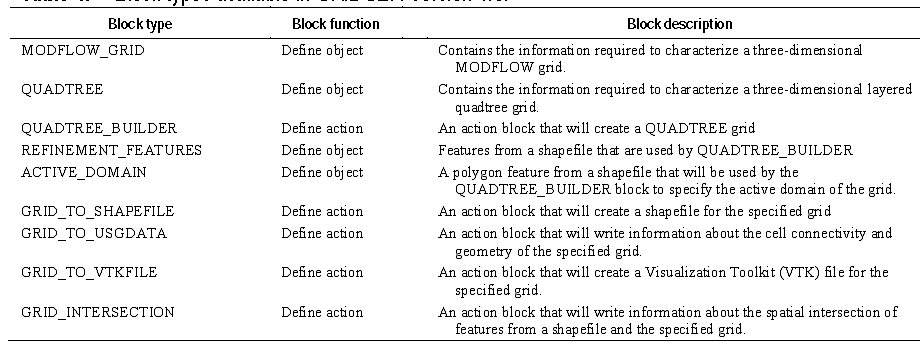

### MODFLOW_GRID

NLAY, NROW, NCOL

列间距DELR, 行间距DELC

水平面上，行自上而下增加，列从左到右增加。

层自上而下增加，顶层是layer
1，Layer1的每个单元给出顶部高程，每层的各单元给出底部高程。因此，分层厚度可变，为了表征地下水文地质单元。注意：在MODFLOW_GRID块中，仅为顶层提供顶部高程，对下面的分层，单元顶部高程等于更下面单元的底部高程。

完整的MODFLOW_GRID块描述见表2.
MODFLOW_GRID块被其他后面的处理使用，是构建分层四叉树网格的基础网格。

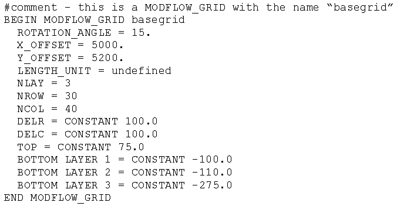

注意：DELR和DELC是1D数组和2D数组（TOP和BOTTOM），都赋给了常数值，可以是非常数的数组。

表2 MODFLOW_GRID块的记录列表

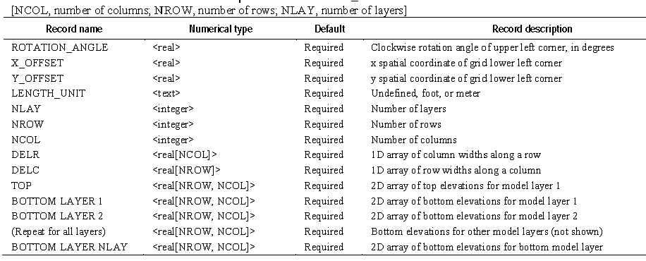

### QUADTREE

Leaves

四叉树网格的单元编号如图1，GRIDGEN可以排除括在计算区域以外的单元，这些单元都编号为-1

图1 四叉树网格

分层的四叉树网格结构的信息存储为一个树状结构文件，使用关键词STRUCTURE_FILE识别。QUADTREE_BUILDER块可用来创建树状结构文件。如图1的四叉树网格，树状文件包含以下17行：

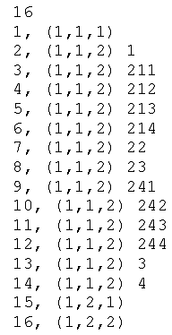

第1行：单元个数

第2\~16行：cell identifier，（层，行，列） 象限数（没有表示是basegrid）

分层四叉树网格使用QUADTREE块类型，需要MODFLOW_GRID块。

下面的定义文件描述简单的图1中的四叉树网格。

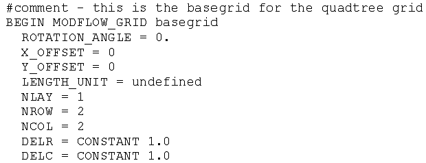

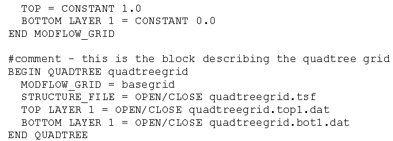

QUADTREE块也访问STRUCTURE_FILE和各分层的顶部和底部高程。各分层都需要顶部和底部高程，因为四叉树网格的各层的单元数不一样。

表3 QUADTREE块组成的记录列表

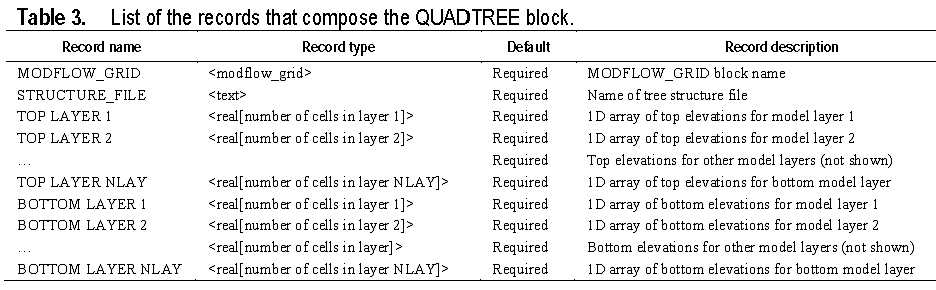

### QUADTREE_BUILDER

使用空间特征(shapefile)控制何处细化，何处单元激活，创建四叉树网格。通过创建和执行QUADTREE_BUILDER块生成四叉树网格。

使用QUADTREE_BUILDER块，大多数情况下[是第一步]{.mark}。

下面是QUADTREE_BUILDER块用于创建分层四叉树网格的例子：

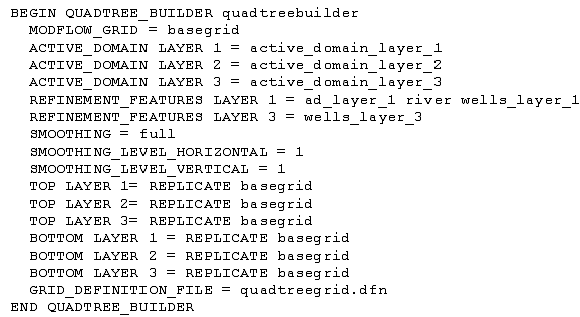

注意：MODFLOW_GRID块称为basegrid

为一个分层指定ACTIVE_DOMAIN，如果不指定，整层都是活动区域。

可选择使用REFINEMENT_FEATURES块，用于细化网格单元。不必每一层都指定REFINEMENT_FEATURES，例如上例中，layer1由3套特征细化（ad_layer_1,
river, wells_layer_1），而layer3仅由1个特征细化（wells_layer_3）。

用户可光滑细化相邻单元。上例的光滑操作应用于full网格，SMOOTHING_LEVEL_HORIZONTAL
= 1 and SMOOTHING_LEVEL_VERTICAL = 1

还有，。。。

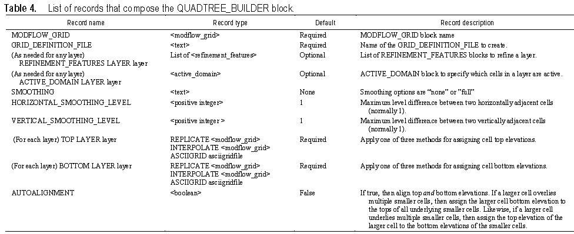

### REFINEMENT_FEATURES

为QUADTREE_BUILDER块提供点、线和多边形的特征（在REFINEMENT_FEATURES块中）。

每个特征的细化层级信息也包含在该块中。下面是QUADTREE_BUILDER块中使用的REFINEMENT_FEATURES块的例子：

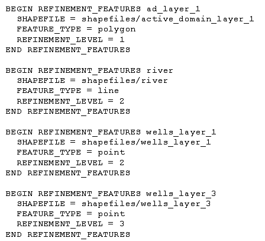

分层四叉树网格中的单元包含点，接触线，或者在多边形内，将根据定义的REFERENCE_LEVEL值细化。表5介绍了REFERENCE_FEATURES块的描述。

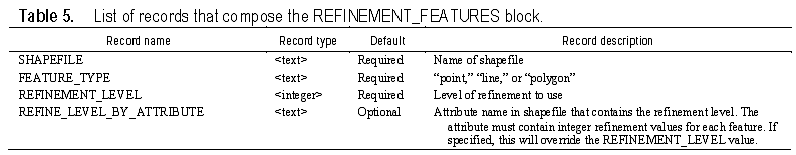

### ACTIVE_DOMAIN

在QUADTREE_BUILDER块中，还可指定ACTIVE_DOMAIN确定哪些单元是active的，激活的单元分配一个正的整型单元号。可为每层分配激活域。如果指定了激活域，仅与ACTIVE_DOMAIN特征相交的单元是激活的。

下面是ACTIVE_DOMAIN块的例子：

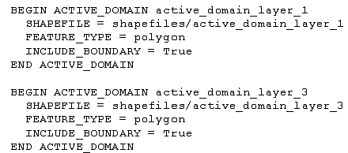

表6介绍了ACTIVE_DOMAIN块的组成记录列表信息。

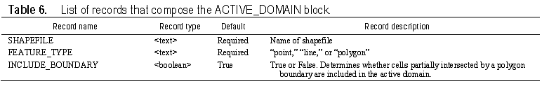

### GRID_TO_SHAPEFILE

为MODFLOW_GRID和QUADTREE块描述的网格用于创建shapefile。

多层模型，创建图示的重叠多边形。当加载shapefile可视化，有必要选择层的子集，显示有用的作图。

下面是为basegrid保存为多边形的shapefile，保存到output_shapefiles/mfgrid

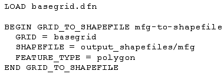

下面的例子是保存为分层四叉树网格为一套点，每个点位于网格单元中心：

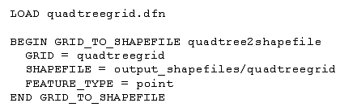

GRID_TO_SHAPEFILE块的定义如表7

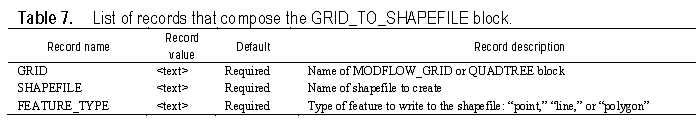

创建的shapefile的各个特征（点、线、多边形）包含若干属性，都写为shapefile。对于MODFLOW_GRID，属性为：

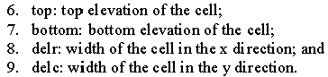

QUADTREE网格的属性与MODFLOW_GRID类似，仅分层四叉树网格的叶子保存为shapefile。主要的区别是：创建的shapefile包含一个child_location属性，是象限序列数的列表。为QUADTREE网格创建的shapefile属性有：

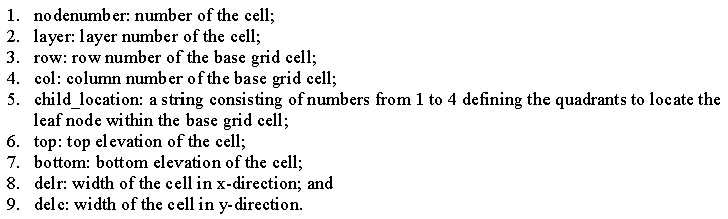

### GRID_TO_USGDATA

GRID_TO_USGDATA块创建MODFLOW-USG需要的很多离散输入数组。保存ASCII文本文件，包含关于单元和单元连接关系的几何属性信息。例子如下：

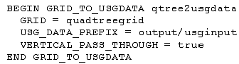

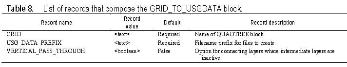

读取程序见MODFLOW-USG手册，其中有详细介绍写出到这些文件的数组的描述。

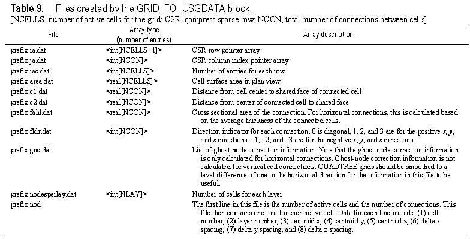

### GRID_TO_VTKFILE

GRID_TO_VTKFILE用于创建VTK文件。

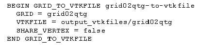

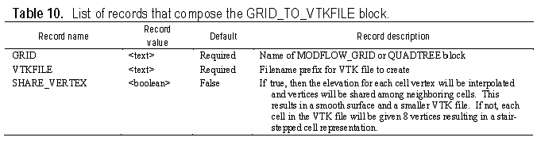

### GRID_INTERSECTION

确定水文特征与模型网格的相交特性。所有的相交子程序都是2D的，确定相交属性时不用高程信息。为每个相交需要提供分层编号。

3种特征可以与模型网格相交：点、线和多边形。计算结果保存为shapefile和一个ASCII文本文件。表11展示了GRID_INTERSECTION块的记录列表，还展示了3种不同相交（点-网格、线-网格和多边形-网格）的细节。

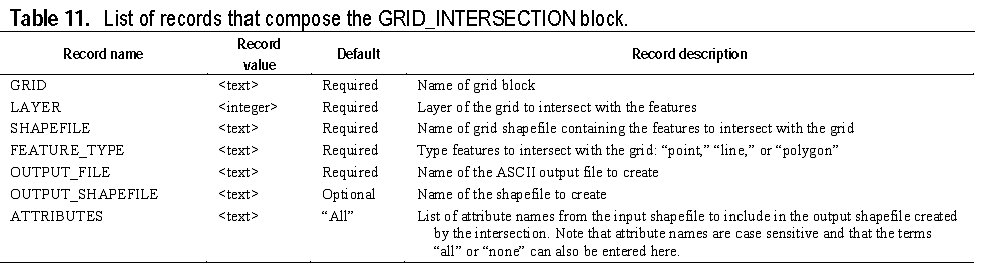

Point-GRID intersection

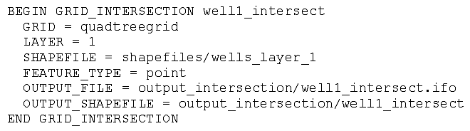

Line-Grid intersection

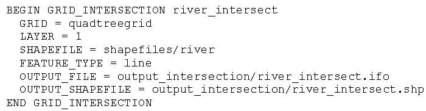

Polygon-Grid Intersection

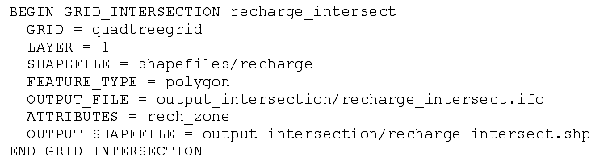

## 例子（Biscayne含水层, Florida）

需要4个步骤，每个步骤执行一个GRIDGEN行为块。

第1步：使用QUADTREE_BUILDER块创建一个分层四叉树网格。

第2步：使用GRID_TO_USGDATA写出关于网格的信息到一套文件中。

第3步：为分层四叉树网格创建点和多边形的shapefiles

第4步：分层四叉树网格与点、线和多边形shapefile相交

### 生成分层四叉树网格

使用QUADTREE_BUILDER块创建分层四叉树网格。

基础的MODFLOW_GRID由1层、100行和58列组成。

基础网格的各单元是800m边长。

QUADTREE_BUILDER块使用的空间特征包括：一个活动计算域，线表征淡水渠道，线表示海岸线的潮汐边界，井周围的多边形（图2A）。还可以使用点表示井的细化特种工，但使用多线性提供方对井周围细化范围大小的控制。这些特征使用REFINEMENT_LEVEL=4创建分层四叉树网格的单元，最小宽度50m（基础网格单元大小为800m，细化4次等于50m）。创建的分层四叉树网格见图2B。

### 输出网格信息

使用GRID_TO_USGDATA输出单元连接关系和网格的其他信息到ASCII文件。定义文件（action02_writeusgdata.dfn）包含如下几行：

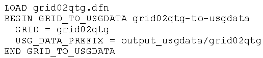

执行命令：

gridgen.exe grid02qtg-to-usgdata action02_writeusgdata.dfn

将在output_usgdata文件夹下生成12个文件。这些文件包含的信息见表9的介绍。

### 创建网格的shapefiles

使用GRID_TO_HSAPEFILE块为分层四叉树网格创建点和多边形shapefile，定义文件（action03_shapefile.dfn）包含如下几行：

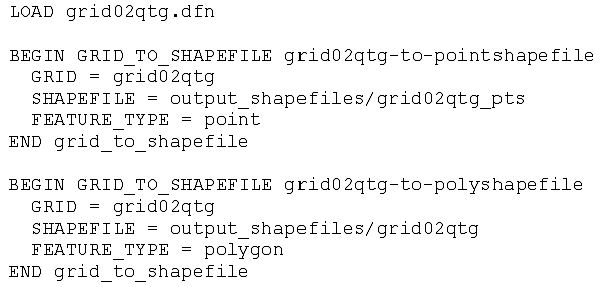

输出shapefile到文件夹output_shapefiles，使用如下命令：

gridgen.exe grid02qtg-to-pointshapefile action03_shapefile.dfn

和

gridgen.exe grid02qtg-to-polyshapefile action03_shapefile.dfn

### 切割网格

使用shapefiles中包含的空间特征风格分层四叉树网格。风格网格的定义文件有几个不同的shapefiles
(action04_intersect.dfn)，包含如下几行：

GRID_INTERSECTION块的各个块需要独立执行GRIDGEN。执行第1个块（称为canal_grid02qtg_lay1_intersect），执行如下命令：

canal_grid02qtg_lay1_intersect action04_intersect.dfn

剩下的切割块使用对应的名称单独执行类似的命令。