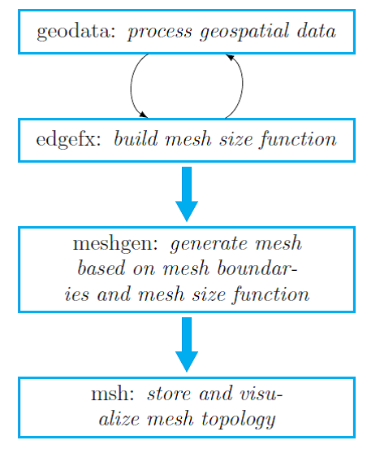
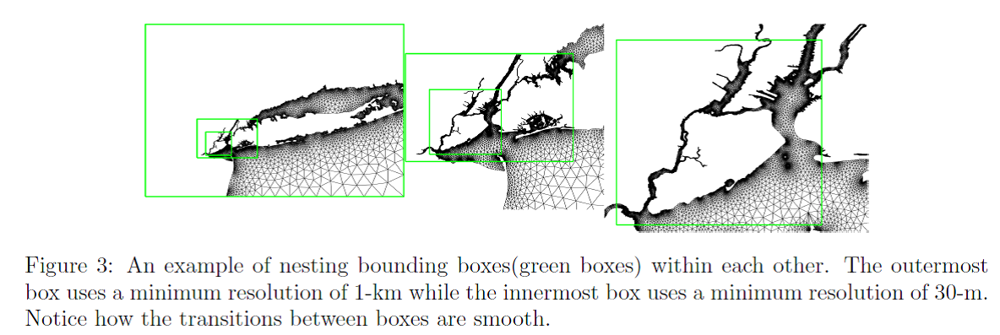
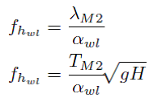
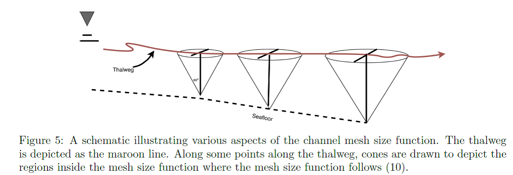

# OceanMesh2D网格生成软件

# 1简介

OceanMesh2D是MATLAB程序，用于生成和编辑2D三角形网格，主要是针对近海区域的有限单元模型。基于用户定义的(网格单元)边长函数(edgelength
function)控制模拟区域的网格分辨率，生成网格规模可达10-20百万节点数量级。

三角网格生成方法见[文献Koko(2015)]{.mark}和改进的平衡力算法的DistMesh程序(Persson and Strang, 2004)。
OceanMesh2D程序的网格生成是独立的类，仅需要设置多边形区域和目标分辨率（网格单元边长），类似DistMesh，但与DistMesh相比，OceanMesh2D的网格生成器的类对于复杂多边形区域以及在浅水水动力模拟中经常遇到的高度变化的网格单元变长的情况，收敛更快。

网格生成算法中，网格单元变长和网格数量函数决定了模拟区域的网格分辨率。关于网格生成的文献很多，但关于网格分辨率如何影响浅水模拟的研究仍然较少。OceanMesh2D将通过实施网格单元变长函数生成网格，更能有效地和准确地模拟浅水流动现象。

OceanMesh2D基于对象编程(Object oriented
programming)风格，通过抽象(abstraction)和重载(overloading)使生成网格过程变得简单。这些特性简化了函数调用的复杂性和需要输入命令的行数，并使操作过程连贯，增强了可重复性。

共有4个类：geodata, msh, meshgen, edgefx。



图1 网格生成流程

需要：

-   MATLAB(2015a版本以上), m_map toolbox v1.4, MEX compiler

-   可选: digital elevation model (DEM).

-   可选: a shapefile representing the boundary of the area you want to
    mesh.

The m_map package must be placed within the working directory, we
suggest the utilities directory.

安装步骤：

\(1\) 解压缩OceanMesh2D/

\(2\) 下载m_map，并放于根路径；

\(3\) 创建路径OceanMesh2D/datasets，放置地理数据(ESRI shapfiles, DEM)；

\(4\)
添加OceanMesh2D/utilities以及OceanMesh2D/datasets路径到MATLAT路径，例如：addpath(genpath(\'datasets\'/))

# 2、网格属性

有效网格需满足下面4个属性：


有效的网格并不一定是高质量的，高质量网格：


OceanMesh2D创建点集的Delaunay三角化，迭代计算直到生成满意质量的三角网格。

注意：等边三角形的高质量网格可能导致网格数很大，这对于SCHISM模型未必是"好网格"，但对于FVCOM这样对网格质量要求较高的模型很好。

评价网格等边性的公式(Bank, 1998):


式中，*A~E~*为单元面积，(*λ~E~*)*~i~*为单元的第*i*条边的长度。

OceanMesh2D可生成空网格：m = msh()；或生成ADCIRC模型的各种文件：

m = msh(\'fname\',\'type\'), type为13, 14,
15或24，代表不同的ADCIRC输入文件(fort.13, fort.14, fort.15, fort.24,
etc.)。fort.14即为SCHISM模型的hgrid.gr3文件。

# 3、划分区域

使用矩形盒子(bbox)定义区域和网格间距*h~0~*（平面，米）划分网格，*h~0~*表示最小网格间距或网格单元变长。




*x,
y*为矩形框左上角和右下角的经纬度坐标(WGS1984)，圈定盒子可以是嵌套任意次数。基于球坐标系统生成的网格时高度各向同性的，在投影平面坐标系下可能出现扭曲。

# 4、DEM

DEM为结构网格数据，包含*x,y,z*数据，高于MSL为陆地地形，低于MSL为海洋地形（基于平均潮汐平面或大地水准面）。

当使用波长、坡度、河道、CFL时的变长函数时，需要输入DEM，DEM数据需要时WGS84和NetCDF格式。

DEM传给相同的geodata，用于处理shapefiles：


可视化DEM：


# 5、网格边界

使用polygon或polyline，定义海岸线、岛屿和近海岸地貌。

可使用ArcGIS软件获得等高线的shapefile，然后将shapefile的文件名、最小分辨率/变长（单位：米）传给geodata类和bbox:


可视化shapefile:


# 6、Edgelength functions

所有的edgelength functions封装在edgefx类中。

## 6.1 网格尺寸边界

最小和最大网格尺寸边界设置：


控制近海岸的最大网格单元尺寸（单位：米）：


如果提供DEM，可定义任意范围水深(m)内的最大网格单元尺寸：


其中，陆地以上最大网格尺寸为250m，0\~-10m以内设置为50m。

## 6.2 网格限制条件

## 6.3 Distance mesh size function

该功能用于分配网格分辨率，按距某一边界（如海岸线）的距离按比例分配。例如：海洋模拟中，离海岸线越近的网格分辨率越高。另外，一些受风暴潮影响的人工建筑附近也要加密网格。因此，OceanMesh2D提供了2种功能：

1\. Linear distance function (dis):

2\. Feature Size (fs):

## 6.4 Wavelength mesh size function

尽可能减少网格单元数的情况下，精确地模拟主要潮汐成分(M2, K1,
etc.)，以避免空间上的潮汐波混淆误差 (Westerink et al.,
1992)。例如，为表征网格中能量最大的半日潮成分(如M2)，可采用浅水波理论计算其波长，以确保每个M2潮汐波长有足够多的网格单元：




## 6.5 Slope mesh size function

大陆架边缘、海底隆起和海沟等坡度较大的区域需要加密网格。这些地貌特征对近海模型捕捉耗散（由于深海内波）和反射效应（由于大陆架断裂）对潮汐、涌浪和trapped
shelf waves很重要。坡度比尺参数（或称之为地形长度尺度）可采用下式计算：


使用坡度边长函数：


## 6.6 Polyline mesh size function

在近海区域和大陆架区域，经常存在挖掘的航道、水下河流流域和其他的近海岸地貌形态，需要加密网格来捕捉。沿着航道，由于相对周围区域的水深增大，局部的底部摩擦减小，这将增大沿着航道中心线的流速，稀疏的网格分辨率会混淆(alias)这些过程。当风暴潮发生时，河口区域是洪水发生的第一站，因此也需要增加网格分辨率来求解这些局部过程，以正确捕捉洪水淹没形态。

河网可以使用GIS软件（ArcGIS, QGIS等）计算得到，河道的edge
function通过创建每个点的圆形区域内定义，假设河道断面为V字形、水深和坡度为60°来定义圆形区域。在每个点周围的网格分辨率基于下式计算：


式中，b为基准面一下的水深(m)。用户需要定义(该参数决定河道附近随水深变化的网格分辨率变化尺度)以及河道点的cell
array：


用户可以控制河道附近网格的最小尺寸：\'min_el_ch\', 150



# 7、网格的稳定性和有效性

## 7.1 网格坡度缓和(Grading)

保证网格尺寸的光滑过度，两点之间的网格尺寸增加由下式约束：


该功能是为了避免网格分辨率变化梯度较大的区域产生的歪斜单元(highly skewed
element)导致的数值计算误差。（SCHISM模型却不忌讳歪斜单元）。具体算法可参考文献：Persson(2006)
，Engwirda(2014)

实施方法：


一般设置就能生成好的结果。

## 7.2 CFL limiting

在近海岸条件下，可自动选择一个合适的计算时间步长*Δt*满足CFL限制条件，即*Δt*满足式(12)来限制*f~h~*。这一算法由下式计算：


式中，*f~E~*是单元尺寸，为三角形单元外接圆的直径；*H*为水深。

自动进行*dt*的CFL限制：


## 7.3 Ensuring Mesh Validity

使用msh.build检查生成网格的有效性。

# 参考文献
```
[1] - Roberts, K. J., Pringle, W. J., and Westerink, J. J., 2019. OceanMesh2D 1.0: MATLAB-based software for two-dimensional unstructured mesh generation in coastal ocean modeling, Geoscientific Model Development, 12, 1847-1868. https://doi.org/10.5194/gmd-12-1847-2019.
[2] - Roberts, K. J., Pringle, W. J, 2018. OceanMesh2D: User guide - Precise distance-based two-dimensional automated mesh generation toolbox intended for coastal cean/shallow water. https://doi.org/10.13140/RG.2.2.21840.61446/2.
[3] - Roberts, Keith J. Unstructured Mesh Generation and Dynamic Load Balancing for Coastal Ocean Hydrodynamic Simulation, 2019. PhD Thesis, University of Notre Dame. https://curate.nd.edu/show/4q77fr0022c.
[4] - Roberts, Keith J., Pringle W.J., Westerink J. J. Contreras, M.T., Wirasaet, D., 2019. On the automatic and a priori design of unstructured mesh resolution for coastal ocean circulation models, Ocean Modelling, 144, 101509. https://doi.org/10.1016/j.ocemod.2019.101509.
[5] - Pringle, W. J., Wirasaet, D., Roberts, K. J., and Westerink, J. J., 2021. Global Storm Tide Modeling with ADCIRC v55: Unstructured Mesh Design and Performance, Geoscientific Model Development, 14(2), 1125-1145. https://doi.org/10.5194/gmd-14-1125-2021.
```
