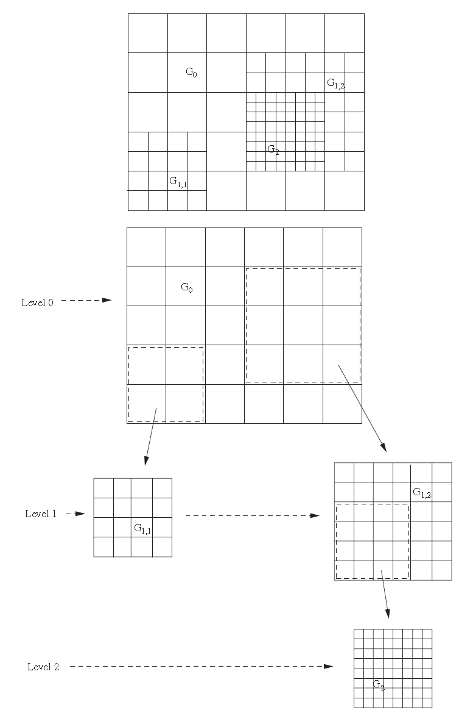

# AMR研究文献分类及阅读记录

## AMR简介

CFD使用的AMR技术可分为[3类]{.mark}(Tang Tao)：

-   h-方法：基于先验的的误差评估或误差指标，实施自动化的空间网格的细化或粗化。该方法包含2个独立的部分：求解算法和网格选择算法。

-   p-方法：自适应提高多项式的阶数。通常用于间断Galerkin有限单元模型中。

-   r-方法：也称之为移动网格方法(moving mesh method,
    MMM)，该方法重新布置网格的节点，但不改变节点的固定数目，使网格在数值解快速变化的区域加密。该方法常用于流固耦合问题（FSI）中界面追踪，如船舶工程。

自适应网格加密技术（AMR）一般采用各向异性自适应(anisotropic adaptivity,
C. Pain, 2001)、p加密和h加密。

实施AMR的软件众多，例如PARAMESH, Chombo, deal.II, AMRClaw。

[H-自适应又可分为3类(]{.mark}Andrew and Lilia, 2019[)：]{.mark}

-   patch-based网格细化

-   block-based网格细化

-   cell-based网格细化

patch-based网格细化，或称为[component
grids]{.mark}，就是逐步细化笛卡尔网格，直到获得期望的精度，如图1(b)，子网格与相互之间通信，使用局部时间步长在时间层推进计算。

block-based网格细化，预定义一些网格单元，分组为[blocks]{.mark}。在单元的blocks上执行网格细化和粗化操作，而不是单个的网格单元（图1(c)）。仅需要给出[block间]{.mark}的连接关系。block-based
AMR类似于气象模型中常用的嵌套网格(nested
grid)，便于并行化。如果一个网格节点/单元需要细化，整个block的分辨率都要提高（网格细化）。

cell-based网格细化，单元相互之间是独立细化的，相比block-based网格细化，cell-based细化要求更多的连接关系数据（图1(d)）。通常粗化和细化单元的父-子关系组织为quadtree或octree数据结构（分别对于2D和3D情况）。该方法的优势是：对于预设的误差水平，需要较少的单元数，这很适合于非结构网格。三角形非结构网格上的h自适应网格见图2.

{width="5.298033683289589in"
height="2.052782152230971in"}

图1 规则网格上的patch-, block-, cell-based网格细化策略

{width="5.442852143482065in"
height="2.829012467191601in"}

图2 三角形非结构网格上实施的cell-based网格细化

### 参考文献 {#参考文献 .标题3}

Giuliani Andrew; Krivodonova Lilia: Adaptive mesh refinement on graphics
processing units for applications in gas dynamics (2019)

Habashi, W. G., Dompierre, J., Bourgault Y., Ait-Ali-Yahia, D., Fortin,
M. and Vallet, M-G., 2000, Anisotropic Mesh Adaptation: Towards
User-Independent, Mesh-Independent and Solver-Independent CFD Solutions:
Part I: General Principles, International Journal for Numerical Methods
in Fluids, 32 (6), p. 725-744.

C. Pain, A. Umpleby, C. De Oliveira, and A. Goddard, \\Tetrahedral mesh
optimisation and adaptivity for steady-state and transient \_nite
element calculations,\" Computer Methods in Applied Mechanics and
Engineering, vol. 190, no. 29-30, 3771-3796, 2001.

## AMR相关软件分类

目前已有很多降低AMR数据管理难度的程序，如Behrens et al., 2005; Burstedde
et al., 2011; Adams et al., 2015。

下面根据AMR分类对程序库进行整理。

### Patch-based AMR {#patch-based-amr .标题3}

最早地，Berger and Oliger
(1984)建立的[分层级结构化网格方法]{.mark}（称之为[BOSAMR]{.mark}方法），就是patch-based
AMR，这种AMR对需要网格细化的patch很灵活，如图3.

{width="2.7800765529308835in"
height="3.7490529308836393in"}

图3 Patch-based AMR分级网格示意图(From AGRIF)

-   [GeoClaw(Berger et al.,
    > 2011)]{.mark}，是基于AMRClaw程序的可模拟地球流体力学现象的FORTRAN程序，有源码。AMR的GeoClaw已经基于CUDA实现了异构并行(Qin
    > et al., 2019)。Mandli and Dawson
    > (2014)使用AMR的GeoClaw模拟了风暴潮淹没过程，并与静态网格的ADCIRC模拟结果做了对比。

-   SAMRAI (Wissink et al., 2001)：Patch-based Structured
    > AMR，面向对象C++编程，structured adaptive mesh refinement
    > (SAMR)，Lawrence Livermore National Laboratory开发。

-   AGRIF ()，tree-based, FORTRAN 90编程，已用于ROMS模型。法国人开发

### 参考文献 {#参考文献-1 .标题3}

M.J. Berger, J. Oliger, Adaptive mesh refinement for shock
hydrodynamics, J. Comput. Phys. 53 (1984) 484-512.

Marsha J. Berger, David L. George, Randall J. LeVeque, Kyle T. Mandli.
The GeoClaw software for depth-averaged flows with adaptive refinement.
Advances in Water Resources 34 (2011) 1195-1206.

Qin, X., LeVeque, R. J., Motley, M. R. (2019). Accelerating an adaptive
mesh refinement code for depth-averaged flows using GPUs. Journal of
Advances in Modeling Earth Systems, 11. <https://doi.org/10.1029/>
2019MS001635

Kyle T. Mandli, Clint N. Dawson. Adaptive Mesh Refinement for Storm
Surge. 2014.

Wissink, A. M., R. D. Hornung, S. R. Kohn. S. S. Smith, and N. S.
Elliott, \"Large Scale Structured AMR Calculations Using the SAMRAI
Framework\", SC01 Proceedings, Denver, CO, Nov. 10-16, 2001. Also
available as LLNL technical report UCRL-JC-144755.

Laurent Debreu, Eric Blayo. AGRIF: Adaptive Grid Refinement In Fortran.
\[Research Report\] RT-0262, INRIA. 2002, pp.16. inria-00069912

### Block-based AMR {#block-based-amr .标题3}

-   ENZO，主要用于[天文领域]{.mark}的模拟。Brummel-Smith et al., (2019)

-   Chombo，并行化的AMR库，C++语言，基于此建立了非静水压力的斜压海洋模型[Somar
    (Santilli, 2015)]{.mark}。Lawrence Berkeley National
    Laboratory开发。

-   SOMAR [(Santilli, 2015)]{.mark}，基于AMR求解NS方程，很好地求解Lock
    Exchange问题。

### 参考文献 {#参考文献-2 .标题3}

Brummel-Smith et al., (2019). ENZO: An Adaptive Mesh Refinement Code for
Astrophysics (Version 2.6). Journal of Open Source Software, 4(42),
1636.

E Santilli, A Scotti. The Stratified Ocean Model with Adaptive
Refinement (SOMAR). Ocean Modelling, 2015

### Cell-based (Tree-based) AMR {#cell-based-tree-based-amr .标题3}

Cell-based AMR，也称之为tree-based
AMR（通常在结构网格的情况下）。Cell-based
AMR可拓展至一般性的非结构网格。这是最灵活的一种AMR，无需细化不必要的单元，在网格的单元数方面更有效。

{width="4.533781714785651in"
height="4.235048118985127in"}

图4 Tree-based离散和对应的树状数据结构示意图（From PARAMESH）

基于[四叉树/八叉树]{.mark}AMR技术的程序，如：

-   Gerris (Popinet, 2003; 2006)

-   QTAdaptive，串行的开源FORTRAN程序，在洪水模拟的应用见[Liang et al.
    (2009)]{.mark}。

-   PARAMESH (Olsona, 2005), FORTRAN 90，cell-based AMR，开源代码

-   p4est (Burstedde et al., 2011), Forest of
    trees，C++编程。已有ForestCLAW和FORTRAN/Python wrapper程序

> 基于SFC的非结构网格AMR库：

-   amotos，FORTRAN
    90编程，串行，间断Galerkin算法的风暴潮/洪水淹没模拟。

-   sam(oa)^2^，FORTRAN 90编程，OpenMP/MPI并行化

-   Sierip_Project, 完美融合AMR, OpenGL, HPC,
    DG等于一身的C++模型，可模拟实际地形下的海啸淹没过程。

-   PRAGMATIC,
    C++语言编程，是一个并行化的非结构网格AMR程序库，主要是嵌入到Firedrake项目。也可自己开发相应的AMR模型。支持C/FORTRAN编程。

### 参考文献 {#参考文献-3 .标题3}

Stephane Popinet. Gerris: a tree-based adaptive solver for the
incompressible Euler equations in complex geometries. Journal of
Computational Physics 190 (2003) 572-600

Stephane Popinet, Graham Rickard. A tree-based solver for adaptive ocean
modelling. Ocean Modelling, 2006, xxx

Liang Qiuhua and Alistair G.L. Borthwick. Adaptive quadtree simulation
of shallow flows with wet-dry fronts over complex topography. Computers
& Fluids 38 (2009) 221-234

Burstedde C., L. C. Wilcox, O. Ghattas, 2011: p4est: Scalable algorithms
for parallel adaptive mesh refinement on forests of octrees. SIAM
Journal on Scientific Computing, 33 (3), 1103-1133.

Kevin Olsona. PARAMESH: A Parallel, Adaptive Grid Tool. Parallel
Computational Fluid Dynamics 2005, Theory and Applications. 2006,
341-348

## 并行化的h自适应网格加密程序

-   PLTMG (Bank,
    > 1994)，一个MPI并行化的AMR库，求解椭圆型方程，FORTRAN语言，有源码。

-   PTETRAD (SELWOOD, 1999), 是对TETRAD(SPEARES,
    > 1997)的并行化，四面体h自适应网格加密程序，C语言，未见源码。

通常，AMR执行后，需要动态平衡荷载，一般可使用Zoltan, ParMETIS,
SCOTCH等区域分解程序库。此类的程序库有：

-   RefficientLib (Joan Baiges and Camilo Bayona,
    > 2017)，未开源的FORTRAN程序。

-   PYRAMID (Norton et al.,
    > 2002)，加州理工JPL开发的AMR，FORTRAN程序，开源，但找不到下载源了。

-   Fluidity，基于ani2d和Zoltan的复杂AMR的海洋动力学模型，Pain
    > (UK)课题组开发，开源的FORTRAN程序。

-   sierpi_Project, 德国人Martin
    > Schreiber开发的，交互式可视化，OpenGL，并行化AMR的海啸模拟程序，开源代码。

-   omega_h

-   girdap-master，基于贴体结构网格的并行AMR，求解不可压缩NS方程。

-   amotos

-   sam(oa)^2^

-   PRAGMATIC

### 参考文献 {#参考文献-4 .标题3}

R. E. Bank, PLTMG: A Software Package for Solving Elliptic Partial
Differential Equations: User\'s Guide 7.0, SIAM, Philadelphia, PA, 1994.

P. M. SELWOOD AND M. BERZINS. Parallel unstructured tetrahedral mesh
adaptation: algorithms, implementation and scalability. Concurrency:
Pract. Exper., Vol. **11**(14), 863-884 (1999)

W. SPEARES AND M. BERZINS. A 3d unstructured mesh adaptation algorithm
for time-dependent shock-dominated problems. International journal for
numerical methods in fluids, vol. 25, 81-104 (1997)

Joan Baiges and Camilo Bayona. RefficientLib: An efficient
load-rebalanced adaptive mesh refinement algorithm for high performance
computational physics meshes. 2017

C. D. Norton and T. A. Cwik, "Parallel Unstructured AMR and Gigabit
Networking for Beowulf-Class Clusters," Lecture Notes in Computer
Science, vol. 2328, 2002.

## CUDA AMR

大量的AMR库是基于CPU，较少用在GPU上，原因是AMR的数据结。一些基于CPU的AMR库，如Enzo,
Cactus, SAMRAI都拓展至GPU，但主要都是测试目的。

-   Wang et al
    (2010)首次将AMR求解器迁移到GPU，是基于ENZO水动力模型，采用block-structured
    AMR。[Experimental]{.mark}

-   CLAMR(Nicholaeff et al.,
    2012)也测试了使用MPI与OpenCL的并行模式加速求解浅水方程。Cell-based
    AMR Miniapp,
    LANL开发。OpenGL，目前仅能细化，没有粗化过程。边界条件也有待完善。

-   Sætra et al., 2014首次采用Block-based (or tile-based in 2D case)
    AMR的CUDA加速洪水模型，采用2阶精度的Kurganov-Petrova格式。本文也介绍了几种基于GPU加速的AMR模型。C++编程。挪威人。

-   gamer2 (Schive et al., 2010)，Patch-based
    AMR，主要用于[天文模拟]{.mark}，但也包含水动力计算的模块（试运行，尚不具备浅水方程求解的功能）。

-   GeoClaw(Berger et al., 2011)，基于patch-based AMR的CUDA
    FORTRAN程序(Qin et al., 2019)，是可以实际应用的模型。LeVeque

-   采用BUQ (Block Uniform Quadtree) AMR的CUDA加速(Vacondio et al.,
    2014)。意大利人。

-   Daino (Mohamed Wahib et al., 2016)，Octree-based AMR,
    日本人开发的GPU加速的AMR求解器，C++，其中有求解Hydro的模块（目前还不是浅水方程，是Euler方程的shock问题）。日本人。

总结：CUDA加速的AMR技术，涉及较复杂的适于GPU架构的数据结构。目前，已有很多程序进入这个领域，例如gamer2，CLAMR，Daino等，但大多都是测试一些基本的水动力现象，不能实际求解SWE。目前能较好地求解SWE的程序是GeoClaw-AMR,
BUQ-AMR, [Daino(实施SWE求解的最佳库，关注一下)]{.mark}。

### 参考文献 {#参考文献-5 .标题3}

Wang, P., Abel, T., Kaehler, R. 2010 Adaptive mesh fluid simulations on
GPU. New Astron. 15(7), 581-589

C. Gheller, P. Wang, F. Vazza, and R. Teyssier, Numerical Cosmology on
the GPU with Enzo and Ramses. Journal of Physics: Conference Series,
2015.640(1): 12-58.

D. Beckingsale, W. Gaudin, A. Herdman, and S. Jarvis, "Resident
Block-Structured Adaptive Mesh Refinement on Thousands of Graphics
Processing Units," in Parallel Processing (ICPP), 2015 44th
International Conference on, 2015, pp. 61-70. [（GPU SAMARI）]{.mark}

Sætra M.L., Brodtkorb A.R., Lie K, A., 2014. Efficient
GPU-implementation of adaptive mesh refinement for the shallow-water
equations. J. Sci. Comp. 63 (1), 23-48.

Vacondio, R., Dal Palù, A., Mignosa, P. (2014). GPU-enhanced finite
volume shallow water solver for fast flood simulations. Environmental
Modelling & Software, 57, 60-75. [BUQ-tree]{.mark}

Schive, H.Y., Tsai, Y.C., Chiueh, T.: GAMER: a graphic processing unit
accelerated adaptive-meshrefinement code for astrophysics. Astrophys. J.
Suppl. Ser. 186(2), 457-484 (2010). [GAMER]{.mark}

S. G. Parker, A Component-based Architecture for Parallel Multiphysics
PDE Simulation, Future Gener. Comput. Syst., vol. 22, no. 1-2, pp.
204-216, Jan. 2006.

Q. Meng, A. Humphrey, and M. Berzins, "The [Uintah Framework:]{.mark} A
Unified Heterogeneous Task Scheduling and Runtime System," in High
Performance Computing, Networking, Storage and Analysis (SCC), 2012 SC
Companion:, Nov 2012, pp. 2441-2448.

Nicholaeff, D., Davis, N., Trujillo, D., Robey, R.W.: Cell-based
adaptive mesh refinement implemented with general purpose graphics
processing units. Technical report, LosAlamos National Laboratory (2012)
[CLAMR]{.mark}

Mohamed Wahib, Naoya Maruyama, Takayuki Aoki, Daino: A High-level
Framework for Parallel and Efficient AMR on GPUs. SC16, 2016
[Diano]{.mark}

## Firedrake的自适应模块

基于Firedrake的Python程序的自适应技术。

求解近海岸动力学模型Thetis，构建于Firedrake之上，可使用PETSc代码自动生成的Python语言求解FEM问题。

[目前仅支持]{.mark}：浅水方程，标量输移（保守或非保守标量），泥沙输移和Exner方程。

各向异性网格自适应基于Riemann Metric Field，使用PRAgMatic程序。

This is research of the Applied Modelling and Computation Group
([AMCG](http://www.imperial.ac.uk/earth-science/research/research-groups/amcg/))
at Imperial College London.

### 参考文献 {#参考文献-6 .标题3}

J. G. Wallwork, Mesh Adaptation and Adjoint Methods for Finite Element
Coastal Ocean Modelling. PhD thesis, Imperial College London (2021).

J. G. Wallwork, N. Barral, D. A. Ham, M. D. Piggott, Goal-Oriented Error
Estimation and Mesh Adaptation for Tracer Transport Modelling. Submitted
to Computer Aided Design (2021).

M. C. A. Clare, J. G. Wallwork, S. C. Kramer, H. Weller, C. J. Cotter,
M. D. Piggott. Multi-scale hydro-morphodynamic modelling using mesh
movement methods. Submitted to International Journal on Geomathematics.

J. G. Wallwork, N. Barral, S. C. Kramer, D. A. Ham, M. D. Piggott.
Goal-Oriented Error Estimation and Mesh Adaptation for Shallow Water
Modelling. Springer Nature Applied Sciences, volume 2, pp.1053\--1063
(2020).

J. G. Wallwork, N. Barral, D. A. Ham, M. D. Piggott. Anisotropic
Goal-Oriented Mesh Adaptation in Firedrake. In: 28th International
Meshing Roundtable, pp.83-100, (2020).
