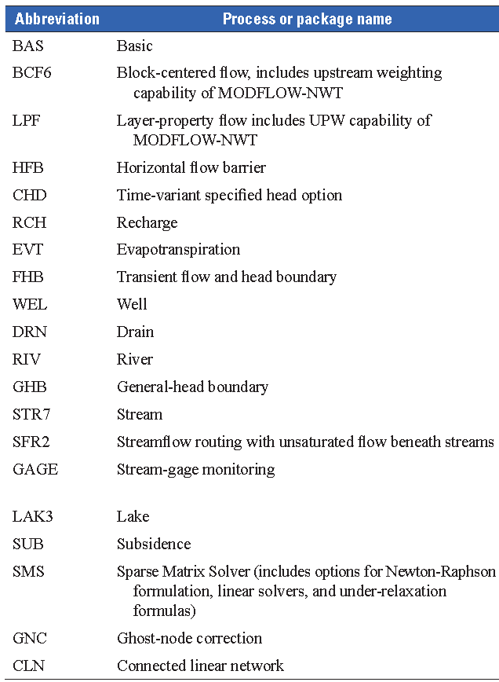
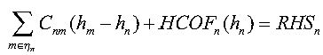
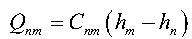
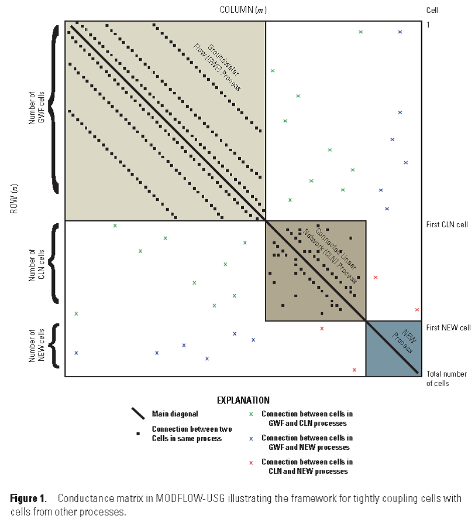
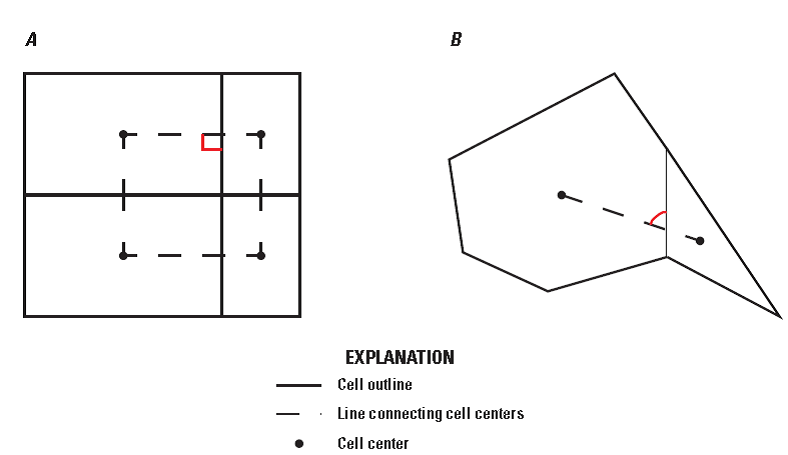
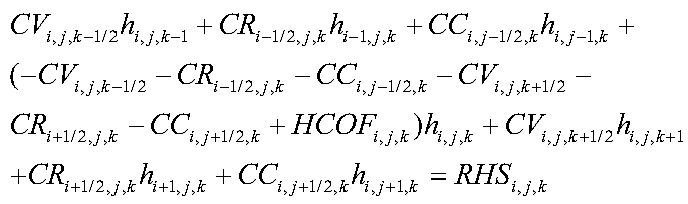
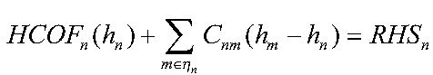
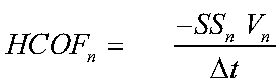
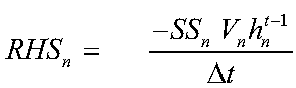
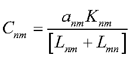

# MODFLOW-USG的基本原理

## 摘要

MODFLOW-USG: Unstructured Grid，支持结构网格与非结构网格，包括：nested
grid以及基于棱柱三角形、四边形、六边形和其他单元形状的网格。

网格设计的灵活性可用来着重沿着河流和井周围的分辨率，或者离散个别层更好地表征水文底层单元。

MODFLOW-USG基于control volume finite difference
(CVFD)离散，一个单元可以与任意个数相邻单元连接。

为改善不规则网格几何体或嵌套网格的CVFD离散精度，研发了一个通用的Ghost
Node Correction (GNC) Package，GNC使用相邻连接单元间计算水头做插值。

MODFLOW-USG包括GWF Process，基于MODFLOW-2005的GWF
Process，以及一个新的Connected Linear Network (CLN)
Process模拟多井、喀斯特涵洞和tile drain的多节点的影响。CLN Process与GWF
Process紧密耦合，2个过程的方程都离散到一个矩阵方程，同时求解。使用非结构矩阵的非结构网格和求解方法增强了健壮性。

MODFLOW-USG也包含一个可选择性的基于MODFLOW-NWT的Newton-Raphson方程，来改善数值求解的收敛性，避免单元的干湿变化引起的问题。

MODFLOW-USG使用专门的Sparse Matrix Solver (SMS) Package求解器，SMS
Package提供几种求解非线性，以及多个对称和不对称线性解方法，分别求解流体方程和Newton-Raphson方程引出的矩阵。

## 引言

使用嵌套网格的MODFLOW，one-way coupling，增加目标区域的分辨率，Mehl and
Hill (2002, 2004, and 2005)引入Local Grid Refinement
(LGR)功能到MODFLOW-2005。MODFLOW-LGR迭代求解parent和child网格上的地下水方程直到获得所有网格收敛的数值解。Schaars
and Kamps
(2001)使用单个的矩阵求解，而不是网格间的迭代求解方法的MODFLOW-LGR。

MODFLOW-USG将CVFD离散方法引入MODFLOW-2005框架，与TOUGH2类似。基于非结构网格，允许用户设计灵活的网格，贴近含水层边界，可对感兴趣的区域局部加密。

与MODFLOW-LGR不同，MODFLOW-USG在简单的嵌套网格连接上使用全隐式求解地下水流。MODFLOW-USG网格可以是矩形的有限差分网格、任意数目的嵌套矩形网格的联合或由三角形、六边形或不规则形状的联合。当使用嵌套的矩形网格时，MODFLOW-USG与Schaars
and Kamps
(2001)的方法类似，可以加速求解，且容易支持不同嵌套层网格间功能模块的水流移动，如Stream
Flow Routing (SFR) Package。

有限差分法求解GWF过程，将生成固定模式的非零元素的矩阵方程组。3D结构网格时，将生成7点连接的模式；非结构网格时，产生的非零矩阵连接不是固定模式的。另外，矩阵可扩展至包含其他水流过程，例如CLN过程，求解连接的线性网络，表征喀斯特导水管、地下挖掘（隧道）、农业排水沟网或井。

处理不对称矩阵的选择考虑Newton-Raphson方程，以及全隐式的GNC Package。

## 报告的目的与范围

（1）介绍在非结构网格上实施CVFD方法；

（2）介绍程序的设计与实施细节；

（3）提供设计和运行MODFLOW-USG的指导；

（4）展示几个测试用例。

不包括输入的命令介绍，在网上的发布版源码包中介绍。

读者应熟悉MODFLOW-2005的基本概念。还要学习在MODFLOW-USG中考虑的软件和过程。例如，MODFLOW-USG的Lake模块，可参考Merritt
and Konikow, 2000的手册介绍。

Merritt, M.L., and Konikow, L.F., 2000, Documentation of a computer
program to simulate lake-aquifer interaction usingthe MODFLOW
ground-water flow model and the MOC3D solute-transport model: U.S.
Geological Survey Water-Resources Investigations Report 00--4167, 146 p.

## MODFLOW-USG概览

MODFLOW-USG可以模拟已有的MODFLOW-2005的数据集，求解器换做SMS软件。

USG可以使用其他形式的单元形状。USG要求垂向上使用棱柱体。单元还可分组为分层，便于处理，还可使用sublayering进一步分解单元。

使用非结构网格数据集时，USG使用节点数代替layer, row, column

USG施加水文stress到各单元，与MODFLOW是一致的。

USG需要用户指定单元连接关系，采用2种形式的数组：第1种数组包含各单元的连接（单元）编号；第2种数组包含各单元的连接节点编号列表。

USG使用SMS软件求解方程组，[xMD]{.mark}求解不对称稀疏矩阵；非结构PCG求解对称方程组；SMS软件关系非线性外部循环可使用Picard迭代或NWT，实施欠松弛和残差控制。

[CLN过程]{.mark}1D地表征含水层中的井、排水管或导管系统（如Karst导管或地下开挖）。CLN软件重复了Conduit
Flow Process和Multi-Node Well
(MNW)软件的部分功能，这两个软件没有包含在USG中。CLN节点全隐式求解，以与GWF方程一样的矩阵求解改善收敛性。

2单元中心连线应该与公共边以正确角度相交，但不规则多边形或嵌套网格，不满足此条件，会引入水头计算误差。USG包含一个GNC模块降低此误差。GNC模块是可选的，因为使用规则网格、等边三角形网格时不需要校正。GNC软件以隐格式求解，因此仅校正部分矩阵数值解。还有在右手边更新GNC项的选择，因此可使用对称的线性求解器来求解。有一个使用[嵌套网格]{.mark}的测试用例展示GNC软件的功能。

## Ver 1USG支持的软件和过程

特别地，USG不支持Unsaturated Zone Flow (UZF)

USG支持的软件如表1。

MODFLOW-2005有3个软件描述单元间的地下水流：BCF, LPF,
HUF；USG仅有1个软件描述单元间地下水流：要么使用BCF软件的输入文件，要么使用LPF软件的使用文件。因此，USG仅支持BCF或LPF。USG还实施了Upstream
Weighting (UPW)
Package，这些功能以LAYTYP选项在BCF和LPF软件的输入文件中选用。相关细节参考MODFLOW-2005的手册。

## 数学和数值方法

FEFLOW使用Garlekin有限单元法。

HydroGeoSphere使用CVFE方法。

TOUGH2使用CVFD及非结构网格。

### 耦合过程和通用CVFD公式

单元n上的CVFD平衡方程：

 (1)

式（1）的第1项表示单元n与单元m间的体积流量Q~nm~

 (2)

式(1)以矩阵形式表示为：**Ah=b**

USG内紧密耦合GWF与CLN过程。

USG提供了新的框架可以与GWF过程同时模拟新的单元。USG还支持施加源汇项作为单独模块。

GWF过程、CLN过程和新的过程可以添加到统一的矩阵中，一并求解，如图1。

### GWF过程

USG的GWF过程可以允许一个单元与任意数目的单元连接。2005只有与6个单元连接。

#### 地下水数学模型

3D非恒定地下水流动方程写作：

$\nabla \cdot (K\nabla h) = S_{s}\frac{\partial h}{\partial t} + W$ (4)

式中，

*K*为水力传导度\[L/T\]；

*h*为水头\[L\]；

*S~s~*为单位储水量(specific storage) \[1/L\]；

*t*为时间\[T\]；

W为单位体积的源汇体积\[1/T\]

对上式做积分，再应用高斯定理，得到控制体的表述形式。

#### 非结构网格离散

**水平向网格**

上式的CVFD离散近似，实施空间和时间的离散。MODFLOW-USG的空间离散是3D的，使用矩形的有限差分网格。非结构网格下，网格单元连接是可变的。CVFD离散格式的单元连接与公共面的数目有关。为使CVFD格式达到一定精度，要求两个单元中心连线与公共面的角度接近直角，交点应接近公共面的中点。例如，嵌套网格会违背此准则，使用GNC软件改善精度。

图2 两种不同的单元中心连线与公共边的相交形式

图4展示了MODFLOW-USG可以使用的不同网格类型。

图4

Unwrapping结构网格是推荐使用的，因为不违反CVFD要求。

Wrapped
三角形和四边形网格，图4(F)和(G)的三角形和四边形结构网格需要使用GNC软件改善求解精度。

**垂向分层网格**

MODFLOW-USG要求顶部和底部的单元面是水平的，侧向面是垂直的。因此，单元在垂向上是棱柱。定义顶部单元面的节点与底部单元面的节点必须有相同的*xy*坐标。

不透水层和透水层的处理与MODFLOW-2005一样。MODFLOW-USG使用分层的概念，分层之间的单元数可以不同。2D多层网格还可以作为一个单层输入到MODFLOW-USG，需要额外的前后处理分析结果。

如果使用层的概念做模拟，单元内的网格单元从顶层向下需要连续编号。因此，最低编号的单元必须在网格顶部，单元编号向下增加。MODFLOW-USG内部编号结构识别单元连接的向下方向。MODFLOW-USG分层在垂向上还可以网格局部加密，此功能对局部加密穿透井的垂向分辨率有用。

不同分层格式如图5，假设含水系统的上部含水层与下部含水层中间被承压单元隔离。最简单的格式中，网格设置与两个含水层和承压单元相同（图5a）。

水平向，网格可以是非结构的，但所有垂向分层都使用相同的非结构网格。MODFLOW-USG也允许对不同分层使用不同的网格，例如图5b，上部含水层包含一个不连续的承压单元。这种设置下，上部含水层表示为3层。标记为18\~24的单元对应一个不透水层，且分配到layer2。标记为25\~31对应上层含水层区域，在不连续不透水层的下部。

图5c显示了垂向子离散，对上部和下部含水层增加垂向分辨率。当使用垂向子离散时，一个分层内的单元不必从上至下编号，相反，MODFLOW-USG需要额外的输入数组来表示2个单元连接是否是垂向的。并且，较小的节点号下还要有更大的节点号，来识别向下的方向。

图5 MODFLOW-USG中的分层网格类型：A 所有分层的网格设置一样；B
不同分层的网格设置不同；C 一个或多层包含垂向子离散

#### CVFD和有限差分近似

在结构网格上的地下水控制方程的离散式：

重新组织，写成对单元n相连接的相邻单元m的一般形式为：

*HCOF~n~*中的时间相关存储项和*RHS~n~*项，可以单元体积直接表述为非矩形单元：

其中，

*t*-1为之前的时间步；

为时间步长；

SS~n~为单元的单位体积；

V~n~为单元n的体积。

#### 单元间的传导度

单元n与单元m之间的水力传导项C~nm~为：

#### 水平向流动阻碍

Horizontal Flow Barrier
(HFB)软件，表征2个单元之间的薄的、低渗透率的单元。假设阻碍的宽度相对单元中间间距是忽略不计的。还假设2个单元之间的阻碍覆盖整个连接区域。

公式与MODFLOW-2005的一样，除了非结构网格下阻碍可以与任意的面相平行。

#### 各向异性

#### 部分dewatered单元的垂向水流计算

### Connected Linear Network (CLN) Process

### Ghost Node Correction (GNC) Package

### Boundary Packages

### Sparse Matrix Solver (SMS) Package
