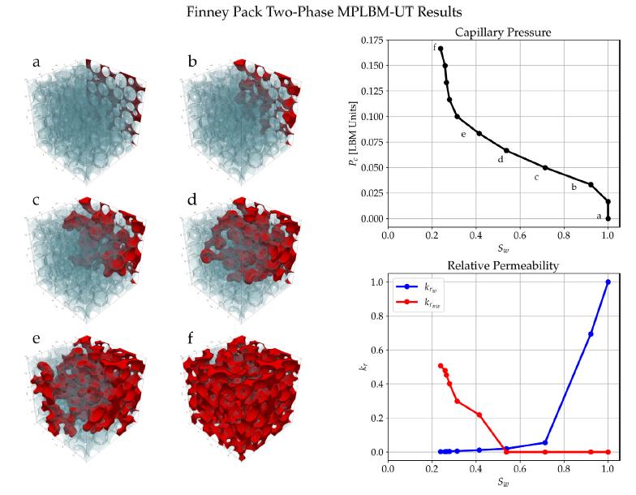

# MPLBM-UT介绍

MPLBM-UT介绍还可参考MPLBM-UT介绍.pdf 的PPT

多孔介质流动在自然科学和工业应用中有其独特性。地下场景如hydrocarbon回收、CO~2~封存、地下水含水层取水。另外，还比如：通过岩石的卤水、冰川中的冰雪融化穿过、海洋沉积物中的甲烷迁移等。

使用不同的实验和数值方法评估多孔材料样品中的物质输移特性。

试验：

Micromodel试验，动态可视化2D透明多孔介质中微米量级上的运动

X-ray microtomography可实现3D观测孔隙尺度上的流动

另外，基于拟合岩石裂缝与几何描述（porosity, tortuosity,
孔隙分布）评估函数关系。

从3D image获取流动特性，可使用方法：FVM, SPH, FEM,
LBM，这些方法用来描述流体如何穿过在微米（甚至更小）尺度上的复杂几何。

Digital rock physics

岩石的图像处理方法

Digital Rocks Portal

基于动理学理论，Boltzmann方程在分子尺度上类比NS方程。Boltzmann方程如下：

式中，f为分子团的概率密度函数（PDF），x是位置向量，v是分子速度，F是外部力向量，t为时间，为分子碰撞项。

LBM依靠Boltzmann方程中的PDF表征模拟域中的流体。计算域的各节点包含流体粒子，由一个PDF描述，基于LBM实施类型，粒子传播并于周围粒子相互作用。从PDF，计算得到流体的宏观特征，如密度和速度。

单相流模拟，用户可选择Bhatnagar-Gross-Krook (BGK) collision
term或者Multi-Relaxation-Time (MRT) collision term。

两相流模拟，MPLBM-UT可使用Shan-Chen LBM框架。

MPLBM-UT使用Palabos平台作为LBM后端。

Palabos与离散元模型LIGGGHTS耦合模拟河床泥沙起动

Palabos与离散元模型LAMMPS耦合模拟动脉中的血红细胞运动

MPLBM-UT支持3种模拟设置：

-   Single-phase flow: permeability and preferential path assessment

-   Unsteady-state multiphase-phase flow: drainage and imbibition,
    capillary pressure curves, unsteady relative permeability

-   Steady-state multiphase-phase flow: relative permeability, contact
    angle studies

多相流模型使用一些解析解做了验证，包括：Young-Laplace方程、Washburn方程和Brooks-Corey相对渗透模型。

MPLBM-UT库的目标：

## 2 软件描述

分为4个主要模块：

-   参数输入

-   计算域构建

-   模拟

-   处理计算结果

如图1

mplbm_utils Python package

### 2.1软件功能

-   数字岩心读取、清理和预处理

-   单相和多相模拟设置，使用多种多孔介质问题的边界条件

-   输出和后处理

还包含一些工具实现以下功能：

-   毛细压力-饱和度的行为计算

-   绝对和相对渗透率计算和绘图

-   浸透路径分析

-   接触角分析

-   流动的可视化和动画输出

### 2.2软件架构

**输入**

流体模拟的第一步是输入binary image，做优化。输入文件及格式见表1

几何体存储于Digital Rock Portal，可从网站下载。

加载计算域后，不连接区域将被删除，保证流动方向上的贯通性。

还可以使用PoreSpy水系模拟工具（在mplbm_utils Python工具包中实施），创建初始的两相流配置文件。

最后，二进制图像转换为具有3个标记的图像：孔空间（或湿润流体）非湿润流体、反弹边界和内部固体介质

**模拟**

当处理完成输入几何体后，需要为单相流或两相流模拟创建输入文件。

**可视化**

默认，Palabos输出VTK文件，包含3D密度和速度数据。

为增加可视化的灵活性，可使用PyVista和Vedo模块的Python脚本创建密度配置文件的等值面可视化。也可创建动画。

还有作图脚本可创建快速可视化的毛细压力和相对渗透率曲线。

图3：sphere pack LBM模拟。Wetting-phasea表征为蓝色，non-wetting
phase表示为红色。图像(a)为初始条件，图像(f)是模拟终点。展示了毛细孔压力曲线及对应的饱和值。

优势：

-   一行代码安装MPLBM-UT

-   示例提供常见的模拟情景，仅需修改一些参数

-   提供了2D，3D和4D可视化工具

## 参考文献

Javier E. Santos, et al. MPLBM-UT: Multiphase LBM library for permeable
media analysis. SoftwareX 18 (2022) 101097

Javier E. Santos, MichaelJ. Pyrcz, Maša Prodanovic. 3D Dataset of binary
images: A collection of synthetically created digital rock images of
complex media. Data in Brief 40 (2022) 107797

数字岩心，以HDF5格式存储的3D数组
