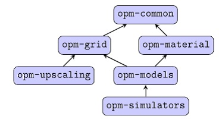
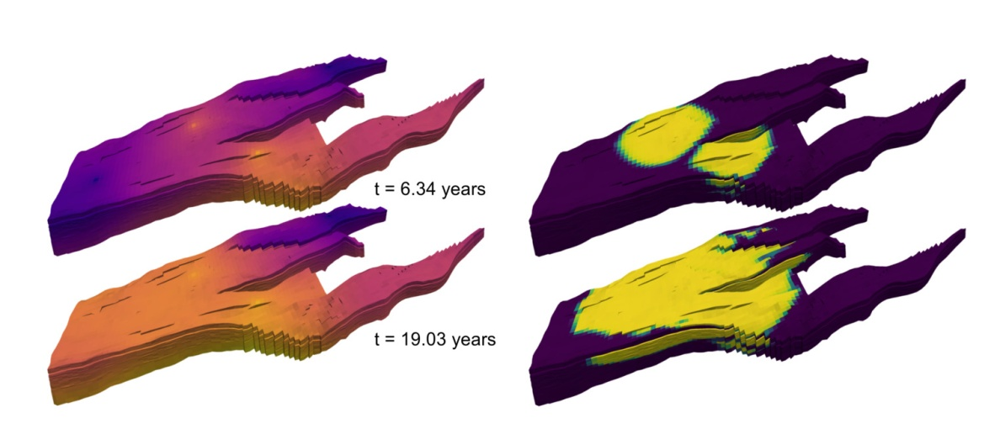
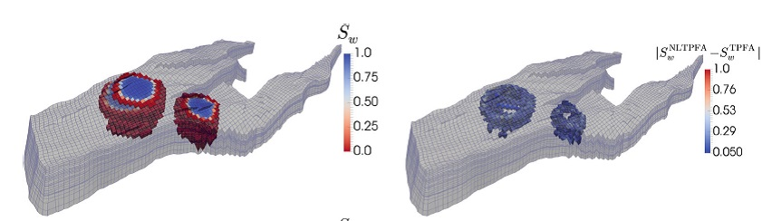
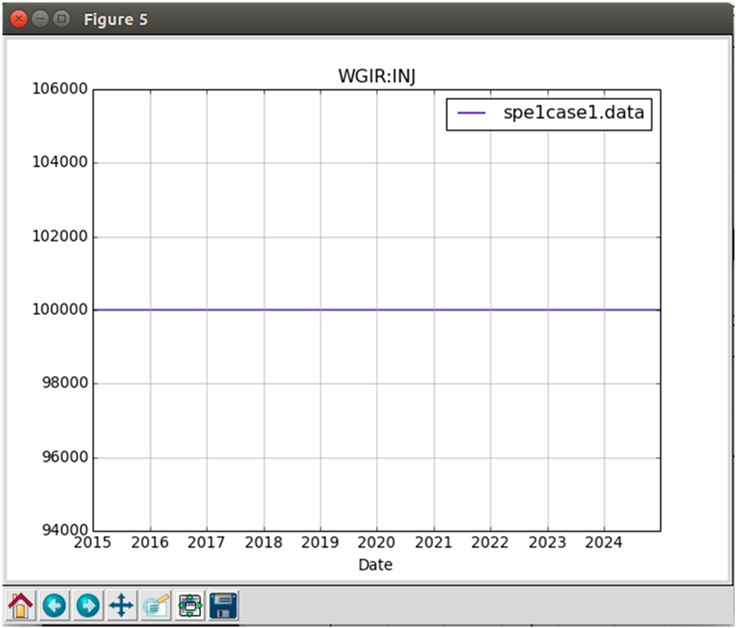
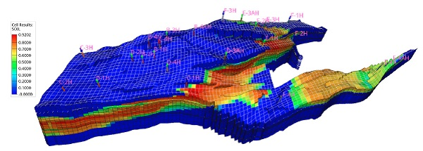
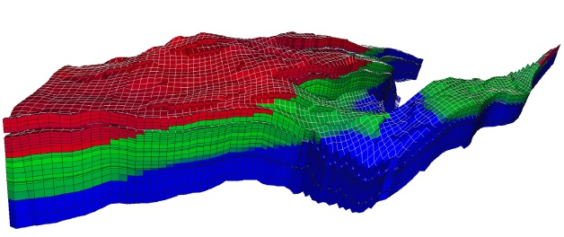
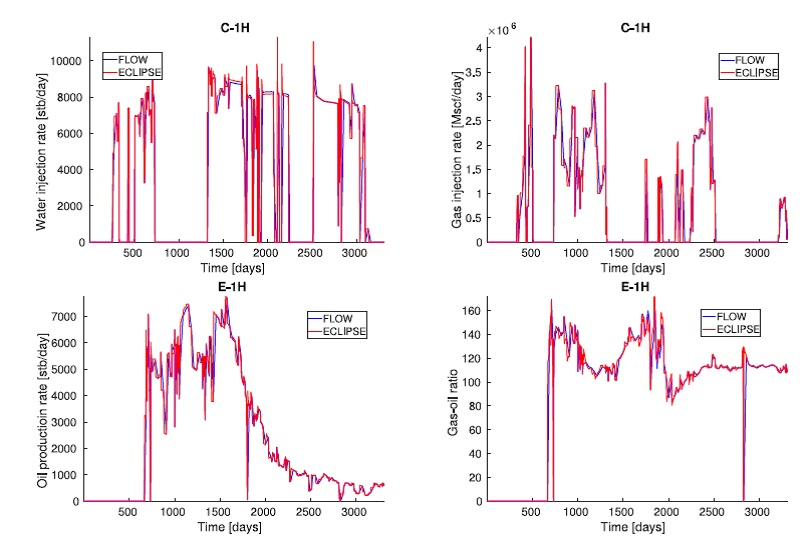
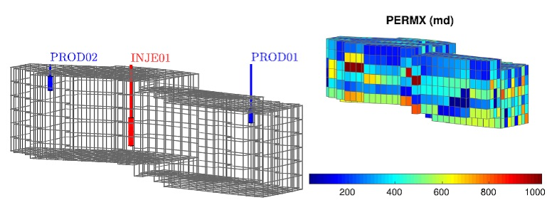
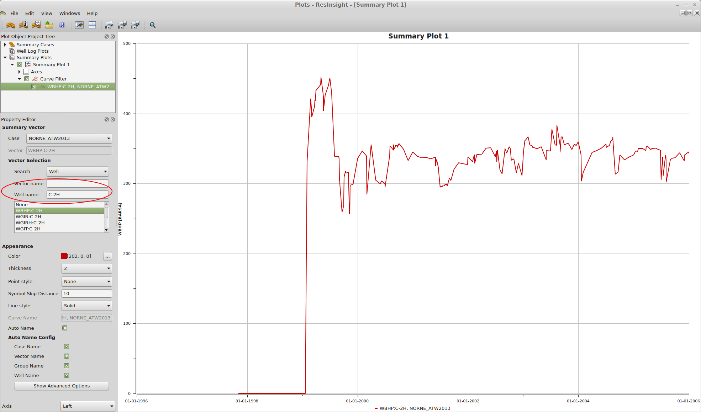
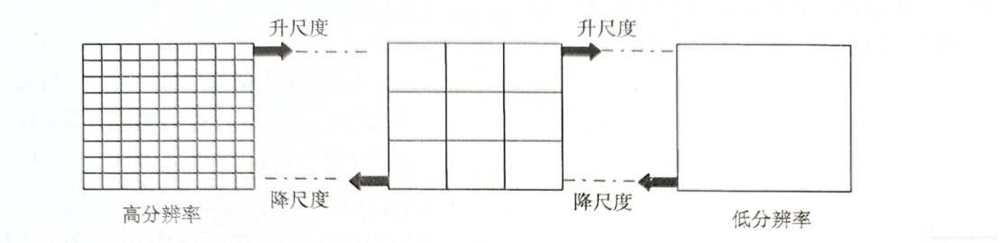

# DuMux

工作流程：Gmsh网格划分；Gnuplot和Matplotlib作图，Paraview可视化。

### 多孔介质中的多相流及输移

下面是基于Norne数据集的两相流（水和石油）的模拟。空隙场，各向异性渗透场，计算网格M的单元E，注水和提取井的位置如图4。

计算区域由corner-point grid描述(Aarnes, 2008)，使用DUNE的omp-grid
(Rasmussen,
2020)的网格接口实施。不可压缩不可穿透两相流模型控制方程和参数见文献(Schneider,
2018)的式(56-60)，表3。

非线性耦合PDE使用TPFA单元中心的有限体积格式在空间上离散，时间上是由向后欧拉格式离散。初始条件是：整个计算域都是全饱和的石油。井使用Peaceman的井模型，施加固定的bore-hole压力(Peaceman,
1978)。

M. Schneider, B. Flemisch, R. Helmig, K. Terekhov, H. Tchelepi, 2018.
Monotone nonlinear finite-volume method for challenging grids, Comput.
Geosci. 22 (2): 565-586.

J.E. Aarnes, S. Krogstad, K.-A. Lie, 2008. Multiscale mixed/mimetic
methods on corner-point grids, Comput. Geosci. 12 (3): 297-315.

A. Flo Rasmussen, T. Harald Sandve, K. Bao, A. Lauser, J. Hove, B.
Skaflestad, R. Klkorn, M. Blatt, A. Birger Rustad, O. Sareid, K.-A. Lie,
A. Thune, 2020. The open porous media flow reservoir simulator, Comput.
Math. Appl. 81: 159-185.

孔隙度与渗透率分布（从opm-data模块提取）

2个注水井，水油两相的地下浓度时空演变过程（液相压力和饱和度的时间演变过程）

### CO2封存 

### Fractured rock systems

A discrete fracture model based on the box scheme

Infiltration of CO2~ through an interconnection network of fractures in
a fully water saturated medium. Simulation based on a vertex-centred
finite volume scheme (Box) with auxiliary terms in the balance equations
to account for fracture flow (Box-DFM). The scheme is suitable for
conducting fractures.

### River engineering applications

Shallow water equations (fully implicit)

The simulation covers a 11 km long section of the river Rhine and shows
flooded areas during an idealized flood event. Water flows from bottom
to top. The model has a discharge boundary condition at the inlet and a
stage-discharge-curve as boundary condition at the outlet.

The simulation is based on the shallow water equations (a
depth-averaged, two-dimensional version of the Navier-Stokes equations).
The model uses a fully implicit time discretization and a finite volume
discretization in space.

### Fluid flow around the DuMu^x^ logo

Navier-Stokes equations

The simulation shows fluid flow around the DuMu^x^ logo visualised by
streamlines. The computational grid is created with the DuMu^x^ binary
image grid reader which makes use of the Dune grid interface
implementation [dune-subgrid](https://www.dune-project.org/modules/dune-subgrid/).
The flow solver is based on Newton's method and the Navier-Stokes
equations are discretised with an implicit Euler scheme in time and a
staggered grid finite volume scheme in space.

### 小结

具有广泛应用范围的流体模拟程序，特别是地下水多孔介质模拟以及油藏模拟。

# OPM模拟器

MRST: 油藏模拟的Matlab工具箱。

石油界的权威商业软件ECLIPSE

Norne油田(挪威, 1997)，算例：github.com/OPM

OPM有挪威SINTEF和德国Stuttgart大学、Bergen大学共同开发。

OPM使用和构建现有的框架和库，如DUNE, DuMuX, Zoltan,
Boost，降低实施和维护成本，改善软件质量。MRST的目的也是如此。

OPM
Flow开发的目的有2个：（1）作为开源模型，选择替代现有的商业模型，辅助石油公司的规划、设计与管理，如碳水化合物；（2）实际应用用户实施、测试和验证新模型、新计算方法的研究平台。

OPM
Flow目标是描述油藏地质、流体特性和描述井和产油设施，提供全隐格式离散black-oil类型模型，支持工业标准的输入和输出格式。模拟器使用自动差商(AD)，避免编码错误，更容易拓展模拟器使用新方程，如CO2注入和enhanced
oil recovery (EOR)。

OPM flow的安装和运行见：opm-project.org，及其手册。

图1 Norne reservoir显示石油饱和度和井（3.5年产油后）：Z方向放大5倍

OPM包含ReInsight后处理程序，用于所有的3D可视化。独立于OPM其他模块。

输入与输出文件格式：Eclipse

图2 Norne油田的网格以及流体的初始分布。红色的是gas，蓝色的是oil

图3 Norne油田的injector and producer井的验证

注射polymer提高oil recovery

图4 计算网格和polymer的水平渗透率

### Flow模块

OPM Flow is a fully-implicit, black-oil simulator capable of running
industry-standard simulation models. The simulator is implemented using
automatic differentiation to enable rapid development of new fluid
models.

Validation of Flow for the Norne Field. The 3D plot shows saturation
distribution visualized in ResInsight. The line plots show bottom-hole
pressures and oil-production

**Model formulation:**

-   black-oil with dissolved gas and vaporized oil

-   rock-dependent capillary and relative-permeability curves

-   end-point scaling and hysteresis

-   oil vaporization controls (VAPPARS)

**EOR options:**

-   Todd-Longstaff type polymer model with adsorption, dead-pore space,
    > permeability reduction, and shear effects
    > ([[Flow-polymer]{.underline}](https://opm-project.org/?p=592))

-   extra component equation(s), such as a solvent model
    > ([[Flow-solvent]{.underline}](https://opm-project.org/?page_id=565))

**Description of geology:**

-   rectilinear and fully-unstructured grid

-   corner-point grids from Eclipse input, including fault and region
    > multipliers, minpv/pinch, etc

**Wells and controls:**

-   bottom-hole pressure and surface/reservoir rate

-   group controls

-   shut/stop/open individual completions

-   history-matching wells

**Input/output:**

-   general reader/parser for Eclipse input decks

-   XML-based or simple text-format input of additional parameters

-   flexible output of summary and restart files in Eclipse format

-   logging to terminal and print file

**Simulation technology:**

-   fully-implicit in time

-   two-point flux approximation in space with  upstream-mobility
    > weighting

-   flexible assembly through the use of automatic differentiation

-   block-structured linear solver with ILU0 preconditioner

-   CPR preconditioner and multigrid solver

-   adaptive step-size controls

### UPSCALING

OPM Upscaling is a collection of tools for single-phase and steady-state
upscaling of capillary pressure and relative permeability.

llustration of upscaling. The left figure shows averaging of porosity
within a model that contains two facies. The right figures shows
steady-state upscaling of relative permeability for a bed model.

**Single-phase upscaling**[:]{.mark}

-   flow-based method that uses directional flow problems

-   fixed, linear, or periodic boundary conditions

-   consistent spatial discretization (mimetic finite differences)
    > reduces grid-orientation effects

-   linear solver: algebraic multigrid

-   produces symmetric tensor (with periodic boundary conditions)

**Elastic parameters**:

-   Algebraic multigrid and overlapping Schwarz preconditioner

**Relative permeability and capillary curves:**

-   first: computes steady-state by solving two-phase, incompressible,
    > immiscible flow with capillary and gravity forces

-   then: computes effective permeability for given phase mobilities

-   generally gives full tensor relative permeability

-   same pressure solver as in single-phase upscaling (mimetic, AMG)

-   transport solver: two-point, mobility-weighted upwind scheme,
    > explicit or implicit temporal discretization

**Electrical resistivity/conductivity**:

-   Initialisation of saturations using capillary equilibrium

-   Resistivity/conductivity properties is populated using Archie's law

-   Resistivity/conductivity is homogenized using Ohm's law

**Upscaling utility** (cp-chop):

-   chops a corner-point model into coarse blocks

-   upscales individual blocks in parallel
