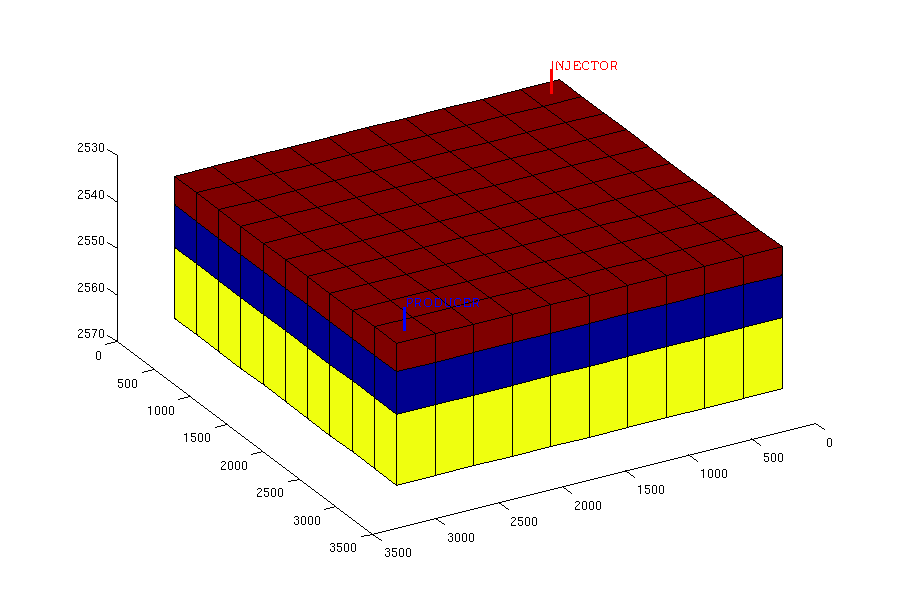
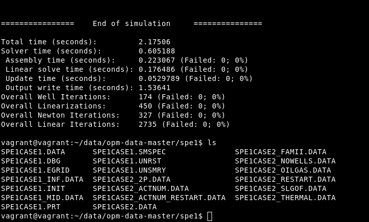
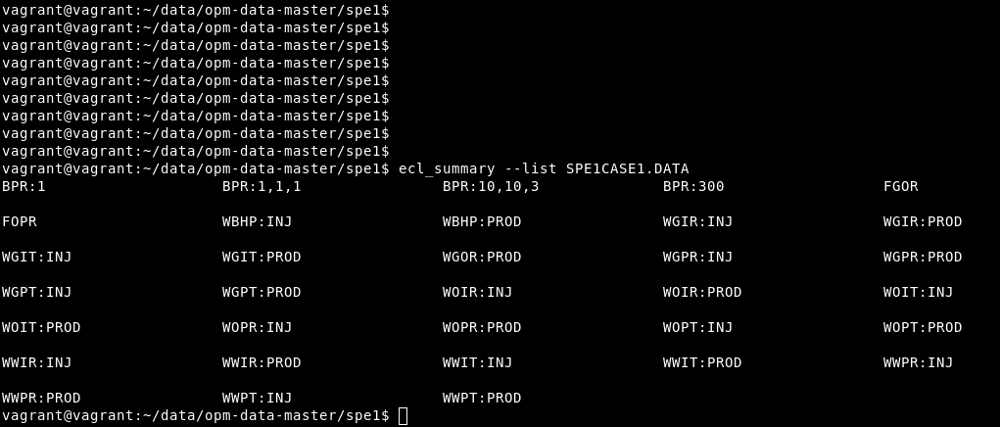
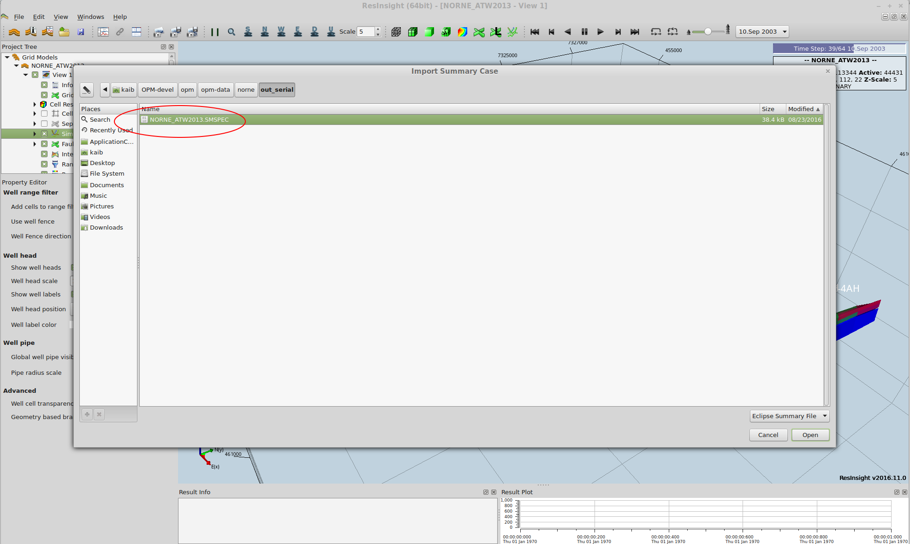
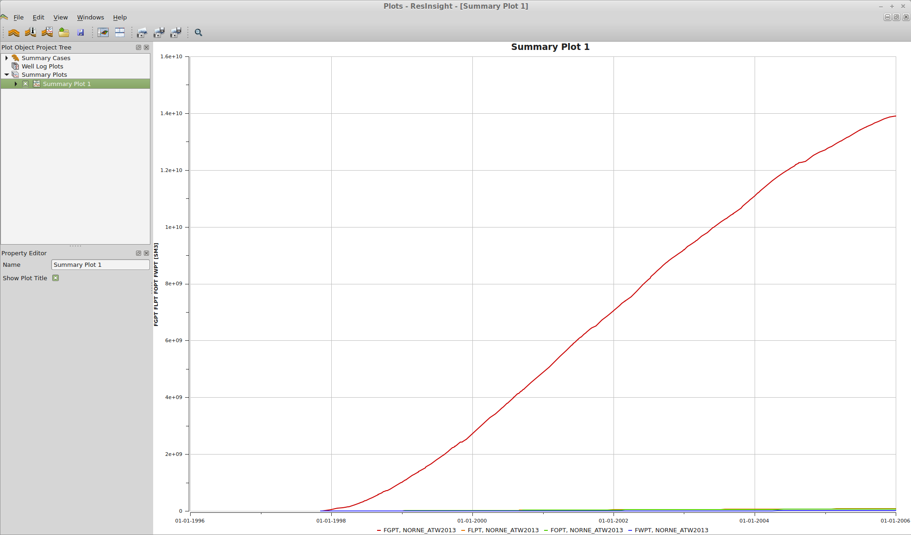
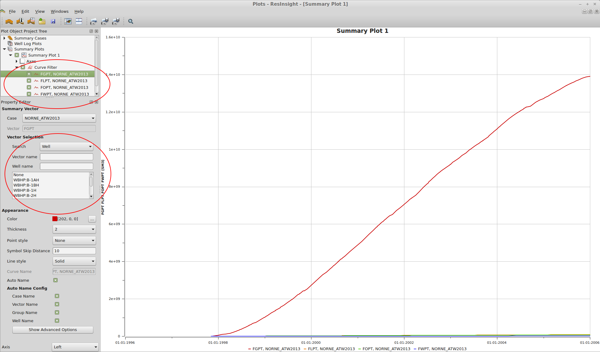
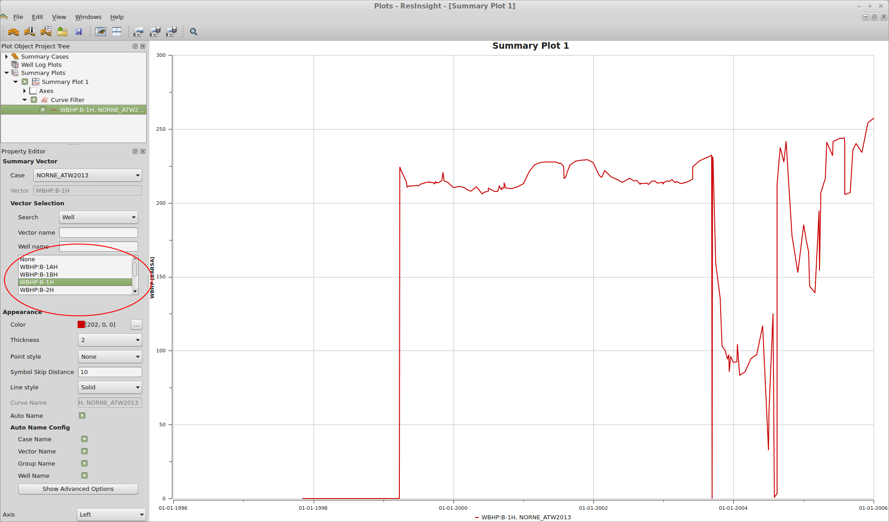
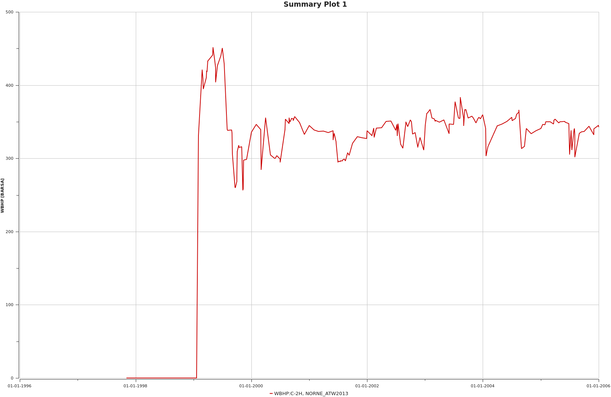
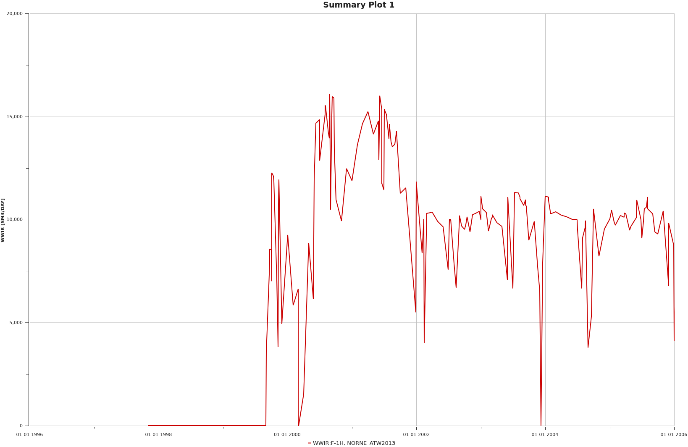

# My first reservoir simulation (SPE1)

https://opm-project.org/

This tutorial will lead you through the steps required to run your very
first reservoir simulation using Flow. We will take a look at how we can
simulate the  reservoir model from the 1st SPE Comparative Solution
Project  (CSP) designed for benchmarking 3D black-oil simulators

{width="6.188754374453193in"
height="4.130410104986876in"}

The tutorial assumes that you are familiar with Linux, have Ubuntu 16.04
or 18.04 installed, and are allowed to run the sudo command.

We will explain how to  install the required tools, download a test
dataset, run the simulator, and finally inspect the simulation results.

### Installing the required software

Details on installing Flow on different platforms is outlined on the
[[installation
instructions]{.underline}](https://opm-project.org/?page_id=36) page.
Follow those instructions, and then come back to this tutorial.

You can verify that Flow is installed by entering the command "flow" on
the command line. You should see a message containing a long list
of command-line options. If you installed from source instead of binary
packages you must give the full path to the Flow executable instead of
just typing "flow" (for example "\~/opm/opm-simulators/build/bin/flow"),
or put that directory in your PATH.

### Download dataset

The Open Porous Media initiative has made several benchmark datasets
available under an Open Database License. The datasets are available on
Github, [[https://github.com/OPM/opm-data]{.underline}](https://github.com/OPM/opm-data).

The datasets include models of synthetic and realistic reservoirs, and
in particular open versions of the models from several of the [[SPE
Comparative Solution
Projects]{.underline}](http://www.spe.org/web/csp/) and the simulation
model of
the [[Norne]{.underline}](http://www.ipt.ntnu.no/~norne/wiki/doku.php?id=start) field.

The simplest way to get the datasets is to download them as a zip file
from Github:

cd \~/

wget https://github.com/OPM/opm-data/archive/master.zip

Note that this is quite a big download (about 200 MB). Once downloaded,
you can unzip it using the following command:

unzip master.zip

This will give you a directory structure with all the datasets.

### Running Flow

We are now ready to run Flow. Start off by entering the directory
containing the SPE1 dataset,

cd opm-data-master/spe1

From here, you can execute Flow by giving the file name of the input
deck as a parameter:

flow SPE1CASE1.DATA

{width="6.403568460192476in"
height="3.8633103674540683in"}

Flow will now execute and output information about the simulation case
as it progresses. It should complete within less than a minute and give
the following new files:

SPE1CASE1.EGRID

SPE1CASE1.INIT

SPE1CASE1.SMSPEC

SPE1CASE1.UNRST

SPE1CASE1.UNSMRY

### Plotting well curves

The results of the simulation can be viewed with several different
tools, but we will here use the tool-chain that has the fewest
dependencies.

First, we will examine which variables we can view using the
ecl_summary tool from
[[libecl]{.underline}](https://github.com/Statoil/libecl), which should
already be installed since libecl is needed by Flow. (Note: if you
installed libecl from source, the program is called summary.x and will
be located in your build directory.) By typing

ecl_summary \--list SPE1CASE1.DATA

we get a list of the different variables that are available:

{width="6.654265091863517in"
height="2.8490398075240595in"}

Some of the more interesting ones are:

-   WBHP:INJ -- Bottom hole pressure of INJ well

-   WGIR:INJ -- Gas injection rate of INJ well

-   WBHP:PROD -- Bottom hole pressure of PROD well

-   WOPR:PROD -- Oil production rate of PROD well

-   WGPR:PROD -- Gas production rate of PROD well

To manually inspect the values you can also use the same tool,
for example:

ecl_summary SPE1CASE1.DATA WBHP:INJ

Next, we use a python script called summaryplot from
[[opm-utilities]{.underline}](https://github.com/OPM/opm-utilities/) to
plot these variables. Start by downloading the script with the following
commands:

wget
https://raw.githubusercontent.com/OPM/opm-utilities/master/summaryplot

Summary plot requires python and the ECL python bindings:

sudo apt-get install python-ecl python-numpy python-matplotlib
libecl-dev

Then, we can plot the well curves with the following command:

python summaryplot WBHP:INJ WBHP:PROD WOPR:PROD WGPR:PROD WGIR:INJ
SPE1CASE1.DATA

The result can be seen in the figures below. It is worth noting that
since the input deck specifies FIELD units (psi for pressure, etc.), the
output produced by Flow will use that as well.

{width="6.419597550306212in"
height="5.471002843394576in"}

# Running the Norne case with Flow

This tutorial will guide you through running and visualizing the Norne
case, which is an open benchmark case of a real Norwegian Sea oilfield.
It will also demonstrate how to run Flow in parallel, take a look at
some available run-time parameters, and discuss the logging facilities
of Flow.

The tutorial assumes that you have already [[built or
installed]{.underline}](https://opm-project.org/?page_id=36) OPM and
Flow in particular, and have run through the [[first
tutorial]{.underline}](https://opm-project.org/?page_id=197).

To follow the visualization parts, you must have
[[ResInsight]{.underline}](https://opm-project.org/?page_id=117)
installed.

### Running the Norne case

After the first tutorial, you should have a copy of the latest master
branch of the opm-data repository. If you followed [[the instructions in
that tutorial]{.underline}](https://opm-project.org/?page_id=197&page=3)
it will be named "opm-data-master". Go to the Norne case by entering its
directory:

cd opm-data-master/norne

From here you could start a Norne run immediately by entering the
following command:

flow NORNE_ATW2013.DATA \--output-dir=out_serial

Note that there should be no spaces between the parameter key
("output_dir") and the associated value. It is quite possible to leave
out the "output_dir" parameter, that way all your output files will end
up in the current directory. If, instead, you choose to use the
parameter all output files will end up in the directory you name (and
the directory will be created), "out_serial" in the example.

Running the case will take some time, depending on the speed of your
computer. Expect around half an hour on reasonably modern computers.

Next, we will take a look at the output being produced by the simulator.

### Simulator log output

The Flow simulator produces several logs:

-   Terminal output

-   The PRT file

-   The DBG file

##### Terminal output

The most important messages are written to the terminal. This includes
warning and error messages, timesteps and timestep summaries. Warnings
are printed in blue, errors in red, and numerical problems (typically
leading to timestep chopping) in pink.

By default, the terminal is limited to displaying a certain number of
messages of the same type (note, warning, problem, error etc.), so after
displaying a large number of warnings for example it will cease
reporting them. Similarly, it will stop repeating similar messages
(technical detail: messages with the same "tag") after 10 such messages
have been displayed. For example, you can see that after report step 4,
Flow prints the message: "Warning: Message limit reached for message
tag: Unhandled output keyword".

Other than the time steps, the most interesting messages printed to the
terminal are the well-control messages printed when wells are switched
from one control setting to another due to breaking one or more
constraints, and numerical problems encountered. If Flow fails to solve
the current timestep for any reason it will retry with a smaller step
size. That will be reported like this:

Problem: Solver convergence failure - Iteration limit reached

Timestep chopped to 3.630000 days

##### The PRT log (NORNE_ATW2013.PRT)

The PRT log file contains a lot more than is printed to the terminal.

First, there are no message limits, so warnings that are eventually
silenced in the terminal output, will remains as warnings here.

Second, the log is a bit more verbose. Initially, an overview of all
command-line options used is printed. Also, fluid-in-place reports are
printed for all fluid-in-place region after every time-step.

##### The DBG log (NORNE_ATW2013.DBG)

The main difference between this and the PRT log is that this will
contain absolutely all messages, including debug messages. In
particular, the residuals are printed after every iteration, making it
possible to follow the Newton-like nonlinear iteration process. This
makes it useful to developers, less so for regular users. If you have a
problem however, this log can be valuable in diagnosing your issue.

### Summary output

One of the main outputs from the simulator is the summary file
(NORNE_ATW2013.UNSMRY), the ending UNSMRY means it is a unified summary
file, i.e. containing data for all time-steps in a single unified file.

In this file you will typically find data that are likely to be useful
to plot as a function of time, such as well rates, bottom hole pressures
or fluid-in-place quantities. Flow allows the input deck to configure
what should be written to the summary file. To look at the summary you
may use the ecl_summary tool as was [[explained in the first
tutorial]{.underline}](http://opm-project.org/?page_id=197&page=5) (also
you can use the summaryplot tool to visualize well curves as explained
there):

cd out_serial

ecl_summary \--list NORNE_ATW2013

This will give a huge list of keywords corresponding to quantities
written to the summary. Some of the more important ideas to get from
this are:

-   Keywords start with a letter signifying its scope: C for completion
    (well perforation), F for field, G for group (of wells), R for
    region and W for wells.

-   The rest of the keyword identifies the quantity, some examples (note
    that some of the concepts such as oil production rate makes sense
    and can be used with several of the scopes):

    -   Well keywords (W): BHP for bottom hole pressures, GOR for
        gas-oil ratio, OPR for oil production rate, WIR for water
        injection rate.

    -   Region keywords (R): OIP for oil in place, GIPL for gas in place
        in the liquid phase (dissolved in it).

-   The string after the colon (if any) is the name of the well or
    group, the region number, or (for completion data) the well name and
    completion location.

To get a particular quantity, for example the bottom hole pressure of
the well C-4H, issue the command

ecl_summary NORNE_ATW2013 WBHP:C-4H

Note that when the well is closed, the BHP is reported as zero.

The units used in all summary (and restart) output files correspond to
the unit family chosen in the input deck. For Norne, METRIC units are
used, and so the BHP output is in bars, rates are in cubic meters per
day etc. When FIELD units are used, BHP output will be in psi, rates in
barrels per day for oil and water or 1000 cubic feet per day (yes,
really!) for gas etc.

### Visualizing summary data with ResInsight

The ResInsight visualization tool can also display well curves and other
summary data interactively. To do this, click the *Import Summary Case*
button.

{width="6.71005905511811in"
height="4.017877296587926in"}

Navigate to the output directory and choose the SMSPEC file.

{width="6.6550656167979in"
height="3.9829286964129484in"}

By default, field production rates for gas, oil, water and liquid (oil +
water) are shown. The gas production curve dominates the others in this
case, as should be expected since it is a case using METRIC and
rates are therefore shown in cubic meters per day.

{width="6.726707130358705in"
height="3.955482283464567in"}

We'd like to inspect the bottom-hole pressure of the well B-1H. Expand
*Summary plot 1* in the *Project Tree*, delete the production curves and
add the well BHP curve as shown below.

{width="6.591283902012249in"
height="3.8758497375328083in"}

Now we are looking at the BHP curve we wanted to.

{width="6.631860236220472in"
height="3.8977307524059492in"}

If we want to look at properties for a particular well, or a particular
property, we can use a filter. Type the well name C-2H in the *Well
name* field and the list of choices will be restricted to those relevant
to that well. Choose *WBHP:C-2H* to see its BHP curve.

{width="6.645587270341207in"
height="3.9058005249343832in"}

ResInsight can export these images easily. In the *Edit* menu, choose
*Snapshot To File* to export them to files. You can see a few examples
below.

{width="6.641070647419073in"
height="4.324794400699912in"}

{width="6.517104111986002in"
height="4.24406605424322in"}

### Running Flow in parallel

Flow supports running simulations in parallel using MPI. To use this run
Flow with mpi_run: (note that the next command should be a single line)

mpirun -np 4 flow NORNE_ATW2013.DATA \--output-dir=out_parallel

The above command runs the simulator with four processes, so you should
have at least four cores or hardware threads available to gain from this
(adjust the parameter to suit your computer). The simulator should then
run quite a bit faster (if not 4 times faster). It should be noted that
since the input deck format and output file formats are serial in
nature, input and output has not been parallelized.

The resulting output should be equivalent to the output from the serial
run. It will not be identical however, since the linear solver will not
behave identically between the serial and parallel runs.
