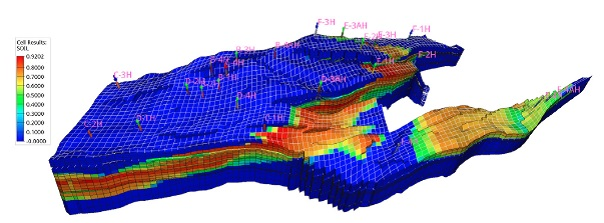

# 学习《The Open Porous Media Flow reservoir simulator》

Norway与Germany研发的油藏模拟器。

## 1引言

始于2009年的项目，着眼于多孔介质过程模拟的创新和可重复研究框架。

SINTEF, NORCE (formerly IRIS), Equinor, Ceetron Solutions, Poware
Software Solutions, and Dr. Blatt HPC-Simulation-Software &
Services联合研发。

源码分6个模块，如图1，源码仓库见：github.com/OPM。还有opm-data和opm-tests

图1 2019.10发布版的模块结构

本文主要深入介绍OPM Flow，构建于已有的框架或库，如DUNE, DuMuX,
Zoltan和Boost，降低实施和代码维护的成本，改进代码质量。

OPM包含后处理程序ResInsight，用于3D可视化，如图2。

图2 后处理可视化

## 2 OPM Flow

模拟器使用automatic differentation
(AD)实施，避免错误发生的偏导计算和残差方程的Jacobian解析式编程。adjoint
method？

### 2.1黑油模型

### 2.1.1模型方程

### 2.1.4岩石特性

### 2.1.5相当渗透率和毛细压

## 2.2井模型

### 2.2.1标准井模型

### 2.2.2Multi-segment井模型

## 2.3求解策略

### 2.3.1非线性求解器问题

### 2.3.2求解线性方程组

## 2.4OPM Flow的自动差分

## 2.5并行化

MPI + OpenMP (雅克比矩阵整合是多线程的)

还没有油藏数据的并行化文件格式，ECLIPSE文件格式是串行的。

## 2.6OPM Flow的I/O

OPM Flow实施支持Schlumberger的ECLIPSE模拟器的输入格式。

### 2.6.1读取输入文件

### 2.6.2写出输出文件

### 2.6.3并行化文件I/O

ECLIPSE文件格式是串行的，但是油藏工业界的标准文件格式，并行模拟程序也必须使用该格式。

I/O
rank之间的通信与其他所有的ranks是异步执行的，各模拟core仅执行MPI_Isend，然后继续计算，而I/O仅执行MPI_Irecv,
MPI_Iprobe和MPI_Waitall。

## 2.7拓展的模型

### 2.7.1 Solvent

### 2.7.2 Polymer

## 3数值例子和结果

SPE

Norne

注射Polymer的EOR例子

### 3.7计算效率

3.7.1串行效率

3.7.2并行化尺度效率

3.7.3系综模拟效率

## 4结论与展望

研发中的模块：伴随计算、时空的高阶离散格式、CO~2~行为的新流体模型、串行隐式方法。

## 参考文献

A. Kvashchuk, R. Klkorn, T.H. Sandve, Comparison of higher order schemes
on complicated meshes and reservoirs, in: SPE Reservoir Simulation
Conference, Society of Petroleum Engineers, 2019,
http://dx.doi.org/10.2118/193839-MS.
