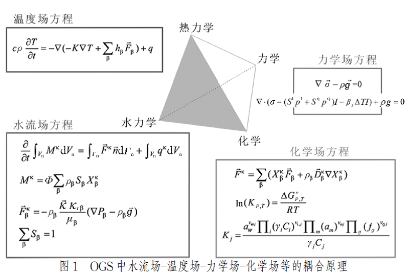
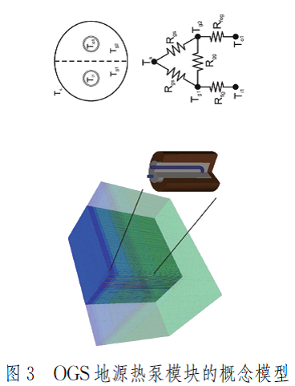
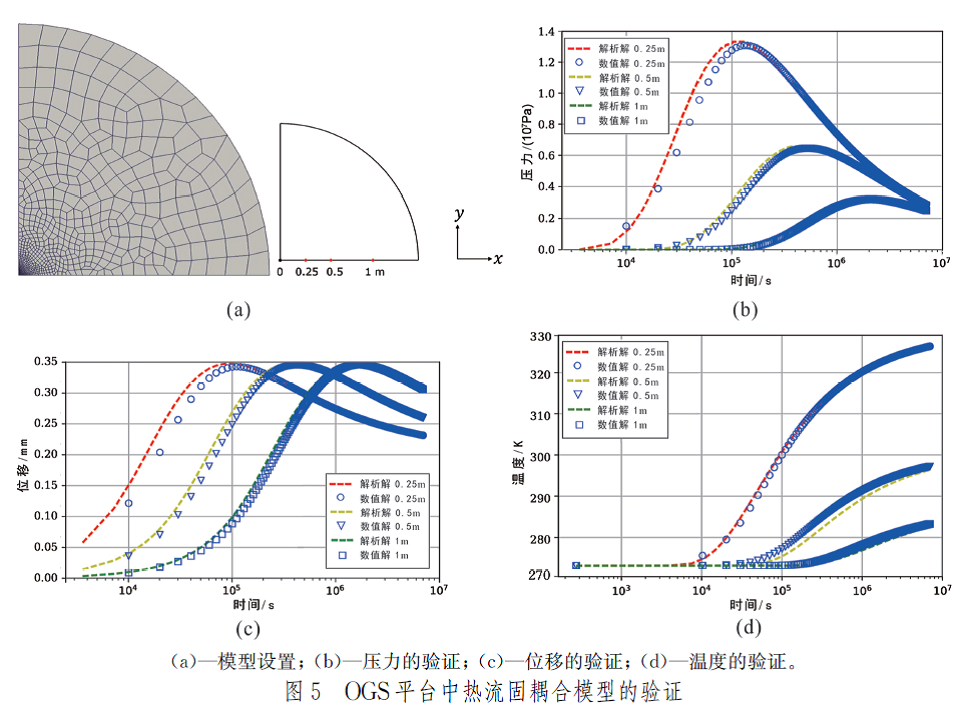
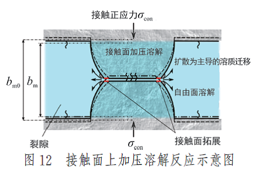
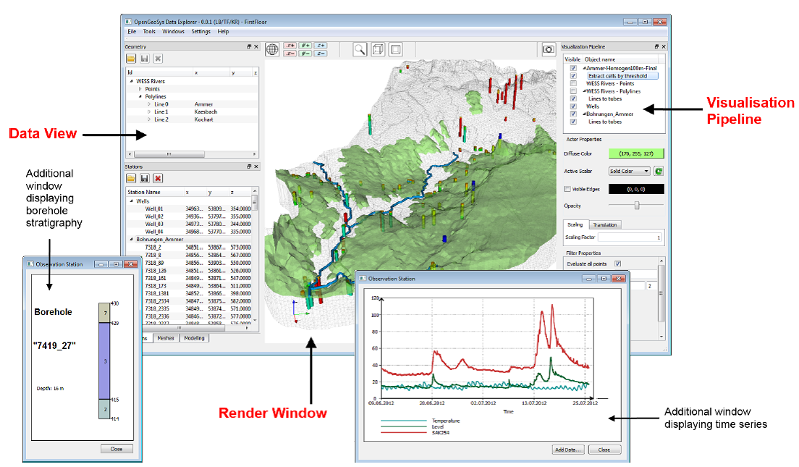
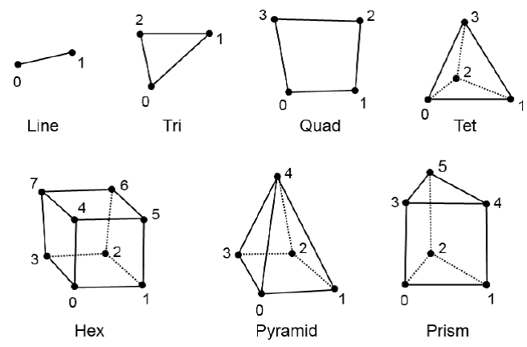
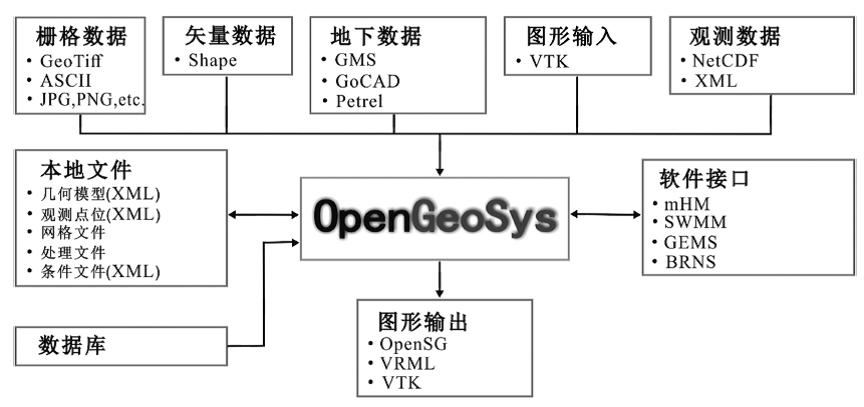

# OpenGeosys模型

已经有很多开源的Darcy尺度的多孔介质流动和输移过程模拟程序，见文献(Bilke,
2019)的罗列。开源的数值求解软件框架，2大类：一类是基于C++库，如：deal.II,
DUNE, MOOSE；一类是特定域语言库，如：OP2, FEniCS, Firedrake,等。

## OGS简介

OGS的中文介绍论文参考孔彦龙(2020)。地热能开发过程中的数学模型通常涉及水流场和温度场的耦合，在处理高温高压下的岩石变形时，还需与应力场进行耦合；在考虑溶解沉淀等化学反应过程时，则需要耦合化学场。

OpenGeoSys(OGS)即为在此背景之下由德国亥姆霍兹环境研究中心(UFZ)作为研发主体，开发的一款开源软件。该软件采用C++语言编写，基于有限元分析，面向对象开发。OGS至今已有30年的开发历史，并被分别应用于核废物处置、水污染分析、CO2封存和地热能开发利用等多个项目中。

## OGS的原理及使用方法

OGS内核基于质量守恒和能量守恒定律,建立一系列状态方程(EOS)进行运算。OGS采用适当的数值方法对不同场进行耦合(图1)，主要包括:(1)水流场,即非等热的多相流运动场;(2)温度场,即多相流系统内的热传递场;(3)力学场,即非等热的弹性和非弹性形变场;(4)化学场,即多组分溶质运移及地球化学反应场。

OGS采用面向对象的编译方法，通过对这些对象的整合,来求解EOS。所有对象均基于研究体的几何形态予以赋值,这些对象包括网格剖分(MSH,包括剖分的节点、剖分类型和体积)、初始条件(IC)、边界条件(BC)、源汇项(ST)、流体特征(MFP)、介质特征(MSP/MMP)、化学特征(MCP)和数值方法(NUM)。

OGS开发了自己的数据前处理可视化界面(OGS-Data Explorer),它有与常见地质软件(如ArcGis、GMS、Petrel、GoCAD等)的接口,能够处理ASCII、Shape等格式文件,并将其直接转化为OGS所需要的BC、ST、MSH等的文件格式。OGS输出的数据格式为VTK、VRML及OpenSG等格式,可以在Paraview等可视化软件中便捷地进行三维显示。

## OpenGeoSys的应用实例

### 浅层地热能开发

以用于浅层地热能开发的地源热泵供暖系统为例，其原理为在深度一般不超过200
m
处安置地埋管，用低温循环液体抽取地下热量，再通过热泵将水温提升到合适的温度来进行室内供暖。地源热泵模型和其对周围环境的响应均作为独立的过程包含在OGS中。

### 中深层地热能开发

中深层地热能的开发,以水热型地热能开发为主。实现水热型地热能的可持续开发,回灌是必由之路。它一方面可以维持热储压力的稳定,另一方面能够防止热水对地表及浅层地下水体产生污染。但是,如果回灌井布局不当,则会造成热突破,即热储内水温下降,降低热田寿命,因此需要采用数值模拟技术,模拟不同采灌情景下热储的温度与压力响应。水热型地热能(尤其是温度大于150
℃的高温地热能)开发利用过程往往会产生结垢的问题,降低热田的生产能力,通过数值方法,可以模拟矿物沉淀过程,分析结垢形成机理。

### 深层干热岩型地热能开发

深层地热能的开发,尤其是通过压裂的方式实现人工造储,从而对干热岩进行开发利用是当前国际上地热学研究的热点之一。干热岩开发的经济性对于压裂后的单井出水量和水温都有一定的要求,如美国MIT的报告认为流量需高于80
L/s,水温需高于200℃才具有开发的经济价值,可以通过模拟不同情境下人造热储内的单井出水温度和流量,进行对比分析以获得最优开采方案。

详细内容参考孔彦龙(2020)。

# DataExplorer介绍

OpenGeoSys DataExplorer采用Qt和VTK库编程。

## 1 界面

DataExplorer GUI界面

## 2加载数据

数据类型：几何数据、网格、测站、模拟数据。

OGS5支持的网格类型

原始文件格式：ASCII, vtu, stn, cnd

原始文件格式的转换

OGS支持导入和导出的文件格式

## 输出数据

File -\> Save As...

## 第5章 示例工作流

## 参考文献

L. Bilke, B. Flemisch, T. Kalbacher, O. Kolditz, R. Helmig, T. Nagel,
Development of open-source porous media simulators: Principles and
experiences, Transp. Porous Media (2019)
<http://dx.doi.org/10.1007/s11242-019-01310-1>.

Karsten Rink. OpenGeoSys Data Explorer Manual. 24th March 2023

孔彦龙, 等. 地热能可持续开发利用的数值模拟软件OpenGeoSys: 原理与应用.
地学前缘, 2020, 27(1): 170-177.
