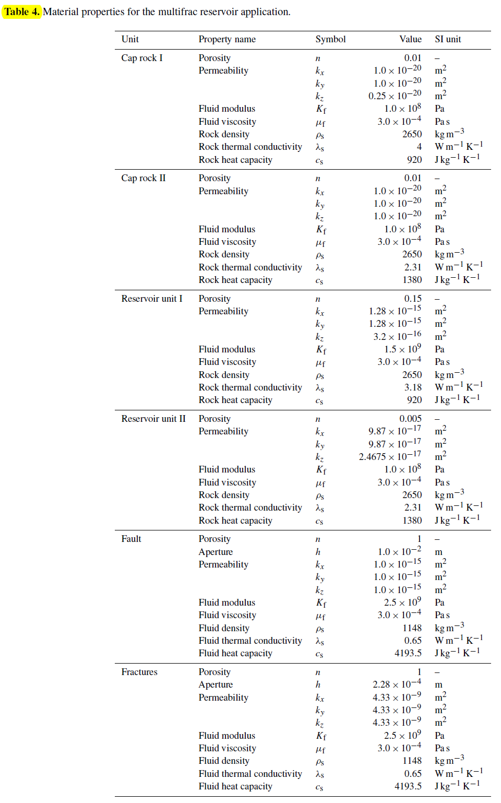
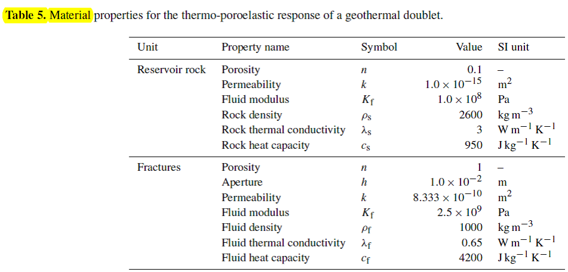
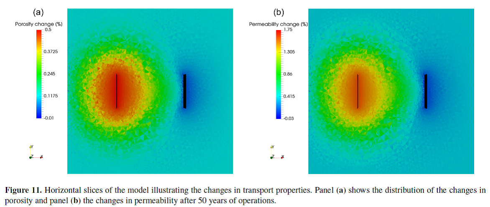

# Golem原理介绍

## 摘要

Golem描述完全饱和裂隙岩石中的地下水和热及溶质输移的原理和数学实施，使用弹塑性力学原理。裂隙的描述：比变形多孔岩石更低维度的概化，作为尺度化参数的力学和水力学孔隙，保证裂隙-固体矩阵系统中的流体质量和能量的连续交换。

Golem是一个新的模拟器代码，采用Galerkin有限单元法，构建在一个灵活的、面相对象的数值框架(MOOSE,
Multiphysics Object Oriented Simulation
Environment)之上，可提供尺度化并行和隐式耦合求解多物理问题。控制方程包括：地下水、热和物质输移，在非结构网格上求解岩石变形。在THM系统以及局部结构（如裂隙系统的连接度）下模拟流体和岩石的属性演变。

模拟的空间尺度从厘米到数千米，空间尺度从数分钟到数百年。

## 研究背景

储层应用研究需要完全了解多组分（裂隙）多孔的岩石-流体系统及其多物理动力学过程，来预测具体的储层的行为，据此改进产出率和可持续发展。

从1970s年代以来，裂隙储层（石油或地热）模拟可分为2大类：

（1）Sequential/explicit模拟或算子分裂方法，即将耦合的物理问题分离成若干线性的子问题，顺序地依次数值求解，代表模型有TOUGH-FLAC。优势是：将相对复杂问题在有限的计算资源条件下数值集成。缺陷是：松散耦合，半隐格式对时间步长的限制，收敛很慢，增加了计算耗时。

（2）求解耦合方程的完整系统，使用全隐式耦合方法。这需要在一次迭代步内同时求解问题的所有变量，使用精确地牛顿或更简单的Picard法求解代数系统。优势是：为强非线性系统保证了更高的稳定性，但此类模型程序很少。

Golem可以解决：

1 定量不同物理过程之间的非线性反馈；

2
通过捕捉多孔岩石-裂隙-流体系统的不连续性、各向异性、非均匀性和非弹性等特征，将其表述在一个计算模型内；

3 多物理和多组分的多孔介质开源模拟程序；

4 模拟THM系统，可模拟不发生反应的化学种类输移。

## 数学方程

裂隙作为低维度的，内嵌在以水填充的多孔矩阵中的单元，见图1。人为离散裂隙的长度是多孔矩阵的REV
(reference elementary
volume)的标准量测，其中的两个组件以thermo-hydro-mechanically交互。因此，建立的物理系统考虑了流体相（水）的non-isothermal流动和多孔岩石的变形（弹性和不连续的）\-\-\--表征为裂隙。

图1 采用低和高维度的几何单元模拟裂隙岩石质量

还可以考虑热量、水力和多孔岩石的力学行为等，引起micro-defects (fissures
and micro-cracks)，以及影响系统材料属性的演变（如孔隙度，如图2）。

图2 对Flechtinger砂岩的三轴力学实验的数值模拟：(a)
相对体积应变的平均有效应力的变化；(b)相对平均有效应力的归一化孔隙度的变化

流体和固体相的质量守恒方程：

 (1)

 (2)

使用Darcy定律描述流体相的动量守恒，以相对固体速度的相对速度表示：

(3)

## 数值方法的实施

Gloem建立在MOOSE框架之上，支持在一个单独的代码中实施1D,
2D和3D计算。MOOSE采用LibMesh (University of Austin in
Texas开发)库的并行有限单元法，以及尺度化并行的非线性和线性求解器(PETSc;
Trilinos,
Hypre)。使用不同的开源库，提供模块化结构的框架，允许开发者仅关注高层级描述多物理场问题，相对紧凑地维护代码。

基于弱形式的有限单元离散，数值求解上述的PDE，高阶多项式由libMesh库获得。

初始和边界条件：(1)预设值位移、空隙压力和温度；(2)边界应力和外部荷载的平衡；(3)穿过施加边界的流体通量的连续性；(4)总热量（扩散+对流）的连续性。

非线性及其稳定算法：

塑性和return-map算法

## 储层模拟应用

下面是2个应用案例展示，具体应用参考Jacquey, et al., 2017

### 热和水力过程---多种裂隙的地热储层原型模拟

运行操作（注射与生产）运行约100年期间，储层的热和水力环境模拟。模型由4种不同的地质构造组成，2个单元代表目标储层和上下地质构造（起到cap
rocks的作用）。计算域xyz方向范围为10x10x3
km。目标储层位于深度约4.6km的位置，被一个断层切割，显示出在储层深度数百米出的滑动。

模拟区域的几何设置如图2，模拟参数如表4。

图2
问题描述和裂隙地热储层：(a)模拟区域的几何和模拟设置；(b)11年生产后的温度近似分布

### 热、水力和力的过程---假设的地热双源下的热-孔弹性响应

低渗透率地质构造下人为设置的地热双源，在2个操作井及裂隙下的运行。模拟目的是：描述储层对地热操作的热-孔弹性响应。模拟范围是500x500x200m，目标储层深度约4km。在模拟开始阶段，假设孔压力和温度分布式各向同性的，分别等于40Mpa和150℃。施加区域应力场作为背景应力，模拟如下幅度的法向断层：

Z方向上垂向应力S1=100 MPa

Y方向上最大水平应力S2=90MPa

X方向上最小水平应力S3=50MPa

考虑2个水力裂隙

模拟中，还考虑非线性效应，在流体的演变过程中，修改流体特性（流体密度和粘滞系数）和岩石特性（孔隙度和渗透率），作为储层状态演变的函数。

模拟区域的几何设置如图3，模拟参数如表5。

图3
问题描述和热-多孔弹性对地热的双重反应：(a)问题描述；(b)50年以后的孔压力（流速）和温度分布

{

模拟结果

## 参考文献

Mauro Cacace and Antoine B. Jacquey. 2017. Flexible parallel implicit
modelling of coupled thermal-hydraulic-mechanical processes in fractured
rocks. Solid Earth, 8, 921-941.

Jacquey, A. B., Urpi, L., Cacace, M., Blöcher, G., Zimmermann, G., and
Scheck-Wenderoth, M.: Poroelastic response of geothermal reservoirs to
hydraulic stimulation treatment: theory and application to the Groß
Schönebeck geothermal research facility, J. Geophys. Res.-Sol. Ea.,
under review, 2017.

# MOOSE简介

多物理学面向对象仿真环境（MOOSE）是一个有限元、多物理学框架，主要由爱达荷国家实验室开发。它为地球上一些最复杂的非线性求解器技术提供了一个高级接口。MOOSE提供了一个直接的API，与科学家和工程师需要解决的现实世界的问题很一致。

关于工程师如何与
MOOSE互动的每一个细节都经过深思熟虑，从安装过程到在最先进的超级计算机上运行你的模拟，MOOSE系统将加速你的研究。

## 功能

-   全耦合、全隐式多物理场求解器

-   维度无关物理

-   自动并行（最大运行超过 100,000 个 CPU 内核！）

-   模块化开发简化代码重用

-   内置网格自适应

-   连续和不连续 Galerkin (DG)（同时！）

-   直观的并行多尺度求解（参见下面的视频）

-   维度无关的并行几何搜索（用于联系相关的应用程序）

-   灵活、可插拔的图形用户界面

-   约 30 个可插入接口允许解决方案的每个部分的专业化
