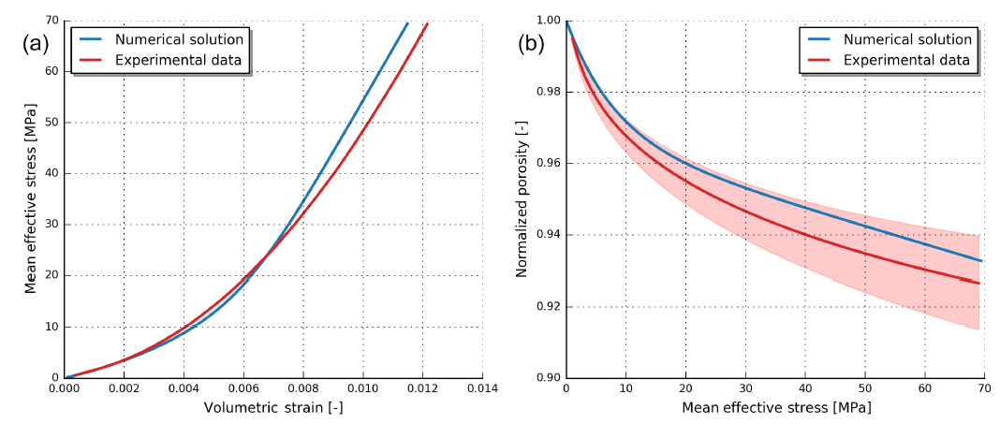

# Golem原理介绍

Golem描述完全饱和裂隙岩石中的地下水和热及溶质输移的原理和数学实施，使用弹塑性力学原理。裂隙的描述：比变形多孔岩石更低维度的概化，作为尺度化参数的力学和水力学孔隙(aperture)，保证裂隙-固体矩阵系统中的流体质量和能量的连续交换。

Golem是一个新的模拟器代码，采用Galerkin有限单元法，构建在一个灵活的、面相对象的数值框架(MOOSE,
Multiphysics Object Oriented Simulation
Environment)之上，可提供尺度化并行和隐式耦合求解多物理问题。控制方程包括：地下水、热和物质输移，在非结构网格上求解岩石变形。在THM系统以及局部结构（如裂隙系统的连接度）下模拟流体和岩石的属性演变。

模拟的空间尺度从厘米到数千米，空间尺度从数分钟到数百年。

## 数学方程

裂隙作为低维度的，内嵌在多孔矩阵（以水填充）中的单元，见图1。人为离散裂隙的长度是多孔矩阵的REV
(reference elementary
volume)的标准量测，其中的两个组件以thermo-hydro-mechanically交互。因此，建立的物理系统考虑了流体相（水）的non-isothermal流动和多孔岩石的变形（弹性和不连续的）\--表征为裂隙。

图1 采用低和高维度的几何单元模拟裂隙岩石质量

质量守恒方程

Gloem建立在MOOSE框架之上，支持在一个单独的代码中实施1D，2D和3D计算。MOOSE采用LibMesh
(University of Austin in
Texas)库的并行有限单元法，以及尺度化并行的非线性和线性求解器(PETSc;
Trilinos,
Hypre)。使用不同的开源库，提供模块化结构的框架，允许开发者仅关注高层级描述多物理场问题，相对紧凑地维护代码。

## 储层模拟应用

下面是2个应用案例展示，具体应用参考Jacquey, et al., 2017

图2
问题描述和裂隙地热储层：(a)模拟区域的几何和模拟设置；(b)11年生产后的温度近似分布

图3
问题描述和热-多孔弹性对地热的双重反应：(a)问题描述；(b)50年以后的孔压力（流速）和温度分布

## 参考文献

Mauro Cacace and Antoine B. Jacquey. 2017. Flexible parallel implicit
modelling of coupled thermal-hydraulic-mechanical processes in fractured
rocks. Solid Earth, 8, 921-941.

Jacquey, A. B., Urpi, L., Cacace, M., Blöcher, G., Zimmermann, G., and
Scheck-Wenderoth, M.: Poroelastic response of geothermal reservoirs to
hydraulic stimulation treatment: theory and application to the Groß
Schönebeck geothermal research facility, J. Geophys. Res.-Sol. Ea.,
under review, 2017.

# MOOSE

多物理学面向对象仿真环境（MOOSE）是一个有限元、多物理学框架，主要由爱达荷国家实验室开发。它为地球上一些最复杂的非线性求解器技术提供了一个高级接口。MOOSE提供了一个直接的API，与科学家和工程师需要解决的现实世界的问题很一致。

关于工程师如何与
MOOSE互动的每一个细节都经过深思熟虑，从安装过程到在最先进的超级计算机上运行你的模拟，MOOSE系统将加速你的研究。

## 功能

-   全耦合、全隐式多物理场求解器

-   维度无关物理

-   自动并行（最大运行超过 100,000 个 CPU 内核！）

-   模块化开发简化代码重用

-   内置网格自适应

-   连续和不连续 Galerkin (DG)（同时！）

-   直观的并行多尺度求解（参见下面的视频）

-   维度无关的并行几何搜索（用于联系相关的应用程序）

-   灵活、可插拔的图形用户界面

-   约 30 个可插入接口允许解决方案的每个部分的专业化
