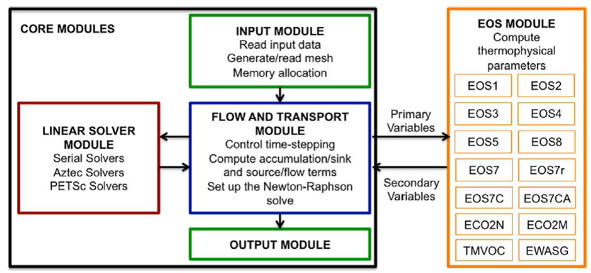
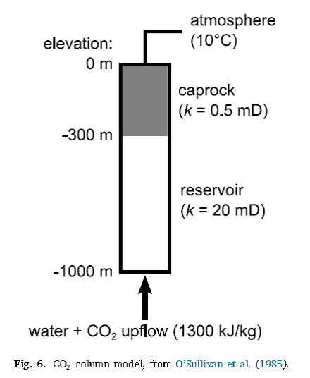
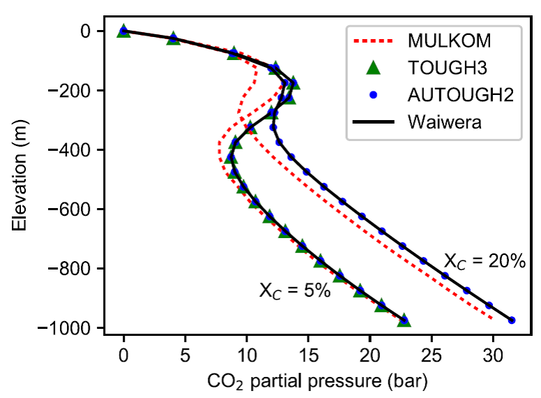
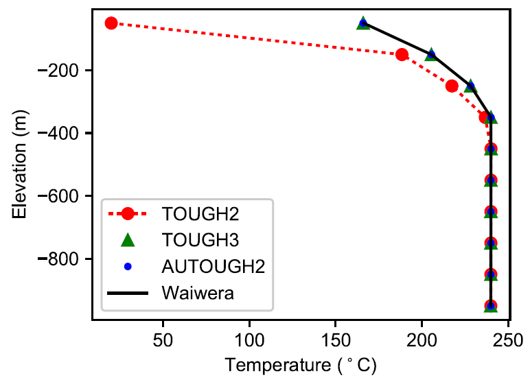

# Waiwera

地热油藏模拟已经发展了40多年，地热模拟着眼地下流动，尤其是多相高温流动。O\'Sullivan
et al.
(2001)综述了至1990年代以来的地热模拟的模型发展，大多数地热模型都是使用TOUGH2模拟器。

## TOUGH2_MP/TOUGH3简介

TOUGH2采用有限差分法离散计算域。

之前的各版本的TOUGH2，包括串行的TOUGH V2.1, TOUGH2_MP
V2.0及模拟器组件iTOUGH2 V7.1合并入TOUGH3。

通过增加与PETSc的接口(Balay et al., 2016），引入了新的非线性求解技术。

新的流体混合模块EOS：ECO2N, ...
设计用于模拟地质的CO~2~封存，需要求解高度非线性问题，这得益于TOUGH3的并行化。

ECO2N,
ECO2M用于模拟注射CO~2~到盐水含水层及多相流体、热传导和化学反应的耦合过程。EOS7C用于模拟注射CO~2~到天然气（甲烷）的存储层，...

TOUGH3采用有限差分法，笛卡尔网格。尚缺少并行化I/O。

Pollyea et al.
(2014)的储存层模拟由3D笛卡尔网格组成，计算域范围5000mx10000mx1800m，单个网格单元几何尺寸25mx50mx25m。

图1 TOUGH3的模块架构

## Waiwera的研发

非等温(non-isothermal)地下流动模拟器，如FEFLOW, OpenGeoSys,
COMSOL都用于地热模拟，但不具备boil and
condense的功能用于高温地热油藏模型。一些模型如FEHM, STARS,
ECLIPSE提供该功能，但尚未广泛用于地热模拟。因此，TOUGH2是地热油藏模拟的工业标准(O'Sullivan
and O'Sullivan, 2016)。

奥克兰大学维护AUTOUGH2的一个分支(Yeh et al.,
2012)，突出地热模拟功能，如相转换行为、地热、蒸汽场的产油与注水行为的模拟。TOUGH2_MP
(Zhang et al., 2003)与TOUGH3 (Jung et al.,
2017)并行化，但不包含AUTOUGH2的地热特征模拟功能。对于大规模模型（\>10^6^个单元），还需要TOUGH2与TOUGH3使用有格式的输入与输出文件。

地热油藏模拟运行收敛至恒定态数值解，使用自适应时间步至大时间步长，加速收敛，但会遇到收敛问题而计算失败，AUTOUGH2采取了一些措施(O'Sullivan
et al., 2013)。

模块化FORTRAN编程，TOUGH3引入一些FORTRAN95
module和动态内存分配特征，但大部分软件设计未改变。FORTRAN
2003和2008的面向对象编程。Waiwera采用面向对象的FORTRAN
2003编程及并行化，开源。

## Waiwera的控制方程

并行化地热流多相流模型，新西兰Auckland大学开发（2017, 2020）。

有限体积法，半离散的守恒方程（对于单元*V*~i~）可写作：

Waiwera在模拟域上求解质量守恒方程（以及能量守恒方程）。通常问题中有好几个质量"模块"，比如水喝CO~2~。对各质量模块求解单独的质量守恒方程。对非等温问题，还要同时求解质量守恒方程和额外的能量守恒方程

## PETSc库和并行化

Waiwera利用PETSc库的DMPlex数据结构，并行化处理非结构网格，包括网格输入（支持多种文件格式，例如GMSH,
CGNS,
ExodusII等）、区域分解、网格拓扑操作和创建分布式向量与矩阵。使用PETSc的Vec分布式向量数据结构存储液相、岩石、数值解和其他主要数据，以及并行进程间的虚拟区数据交换\"halo
exchange\"。所有进程间通信由PETSc库处理，通过MPI通信。

## 非线性方程求解

控制方程时间离散后形成非线性方程系统，每个时间步都要求解：

f(**Y**)=0

其中，函数**f**依赖于使用的时间步方法。该方程使用PETSc的SNES数据结构迭代求解，典型方法是Newton-Raphson方法（还有其他一些方法）。非线性求解器的雅克比矩阵，使用PETSc的Mat分布式矩阵数据结构，使用PETSc和有限差分法计算。

## 线性方程求解

在每个非线性求解器迭代步，必须求解一个稀疏线性方程组，对于大型问题，通常流体求解器将花费大部分计算时间在此步。Waiwera使用PETSc的KSP并行线性求解器和预处理套件，包括一系列针对地热问题（特别是恒定态模拟）中常遇到的ill-conditioned的线性系统求解。

## 输入和输出

使用标准的输入和输出文件格式，可使用脚本程序，便于前后处理。

主要的输入文件使用JSON格式，是一种灵活的、轻量级的、分层级的数据交换标准。

模拟结果使用HDF5格式，可保存大规模分级的科学数据。

还保存有YAML格式的单独的日志文件，包含模拟过程的诊断信息输出。

## 特性

高温地下水流的数值模拟，包括相变化。

共享式内存与分布式内存并行。

使用PETSc做并行化数据结构、线性和非线性求解器等。

标准的输入文件格式（JSON）和输出文件格式（HDF5, YAML）。

Fortran 2003结构化和面向对象编程。

免费、开源。

使用**Multiple Interacting Continua (MINC)方法**模拟裂隙介质。

输入输出。

## Benchmark

### 1D沸腾柱状和CO2柱状测试问题

收敛至恒定态。

CO~2~的恒定态分压剖面

最终的温度剖面分布

### 并行效率测试

strong
scaling。模拟简化的3D地热储层（5kmx4kmx3km深度），网格：80x64x160层，共819200个单元。

PETSc要获得满意的尺度化，建议求解问题规模至少每个进程有10000\~2000自由度。

### 完整尺度的产出模型

参考O'Sullivan et al., 2017
