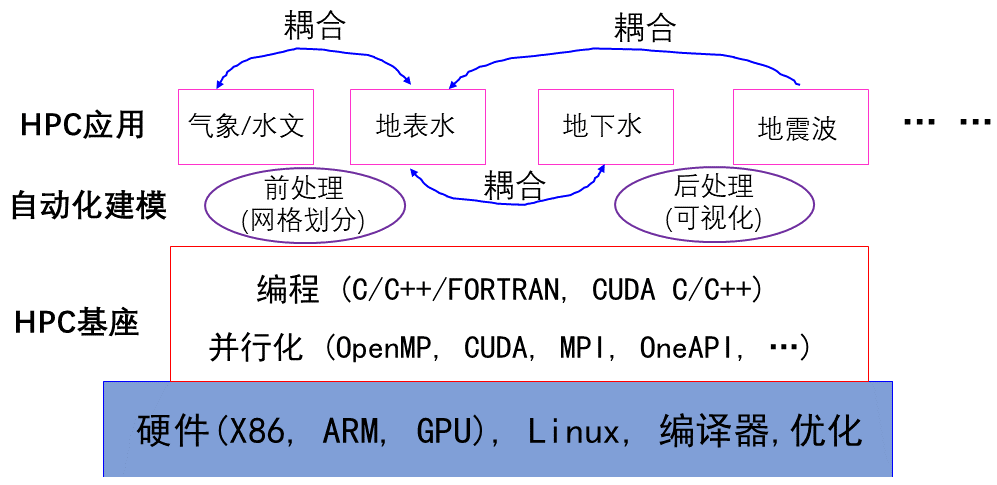

# OpenGeoModeller

## 介绍

地球科学模拟有很多[Awesome项目](https://gitee.com/lijian-cug/awesome-geosciences)，本仓库建立地球科学模式的工作流，包含：区域性气象模式、地表水、地下水、地震波正演等数学模式，以及相应的前后处理程序。

选择HPC应用程序的思考维度包括：(1) 前沿的数值算法；(2) 并行模式和计算效率；(3)模型的工业级应用能力；(4)可迁移性(可应用于不同架构的处理器)。

**仓库架构如图，基于[CFD算法](https://gitee.com/lijian-cug/cfd-course-cug)与计算机技术([CAD](https://gitee.com/lijian-cug/pre-surface-water),[HPC](https://gitee.com/lijian-cug/kunpeng-competition-2022)等)，将地球科学模拟统一在一个框架下，主要就是：前处理、编译运行和后处理可视化**

## 仓库建设内容

1.  Meterology: 数值气象预报(NWP)，WRF, RegCM
2.  SurfaceWater: 地表水(河流, 海洋)模拟及网格生成，SCHISM, telemac, shyfem, SUNTANS, DGSWE, dgswemv2, ADCIRC, WW3, CROCO, NEMO, firedrake, ...
3.  Porous-Media-Flow: 多孔介质流动，包括：地下水MODFLOW, MPLBM-UT, 黑油模式(OMP),水力压裂(GEOSX, VPFHF),地热模拟(waiwera), THMC模拟(OpenGeosys), ...
4.	Seismics-Interpretation: 地震数据处理与解释，OpendTect-6.6, Dave's JTK (Java)
5.  VirtualReality: 虚拟现实(VR), 在线可视化(In-situ), 集群图形渲染, ...
6.  HPC-Base: 高性能计算基座，包含：OpenMP, MPI, CUDA (GPGPU), OneAPI, HPX, ...
7.  ESM-Coupler: 地球系统模式+耦合器，包含：RegESM, ESMF, BMI, ...
8.  Geophysics: 地球物理正反演，OpenSWPC, Seissol, 层析成像TOMO3D, 全波形反演Devito, JUDI
9. ShallowWater: 浅水方程求解, Titan2d (滑坡), OP2-Volna(海啸-DSL), Triton (GPU-Flood), LISFLOOD-FP-8.0 (DG2-Flood)
10. Hydrology：基于物理机制的分布式水文模拟及其耦合模拟, PIHM, CHM, ParFLOW, GSFLOW, ...
11. Mesh-Generation: 非结构网格生成，是CFD建模过程中最耗时的步骤

## 仓库建设目标

1.  开源：摆脱商业软件的制约，实现工程问题求解的可重复操作
2.  高效：Python脚本自动化建模工作流，提高建模效率和可重复性
3.  高性能：多并行机制加速模拟，提高数值模拟时空分辨率
4.  系统性：实现不同介质耦合模拟，体现地球科学的系统性
5.  易用性：快速编译安装和运行，用于解决实际工程问题
6.  可操作性：完善的操作流程说明，实现"傻瓜操作"

## 安装教程

1.  参考各组件的文档说明
2.  基于Linux操作系统(Ubuntu 20.04 和 Huawei Euler OS)
3.  代码的编译bash脚本

## 合作与共赢

有对这个项目感兴趣的同仁，一块研究，提高地球科学数值模拟的研究。

作者简介：李健，QQ: 94207625        	email: jianli@cug.edu.cn   
		  [微信QR](./HPC-Base/QR-code.jpg)
