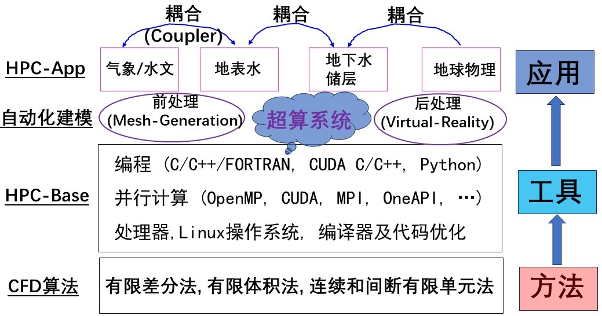

# OpenGeoModeller

## 介绍

地球科学模拟有很多[**Awesome项目**](https://gitee.com/lijian-cug/awesome-geosciences)，本仓库建立地球科学模式的工作流，包含：区域性气象模式、地表水、地下水、地震波正演等数学模式，以及相应的前后处理程序。

选择HPC应用程序的思考维度包括：
(1) 前沿的数值算法；
(2) 并行模式和计算效率；
(3) 模型的工业级应用能力；
(4) 可迁移性(可应用于不同架构的处理器)。

即：**Performance-Productivity-Portability**

仓库架构如下图，目的是将地球科学模拟统一在一个框架下，主要就是**前处理、编译运行和后处理可视化**

## 学习路线

[**工程流体力学**](https://gitee.com/lijian-cug/fluid-dynamics-course-cug)  -> 
[**CFD基础算法**](https://gitee.com/lijian-cug/cfd-course-cug) -> 
[**计算机辅助设计(CAD)**](https://gitee.com/lijian-cug/pre-surface-water) -> 
[**高性能计算基座**](https://gitee.com/lijian-cug/kunpeng-competition-2022) ->
[**地球科学的awesome项目**](https://gitee.com/lijian-cug/awesome-geosciences) ->
[**海洋模拟**](https://gitee.com/lijian-cug/ocean-modeling-course-cug) ->
 -> Geosciences for the Future

## 仓库建设内容

1.  Meterology: 数值气象预报(NWP), 包括：WRF和RegCM.
2.  SurfaceWater: 地表水(河流, 海洋)模式, 包括：SCHISM, telemac, shyfem, SUNTANS, DGSWE, dgswemv2, ADCIRC, WW3, CROCO, NEMO, firedrake, ...
3.  Underground: 地下流动, 包括：MODFLOW6, MPLBM-UT, OpenPorousMedia,GEOSX,waiwera, OpenGeosys, ...
4.	Geological-Modelling: 地质建模, 包含：地震数据处理与解释(OpendTect), 隐式地质建模(Gempy, LoopStructural).
5.  VirtualReality: 可视化后处理, 包括: 虚拟现实(VR), 原位可视化, 集群图形渲染, ...
6.  HPC-Base: 高性能计算基座: git clone --recursive https://gitee.com/lijian-cug/open-geo-modeller
7.  ESM-Coupler: 地球系统模式+耦合器, 包含：RegESM, ESMF, BMI, ...
8.  Geophysics: 地球物理正反演, OpenSWPC, Seissol, FWI-Devito, JUDI, 基于Firedrake的FWI-sypro
9. ShallowWater: 浅水方程求解, Titan2d, OP2-Volna, Triton (GPU-Flood), LISFLOOD-FP-8.0 (DG2-Flood)
10. Hydrology：分布式水文模拟, PIHM, CHM, ParFLOW, GSFLOW, ...
11. Meshing: 网格生成(前处理), 是CFD建模过程中最耗时的步骤.
12. Turbulence: 基于精细湍流模拟的应用, 如DNS, LES, OpenFOAM, DAFOAM等.

## 仓库建设目标

1.  开源：摆脱商业软件的制约, 实现工程问题求解的可重复操作.
2.  高效：Python脚本自动化建模工作流, 提高建模效率和可重复性.
3.  高性能：多并行机制加速模拟, 提高数值模拟时空分辨率.
4.  系统性：实现不同介质耦合模拟, 体现地球科学的系统性.
5.  易用性：快速编译安装和运行, 用于解决实际工程问题.
6.  可操作性：完善的操作流程说明, 实现"傻瓜操作".
7.  引导性：帮助初学者和研发人员, 快速找到他们需要的知识和工具.

## [B站视频教程](https://space.bilibili.com/581683925/video)

## 实施效果展示

1.  [集群硬件平台](https://gitee.com/lijian-cug/hpc-base/blob/master/Ubuntu20.04-Cluster/我的集群照片.jpg)
2.  [CPU集群监控界面](https://gitee.com/lijian-cug/hpc-base/blob/master/Ubuntu20.04-Cluster/media/image7.png)
3.  [GPU集群监控界面](https://gitee.com/lijian-cug/hpc-base/blob/master/Ubuntu20.04-Cluster/media/image13.png)
4.  [高性能计算部署](https://gitee.com/lijian-cug/hpc-base/blob/master/opengeomodeller-build.png)

## 合作与共赢

有对这个项目感兴趣的同仁, 一块研究, 提高地球科学数值模拟的研究.

作者简介：李健，QQ: 94207625        	email: jianli@cug.edu.cn   
		  [微信QR](https://gitee.com/lijian-cug/hpc-base/blob/master/QR-code.png)
